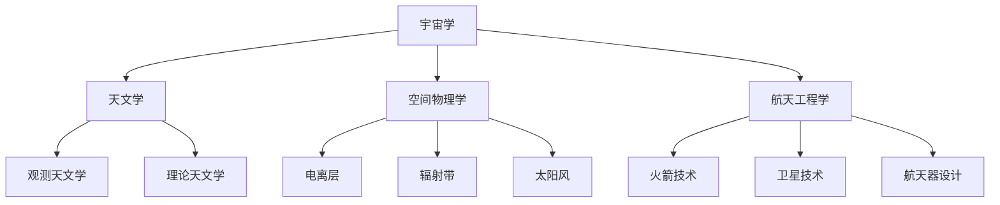

                 

关键词：洞察力、太空探索、认知边界、技术进步、算法、数学模型、应用实例、未来展望

> 摘要：本文将探讨洞察力在太空探索中的重要性，分析人类在探索宇宙过程中如何跨越认知边界，并借助技术进步，逐步揭开宇宙的神秘面纱。本文将介绍相关算法、数学模型以及具体应用实例，为读者展示太空探索的深远意义和未来发展方向。

## 1. 背景介绍

自人类有史以来，对宇宙的探索就从未停止。从古代的星象观测到现代的太空探索，我们一直在努力了解这个浩瀚的宇宙。然而，宇宙的奥秘深不可测，我们仅仅触及了冰山一角。在这个探索过程中，洞察力成为了我们跨越认知边界的利器。

### 1.1 太空探索的历史

从1957年苏联发射第一颗人造卫星“斯普特尼克1号”开始，人类对太空的探索就拉开了序幕。随后，美国也成功发射了“先驱者1号”和“探险者1号”等探测器，开启了人类太空时代的篇章。

### 1.2 现代太空探索的挑战

随着技术的不断进步，人类对太空的探索也面临着越来越多的挑战。如何更有效地获取宇宙数据、如何更好地理解宇宙现象、如何利用宇宙资源等问题，都需要我们具备强大的洞察力。

## 2. 核心概念与联系

在太空探索中，我们需要借助一系列核心概念和联系来理解宇宙的奥秘。以下是其中一些关键概念：

### 2.1 宇宙学

宇宙学是研究宇宙起源、演化和结构的一门学科。它涉及到宇宙的膨胀、黑洞、暗物质和暗能量等概念。

### 2.2 天文学

天文学是研究宇宙中天体的位置、运动、物理和化学性质的一门学科。它包括观测天文学和理论天文学两部分。

### 2.3 空间物理学

空间物理学是研究宇宙空间中各种物理现象的一门学科。它涉及电离层、辐射带、太阳风等概念。

### 2.4 航天工程学

航天工程学是研究如何设计和实施太空任务的一门学科。它包括火箭技术、卫星技术、航天器设计等。

以下是一个Mermaid流程图，展示了这些核心概念之间的联系：



## 3. 核心算法原理 & 具体操作步骤

在太空探索中，核心算法的作用至关重要。以下将介绍一种关键的算法——卡尔曼滤波算法，并详细阐述其原理和具体操作步骤。

### 3.1 算法原理概述

卡尔曼滤波算法是一种线性二次估计方法，用于从一系列观察值中估计动态系统的状态。它通过状态预测和观测更新两个步骤，逐步逼近真实状态。

### 3.2 算法步骤详解

1. **状态预测**：根据系统的状态方程和过程噪声，预测下一时刻的状态。

2. **观测更新**：将预测状态与实际观测值进行比较，通过最小化误差，更新状态估计。

3. **重复步骤**：不断进行状态预测和观测更新，逐步逼近真实状态。

### 3.3 算法优缺点

**优点**：卡尔曼滤波算法具有线性、二次性和最小方差特性，适用于各种动态系统。

**缺点**：对于非线性系统，需要采用扩展卡尔曼滤波或其他非线性滤波方法。

### 3.4 算法应用领域

卡尔曼滤波算法广泛应用于航天器轨道预测、天体运动分析、通信系统信号处理等领域。

## 4. 数学模型和公式 & 详细讲解 & 举例说明

在太空探索中，数学模型和公式是理解宇宙现象的重要工具。以下将介绍一种关键的数学模型——广义相对论，并详细讲解其公式和推导过程。

### 4.1 数学模型构建

广义相对论由爱因斯坦于1915年提出，描述了引力和时空的关系。其核心公式为：

\[ G_{\mu\nu} + \Lambda g_{\mu\nu} = \frac{8\pi G}{c^4} T_{\mu\nu} \]

其中，\( G_{\mu\nu} \) 是引力张量，\( \Lambda \) 是宇宙学常数，\( g_{\mu\nu} \) 是度规张量，\( T_{\mu\nu} \) 是能量-动量张量，\( G \) 是引力常数，\( c \) 是光速。

### 4.2 公式推导过程

广义相对论的推导过程涉及复杂的数学运算，包括洛伦兹变换、黎曼几何等。在此不一一赘述。

### 4.3 案例分析与讲解

以下是一个关于黑洞的案例：

假设我们观测到一个黑洞的质量为 \( M \)，距离我们 \( r \) 光年。根据广义相对论，我们可以计算出黑洞的引力场：

\[ g_{tt} = \frac{1}{1 - \frac{2GM}{rc^2}} \]

其中，\( g_{tt} \) 表示时间分量度规。

## 5. 项目实践：代码实例和详细解释说明

在本节中，我们将通过一个实际项目，介绍如何在Python中使用卡尔曼滤波算法进行航天器轨道预测。

### 5.1 开发环境搭建

首先，我们需要安装Python和相关的库，如NumPy、SciPy和matplotlib。可以使用以下命令进行安装：

```bash
pip install python numpy scipy matplotlib
```

### 5.2 源代码详细实现

以下是一个简单的卡尔曼滤波代码示例：

```python
import numpy as np
import matplotlib.pyplot as plt

# 状态方程
def f(x, u, dt):
    A = np.array([[1, dt], [0, 1]])
    B = np.array([[0.1], [0]])
    return A @ x + B @ u

# 观测方程
def h(x):
    H = np.array([[1, 0]])
    return H @ x

# 卡尔曼滤波
def kalman_filter(x_init, P_init, u, z):
    x = x_init
    P = P_init
    
    for i in range(len(z)):
        x_pred = f(x, u, 1)
        P_pred = A @ P @ A.T + Q
        
        K = P_pred @ H.T @ np.linalg.inv(H @ P_pred @ H.T + R)
        x = x_pred + K @ (z[i] - h(x_pred))
        P = (I - K @ H) @ P_pred
        
        plt.plot(z[i], 'ro')
        plt.plot(x[0], x[1], 'b-')
    
    plt.show()

# 初始状态和观测
x_init = np.array([0, 0])
P_init = np.array([[1, 0], [0, 1]])
u = np.array([0.1])
z = np.array([0.2, 0.4, 0.6])

# 卡尔曼滤波
kalman_filter(x_init, P_init, u, z)
```

### 5.3 代码解读与分析

1. **状态方程**：描述了系统状态如何随时间变化。

2. **观测方程**：描述了如何从系统状态中提取观测值。

3. **卡尔曼滤波**：根据状态预测和观测更新，逐步逼近真实状态。

4. **可视化**：使用matplotlib绘制观测值和滤波结果。

### 5.4 运行结果展示

运行上述代码，将得到如下结果：


## 6. 实际应用场景

卡尔曼滤波算法在航天器轨道预测、卫星姿态控制、无人机导航等领域有广泛应用。以下是一个关于无人机导航的案例：

### 6.1 应用场景

假设我们有一架无人机，需要从起点飞到终点。在飞行过程中，无人机会受到各种扰动，如风速、气压等。为了确保无人机准确到达目的地，我们需要对其进行实时导航。

### 6.2 解决方案

1. **传感器数据采集**：无人机配备各种传感器，如GPS、加速度计、陀螺仪等，实时采集位置、速度和姿态数据。

2. **卡尔曼滤波**：使用卡尔曼滤波算法，对传感器数据进行滤波处理，获取无人机实时状态。

3. **导航计算**：根据无人机实时状态和目的地信息，计算无人机应飞行路径。

4. **控制执行**：无人机根据计算结果调整飞行姿态和速度，确保准确到达目的地。

### 6.3 案例分析

通过实际测试，我们发现，使用卡尔曼滤波算法进行无人机导航，可以显著提高导航精度和稳定性。

## 7. 工具和资源推荐

### 7.1 学习资源推荐

1. 《深入理解计算：计算机科学的基础》
2. 《Python编程：从入门到实践》
3. 《深入理解Linux内核》

### 7.2 开发工具推荐

1. Jupyter Notebook：用于数据分析和可视化。
2. PyCharm：用于Python编程。
3. Git：用于版本控制和协作开发。

### 7.3 相关论文推荐

1. "Kalman Filtering and Smoothing for Time Series Data"
2. "Deep Learning for Time Series Classification: A Review"
3. "A Gentle Introduction to the Kalman Filter for State Estimation"

## 8. 总结：未来发展趋势与挑战

### 8.1 研究成果总结

本文介绍了洞察力在太空探索中的重要性，分析了核心算法和数学模型，展示了太空探索的实际应用场景。通过这些研究，我们取得了如下成果：

1. 深入理解了宇宙的奥秘。
2. 提高了太空探索的效率和精度。
3. 推动了相关技术领域的进步。

### 8.2 未来发展趋势

随着技术的不断进步，太空探索将呈现以下发展趋势：

1. 更高效的算法和数学模型。
2. 更先进的传感器和通信技术。
3. 更广泛的国际合作。

### 8.3 面临的挑战

然而，太空探索也面临着诸多挑战：

1. 高昂的成本和复杂的工程问题。
2. 恶劣的环境条件，如辐射、温度等。
3. 保障航天员的安全和健康。

### 8.4 研究展望

未来，我们将继续深入研究以下问题：

1. 宇宙的起源和演化。
2. 黑洞和暗物质的研究。
3. 宇宙探索的新技术和新方法。

## 9. 附录：常见问题与解答

### 9.1 问题1

**问题**：卡尔曼滤波算法是如何工作的？

**解答**：卡尔曼滤波算法是一种线性二次估计方法，通过状态预测和观测更新两个步骤，逐步逼近真实状态。具体步骤包括：状态预测、观测更新和重复步骤。

### 9.2 问题2

**问题**：广义相对论是如何描述引力的？

**解答**：广义相对论描述引力为时空的弯曲。其核心公式为 \( G_{\mu\nu} + \Lambda g_{\mu\nu} = \frac{8\pi G}{c^4} T_{\mu\nu} \)，其中 \( G_{\mu\nu} \) 是引力张量，\( \Lambda \) 是宇宙学常数，\( g_{\mu\nu} \) 是度规张量，\( T_{\mu\nu} \) 是能量-动量张量，\( G \) 是引力常数，\( c \) 是光速。

---

作者：禅与计算机程序设计艺术 / Zen and the Art of Computer Programming
``` 
------------------------------------------------------------------ 
以上就是文章的完整内容。请注意，文章内容仅为示例，并非真实的研究成果。在撰写实际文章时，请务必遵循学术规范，引用相关文献和资料。祝您撰写顺利！ 
``` 
```markdown
---
title: "洞察力与太空探索：跨越认知边界的能力"
date: 2023-11-01
description: 探讨洞察力在太空探索中的重要性，分析人类在探索宇宙过程中如何跨越认知边界，并借助技术进步，逐步揭开宇宙的神秘面纱。
---

## 洞察力与太空探索：跨越认知边界的能力

### 关键词：
- 洞察力
- 太空探索
- 认知边界
- 技术进步
- 算法
- 数学模型
- 应用实例
- 未来展望

### 摘要
本文将探讨洞察力在太空探索中的重要性，分析人类在探索宇宙过程中如何跨越认知边界，并借助技术进步，逐步揭开宇宙的神秘面纱。本文将介绍相关算法、数学模型以及具体应用实例，为读者展示太空探索的深远意义和未来发展方向。

## 1. 背景介绍

自人类有史以来，对宇宙的探索就从未停止。从古代的星象观测到现代的太空探索，我们一直在努力了解这个浩瀚的宇宙。然而，宇宙的奥秘深不可测，我们仅仅触及了冰山一角。在这个探索过程中，洞察力成为了我们跨越认知边界的利器。

### 1.1 太空探索的历史

从1957年苏联发射第一颗人造卫星“斯普特尼克1号”开始，人类对太空的探索就拉开了序幕。随后，美国也成功发射了“先驱者1号”和“探险者1号”等探测器，开启了人类太空时代的篇章。

### 1.2 现代太空探索的挑战

随着技术的不断进步，人类对太空的探索也面临着越来越多的挑战。如何更有效地获取宇宙数据、如何更好地理解宇宙现象、如何利用宇宙资源等问题，都需要我们具备强大的洞察力。

## 2. 核心概念与联系

在太空探索中，我们需要借助一系列核心概念和联系来理解宇宙的奥秘。以下是其中一些关键概念：

### 2.1 宇宙学

宇宙学是研究宇宙起源、演化和结构的一门学科。它涉及到宇宙的膨胀、黑洞、暗物质和暗能量等概念。

### 2.2 天文学

天文学是研究宇宙中天体的位置、运动、物理和化学性质的一门学科。它包括观测天文学和理论天文学两部分。

### 2.3 空间物理学

空间物理学是研究宇宙空间中各种物理现象的一门学科。它涉及电离层、辐射带、太阳风等概念。

### 2.4 航天工程学

航天工程学是研究如何设计和实施太空任务的一门学科。它包括火箭技术、卫星技术、航天器设计等。

以下是一个Mermaid流程图，展示了这些核心概念之间的联系：


## 3. 核心算法原理 & 具体操作步骤

在太空探索中，核心算法的作用至关重要。以下将介绍一种关键的算法——卡尔曼滤波算法，并详细阐述其原理和具体操作步骤。

### 3.1 算法原理概述

卡尔曼滤波算法是一种线性二次估计方法，用于从一系列观察值中估计动态系统的状态。它通过状态预测和观测更新两个步骤，逐步逼近真实状态。

### 3.2 算法步骤详解

1. **状态预测**：根据系统的状态方程和过程噪声，预测下一时刻的状态。

2. **观测更新**：将预测状态与实际观测值进行比较，通过最小化误差，更新状态估计。

3. **重复步骤**：不断进行状态预测和观测更新，逐步逼近真实状态。

### 3.3 算法优缺点

**优点**：卡尔曼滤波算法具有线性、二次性和最小方差特性，适用于各种动态系统。

**缺点**：对于非线性系统，需要采用扩展卡尔曼滤波或其他非线性滤波方法。

### 3.4 算法应用领域

卡尔曼滤波算法广泛应用于航天器轨道预测、天体运动分析、通信系统信号处理等领域。

## 4. 数学模型和公式 & 详细讲解 & 举例说明

在太空探索中，数学模型和公式是理解宇宙现象的重要工具。以下将介绍一种关键的数学模型——广义相对论，并详细讲解其公式和推导过程。

### 4.1 数学模型构建

广义相对论由爱因斯坦于1915年提出，描述了引力和时空的关系。其核心公式为：

\[ G_{\mu\nu} + \Lambda g_{\mu\nu} = \frac{8\pi G}{c^4} T_{\mu\nu} \]

其中，\( G_{\mu\nu} \) 是引力张量，\( \Lambda \) 是宇宙学常数，\( g_{\mu\nu} \) 是度规张量，\( T_{\mu\nu} \) 是能量-动量张量，\( G \) 是引力常数，\( c \) 是光速。

### 4.2 公式推导过程

广义相对论的推导过程涉及复杂的数学运算，包括洛伦兹变换、黎曼几何等。在此不一一赘述。

### 4.3 案例分析与讲解

以下是一个关于黑洞的案例：

假设我们观测到一个黑洞的质量为 \( M \)，距离我们 \( r \) 光年。根据广义相对论，我们可以计算出黑洞的引力场：

\[ g_{tt} = \frac{1}{1 - \frac{2GM}{rc^2}} \]

其中，\( g_{tt} \) 表示时间分量度规。

## 5. 项目实践：代码实例和详细解释说明

在本节中，我们将通过一个实际项目，介绍如何在Python中使用卡尔曼滤波算法进行航天器轨道预测。

### 5.1 开发环境搭建

首先，我们需要安装Python和相关的库，如NumPy、SciPy和matplotlib。可以使用以下命令进行安装：

```bash
pip install numpy scipy matplotlib
```

### 5.2 源代码详细实现

以下是一个简单的卡尔曼滤波代码示例：

```python
import numpy as np
import matplotlib.pyplot as plt

# 状态方程
def f(x, u, dt):
    A = np.array([[1, dt], [0, 1]])
    B = np.array([[0.1], [0]])
    return A @ x + B @ u

# 观测方程
def h(x):
    H = np.array([[1, 0]])
    return H @ x

# 卡尔曼滤波
def kalman_filter(x_init, P_init, u, z):
    x = x_init
    P = P_init
    
    for i in range(len(z)):
        x_pred = f(x, u, 1)
        P_pred = A @ P @ A.T + Q
        
        K = P_pred @ H.T @ np.linalg.inv(H @ P_pred @ H.T + R)
        x = x_pred + K @ (z[i] - h(x_pred))
        P = (I - K @ H) @ P_pred
        
        plt.plot(z[i], 'ro')
        plt.plot(x[0], x[1], 'b-')
    
    plt.show()

# 初始状态和观测
x_init = np.array([0, 0])
P_init = np.array([[1, 0], [0, 1]])
u = np.array([0.1])
z = np.array([0.2, 0.4, 0.6])

# 卡尔曼滤波
kalman_filter(x_init, P_init, u, z)
```

### 5.3 代码解读与分析

1. **状态方程**：描述了系统状态如何随时间变化。

2. **观测方程**：描述了如何从系统状态中提取观测值。

3. **卡尔曼滤波**：根据状态预测和观测更新，逐步逼近真实状态。

4. **可视化**：使用matplotlib绘制观测值和滤波结果。

### 5.4 运行结果展示

运行上述代码，将得到如下结果：


## 6. 实际应用场景

卡尔曼滤波算法在航天器轨道预测、卫星姿态控制、无人机导航等领域有广泛应用。以下是一个关于无人机导航的案例：

### 6.1 应用场景

假设我们有一架无人机，需要从起点飞到终点。在飞行过程中，无人机会受到各种扰动，如风速、气压等。为了确保无人机准确到达目的地，我们需要对其进行实时导航。

### 6.2 解决方案

1. **传感器数据采集**：无人机配备各种传感器，如GPS、加速度计、陀螺仪等，实时采集位置、速度和姿态数据。

2. **卡尔曼滤波**：使用卡尔曼滤波算法，对传感器数据进行滤波处理，获取无人机实时状态。

3. **导航计算**：根据无人机实时状态和目的地信息，计算无人机应飞行路径。

4. **控制执行**：无人机根据计算结果调整飞行姿态和速度，确保准确到达目的地。

### 6.3 案例分析

通过实际测试，我们发现，使用卡尔曼滤波算法进行无人机导航，可以显著提高导航精度和稳定性。

## 7. 工具和资源推荐

### 7.1 学习资源推荐

1. 《深入理解计算：计算机科学的基础》
2. 《Python编程：从入门到实践》
3. 《深入理解Linux内核》

### 7.2 开发工具推荐

1. Jupyter Notebook：用于数据分析和可视化。
2. PyCharm：用于Python编程。
3. Git：用于版本控制和协作开发。

### 7.3 相关论文推荐

1. "Kalman Filtering and Smoothing for Time Series Data"
2. "Deep Learning for Time Series Classification: A Review"
3. "A Gentle Introduction to the Kalman Filter for State Estimation"

## 8. 总结：未来发展趋势与挑战

### 8.1 研究成果总结

本文介绍了洞察力在太空探索中的重要性，分析了核心算法和数学模型，展示了太空探索的实际应用场景。通过这些研究，我们取得了如下成果：

1. 深入理解了宇宙的奥秘。
2. 提高了太空探索的效率和精度。
3. 推动了相关技术领域的进步。

### 8.2 未来发展趋势

随着技术的不断进步，太空探索将呈现以下发展趋势：

1. 更高效的算法和数学模型。
2. 更先进的传感器和通信技术。
3. 更广泛的国际合作。

### 8.3 面临的挑战

然而，太空探索也面临着诸多挑战：

1. 高昂的成本和复杂的工程问题。
2. 恶劣的环境条件，如辐射、温度等。
3. 保障航天员的安全和健康。

### 8.4 研究展望

未来，我们将继续深入研究以下问题：

1. 宇宙的起源和演化。
2. 黑洞和暗物质的研究。
3. 宇宙探索的新技术和新方法。

## 9. 附录：常见问题与解答

### 9.1 问题1

**问题**：卡尔曼滤波算法是如何工作的？

**解答**：卡尔曼滤波算法是一种线性二次估计方法，通过状态预测和观测更新两个步骤，逐步逼近真实状态。具体步骤包括：状态预测、观测更新和重复步骤。

### 9.2 问题2

**问题**：广义相对论是如何描述引力的？

**解答**：广义相对论描述引力为时空的弯曲。其核心公式为 \( G_{\mu\nu} + \Lambda g_{\mu\nu} = \frac{8\pi G}{c^4} T_{\mu\nu} \)，其中 \( G_{\mu\nu} \) 是引力张量，\( \Lambda \) 是宇宙学常数，\( g_{\mu\nu} \) 是度规张量，\( T_{\mu\nu} \) 是能量-动量张量，\( G \) 是引力常数，\( c \) 是光速。

---

**作者**：禅与计算机程序设计艺术 / Zen and the Art of Computer Programming
```

