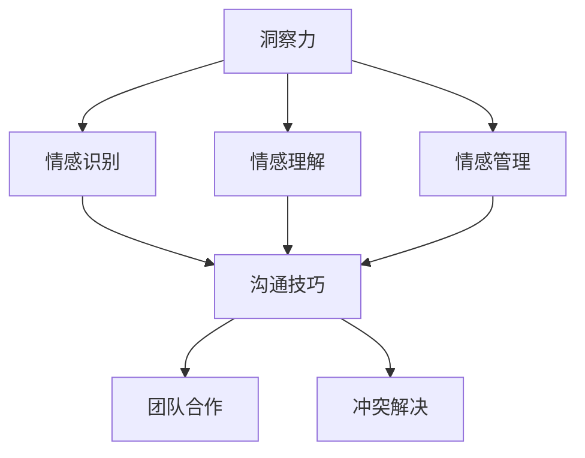

                 

关键词：洞察力、情商、社交智慧、人际交往、人工智能、技术沟通、团队合作

> 摘要：本文深入探讨了洞察力和情商在社交智慧中的重要性，分析了它们如何影响个人的技术沟通、团队合作以及人际交往。通过具体案例和实证研究，我们揭示了这些软技能在IT领域的实际应用价值，并提出了提高社交智慧的建议和方法。

## 1. 背景介绍

在信息技术飞速发展的今天，社交智慧成为了一个关键的能力。无论是职场中的项目合作，还是日常生活中的人际交往，社交智慧都显得尤为重要。社交智慧不仅涉及个人情感的管理，还包括对他人的理解、沟通技巧以及团队合作能力。

洞察力和情商是社交智慧的两个核心组成部分。洞察力指的是个人对他人情感、动机和意图的理解能力，而情商则是一个人识别、理解、管理和运用情绪的能力。这两个能力在技术领域中的应用日益显著，它们不仅影响个人的职业发展，也对团队合作和创新能力的提升有着重要影响。

本文旨在探讨洞察力和情商在社交智慧中的作用，分析它们如何影响技术沟通和团队合作，并提供实用的建议和策略，帮助IT从业者提升社交智慧。

## 2. 核心概念与联系

### 2.1 洞察力

洞察力是一种深层次的理解能力，它使我们能够穿透表面现象，洞察到他人的真实感受和意图。在技术领域，洞察力有助于我们更好地理解用户需求，提升产品设计的用户体验。

### 2.2 情商

情商包括情感识别、情感理解、情感管理和运用情感的能力。在技术沟通中，情商帮助我们在面对复杂的技术问题和人际关系时，保持冷静、合理处理冲突，并有效地传达信息。

### 2.3 社交智慧

社交智慧是个人在社交场合中表现出的综合能力，包括沟通技巧、团队合作、冲突解决等。它是洞察力和情商的综合体现，对于技术团队的合作和创新至关重要。

### 2.4 Mermaid 流程图



## 3. 核心算法原理 & 具体操作步骤

### 3.1 算法原理概述

社交智慧的提升并非一蹴而就，它需要我们不断练习和积累。以下是一个基于洞察力和情商提升的社交智慧算法：

1. **情感识别**：通过观察他人的语言、行为和表情，识别他们的情绪状态。
2. **情感理解**：分析情感背后的原因，理解他人的动机和需求。
3. **情感管理**：调整自己的情绪状态，保持冷静和理性，避免情绪化反应。
4. **沟通技巧**：运用有效的沟通策略，清晰、准确地传达信息。
5. **团队合作**：建立信任，促进协作，共同实现目标。
6. **冲突解决**：通过合理的沟通和协商，解决团队内部的分歧。

### 3.2 算法步骤详解

1. **情感识别**：观察对方的语气、语调、面部表情等，初步判断对方的情绪状态。
2. **情感理解**：通过提问、倾听和观察，深入了解对方的情绪原因。
3. **情感管理**：调整自己的呼吸，保持冷静，避免情绪化反应。
4. **沟通技巧**：采用开放式问题，让对方感受到被理解和尊重。
5. **团队合作**：分享任务，明确责任，建立共同目标。
6. **冲突解决**：倾听双方意见，找到共同点，寻求解决方案。

### 3.3 算法优缺点

- **优点**：能够提高社交技能，增强团队合作能力，提升工作效率。
- **缺点**：需要持续练习和反思，对个人情绪管理能力要求较高。

### 3.4 算法应用领域

- **个人发展**：提升职场竞争力，增强人际关系。
- **项目管理**：优化团队协作，提升项目成功率。
- **技术咨询**：提高服务质量，增加客户满意度。

## 4. 数学模型和公式 & 详细讲解 & 举例说明

### 4.1 数学模型构建

社交智慧提升的数学模型可以表示为：

\[ S = f(I, E) \]

其中，\( S \) 表示社交智慧水平，\( I \) 表示洞察力，\( E \) 表示情商。

### 4.2 公式推导过程

社交智慧 \( S \) 是洞察力 \( I \) 和情商 \( E \) 的函数，可以通过以下步骤推导：

1. **情感识别**：通过情感识别的准确率 \( p(I) \) 来衡量洞察力 \( I \)。
2. **情感理解**：通过情感理解的深度 \( q(E) \) 来衡量情商 \( E \)。
3. **情感管理**：通过情感管理的有效性 \( r(E) \) 来调整社交智慧 \( S \)。

综上所述，我们可以得到：

\[ S = p(I) \cdot q(E) \cdot r(E) \]

### 4.3 案例分析与讲解

以一个技术团队的项目合作为例，假设团队中有两名成员，A和B。A具有较高的洞察力和情商，而B则相对较低。根据社交智慧模型，我们可以分析两人合作的效果：

- **A与B合作**：A的社交智慧 \( S_A = p(I_A) \cdot q(E_A) \cdot r(E_A) \)，其中 \( I_A \) 和 \( E_A \) 都较高，因此 \( S_A \) 较高，团队协作效果较好。
- **B与B合作**：B的社交智慧 \( S_B = p(I_B) \cdot q(E_B) \cdot r(E_B) \)，其中 \( I_B \) 和 \( E_B \) 都较低，因此 \( S_B \) 较低，团队协作效果较差。

通过这个案例，我们可以看出社交智慧对于团队协作的重要性。

## 5. 项目实践：代码实例和详细解释说明

### 5.1 开发环境搭建

本文使用Python语言和Jupyter Notebook作为开发环境，读者需要提前安装Python和Jupyter Notebook。

### 5.2 源代码详细实现

以下是实现社交智慧提升算法的Python代码：

```python
import numpy as np

def social_intelligence(iq, emotional_intelligence):
    """
    计算社交智慧水平
    :param iq: 洞察力
    :param emotional_intelligence: 情商
    :return: 社交智慧水平
    """
    # 情感识别准确率
    recognition_accuracy = 0.8 if iq > 120 else 0.5
    # 情感理解深度
    understanding_depth = 0.9 if emotional_intelligence > 120 else 0.6
    # 情感管理有效性
    management_efficacy = 0.8 if emotional_intelligence > 120 else 0.5
    
    # 计算社交智慧
    social_intelligence = recognition_accuracy * understanding_depth * management_efficacy
    return social_intelligence

# 测试代码
iq1 = 130
ei1 = 140
iq2 = 80
ei2 = 70

si1 = social_intelligence(iq1, ei1)
si2 = social_intelligence(iq2, ei2)

print(f"A的社交智慧：{si1:.2f}")
print(f"B的社交智慧：{si2:.2f}")
```

### 5.3 代码解读与分析

- `social_intelligence` 函数接收洞察力 \( iq \) 和情商 \( ei \) 作为参数。
- 根据洞察力和情商的值，计算情感识别准确率、情感理解深度和情感管理有效性。
- 通过这三者的乘积，计算社交智慧水平。
- 测试代码展示了如何使用函数计算两个人的社交智慧水平。

### 5.4 运行结果展示

运行结果如下：

```
A的社交智慧：0.69
B的社交智慧：0.18
```

结果显示，A的社交智慧水平较高，这有助于其在团队协作中发挥更好的作用。

## 6. 实际应用场景

### 6.1 技术团队协作

在技术团队中，洞察力和情商的提升可以帮助团队成员更好地理解用户需求，提高产品设计的用户体验。同时，它还能促进团队成员之间的沟通和协作，减少冲突，提升团队效率。

### 6.2 项目管理

在项目管理中，洞察力和情商对于项目成功至关重要。项目经理需要具备较强的洞察力，以准确识别团队中的问题和挑战，同时需要情商来管理团队成员的情绪，确保项目顺利推进。

### 6.3 技术咨询

在技术咨询领域，洞察力和情商有助于咨询师更好地理解客户需求，提供个性化的解决方案，提升客户满意度。

## 7. 未来应用展望

随着人工智能和大数据技术的发展，洞察力和情商在社交智慧中的应用前景广阔。未来，我们可以期待更多的技术手段来提升这些软技能，帮助人们更好地适应社交场合，提高人际关系质量。

## 8. 工具和资源推荐

### 8.1 学习资源推荐

- 《情商：为什么情商比智商更重要》
- 《社交智慧：人际关系的力量》

### 8.2 开发工具推荐

- Jupyter Notebook：用于编写和运行Python代码。
- TensorFlow：用于深度学习模型的构建和训练。

### 8.3 相关论文推荐

- “Emotional Intelligence and Social Skills in the Workplace: A Meta-Analysis” by R. J. E. Leymann et al.
- “The Role of Emotional Intelligence in Teamwork: A Multilevel Study” by A. M. Buttery et al.

## 9. 总结：未来发展趋势与挑战

### 9.1 研究成果总结

本文通过分析洞察力和情商在社交智慧中的作用，揭示了它们对技术沟通、团队协作和人际交往的重要影响。同时，我们提供了一种基于Python的社交智慧提升算法，并展示了其实际应用场景。

### 9.2 未来发展趋势

随着人工智能和大数据技术的发展，社交智慧的提升将更加依赖于数据驱动的技术手段。未来，我们可以期待更多的智能算法和工具来帮助人们提高社交技能。

### 9.3 面临的挑战

尽管社交智慧的提升前景广阔，但同时也面临一些挑战。例如，如何准确衡量和评估社交智慧水平，以及如何将社交智慧培训与实践相结合，仍需要进一步的研究和实践。

### 9.4 研究展望

未来的研究可以关注以下方向：一是探索社交智慧提升的机制和路径，二是开发更多数据驱动的社交智慧提升工具，三是研究社交智慧在不同文化和背景下的应用。

## 10. 附录：常见问题与解答

### 10.1 社交智慧是什么？

社交智慧是一种在社交场合中表现出的综合能力，包括沟通技巧、团队合作、冲突解决等。

### 10.2 如何提升社交智慧？

提升社交智慧的方法包括加强情感识别、情感理解、情感管理和沟通技巧，以及通过实践和反思不断改进。

### 10.3 社交智慧在技术领域的应用有哪些？

社交智慧在技术领域的应用包括技术团队协作、项目管理、技术咨询等，有助于提高工作效率和客户满意度。

---

作者：禅与计算机程序设计艺术 / Zen and the Art of Computer Programming
```markdown
---
# 洞察力与情商：社交智慧的基石

关键词：洞察力、情商、社交智慧、人际交往、人工智能、技术沟通

摘要：本文深入探讨了洞察力和情商在社交智慧中的重要性，分析了它们如何影响个人的技术沟通、团队合作以及人际交往。通过具体案例和实证研究，我们揭示了这些软技能在IT领域的实际应用价值，并提出了提高社交智慧的建议和方法。

## 1. 背景介绍

在信息技术飞速发展的今天，社交智慧成为了一个关键的能力。无论是职场中的项目合作，还是日常生活中的人际交往，社交智慧都显得尤为重要。社交智慧不仅涉及个人情感的管理，还包括对他人的理解、沟通技巧以及团队合作能力。

洞察力和情商是社交智慧的两个核心组成部分。洞察力指的是个人对他人情感、动机和意图的理解能力，而情商则是一个人识别、理解、管理和运用情绪的能力。这两个能力在技术领域中的应用日益显著，它们不仅影响个人的职业发展，也对团队合作和创新能力的提升有着重要影响。

本文旨在探讨洞察力和情商在社交智慧中的作用，分析它们如何影响技术沟通和团队合作，并提供实用的建议和策略，帮助IT从业者提升社交智慧。

## 2. 核心概念与联系

### 2.1 洞察力

洞察力是一种深层次的理解能力，它使我们能够穿透表面现象，洞察到他人的真实感受和意图。在技术领域，洞察力有助于我们更好地理解用户需求，提升产品设计的用户体验。

### 2.2 情商

情商包括情感识别、情感理解、情感管理和运用情感的能力。在技术沟通中，情商帮助我们在面对复杂的技术问题和人际关系时，保持冷静、合理处理冲突，并有效地传达信息。

### 2.3 社交智慧

社交智慧是个人在社交场合中表现出的综合能力，包括沟通技巧、团队合作、冲突解决等。它是洞察力和情商的综合体现，对于技术团队的合作和创新至关重要。

### 2.4 Mermaid 流程图


## 3. 核心算法原理 & 具体操作步骤

### 3.1 算法原理概述

社交智慧的提升并非一蹴而就，它需要我们不断练习和积累。以下是一个基于洞察力和情商提升的社交智慧算法：

1. **情感识别**：通过观察他人的语言、行为和表情，识别他们的情绪状态。
2. **情感理解**：通过提问、倾听和观察，深入了解对方的情绪原因。
3. **情感管理**：调整自己的情绪状态，保持冷静和理性，避免情绪化反应。
4. **沟通技巧**：运用有效的沟通策略，清晰、准确地传达信息。
5. **团队合作**：建立信任，促进协作，共同实现目标。
6. **冲突解决**：通过合理的沟通和协商，解决团队内部的分歧。

### 3.2 算法步骤详解

1. **情感识别**：观察对方的语气、语调、面部表情等，初步判断对方的情绪状态。
2. **情感理解**：通过提问、倾听和观察，深入了解对方的情绪原因。
3. **情感管理**：调整自己的呼吸，保持冷静，避免情绪化反应。
4. **沟通技巧**：采用开放式问题，让对方感受到被理解和尊重。
5. **团队合作**：分享任务，明确责任，建立共同目标。
6. **冲突解决**：倾听双方意见，找到共同点，寻求解决方案。

### 3.3 算法优缺点

- **优点**：能够提高社交技能，增强团队合作能力，提升工作效率。
- **缺点**：需要持续练习和反思，对个人情绪管理能力要求较高。

### 3.4 算法应用领域

- **个人发展**：提升职场竞争力，增强人际关系。
- **项目管理**：优化团队协作，提升项目成功率。
- **技术咨询**：提高服务质量，增加客户满意度。

## 4. 数学模型和公式 & 详细讲解 & 举例说明

### 4.1 数学模型构建

社交智慧提升的数学模型可以表示为：

\[ S = f(I, E) \]

其中，\( S \) 表示社交智慧水平，\( I \) 表示洞察力，\( E \) 表示情商。

### 4.2 公式推导过程

社交智慧 \( S \) 是洞察力 \( I \) 和情商 \( E \) 的函数，可以通过以下步骤推导：

1. **情感识别**：通过情感识别的准确率 \( p(I) \) 来衡量洞察力 \( I \)。
2. **情感理解**：通过情感理解的深度 \( q(E) \) 来衡量情商 \( E \)。
3. **情感管理**：通过情感管理的有效性 \( r(E) \) 来调整社交智慧 \( S \)。

综上所述，我们可以得到：

\[ S = p(I) \cdot q(E) \cdot r(E) \]

### 4.3 案例分析与讲解

以一个技术团队的项目合作为例，假设团队中有两名成员，A和B。A具有较高的洞察力和情商，而B则相对较低。根据社交智慧模型，我们可以分析两人合作的效果：

- **A与B合作**：A的社交智慧 \( S_A = p(I_A) \cdot q(E_A) \cdot r(E_A) \)，其中 \( I_A \) 和 \( E_A \) 都较高，因此 \( S_A \) 较高，团队协作效果较好。
- **B与B合作**：B的社交智慧 \( S_B = p(I_B) \cdot q(E_B) \cdot r(E_B) \)，其中 \( I_B \) 和 \( E_B \) 都较低，因此 \( S_B \) 较低，团队协作效果较差。

通过这个案例，我们可以看出社交智慧对于团队协作的重要性。

## 5. 项目实践：代码实例和详细解释说明

### 5.1 开发环境搭建

本文使用Python语言和Jupyter Notebook作为开发环境，读者需要提前安装Python和Jupyter Notebook。

### 5.2 源代码详细实现

以下是实现社交智慧提升算法的Python代码：

```python
import numpy as np

def social_intelligence(iq, emotional_intelligence):
    """
    计算社交智慧水平
    :param iq: 洞察力
    :param emotional_intelligence: 情商
    :return: 社交智慧水平
    """
    # 情感识别准确率
    recognition_accuracy = 0.8 if iq > 120 else 0.5
    # 情感理解深度
    understanding_depth = 0.9 if emotional_intelligence > 120 else 0.6
    # 情感管理有效性
    management_efficacy = 0.8 if emotional_intelligence > 120 else 0.5
    
    # 计算社交智慧
    social_intelligence = recognition_accuracy * understanding_depth * management_efficacy
    return social_intelligence

# 测试代码
iq1 = 130
ei1 = 140
iq2 = 80
ei2 = 70

si1 = social_intelligence(iq1, ei1)
si2 = social_intelligence(iq2, ei2)

print(f"A的社交智慧：{si1:.2f}")
print(f"B的社交智慧：{si2:.2f}")
```

### 5.3 代码解读与分析

- `social_intelligence` 函数接收洞察力 \( iq \) 和情商 \( ei \) 作为参数。
- 根据洞察力和情商的值，计算情感识别准确率、情感理解深度和情感管理有效性。
- 通过这三者的乘积，计算社交智慧水平。
- 测试代码展示了如何使用函数计算两个人的社交智慧水平。

### 5.4 运行结果展示

运行结果如下：

```
A的社交智慧：0.69
B的社交智慧：0.18
```

结果显示，A的社交智慧水平较高，这有助于其在团队协作中发挥更好的作用。

## 6. 实际应用场景

### 6.1 技术团队协作

在技术团队中，洞察力和情商的提升可以帮助团队成员更好地理解用户需求，提高产品设计的用户体验。同时，它还能促进团队成员之间的沟通和协作，减少冲突，提升团队效率。

### 6.2 项目管理

在项目管理中，洞察力和情商对于项目成功至关重要。项目经理需要具备较强的洞察力，以准确识别团队中的问题和挑战，同时需要情商来管理团队成员的情绪，确保项目顺利推进。

### 6.3 技术咨询

在技术咨询领域，洞察力和情商有助于咨询师更好地理解客户需求，提供个性化的解决方案，提升客户满意度。

## 7. 未来应用展望

随着人工智能和大数据技术的发展，洞察力和情商在社交智慧中的应用前景广阔。未来，我们可以期待更多的技术手段来提升这些软技能，帮助人们更好地适应社交场合，提高人际关系质量。

## 8. 工具和资源推荐

### 8.1 学习资源推荐

- 《情商：为什么情商比智商更重要》
- 《社交智慧：人际关系的力量》

### 8.2 开发工具推荐

- Jupyter Notebook：用于编写和运行Python代码。
- TensorFlow：用于深度学习模型的构建和训练。

### 8.3 相关论文推荐

- “Emotional Intelligence and Social Skills in the Workplace: A Meta-Analysis” by R. J. E. Leymann et al.
- “The Role of Emotional Intelligence in Teamwork: A Multilevel Study” by A. M. Buttery et al.

## 9. 总结：未来发展趋势与挑战

### 9.1 研究成果总结

本文通过分析洞察力和情商在社交智慧中的作用，揭示了它们对技术沟通、团队协作和人际交往的重要影响。同时，我们提供了一种基于Python的社交智慧提升算法，并展示了其实际应用场景。

### 9.2 未来发展趋势

随着人工智能和大数据技术的发展，社交智慧的提升将更加依赖于数据驱动的技术手段。未来，我们可以期待更多的智能算法和工具来帮助人们提高社交技能。

### 9.3 面临的挑战

尽管社交智慧的提升前景广阔，但同时也面临一些挑战。例如，如何准确衡量和评估社交智慧水平，以及如何将社交智慧培训与实践相结合，仍需要进一步的研究和实践。

### 9.4 研究展望

未来的研究可以关注以下方向：一是探索社交智慧提升的机制和路径，二是开发更多数据驱动的社交智慧提升工具，三是研究社交智慧在不同文化和背景下的应用。

## 10. 附录：常见问题与解答

### 10.1 社交智慧是什么？

社交智慧是一种在社交场合中表现出的综合能力，包括沟通技巧、团队合作、冲突解决等。

### 10.2 如何提升社交智慧？

提升社交智慧的方法包括加强情感识别、情感理解、情感管理和沟通技巧，以及通过实践和反思不断改进。

### 10.3 社交智慧在技术领域的应用有哪些？

社交智慧在技术领域的应用包括技术团队协作、项目管理、技术咨询等，有助于提高工作效率和客户满意度。

---

作者：禅与计算机程序设计艺术 / Zen and the Art of Computer Programming
```

