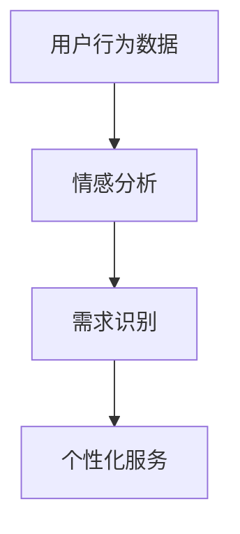
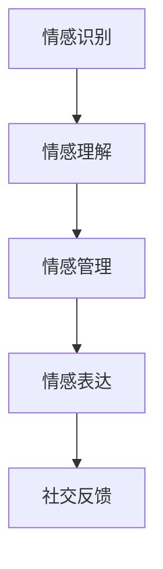
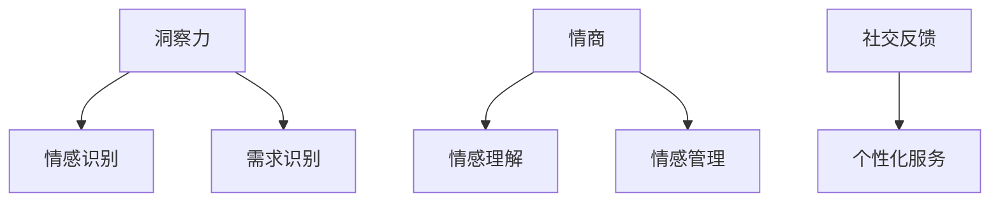

                 

关键词：洞察力、情商、社交智能、人工智能、心理学、技术领域

> 摘要：本文将深入探讨洞察力与情商在社交智能中的作用，以及如何通过技术手段提升这两种能力。文章首先介绍了社交智能的定义，随后详细阐述了洞察力与情商的核心概念，最后提出了在实际应用中提升这两种能力的具体策略。

## 1. 背景介绍

社交智能是人工智能领域的一个重要分支，它旨在使计算机系统能够理解、感知、并适应用户的情感和行为。在社交互动中，计算机系统不仅需要具备基本的语言处理能力，还需要具备情感识别、理解、表达以及回应能力。这种能力不仅有助于提高人机交互的自然性和有效性，也为解决现实世界中的复杂问题提供了新的途径。

然而，要实现高水平的社交智能，不仅需要技术上的突破，更需要理解和运用心理学和情感科学中的相关知识。本文将重点探讨两种关键的软技能：洞察力和情商。

### 1.1 洞察力

洞察力是指一个人能够深入了解他人情感和需求，并从复杂信息中提取关键信息的能力。这种能力对于社交智能至关重要，因为只有真正理解用户的需求和情感，计算机系统才能提供有针对性的服务。

### 1.2 情商

情商，即情绪智力，是指一个人识别、理解、管理和表达自己及他人情绪的能力。情商不仅影响个体的社交关系，也影响着团队合作和领导力。在社交智能系统中，高情商的算法能够更好地模拟人类的情感交互，从而提高系统的用户体验。

## 2. 核心概念与联系

为了深入理解洞察力和情商在社交智能中的作用，我们首先需要构建一个概念框架，这个框架将包括以下几个方面：

### 2.1 洞察力的架构



在这个架构中，用户行为数据是洞察力的起点，通过情感分析，系统能够理解用户的情感状态。基于这些情感数据，系统能够识别用户的需求，并提供个性化的服务。

### 2.2 情商的模型



情商模型包括四个关键组成部分：情感识别、理解、管理和表达。通过情感识别，系统能够感知用户的情感状态；情感理解使系统能够解释这些情感的含义；情感管理帮助系统适当地回应这些情感；情感表达则是系统与用户进行有效沟通的关键。

### 2.3 洞察力与情商的相互作用



洞察力与情商相互作用，共同推动社交智能的发展。洞察力提供了理解用户情感和需求的基础，而情商则确保了系统与用户之间的有效沟通和互动。

## 3. 核心算法原理 & 具体操作步骤

### 3.1 算法原理概述

社交智能的核心在于如何有效地理解和响应用户的情感和需求。为了实现这一目标，我们需要结合情感分析和自然语言处理技术，设计出一套智能算法。

### 3.2 算法步骤详解

#### 3.2.1 情感分析

情感分析是理解用户情感的第一步。这一步骤通常包括以下几个步骤：

1. 数据预处理：对用户生成的文本进行清洗和格式化。
2. 特征提取：从文本中提取情感相关的特征，如词汇、语法结构和情感词典。
3. 情感分类：使用机器学习算法对文本进行分类，判断其情感倾向。

#### 3.2.2 需求识别

在情感分析的基础上，需求识别算法需要进一步分析用户的情感数据，从中提取出用户的具体需求。这一步骤通常包括：

1. 情感语义分析：理解情感数据中的语义含义，如愤怒、悲伤、喜悦等。
2. 需求预测：根据情感数据预测用户可能的需求，如购物、咨询、娱乐等。

#### 3.2.3 个性化服务

个性化服务是基于用户情感和需求的个性化推荐。具体步骤如下：

1. 用户建模：建立用户情感和行为模型。
2. 服务推荐：根据用户模型提供个性化服务推荐。

### 3.3 算法优缺点

#### 优点：

- 高效性：自动化处理用户情感和需求，节省人力成本。
- 个性化：基于用户情感和需求提供个性化服务，提升用户体验。

#### 缺点：

- 数据依赖性：情感分析模型的准确性依赖于训练数据的质量。
- 隐私问题：用户情感数据的收集和处理可能涉及隐私问题。

### 3.4 算法应用领域

社交智能算法广泛应用于多个领域，如：

- 客户服务：通过情感分析提供个性化的客户支持。
- 娱乐推荐：根据用户情感和兴趣推荐娱乐内容。
- 教育培训：根据学生情感状态提供个性化的学习建议。

## 4. 数学模型和公式 & 详细讲解 & 举例说明

### 4.1 数学模型构建

为了更好地理解社交智能中的情感分析和需求识别，我们可以构建一个简化的数学模型。该模型包括以下几个部分：

- 用户行为数据：表示为 $X = (x_1, x_2, ..., x_n)$，其中 $x_i$ 是用户第 $i$ 次交互的数据。
- 情感数据：表示为 $Y = (y_1, y_2, ..., y_n)$，其中 $y_i$ 是用户第 $i$ 次交互的情感得分。

### 4.2 公式推导过程

我们假设情感得分与用户行为数据之间存在线性关系，即：

\[ y_i = w \cdot x_i + b \]

其中，$w$ 是权重向量，$b$ 是偏置项。

### 4.3 案例分析与讲解

#### 案例一：情感分析

假设我们有一个用户的行为数据集，数据集中的每一条记录都包含用户的评论和情感得分。我们使用线性回归模型来预测情感得分。

1. 数据预处理：将用户评论进行分词和词性标注。
2. 特征提取：从分词结果中提取情感相关的特征词。
3. 模型训练：使用训练数据训练线性回归模型。

#### 案例二：需求识别

在情感分析的基础上，我们需要进一步识别用户的需求。假设我们已经训练好了一个情感分类模型，我们可以使用以下步骤来识别用户需求：

1. 情感分类：对用户评论进行情感分类，得到情感标签。
2. 需求预测：根据情感标签和用户历史行为数据，预测用户需求。

## 5. 项目实践：代码实例和详细解释说明

### 5.1 开发环境搭建

为了演示社交智能算法的实践应用，我们需要搭建一个简单的开发环境。以下是一个基本的步骤：

1. 安装Python环境。
2. 安装必要的依赖库，如scikit-learn、nltk等。

### 5.2 源代码详细实现

以下是一个简单的情感分析和需求识别的Python代码示例：

```python
import numpy as np
from sklearn.linear_model import LinearRegression
from sklearn.model_selection import train_test_split
from sklearn.metrics import mean_squared_error

# 数据预处理
def preprocess_data(data):
    # 进行分词、词性标注等操作
    # ...
    return processed_data

# 特征提取
def extract_features(data):
    # 从文本中提取情感相关的特征词
    # ...
    return feature_matrix

# 模型训练
def train_model(X, Y):
    model = LinearRegression()
    model.fit(X, Y)
    return model

# 需求预测
def predict_demand(model, X):
    predictions = model.predict(X)
    return predictions

# 主函数
def main():
    # 加载数据
    data = load_data()
    X = preprocess_data(data)
    Y = extract_features(data)

    # 划分训练集和测试集
    X_train, X_test, Y_train, Y_test = train_test_split(X, Y, test_size=0.2)

    # 训练模型
    model = train_model(X_train, Y_train)

    # 预测需求
    predictions = predict_demand(model, X_test)

    # 评估模型
    mse = mean_squared_error(Y_test, predictions)
    print("MSE:", mse)

if __name__ == "__main__":
    main()
```

### 5.3 代码解读与分析

以上代码首先进行了数据预处理和特征提取，然后使用线性回归模型进行训练和预测。通过评估模型，我们可以了解其预测的准确性。

### 5.4 运行结果展示

在运行代码后，我们得到了预测结果和评估指标。根据这些结果，我们可以进一步优化模型和算法。

## 6. 实际应用场景

社交智能算法在多个领域都有广泛的应用。以下是一些典型的应用场景：

### 6.1 客户服务

在客户服务领域，社交智能算法可以帮助企业更好地理解客户的情感和需求，从而提供更个性化的服务。例如，通过情感分析，客户服务中心可以识别客户的不满情绪，并迅速采取措施解决问题。

### 6.2 娱乐推荐

在娱乐领域，社交智能算法可以根据用户的情感和兴趣推荐适合的内容。例如，视频网站可以根据用户的情感反馈推荐视频，从而提高用户的满意度。

### 6.3 教育培训

在教育培训领域，社交智能算法可以帮助教师更好地了解学生的学习情况和情感状态，从而提供更有针对性的教学方案。

## 6.4 未来应用展望

随着技术的不断发展，社交智能算法在未来将有更广泛的应用。例如，在医疗领域，社交智能可以帮助医生更好地理解患者的情感和需求，从而提供更有效的治疗方案。

## 7. 工具和资源推荐

### 7.1 学习资源推荐

- 《社交智能：人工智能与人类情感的结合》
- 《情感计算：技术、应用与未来》

### 7.2 开发工具推荐

- Python
- scikit-learn
- nltk

### 7.3 相关论文推荐

- “Social Signal Processing for Human-AI Interaction”
- “Emotion Recognition in Human-Computer Interaction”

## 8. 总结：未来发展趋势与挑战

### 8.1 研究成果总结

社交智能领域已经取得了显著的研究成果，包括情感分析、需求识别和个性化推荐等方面的技术突破。

### 8.2 未来发展趋势

随着技术的进步，社交智能将在更多领域得到应用，如医疗、教育、金融等。

### 8.3 面临的挑战

社交智能仍然面临许多挑战，包括数据隐私、模型可解释性以及跨领域应用等。

### 8.4 研究展望

未来，社交智能的研究将更加注重人机交互的自然性和有效性，以及跨学科融合。

## 9. 附录：常见问题与解答

### 9.1 什么是社交智能？

社交智能是指计算机系统理解和模拟人类情感和行为的能力，旨在实现更自然、有效的人机交互。

### 9.2 洞察力在社交智能中有什么作用？

洞察力帮助计算机系统深入了解用户的情感和需求，从而提供更个性化的服务。

### 9.3 情商如何影响社交智能？

情商使计算机系统能够更好地模拟人类的情感交互，从而提高用户体验。

---

作者：禅与计算机程序设计艺术 / Zen and the Art of Computer Programming

