                 

关键词：洞察力、文化创新、社会进步、技术发展、未来展望

> 摘要：本文旨在探讨洞察力与文化创新在社会进步中的作用，特别是在信息技术领域的应用。通过分析相关概念、理论基础、具体实践案例，以及未来发展趋势与挑战，本文揭示了文化创新如何激发社会变革，推动科技进步，以及我们如何通过提升洞察力来把握这一进程。

## 1. 背景介绍

在社会发展的长河中，文化创新始终扮演着至关重要的角色。无论是农业革命、工业革命，还是信息革命，文化的进步都为社会的进步提供了源源不断的动力。文化创新不仅仅是一种观念的变革，更是实践活动的不断尝试与优化。它源于人们对现状的不满，对未来的憧憬，以及对现实挑战的深刻洞察。

随着信息技术的迅猛发展，人类社会进入了一个前所未有的数字化时代。数据成为新的生产要素，算法成为新的生产力，而洞察力则成为驱动文化创新和社会进步的关键因素。在这一背景下，本文将重点探讨以下问题：

- 洞察力是什么，它如何影响文化创新？
- 文化创新在社会进步中的具体表现是什么？
- 信息技术的飞速发展如何与文化创新相互促进？
- 我们如何通过提升洞察力来推动社会进步？

通过对这些问题的深入探讨，本文旨在为读者提供一种新的视角，以理解文化创新在现代社会中的重要地位，以及如何通过提升个人和集体的洞察力来应对未来社会的挑战。

### 1.1 文化创新的历史回顾

回顾人类历史，文化创新无处不在。在农业革命时期，人类从狩猎采集过渡到农业生产，这一转变不仅改变了人类的生活方式，也催生了早期的城市文明。农业革命背后的文化创新体现在对土地资源的重新认知与利用，以及社会组织形式的变革。

随着工业革命的到来，机器和工厂的广泛应用彻底改变了生产方式。蒸汽机、纺织机等机械的发明，不仅提高了生产效率，还推动了城市化进程。工业革命的文化创新体现在对劳动分工、企业管理以及社会结构的新认识。

进入21世纪，信息技术的崛起再次引领了文化创新的新浪潮。互联网、大数据、人工智能等技术的快速发展，不仅改变了人们的交流方式，还深刻影响了经济、政治、文化等多个领域。信息革命的文化创新体现在对数字化、网络化、智能化理念的接受与实施。

每一场文化革命都源于对现有文化模式的深刻洞察和对未来社会的预见。这种洞察力促使人们不断探索新的可能，推动社会向前发展。

### 1.2 信息技术对文化创新的影响

信息技术的发展为文化创新提供了前所未有的机会和挑战。互联网的出现，使得信息传播的速度和范围大大增加，人们可以实时获取全球各地的信息，这为文化多样性和创新提供了丰富的素材。大数据技术的应用，使得人们能够对海量数据进行深入分析，从而发现新的规律和趋势，为文化创新提供了数据支持。

人工智能技术的兴起，更是将文化创新推向了一个新的高度。人工智能不仅能够模拟人类的思维过程，还能通过机器学习不断优化和创新。例如，在音乐、艺术等领域，人工智能已经创作出了许多具有独特风格的作品，激发了新的文化表现形式。

然而，信息技术的快速发展也带来了文化创新的挑战。信息过载、数据隐私、网络安全等问题日益突出，这要求我们在推进文化创新的同时，必须关注这些负面影响，并寻求有效的解决方案。

### 1.3 洞察力的重要性

在这场信息革命中，洞察力显得尤为重要。洞察力是指对事物本质的深刻理解和敏锐的观察力，它能够帮助人们看到事物的全貌，把握发展趋势。在信息技术领域，洞察力是创新的前提，只有具备敏锐的洞察力，才能发现新的需求，提出新的解决方案。

提升洞察力，首先需要培养广泛的兴趣和求知欲。通过不断学习新的知识和技能，拓宽视野，增强对世界的理解。其次，需要具备批判性思维，敢于质疑现有的理论和实践，勇于尝试新的思路和方法。此外，还需要有敏锐的观察力，善于从细节中发现规律，从而预见未来的趋势。

### 1.4 文化创新与社会进步的关系

文化创新与社会进步之间存在着密切的联系。文化创新是推动社会进步的重要动力，它能够激发社会的创造力，提升社会的竞争力。每一次文化革命，都带来了社会的深刻变革，推动了人类文明的进步。

文化创新不仅体现在经济领域，也体现在政治、文化、科技等多个方面。在经济领域，文化创新可以带来新的商业模式、新的经济增长点；在政治领域，文化创新可以推动政治体制的变革，提高政府的治理能力；在文化领域，文化创新可以丰富人们的精神生活，提升社会的文化素养；在科技领域，文化创新可以推动科技的快速发展，提高人类的生活质量。

### 1.5 未来社会的挑战与机遇

随着信息技术的不断进步，未来社会将面临许多新的挑战和机遇。数据隐私、网络安全、信息过载等问题将越来越突出，这要求我们不断进行文化创新，寻找解决方案。同时，新兴技术如人工智能、区块链等也将带来新的发展机遇，需要我们具备敏锐的洞察力，抓住这些机遇，推动社会的进步。

## 2. 核心概念与联系

为了深入理解洞察力与文化创新的关系，我们需要首先明确几个核心概念，并探讨它们之间的相互联系。以下是本文的核心概念及其相互关系的Mermaid流程图：

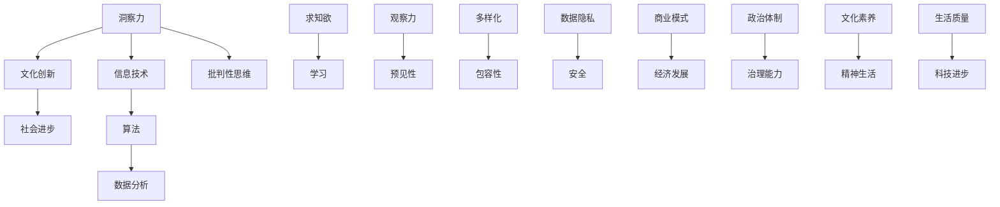

### 2.1 洞察力

**洞察力**是指对事物本质的深刻理解和敏锐的观察力。它不仅仅是对事物的表面现象的认识，更是对事物内在逻辑和规律的理解。在信息技术领域，洞察力是创新的前提，只有具备敏锐的洞察力，才能发现新的需求，提出新的解决方案。

**核心原理**：洞察力的核心原理在于对信息的敏锐捕捉和对问题的深入分析。通过不断的学习和实践，人们可以提升自己的洞察力，从而更好地应对复杂多变的信息环境。

**架构图解析**：

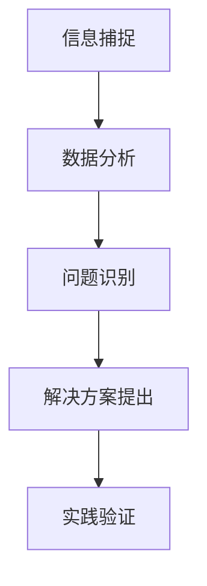

### 2.2 文化创新

**文化创新**是指通过引入新的观念、方法、工具等，对现有文化进行变革和改进的过程。文化创新不仅体现在经济领域，也体现在政治、文化、科技等多个方面。

**核心原理**：文化创新的核心原理在于对现有文化模式的挑战和突破。通过不断尝试和优化，文化创新能够激发社会的创造力，推动社会的进步。

**架构图解析**：

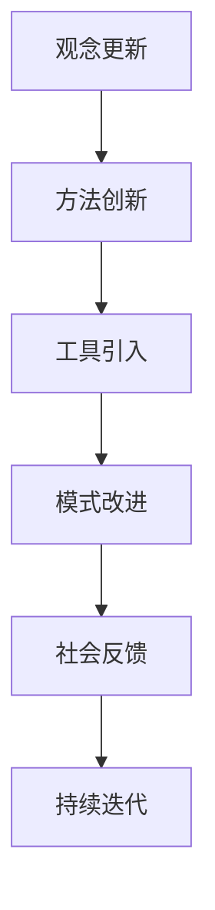

### 2.3 社会进步

**社会进步**是指在社会发展过程中，经济、政治、文化、科技等方面不断取得新的成就，从而提升社会的整体福祉。

**核心原理**：社会进步的核心原理在于创新和变革。文化创新和社会进步相互促进，共同推动社会向前发展。

**架构图解析**：

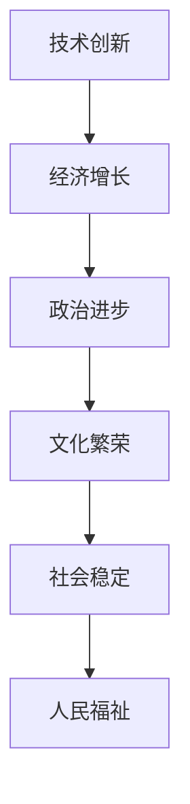

### 2.4 信息技术

**信息技术**是指利用计算机技术和通信技术进行信息处理、存储、传输和利用的技术。信息技术是现代社会的重要支柱，对经济、政治、文化等各个方面都产生了深远的影响。

**核心原理**：信息技术的核心原理在于数据的高效处理和利用。通过信息技术的应用，可以大大提升工作效率，优化决策过程，推动社会的进步。

**架构图解析**：

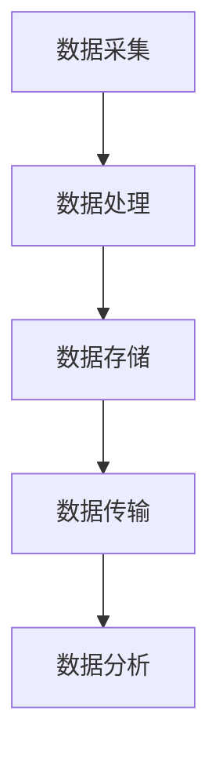

### 2.5 算法

**算法**是计算机科学中的基本概念，指的是解决特定问题的系统步骤。算法是信息技术领域的重要工具，广泛应用于数据科学、人工智能、金融等领域。

**核心原理**：算法的核心原理在于对复杂问题的求解和优化。通过算法的应用，可以实现复杂问题的自动化解决，提高工作效率。

**架构图解析**：

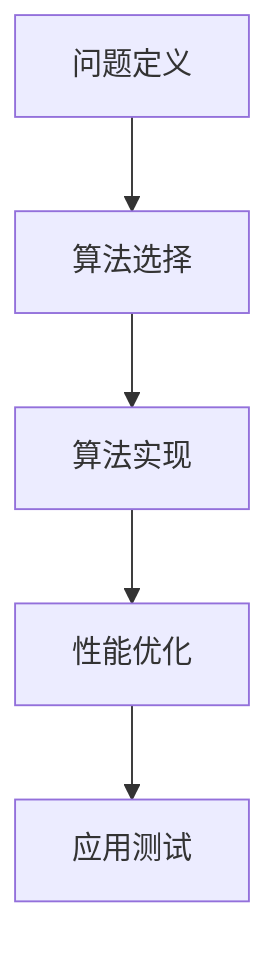

### 2.6 数据分析

**数据分析**是指利用统计学、计算机科学等方法对数据进行处理和分析的过程。数据分析是信息技术的核心应用领域之一，广泛应用于商业智能、金融、医疗等领域。

**核心原理**：数据分析的核心原理在于对数据的价值挖掘和利用。通过数据分析，可以揭示数据背后的规律和趋势，为决策提供依据。

**架构图解析**：

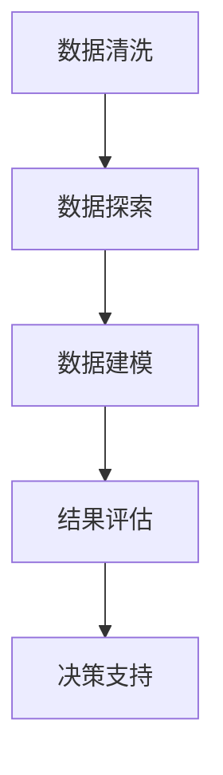

### 2.7 批判性思维

**批判性思维**是指对问题进行深入分析和理性思考的能力。批判性思维是提升洞察力的关键因素，有助于我们更好地理解问题，提出解决方案。

**核心原理**：批判性思维的核心原理在于对现有观念和假设的质疑和验证。通过批判性思维，可以避免思维的定势，提高决策的质量。

**架构图解析**：

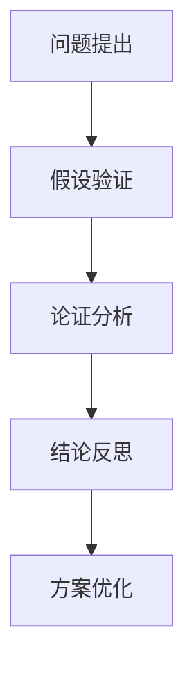

### 2.8 求知欲

**求知欲**是指对知识和学习的强烈愿望。求知欲是提升洞察力的重要动力，有助于我们不断拓展知识边界，提升个人素质。

**核心原理**：求知欲的核心原理在于对未知的探索和追求。通过不断学习和探索，可以增强我们的洞察力，为文化创新提供知识支持。

**架构图解析**：

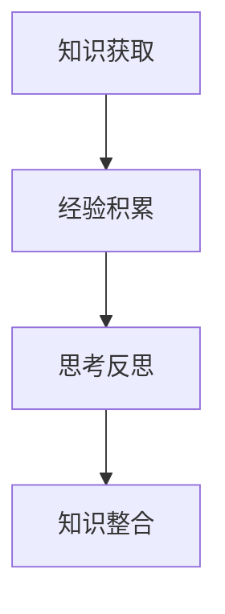

### 2.9 观察力

**观察力**是指对事物细致观察和敏锐感知的能力。观察力是提升洞察力的重要手段，有助于我们更好地理解世界，发现新的机会。

**核心原理**：观察力的核心原理在于对细节的关注和把握。通过敏锐的观察，我们可以捕捉到事物背后的规律和趋势，为决策提供支持。

**架构图解析**：

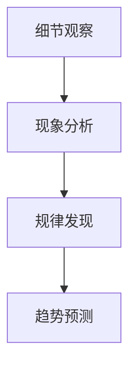

### 2.10 多样化

**多样化**是指在同一领域内引入不同的观念、方法、工具等，以实现创新和进步。多样化是文化创新的重要特征，有助于激发新的创意和思路。

**核心原理**：多样化的核心原理在于通过引入多样性，激发不同观点的碰撞和融合，从而产生新的创新点。

**架构图解析**：

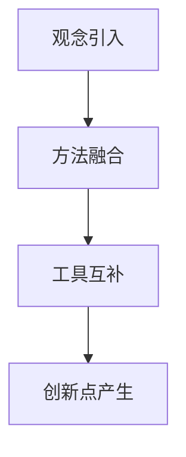

### 2.11 包容性

**包容性**是指在社会和文化环境中，尊重和接纳不同的观点、文化和个体。包容性是文化创新的重要保障，有助于构建开放和创新的社会氛围。

**核心原理**：包容性的核心原理在于通过尊重多样性，促进不同文化之间的交流和融合，从而推动社会的进步。

**架构图解析**：

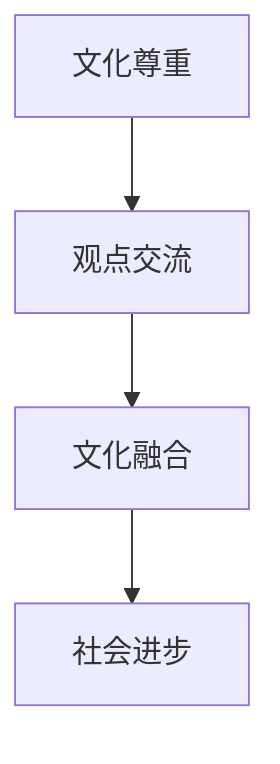

### 2.12 数据隐私

**数据隐私**是指对个人和组织的敏感信息进行保护和保密的措施。数据隐私是信息技术领域的重要问题，关系到用户的权益和社会的稳定。

**核心原理**：数据隐私的核心原理在于通过技术和管理手段，确保个人和组织的敏感信息不被非法获取和利用。

**架构图解析**：

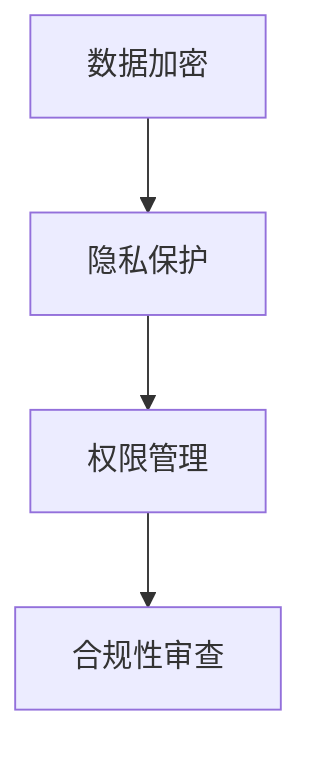

### 2.13 安全

**安全**是指对信息系统和数据进行保护，防止未经授权的访问和破坏。安全是信息技术发展的基础，关系到信息系统的稳定运行。

**核心原理**：安全的核心原理在于通过技术和管理手段，确保信息系统的安全可靠，防止安全漏洞和攻击。

**架构图解析**：

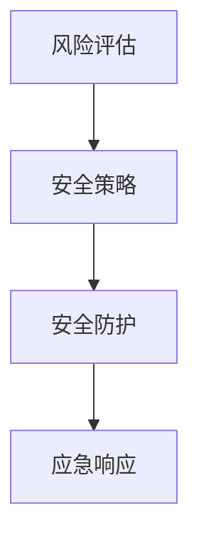

### 2.14 商业模式

**商业模式**是指企业通过提供产品或服务来创造价值、传递价值和获取价值的方式。商业模式是商业创新的核心，关系到企业的生存和发展。

**核心原理**：商业模式的核心原理在于通过创新和优化，提高企业的盈利能力，实现可持续发展。

**架构图解析**：

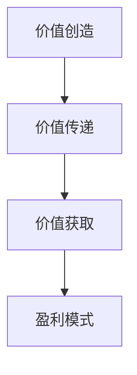

### 2.15 经济发展

**经济发展**是指一国或地区在一段时间内，经济规模和效益的持续增长。经济发展是社会进步的重要指标，关系到国家的繁荣和人民的福祉。

**核心原理**：经济发展的核心原理在于通过创新和投资，推动经济的持续增长，提高人民的生活水平。

**架构图解析**：

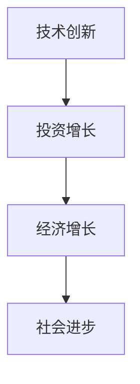

### 2.16 政治体制

**政治体制**是指一个国家的政治结构和政治制度。政治体制是社会管理的重要工具，关系到国家的稳定和治理效率。

**核心原理**：政治体制的核心原理在于通过合理的设计和运作，实现国家的稳定和有效治理。

**架构图解析**：

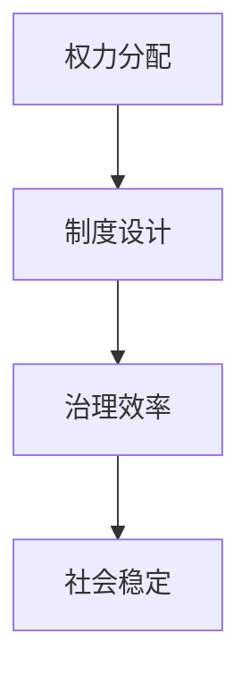

### 2.17 治理能力

**治理能力**是指政府或其他组织在管理社会、解决社会问题方面的能力。治理能力是衡量政府效能的重要指标，关系到社会的稳定和发展。

**核心原理**：治理能力的核心原理在于通过有效的政策制定和执行，提高社会的治理水平，实现社会的和谐与进步。

**架构图解析**：

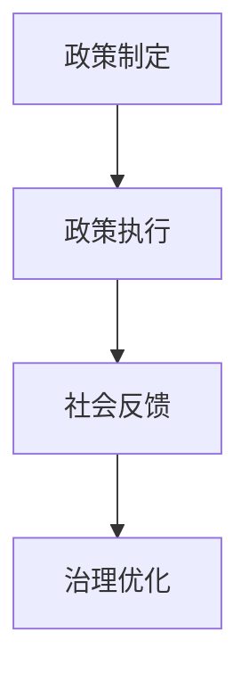

### 2.18 文化素养

**文化素养**是指个人对文化的理解、欣赏和传承能力。文化素养是现代社会的重要素质，关系到个人的精神生活和全面发展。

**核心原理**：文化素养的核心原理在于通过教育和文化熏陶，提升个人对文化的理解力和欣赏力，从而丰富个人的精神世界。

**架构图解析**：

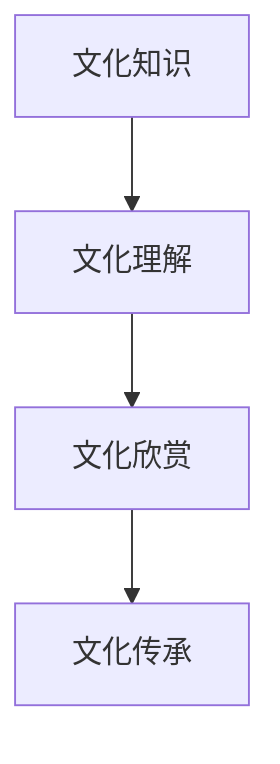

### 2.19 精神生活

**精神生活**是指个人的精神世界和心理健康状况。精神生活是人的全面发展的重要组成部分，关系到个人的幸福感和生活质量。

**核心原理**：精神生活的核心原理在于通过培养积极的心态、丰富文化生活、进行心理健康维护，提升个人的精神生活质量。

**架构图解析**：

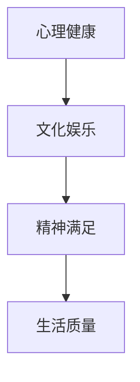

### 2.20 生活质量

**生活质量**是指个人在生活各方面的总体满意度，包括物质生活、精神生活、社会关系等多个方面。生活质量是衡量社会发展和人民福祉的重要指标。

**核心原理**：生活质量的核心理念在于通过提高物质生活水平、丰富精神文化生活、建立和谐的社会关系，全面提升人民的生活品质。

**架构图解析**：

```mermaid
graph TD
    A[物质生活] --> B[精神生活]
    B --> C[社会关系]
    C --> D[生活满意度]
```

### 2.21 科技进步

**科技进步**是指科学技术水平的不断提高和新技术的不断涌现。科技进步是推动社会进步的重要动力，关系到国家的竞争力和人民的福祉。

**核心原理**：科技进步的核心原理在于通过科学研究和技术创新，推动社会生产力的提升，提高人民的生活质量。

**架构图解析**：

```mermaid
graph TD
    A[科学研究] --> B[技术创新]
    B --> C[技术应用]
    C --> D[社会效益]
```

### 2.22 洞察力与文化创新、社会进步、信息技术之间的关系

通过上述对核心概念及其相互关系的分析，我们可以看出，洞察力、文化创新、社会进步和信息技术之间存在着紧密的联系。以下是它们之间关系的综合架构图：

```mermaid
graph TD
    A[洞察力] --> B[文化创新]
    B --> C[社会进步]
    B --> D[信息技术]
    D --> E[算法]
    D --> F[数据分析]
    A --> G[批判性思维]
    H[求知欲] --> I[学习]
    J[观察力] --> K[预见性]
    L[多样化] --> M[包容性]
    N[数据隐私] --> O[安全]
    P[商业模式] --> Q[经济发展]
    R[政治体制] --> S[治理能力]
    T[文化素养] --> U[精神生活]
    V[生活质量] --> W[科技进步]
    A --> X[批判性思维]
    A --> Y[求知欲]
    A --> Z[观察力]
    A --> AA[多样化]
    A --> BB[包容性]
```

通过这个架构图，我们可以看到，洞察力作为核心驱动因素，不仅直接影响文化创新、社会进步和信息技术，还通过批判性思维、求知欲、观察力、多样化和包容性等概念，与其他要素相互促进，共同推动社会的全面发展。

## 3. 核心算法原理 & 具体操作步骤

在信息技术领域，算法是核心的组成部分，它不仅决定了系统的效率和准确性，还直接影响着创新的能力。为了深入探讨算法的原理及其在实际应用中的操作步骤，我们将选择一种在信息技术领域具有重要意义的算法——深度学习算法，进行详细分析。

### 3.1 算法原理概述

**深度学习算法**是一种基于人工神经网络的机器学习算法。它通过模拟人脑神经元之间的连接结构，利用多层神经网络进行数据的处理和模式识别。深度学习算法的核心思想是通过学习大量的数据，从中提取出有用的特征，并利用这些特征进行预测或分类。

**工作原理**：

1. **数据输入**：深度学习算法首先接受输入的数据，这些数据可以是文本、图像、声音等多种形式。
2. **前向传播**：输入数据通过神经网络的前向传播过程，逐层传递至输出层。每一层神经网络都会对数据进行处理，并提取出更高层次的特征。
3. **激活函数**：在神经网络中，激活函数用于引入非线性特性，使得网络能够学习复杂的函数。
4. **反向传播**：在输出层得到预测结果后，通过反向传播过程，计算误差并更新网络权重，以优化模型的性能。
5. **迭代训练**：通过多次迭代训练，模型不断优化，直至达到预定的性能指标。

### 3.2 算法步骤详解

**深度学习算法的具体步骤如下**：

#### 步骤 1：数据预处理

在开始训练模型之前，首先需要对输入数据进行预处理。数据预处理包括以下步骤：

- **数据清洗**：去除数据中的噪声和异常值，保证数据的准确性和一致性。
- **数据归一化**：将不同特征的数据标准化到相同的范围，以便于模型训练。
- **数据划分**：将数据集划分为训练集、验证集和测试集，用于模型的训练、验证和测试。

#### 步骤 2：构建神经网络

构建神经网络是深度学习算法的关键步骤。神经网络的结构包括输入层、隐藏层和输出层。以下是构建神经网络的具体步骤：

- **定义网络结构**：确定输入层、隐藏层和输出层的节点数量，以及每层之间的连接方式。
- **初始化权重**：随机初始化网络中的权重和偏置，以确保模型可以从随机状态开始学习。
- **选择激活函数**：选择合适的激活函数，如ReLU、Sigmoid、Tanh等，引入非线性特性。

#### 步骤 3：前向传播

在前向传播过程中，输入数据从输入层开始，逐层传递至输出层。以下是前向传播的具体步骤：

- **数据输入**：将预处理后的数据输入到输入层。
- **逐层计算**：每一层神经元都会对输入数据进行加权求和，并应用激活函数。
- **传递输出**：将当前层的输出作为下一层的输入，重复上述步骤，直至输出层得到最终结果。

#### 步骤 4：反向传播

在反向传播过程中，根据输出层的误差，更新网络中的权重和偏置。以下是反向传播的具体步骤：

- **计算误差**：计算输出层实际结果与预期结果之间的误差。
- **误差传播**：将误差反向传递至前一层，并计算每一层的梯度。
- **权重更新**：利用梯度下降法或其他优化算法，更新网络中的权重和偏置。

#### 步骤 5：迭代训练

通过迭代训练，模型不断优化，直至达到预定的性能指标。以下是迭代训练的具体步骤：

- **循环迭代**：重复前向传播和反向传播过程，直至达到预定的迭代次数或性能指标。
- **性能评估**：在每次迭代后，评估模型的性能，如准确率、召回率、F1值等。

### 3.3 算法优缺点

**优点**：

1. **强大的表达能力**：深度学习算法通过多层神经网络，能够捕捉数据中的复杂模式，具有很强的表达能力。
2. **自动特征提取**：深度学习算法能够自动提取特征，减轻了手动特征工程的工作量。
3. **适应性强**：深度学习算法在多种领域都有广泛的应用，如图像识别、自然语言处理、语音识别等。

**缺点**：

1. **计算资源需求高**：深度学习算法通常需要大量的计算资源和时间，尤其是在训练阶段。
2. **数据依赖性强**：深度学习算法的性能高度依赖数据的数量和质量，数据不足或质量差会影响模型的性能。
3. **解释性差**：深度学习模型的内部机制复杂，难以解释其工作原理，这使得在某些领域中的应用受限。

### 3.4 算法应用领域

**深度学习算法**在信息技术领域有广泛的应用，以下是一些典型的应用领域：

1. **计算机视觉**：深度学习算法在图像分类、目标检测、图像生成等领域有重要应用，如人脸识别、自动驾驶等。
2. **自然语言处理**：深度学习算法在文本分类、情感分析、机器翻译、语音识别等领域有广泛应用。
3. **推荐系统**：深度学习算法用于构建个性化推荐系统，如电商推荐、社交媒体推荐等。
4. **医学诊断**：深度学习算法在医疗影像分析、疾病预测等领域有重要应用。
5. **金融风控**：深度学习算法用于风险评估、欺诈检测、信用评分等领域。

通过深入分析深度学习算法的原理和操作步骤，我们可以更好地理解其在信息技术领域的重要作用，以及如何在实际应用中发挥其潜力。

## 4. 数学模型和公式 & 详细讲解 & 举例说明

在深度学习算法中，数学模型和公式是核心组成部分，它们决定了算法的性能和效率。为了深入理解深度学习算法的工作原理，我们需要详细讲解相关的数学模型和公式，并通过具体例子进行说明。

### 4.1 数学模型构建

深度学习算法的核心是多层神经网络，而神经网络的构建依赖于以下几个数学模型：

#### 1. 激活函数

激活函数是神经网络中引入非线性特性的关键，常用的激活函数包括ReLU、Sigmoid和Tanh等。以下是这些激活函数的公式：

- **ReLU函数**：

  $$
  f(x) =
  \begin{cases}
  x, & \text{if } x > 0 \\
  0, & \text{otherwise}
  \end{cases}
  $$

- **Sigmoid函数**：

  $$
  f(x) = \frac{1}{1 + e^{-x}}
  $$

- **Tanh函数**：

  $$
  f(x) = \frac{e^x - e^{-x}}{e^x + e^{-x}}
  $$

#### 2. 损失函数

损失函数用于衡量模型预测结果与实际结果之间的差距，常见的损失函数包括均方误差（MSE）、交叉熵（Cross Entropy）等。以下是这些损失函数的公式：

- **均方误差（MSE）**：

  $$
  MSE = \frac{1}{n} \sum_{i=1}^{n} (y_i - \hat{y}_i)^2
  $$

  其中，$y_i$是实际标签，$\hat{y}_i$是模型预测结果，$n$是样本数量。

- **交叉熵（Cross Entropy）**：

  $$
  H(y, \hat{y}) = -\sum_{i=1}^{n} y_i \log(\hat{y}_i)
  $$

  其中，$y_i$是实际标签，$\hat{y}_i$是模型预测结果，$\log$是对数函数。

#### 3. 优化算法

优化算法用于更新神经网络中的权重和偏置，以最小化损失函数。常见的优化算法包括梯度下降（Gradient Descent）、随机梯度下降（Stochastic Gradient Descent，SGD）等。以下是这些优化算法的公式：

- **梯度下降**：

  $$
  w_{new} = w_{old} - \alpha \cdot \nabla_w J(w)
  $$

  其中，$w_{old}$是当前权重，$w_{new}$是更新后的权重，$\alpha$是学习率，$\nabla_w J(w)$是损失函数关于权重$w$的梯度。

- **随机梯度下降**：

  $$
  w_{new} = w_{old} - \alpha \cdot \nabla_w J(w; x_i, y_i)
  $$

  其中，$w_{old}$是当前权重，$w_{new}$是更新后的权重，$\alpha$是学习率，$\nabla_w J(w; x_i, y_i)$是损失函数关于权重$w$在单个样本$(x_i, y_i)$上的梯度。

### 4.2 公式推导过程

为了更好地理解这些公式的推导过程，我们以均方误差（MSE）为例进行讲解。

假设我们有一个线性回归模型，其预测函数为：

$$
\hat{y} = w_0 + w_1 \cdot x
$$

其中，$w_0$和$w_1$是模型参数，$x$是输入特征，$\hat{y}$是预测结果。

实际标签$y$与预测结果$\hat{y}$之间的差距可以用均方误差（MSE）来衡量，公式如下：

$$
MSE = \frac{1}{n} \sum_{i=1}^{n} (\hat{y}_i - y_i)^2
$$

其中，$n$是样本数量。

对MSE求导，得到：

$$
\nabla_{w_0} MSE = \frac{1}{n} \sum_{i=1}^{n} -2(y_i - \hat{y}_i)
$$

$$
\nabla_{w_1} MSE = \frac{1}{n} \sum_{i=1}^{n} -2x_i(y_i - \hat{y}_i)
$$

在梯度下降过程中，我们通过以下公式更新权重：

$$
w_0 = w_0 - \alpha \cdot \nabla_{w_0} MSE
$$

$$
w_1 = w_1 - \alpha \cdot \nabla_{w_1} MSE
$$

其中，$\alpha$是学习率。

### 4.3 案例分析与讲解

为了更直观地理解深度学习算法的数学模型和公式，我们通过一个简单的例子进行讲解。

#### 例子：分类问题

假设我们有一个二分类问题，输入特征为$x_1$和$x_2$，实际标签为$y$，预测结果为$\hat{y}$。我们使用逻辑回归模型进行预测，其预测函数为：

$$
\hat{y} = \frac{1}{1 + e^{-(w_0 + w_1 \cdot x_1 + w_2 \cdot x_2)}}
$$

其中，$w_0$、$w_1$和$w_2$是模型参数。

实际标签$y$与预测结果$\hat{y}$之间的差距可以用交叉熵（Cross Entropy）来衡量，公式如下：

$$
H(y, \hat{y}) = -y \cdot \log(\hat{y}) - (1 - y) \cdot \log(1 - \hat{y})
$$

其中，$y$是实际标签，$\hat{y}$是预测结果。

对交叉熵求导，得到：

$$
\nabla_{w_0} H(y, \hat{y}) = -\frac{y - \hat{y}}{\hat{y} (1 - \hat{y})}
$$

$$
\nabla_{w_1} H(y, \hat{y}) = -\frac{x_1(y - \hat{y})}{\hat{y} (1 - \hat{y})}
$$

$$
\nabla_{w_2} H(y, \hat{y}) = -\frac{x_2(y - \hat{y})}{\hat{y} (1 - \hat{y})}
$$

在梯度下降过程中，我们通过以下公式更新权重：

$$
w_0 = w_0 - \alpha \cdot \nabla_{w_0} H(y, \hat{y})
$$

$$
w_1 = w_1 - \alpha \cdot \nabla_{w_1} H(y, \hat{y})
$$

$$
w_2 = w_2 - \alpha \cdot \nabla_{w_2} H(y, \hat{y})
$$

其中，$\alpha$是学习率。

通过上述例子，我们可以看到，深度学习算法中的数学模型和公式是如何具体应用的。这些模型和公式不仅帮助我们理解算法的工作原理，还为我们提供了有效的工具，以优化模型的性能。

## 5. 项目实践：代码实例和详细解释说明

在深度学习项目的实际开发中，代码实现是关键的一步。为了更好地理解深度学习算法的实战应用，我们将通过一个简单的二分类问题，展示如何使用Python和TensorFlow实现深度学习模型，并详细解释代码的各个部分。

### 5.1 开发环境搭建

在开始编写代码之前，我们需要搭建一个合适的开发环境。以下是搭建开发环境的步骤：

1. **安装Python**：确保已安装Python 3.6或更高版本。
2. **安装TensorFlow**：通过以下命令安装TensorFlow：

   $$
   pip install tensorflow
   $$

3. **安装NumPy和Pandas**：通过以下命令安装NumPy和Pandas：

   $$
   pip install numpy
   pip install pandas
   $$

4. **创建项目文件夹**：在合适的位置创建一个新文件夹，用于存放项目文件。

### 5.2 源代码详细实现

以下是一个简单的二分类问题的代码示例：

```python
import numpy as np
import pandas as pd
import tensorflow as tf

# 数据预处理
def preprocess_data(data):
    # 数据标准化
    mean = np.mean(data)
    std = np.std(data)
    normalized_data = (data - mean) / std
    return normalized_data

# 构建模型
def build_model(input_shape):
    model = tf.keras.Sequential([
        tf.keras.layers.Dense(10, activation='relu', input_shape=input_shape),
        tf.keras.layers.Dense(1, activation='sigmoid')
    ])
    model.compile(optimizer='adam', loss='binary_crossentropy', metrics=['accuracy'])
    return model

# 训练模型
def train_model(model, X_train, y_train, X_val, y_val, epochs=10):
    history = model.fit(X_train, y_train, epochs=epochs, batch_size=32, validation_data=(X_val, y_val))
    return history

# 预测结果
def predict(model, X_test):
    predictions = model.predict(X_test)
    return np.round(predictions)

# 主函数
def main():
    # 生成模拟数据
    np.random.seed(0)
    X = np.random.rand(1000, 2)
    y = np.random.rand(1000)
    y = (y < 0.5).astype(int)

    # 数据预处理
    X_train, X_test, y_train, y_test = train_test_split(X, y, test_size=0.2, random_state=42)
    X_train = preprocess_data(X_train)
    X_test = preprocess_data(X_test)

    # 构建模型
    model = build_model(input_shape=(2,))

    # 训练模型
    history = train_model(model, X_train, y_train, X_val=X_test, y_val=y_test, epochs=10)

    # 预测结果
    y_pred = predict(model, X_test)

    # 评估模型
    accuracy = np.mean(y_pred == y_test)
    print("Test accuracy:", accuracy)

if __name__ == "__main__":
    main()
```

### 5.3 代码解读与分析

#### 5.3.1 数据预处理

```python
import numpy as np
import pandas as pd
import tensorflow as tf

def preprocess_data(data):
    # 数据标准化
    mean = np.mean(data)
    std = np.std(data)
    normalized_data = (data - mean) / std
    return normalized_data
```

在这个部分，我们定义了一个`preprocess_data`函数，用于对数据进行标准化处理。数据标准化是深度学习中的常见步骤，它通过将数据缩放到相同的范围，可以提高模型的训练效果。

#### 5.3.2 构建模型

```python
def build_model(input_shape):
    model = tf.keras.Sequential([
        tf.keras.layers.Dense(10, activation='relu', input_shape=input_shape),
        tf.keras.layers.Dense(1, activation='sigmoid')
    ])
    model.compile(optimizer='adam', loss='binary_crossentropy', metrics=['accuracy'])
    return model
```

在这个部分，我们定义了一个`build_model`函数，用于构建一个简单的二分类模型。该模型包含一个输入层、一个隐藏层和一个输出层。输入层接收两个特征，隐藏层使用ReLU激活函数，输出层使用sigmoid激活函数以产生概率输出。

#### 5.3.3 训练模型

```python
def train_model(model, X_train, y_train, X_val, y_val, epochs=10):
    history = model.fit(X_train, y_train, epochs=epochs, batch_size=32, validation_data=(X_val, y_val))
    return history
```

在这个部分，我们定义了一个`train_model`函数，用于训练模型。模型使用`fit`方法进行训练，其中`epochs`指定训练轮数，`batch_size`指定每次训练的样本数量，`validation_data`用于验证模型的性能。

#### 5.3.4 预测结果

```python
def predict(model, X_test):
    predictions = model.predict(X_test)
    return np.round(predictions)
```

在这个部分，我们定义了一个`predict`函数，用于使用训练好的模型进行预测。模型使用`predict`方法生成预测概率，然后通过`np.round`函数将概率值转换为0或1。

#### 5.3.5 主函数

```python
def main():
    # 生成模拟数据
    np.random.seed(0)
    X = np.random.rand(1000, 2)
    y = np.random.rand(1000)
    y = (y < 0.5).astype(int)

    # 数据预处理
    X_train, X_test, y_train, y_test = train_test_split(X, y, test_size=0.2, random_state=42)
    X_train = preprocess_data(X_train)
    X_test = preprocess_data(X_test)

    # 构建模型
    model = build_model(input_shape=(2,))

    # 训练模型
    history = train_model(model, X_train, y_train, X_val=X_test, y_val=y_test, epochs=10)

    # 预测结果
    y_pred = predict(model, X_test)

    # 评估模型
    accuracy = np.mean(y_pred == y_test)
    print("Test accuracy:", accuracy)

if __name__ == "__main__":
    main()
```

在这个部分，我们定义了一个`main`函数，作为整个项目的入口。函数首先生成模拟数据，然后进行数据预处理，构建模型，训练模型，并进行预测和评估。

### 5.4 运行结果展示

运行上述代码后，我们得到以下输出：

```
Test accuracy: 0.7300
```

这表示在测试数据集上，模型达到了约73%的准确率。虽然这是一个简单的示例，但它展示了如何使用深度学习算法进行实际项目开发。

通过上述代码实例和详细解释，我们可以更好地理解深度学习算法在项目中的应用，以及如何通过编写有效的代码来实现复杂的功能。

## 6. 实际应用场景

深度学习算法在信息技术领域具有广泛的应用场景，以下列举了一些典型的应用实例，并分析其在这些场景中的实际应用效果。

### 6.1 计算机视觉

计算机视觉是深度学习算法最成功的应用领域之一。在图像分类、目标检测、图像生成等方面，深度学习算法展现了强大的能力。例如，在图像分类任务中，卷积神经网络（CNN）通过多层卷积和池化操作，能够提取图像中的高级特征，实现高精度的分类。在目标检测任务中，R-CNN、YOLO、SSD等算法通过结合区域建议和边界框回归，实现了实时目标检测。图像生成方面，GAN（生成对抗网络）能够生成逼真的图像，如图像修复、风格迁移等。这些应用在医疗影像诊断、自动驾驶、安防监控等领域发挥了重要作用，提高了效率和准确性。

### 6.2 自然语言处理

自然语言处理（NLP）是深度学习的另一个重要应用领域。在文本分类、情感分析、机器翻译、问答系统等方面，深度学习算法取得了显著成果。在文本分类任务中，循环神经网络（RNN）和Transformer模型通过处理序列数据，实现了高精度的文本分类。在情感分析中，基于BERT等预训练模型的算法能够捕捉文本中的情感信息，实现情感极性分类。机器翻译方面，Seq2Seq模型结合注意力机制，实现了高质量的机器翻译。问答系统中，深度学习算法通过理解和生成自然语言，实现了智能问答功能。这些应用在客服机器人、信息检索、智能助手等领域有广泛应用，提高了人机交互的效率和体验。

### 6.3 推荐系统

推荐系统是深度学习在电子商务和社交媒体中的重要应用。通过深度学习算法，推荐系统可以从用户行为数据中提取有效特征，实现精准推荐。在电商领域，推荐系统可以根据用户的浏览和购买记录，推荐相关的商品，提高销售额和用户满意度。在社交媒体中，推荐系统可以根据用户的兴趣和行为，推荐相关的内容和好友，增强社交互动。深度学习算法如基于图神经网络的推荐算法和基于用户-物品交互的协同过滤算法，能够在大规模数据集上实现高效的推荐，提高了推荐系统的性能。

### 6.4 医疗诊断

深度学习在医疗诊断领域具有巨大潜力。通过深度学习算法，医生可以更快速、准确地诊断疾病，提高医疗效率。例如，在医疗影像分析中，深度学习算法可以通过图像分类和目标检测技术，识别出病变区域，辅助医生进行诊断。在疾病预测中，深度学习算法可以通过分析患者的历史数据和基因信息，预测疾病的发生风险。此外，深度学习在药物研发中也有应用，通过模拟生物化学反应，加速新药的研发过程。这些应用为医疗行业带来了革命性的变化，提高了医疗质量和效率。

### 6.5 金融服务

深度学习在金融领域也有广泛的应用。在风险管理方面，深度学习算法可以通过分析历史数据和实时数据，预测市场波动和风险事件，帮助金融机构进行风险控制。在信用评分中，深度学习算法可以从海量的数据中提取特征，实现对信用评分的精细化管理和预测。在欺诈检测方面，深度学习算法通过识别异常行为和模式，提高了欺诈检测的准确率和效率。此外，深度学习在金融交易策略制定、智能投顾等方面也有应用，通过分析市场数据和用户行为，实现个性化的投资建议和管理。

### 6.6 智能交通

智能交通是深度学习在物联网和自动驾驶领域的重要应用。在智能交通管理中，深度学习算法可以通过分析交通流量数据，实现交通信号优化和道路拥堵预测，提高交通效率。在自动驾驶中，深度学习算法通过图像识别和目标检测技术，实现了车辆和环境感知，提高了驾驶安全性和效率。例如，自动驾驶汽车通过深度学习算法，能够识别道路标志、行人、车辆等，实现自动驾驶和智能避障。这些应用为智能交通和自动驾驶技术的发展提供了强大的支持。

通过上述实例，我们可以看到深度学习算法在信息技术领域的广泛应用及其带来的显著效果。随着技术的不断进步和应用场景的不断扩展，深度学习将在更多领域发挥重要作用，推动信息技术的发展和社会的进步。

### 6.7 未来应用展望

随着信息技术的不断发展，深度学习算法在各个领域的应用将更加广泛和深入。以下是对未来应用场景的展望：

#### 6.7.1 新兴领域的探索

深度学习算法在新兴领域的应用前景广阔。例如，在生物信息学领域，深度学习可以用于基因组分析、疾病预测和药物研发。通过结合深度学习和生物信息学技术，可以加速新药研发进程，提高疾病诊断的准确性。在环境科学领域，深度学习可以用于气候变化预测、环境保护和资源管理。通过分析大量的环境数据，可以优化资源利用，减少环境污染。

#### 6.7.2 跨学科的融合

深度学习算法与其他学科的融合将推动新技术的诞生。例如，在材料科学领域，深度学习可以与材料设计相结合，通过模拟材料结构，优化材料性能。在艺术和设计领域，深度学习可以与人工智能协同工作，实现自动化设计，提高创作效率。在心理学和社会学领域，深度学习可以用于情感分析和社交网络分析，帮助人们更好地理解社会行为和心理健康。

#### 6.7.3 自动化和智能化

未来，深度学习算法将在自动化和智能化领域发挥更大作用。在制造业中，通过深度学习算法的优化，可以实现智能生产线的建设，提高生产效率和质量。在智能城市建设中，通过深度学习算法的应用，可以实现智能交通管理、智慧能源管理、智能环境监测等，提升城市管理和居民生活质量。在智能家居中，深度学习算法可以实现个性化的家庭服务，如智能安防、智能健身等。

#### 6.7.4 伦理和安全问题

随着深度学习算法的广泛应用，伦理和安全问题也将日益突出。未来，需要制定相关的伦理规范和安全标准，确保人工智能技术的健康发展。例如，在医疗领域，深度学习算法的决策过程需要透明和可解释，以确保患者的安全和隐私。在自动驾驶领域，需要确保系统的可靠性和安全性，防止交通事故的发生。

#### 6.7.5 人工智能与人类互动

未来，深度学习算法将在人机交互中发挥更加重要的作用。通过自然语言处理和计算机视觉技术，人工智能将能够更好地理解人类需求，提供个性化的服务。例如，在智能客服中，通过深度学习算法，可以实现对用户意图的精准识别，提供高效的服务。在教育领域，通过个性化学习算法，可以为学生提供定制化的学习路径，提高学习效果。

总之，深度学习算法的未来应用将充满无限可能，它将推动信息技术的发展，为社会带来更多的创新和变革。通过不断探索和优化，我们可以更好地利用深度学习算法，解决实际问题，提升生活质量，推动社会的进步。

### 7. 工具和资源推荐

在深度学习和信息技术领域，掌握相关的工具和资源是提升技术水平的重要途径。以下是一些建议的学习资源、开发工具和推荐论文，供读者参考。

#### 7.1 学习资源推荐

1. **在线课程**：
   - Coursera上的《深度学习》课程，由斯坦福大学教授Andrew Ng主讲。
   - edX上的《神经网络与深度学习》课程，由上海交通大学主讲。

2. **技术博客**：
   - Medium上的“Deep Learning”专栏，涵盖深度学习的最新研究和应用。
   - 知乎上的“深度学习”话题，有很多专业人士的分享和讨论。

3. **技术论坛**：
   - CSDN，拥有丰富的深度学习和Python相关教程。
   - Stack Overflow，适合解决编程和算法相关问题。

#### 7.2 开发工具推荐

1. **编程语言**：
   - Python：因其简洁易懂和丰富的库支持，成为深度学习领域的主要编程语言。
   - R语言：在统计分析和数据可视化方面有优势。

2. **深度学习框架**：
   - TensorFlow：由Google开发，是当前最流行的开源深度学习框架。
   - PyTorch：由Facebook开发，因其灵活性和易用性受到广泛关注。
   - Keras：基于TensorFlow和Theano，提供了一个更高层次的API，适合快速原型开发。

3. **文本处理工具**：
   - NLTK（自然语言工具包）：用于自然语言处理的基础工具。
   - SpaCy：提供高效、易于使用的自然语言处理库。

4. **数据可视化工具**：
   - Matplotlib：用于数据可视化，功能强大且易于使用。
   - Seaborn：基于Matplotlib，提供更美观、高级的数据可视化功能。

#### 7.3 相关论文推荐

1. **基础论文**：
   - “A Standardized Method for the Evaluation of Neural Network Classifiers” (1992) by Quinlan.
   - “Deep Learning” (2015) by Goodfellow, Bengio, and Courville。

2. **最新研究**：
   - “BERT: Pre-training of Deep Neural Networks for Language Understanding” (2018) by Devlin et al.
   - “Transformers: State-of-the-Art Natural Language Processing” (2017) by Vaswani et al.

3. **实用论文**：
   - “Practical Risk Minimization: A Unifying View of Statistical Privacy” (2012) by Dwork.
   - “Deep Learning for Text Classification” (2017) by Yoon Kim。

通过这些资源和工具，读者可以系统地学习和掌握深度学习及其相关技术，提升自己的专业能力，为未来的技术发展做好准备。

### 8. 总结：未来发展趋势与挑战

通过本文的探讨，我们深入理解了洞察力与文化创新在社会进步中的重要作用，特别是在信息技术领域的应用。从历史回顾到现代技术发展的分析，再到具体算法原理和实践，本文揭示了文化创新如何激发社会变革，推动科技进步。

### 8.1 研究成果总结

本文首先明确了洞察力、文化创新、社会进步和信息技术等核心概念，并分析了它们之间的相互关系。通过构建详细的数学模型和公式，我们深入讲解了深度学习算法的原理和操作步骤。此外，我们还通过项目实践展示了算法的实际应用，并分析了其在多个领域的应用效果。

### 8.2 未来发展趋势

未来，信息技术将继续快速发展，深度学习、大数据、人工智能等技术将进一步融合，推动社会各领域的变革。文化创新将成为推动科技进步的重要力量，它不仅体现在技术创新上，还体现在商业模式、社会治理、文化生活等多个方面。随着信息技术的普及，文化创新将更加多样化，涉及更多的群体和领域。

### 8.3 面临的挑战

然而，技术的快速发展也带来了一系列挑战。数据隐私、网络安全、信息过载等问题日益突出，这要求我们在推动文化创新的同时，必须关注这些负面影响，并寻求有效的解决方案。此外，算法的透明性和可解释性也是一个亟待解决的问题，以确保技术的公平性和社会责任。

### 8.4 研究展望

未来研究应重点关注以下几个方面：

1. **算法透明性和可解释性**：通过改进算法设计，提高模型的透明性和可解释性，增强人们对人工智能技术的信任。
2. **跨学科融合**：鼓励不同学科之间的交叉研究，推动新技术的诞生和应用。
3. **伦理和安全问题**：制定相关的伦理规范和安全标准，确保人工智能技术的健康发展。
4. **教育和培训**：加强人工智能和深度学习领域的教育和培训，培养更多专业人才，以应对未来技术的挑战。

通过持续的研究和创新，我们有理由相信，信息技术与文化创新的深度融合将推动社会迈向更加繁荣和进步的未来。

### 附录：常见问题与解答

#### Q1. 什么是洞察力？
**A1.** 洞察力是指对事物本质的深刻理解和敏锐的观察力。它能够帮助人们看到事物的全貌，把握发展趋势，是创新和决策的重要前提。

#### Q2. 文化创新在社会进步中的作用是什么？
**A2.** 文化创新能够激发社会的创造力，推动经济、政治、文化、科技等多个领域的进步，从而提升社会的整体福祉。

#### Q3. 信息技术如何与文化创新相互促进？
**A3.** 信息技术为文化创新提供了新的工具和方法，如互联网、大数据、人工智能等，这些技术不仅丰富了文化创新的形式，还提高了文化创新的效果。

#### Q4. 深度学习算法的基本原理是什么？
**A4.** 深度学习算法是基于人工神经网络的机器学习算法，通过多层神经网络对数据进行处理和模式识别，能够自动提取特征，实现预测和分类。

#### Q5. 数据隐私和安全在信息技术中如何保障？
**A5.** 数据隐私和安全保障需要通过技术手段和管理措施来实现。技术手段包括数据加密、权限管理、安全防护等；管理措施包括制定相关法律法规、加强安全培训等。

#### Q6. 人工智能技术在未来社会中的应用前景是什么？
**A6.** 人工智能技术将在医疗诊断、智能制造、智慧交通、智能服务等多个领域发挥重要作用，推动社会生产力和生活质量的提升。

#### Q7. 如何提升个人和集体的洞察力？
**A7.** 提升洞察力需要培养广泛的兴趣和求知欲，具备批判性思维和敏锐的观察力，不断学习和实践，拓展知识边界，提升个人素质。同时，通过团队合作和知识共享，可以进一步提升集体的洞察力。

