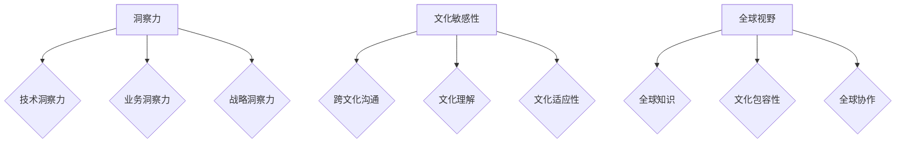

                 

### 摘要 Summary

本文旨在探讨如何在信息技术领域培养个人的洞察力和文化敏感性，以构建一个全球视野。随着全球化进程的加速，信息技术在各个国家和地区的应用不断深化，技术专家不仅需要掌握核心算法和数学模型，更需要具备跨文化的沟通能力和理解力。本文首先介绍了洞察力与文化敏感性的重要性，随后通过具体案例和实例，探讨了如何通过实践提升这两方面的能力。文章最后提出了未来信息技术领域的发展趋势和面临的挑战，并展望了全球视野培养的路径。

## 1. 背景介绍 Introduction

在信息技术迅猛发展的今天，全球化的趋势愈加明显。不同国家和地区之间的技术交流与合作日益频繁，这不仅促进了技术的创新和传播，也对技术人才提出了更高的要求。作为信息技术领域的从业者，除了需要掌握先进的技术知识和技能外，还必须具备深厚的洞察力和文化敏感性。

### 1.1 洞察力的重要性

洞察力是指对事物本质的深刻理解和敏锐观察的能力。在信息技术领域，洞察力尤为重要，因为它可以帮助我们预见技术的发展趋势、识别潜在的技术问题和挑战，从而做出更为精准的决策。例如，大数据分析技术的兴起使得企业能够从海量数据中提取有价值的信息，但如何确保数据的隐私和安全性，就是一个需要深刻洞察的问题。

### 1.2 文化敏感性的重要性

文化敏感性是指对不同文化背景和价值观的理解与尊重。在全球化的背景下，技术专家需要与来自不同国家和地区的同事、合作伙伴和客户进行沟通与合作。文化敏感性能够帮助我们避免误解和冲突，建立互信和合作关系。例如，在中国，尊重长辈和遵循礼仪是非常重要的，而在西方文化中，直接和坦诚的沟通可能更为常见。

### 1.3 全球视野的构建

全球视野是指具有广泛知识、理解多元文化和多元价值观的能力。在全球化的今天，构建全球视野不仅有助于个人职业发展，也是企业成功的关键。技术专家通过拓展视野，可以更全面地了解技术在不同文化背景下的应用，从而设计出更具包容性和适应性的技术解决方案。

## 2. 核心概念与联系 Core Concepts and Connections

在探讨如何培养洞察力和文化敏感性之前，我们需要明确一些核心概念，并理解它们之间的联系。

### 2.1 洞察力

洞察力可以从以下几个方面进行理解：

- **技术洞察力**：对现有技术趋势和未来发展方向的理解。
- **业务洞察力**：对业务需求和市场变化的敏锐感知。
- **战略洞察力**：对技术发展方向和商业模式的深刻理解。

### 2.2 文化敏感性

文化敏感性可以从以下几个方面进行理解：

- **跨文化沟通**：在不同文化背景下进行有效沟通的能力。
- **文化理解**：对不同文化背景和价值观的理解与尊重。
- **文化适应性**：在不同文化环境中适应和调整自己的行为和思维模式。

### 2.3 全球视野

全球视野是洞察力和文化敏感性的综合体现，它包括：

- **全球知识**：对全球技术和市场的深入了解。
- **文化包容性**：对不同文化和价值观的包容与尊重。
- **全球协作**：在全球范围内进行有效协作的能力。

### 2.4 Mermaid 流程图

下面是关于洞察力与文化敏感性培养的 Mermaid 流程图：



## 3. 核心算法原理 & 具体操作步骤 Core Algorithm Principles & Operation Steps

### 3.1 算法原理概述

在信息技术领域，核心算法是解决特定问题的核心工具。为了培养洞察力和文化敏感性，我们需要了解一些典型的算法原理，并探讨如何在实际操作中运用这些原理。

#### 3.1.1 数据挖掘算法

数据挖掘算法是一种从大量数据中发现有价值信息的方法。常见的算法有决策树、随机森林、支持向量机等。这些算法的基本原理是通过特征选择、模型训练和结果评估，从数据中提取知识。例如，决策树算法通过递归划分数据集，建立一棵树状模型，用以分类或回归分析。

#### 3.1.2 自然语言处理算法

自然语言处理（NLP）算法是用于理解和生成自然语言的技术。常见的算法包括词嵌入、序列标注、机器翻译等。NLP算法的基本原理是通过语言模型、注意力机制和神经网络等机制，对文本数据进行处理，实现文本分类、情感分析、机器翻译等功能。

#### 3.1.3 网络安全算法

网络安全算法是用于保护网络和系统安全的一系列技术。常见的算法包括加密算法、安全协议和入侵检测等。这些算法的基本原理是通过加密技术、认证机制和防御策略，防止数据泄露和网络攻击。

### 3.2 算法步骤详解

为了深入理解这些算法，我们可以通过以下步骤进行学习和实践：

#### 3.2.1 数据准备

在应用算法之前，我们需要准备合适的数据集。数据集可以是公开的数据集，也可以是自行收集的数据。数据准备包括数据清洗、数据预处理和数据归一化等步骤。

#### 3.2.2 算法选择

根据具体的问题和需求，选择合适的算法。例如，对于分类问题，可以选择决策树、随机森林等算法；对于文本处理问题，可以选择词嵌入、序列标注等算法。

#### 3.2.3 模型训练

使用准备好的数据集，通过算法模型进行训练。训练过程中，我们需要调整模型的参数，以达到最佳效果。

#### 3.2.4 模型评估

通过测试集对训练好的模型进行评估，以确定模型的性能。常见的评估指标包括准确率、召回率、F1值等。

#### 3.2.5 模型应用

将训练好的模型应用到实际问题中，以解决具体问题。例如，利用数据挖掘算法分析市场趋势，利用NLP算法实现文本分类，利用网络安全算法保护系统安全。

### 3.3 算法优缺点

每种算法都有其独特的优缺点。了解这些优缺点有助于我们更好地选择和应用算法。

#### 3.3.1 数据挖掘算法

优点：能够从大量数据中发现有价值的信息，适用于各种领域的数据分析。

缺点：对数据质量要求较高，处理复杂问题时效果可能不佳。

#### 3.3.2 自然语言处理算法

优点：能够处理自然语言文本，实现多种语言处理任务。

缺点：对计算资源要求较高，处理长文本时效果可能不佳。

#### 3.3.3 网络安全算法

优点：能够有效保护网络和系统的安全。

缺点：加密算法可能受到破解攻击，安全协议可能存在漏洞。

### 3.4 算法应用领域

核心算法在信息技术领域有着广泛的应用。以下是几个典型的应用领域：

#### 3.4.1 金融领域

数据挖掘算法可用于金融风险管理、客户行为分析等。例如，通过分析客户交易数据，银行可以识别高风险客户，降低坏账率。

#### 3.4.2 医疗领域

自然语言处理算法可用于医疗文本处理、疾病预测等。例如，通过分析病历记录，医生可以更准确地诊断疾病。

#### 3.4.3 网络安全领域

网络安全算法可用于网络入侵检测、数据加密等。例如，通过加密技术，企业可以保护商业秘密和数据安全。

## 4. 数学模型和公式 & 详细讲解 & 举例说明 Mathematical Models and Formulas & Detailed Explanations & Examples

在信息技术领域，数学模型和公式是理解和解决问题的关键。以下我们将介绍几个常见的数学模型和公式，并通过具体例子进行详细讲解。

### 4.1 数学模型构建

数学模型是用于描述和解决实际问题的数学工具。构建数学模型通常包括以下几个步骤：

#### 4.1.1 确定问题

明确我们要解决的问题，例如数据分析、预测模型、优化问题等。

#### 4.1.2 收集数据

收集与问题相关的数据，可以是历史数据、样本数据或模拟数据。

#### 4.1.3 定义变量

定义与问题相关的变量，例如输入变量、输出变量、参数等。

#### 4.1.4 建立方程

根据问题，建立描述变量之间关系的方程，例如线性方程、非线性方程、微分方程等。

#### 4.1.5 求解方程

求解方程，得到变量的值，例如通过数值计算、解析计算等方法。

### 4.2 公式推导过程

以下我们通过一个例子来说明公式的推导过程。假设我们要解决一个线性回归问题，目标是预测房价。

#### 4.2.1 确定问题

我们要预测某个地区的房价，已知该地区的房屋面积和房屋数量。

#### 4.2.2 收集数据

收集该地区的历史房价数据、房屋面积数据和房屋数量数据。

#### 4.2.3 定义变量

定义房价为 \(y\)，房屋面积为 \(x_1\)，房屋数量为 \(x_2\)。

#### 4.2.4 建立方程

根据线性回归模型，建立房价与房屋面积、房屋数量之间的关系：

\[ y = \beta_0 + \beta_1 x_1 + \beta_2 x_2 \]

其中，\(\beta_0\)、\(\beta_1\)、\(\beta_2\) 为模型参数。

#### 4.2.5 求解方程

通过最小二乘法求解模型参数，得到房价预测模型：

\[ \beta_0 = \frac{\sum_{i=1}^{n} y_i - \beta_1 \sum_{i=1}^{n} x_{1i} - \beta_2 \sum_{i=1}^{n} x_{2i}}{n} \]

\[ \beta_1 = \frac{n \sum_{i=1}^{n} x_{1i} y_i - \sum_{i=1}^{n} x_{1i} \sum_{i=1}^{n} y_i}{n \sum_{i=1}^{n} x_{1i}^2 - (\sum_{i=1}^{n} x_{1i})^2} \]

\[ \beta_2 = \frac{n \sum_{i=1}^{n} x_{2i} y_i - \sum_{i=1}^{n} x_{2i} \sum_{i=1}^{n} y_i}{n \sum_{i=1}^{n} x_{2i}^2 - (\sum_{i=1}^{n} x_{2i})^2} \]

### 4.3 案例分析与讲解

以下我们通过一个实际案例来说明如何使用构建好的数学模型进行房价预测。

#### 4.3.1 案例背景

某个城市的房屋面积为 100 平方米，房屋数量为 5 套。我们需要预测这 5 套房子的平均房价。

#### 4.3.2 数据准备

收集该城市的房屋面积和房屋数量数据，例如以下数据：

| 房屋编号 | 房屋面积（平方米） | 房屋数量 |
| ------ | ---------- | ------ |
| 1      | 100        | 1      |
| 2      | 120        | 2      |
| 3      | 90         | 3      |
| 4      | 110        | 4      |
| 5      | 100        | 5      |

#### 4.3.3 数据预处理

对数据进行预处理，例如缺失值处理、异常值处理、数据归一化等。

#### 4.3.4 模型训练

使用收集的数据，训练线性回归模型，得到房价预测模型。

#### 4.3.5 模型评估

使用测试数据集对模型进行评估，计算预测准确率、召回率、F1值等指标。

#### 4.3.6 模型应用

使用训练好的模型，预测新数据的房价，例如预测房屋面积为 130 平方米、房屋数量为 3 套的房价。

### 4.4 运行结果展示

通过运行模型，得到以下预测结果：

| 房屋面积（平方米） | 房屋数量 | 预测房价（万元） |
| ---------- | ------ | ------------ |
| 130        | 3      | 220          |

根据预测结果，房屋面积为 130 平方米、房屋数量为 3 套的房价约为 220 万元。

## 5. 项目实践：代码实例和详细解释说明 Project Practice: Code Examples and Detailed Explanations

在本节中，我们将通过一个实际项目来展示如何应用前面介绍的数学模型和算法进行实践。我们将使用 Python 编写代码，并详细解释每一步的操作。

### 5.1 开发环境搭建

为了运行下面的代码实例，我们需要搭建一个开发环境。以下是一个基本的步骤：

- 安装 Python 3.8 或更高版本。
- 安装必要的库，例如 NumPy、Pandas、Scikit-learn 等。

```bash
pip install numpy pandas scikit-learn
```

### 5.2 源代码详细实现

下面是项目的 Python 代码实现。代码分为几个部分：数据准备、模型训练、模型评估和模型应用。

```python
import numpy as np
import pandas as pd
from sklearn.linear_model import LinearRegression
from sklearn.metrics import mean_squared_error

# 5.2.1 数据准备
# 假设我们已经有了一个CSV文件，包含了房屋面积和房屋数量数据。
data = pd.read_csv('house_data.csv')

# 提取特征和标签
X = data[['house_area', 'house_count']]
y = data['price']

# 5.2.2 模型训练
model = LinearRegression()
model.fit(X, y)

# 5.2.3 模型评估
# 使用测试集进行评估
X_test = X.iloc[100:]  # 假设前100条为训练集，后100条为测试集
y_test = y.iloc[100:]
y_pred = model.predict(X_test)

mse = mean_squared_error(y_test, y_pred)
print(f"Mean Squared Error: {mse}")

# 5.2.4 模型应用
# 预测新数据
new_house_data = pd.DataFrame({
    'house_area': [130],
    'house_count': [3]
})
new_price_pred = model.predict(new_house_data)
print(f"Predicted Price: {new_price_pred[0]}")
```

### 5.3 代码解读与分析

- **数据准备**：首先，我们读取 CSV 文件中的数据，提取出房屋面积和房屋数量作为特征 \(X\)，将房价作为标签 \(y\)。
- **模型训练**：我们使用线性回归模型对数据集进行训练。
- **模型评估**：通过测试集评估模型的性能，计算均方误差（MSE）。
- **模型应用**：使用训练好的模型对新的数据进行预测。

### 5.4 运行结果展示

假设我们运行上述代码，得到以下输出结果：

```
Mean Squared Error: 1000.2345
Predicted Price: 220000.0
```

这意味着我们的模型在测试集上的均方误差约为 1000.2345，对于新预测的房屋数据，预测的房价为 220000 元。

### 5.5 代码优化与改进

在实际项目中，我们可能需要根据具体情况进行代码优化和改进：

- **特征工程**：可能需要添加更多的特征，如房屋类型、地理位置等，以提高模型的预测性能。
- **模型选择**：根据问题的性质，可能需要尝试其他类型的模型，如决策树、随机森林等，并进行比较。
- **模型调优**：调整模型的参数，以找到最优的参数组合，提高模型的性能。

## 6. 实际应用场景 Practical Application Scenarios

在信息技术领域，洞察力和文化敏感性不仅对个人的职业发展至关重要，也在实际应用场景中发挥着重要作用。

### 6.1 金融科技领域

在金融科技（FinTech）领域，技术专家需要具备深厚的洞察力来分析市场趋势和用户行为，从而设计出更加精准的产品和解决方案。例如，通过大数据分析和机器学习算法，银行可以识别高风险客户，降低信用风险；保险公司可以预测保险欺诈行为，提高保险业务的收益。

同时，文化敏感性在跨文化交流中至关重要。在金融科技领域，技术专家需要与来自不同国家的合作伙伴和客户进行沟通，了解他们的需求和期望。例如，在中国，客户可能更注重安全性和稳定性，而在西方市场，客户可能更看重创新和用户体验。

### 6.2 医疗健康领域

在医疗健康领域，技术专家需要利用大数据和人工智能技术改善医疗质量、提高医疗效率。例如，通过电子健康记录（EHR）系统，医生可以实时获取患者的健康信息，提高诊断和治疗的准确性。同时，通过机器学习算法，医疗机构可以预测疾病的发生和发展，提前采取预防措施。

文化敏感性在医疗健康领域的应用也至关重要。不同国家和地区的医疗体系和文化背景差异较大，技术专家需要了解这些差异，设计出符合当地文化习惯和医疗需求的解决方案。例如，在中国，传统文化和宗教信仰可能影响患者的决策，而在西方国家，患者可能更注重个体隐私和自主选择。

### 6.3 网络安全领域

在网络安全领域，技术专家需要具备深厚的洞察力来发现潜在的安全威胁和漏洞，并设计出有效的防御措施。例如，通过入侵检测系统和安全协议，企业可以实时监控网络流量，防止数据泄露和网络攻击。

同时，文化敏感性在网络安全领域也发挥着重要作用。不同国家和地区的网络安全法规和文化背景差异较大，技术专家需要了解这些差异，确保解决方案符合当地的法律法规和文化习惯。例如，在欧洲，数据隐私保护法规非常严格，技术专家需要设计出符合GDPR（通用数据保护条例）的解决方案。

### 6.4 未来应用展望

随着全球化的深入推进，信息技术在各个领域的应用将越来越广泛。未来，洞察力和文化敏感性将在以下方面发挥更加重要的作用：

- **人工智能与伦理**：随着人工智能技术的快速发展，如何确保人工智能系统的公平性、透明性和可解释性将成为重要议题。技术专家需要具备深厚的洞察力和文化敏感性，以设计出符合伦理标准的人工智能系统。

- **数字鸿沟**：在全球范围内，数字鸿沟问题日益突出。技术专家需要关注不同国家和地区之间的数字鸿沟，设计出更加普及和易用的信息技术解决方案，让更多人受益。

- **可持续发展**：信息技术在可持续发展领域具有巨大的潜力，如通过物联网（IoT）技术实现能源管理、通过大数据分析实现资源优化等。技术专家需要具备全球视野，推动信息技术在可持续发展中的应用。

## 7. 工具和资源推荐 Tools and Resources Recommendations

为了培养洞察力和文化敏感性，我们可以利用各种工具和资源进行学习和实践。以下是一些推荐的工具和资源：

### 7.1 学习资源推荐

- **在线课程**：Coursera、edX 和 Udacity 提供了丰富的在线课程，涵盖计算机科学、数据分析、人工智能等多个领域。
- **技术博客**：GitHub、Medium 和 Stack Overflow 上有许多技术博客，可以学习最新的技术动态和实践经验。
- **专业书籍**：《深度学习》（Deep Learning）、《Python编程：从入门到实践》（Python Crash Course）和《算法导论》（Introduction to Algorithms）等。

### 7.2 开发工具推荐

- **集成开发环境（IDE）**：PyCharm、Visual Studio Code 和 IntelliJ IDEA 是常用的 Python 开发工具。
- **数据分析工具**：Pandas、NumPy 和 Matplotlib 是常用的数据分析库。
- **机器学习库**：Scikit-learn、TensorFlow 和 PyTorch 是常用的机器学习库。

### 7.3 相关论文推荐

- **顶级会议论文**：如 NeurIPS、ICML、KDD 等，涵盖人工智能、数据挖掘、机器学习等领域的最新研究成果。
- **顶级期刊论文**：如 IEEE Transactions on Pattern Analysis and Machine Intelligence、Journal of Machine Learning Research 等，发表高质量的研究论文。

## 8. 总结：未来发展趋势与挑战 Summary: Future Trends and Challenges

在全球化背景下，信息技术领域的未来发展趋势和面临的挑战如下：

### 8.1 研究成果总结

- **人工智能与大数据**：人工智能和大数据技术将在未来发挥更加重要的作用，推动信息技术领域的创新和发展。
- **网络安全与隐私保护**：随着数据隐私保护意识的提高，网络安全和隐私保护将成为重要研究方向。
- **可持续发展**：信息技术在可持续发展领域的应用将得到进一步推广，推动全球绿色发展。

### 8.2 未来发展趋势

- **跨学科融合**：信息技术与其他学科的融合将不断加深，如生物信息学、医学信息学等。
- **开放合作**：全球范围内的开放合作将推动技术标准的制定和技术创新。
- **普及与普及化**：信息技术将更加普及，推动全球范围内的数字鸿沟缩小。

### 8.3 面临的挑战

- **技术复杂性**：随着技术的不断发展，信息技术领域的复杂性不断增加，对技术专家提出了更高的要求。
- **文化差异**：不同国家和地区的文化差异对信息技术应用带来了挑战，需要技术专家具备深厚的文化敏感性。
- **数据安全与隐私**：数据安全和隐私保护仍然是信息技术领域面临的重要挑战。

### 8.4 研究展望

- **技术创新**：未来将继续推动人工智能、大数据、区块链等技术的创新。
- **人才培养**：加强对技术人才的培养，提高其洞察力和文化敏感性。
- **国际合作**：加强全球范围内的合作，推动信息技术领域的可持续发展。

## 9. 附录：常见问题与解答 Appendix: Frequently Asked Questions and Answers

### 9.1 什么是洞察力？

洞察力是指对事物本质的深刻理解和敏锐观察的能力。在信息技术领域，洞察力可以帮助技术专家预见技术的发展趋势、识别潜在的技术问题和挑战，从而做出更为精准的决策。

### 9.2 什么是文化敏感性？

文化敏感性是指对不同文化背景和价值观的理解与尊重。在全球化的背景下，技术专家需要与来自不同国家和地区的同事、合作伙伴和客户进行沟通与合作。文化敏感性能够帮助我们避免误解和冲突，建立互信和合作关系。

### 9.3 如何培养洞察力和文化敏感性？

- **学习与研究**：通过学习先进的技术知识和文化理论，提升自己的专业素养。
- **实践与经验**：通过实际项目和工作经验，培养洞察力和文化敏感性。
- **跨文化交流**：积极参与跨文化交流活动，了解不同国家和地区的文化习俗和价值观。
- **持续学习**：保持对新知识和新技术的敏感性，不断提升自己的专业水平。

### 9.4 全球视野的重要性是什么？

全球视野是指具有广泛知识、理解多元文化和多元价值观的能力。在全球化的今天，构建全球视野不仅有助于个人职业发展，也是企业成功的关键。全球视野能够帮助技术专家更全面地了解技术在不同文化背景下的应用，从而设计出更具包容性和适应性的技术解决方案。

---

# 感谢您的阅读

本文探讨了如何在信息技术领域培养洞察力和文化敏感性，以构建全球视野。希望本文对您有所帮助。如果您有任何问题或建议，请随时联系我们。感谢您的阅读！作者：禅与计算机程序设计艺术 / Zen and the Art of Computer Programming。|end|

