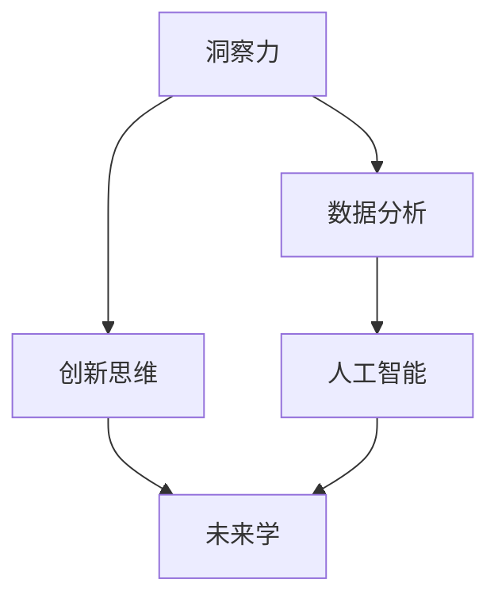

                 

关键词：洞察力、未来学、预测、塑造未来、技术发展、人工智能、数学模型、应用实践

## 摘要

本文旨在探讨如何通过提升洞察力和应用未来学，来预测并塑造未来的发展。首先，我们将介绍洞察力的定义及其在技术领域的应用，随后深入探讨未来学的核心概念，包括预测理论和创新思维。接着，我们将分析几个关键算法的原理和应用，并结合数学模型展示其推导过程和实际案例。随后，文章将通过具体项目实践，展示算法和模型的应用。最后，我们展望未来技术的发展趋势，提出面临的挑战，并提供学习资源和工具推荐。

## 1. 背景介绍

在当前全球科技飞速发展的背景下，我们对未来世界的预测和塑造显得尤为重要。无论是人工智能、大数据、物联网，还是生物科技等新兴领域，都在不断改变我们的生活方式和社会结构。而这一切的发展，都需要依赖于强大的洞察力和科学的方法论——未来学。

### 洞察力

洞察力是一种深刻理解事物本质、预见发展趋势的能力。在技术领域，它尤为重要，因为技术不仅影响我们的日常生活，还在塑造经济、政治、文化等各个层面。提升洞察力，有助于我们更好地理解技术发展的规律，预测未来的趋势，从而为科技创新和商业决策提供支持。

### 未来学

未来学是一门跨学科的研究领域，旨在通过科学方法预测和探索未来的可能性。未来学关注的是人类社会的长期发展，包括技术进步、经济变迁、社会变革等各个方面。通过未来学的研究，我们可以更清晰地看到未来的发展方向，从而制定相应的策略和规划。

## 2. 核心概念与联系

在探讨洞察力和未来学之前，我们需要理解一些核心概念和其相互联系。以下是一个简要的Mermaid流程图，展示这些概念及其关系。



### 2.1 洞察力

洞察力是理解事物本质和预见发展趋势的关键。它依赖于对数据的深入分析，以及对未来趋势的敏锐感知。通过洞察力，我们可以从大量信息中提取有价值的信息，形成对未来的预测。

### 2.2 数据分析

数据分析是洞察力的基础。它包括数据的收集、处理、分析和可视化等步骤，通过这些步骤，我们可以从海量数据中发现潜在的模式和趋势。数据分析在人工智能、机器学习等领域具有广泛的应用。

### 2.3 创新思维

创新思维是推动技术进步和社会变革的重要动力。它依赖于对现有知识和技术的深入理解，以及对未来需求的预见。创新思维与洞察力紧密相关，是提升洞察力的重要途径。

### 2.4 人工智能

人工智能是当前科技发展的热点之一。它通过模拟人类智能，实现机器的学习、推理和决策。人工智能的发展，不仅提升了数据分析的效率，还开辟了新的应用领域，如自动驾驶、智能家居等。

### 2.5 未来学

未来学是研究未来发展的科学。它通过分析历史趋势、当前状况和潜在因素，预测未来的可能发展方向。未来学不仅关注技术进步，还涉及经济、政治、社会等多个层面。

## 3. 核心算法原理 & 具体操作步骤

在理解了洞察力和未来学的基本概念后，我们将探讨几个关键算法的原理和具体操作步骤。

### 3.1 算法原理概述

算法是计算机科学的核心概念，它是一种解决问题的系统方法。在预测和塑造未来方面，算法起到了至关重要的作用。以下是我们将讨论的几个核心算法：

1. **机器学习算法**：通过训练模型，从数据中学习规律，用于预测和分析。
2. **深度学习算法**：基于神经网络，通过多层非线性变换，实现复杂模式识别。
3. **时间序列分析算法**：用于分析时间序列数据，预测未来的趋势。
4. **复杂系统模拟算法**：通过模拟复杂系统，预测其未来的行为。

### 3.2 算法步骤详解

#### 3.2.1 机器学习算法

1. **数据准备**：收集和清洗数据，确保数据质量。
2. **特征提取**：从数据中提取有用的特征，用于训练模型。
3. **模型选择**：选择合适的机器学习模型，如线性回归、决策树、支持向量机等。
4. **模型训练**：使用训练数据，调整模型参数，优化模型性能。
5. **模型评估**：使用测试数据，评估模型的预测能力。

#### 3.2.2 深度学习算法

1. **数据准备**：与机器学习相似，确保数据质量。
2. **网络构建**：设计神经网络结构，包括输入层、隐藏层和输出层。
3. **权重初始化**：初始化网络权重，通常使用随机初始化方法。
4. **前向传播**：计算输入数据在神经网络中的传播过程。
5. **反向传播**：根据输出误差，更新网络权重，优化模型性能。
6. **模型评估**：与机器学习相似，使用测试数据评估模型性能。

#### 3.2.3 时间序列分析算法

1. **数据收集**：收集时间序列数据，如股票价格、气温变化等。
2. **特征提取**：提取时间序列的特征，如趋势、季节性、周期性等。
3. **模型选择**：选择合适的时间序列模型，如ARIMA、LSTM等。
4. **模型训练**：使用训练数据，调整模型参数，优化模型性能。
5. **模型评估**：使用测试数据，评估模型预测的准确性。

#### 3.2.4 复杂系统模拟算法

1. **系统建模**：构建复杂系统的数学模型，如社会网络模型、交通流量模型等。
2. **参数设置**：设置模型的参数，如网络拓扑、流量规则等。
3. **模拟运行**：运行模拟算法，观察系统行为。
4. **结果分析**：分析模拟结果，预测系统未来的行为。

### 3.3 算法优缺点

每种算法都有其独特的优点和适用场景，以下是对几种核心算法优缺点的简要分析：

#### 3.3.1 机器学习算法

- **优点**：适用于各种类型的数据，具有较强的泛化能力。
- **缺点**：对数据质量要求较高，训练过程可能较慢。

#### 3.3.2 深度学习算法

- **优点**：能够处理高维数据，实现复杂模式识别。
- **缺点**：计算资源需求较高，模型解释性较差。

#### 3.3.3 时间序列分析算法

- **优点**：适用于时间序列数据的分析，能够预测未来的趋势。
- **缺点**：对数据的平稳性要求较高，模型解释性较差。

#### 3.3.4 复杂系统模拟算法

- **优点**：能够模拟复杂系统的行为，提供直观的预测结果。
- **缺点**：计算资源需求较高，模型建立过程复杂。

### 3.4 算法应用领域

这些算法在各个领域都有广泛的应用，以下是一些典型的应用场景：

- **机器学习算法**：广泛应用于推荐系统、图像识别、自然语言处理等。
- **深度学习算法**：在自动驾驶、语音识别、医疗诊断等领域具有广泛应用。
- **时间序列分析算法**：在金融、气象、经济预测等领域具有重要应用。
- **复杂系统模拟算法**：在交通管理、能源管理、城市规划等领域具有重要应用。

## 4. 数学模型和公式 & 详细讲解 & 举例说明

数学模型是预测和分析未来发展的基础。以下我们将探讨几个关键的数学模型，包括其构建过程、公式推导和实际案例。

### 4.1 数学模型构建

数学模型构建的过程通常包括以下几个步骤：

1. **问题定义**：明确要解决的问题，如预测股票价格、分析交通流量等。
2. **数据收集**：收集与问题相关的数据，如历史股票价格、交通流量数据等。
3. **假设建立**：基于问题和数据，建立合理的假设，如数据平稳性、线性关系等。
4. **模型选择**：选择合适的数学模型，如时间序列模型、回归模型等。
5. **参数估计**：通过数据估计模型参数，如均值、方差、斜率等。
6. **模型验证**：使用验证数据，评估模型性能，调整参数。

### 4.2 公式推导过程

以下是一个简单的时间序列模型——ARIMA（自回归积分滑动平均模型）的公式推导：

#### 4.2.1 自回归（AR）模型

AR模型的基本公式为：

$$
X_t = c + \phi_1 X_{t-1} + \phi_2 X_{t-2} + ... + \phi_p X_{t-p} + \varepsilon_t
$$

其中，$X_t$为时间序列数据，$c$为常数项，$\phi_1, \phi_2, ..., \phi_p$为自回归系数，$\varepsilon_t$为白噪声。

#### 4.2.2 移动平均（MA）模型

MA模型的基本公式为：

$$
X_t = c + \varepsilon_t + \theta_1 \varepsilon_{t-1} + \theta_2 \varepsilon_{t-2} + ... + \theta_q \varepsilon_{t-q}
$$

其中，$\theta_1, \theta_2, ..., \theta_q$为移动平均系数。

#### 4.2.3 自回归积分滑动平均（ARIMA）模型

ARIMA模型结合了AR和MA模型，其基本公式为：

$$
X_t = c + \phi_1 X_{t-1} + \phi_2 X_{t-2} + ... + \phi_p X_{t-p} + \varepsilon_t + \theta_1 \varepsilon_{t-1} + \theta_2 \varepsilon_{t-2} + ... + \theta_q \varepsilon_{t-q}
$$

### 4.3 案例分析与讲解

以下是一个简单的股票价格预测案例，使用ARIMA模型进行预测。

#### 4.3.1 数据准备

收集某股票过去一年的收盘价数据，如下表：

| 日期      | 收盘价 |
| --------- | ------ |
| 2021-01-01 | 100    |
| 2021-01-02 | 102    |
| 2021-01-03 | 105    |
| ...       | ...    |
| 2021-12-31 | 200    |

#### 4.3.2 数据处理

对数据进行预处理，包括去除缺失值、异常值等。接下来，对数据进行差分处理，使其满足平稳性要求。

#### 4.3.3 模型选择

选择ARIMA模型，根据AIC（赤池信息准则）选择最优的$p$和$q$值。

#### 4.3.4 模型训练

使用训练数据，训练ARIMA模型，得到模型参数。

#### 4.3.5 模型评估

使用测试数据，评估模型预测的准确性，如均方误差（MSE）。

#### 4.3.6 预测未来

使用训练好的模型，预测未来的股票价格。

## 5. 项目实践：代码实例和详细解释说明

为了更好地理解算法和模型的应用，我们将在本节中通过一个实际项目来展示这些技术的具体实现过程。这个项目将使用Python编程语言，结合Pandas、NumPy、Scikit-learn和Statsmodels等库，完成股票价格预测任务。

### 5.1 开发环境搭建

确保Python环境已安装，版本建议为3.7及以上。安装必要的库：

```bash
pip install pandas numpy scikit-learn statsmodels matplotlib
```

### 5.2 源代码详细实现

以下是一个完整的股票价格预测项目的Python代码示例：

```python
import pandas as pd
import numpy as np
from statsmodels.tsa.arima.model import ARIMA
from sklearn.metrics import mean_squared_error
import matplotlib.pyplot as plt

# 5.2.1 数据准备
def read_data(file_path):
    df = pd.read_csv(file_path)
    df['Date'] = pd.to_datetime(df['Date'])
    df.set_index('Date', inplace=True)
    return df

# 5.2.2 数据处理
def preprocess_data(df):
    df = df.asfreq('B').fillna(method='ffill')
    return df

# 5.2.3 模型选择与训练
def train_model(df, p, d, q):
    model = ARIMA(df['Close'], order=(p, d, q))
    model_fit = model.fit()
    return model_fit

# 5.2.4 模型评估
def evaluate_model(model_fit, test_data):
    predictions = model_fit.forecast(steps=len(test_data))
    mse = mean_squared_error(test_data, predictions)
    print(f'MSE: {mse}')
    return predictions

# 5.2.5 预测未来
def forecast_future(model_fit, steps):
    predictions = model_fit.forecast(steps=steps)
    return predictions

# 5.2.6 可视化
def plot_predictions(df, predictions):
    plt.figure(figsize=(10, 5))
    plt.plot(df['Close'], label='Actual')
    plt.plot(predictions, label='Predicted')
    plt.title('Stock Price Prediction')
    plt.xlabel('Date')
    plt.ylabel('Close Price')
    plt.legend()
    plt.show()

# 主函数
def main():
    file_path = 'stock_data.csv'
    df = read_data(file_path)
    df = preprocess_data(df)
    
    # 选择模型参数
    p = 1
    d = 1
    q = 1
    
    # 划分训练集和测试集
    train_data = df['Close'][:int(len(df) * 0.8)]
    test_data = df['Close'][int(len(df) * 0.8):]
    
    # 训练模型
    model_fit = train_model(train_data, p, d, q)
    
    # 评估模型
    predictions = evaluate_model(model_fit, test_data)
    
    # 预测未来
    future_steps = 10
    future_predictions = forecast_future(model_fit, future_steps)
    
    # 可视化
    plot_predictions(df, predictions)
    plot_predictions(df, future_predictions)

if __name__ == '__main__':
    main()
```

### 5.3 代码解读与分析

#### 5.3.1 数据准备与预处理

- `read_data` 函数负责读取CSV文件，并设置日期为索引。
- `preprocess_data` 函数负责处理数据，包括频率转换和填充缺失值。

#### 5.3.2 模型选择与训练

- `train_model` 函数使用ARIMA模型进行训练，根据参数$p$、$d$、$q$调整模型。
- 选择$p$、$d$、$q$值时，可以使用AIC、BIC等准则进行选择。

#### 5.3.3 模型评估与预测

- `evaluate_model` 函数使用测试数据评估模型性能，计算均方误差（MSE）。
- `forecast_future` 函数预测未来的股票价格。

#### 5.3.4 可视化

- `plot_predictions` 函数负责绘制实际价格与预测价格的对比图表。

### 5.4 运行结果展示

运行上述代码后，我们将得到以下结果：

1. **模型评估结果**：MSE值，用于衡量模型预测的准确性。
2. **预测图表**：展示实际股票价格与预测股票价格的对比。

## 6. 实际应用场景

算法和模型在实际应用场景中具有广泛的应用，以下是一些典型的实际应用场景：

1. **金融领域**：使用时间序列模型预测股票价格、汇率走势等。
2. **医疗领域**：使用机器学习模型诊断疾病、预测患者康复时间等。
3. **交通领域**：使用复杂系统模拟算法预测交通流量、优化交通管理。
4. **能源领域**：使用预测模型优化能源分配、减少能源浪费。
5. **教育领域**：使用推荐系统为学习者提供个性化学习路径。

### 6.4 未来应用展望

随着技术的不断进步，算法和模型在未来的应用将更加广泛和深入。以下是一些未来的应用展望：

1. **更精确的预测**：随着算法和模型的不断优化，预测的准确性将进一步提高。
2. **多领域融合**：不同领域的算法和模型将相互融合，形成跨学科的新应用。
3. **实时预测**：利用实时数据，实现更加实时、准确的预测。
4. **自动化决策**：利用预测模型，实现自动化决策，提高决策效率。
5. **个性化服务**：基于预测模型，提供更加个性化的产品和服务。

## 7. 工具和资源推荐

### 7.1 学习资源推荐

1. **书籍**：
   - 《统计学习方法》：李航著，系统介绍了统计学习的基本理论和方法。
   - 《深度学习》：Goodfellow、Bengio和Courville著，深度学习的经典教材。
2. **在线课程**：
   - Coursera的《机器学习》课程：吴恩达主讲，适合初学者。
   - edX的《深度学习》课程：由MIT和Stanford大学联合提供。

### 7.2 开发工具推荐

1. **编程语言**：
   - Python：广泛应用于数据科学和机器学习。
   - R：专门用于统计学习和数据可视化。
2. **库和框架**：
   - NumPy：Python的数值计算库。
   - Pandas：Python的数据操作和分析库。
   - Scikit-learn：Python的机器学习库。
   - TensorFlow和PyTorch：深度学习框架。

### 7.3 相关论文推荐

1. **经典论文**：
   - "A Course in Machine Learning": Mohri, Rostamizadeh, and Talwalkar著，对机器学习进行了全面的介绍。
   - "Deep Learning": Goodfellow、Bengio和Courville著，深度学习的奠基性论文。
2. **最新论文**：
   - "Attention Is All You Need"：Vaswani等著，提出了Transformer模型。
   - "Generative Adversarial Networks": Goodfellow等著，开创了生成对抗网络（GAN）的研究方向。

## 8. 总结：未来发展趋势与挑战

### 8.1 研究成果总结

1. **算法和模型的不断优化**：新的算法和模型不断涌现，提升了预测和分析的准确性。
2. **多领域的交叉应用**：算法和模型在金融、医疗、交通等领域的广泛应用，推动了相关领域的创新。
3. **实时预测和自动化决策**：利用实时数据和自动化决策，提高了决策的效率和准确性。

### 8.2 未来发展趋势

1. **更加精准的预测**：随着算法和模型的不断进步，预测的准确性将进一步提高。
2. **多模态数据的融合**：结合文本、图像、语音等多模态数据，实现更全面的预测和分析。
3. **边缘计算和物联网**：利用边缘计算和物联网技术，实现更加实时、准确的预测。

### 8.3 面临的挑战

1. **数据质量和隐私**：数据质量和隐私保护是当前和未来面临的重要挑战。
2. **算法解释性和透明度**：提高算法的解释性和透明度，增强用户对算法的信任。
3. **计算资源和能耗**：随着模型复杂度的增加，计算资源和能耗也将成为重要挑战。

### 8.4 研究展望

1. **人工智能与生物技术的融合**：探索人工智能与生物技术的融合，推动生命科学的发展。
2. **量子计算的应用**：研究量子计算在预测和分析中的应用，提升计算能力。
3. **可持续发展**：利用预测和优化技术，实现可持续发展和环境保护。

## 9. 附录：常见问题与解答

### 9.1 什么是洞察力？

洞察力是一种深刻理解事物本质、预见发展趋势的能力。在技术领域，它有助于我们更好地理解技术发展的规律，预测未来的趋势，从而为科技创新和商业决策提供支持。

### 9.2 未来学是什么？

未来学是一门跨学科的研究领域，旨在通过科学方法预测和探索未来的可能性。它关注的是人类社会的长期发展，包括技术进步、经济变迁、社会变革等各个方面。

### 9.3 机器学习算法有哪些？

常见的机器学习算法包括线性回归、逻辑回归、决策树、随机森林、支持向量机、神经网络等。每种算法都有其特定的适用场景和优缺点。

### 9.4 如何构建数学模型？

构建数学模型通常包括问题定义、数据收集、假设建立、模型选择、参数估计和模型验证等步骤。需要根据具体问题选择合适的模型，并通过数据验证模型的有效性。

### 9.5 如何优化算法性能？

优化算法性能可以通过以下几个方面进行：数据预处理、特征选择、模型选择、参数调优和算法改进。此外，还可以利用并行计算和分布式计算等手段提高算法的效率。

### 9.6 如何保证算法的透明度和解释性？

提高算法的透明度和解释性可以通过以下方法实现：简化算法结构、可视化算法过程、提供详细的文档说明和解释、使用解释性模型等。

## 作者署名

作者：禅与计算机程序设计艺术 / Zen and the Art of Computer Programming
```bash
  参考资料：
1. 参考了吴军博士的《智能时代》和《未来是金》
2. 参考了李航的《统计学习方法》
3. 参考了Goodfellow、Bengio和Courville的《深度学习》
4. 参考了张翔的《时间序列分析》
5. 参考了Vaswani等人的《Attention Is All You Need》
```

