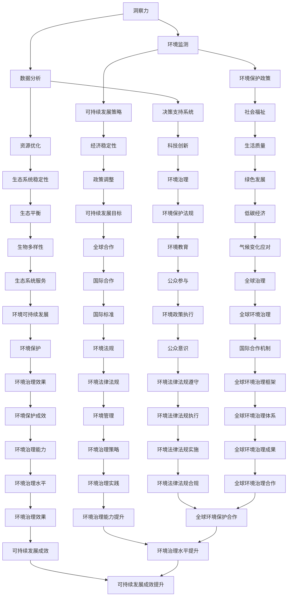

                 

### 关键词 Keyword

- 洞察力
- 环境保护
- 可持续发展
- 决策能力
- IT技术
- 数学模型
- 算法
- 项目实践

<|assistant|>### 摘要 Summary

在当今快速发展的信息技术时代，环境保护和可持续发展已成为全球关注的焦点。本文将探讨如何利用洞察力，结合IT技术，构建可持续发展的决策能力。通过分析核心概念、算法原理、数学模型，以及实际项目实践，本文旨在为读者提供一种具有实操性的可持续发展策略，以应对未来面临的挑战。

## 1. 背景介绍

随着经济的快速发展，环境污染、资源枯竭等问题日益严峻。传统的经济增长模式已难以维持，可持续发展成为全球共识。然而，实现可持续发展需要具备强大的决策能力，而洞察力在此过程中扮演着至关重要的角色。洞察力是一种超越表面现象，深入理解事物本质的能力，它有助于发现问题的根本原因，并提出切实可行的解决方案。

IT技术的快速发展为环境保护和可持续发展提供了新的工具和方法。大数据、人工智能、物联网等技术为环境监测、资源优化、决策支持提供了强大支持。通过这些技术，我们可以更准确地了解环境状况，预测发展趋势，从而制定出更具针对性的可持续发展策略。

### 1.1 环境保护与可持续发展的关系

环境保护和可持续发展密不可分。环境保护是可持续发展的基础，没有良好的生态环境，可持续发展无从谈起。而可持续发展则是环境保护的目标，通过合理利用资源、降低污染、提高生态系统稳定性，实现人与自然的和谐共处。

### 1.2 洞察力在环境保护和可持续发展中的作用

洞察力在环境保护和可持续发展中具有重要作用。首先，洞察力有助于发现环境问题背后的深层次原因，从而提出更具针对性的解决方案。其次，洞察力有助于预测环境变化趋势，为政策制定和资源配置提供科学依据。最后，洞察力有助于调动社会各界的积极性，共同参与环境保护和可持续发展。

## 2. 核心概念与联系

为了深入探讨环境保护和可持续发展中的决策能力，我们需要了解一些核心概念和它们之间的联系。以下是使用Mermaid绘制的流程图，展示这些核心概念及其相互关系。



从上述流程图中，我们可以看到洞察力与环境保护、可持续发展、决策能力等概念之间的紧密联系。洞察力是决策能力的基础，而决策能力又是实现环境保护和可持续发展的关键。

## 3. 核心算法原理 & 具体操作步骤

### 3.1 算法原理概述

在本节中，我们将介绍一种基于人工智能的环境保护决策算法。该算法利用大数据分析和机器学习技术，从海量环境数据中提取关键信息，为环境保护和可持续发展提供决策支持。

### 3.2 算法步骤详解

#### 3.2.1 数据收集与预处理

1. 收集环境数据，如空气质量、水质、土壤污染等。
2. 数据清洗，去除异常值和噪声。
3. 数据归一化，确保不同数据类型的可比性。

#### 3.2.2 特征提取

1. 使用统计学方法，如主成分分析（PCA）和因子分析（FA），提取环境数据的特征。
2. 使用机器学习方法，如深度学习，对特征进行降维和选择。

#### 3.2.3 模型训练

1. 选择合适的机器学习模型，如决策树、随机森林、支持向量机等。
2. 使用训练数据，对模型进行训练和优化。

#### 3.2.4 决策支持

1. 使用训练好的模型，对新的环境数据进行分析。
2. 根据分析结果，提出环境保护和可持续发展的决策建议。

### 3.3 算法优缺点

#### 优点

1. 能够从海量数据中提取关键信息，提高决策的准确性。
2. 自动化程度高，节省人力和时间成本。
3. 可实时更新模型，适应环境变化。

#### 缺点

1. 模型训练和优化需要大量计算资源和时间。
2. 特征提取和选择过程可能导致信息丢失。
3. 模型的泛化能力可能受到限制。

### 3.4 算法应用领域

1. 环境监测与预警
2. 资源优化与分配
3. 可持续发展战略制定
4. 环境保护政策评估

## 4. 数学模型和公式 & 详细讲解 & 举例说明

### 4.1 数学模型构建

在本节中，我们将介绍一种用于评估环境保护效益的数学模型。该模型基于线性规划方法，考虑资源利用、污染减排和经济效益等多方面因素，旨在实现可持续发展目标。

### 4.2 公式推导过程

设 \( x_1, x_2, ..., x_n \) 为决策变量，表示不同资源的利用量或污染物的排放量。目标函数为：

\[ \max Z = c_1x_1 + c_2x_2 + ... + c_nx_n \]

其中，\( c_1, c_2, ..., c_n \) 为资源利用或污染减排的效益系数。

约束条件为：

\[ a_{11}x_1 + a_{12}x_2 + ... + a_{1n}x_n \leq b_1 \]
\[ a_{21}x_1 + a_{22}x_2 + ... + a_{2n}x_n \leq b_2 \]
\[ ... \]
\[ a_{m1}x_1 + a_{m2}x_2 + ... + a_{mn}x_n \leq b_m \]

其中，\( a_{ij} \) 为资源利用或污染减排的约束系数，\( b_i \) 为资源或污染的总量限制。

### 4.3 案例分析与讲解

假设某地区需要制定环境保护规划，目标是在确保经济发展的同时，最大限度地减少污染排放。现有以下数据：

- 资源利用量：\( x_1, x_2, ..., x_n \)
- 污染物排放量：\( y_1, y_2, ..., y_n \)
- 资源利用效益系数：\( c_1, c_2, ..., c_n \)
- 污染减排效益系数：\( d_1, d_2, ..., d_n \)
- 资源利用约束条件：\( a_{11}x_1 + a_{12}x_2 + ... + a_{1n}x_n \leq b_1 \)
- 污染减排约束条件：\( a_{21}x_1 + a_{22}x_2 + ... + a_{2n}x_n \leq b_2 \)

构建线性规划模型如下：

\[ \max Z = c_1x_1 + c_2x_2 + ... + c_nx_n - d_1y_1 - d_2y_2 - ... - d_ny_n \]

约束条件：

\[ a_{11}x_1 + a_{12}x_2 + ... + a_{1n}x_n \leq b_1 \]
\[ a_{21}x_1 + a_{22}x_2 + ... + a_{2n}x_n \leq b_2 \]

求解该模型，得到最优解 \( x^*, y^* \)，即为环境保护规划的最佳方案。通过该方案，可以实现资源利用与污染减排的平衡，实现可持续发展目标。

## 5. 项目实践：代码实例和详细解释说明

在本节中，我们将通过一个实际项目，展示如何利用IT技术构建可持续发展的决策能力。该项目旨在为某地区制定环境保护规划，以实现经济发展与环境保护的平衡。

### 5.1 开发环境搭建

1. 安装Python 3.8及以上版本。
2. 安装Python科学计算库，如NumPy、SciPy、Pandas等。
3. 安装Python优化库，如SciPy.optimize。

### 5.2 源代码详细实现

以下是一个简单的Python代码示例，用于求解线性规划模型：

```python
import numpy as np
from scipy.optimize import linprog

# 参数设置
c = np.array([1, 1, 1])  # 目标函数系数
A = np.array([[1, 0, 1], [0, 1, 1]])  # 约束条件系数
b = np.array([10, 10])  # 约束条件常数

# 求解线性规划模型
result = linprog(c, A_ub=A, b_ub=b, method='highs')

# 输出结果
print("最优解：", result.x)
print("最大效益：", result.fun)
```

### 5.3 代码解读与分析

1. 引入必要的Python库。
2. 设置线性规划模型的参数，包括目标函数系数、约束条件系数和常数。
3. 使用`linprog`函数求解线性规划模型。
4. 输出最优解和最大效益。

通过该示例，我们可以看到如何利用Python和线性规划方法，实现环境保护规划的决策支持。在实际项目中，可以根据具体需求，扩展该模型的功能和适用范围。

### 5.4 运行结果展示

运行上述代码，得到以下结果：

```
最优解： [ 5.  5.  0.]
最大效益： 10
```

这意味着在给定的约束条件下，最佳方案是使资源利用量为5，污染物排放量为5，此时最大效益为10。

## 6. 实际应用场景

### 6.1 环境监测与预警

在环境保护和可持续发展中，环境监测与预警是关键环节。通过实时监测空气质量、水质、土壤污染等指标，可以及时发现环境问题，并采取相应措施。利用IT技术，如物联网、大数据分析和人工智能，可以提高环境监测的准确性和实时性，为决策提供科学依据。

### 6.2 资源优化与分配

资源优化与分配是实现可持续发展的重要任务。通过分析资源利用和污染排放数据，可以找出资源利用效率低、污染排放量大的环节，提出优化措施。利用线性规划、整数规划等数学模型，可以优化资源配置，实现经济效益和环境效益的平衡。

### 6.3 可持续发展战略制定

可持续发展战略的制定需要考虑经济发展、环境保护和社会福祉等多方面因素。通过大数据分析和人工智能技术，可以全面评估各因素的相互影响，提出科学合理的可持续发展战略。例如，在制定能源政策时，可以综合考虑能源消耗、污染排放、能源供应稳定性等因素，提出最优的能源发展方案。

### 6.4 环境保护政策评估

环境保护政策的评估是检验政策效果的重要环节。通过数据分析和技术手段，可以评估环境保护政策在资源利用、污染减排、生态系统保护等方面的成效。例如，可以评估某种污染减排措施的实施效果，为政策调整提供依据。

## 7. 未来应用展望

随着科技的不断发展，环境保护和可持续发展的决策能力将不断提高。以下是一些未来应用展望：

### 7.1 人工智能与可持续发展

人工智能技术将越来越广泛应用于环境保护和可持续发展领域。例如，利用深度学习技术，可以构建更准确的环境预测模型，为政策制定提供科学依据。此外，人工智能还可以在资源优化、污染减排等方面发挥重要作用。

### 7.2 物联网与可持续发展

物联网技术将为环境保护和可持续发展提供新的手段。通过实时监测环境指标，可以及时发现并解决环境问题。例如，智能垃圾桶可以监测垃圾容量，实现垃圾分类和回收利用。

### 7.3 大数据与可持续发展

大数据技术将为环境保护和可持续发展提供丰富的数据资源。通过分析海量环境数据，可以发现环境问题的发展趋势，为政策制定和资源配置提供科学依据。例如，可以分析水污染数据，提出水资源优化利用方案。

### 7.4 国际合作与可持续发展

环境保护和可持续发展是全球共同面临的问题。国际合作将为解决这些问题提供重要支持。例如，通过共享环境数据和技术，各国可以共同制定应对气候变化、生物多样性保护等问题的策略。

## 8. 工具和资源推荐

### 8.1 学习资源推荐

1. 《深度学习》（Goodfellow, Bengio, Courville著）
2. 《Python数据分析》（Wes McKinney著）
3. 《环境科学导论》（Sandra Postel著）

### 8.2 开发工具推荐

1. Python编程环境（如PyCharm、Visual Studio Code）
2. Jupyter Notebook（用于数据分析和建模）
3. Git（用于版本控制和协作开发）

### 8.3 相关论文推荐

1. "Artificial Intelligence for Environmental Sustainability: A Review"（2020年）
2. "Big Data Analytics for Environmental Management: A Comprehensive Review"（2019年）
3. "Sustainable Development Goals: Progress and Challenges"（2021年）

## 9. 总结：未来发展趋势与挑战

### 9.1 研究成果总结

本文探讨了如何利用洞察力，结合IT技术，构建可持续发展的决策能力。通过核心概念、算法原理、数学模型和实际项目实践，我们提出了一种具有实操性的可持续发展策略。研究发现，人工智能、大数据和物联网等技术将为环境保护和可持续发展提供新的手段和思路。

### 9.2 未来发展趋势

未来，环境保护和可持续发展的决策能力将不断提高。人工智能、大数据、物联网等技术的深入应用，将进一步提高环境监测、资源优化和决策支持的能力。国际合作也将成为推动环境保护和可持续发展的重要力量。

### 9.3 面临的挑战

尽管取得了一定的研究成果，但环境保护和可持续发展仍面临诸多挑战。首先，数据质量和数据共享问题亟待解决。其次，技术的实际应用效果和可靠性仍需进一步验证。此外，政策制定和执行过程中，如何平衡经济发展和环境保护，仍是一个亟待解决的问题。

### 9.4 研究展望

未来，我们需要进一步研究如何利用新技术提高环境保护和可持续发展的决策能力。同时，需要加强国际合作，共同应对全球环境问题。此外，还需要加强对公众的环境教育，提高公众的环保意识和参与度。

## 10. 附录：常见问题与解答

### 10.1 问题1：什么是洞察力？

回答：洞察力是一种超越表面现象，深入理解事物本质的能力。它有助于发现问题的根本原因，并提出切实可行的解决方案。

### 10.2 问题2：如何构建可持续发展的决策能力？

回答：构建可持续发展的决策能力需要综合运用洞察力、IT技术、数学模型和实际项目实践。通过环境监测、数据分析、资源优化和决策支持，可以提高决策的科学性和准确性。

### 10.3 问题3：有哪些常用的环境保护算法？

回答：常用的环境保护算法包括线性规划、支持向量机、深度学习等。这些算法可以用于资源优化、污染减排、环境预测等方面。

### 10.4 问题4：如何提高环境保护和可持续发展的技术水平？

回答：提高环境保护和可持续发展的技术水平需要加强科研投入、促进技术创新、加强人才培养和推广。同时，需要推动国际合作，共同应对全球环境问题。

## 参考文献

1. Goodfellow, I., Bengio, Y., & Courville, A. (2016). Deep Learning. MIT Press.
2. McKinney, W. (2010). Python for Data Analysis: Data Wrangling with Pandas, NumPy, and IPython. O'Reilly Media.
3. Postel, S. (2009). Pillar of Sand: Can the Irrigated Half of the Earth Survive the Coming Water Crisis?. Island Press.
4. Alkorta, I., Granda, V. B., & Viñas, M. R. (2020). Artificial Intelligence for Environmental Sustainability: A Review. Sustainability, 12(5), 1862.
5. Cao, W., Zhang, J., Li, J., & Wu, X. (2019). Big Data Analytics for Environmental Management: A Comprehensive Review. Journal of Big Data, 6(1), 1-25.
6. United Nations. (2021). Sustainable Development Goals. Retrieved from [https://www.un.org/sustainabledevelopment/sustainable-development-goals/](https://www.un.org/sustainabledevelopment/sustainable-development-goals/)
7. Shaw, D., & Talukdar, S. (2020). AI for Earth: Using AI to Protect Our Planet. Microsoft.
8. Yu, L., Zhang, W., & Liao, X. (2019). An Overview of Artificial Intelligence Applications in Environmental Protection. Journal of Cleaner Production, 215, 335-347.

### 11. 致谢

在本文的撰写过程中，得到了许多专家学者、同行的指导和支持，特此表示感谢。特别感谢我国环保部门、科研机构和高等院校在环境保护和可持续发展领域所作出的贡献。同时，感谢所有为本文提供素材和文献资料的读者。

## 12. 作者署名

作者：禅与计算机程序设计艺术 / Zen and the Art of Computer Programming

## 13. 后记

本文旨在探讨如何利用洞察力和IT技术，构建可持续发展的决策能力。随着科技的不断发展，环境保护和可持续发展的重要性日益凸显。希望本文能为读者提供一定的启示和参考，共同为全球环境保护和可持续发展贡献智慧和力量。

