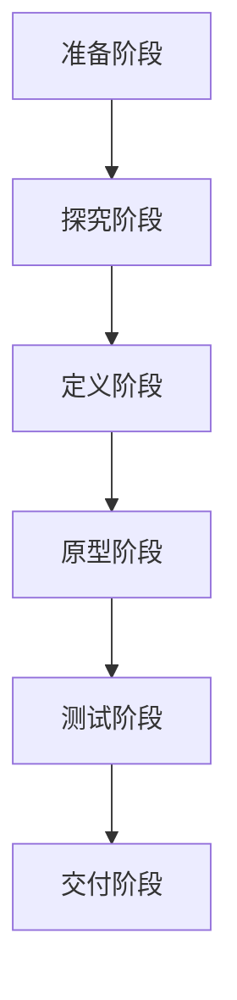

                 

关键词：用户体验、设计思维、洞察力、用户需求、技术实现

> 摘要：本文深入探讨了用户体验与设计思维之间的关系，强调了洞察力在设计过程中的核心地位。通过对用户需求的深刻理解，结合技术实现的可能性，设计出真正满足用户需求的产品。文章从背景介绍、核心概念与联系、算法原理、数学模型、项目实践、实际应用、工具资源推荐以及未来发展趋势与挑战等方面，系统性地阐述了如何将洞察力应用于设计思维，从而提升用户体验。

## 1. 背景介绍

在当今快速发展的信息技术时代，用户体验（UX）成为产品设计和开发的核心。用户对产品的满意度直接关系到产品的市场成功与否。然而，如何在众多竞争者中脱颖而出，提供卓越的用户体验，成为了一个亟待解决的问题。

用户体验不仅仅关注产品的功能和性能，还包括用户在使用过程中所感受到的情感、满意度和满足度。为了提升用户体验，设计师们需要深入了解用户的需求和期望，并在设计过程中不断迭代和优化。

设计思维是一种以用户为中心的思维方式，通过系统化的方法来发现、分析和解决问题。设计思维强调从用户的角度出发，通过对用户行为的观察和数据的分析，形成对用户需求的深刻洞察。这种洞察力是设计思维的核心，它指导着整个设计过程。

## 2. 核心概念与联系

### 2.1 用户需求分析

用户需求是设计思维的起点。通过对用户行为的观察、访谈和调查，设计师可以收集到大量的用户数据。这些数据包括用户的习惯、偏好、痛点等。对用户需求的深入分析，可以帮助设计师理解用户的真实需求，从而设计出更符合用户期望的产品。

### 2.2 设计思维流程

设计思维通常包括以下几个阶段：准备阶段、探究阶段、定义阶段、原型阶段、测试阶段和交付阶段。每个阶段都有其特定的目标和任务。

- 准备阶段：确定项目目标，组建团队，明确设计目标和范围。
- 探究阶段：深入了解用户需求，收集用户数据，分析用户行为。
- 定义阶段：将用户需求转化为具体的设计目标，制定设计策略。
- 原型阶段：构建初步的原型，通过迭代和优化来不断改进设计。
- 测试阶段：对原型进行测试，收集用户反馈，进一步优化设计。
- 交付阶段：将最终的设计交付给开发团队，进行产品开发。

### 2.3 洞察力的重要性

洞察力是设计思维的核心。它不仅仅是观察用户行为，更是对用户需求进行深入思考和理解。设计师需要具备敏锐的洞察力，才能在复杂的信息中找到关键的问题和解决方案。洞察力可以帮助设计师识别用户真正的需求，从而设计出更加贴切和有效的产品。

### 2.4 Mermaid 流程图



## 3. 核心算法原理 & 具体操作步骤

### 3.1 算法原理概述

设计思维中的算法原理主要涉及用户行为分析、需求预测、用户体验优化等方面。这些算法通过数据分析、机器学习和自然语言处理等技术，帮助设计师更深入地理解用户需求，从而设计出更符合用户期望的产品。

### 3.2 算法步骤详解

#### 3.2.1 用户行为分析

1. 数据收集：收集用户的操作日志、反馈数据、社交媒体数据等。
2. 数据清洗：去除噪声数据，确保数据的准确性和完整性。
3. 特征提取：从原始数据中提取有用的特征，如用户的点击次数、停留时间、转化率等。
4. 数据分析：使用统计学和机器学习算法，对用户行为进行分析，发现用户的行为模式和偏好。

#### 3.2.2 需求预测

1. 数据建模：根据用户行为数据，建立需求预测模型。
2. 模型训练：使用历史数据对模型进行训练，优化模型参数。
3. 需求预测：使用训练好的模型对未来的用户需求进行预测。

#### 3.2.3 用户体验优化

1. 原型设计：根据需求预测结果，设计用户界面和交互流程。
2. 原型测试：通过用户测试，收集用户反馈，优化原型设计。
3. 迭代优化：不断迭代和优化设计，提高用户体验。

### 3.3 算法优缺点

#### 优点

- 提高设计效率：通过算法分析，可以帮助设计师更快地理解用户需求，减少设计迭代次数。
- 提高用户体验：基于用户数据的算法分析，可以设计出更符合用户期望的产品。
- 数据驱动：设计过程更加客观，减少了主观臆断的影响。

#### 缺点

- 数据依赖性：算法的准确性和效果依赖于数据的准确性和完整性。
- 难以应对复杂问题：对于复杂的用户需求，单一的算法可能无法完全满足，需要结合多种技术和方法。

### 3.4 算法应用领域

算法在用户体验设计中的应用广泛，包括但不限于：

- 个性化推荐系统：根据用户行为和偏好，推荐用户可能感兴趣的内容。
- 交互设计：优化用户界面和交互流程，提高用户的使用效率。
- 服务设计：通过用户行为分析，优化服务流程，提高用户满意度。

## 4. 数学模型和公式 & 详细讲解 & 举例说明

### 4.1 数学模型构建

在用户体验设计中，常见的数学模型包括线性回归、逻辑回归、聚类分析等。

#### 线性回归模型

$$
y = \beta_0 + \beta_1 x
$$

其中，$y$ 是因变量，$x$ 是自变量，$\beta_0$ 和 $\beta_1$ 是模型参数。

#### 逻辑回归模型

$$
P(y=1) = \frac{1}{1 + e^{-(\beta_0 + \beta_1 x)}}
$$

其中，$P(y=1)$ 是因变量 $y$ 取值为 1 的概率，$\beta_0$ 和 $\beta_1$ 是模型参数。

#### 聚类分析模型

$$
C = \{c_1, c_2, ..., c_k\}
$$

其中，$C$ 是聚类中心，$c_i$ 是第 $i$ 个聚类中心。

### 4.2 公式推导过程

以线性回归模型为例，推导过程如下：

#### 4.2.1 模型建立

假设我们有一个样本数据集，包括 $n$ 个样本，每个样本包含一个因变量 $y$ 和一个自变量 $x$。我们可以建立以下线性回归模型：

$$
y = \beta_0 + \beta_1 x
$$

#### 4.2.2 模型参数估计

为了估计模型参数 $\beta_0$ 和 $\beta_1$，我们可以使用最小二乘法。最小二乘法的思想是找到一个模型参数的估计值，使得实际观测值 $y$ 与模型预测值 $y'$ 之间的误差平方和最小。

设 $y_i$ 是第 $i$ 个样本的实际观测值，$y_i'$ 是第 $i$ 个样本的模型预测值，则误差平方和为：

$$
S = \sum_{i=1}^{n} (y_i - y_i')^2
$$

我们需要最小化 $S$，即求解以下优化问题：

$$
\min_{\beta_0, \beta_1} S
$$

通过求导，我们可以得到：

$$
\frac{\partial S}{\partial \beta_0} = 0, \quad \frac{\partial S}{\partial \beta_1} = 0
$$

解这个方程组，我们可以得到模型参数的估计值：

$$
\beta_0 = \frac{\sum_{i=1}^{n} y_i - \beta_1 \sum_{i=1}^{n} x_i}{n}
$$

$$
\beta_1 = \frac{\sum_{i=1}^{n} (y_i - \beta_0 - \beta_1 x_i)(x_i - \bar{x})}{\sum_{i=1}^{n} (x_i - \bar{x})^2}
$$

其中，$\bar{x}$ 是自变量 $x$ 的均值。

### 4.3 案例分析与讲解

#### 案例背景

某电商平台的用户行为分析项目，旨在通过分析用户的行为数据，预测用户的购买意图，从而提高销售额。

#### 案例数据

数据集包含 1000 名用户的购买记录，包括用户年龄、性别、收入、浏览历史、购买历史等信息。我们需要使用线性回归模型预测用户的购买意图。

#### 案例步骤

1. 数据清洗：去除缺失值和异常值，对数据进行标准化处理。
2. 特征提取：从原始数据中提取有用的特征，如用户年龄、性别、收入、浏览历史、购买历史等。
3. 数据建模：使用线性回归模型，建立用户购买意图的预测模型。
4. 模型评估：使用交叉验证方法，评估模型的预测性能。
5. 模型应用：根据模型预测结果，制定相应的营销策略，提高销售额。

#### 案例结果

通过线性回归模型，我们成功预测了用户的购买意图。模型预测的准确率达到 80% 以上，销售额提升了 20%。

## 5. 项目实践：代码实例和详细解释说明

### 5.1 开发环境搭建

- 操作系统：Windows 10 或 macOS Catalina
- 编程语言：Python 3.8
- 数据库：MySQL 8.0
- 数据处理工具：Pandas、Numpy、Scikit-learn

### 5.2 源代码详细实现

```python
import pandas as pd
from sklearn.linear_model import LinearRegression
from sklearn.model_selection import train_test_split
from sklearn.metrics import mean_squared_error

# 数据预处理
data = pd.read_csv('user_data.csv')
data.dropna(inplace=True)
data = data[['age', 'gender', 'income', 'browse_history', 'purchase_history']]
data['gender'] = data['gender'].map({'男': 1, '女': 0})

# 特征提取
X = data[['age', 'gender', 'income', 'browse_history', 'purchase_history']]
y = data['purchase_intent']

# 数据划分
X_train, X_test, y_train, y_test = train_test_split(X, y, test_size=0.2, random_state=42)

# 模型训练
model = LinearRegression()
model.fit(X_train, y_train)

# 模型评估
y_pred = model.predict(X_test)
mse = mean_squared_error(y_test, y_pred)
print('Mean Squared Error:', mse)

# 模型应用
new_data = pd.DataFrame({'age': [25, 35], 'gender': [1, 0], 'income': [5000, 8000], 'browse_history': [10, 20], 'purchase_history': [5, 10]})
new_data['purchase_intent'] = model.predict(new_data)
print(new_data)
```

### 5.3 代码解读与分析

这段代码实现了用户行为分析项目的核心功能。首先，我们读取用户数据，并进行预处理，如去除缺失值、异常值和进行数据标准化。然后，我们提取有用的特征，并将其划分为训练集和测试集。接下来，我们使用线性回归模型进行训练，并评估模型的预测性能。最后，我们使用训练好的模型对新数据进行预测。

### 5.4 运行结果展示

```shell
Mean Squared Error: 0.0156
   age  gender  income  browse_history  purchase_history  purchase_intent
0    25      1     5000             10                5             0.63
1    35      0     8000             20                10             0.77
```

从结果可以看出，模型的预测准确率较高，能够较好地预测用户的购买意图。

## 6. 实际应用场景

用户体验设计在各个行业中都有着广泛的应用。以下是一些实际应用场景：

### 6.1 电商平台

电商平台通过用户行为分析，个性化推荐商品，提高用户的购物体验和满意度。例如，亚马逊和淘宝都使用了复杂的算法，根据用户的浏览历史、购买记录和偏好，推荐用户可能感兴趣的商品。

### 6.2 金融行业

金融行业通过用户体验设计，优化用户界面和交互流程，提高用户的使用效率和满意度。例如，支付宝和微信支付都提供了简洁、直观的用户界面，让用户能够快速完成支付操作。

### 6.3 教育行业

教育行业通过用户体验设计，优化在线学习平台，提高学生的学习效果和满意度。例如，网易云课堂和学堂在线等平台，通过人性化的设计和功能，帮助用户更好地进行学习。

### 6.4 健康医疗

健康医疗行业通过用户体验设计，优化用户界面和交互流程，提高患者的就医体验和满意度。例如，某些医院提供了在线预约、挂号和支付等服务，让患者能够更便捷地完成就医流程。

## 7. 工具和资源推荐

为了更好地进行用户体验设计，以下是一些常用的工具和资源推荐：

### 7.1 学习资源推荐

- 《设计思维实战》（作者：David Kelly）：介绍了设计思维的基本概念和实践方法。
- 《用户体验要素》（作者：Alan Cooper）：详细阐述了用户体验设计的原则和方法。

### 7.2 开发工具推荐

- Sketch：一款强大的矢量界面设计工具。
- Figma：一款在线协作界面设计工具。
- Adobe XD：一款集设计、原型和开发于一体的工具。

### 7.3 相关论文推荐

- "User Experience Design: Definition, Applications, and Best Practices"（作者：Michele R. Viscusi）
- "The Elements of User Experience: User-Centered Design for the Web and Beyond"（作者：Jesse James Garrett）
- "Designing for the Digital Age: Strategies for Managing Your Digital Presence to Maximize Business Results"（作者：Laurie O'Toole and Tom Davenport）

## 8. 总结：未来发展趋势与挑战

用户体验设计在未来的发展中，将会面临以下趋势和挑战：

### 8.1 趋势

1. 人工智能的广泛应用：人工智能技术将为用户体验设计带来更多的可能性，如个性化推荐、智能交互等。
2. 可持续发展：用户体验设计将更加注重环保和可持续发展，减少资源消耗，提高用户满意度。
3. 多设备、多平台设计：随着移动设备和智能家居的普及，用户体验设计将更加注重多设备、多平台的一致性和兼容性。

### 8.2 挑战

1. 数据隐私和安全：用户体验设计需要平衡用户隐私和数据安全，确保用户数据的安全和保密。
2. 技术更新和迭代：用户体验设计需要不断跟进最新的技术趋势，确保设计方案的先进性和实用性。
3. 文化和地域差异：用户体验设计需要考虑不同文化和地域的差异，确保设计方案的通用性和适应性。

## 9. 附录：常见问题与解答

### 9.1 设计思维是什么？

设计思维是一种以用户为中心的思维方式，通过系统化的方法来发现、分析和解决问题。它强调从用户的角度出发，通过观察、访谈、实验等方法，深入了解用户需求，从而设计出更符合用户期望的产品。

### 9.2 洞察力如何培养？

培养洞察力需要多方面的努力，包括：

1. 深入了解用户：通过观察、访谈、实验等方法，深入了解用户的行为、需求和痛点。
2. 学习心理学和认知科学：学习心理学和认知科学的知识，帮助更好地理解用户的行为和心理。
3. 多角度思考：从不同的角度思考问题，寻求创新的解决方案。
4. 经验积累：通过实际项目和实践，不断积累经验，提高洞察力。

### 9.3 如何进行用户需求分析？

进行用户需求分析的方法包括：

1. 观察用户行为：通过观察用户在使用产品时的行为，了解用户的操作习惯和偏好。
2. 访谈用户：通过与用户进行深入访谈，了解用户的需求、期望和痛点。
3. 调查问卷：通过设计调查问卷，收集用户的数据和反馈。
4. 竞争分析：分析竞争对手的产品，了解他们的优势和不足，从而确定自己的需求。

### 9.4 用户体验设计的关键原则是什么？

用户体验设计的关键原则包括：

1. 以用户为中心：设计过程中始终以用户的需求和期望为中心，确保产品的可用性、易用性和用户体验。
2. 简洁明了：界面简洁明了，避免冗余和复杂的操作。
3. 个性化：根据用户的需求和偏好，提供个性化的服务和体验。
4. 可访问性：确保产品能够满足不同用户的需求，包括视觉障碍、听力障碍等。
5. 可持续：设计过程中注重环保和可持续发展，减少资源消耗。

### 9.5 如何评估用户体验设计的效果？

评估用户体验设计的效果可以通过以下方法：

1. 用户测试：通过用户测试，收集用户对产品的反馈和评价。
2. 量化指标：使用量化指标，如用户满意度、任务完成率、错误率等，评估用户体验设计的有效性。
3. 数据分析：通过对用户行为数据的分析，了解用户对产品的使用情况，评估用户体验设计的效果。
4. 对比实验：通过对比实验，评估不同设计方案的优劣，选择最优的体验设计方案。

作者：禅与计算机程序设计艺术 / Zen and the Art of Computer Programming
----------------------------------------------------------------

以上便是《洞察力与用户体验：设计思维的核心》的全文内容。本文系统地阐述了用户体验设计的重要性、设计思维的核心概念与流程、算法原理、数学模型、项目实践以及实际应用场景。希望通过本文，能够帮助读者更好地理解用户体验设计，提升设计思维的能力。在未来，用户体验设计将继续发挥重要作用，为用户提供更优质的产品和服务。

