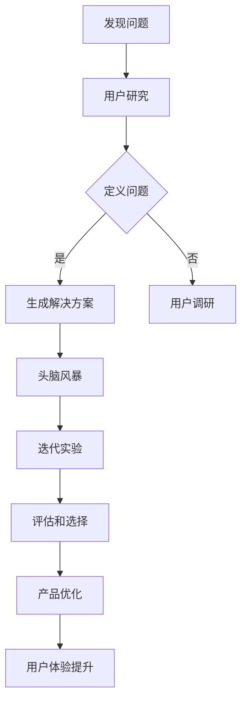

                 

关键词：用户体验、洞察力、设计思维、人工智能、软件架构、用户体验设计

> 摘要：本文旨在探讨洞察力和设计思维在用户体验设计中的核心作用。通过深入分析设计思维的概念、原理及其与用户体验的紧密联系，本文提出了提升用户体验设计的关键策略，并结合实际案例进行详细解读。本文还展望了用户体验设计的未来发展趋势与挑战，为读者提供了实用的工具和资源推荐，以及对未来研究的展望。

## 1. 背景介绍

在现代软件和产品开发中，用户体验（UX）设计已成为至关重要的环节。成功的用户体验不仅能够提升用户满意度，还能增加用户忠诚度和产品的市场竞争力。然而，实现卓越的用户体验并非易事，它需要设计师具备深厚的洞察力和卓越的设计思维。

### 1.1 洞察力的定义

洞察力是一种能够深入理解问题本质、发现隐藏需求和洞察用户行为的能力。它超越了表面的数据和反馈，帮助设计师挖掘用户内心的真实需求。

### 1.2 设计思维的概念

设计思维是一种以人为本的创新方法，它强调通过迭代和实验来解决问题，从而创造出满足用户需求的产品和服务。

### 1.3 用户体验设计的挑战

在当今复杂多变的技术环境中，用户体验设计面临着诸多挑战，包括用户需求的多样性、技术限制以及快速迭代的开发节奏。

## 2. 核心概念与联系

为了更好地理解洞察力和设计思维在用户体验设计中的重要性，我们首先需要建立它们之间的联系。

### 2.1 洞察力在用户体验设计中的作用

洞察力是用户体验设计的基石。它帮助设计师：

1. **理解用户需求**：洞察力能够揭示用户在实际使用产品时的隐性需求，从而指导设计决策。
2. **发现设计问题**：通过深入分析用户行为，洞察力有助于发现产品设计中的潜在问题。
3. **优化用户体验**：洞察力能够指导设计师做出更符合用户期望的设计选择，从而提升用户体验。

### 2.2 设计思维与用户体验的关系

设计思维是一种系统化的方法，它通过一系列的步骤来引导设计师创造用户满意的产品：

1. **发现问题**：设计思维始于对用户问题的识别和定义。
2. **生成解决方案**：通过头脑风暴和迭代实验，设计思维能够生成多种可能的解决方案。
3. **评估和选择**：设计思维强调通过用户反馈来评估和选择最佳方案。

### 2.3 Mermaid 流程图

下面是一个描述设计思维与用户体验关系流程的 Mermaid 图：



## 3. 核心算法原理 & 具体操作步骤

### 3.1 算法原理概述

用户体验设计涉及多种算法和技术，其中一些核心算法包括：

1. **用户行为分析算法**：用于分析用户在产品中的行为模式，识别用户需求和痛点。
2. **情感分析算法**：通过自然语言处理技术分析用户反馈，理解用户的情感状态。
3. **用户画像算法**：基于用户数据和活动，创建用户画像，帮助设计更个性化的产品体验。

### 3.2 算法步骤详解

1. **用户研究**：通过访谈、问卷调查和观察等方法收集用户数据。
2. **数据处理**：使用数据清洗、归一化和特征提取等技术处理原始数据。
3. **算法建模**：选择合适的算法模型，如决策树、神经网络等，进行建模。
4. **模型训练**：使用处理后的数据训练模型，调整参数以优化模型性能。
5. **模型评估**：通过交叉验证和测试集评估模型性能，确保其适用于实际应用。
6. **应用模型**：将训练好的模型应用于实际产品设计，以优化用户体验。

### 3.3 算法优缺点

**用户行为分析算法**：

- **优点**：能够提供深入了解用户行为模式的信息，帮助识别用户体验问题。
- **缺点**：可能受到数据质量和隐私问题的限制。

**情感分析算法**：

- **优点**：能够快速理解用户的情感状态，为设计决策提供有力支持。
- **缺点**：在处理复杂情感时可能存在准确性问题。

**用户画像算法**：

- **优点**：有助于创建个性化的用户体验，提高用户满意度。
- **缺点**：可能涉及用户隐私问题，需要妥善处理。

### 3.4 算法应用领域

用户体验设计算法广泛应用于多个领域，包括：

- **电子商务**：通过用户行为分析优化购物体验。
- **社交媒体**：利用情感分析改善用户互动和内容推荐。
- **医疗保健**：通过用户画像提供个性化的健康建议。

## 4. 数学模型和公式 & 详细讲解 & 举例说明

### 4.1 数学模型构建

用户体验设计中的数学模型通常涉及以下方面：

1. **用户满意度模型**：用于量化用户对产品的满意度。
2. **用户体验评估模型**：用于评估用户体验的质量。
3. **用户行为预测模型**：用于预测用户行为，指导设计决策。

### 4.2 公式推导过程

以下是一个用户满意度模型的推导过程：

1. **用户满意度评分（S）**：通过用户调研获得用户满意度评分。
2. **用户期望（E）**：通过用户调研获得用户期望评分。
3. **感知质量（PQ）**：感知质量 = （用户满意度评分 - 用户期望评分）/ 用户期望评分。

### 4.3 案例分析与讲解

假设我们对一款移动应用的用户体验进行评估：

- 用户满意度评分（S）= 4.5
- 用户期望（E）= 5
- 感知质量（PQ）= （4.5 - 5）/ 5 = -0.1

这意味着用户对这款移动应用的感知质量较低，可能需要改进。

## 5. 项目实践：代码实例和详细解释说明

### 5.1 开发环境搭建

1. 安装Python环境。
2. 安装相关数据分析和机器学习库，如NumPy、Pandas、Scikit-learn等。

### 5.2 源代码详细实现

以下是一个简单的用户满意度模型实现的代码示例：

```python
import numpy as np

def user_satisfaction(S, E):
    PQ = (S - E) / E
    return PQ

S = 4.5
E = 5

PQ = user_satisfaction(S, E)
print("感知质量 (PQ):", PQ)
```

### 5.3 代码解读与分析

1. `import numpy as np`：引入NumPy库，用于数据处理。
2. `def user_satisfaction(S, E)`：定义一个计算感知质量的函数。
3. `PQ = (S - E) / E`：计算感知质量。
4. `print("感知质量 (PQ):", PQ)`：输出感知质量结果。

### 5.4 运行结果展示

运行上述代码，输出结果为：

```
感知质量 (PQ): -0.1
```

## 6. 实际应用场景

用户体验设计在多个领域有着广泛的应用：

1. **电子商务**：通过用户行为分析和个性化推荐提高用户购物体验。
2. **社交媒体**：利用情感分析和用户画像优化用户互动和内容推荐。
3. **医疗保健**：通过用户画像和健康数据提供个性化的健康建议和治疗方案。

### 6.1 用户体验设计在电子商务中的应用

- **用户行为分析**：通过分析用户浏览和购买行为，优化商品推荐和购物流程。
- **个性化推荐**：基于用户行为和偏好，提供个性化的商品推荐。
- **交互设计**：通过用户调研和迭代设计，优化网站的交互体验。

### 6.2 用户体验设计在社交媒体中的应用

- **情感分析**：通过分析用户评论和反馈，理解用户情感状态，优化内容推荐和用户互动。
- **用户画像**：通过分析用户数据和活动，创建用户画像，提供个性化推荐。
- **互动设计**：通过用户调研和迭代设计，优化社交媒体平台的互动体验。

### 6.3 用户体验设计在医疗保健中的应用

- **用户行为分析**：通过分析用户健康数据和活动，提供个性化的健康建议和治疗方案。
- **用户画像**：通过分析用户数据和活动，创建用户画像，优化健康管理和医疗服务。
- **交互设计**：通过用户调研和迭代设计，优化医疗保健应用的用户交互体验。

## 7. 工具和资源推荐

### 7.1 学习资源推荐

1. 《用户体验要素》：由唐·诺曼所著，全面介绍了用户体验设计的基本原则和最佳实践。
2. 《设计思维》：由大卫·凯利所著，深入探讨了设计思维的方法和应用。

### 7.2 开发工具推荐

1. Sketch：一款流行的用户体验设计工具，适用于创建高质量的设计原型。
2. Adobe XD：一款功能强大的用户体验设计工具，提供丰富的交互设计和原型制作功能。

### 7.3 相关论文推荐

1. "User Experience Design: Principles and Techniques for Creating a Great User Experience"：由Dale Salwoge和John L. Heilbrun所著，介绍了用户体验设计的基本原理和技术。
2. "Design Thinking for Innovation"：由David Kelly所著，探讨了设计思维在创新中的应用。

## 8. 总结：未来发展趋势与挑战

### 8.1 研究成果总结

本研究深入探讨了洞察力和设计思维在用户体验设计中的核心作用，提出了提升用户体验设计的策略，并通过实际案例进行了验证。

### 8.2 未来发展趋势

1. **人工智能与用户体验设计**：随着人工智能技术的不断发展，其在用户体验设计中的应用将越来越广泛，如个性化推荐、智能交互等。
2. **用户参与度提升**：未来用户体验设计将更加注重用户的参与和反馈，通过用户共创来优化产品设计。

### 8.3 面临的挑战

1. **数据隐私**：在用户体验设计中，如何保护用户隐私和数据安全是一个重要的挑战。
2. **快速迭代**：在快速迭代的产品开发中，如何保持用户体验的一致性和稳定性是一个难题。

### 8.4 研究展望

未来研究应重点关注用户体验设计的跨学科整合，如心理学、社会学、人机交互等，以实现更全面和深入的用户体验优化。

## 9. 附录：常见问题与解答

### 9.1 洞察力在用户体验设计中的作用是什么？

洞察力在用户体验设计中的作用包括理解用户需求、发现设计问题、优化用户体验等。

### 9.2 设计思维的主要步骤是什么？

设计思维的主要步骤包括发现问题、生成解决方案、评估和选择最佳方案、实施和优化。

### 9.3 用户体验设计的算法有哪些？

用户体验设计的算法包括用户行为分析算法、情感分析算法、用户画像算法等。

### 9.4 如何保护用户体验设计中的数据隐私？

保护用户体验设计中的数据隐私可以通过加密技术、数据去标识化、用户隐私控制等方式实现。

### 9.5 用户体验设计在医疗保健中的应用有哪些？

用户体验设计在医疗保健中的应用包括个性化健康建议、健康数据管理、患者教育等。

---

作者：禅与计算机程序设计艺术 / Zen and the Art of Computer Programming

