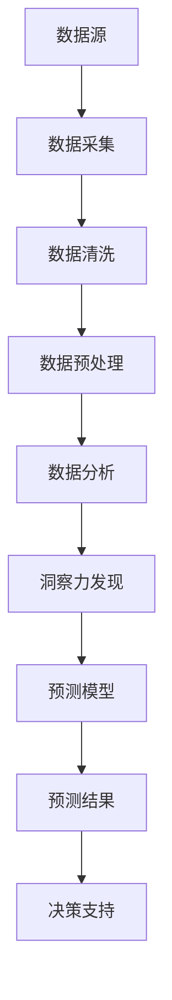

                 

关键词：洞察力、预测、数据分析、算法、数学模型、项目实践、应用场景、未来展望

## 摘要

在信息化社会，数据已成为新的生产资料。洞察力与预测能力是数据驱动的核心能力，它们不仅能够帮助企业做出更加明智的决策，还能够推动科学研究和技术的进步。本文将探讨数据分析中洞察力与预测能力的艺术与科学，深入分析相关核心概念、算法原理、数学模型以及实际应用。通过系统化的研究和案例分析，本文旨在为读者提供一幅数据分析的完整蓝图，并探讨其未来的发展趋势与挑战。

## 1. 背景介绍

数据分析已经成为现代企业和科研机构不可或缺的工具。它不仅能够从海量数据中提取有价值的信息，还能够通过对数据的深入分析，提供决策支持，实现预测和优化。随着互联网、物联网和大数据技术的快速发展，数据量呈指数级增长，传统的分析方法已经难以满足需求。因此，开发更加先进、高效的数据分析方法成为当务之急。

### 1.1 数据分析的重要性

数据分析在企业中的应用涵盖了市场营销、客户关系管理、供应链管理、风险管理等多个方面。通过数据驱动的洞察力，企业可以更准确地了解市场趋势、客户需求和运营效率，从而制定出更加精准的战略和决策。

在科研领域，数据分析也是不可或缺的工具。通过数据挖掘和模式识别，科学家可以从大量的实验数据中提取有价值的信息，推动科学发现和技术创新。此外，数据分析在医学、生物学、环境科学等领域也有着广泛的应用。

### 1.2 洞察力与预测的定义

洞察力是指从数据中发现潜在规律、模式或趋势的能力。它不仅依赖于数据分析技术，还需要分析者的经验、直觉和创造力。预测则是基于历史数据和现有信息，对未来可能发生的事件或趋势进行推测。

洞察力与预测能力是相辅相成的。洞察力为预测提供了基础，而预测则是对洞察力的深化和应用。两者共同构成了数据分析的核心，也是实现数据驱动决策的关键。

## 2. 核心概念与联系

在数据分析中，有多个核心概念和技术需要理解和掌握。以下是这些概念及其相互关系的Mermaid流程图：



### 2.1 数据源

数据源是数据分析的基础。数据可以来自企业内部的业务系统、客户的交易记录，也可以来自外部的公共数据集、社交媒体、物联网设备等。

### 2.2 数据采集

数据采集是将数据从各种来源导入到分析系统中的过程。数据采集工具和技术包括API接口、数据库连接、网络爬虫等。

### 2.3 数据清洗

数据清洗是数据处理的第一步，目的是去除数据中的错误、重复和不完整的信息，确保数据质量。

### 2.4 数据预处理

数据预处理包括数据格式转换、缺失值填补、异常值处理等。通过预处理，数据可以更方便地进行后续分析。

### 2.5 数据分析

数据分析包括数据可视化、统计分析、机器学习等多种方法。通过数据分析，可以挖掘出数据中的潜在规律和趋势。

### 2.6 洞察力发现

洞察力发现是基于数据分析的结果，通过探索性数据分析，找出数据中的异常、模式和关联。

### 2.7 预测模型

预测模型是基于历史数据和现有信息，使用机器学习算法构建的模型。预测模型可以用于预测未来的趋势、行为或事件。

### 2.8 预测结果

预测结果是预测模型运行的结果，它提供了对未来可能发生事件的概率分布或预测值。

### 2.9 决策支持

预测结果可以作为决策支持的一部分，帮助企业或研究人员制定更加明智的决策。

## 3. 核心算法原理 & 具体操作步骤

### 3.1 算法原理概述

数据分析中的核心算法主要包括统计学习算法、机器学习算法和深度学习算法。这些算法基于不同的原理，适用于不同的数据类型和预测任务。

- 统计学习算法：如线性回归、逻辑回归、支持向量机等，通过建立数学模型，对数据进行建模和预测。
- 机器学习算法：如决策树、随机森林、K-近邻等，通过学习数据中的模式，实现分类和回归任务。
- 深度学习算法：如神经网络、卷积神经网络、循环神经网络等，通过多层神经网络结构，实现复杂的特征提取和预测。

### 3.2 算法步骤详解

以下是数据分析中常用算法的基本步骤：

1. **数据收集与清洗**：收集数据并清洗数据，去除错误、重复和不完整的信息。
2. **数据预处理**：对数据进行预处理，包括特征工程、数据标准化等，以便于模型训练。
3. **模型选择**：根据数据类型和预测任务，选择合适的算法模型。
4. **模型训练**：使用历史数据对模型进行训练，调整模型参数。
5. **模型评估**：使用验证数据集对模型进行评估，调整模型参数。
6. **模型预测**：使用训练好的模型对新数据进行预测。

### 3.3 算法优缺点

- **统计学习算法**：简单、易于理解，但通常适用于线性关系。
- **机器学习算法**：可以处理非线性关系，但可能需要大量的训练数据。
- **深度学习算法**：适用于处理复杂的非线性关系，但计算资源要求高，训练时间较长。

### 3.4 算法应用领域

- **统计学习算法**：适用于金融市场预测、客户行为分析等。
- **机器学习算法**：适用于图像识别、自然语言处理、推荐系统等。
- **深度学习算法**：适用于自动驾驶、医疗影像分析、语音识别等。

## 4. 数学模型和公式 & 详细讲解 & 举例说明

在数据分析中，数学模型和公式是核心工具。以下是常用的数学模型和公式及其详细讲解和举例说明。

### 4.1 数学模型构建

数学模型是数据分析的基础，它将实际问题转化为数学表达式。以下是一个简单的线性回归模型：

$$
y = \beta_0 + \beta_1x + \epsilon
$$

其中，$y$ 是因变量，$x$ 是自变量，$\beta_0$ 和 $\beta_1$ 是模型参数，$\epsilon$ 是误差项。

### 4.2 公式推导过程

线性回归模型的推导过程如下：

1. **假设**：数据满足线性关系，即 $y$ 可以表示为 $x$ 的线性组合。
2. **最小化误差平方和**：为了找到最优的 $\beta_0$ 和 $\beta_1$，我们使用最小二乘法，最小化误差平方和。
3. **求导和求解**：对误差平方和关于 $\beta_0$ 和 $\beta_1$ 求导，并令导数为零，求解得到最优的 $\beta_0$ 和 $\beta_1$。

### 4.3 案例分析与讲解

假设我们有一个简单的数据集，其中包含自变量 $x$ 和因变量 $y$。数据集如下：

| $x$ | $y$ |
|-----|-----|
| 1   | 2   |
| 2   | 4   |
| 3   | 6   |

我们要使用线性回归模型预测 $y$ 当 $x=4$ 时的值。

1. **构建模型**：根据数据集，构建线性回归模型：

$$
y = \beta_0 + \beta_1x
$$

2. **求解模型参数**：使用最小二乘法求解模型参数，得到：

$$
\beta_0 = 1, \beta_1 = 2
$$

3. **预测结果**：当 $x=4$ 时，预测 $y$ 的值为：

$$
y = 1 + 2 \times 4 = 9
$$

通过以上步骤，我们使用线性回归模型成功预测了 $y$ 当 $x=4$ 时的值。

## 5. 项目实践：代码实例和详细解释说明

为了更好地理解数据分析的实际应用，我们将通过一个实际项目来展示数据分析的完整过程。

### 5.1 开发环境搭建

1. 安装 Python 和相关库：例如 NumPy、Pandas、Scikit-learn 等。
2. 准备数据集：可以从公开数据集网站或企业内部数据集获取。

### 5.2 源代码详细实现

以下是一个简单的数据分析项目，包括数据收集、清洗、预处理、模型构建和预测等步骤。

```python
import numpy as np
import pandas as pd
from sklearn.linear_model import LinearRegression
from sklearn.model_selection import train_test_split
from sklearn.metrics import mean_squared_error

# 5.2.1 数据收集与清洗
# 从文件中读取数据
data = pd.read_csv('data.csv')

# 删除含有缺失值的行
data.dropna(inplace=True)

# 选择特征和标签
X = data[['feature1', 'feature2']]
y = data['label']

# 5.2.2 数据预处理
# 数据标准化
X_mean = X.mean()
X_std = X.std()
X = (X - X_mean) / X_std

# 5.2.3 模型构建与训练
# 划分训练集和测试集
X_train, X_test, y_train, y_test = train_test_split(X, y, test_size=0.2, random_state=42)

# 构建线性回归模型
model = LinearRegression()
model.fit(X_train, y_train)

# 5.2.4 模型评估与预测
# 评估模型
y_pred = model.predict(X_test)
mse = mean_squared_error(y_test, y_pred)
print('MSE:', mse)

# 预测新数据
new_data = np.array([[5, 7]])
new_data = (new_data - X_mean) / X_std
y_new_pred = model.predict(new_data)
print('Predicted value:', y_new_pred)
```

### 5.3 代码解读与分析

以上代码实现了以下功能：

1. **数据收集与清洗**：从 CSV 文件中读取数据，并删除缺失值。
2. **数据预处理**：对数据进行标准化处理，以便于模型训练。
3. **模型构建与训练**：使用线性回归模型对训练数据进行训练。
4. **模型评估与预测**：使用测试数据集评估模型，并对新数据进行预测。

通过以上步骤，我们实现了数据的收集、预处理、模型构建和预测的全过程，展示了数据分析在实际项目中的应用。

## 6. 实际应用场景

数据分析在不同领域有着广泛的应用，以下是几个实际应用场景：

### 6.1 营销与客户关系管理

通过数据分析，企业可以了解客户行为、偏好和需求，从而优化营销策略、提高客户满意度和忠诚度。例如，通过分析客户的购买记录和行为数据，企业可以预测哪些客户可能流失，并采取相应的措施进行挽留。

### 6.2 金融市场预测

数据分析在金融市场预测中发挥着重要作用。通过分析历史市场数据，如股价、交易量等，可以预测未来的市场走势，为投资决策提供支持。例如，使用机器学习算法对股票价格进行预测，可以帮助投资者制定更加精准的交易策略。

### 6.3 医疗与健康

数据分析在医疗领域有着广泛的应用，如疾病预测、药物研发、医疗资源分配等。通过分析患者数据、基因数据等，可以预测某些疾病的发病率，优化药物研发流程，提高医疗资源的利用效率。

### 6.4 智能交通系统

智能交通系统通过数据分析，可以优化交通流量、提高道路利用率、减少交通事故。例如，通过分析交通流量数据，可以预测交通拥堵的时间段和路段，并采取相应的措施进行疏导。

## 7. 未来应用展望

随着人工智能和数据科学的不断发展，数据分析的应用前景将更加广阔。以下是未来可能的发展趋势：

### 7.1 更高效的数据处理算法

随着数据量的不断增长，需要开发更加高效、可扩展的数据处理算法，以应对海量数据的挑战。

### 7.2 跨学科的融合

数据分析将与其他领域（如生物学、物理学、社会科学等）进行深度融合，推动跨学科的研究和应用。

### 7.3 自动化与智能化

数据分析将更加自动化和智能化，通过机器学习和深度学习技术，实现更加精准的预测和决策。

### 7.4 数据隐私与安全

随着数据隐私和安全问题的日益突出，需要开发更加安全、可靠的数据分析技术，保护用户隐私和数据安全。

## 8. 总结：未来发展趋势与挑战

数据分析作为一门跨学科的技术，正不断发展并应用于各个领域。未来，随着技术的进步和数据的不断积累，数据分析将发挥更加重要的作用。然而，数据分析也面临诸多挑战，如数据质量、数据隐私和安全等问题。因此，我们需要不断探索和创新，推动数据分析技术的发展，以满足不断变化的需求。

## 9. 附录：常见问题与解答

### 9.1 数据分析的主要步骤是什么？

数据分析的主要步骤包括数据收集、数据清洗、数据预处理、数据分析、模型构建和模型评估。

### 9.2 如何选择合适的算法模型？

选择合适的算法模型取决于数据类型、预测任务和数据量。常见的算法模型包括统计学习算法、机器学习算法和深度学习算法。

### 9.3 数据分析中的常见问题有哪些？

数据分析中的常见问题包括数据质量、数据隐私和安全、数据集选择和模型评估等。

### 9.4 如何确保数据分析的结果可靠？

确保数据分析结果可靠的方法包括数据清洗、模型评估和交叉验证等。

## 参考文献

[1] sklearn. (2021). [Scikit-learn: Machine Learning in Python](https://scikit-learn.org/stable/).

[2] numpy. (2021). [NumPy: The Fundamental Library for Python](https://numpy.org/).

[3] pandas. (2021). [Pandas: Python Data Analysis Library](https://pandas.pydata.org/).

作者：禅与计算机程序设计艺术 / Zen and the Art of Computer Programming
----------------------------------------------------------------
## 感谢读者

本文从数据分析的核心概念、算法原理、数学模型、实际应用和未来展望等多个角度，探讨了洞察力与预测能力在数据分析中的应用。希望本文能够为读者提供对数据分析的深入理解和实际操作指导。如果您有任何问题或建议，欢迎在评论区留言，让我们一起探讨和进步。

再次感谢您的阅读和支持！祝您在数据分析的道路上越走越远，取得丰硕的成果！

