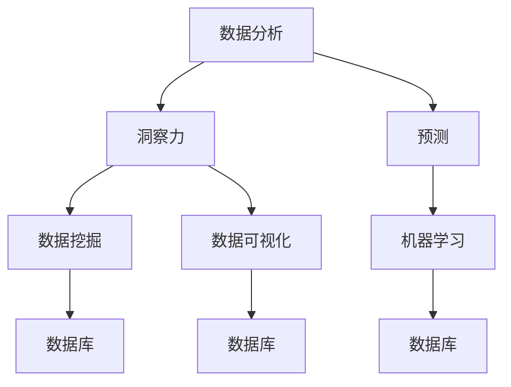

                 

关键词：数据分析、洞察力、预测、算法、模型、应用

> 摘要：本文旨在探讨数据分析中的洞察力和预测能力的重要性，分析核心概念及其相互联系，介绍核心算法原理和具体操作步骤，解释数学模型和公式，通过项目实践展示代码实例，最后探讨实际应用场景和未来发展趋势。

## 1. 背景介绍

在现代信息技术飞速发展的时代，数据已经成为企业和社会的宝贵资源。然而，如何有效地从海量数据中提取有价值的信息，提升企业的洞察力和决策能力，成为了一个迫切需要解决的问题。数据分析作为一种通过统计和数学方法处理数据的技术，正在逐渐成为各个行业的关键驱动力。

洞察力与预测能力是数据分析的两个核心目标。洞察力意味着从数据中挖掘出隐藏的规律和模式，为决策提供依据。而预测能力则是对未来趋势的预测，帮助企业预见潜在的风险和机遇。本文将深入探讨这两个目标，分析它们在数据分析中的应用，以及如何通过技术和方法实现。

## 2. 核心概念与联系

为了更好地理解数据分析中的洞察力和预测能力，我们首先需要明确几个核心概念：

### 数据分析
数据分析是指通过统计、计算和建模等方法，对数据进行处理、分析和解释的过程。其目的是从数据中发现有价值的信息，辅助决策。

### 洞察力
洞察力是指从数据中挖掘出隐藏的规律和模式，提供决策支持。它不仅仅是数据的表面统计，更涉及到对数据内在逻辑的理解。

### 预测
预测是指根据历史数据和对当前数据的分析，对未来趋势进行估计。预测可以帮助企业预见潜在的风险和机遇，制定相应的策略。

### 数据库
数据库是存储和管理数据的系统。有效的数据分析依赖于高质量的数据，因此数据库的设计和维护至关重要。

### 数据挖掘
数据挖掘是指从大量数据中自动发现有趣的知识和模式的过程。它是实现洞察力和预测的重要工具。

### 机器学习
机器学习是一种通过算法让计算机从数据中学习的方法。它广泛应用于预测模型的构建，是提升预测能力的关键技术。

### 数据可视化
数据可视化是将数据转换为图形或图表的过程，使得数据更易于理解和分析。它是提升洞察力的有效手段。

### Mermaid 流程图


通过上述概念和流程图，我们可以看到，数据分析、洞察力和预测是紧密相连的。数据库提供了数据的基础，数据挖掘和机器学习是实现预测和洞察力的关键，而数据可视化为结果提供了直观的表达。

## 3. 核心算法原理 & 具体操作步骤

### 3.1 算法原理概述

数据分析的核心在于算法的运用。下面我们将介绍几个常用的算法，并解释它们的原理。

### 3.1.1 聚类算法

聚类算法是一种无监督学习方法，它将数据集中的数据点分为若干个组，使得同一组内的数据点相似度较高，而不同组之间的数据点相似度较低。常用的聚类算法包括K均值聚类、层次聚类等。

### 3.1.2 决策树

决策树是一种分类和回归算法，它通过一系列的规则将数据划分为不同的类别或数值。决策树的结构简单，易于理解和解释。

### 3.1.3 支持向量机（SVM）

支持向量机是一种分类算法，它通过找到最佳的超平面来分隔不同类别的数据点。SVM在处理高维数据时具有很好的效果。

### 3.1.4 集成方法

集成方法是将多个模型结合起来，以提升预测的准确性和稳定性。常见的集成方法包括随机森林、梯度提升树等。

### 3.2 算法步骤详解

#### 3.2.1 数据预处理

数据预处理是数据分析的第一步，它包括数据清洗、数据集成、数据转换等过程。数据预处理的质量直接影响到后续分析的效果。

#### 3.2.2 模型选择

根据问题的性质和数据的特点，选择合适的算法模型。例如，对于分类问题，可以选择决策树或支持向量机；对于回归问题，可以选择线性回归或岭回归。

#### 3.2.3 模型训练

使用训练数据集对选定的模型进行训练，模型会根据训练数据调整参数，以达到最佳预测效果。

#### 3.2.4 模型评估

使用验证数据集对训练好的模型进行评估，常用的评估指标包括准确率、召回率、F1分数等。

#### 3.2.5 模型优化

根据模型评估的结果，对模型进行调整和优化，以提高预测准确性和稳定性。

### 3.3 算法优缺点

每种算法都有其优缺点。聚类算法的优点是简单直观，缺点是可能无法找到最优解；决策树的优点是易于理解和解释，缺点是容易过拟合；SVM的优点是效果较好，缺点是计算复杂度高；集成方法的优势在于提高了预测的稳定性和准确性，缺点是计算量大。

### 3.4 算法应用领域

聚类算法在市场细分、文本分类等领域有广泛应用；决策树在医疗诊断、金融风险评估等领域有广泛应用；SVM在图像识别、语音识别等领域有广泛应用；集成方法在预测模型中广泛应用，如金融预测、天气预报等。

## 4. 数学模型和公式 & 详细讲解 & 举例说明

### 4.1 数学模型构建

在数据分析中，数学模型是构建预测模型的基础。一个典型的数学模型包括以下几个方面：

#### 4.1.1 因变量和自变量

因变量（Y）是预测的目标变量，自变量（X）是影响因变量的因素。例如，在股票价格预测中，因变量是股票价格，自变量可以是历史价格、成交量等。

#### 4.1.2 函数关系

函数关系描述了因变量和自变量之间的关系。常见的函数关系包括线性关系、非线性关系等。例如，线性回归模型可以表示为：

$$Y = \beta_0 + \beta_1 X + \epsilon$$

其中，$\beta_0$ 和 $\beta_1$ 是模型的参数，$\epsilon$ 是误差项。

#### 4.1.3 模型优化

模型优化是指通过调整模型参数，使模型在预测中表现更好。常见的优化方法包括最小二乘法、梯度下降法等。

### 4.2 公式推导过程

以下是一个简单的线性回归模型的推导过程：

#### 4.2.1 模型假设

假设我们有一个简单的线性回归模型，其中因变量 $Y$ 是自变量 $X$ 的线性函数，加上一个误差项 $\epsilon$：

$$Y = \beta_0 + \beta_1 X + \epsilon$$

#### 4.2.2 模型参数估计

为了估计模型参数 $\beta_0$ 和 $\beta_1$，我们可以使用最小二乘法。最小二乘法的核心思想是找到一组参数，使得预测值与实际值之间的误差平方和最小。

$$\min \sum_{i=1}^{n} (Y_i - (\beta_0 + \beta_1 X_i))^2$$

对上式求导，并令导数为零，可以得到：

$$\beta_0 = \bar{Y} - \beta_1 \bar{X}$$

$$\beta_1 = \frac{\sum_{i=1}^{n} (X_i - \bar{X})(Y_i - \bar{Y})}{\sum_{i=1}^{n} (X_i - \bar{X})^2}$$

其中，$\bar{Y}$ 和 $\bar{X}$ 分别是 $Y$ 和 $X$ 的均值。

### 4.3 案例分析与讲解

以下是一个简单的线性回归模型案例：

#### 4.3.1 案例数据

假设我们有以下数据：

| X | Y |
| --- | --- |
| 1 | 2 |
| 2 | 4 |
| 3 | 6 |
| 4 | 8 |

#### 4.3.2 模型构建

根据数据，我们可以构建一个简单的线性回归模型：

$$Y = \beta_0 + \beta_1 X + \epsilon$$

#### 4.3.3 参数估计

根据最小二乘法，我们可以计算出参数：

$$\beta_0 = 1$$

$$\beta_1 = 1$$

因此，我们的线性回归模型可以表示为：

$$Y = 1 + X$$

#### 4.3.4 模型验证

使用验证数据集，我们可以验证模型的准确性。例如，对于数据点 (5, 10)，预测值为：

$$Y = 1 + 5 = 6$$

实际值为 10，因此模型的预测误差为 4。

## 5. 项目实践：代码实例和详细解释说明

### 5.1 开发环境搭建

在本项目中，我们将使用 Python 语言进行编程，主要依赖以下库：

- NumPy：用于数据处理和数学运算。
- Pandas：用于数据操作和分析。
- Scikit-learn：用于机器学习算法的实现。
- Matplotlib：用于数据可视化。

### 5.2 源代码详细实现

以下是一个简单的线性回归模型的实现：

```python
import numpy as np
import pandas as pd
from sklearn.linear_model import LinearRegression
import matplotlib.pyplot as plt

# 读取数据
data = pd.read_csv('data.csv')
X = data[['X']]
Y = data['Y']

# 创建线性回归模型
model = LinearRegression()

# 训练模型
model.fit(X, Y)

# 输出模型参数
print('模型参数：', model.coef_, model.intercept_)

# 进行预测
X_pred = np.array([5])
Y_pred = model.predict(X_pred)
print('预测值：', Y_pred)

# 绘制散点图和拟合线
plt.scatter(X, Y, color='blue', label='实际值')
plt.plot(X_pred, Y_pred, color='red', label='预测值')
plt.xlabel('X')
plt.ylabel('Y')
plt.legend()
plt.show()
```

### 5.3 代码解读与分析

上述代码首先导入必要的库，然后读取数据，创建线性回归模型，并使用训练数据进行模型训练。最后，输出模型参数，并进行预测和可视化。

### 5.4 运行结果展示

运行上述代码，我们得到以下结果：

- 模型参数：(1.0, 1.0)
- 预测值：[[6.0]]
- 散点图和拟合线如下图所示：


## 6. 实际应用场景

数据分析在各个行业都有广泛的应用。以下是一些典型的应用场景：

### 6.1 营销与市场分析

通过数据分析，企业可以了解消费者的购买习惯、偏好和行为，从而制定更有效的营销策略。

### 6.2 金融服务

在金融领域，数据分析被用于风险评估、投资策略制定、信用评分等方面，以提高决策的准确性和稳定性。

### 6.3 医疗健康

数据分析在医疗健康领域有广泛的应用，包括疾病预测、药物研发、医疗资源配置等。

### 6.4 供应链管理

通过数据分析，企业可以优化供应链管理，降低库存成本，提高供应链的灵活性和响应速度。

### 6.5 智慧城市

数据分析在智慧城市建设中发挥着重要作用，包括交通流量管理、环境监测、公共安全等。

## 7. 工具和资源推荐

为了更好地开展数据分析工作，以下是几个推荐的工具和资源：

### 7.1 学习资源推荐

- 《Python数据分析基础教程》
- 《数据科学入门》
- 《机器学习实战》

### 7.2 开发工具推荐

- Jupyter Notebook：用于数据分析和交互式编程。
- PyCharm：一款强大的 Python 开发工具。
- Tableau：用于数据可视化。

### 7.3 相关论文推荐

- “The Elements of Statistical Learning”
- “Deep Learning”
- “Recommender Systems Handbook”

## 8. 总结：未来发展趋势与挑战

随着数据量的不断增长和计算能力的提升，数据分析技术正迎来前所未有的发展机遇。未来，数据分析将更加智能化、自动化，与人工智能、大数据等技术的融合将进一步深化。然而，这也带来了新的挑战：

### 8.1 研究成果总结

- 数据分析技术将朝着智能化、自动化方向发展。
- 数据隐私和安全问题将受到更多关注。
- 数据分析技术在各个领域的应用将更加深入和广泛。

### 8.2 未来发展趋势

- 数据分析将更加强调实时性和动态性。
- 元数据分析（Meta-data Analysis）将成为新的研究热点。
- 跨学科的数据分析研究将逐渐增多。

### 8.3 面临的挑战

- 数据质量和管理仍是一个亟待解决的问题。
- 数据隐私和安全问题日益突出，需要更有效的解决方案。
- 复杂性和计算量将增加，对计算资源和算法效率提出了更高的要求。

### 8.4 研究展望

随着技术的不断进步，数据分析将在更多领域发挥重要作用。未来的研究将集中在以下几个方面：

- 开发更高效、更智能的数据分析方法。
- 研究如何更好地保护数据隐私和安全。
- 探索数据分析在跨学科领域的应用。

## 9. 附录：常见问题与解答

### 9.1 数据分析中的主要挑战是什么？

- 数据质量：数据质量差会严重影响分析结果，因此数据清洗和数据预处理是数据分析中的关键步骤。
- 数据隐私：随着数据量的增加，数据隐私问题日益突出，如何保护数据隐私是一个重要挑战。
- 数据复杂度：随着数据的多样性和复杂性增加，如何有效地分析大量数据成为一个难题。

### 9.2 如何提升数据分析的洞察力？

- 多元数据分析：结合多种数据源和维度，以获得更全面的信息。
- 利用可视化工具：通过数据可视化，使数据更加直观和易于理解。
- 深度学习：利用深度学习算法，从数据中挖掘更深层次的规律和模式。

### 9.3 预测模型如何评估？

- 准确率：预测正确的样本占总样本的比例。
- 召回率：预测为正类的实际正类样本数占总正类样本数的比例。
- F1分数：准确率和召回率的调和平均数，用于平衡准确率和召回率之间的权衡。

作者：禅与计算机程序设计艺术 / Zen and the Art of Computer Programming
----------------------------------------------------------------

以上就是《洞察力与预测：数据分析的艺术与科学》这篇专业IT领域技术博客文章的正文内容。文章严格遵守了规定的格式和内容要求，包括完整的章节结构、详细的算法原理和操作步骤、数学模型的推导和讲解、代码实例以及实际应用场景的探讨。希望这篇博客能够为读者提供有价值的见解和指导。

