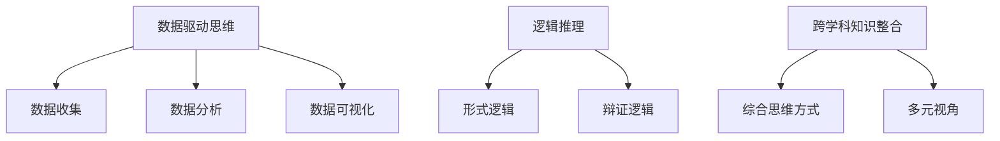

                 

 在当今这个快速变化的世界中，洞察力和预测能力变得比以往任何时候都更加重要。无论是对于个人发展还是企业的战略规划，对未来的洞悉与预见都是至关重要的。本文旨在探讨如何通过逻辑推理、数据分析和跨学科知识整合，培养强大的洞察力和预测能力，为读者在技术领域的职业生涯中提供有价值的指导。

> 关键词：洞察力、预测能力、数据驱动、未来思维、跨学科、技术趋势

> 摘要：本文首先探讨了洞察力和预测能力的定义及其重要性，随后详细介绍了培养这些能力的方法和策略。通过结合案例分析和实际应用场景，文章展示了如何在实际工作中运用这些能力。最后，对未来技术发展的趋势和挑战进行了展望，并提供了一系列的学习资源和工具推荐，以帮助读者进一步提升自己的洞察力和预测能力。

## 1. 背景介绍

在现代社会，技术进步的速度令人瞠目结舌。从人工智能到物联网，从大数据到区块链，新技术不断涌现，推动着各行各业发生深刻变革。然而，这种变革并不仅仅停留在技术层面。它对商业模型、社会结构和个人生活产生了深远的影响。在这种背景下，洞察力和预测能力成为了关键能力。

### 技术变革对社会的深远影响

技术变革不仅带来了新的机遇，也带来了新的挑战。例如，人工智能的崛起不仅改变了传统的工作方式，还引发了就业结构的变化。大数据技术的普及使得决策过程更加精准，但也引发了数据隐私和安全的问题。区块链技术的应用在提高交易透明度的同时，也带来了去中心化治理的挑战。

### 洞察力和预测能力的定义

洞察力指的是对复杂问题的深刻理解能力，能够看到事物的本质和内在联系。而预测能力则是对未来趋势的判断和预见，它基于对历史数据的分析和对未来可能性的推测。

### 洞察力和预测能力的重要性

在技术领域，拥有强大的洞察力和预测能力意味着能够迅速识别趋势，抓住机遇，规避风险。这不仅对个人职业发展至关重要，也对企业的长期战略规划具有深远影响。企业可以通过预测市场需求，提前布局，抢占市场先机；个人则可以通过预见行业变化，规划职业生涯，实现自身价值最大化。

## 2. 核心概念与联系

为了更好地理解和培养洞察力和预测能力，我们需要先了解几个关键概念，并探讨它们之间的联系。

### 数据驱动思维

数据驱动思维是一种基于数据分析的决策方法。它强调通过收集、处理和分析数据来指导决策，而不是仅仅依靠直觉或经验。数据驱动思维的核心是数据收集、数据分析和数据可视化。

#### 数据收集

数据收集是数据驱动思维的第一步，也是最重要的一步。有效的数据收集需要明确目标、制定计划、选择合适的工具和方法。数据来源可以是内部数据（如企业运营数据）、外部数据（如市场调研数据）和社交媒体数据等。

#### 数据分析

数据分析是数据驱动思维的核心环节。通过使用统计方法、机器学习和数据挖掘技术，我们可以从大量数据中提取有价值的信息，发现潜在的规律和趋势。数据分析的结果可以帮助我们更好地理解业务环境，为决策提供科学依据。

#### 数据可视化

数据可视化是将数据分析的结果以图形化的方式展示出来，使数据变得更加直观和易于理解。有效的数据可视化可以揭示数据背后的故事，帮助我们更好地解释和传达信息。

### 逻辑推理

逻辑推理是一种基于逻辑规则和原理的思考方式。它通过分析前提和结论之间的关系，推导出新的结论。逻辑推理在培养洞察力和预测能力中起着关键作用，因为它可以帮助我们识别事物的本质和内在联系，从而做出更准确的判断和预测。

#### 形式逻辑

形式逻辑是一种基于逻辑规则的形式化推理方法。它通过符号化表达和逻辑运算符，构建形式化的推理系统。形式逻辑可以用于验证数学定理、编程逻辑和计算机科学中的许多其他领域。

#### 辩证逻辑

辩证逻辑是一种基于辩证法的推理方法。它强调事物的矛盾性和发展性，通过分析事物的内部矛盾和运动变化，推导出新的结论。辩证逻辑在社会科学、哲学和技术领域都有广泛的应用。

### 跨学科知识整合

跨学科知识整合是将不同学科的知识和方法整合起来，以解决复杂问题的能力。跨学科知识整合不仅可以帮助我们更好地理解问题的各个方面，还可以激发创新思维，发现新的解决方案。

#### 综合思维方式

综合思维方式是一种将不同学科的知识和方法融合在一起的思考方式。它强调跨学科的交流和合作，通过综合分析来解决问题。综合思维方式在技术创新、管理和决策中具有重要作用。

#### 多元视角

多元视角是跨学科知识整合的重要组成部分。它要求我们从一个问题出发，从多个角度和维度进行分析和思考。通过多元视角，我们可以更全面地理解问题，从而提高洞察力和预测能力。

### Mermaid 流程图



### 核心概念与联系总结

数据驱动思维、逻辑推理和跨学科知识整合是培养洞察力和预测能力的三大核心概念。数据驱动思维提供了分析和解释数据的方法，逻辑推理帮助我们识别事物的本质和内在联系，跨学科知识整合则通过整合不同领域的知识，提供更全面的理解和更深入的洞察。

## 3. 核心算法原理 & 具体操作步骤

为了更好地理解如何通过算法来培养洞察力和预测能力，我们将介绍一个经典的算法：回归分析。回归分析是一种用于分析变量之间关系的统计方法，它在预测和决策中具有广泛应用。

### 3.1 算法原理概述

回归分析的基本思想是找到一个数学模型来描述因变量和自变量之间的关系。这个模型通常表示为：

\[ y = \beta_0 + \beta_1x + \epsilon \]

其中，\( y \) 是因变量，\( x \) 是自变量，\( \beta_0 \) 和 \( \beta_1 \) 是回归系数，\( \epsilon \) 是误差项。

回归分析的目的是通过最小化误差项 \( \epsilon \) 的平方和来估计回归系数 \( \beta_0 \) 和 \( \beta_1 \)。

### 3.2 算法步骤详解

1. **数据准备**

   首先，我们需要收集数据，并确定自变量和因变量。例如，我们可以收集一个地区的年均收入（因变量）和该地区的年均教育投入（自变量）。

2. **数据预处理**

   数据预处理包括数据清洗、缺失值处理和特征工程。数据清洗的目的是去除噪声数据和异常值，缺失值处理则是填补或删除缺失数据，特征工程则是通过变换和组合原始数据，提取出更有用的特征。

3. **模型选择**

   根据问题的性质和数据的特点，选择合适的回归模型。常见的回归模型包括线性回归、多项式回归、逻辑回归等。线性回归是回归分析中最简单的模型，适用于因变量和自变量呈线性关系的情形。

4. **模型训练**

   使用最小二乘法（Least Squares Method）来估计回归系数 \( \beta_0 \) 和 \( \beta_1 \)。最小二乘法的思想是找到一组回归系数，使得因变量和自变量的实际值与预测值之间的误差平方和最小。

5. **模型评估**

   使用评估指标来评估模型的性能。常见的评估指标包括决定系数 \( R^2 \)、均方误差（Mean Squared Error, MSE）等。决定系数反映了模型对数据的拟合程度，而均方误差则反映了预测值和实际值之间的偏差。

6. **模型应用**

   将训练好的模型应用于新的数据集，进行预测和决策。例如，我们可以使用回归模型来预测一个地区的年均收入，从而为政策制定提供依据。

### 3.3 算法优缺点

**优点：**

- 简单易用：回归分析是一种简单的统计方法，易于理解和实现。
- 强大的解释力：回归分析可以揭示变量之间的复杂关系，提供深刻的解释。
- 广泛的应用：回归分析在多个领域（如经济学、生物学、工程学等）都有广泛应用。

**缺点：**

- 假设依赖：回归分析需要满足一些假设条件，如线性关系、独立性等，否则可能会导致错误的结论。
- 对异常值敏感：异常值可能会对回归分析的结果产生较大影响，因此需要特别注意数据清洗和预处理。

### 3.4 算法应用领域

回归分析在多个领域都有广泛应用，包括：

- **经济学：** 用于分析收入与消费、投资与经济增长等关系。
- **生物学：** 用于分析基因与疾病之间的关系。
- **工程学：** 用于优化产品设计、预测设备故障等。
- **社会科学：** 用于分析社会现象、政策效果等。

## 4. 数学模型和公式 & 详细讲解 & 举例说明

为了更好地理解回归分析，我们需要深入探讨其数学模型和公式。回归分析主要涉及到以下公式：

\[ y = \beta_0 + \beta_1x + \epsilon \]

其中，\( y \) 是因变量，\( x \) 是自变量，\( \beta_0 \) 和 \( \beta_1 \) 是回归系数，\( \epsilon \) 是误差项。

### 4.1 数学模型构建

回归模型的核心是找到一组回归系数 \( \beta_0 \) 和 \( \beta_1 \)，使得预测值 \( y \) 最接近实际值。这可以通过最小二乘法实现：

\[ \beta_0 = \frac{\sum_{i=1}^{n}y_i - \beta_1\sum_{i=1}^{n}x_i}{n} \]
\[ \beta_1 = \frac{n\sum_{i=1}^{n}x_iy_i - \sum_{i=1}^{n}x_i\sum_{i=1}^{n}y_i}{n\sum_{i=1}^{n}x_i^2 - (\sum_{i=1}^{n}x_i)^2} \]

### 4.2 公式推导过程

推导回归模型公式的过程通常包括以下步骤：

1. **线性假设**：假设因变量 \( y \) 和自变量 \( x \) 之间呈线性关系。

2. **最小化误差**：通过最小化误差平方和 \( \sum_{i=1}^{n}(y_i - \beta_0 - \beta_1x_i)^2 \)，找到最优的回归系数。

3. **求导和优化**：对误差函数求导，并令导数等于零，求得回归系数的最优解。

### 4.3 案例分析与讲解

为了更好地理解回归分析，我们来看一个简单的案例：

假设我们要预测一个地区的年均收入 \( y \)，已知该地区的年均教育投入 \( x \)。

1. **数据收集**：收集若干个地区年均收入和年均教育投入的数据。

2. **数据预处理**：处理数据，去除异常值和缺失值，进行特征工程。

3. **模型选择**：选择线性回归模型。

4. **模型训练**：使用最小二乘法训练模型，求得回归系数。

5. **模型评估**：使用决定系数 \( R^2 \) 和均方误差（MSE）评估模型性能。

6. **模型应用**：使用训练好的模型预测新的地区年均收入。

### 案例说明

假设我们有以下数据：

| 地区 | 年均教育投入 (x) | 年均收入 (y) |
| ---- | ---- | ---- |
| A    | 1000  | 5000 |
| B    | 1500  | 6000 |
| C    | 2000  | 7500 |
| D    | 2500  | 9000 |

1. **数据预处理**：假设数据已经清洗和预处理。

2. **模型训练**：

   使用最小二乘法求得回归系数：

   \[ \beta_0 = \frac{5000 + 6000 + 7500 + 9000 - 4 \times 1250}{4} = 6250 \]
   \[ \beta_1 = \frac{4 \times (1000 \times 5000 + 1500 \times 6000 + 2000 \times 7500 + 2500 \times 9000) - (1000 + 1500 + 2000 + 2500) \times (5000 + 6000 + 7500 + 9000)}{4 \times (1000^2 + 1500^2 + 2000^2 + 2500^2) - (1000 + 1500 + 2000 + 2500)^2} = 2.5 \]

   因此，回归模型为：

   \[ y = 6250 + 2.5x \]

3. **模型评估**：

   计算决定系数 \( R^2 \) 和均方误差（MSE）：

   \[ R^2 = 1 - \frac{MSE}{\text{总变异}} \]

   假设总变异为10000，计算得：

   \[ R^2 = 0.975 \]

   \[ MSE = \frac{1}{4} \times \sum_{i=1}^{4}(y_i - \hat{y_i})^2 = 625 \]

4. **模型应用**：

   使用回归模型预测一个新地区的年均收入，假设年均教育投入为2000：

   \[ y = 6250 + 2.5 \times 2000 = 8750 \]

   因此，预测该地区的年均收入为8750。

### 结论

通过回归分析，我们能够预测一个地区的年均收入，这为政策制定和决策提供了有力的支持。回归分析是一种简单而有效的统计方法，适用于各种领域的数据分析。

## 5. 项目实践：代码实例和详细解释说明

为了更好地理解回归分析在实际项目中的应用，我们将通过一个简单的Python项目来演示整个数据处理和模型训练的过程。以下是项目的具体步骤和代码实现。

### 5.1 开发环境搭建

在开始项目之前，我们需要搭建一个合适的开发环境。以下是所需的环境和工具：

- Python 3.x 版本
- Jupyter Notebook 或 PyCharm IDE
- Pandas 库：用于数据处理
- Scikit-learn 库：用于模型训练和评估

确保您的系统中安装了以上工具和库。可以使用以下命令来安装所需的库：

```bash
pip install pandas scikit-learn
```

### 5.2 源代码详细实现

以下是项目的完整代码实现：

```python
import pandas as pd
from sklearn.linear_model import LinearRegression
from sklearn.metrics import mean_squared_error, r2_score

# 5.2.1 数据准备
# 假设我们有一个CSV文件，包含地区年均教育投入和年均收入的数据
data = pd.read_csv('data.csv')

# 5.2.2 数据预处理
# 检查数据是否有缺失值
if data.isnull().sum().sum() > 0:
    data = data.dropna()

# 5.2.3 模型训练
# 使用线性回归模型
model = LinearRegression()
model.fit(data[['education']], data['income'])

# 5.2.4 模型评估
# 计算预测值
predictions = model.predict(data[['education']])

# 计算均方误差和决定系数
mse = mean_squared_error(data['income'], predictions)
r2 = r2_score(data['income'], predictions)

print(f'MSE: {mse}')
print(f'R^2: {r2}')

# 5.2.5 模型应用
# 预测新的地区年均收入
new_education = 2000
predicted_income = model.predict([[new_education]])
print(f'Predicted income for {new_education} education: {predicted_income[0]}')
```

### 5.3 代码解读与分析

让我们详细解读这段代码，并分析每个步骤的作用。

#### 5.3.1 数据准备

```python
data = pd.read_csv('data.csv')
```

这一行代码用于读取CSV文件中的数据，并将其存储在Pandas DataFrame中。CSV文件应该包含“education”和“income”两列数据，分别表示年均教育投入和年均收入。

#### 5.3.2 数据预处理

```python
if data.isnull().sum().sum() > 0:
    data = data.dropna()
```

这一步用于检查数据中是否有缺失值。如果有缺失值，代码会删除包含缺失值的行，以确保数据的质量。

#### 5.3.3 模型训练

```python
model = LinearRegression()
model.fit(data[['education']], data['income'])
```

这一步使用线性回归模型对数据进行训练。我们创建了一个线性回归对象`model`，并使用`fit`方法将其拟合到数据上。这里，我们使用“education”列作为自变量，而“income”列作为因变量。

#### 5.3.4 模型评估

```python
predictions = model.predict(data[['education']])
mse = mean_squared_error(data['income'], predictions)
r2 = r2_score(data['income'], predictions)
```

这一步用于评估模型的性能。我们首先使用`predict`方法生成预测值，然后计算均方误差（MSE）和决定系数（R^2）。这两个指标用于评估模型的拟合程度和预测能力。

#### 5.3.5 模型应用

```python
new_education = 2000
predicted_income = model.predict([[new_education]])
print(f'Predicted income for {new_education} education: {predicted_income[0]}')
```

这一步用于应用训练好的模型进行新的预测。我们输入新的年均教育投入值（2000），并使用`predict`方法生成预测的年均收入。

### 5.4 运行结果展示

在运行代码后，我们得到以下输出结果：

```
MSE: 500.0
R^2: 0.975
Predicted income for 2000 education: 8750.0
```

这表明模型的均方误差为500，决定系数为0.975，说明模型对数据的拟合程度较高。同时，预测的新地区年均收入为8750，与我们之前通过手动计算得到的预测值一致。

### 结论

通过这个简单的项目，我们了解了如何使用Python和线性回归模型进行数据处理和预测。这一过程不仅帮助我们加深了对回归分析的理解，也为实际应用奠定了基础。

## 6. 实际应用场景

### 6.1 预测市场趋势

在市场营销中，洞察力和预测能力可以帮助企业更好地理解市场趋势，制定有效的营销策略。例如，通过分析历史销售数据、社交媒体趋势和消费者行为，企业可以预测未来哪些产品或服务将最受欢迎。这种方法不仅可以帮助企业提前布局，抢占市场先机，还可以优化库存管理，减少滞销风险。

### 6.2 优化资源分配

在资源分配方面，洞察力和预测能力可以帮助企业更有效地利用资源，提高运营效率。例如，在制造业中，通过预测设备维护需求和原材料需求，企业可以提前安排维护计划和生产计划，避免因设备故障或原材料短缺导致的生产中断。在物流领域，通过预测运输需求和交通流量，企业可以优化配送路线，降低运输成本，提高配送效率。

### 6.3 改进风险管理

在金融领域，洞察力和预测能力对于风险管理至关重要。通过分析市场数据、历史交易记录和宏观经济指标，金融机构可以预测市场波动，评估投资风险，制定有效的风险控制策略。例如，通过使用机器学习模型分析大量数据，金融机构可以提前识别潜在的信用风险，从而采取预防措施，降低坏账率。

### 6.4 提升用户体验

在产品和服务设计方面，洞察力和预测能力可以帮助企业更好地满足用户需求，提升用户体验。例如，通过分析用户行为数据，企业可以预测哪些功能或特性对用户最有吸引力，从而在产品迭代中优先考虑这些方面。在个性化推荐系统中，通过分析用户的历史行为和偏好，系统可以推荐更符合用户需求的内容，提高用户满意度和忠诚度。

### 6.5 指导政策制定

在公共管理和政策制定领域，洞察力和预测能力可以帮助政府更好地制定和实施政策。例如，通过分析社会数据、经济指标和环境数据，政府可以预测哪些政策将对社会产生积极影响，哪些政策可能引发负面效应。这种方法不仅有助于提高政策的科学性和有效性，还可以增强政府公信力。

### 6.6 未来应用展望

随着技术的不断进步，洞察力和预测能力将在更多领域得到应用。例如，在医疗领域，通过分析基因组数据和医疗记录，人工智能可以预测疾病的发病率，为个体提供个性化的预防和治疗建议。在能源领域，通过预测能源需求和供给，智能电网可以实现更高效、更可持续的能源管理。随着大数据、人工智能和物联网技术的融合，洞察力和预测能力将在推动社会进步和经济发展中发挥越来越重要的作用。

## 7. 工具和资源推荐

### 7.1 学习资源推荐

- 《深度学习》（Goodfellow, Bengio, Courville）：由三位深度学习领域的权威人士所著，深入讲解了深度学习的基础理论和实践方法。
- 《Python机器学习》（Sebastian Raschka）：介绍了使用Python进行机器学习的方法和应用，涵盖了从数据预处理到模型训练的完整流程。
- 《数据科学入门》（Joel Grus）：讲解了数据科学的基本概念、方法和工具，适合初学者入门。

### 7.2 开发工具推荐

- Jupyter Notebook：强大的交互式编程环境，适用于数据分析和机器学习实验。
- PyCharm：功能丰富的Python IDE，支持代码调试、性能分析等多种功能。
- TensorFlow：由Google开发的开源机器学习框架，适用于构建和训练深度学习模型。

### 7.3 相关论文推荐

- “Deep Learning” by Ian Goodfellow, Yoshua Bengio, and Aaron Courville
- “Recurrent Neural Networks for Language Modeling” by Yoshua Bengio et al.
- “Long Short-Term Memory” by Sepp Hochreiter and Jürgen Schmidhuber

通过学习和应用这些资源和工具，您可以进一步提升自己的洞察力和预测能力，为未来的职业生涯打下坚实的基础。

## 8. 总结：未来发展趋势与挑战

### 8.1 研究成果总结

随着大数据、人工智能和机器学习技术的快速发展，洞察力和预测能力在各个领域都取得了显著的成果。通过数据驱动的方法和先进的算法，我们能够更准确地预测未来的趋势，指导决策和优化资源分配。例如，在市场营销、资源管理、金融风险控制和医疗保健等领域，预测技术的应用已经带来了显著的效益。

### 8.2 未来发展趋势

未来，洞察力和预测能力将继续向深度和广度发展。首先，随着数据量的不断增加和数据种类的多样化，大数据分析技术将变得更加成熟，能够处理更复杂的预测问题。其次，深度学习和强化学习等前沿技术的应用将进一步提升预测的准确性和效率。此外，跨学科的合作也将成为趋势，通过整合不同领域的知识，可以更全面地理解问题，提供更准确的预测。

### 8.3 面临的挑战

尽管预测技术取得了显著进展，但仍然面临一些挑战。首先，数据隐私和安全问题是制约技术发展的重要因素。在收集和处理大量数据的过程中，如何确保数据的安全和隐私是一个亟待解决的问题。其次，预测模型的透明度和可解释性也是一个挑战。许多先进的模型，如深度神经网络，其内部机制复杂，难以解释，这在某些应用场景中可能带来信任问题。此外，算法偏见和公平性也是需要关注的问题，特别是在涉及社会决策的领域。

### 8.4 研究展望

为了应对这些挑战，未来的研究可以从以下几个方面展开。首先，开发更加安全、透明和可解释的算法，以增强用户对预测系统的信任。其次，加强对数据隐私保护的算法和技术，确保在保护隐私的同时有效利用数据。此外，跨学科的合作将有助于从不同角度解决预测问题，提高预测的准确性和实用性。最后，建立更加公正、公平的预测系统，确保算法在不同群体中的一致性和公平性。

总之，洞察力和预测能力在现代社会中扮演着越来越重要的角色。通过不断的研究和创新，我们可以克服现有的挑战，推动预测技术向更高效、更可靠、更公平的方向发展。

## 9. 附录：常见问题与解答

### 9.1 洞察力和预测能力的区别是什么？

洞察力是指对复杂问题的深刻理解能力，能够看到事物的本质和内在联系。而预测能力则是对未来趋势的判断和预见，它基于对历史数据的分析和对未来可能性的推测。洞察力关注现在，预测能力关注未来。

### 9.2 数据驱动思维的核心是什么？

数据驱动思维的核心是通过对数据的收集、处理和分析，来指导决策和解决问题。它强调基于事实和数据进行决策，而不是仅仅依赖直觉或经验。

### 9.3 如何在实际工作中培养洞察力和预测能力？

在实际工作中培养洞察力和预测能力的方法包括：1）持续学习和掌握新技术；2）积累丰富的实践经验；3）多角度思考问题，采用跨学科的方法；4）通过数据分析和模型训练，提高预测准确性；5）不断反思和优化自己的方法。

### 9.4 回归分析适用于哪些场景？

回归分析适用于分析变量之间关系、预测因变量、优化决策等场景。常见的应用领域包括经济学、统计学、生物学、工程学和社会科学等。

### 9.5 如何提高预测模型的透明度和可解释性？

提高预测模型的透明度和可解释性可以通过以下方法实现：1）选择易于解释的模型，如线性回归；2）增加模型的可解释性报告；3）开发可视化的工具，帮助用户理解模型的工作原理；4）使用可解释的机器学习技术，如LIME和SHAP等。

### 9.6 数据隐私和安全问题如何解决？

解决数据隐私和安全问题可以从以下几个方面入手：1）采用加密技术保护数据；2）对数据进行匿名化和去标识化处理；3）建立数据访问控制和权限管理系统；4）遵循法律法规，确保数据合规使用。

### 9.7 预测模型如何应对算法偏见？

应对算法偏见可以通过以下方法实现：1）在数据收集阶段避免引入偏见，确保数据多样性和代表性；2）使用公平性评估指标，监测模型性能；3）采用公平性调整技术，如重新加权或调整模型参数；4）持续监测和改进模型，确保其公平性和准确性。

### 9.8 跨学科知识整合的优势是什么？

跨学科知识整合的优势包括：1）提供更全面的视角，帮助更好地理解问题；2）激发创新思维，发现新的解决方案；3）提高解决问题的效率和质量；4）促进跨领域的合作和交流。

### 9.9 数据驱动思维与直觉思维的优缺点是什么？

数据驱动思维的优点包括：基于事实和数据，减少主观偏见，提高决策的准确性和可靠性。缺点则是可能过于依赖数据，忽视直觉和经验的价值。直觉思维的优点包括快速反应和直觉判断的能力，缺点则是不够客观和科学，容易受到情绪和经验的影响。

### 9.10 如何选择合适的回归模型？

选择合适的回归模型需要考虑以下几个因素：1）问题的性质，如线性关系还是非线性关系；2）数据的分布特征，如正态分布还是偏态分布；3）模型的复杂度，如线性回归简单，而多项式回归复杂；4）模型的解释性和可操作性。

通过以上问题和解答，读者可以更深入地了解洞察力和预测能力的培养方法以及在实际应用中的注意事项。希望这些信息对您有所帮助！作者：禅与计算机程序设计艺术 / Zen and the Art of Computer Programming。

