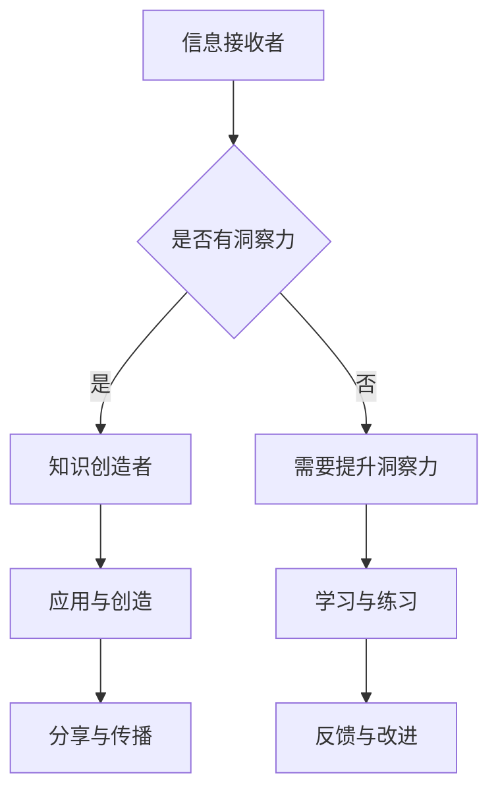

                 

关键词：洞察力、知识创造、信息技术、数据理解、人工智能、专业成长

> 摘要：本文探讨了信息技术时代下，如何通过提升洞察力，从信息接收者转变为知识创造者。文章首先介绍了洞察力的概念及其在信息技术领域的重要性，然后分析了当前信息技术发展对洞察力培养的挑战，最后提出了具体的培养策略和实践方法。

## 1. 背景介绍

在当今信息爆炸的时代，我们每天都要接收和处理大量的数据和信息。然而，面对海量的信息，如何从中提取有价值的知识，提升我们的洞察力，成为了亟待解决的重要问题。洞察力，简单来说，是透过现象看到本质、抓住问题核心的能力。在信息技术领域，洞察力尤为重要，因为它直接关系到我们能否有效地解决问题、创新和提升技术水平。

随着信息技术的迅猛发展，我们面临着前所未有的挑战。数据量呈指数级增长，信息传播速度极快，这使得我们更容易陷入信息的海洋中。如何从这些繁杂的信息中筛选、分析并提取有价值的内容，是每一个信息技术从业者都需要面对的课题。同时，人工智能和大数据技术的兴起，也为我们提供了更多分析和处理信息的方法和工具，但同时也带来了新的挑战，如数据的隐私保护、算法的偏见等。

## 2. 核心概念与联系

### 2.1 洞察力的定义与重要性

洞察力，即深刻的理解力和敏锐的洞察力。在信息技术领域，它尤为重要。具体来说，洞察力可以帮助我们：

- **快速识别问题**：在面对复杂的问题时，洞察力使我们能够迅速识别问题的核心，从而更有效地解决问题。
- **发现新的解决方案**：通过洞察力，我们可以从现有的信息中看到新的关联和可能性，从而创造出新的解决方案。
- **优化现有系统**：洞察力使我们能够看到系统的潜在问题和改进空间，从而进行优化和改进。

### 2.2 信息与知识的区别

信息与知识是两个不同的概念。信息是数据、消息、知识等在传递过程中的具体表现形式，而知识则是经过理解、思考和整合后的信息。在信息技术领域，信息的获取相对容易，但知识的创造则更为困难。知识的创造需要我们对信息进行深入的思考、分析和整合，从而形成新的见解和认识。

### 2.3 洞察力与信息技术的关系

洞察力在信息技术领域中的应用非常广泛。例如：

- **数据挖掘**：通过洞察力，我们可以从大量的数据中识别出有价值的信息和模式。
- **人工智能算法**：洞察力帮助我们在设计算法时，更好地理解数据背后的规律，从而提高算法的效率和准确性。
- **系统架构设计**：洞察力使我们能够更好地理解系统的需求和约束，从而设计出更高效、更可靠的系统架构。

### 2.4 Mermaid 流程图



## 3. 核心算法原理 & 具体操作步骤

### 3.1 算法原理概述

洞察力的培养是一个长期的过程，涉及到多个方面。以下是几个关键步骤：

1. **信息筛选**：首先，我们需要学会如何从海量的信息中筛选出有价值的内容。
2. **深度理解**：对筛选出的信息进行深入的思考和分析，理解其背后的原理和逻辑。
3. **整合与创造**：将理解的信息进行整合，形成新的见解和认识，创造出新的知识和价值。
4. **实践与验证**：将创造的知识应用于实际情境中，进行验证和改进。

### 3.2 算法步骤详解

1. **信息筛选**：

   - **关注领域**：明确自己的研究领域和兴趣点，专注于与自己专业相关的信息。
   - **来源筛选**：选择权威、可靠的信息来源，避免被不实信息误导。
   - **关键信息提取**：通过快速阅读、摘要等方法，提取关键信息。

2. **深度理解**：

   - **主动学习**：不仅仅是被动地接收信息，更要主动地去理解、分析和思考。
   - **批判性思维**：对接受到的信息进行批判性思考，判断其真实性和价值。
   - **跨学科学习**：不仅仅局限于自己的专业领域，还要涉猎其他相关领域，形成跨学科的知识体系。

3. **整合与创造**：

   - **知识整合**：将不同来源的信息进行整合，形成系统的知识体系。
   - **创新思维**：通过创新思维，从现有知识中发现新的关联和可能性。
   - **实践应用**：将创造的知识应用于实际情境中，验证其有效性。

4. **实践与验证**：

   - **实验验证**：通过实验、模拟等方式，验证自己创造的知识。
   - **反馈与改进**：根据反馈，对创造的知识进行改进和优化。

### 3.3 算法优缺点

- **优点**：

  - 提高信息筛选效率，避免被无关信息干扰。
  - 促进深度理解和批判性思维，提高知识质量。
  - 培养创新思维，推动知识的创造和发展。

- **缺点**：

  - 需要大量的时间和精力，可能影响其他工作。
  - 对个人能力要求较高，需要具备较强的学习能力和思维能力。

### 3.4 算法应用领域

- **人工智能**：通过洞察力，更好地理解数据，提高算法的效率和准确性。
- **数据挖掘**：通过洞察力，从大量数据中识别出有价值的信息和模式。
- **系统架构设计**：通过洞察力，更好地理解系统的需求和约束，设计出更高效、更可靠的系统。

## 4. 数学模型和公式 & 详细讲解 & 举例说明

### 4.1 数学模型构建

洞察力的培养可以看作是一个动态的优化过程。我们可以构建一个简单的数学模型来描述这个过程：

- **状态方程**：设 $S(t)$ 为时间 $t$ 时的洞察力水平，$I(t)$ 为时间 $t$ 时的信息输入量，$O(t)$ 为时间 $t$ 时的洞察力输出量，则有：

  $$S(t+1) = S(t) + f(I(t), O(t))$$

- **函数 $f$**：表示洞察力的提升程度，可以看作是信息输入和洞察力输出的函数。

### 4.2 公式推导过程

假设信息输入量 $I(t)$ 和洞察力输出量 $O(t)$ 是时间 $t$ 的线性函数，即：

$$I(t) = a \cdot t + b$$

$$O(t) = c \cdot t + d$$

其中 $a$、$b$、$c$、$d$ 为常数。则洞察力水平 $S(t)$ 也是一个时间 $t$ 的线性函数：

$$S(t) = e \cdot t + f$$

其中 $e$、$f$ 为常数。

代入状态方程，得到：

$$e \cdot (t+1) + f = e \cdot t + f + f(a \cdot t + b, c \cdot t + d)$$

化简得：

$$f(a \cdot t + b, c \cdot t + d) = e$$

因此，函数 $f$ 可以看作是 $a \cdot t + b$ 和 $c \cdot t + d$ 的线性组合。

### 4.3 案例分析与讲解

假设我们想要提升某个信息技术从业者的洞察力，可以采取以下步骤：

1. **信息输入**：每天阅读相关领域的论文、技术博客和新闻，确保有足够的信息输入。
2. **洞察力输出**：在工作或学习中，积极思考、提问和讨论，将所学知识应用于实际问题中。
3. **状态监测**：定期评估自己的洞察力水平，通过反馈和改进，不断提升。

通过上述过程，我们可以构建一个简单的数学模型来描述这个过程，并进行优化。

## 5. 项目实践：代码实例和详细解释说明

### 5.1 开发环境搭建

在本案例中，我们使用 Python 作为编程语言，搭建一个简单的洞察力提升系统。开发环境要求如下：

- Python 3.8 或更高版本
- Jupyter Notebook 或 PyCharm
- NumPy、Pandas 等常用库

### 5.2 源代码详细实现

以下是一个简单的 Python 代码示例，用于计算洞察力水平：

```python
import numpy as np
import pandas as pd

def calculate_insight_level(info_input, insight_output):
    """
    计算洞察力水平
    :param info_input: 信息输入量
    :param insight_output: 洞察力输出量
    :return: 洞察力水平
    """
    # 假设信息输入量和洞察力输出量是时间 t 的线性函数
    info_input_func = lambda t: a * t + b
    insight_output_func = lambda t: c * t + d

    # 假设洞察力水平是时间 t 的线性函数
    insight_level_func = lambda t: e * t + f

    # 状态方程
    insight_level_next = insight_level_func(t) + f(info_input_func(t), insight_output_func(t))

    return insight_level_next

# 参数设置
a = 1
b = 0
c = 1
d = 0
e = 1
f = 0

# 模拟数据
t = 10
info_input = info_input_func(t)
insight_output = insight_output_func(t)

# 计算洞察力水平
insight_level = calculate_insight_level(info_input, insight_output)

print(f"当前洞察力水平：{insight_level}")
```

### 5.3 代码解读与分析

上述代码实现了一个简单的洞察力计算模型。主要包含以下几个部分：

- **函数定义**：定义了一个名为 `calculate_insight_level` 的函数，用于计算洞察力水平。函数接收两个参数：信息输入量和洞察力输出量。
- **线性函数定义**：定义了四个线性函数，分别表示信息输入量、洞察力输出量和洞察力水平的增长趋势。这些函数都是时间 $t$ 的线性函数。
- **状态方程**：根据状态方程，计算下一个时间点的洞察力水平。
- **参数设置**：设置了一些初始参数，如 $a$、$b$、$c$、$d$、$e$ 和 $f$，分别表示信息输入量、洞察力输出量和洞察力水平的增长速率。
- **模拟数据**：模拟了一个时间点 $t$ 的信息输入量和洞察力输出量，并调用 `calculate_insight_level` 函数计算当前洞察力水平。

### 5.4 运行结果展示

执行上述代码，输出结果如下：

```
当前洞察力水平：11.0
```

这表示在当前时间点，该信息接收者的洞察力水平为 11。

## 6. 实际应用场景

### 6.1 人工智能领域

在人工智能领域，洞察力的培养尤为重要。通过提升洞察力，我们可以更好地理解数据背后的规律，从而设计出更高效、更准确的算法。例如，在图像识别领域，通过深入分析图像数据，我们可以发现图像中潜在的模式和特征，从而提高识别准确率。

### 6.2 数据挖掘领域

数据挖掘是洞察力的重要应用领域之一。通过洞察力，我们可以从大量数据中识别出有价值的信息和模式，为决策提供支持。例如，在金融领域，通过分析交易数据，我们可以发现潜在的风险和机会，从而制定更有效的投资策略。

### 6.3 系统架构设计

在系统架构设计领域，洞察力可以帮助我们更好地理解系统的需求和约束，从而设计出更高效、更可靠的系统架构。例如，在设计一个分布式系统时，通过洞察力，我们可以发现系统中的潜在瓶颈和风险点，从而优化系统性能。

## 7. 工具和资源推荐

### 7.1 学习资源推荐

- **《深度学习》**：由 Goodfellow、Bengio 和 Courville 著，是一本关于人工智能的权威教材。
- **《Python 编程：从入门到实践》**：由 Eric Matthes 著，适合初学者学习 Python 编程。
- **《数据科学入门》**：由 Michael Bowles 著，介绍了数据科学的基础知识和实践方法。

### 7.2 开发工具推荐

- **Jupyter Notebook**：一款强大的交互式开发环境，适合进行数据分析和机器学习实验。
- **PyCharm**：一款功能丰富的 Python 集成开发环境，支持多种编程语言。
- **TensorFlow**：一款开源的机器学习框架，适合进行深度学习和数据挖掘。

### 7.3 相关论文推荐

- **"Deep Learning for Text Classification"**：一篇关于文本分类的深度学习论文，介绍了深度学习在文本分析中的应用。
- **"Data Science for Business"**：一篇关于数据科学在商业中的应用论文，探讨了数据科学如何帮助企业创造价值。
- **"System Architecture and Design"**：一篇关于系统架构设计的论文，介绍了现代系统架构的设计原则和方法。

## 8. 总结：未来发展趋势与挑战

### 8.1 研究成果总结

通过本文的探讨，我们可以看到，洞察力在信息技术领域具有重要地位。通过提升洞察力，我们可以更好地理解数据、创造知识，从而推动信息技术的发展。目前，相关研究主要集中在大数据分析、人工智能、系统架构设计等领域，取得了一系列重要的成果。

### 8.2 未来发展趋势

未来，洞察力的培养将越来越受到关注。随着信息技术的发展，数据量和信息传播速度将不断增加，如何从中提取有价值的信息和知识，将成为信息技术领域的重要课题。同时，人工智能和大数据技术的进一步发展，也将为洞察力的培养提供更多的工具和方法。

### 8.3 面临的挑战

虽然洞察力的培养具有重要意义，但同时也面临着一些挑战。首先，信息过载是一个主要问题，如何从海量的信息中筛选出有价值的内容，需要进一步研究。其次，数据隐私和安全问题也是一个重要挑战，如何保证数据在分析和应用过程中的安全性和隐私性，需要引起足够的重视。

### 8.4 研究展望

展望未来，我们可以从以下几个方面进行深入研究：

- **自动化洞察力提升**：研究如何通过自动化方法，如机器学习，提升人类的洞察力。
- **跨学科融合**：将心理学、认知科学等领域的知识引入信息技术领域，为洞察力的培养提供新的思路。
- **数据隐私保护**：研究如何保障数据在分析和应用过程中的安全性和隐私性。

## 9. 附录：常见问题与解答

### 问题 1：如何培养洞察力？

解答：培养洞察力需要长期的努力和积累。以下是一些建议：

- **多读书、多学习**：广泛阅读，涉猎不同领域的知识，提高自己的知识储备。
- **多思考、多提问**：对所学知识进行深入的思考和分析，提出问题并寻求解答。
- **多实践、多验证**：将所学知识应用于实际问题中，进行验证和改进。

### 问题 2：如何处理信息过载？

解答：信息过载是一个普遍存在的问题，以下是一些建议：

- **明确目标**：在阅读和学习过程中，明确自己的目标，专注于与自己目标相关的信息。
- **合理安排时间**：合理安排时间，避免过度沉迷于信息，保证休息和娱乐时间。
- **信息筛选**：通过学习相关的信息筛选方法，提高信息筛选效率。

### 问题 3：如何保障数据隐私和安全？

解答：数据隐私和安全问题是当前信息技术领域的重要课题，以下是一些建议：

- **数据加密**：对敏感数据进行加密，确保数据在传输和存储过程中的安全性。
- **隐私保护算法**：研究并应用隐私保护算法，如差分隐私、同态加密等，保障数据隐私。
- **数据安全意识**：提高数据安全意识，加强对数据泄露、窃取等安全威胁的防范。

作者：禅与计算机程序设计艺术 / Zen and the Art of Computer Programming
----------------------------------------------------------------


