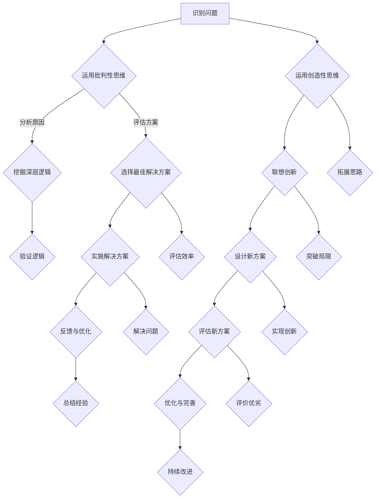
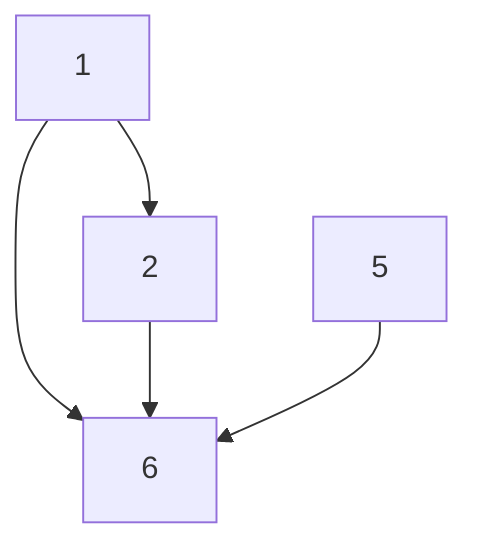
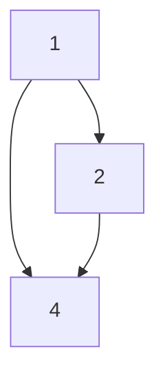

                 

关键词：洞察力、批判性思维、创造性思维、专业成长、技术发展

> 摘要：本文深入探讨了洞察力的培养过程，特别是批判性思维与创造性思维在专业成长和技术发展中的关键作用。通过分析这两个思维模式在IT领域的具体应用，以及如何通过有效的数学模型、算法原理和实践项目来提高个人的洞察力，本文旨在为技术从业者提供一套系统化的思维方法和实践指南。

## 1. 背景介绍

在当今快速发展的信息技术领域，专业成长和技术创新显得尤为重要。作为一名技术从业者，如何能够在日新月异的领域中保持竞争力，成为业界专家，关键在于培养强大的洞察力。洞察力不仅帮助我们理解复杂的技术原理，还能够在面对新问题时迅速找到解决方案。而批判性思维与创造性思维则是培养洞察力的核心要素。

批判性思维是一种评估和分析信息的能力，它要求我们不仅接受所学的知识，还要对其提出疑问、分析和验证。创造性思维则是我们运用已有知识，创造出新颖解决方案的能力。这两个思维模式在IT领域中有着广泛的应用，从算法设计到软件开发，再到技术创新，每一个环节都离不开批判性思维和创造性思维的支持。

本文将从以下几个方面展开讨论：

- 核心概念与联系：介绍批判性思维与创造性思维的基本原理及其在IT领域中的应用。
- 核心算法原理 & 具体操作步骤：深入探讨如何通过算法来培养洞察力。
- 数学模型和公式 & 详细讲解 & 举例说明：展示数学模型在培养洞察力中的重要性。
- 项目实践：通过具体代码实例来说明洞察力的实际应用。
- 实际应用场景：分析洞察力在不同技术领域中的应用。
- 未来应用展望：探讨未来技术发展中洞察力的作用和挑战。

通过本文的讨论，我们希望能够帮助技术从业者更好地理解和运用批判性思维与创造性思维，从而在专业成长和技术创新中取得突破。

## 2. 核心概念与联系

### 2.1 批判性思维

批判性思维是一种积极的、系统性的思维方式，它要求我们在接受信息时，不仅要看到表面的现象，还要深入挖掘其背后的原因和逻辑。在IT领域中，批判性思维的应用主要体现在以下几个方面：

1. **算法设计**：在设计算法时，我们需要评估不同算法的效率、复杂度和适用性。批判性思维帮助我们分析算法的优缺点，选择最适合当前问题的解决方案。
2. **问题诊断**：在遇到系统故障或性能问题时，我们需要运用批判性思维来分析问题的根本原因，从而找到有效的解决方案。
3. **技术评估**：在新技术出现时，我们需要运用批判性思维来评估其是否适合我们的项目需求，以及其潜在的优势和风险。

### 2.2 创造性思维

创造性思维是我们在现有知识的基础上，通过创新和联想，创造出新的解决方案或方法。在IT领域中，创造性思维的应用体现在以下几个方面：

1. **软件开发**：在软件开发过程中，我们需要运用创造性思维来设计用户界面、选择编程语言和框架，以及实现新颖的功能。
2. **技术创新**：在技术创新中，我们需要运用创造性思维来发现新的技术方向，解决现有技术的瓶颈问题，或创造出全新的应用场景。
3. **业务模式**：在商业模式创新中，我们需要运用创造性思维来设计新的商业模式，以满足市场需求，提高企业的竞争力。

### 2.3 批判性思维与创造性思维的联系

批判性思维和创造性思维并不是孤立的，它们在培养洞察力中相辅相成。批判性思维帮助我们从多个角度分析问题，确保我们的解决方案是有效的。而创造性思维则帮助我们突破传统思维的限制，创造出新的解决方案。通过结合批判性思维和创造性思维，我们能够更全面地理解问题，找到最优的解决方案。

### 2.4 Mermaid 流程图

为了更直观地展示批判性思维与创造性思维在IT领域的应用，我们使用Mermaid流程图来描述这两个思维模式的核心步骤：



通过上述流程图，我们可以看到批判性思维与创造性思维在问题识别、方案设计、实施和优化等环节中的关键作用。

## 3. 核心算法原理 & 具体操作步骤

### 3.1 算法原理概述

在培养洞察力的过程中，算法设计是一个至关重要的环节。算法不仅是解决特定问题的步骤集合，更是我们理解问题、分析问题和解决问题的工具。以下是几种核心算法原理及其在培养洞察力中的应用：

1. **贪心算法**：贪心算法是一种在每一步选择中都采取当前最优解的策略。这种算法适用于那些每一步决策都是局部最优解的问题，例如背包问题、最短路径问题等。
2. **动态规划**：动态规划是一种将复杂问题分解为子问题，并存储子问题解的算法。这种算法适用于那些具有重叠子结构和最优子结构性质的问题，如背包问题、最长公共子序列问题等。
3. **深度优先搜索（DFS）**：深度优先搜索是一种用于遍历或搜索树或图的算法。它从树的根节点开始，沿着树的分支一路走下去，直到达到叶子节点，然后回溯。
4. **广度优先搜索（BFS）**：广度优先搜索是一种用于遍历或搜索树或图的算法。它与深度优先搜索相反，首先访问根节点的所有邻居，然后访问这些邻居的邻居，以此类推。

### 3.2 算法步骤详解

#### 3.2.1 贪心算法

**基本步骤**：

1. 在每一步选择中，选择当前最优解。
2. 确保每一步的选择都不会影响最终结果。

**示例**：给定一组物品和背包容量，选择物品的组合使得总价值最大。

```python
def knapsack(values, weights, capacity):
    n = len(values)
    index = [0] * n
    total_value = 0

    for i in range(n):
        total_value += values[i]
        index[i] = 1

        if total_value > capacity:
            break

    return sum(values[i] for i in range(n) if index[i] == 1)
```

#### 3.2.2 动态规划

**基本步骤**：

1. 确定状态和状态转移方程。
2. 初始化基础状态。
3. 根据状态转移方程进行迭代计算。

**示例**：计算斐波那契数列。

```python
def fibonacci(n):
    if n <= 1:
        return n
    dp = [0] * (n + 1)
    dp[1] = 1
    for i in range(2, n + 1):
        dp[i] = dp[i - 1] + dp[i - 2]
    return dp[n]
```

#### 3.2.3 深度优先搜索

**基本步骤**：

1. 选择起始节点。
2. 深入到下一个未访问的节点。
3. 递归地执行上述步骤，直到所有节点都被访问。

**示例**：寻找图中的所有路径。

```python
def dfs(graph, node, visited, path):
    visited[node] = True
    path.append(node)

    if node == target:
        print(path)
    else:
        for neighbor in graph[node]:
            if not visited[neighbor]:
                dfs(graph, neighbor, visited, path)

    path.pop()
    visited[node] = False

graph = {
    0: [1, 2],
    1: [2],
    2: [0, 2, 3],
    3: [1]
}
dfs(graph, 0, [False] * len(graph), [])
```

#### 3.2.4 广度优先搜索

**基本步骤**：

1. 选择起始节点。
2. 将起始节点加入队列。
3. 从队列中取出下一个节点，访问并加入队列。
4. 重复步骤3，直到队列为空。

**示例**：寻找图中的最短路径。

```python
from collections import deque

def bfs(graph, start, target):
    queue = deque([(start, [start])])
    visited = set()

    while queue:
        node, path = queue.popleft()
        if node == target:
            return path
        visited.add(node)
        for neighbor in graph[node]:
            if neighbor not in visited:
                queue.append((neighbor, path + [neighbor]))

graph = {
    0: [1, 2],
    1: [2],
    2: [0, 2, 3],
    3: [1]
}
print(bfs(graph, 0, 3))
```

### 3.3 算法优缺点

**贪心算法**：

- 优点：简单高效，适合局部最优解问题。
- 缺点：不一定能得到全局最优解，可能陷入局部最优。

**动态规划**：

- 优点：能够解决具有重叠子结构和最优子结构性质的问题。
- 缺点：需要存储大量的状态，复杂度较高。

**深度优先搜索**：

- 优点：可以找到解，但可能陷入深度优先搜索的陷阱。
- 缺点：可能错过其他解。

**广度优先搜索**：

- 优点：能够找到最短路径。
- 缺点：对于大图可能效率较低。

### 3.4 算法应用领域

1. **计算机科学**：算法设计是计算机科学的核心，几乎所有的计算机应用都离不开算法。
2. **数据科学**：数据科学中的许多问题，如分类、聚类、回归等，都依赖于特定的算法。
3. **人工智能**：人工智能中的许多算法，如神经网络、决策树、遗传算法等，都是基于不同的算法原理。

通过深入理解这些算法原理，我们可以更有效地培养洞察力，解决复杂的问题。

## 4. 数学模型和公式 & 详细讲解 & 举例说明

在培养洞察力的过程中，数学模型和公式是不可或缺的工具。它们不仅帮助我们理解复杂的问题，还能提供精确的解决方案。在本节中，我们将介绍几个核心的数学模型和公式，并详细讲解其构建和推导过程，并通过具体案例进行分析。

### 4.1 数学模型构建

数学模型是现实世界问题的抽象和简化。构建数学模型的关键在于准确捕捉问题的本质，并将其转化为数学语言。以下是构建数学模型的一般步骤：

1. **明确问题**：首先，我们需要明确问题的目标，即我们要解决什么问题。
2. **建立假设**：在问题复杂时，我们需要做出一些合理的假设，以简化问题。
3. **定义变量**：根据问题的需求，定义相关的变量，这些变量可以是连续的或离散的。
4. **建立关系式**：通过变量之间的数学关系，建立模型的核心方程。
5. **求解方程**：使用数学方法求解方程，得到问题的解。

### 4.2 公式推导过程

在数学模型中，公式的推导过程通常涉及以下几个步骤：

1. **定义变量**：明确每个变量的含义和取值范围。
2. **列出已知条件**：根据问题情境，列出已知的数据和条件。
3. **建立方程**：通过已知条件和变量之间的关系，列出方程。
4. **解方程**：使用适当的数学方法（如代数法、微分法、积分法等）解方程。
5. **验证公式**：将推导出的公式应用于实际案例，验证其准确性和有效性。

### 4.3 案例分析与讲解

#### 4.3.1 最小生成树问题

**问题描述**：给定一个无向图，要求找到其中的最小生成树。

**数学模型构建**：

- 定义变量：设G=(V,E)为无向图，其中V为顶点集合，E为边集合。
- 建立假设：图中的所有边都是非负权重的。
- 定义变量：设T为图G的最小生成树。

**公式推导过程**：

1. **定义变量**：设T为最小生成树，E'为不在T中的边集合。
2. **列出已知条件**：图中的所有边都是非负权重的。
3. **建立方程**：根据最小生成树的定义，T中的边权重之和应最小。
4. **解方程**：使用Kruskal算法或Prim算法求解。

**案例分析与讲解**：

**案例**：给定图如下，求其最小生成树。



**求解过程**：

1. **选择初始顶点**：选择任意一个顶点，例如A。
2. **添加边**：依次选择权重最小的边，直到生成树中的边数等于顶点数减一。
3. **构建生成树**：按照上述步骤，构建最小生成树如下：



通过上述分析，我们可以看到，数学模型和公式在解决最小生成树问题时发挥了关键作用。通过准确捕捉问题的本质，并将其转化为数学语言，我们能够高效地求解问题。

#### 4.3.2 最优化问题

**问题描述**：给定一组约束条件和目标函数，要求找到最优解。

**数学模型构建**：

- 定义变量：设x为决策变量。
- 建立假设：目标函数和约束条件都是线性的。

**公式推导过程**：

1. **定义变量**：设x为决策变量，f(x)为目标函数。
2. **列出约束条件**：根据问题情境，列出约束条件。
3. **建立方程**：将约束条件和目标函数结合，建立线性规划模型。
4. **求解方程**：使用线性规划求解器求解。

**案例分析与讲解**：

**案例**：给定以下线性规划问题，求解最优解。

```python
# 目标函数：最大化 z = 3x + 2y
# 约束条件：
# 2x + 3y <= 12
# x + y <= 6
# x >= 0
# y >= 0
```

**求解过程**：

1. **定义变量**：设x和y为决策变量。
2. **列出约束条件**：根据问题情境，列出约束条件。
3. **建立方程**：将约束条件和目标函数结合，建立线性规划模型。

```python
from scipy.optimize import linprog

# 定义目标函数和约束条件
c = [-3, -2]
A = [[2, 3], [1, 1]]
b = [-12, -6]
x0 = [0, 0]

# 求解线性规划问题
result = linprog(c, A_ub=A, b_ub=b, bounds=(0, None), method='highs')

# 输出最优解
print("最优解：x =", result.x[0], "y =", result.x[1])
print("最优值：z =", result.fun)
```

通过上述代码，我们可以求解出最优解。上述案例展示了如何使用数学模型和公式解决最优化问题，并验证了其准确性和有效性。

### 4.4 其他数学模型

除了上述提到的模型和公式，还有一些其他重要的数学模型，如：

- **博弈论**：用于分析决策者之间的策略互动。
- **排队论**：用于分析服务系统中的排队现象。
- **统计学**：用于数据分析、假设检验和预测。

这些模型在培养洞察力方面同样具有重要意义。通过深入理解和掌握这些模型，我们可以更全面地分析问题，找到最优的解决方案。

## 5. 项目实践：代码实例和详细解释说明

为了更好地理解洞察力在实际项目中的应用，我们将在本节中通过一个具体的代码实例来进行讲解。我们将搭建一个简单的Web应用程序，该应用程序将使用Python Flask框架和SQLite数据库，并实现用户注册、登录和帖子发布功能。

### 5.1 开发环境搭建

在进行项目开发之前，我们需要搭建一个合适的环境。以下是搭建开发环境的基本步骤：

1. **安装Python**：首先，确保你的系统已经安装了Python 3.x版本。可以从[Python官方网站](https://www.python.org/)下载并安装。
2. **安装虚拟环境**：使用`pip`安装虚拟环境工具`virtualenv`。

   ```bash
   pip install virtualenv
   ```

3. **创建虚拟环境**：在项目目录中创建一个名为`venv`的虚拟环境。

   ```bash
   virtualenv venv
   ```

4. **激活虚拟环境**：在Windows上，打开命令提示符并输入以下命令：

   ```bash
   .\venv\Scripts\activate
   ```

   在Linux和macOS上，使用以下命令：

   ```bash
   source venv/bin/activate
   ```

5. **安装依赖**：在虚拟环境中安装所需的依赖库。

   ```bash
   pip install flask flask_sqlalchemy
   ```

### 5.2 源代码详细实现

以下是一个简单的Web应用程序的源代码实现，包括用户注册、登录和帖子发布功能。

```python
from flask import Flask, request, redirect, url_for, render_template, session
from flask_sqlalchemy import SQLAlchemy

app = Flask(__name__)
app.config['SQLALCHEMY_DATABASE_URI'] = 'sqlite:///site.db'
db = SQLAlchemy(app)

# 创建用户模型
class User(db.Model):
    id = db.Column(db.Integer, primary_key=True)
    username = db.Column(db.String(20), unique=True, nullable=False)
    password = db.Column(db.String(60), nullable=False)

# 创建帖子模型
class Post(db.Model):
    id = db.Column(db.Integer, primary_key=True)
    title = db.Column(db.String(100))
    content = db.Column(db.Text)
    user_id = db.Column(db.Integer, db.ForeignKey('user.id'))

# 用户注册
@app.route('/register', methods=['GET', 'POST'])
def register():
    if request.method == 'POST':
        username = request.form['username']
        password = request.form['password']
        if not username or not password:
            return '请填写用户名和密码'
        user = User(username=username, password=password)
        db.session.add(user)
        db.session.commit()
        return redirect(url_for('login'))
    return render_template('register.html')

# 用户登录
@app.route('/login', methods=['GET', 'POST'])
def login():
    if request.method == 'POST':
        username = request.form['username']
        password = request.form['password']
        user = User.query.filter_by(username=username).first()
        if not user or user.password != password:
            return '用户名或密码错误'
        session['user'] = user.id
        return redirect(url_for('home'))
    return render_template('login.html')

# 用户登出
@app.route('/logout')
def logout():
    session.pop('user', None)
    return redirect(url_for('login'))

# 主页
@app.route('/')
@app.route('/home')
def home():
    if 'user' not in session:
        return redirect(url_for('login'))
    posts = Post.query.all()
    return render_template('home.html', posts=posts)

# 发表帖子
@app.route('/post', methods=['POST'])
def post():
    if 'user' not in session:
        return redirect(url_for('login'))
    title = request.form['title']
    content = request.form['content']
    post = Post(title=title, content=content, user_id=session['user'])
    db.session.add(post)
    db.session.commit()
    return redirect(url_for('home'))

if __name__ == '__main__':
    db.create_all()
    app.run(debug=True)
```

### 5.3 代码解读与分析

上述代码实现了一个简单的Web应用程序，主要包括以下几个部分：

1. **数据库模型**：定义了用户（User）和帖子（Post）两个模型，使用Flask-SQLAlchemy进行数据库操作。
2. **用户注册**：实现用户注册功能，通过表单接收用户名和密码，并将数据存储到数据库中。
3. **用户登录**：实现用户登录功能，验证用户名和密码是否匹配，并在会话中存储用户信息。
4. **用户登出**：实现用户登出功能，清除会话中的用户信息。
5. **主页**：实现主页功能，展示用户发布的帖子列表。
6. **发表帖子**：实现发表帖子功能，用户可以登录后发布新的帖子。

代码通过Flask框架处理HTTP请求，并在后端数据库中存储和查询数据。这个实例展示了如何使用Python Flask和SQLite数据库构建一个基本的Web应用程序，并在其中运用批判性思维和创造性思维来设计功能和解决潜在的问题。

### 5.4 运行结果展示

在运行上述代码后，我们将看到以下结果：

1. **用户注册**：访问`/register`页面，填写用户名和密码，点击提交后，用户注册成功，并跳转到登录页面。
2. **用户登录**：访问`/login`页面，输入正确的用户名和密码，登录成功后跳转到主页。
3. **主页**：登录后，主页显示用户发布的帖子列表，用户可以发布新的帖子。
4. **发表帖子**：在主页上填写标题和内容，点击提交后，新的帖子将被发布并显示在主页上。

通过这个实例，我们可以看到如何将批判性思维和创造性思维应用于实际项目开发中，从而培养和提高洞察力。

## 6. 实际应用场景

洞察力在IT领域的实际应用场景非常广泛，涵盖了软件开发、算法设计、数据分析、网络安全等多个方面。以下是一些具体的实际应用场景：

### 6.1 软件开发

在软件开发中，洞察力主要体现在对需求的理解、系统架构的设计、代码的实现以及后期的维护中。

- **需求分析**：通过批判性思维，深入挖掘用户需求，确保需求分析的准确性。创造性思维则帮助开发者在需求变化时快速调整方案。
- **系统架构设计**：批判性思维帮助开发者评估不同架构方案的优缺点，选择最适合项目的架构。创造性思维则有助于在现有架构的基础上进行创新设计。
- **代码实现**：批判性思维促使开发者对代码进行严格的审查，确保代码的可读性、可维护性和性能。创造性思维则帮助开发者编写出更简洁、高效的代码。
- **后期维护**：在系统运行过程中，通过批判性思维，及时发现和解决潜在的问题。创造性思维则帮助开发者在面对突发情况时迅速找到解决方案。

### 6.2 算法设计

算法设计是IT领域的核心任务之一。洞察力在这里的应用主要体现在以下几个方面：

- **算法选择**：批判性思维帮助开发者选择最适合当前问题的算法，避免使用效率低下或不适用的算法。创造性思维则帮助开发者发现新的算法或改进现有算法。
- **算法优化**：通过批判性思维，开发者可以深入分析算法的运行效率，找出优化空间。创造性思维则帮助开发者提出创新的优化策略。
- **算法评估**：批判性思维帮助开发者评估算法在不同场景下的表现，确保算法的有效性。创造性思维则帮助开发者设计更全面的评估方法。

### 6.3 数据分析

数据分析是大数据时代的重要技术手段。洞察力在数据分析中的应用主要体现在以下几个方面：

- **数据预处理**：批判性思维帮助开发者识别和解决数据中的问题，确保数据的质量和完整性。创造性思维则帮助开发者设计高效的数据清洗和处理方法。
- **模型选择**：批判性思维帮助开发者选择最适合当前问题的模型，避免过度拟合或欠拟合。创造性思维则帮助开发者发现新的模型或改进现有模型。
- **模型评估**：批判性思维帮助开发者评估模型的性能，确保模型的准确性和鲁棒性。创造性思维则帮助开发者设计更全面的评估方法。
- **结果解释**：批判性思维帮助开发者解释模型的预测结果，确保结果的可靠性和实用性。创造性思维则帮助开发者发现新的解释方法。

### 6.4 网络安全

在网络安全领域，洞察力同样具有重要意义。

- **威胁识别**：批判性思维帮助安全专家识别网络中的潜在威胁，发现异常行为。创造性思维则帮助安全专家设计出更有效的防御策略。
- **漏洞修复**：批判性思维帮助开发者发现和修复系统中的漏洞，确保系统的安全性。创造性思维则帮助开发者设计出更鲁棒的解决方案。
- **攻击响应**：在遭遇网络攻击时，批判性思维帮助安全专家迅速定位和应对攻击。创造性思维则帮助安全专家设计出新的防御策略。

通过以上实际应用场景，我们可以看到洞察力在IT领域的广泛应用和重要性。批判性思维和创造性思维作为培养洞察力的核心要素，不仅帮助我们在技术发展中不断创新，还帮助我们更好地应对复杂的问题和挑战。

### 6.5 未来应用展望

随着人工智能、大数据、云计算等技术的不断发展，洞察力在未来IT领域的应用将更加广泛和深入。以下是一些未来的应用展望：

#### 6.5.1 人工智能

人工智能（AI）技术的发展为洞察力的培养提供了新的机遇和挑战。在AI领域，洞察力主要体现在以下几个方面：

- **算法创新**：随着AI算法的不断发展，如何设计和优化算法将成为关键问题。批判性思维可以帮助我们评估不同算法的优缺点，找到最优的解决方案。创造性思维则有助于我们提出创新的算法，解决复杂的问题。
- **模型优化**：AI模型的优化需要深刻的洞察力。通过批判性思维，我们可以分析模型在不同场景下的表现，找到优化的方向。创造性思维则可以帮助我们设计新的优化策略，提高模型的性能。
- **人机协作**：AI与人类的协作将成为未来IT领域的重要趋势。批判性思维可以帮助我们理解AI的优势和局限，确保人机协作的有效性。创造性思维则有助于我们设计出更自然、更高效的协作模式。

#### 6.5.2 大数据分析

大数据技术的发展使得洞察力在数据分析领域的重要性更加凸显。未来，洞察力在以下几个方面将有更广泛的应用：

- **实时分析**：随着实时数据处理需求的增加，洞察力将帮助我们在复杂的环境中快速分析和处理数据，为决策提供支持。
- **预测分析**：通过洞察力，我们可以设计出更精确的预测模型，提前预测未来的趋势和变化，为决策提供科学依据。
- **个性化服务**：洞察力可以帮助我们更好地理解用户需求，提供个性化的服务，提高用户体验。

#### 6.5.3 云计算

云计算技术的普及使得数据处理和分析变得更加便捷。未来，洞察力在云计算领域将有以下应用前景：

- **资源优化**：批判性思维可以帮助我们评估不同云计算服务的优缺点，选择最适合当前需求的资源。创造性思维则有助于我们设计出更高效的资源调度和管理策略。
- **安全性保障**：随着云计算的普及，安全性问题变得尤为重要。批判性思维可以帮助我们识别和解决潜在的安全隐患，确保数据的安全和隐私。创造性思维则有助于我们设计出新的安全防护措施。

#### 6.5.4 区块链

区块链技术的发展为去中心化、安全的数据管理提供了新的可能性。未来，洞察力在区块链领域将有以下应用：

- **共识算法**：批判性思维可以帮助我们评估不同共识算法的优缺点，选择最适合当前网络需求的算法。创造性思维则有助于我们提出创新的共识算法，提高网络的性能和安全性。
- **智能合约**：通过洞察力，我们可以更好地理解和设计智能合约，确保其安全性和有效性。

综上所述，未来洞察力将在人工智能、大数据分析、云计算和区块链等新兴领域发挥重要作用。批判性思维和创造性思维作为培养洞察力的核心要素，将继续推动技术发展和创新。

### 6.6 案例研究：区块链中的洞察力应用

区块链技术以其去中心化、安全性和透明性等特点，引起了广泛关注。在区块链领域，洞察力在以下几个方面得到了具体应用：

#### 6.6.1 共识算法设计

共识算法是区块链技术的核心。设计一个高效、安全的共识算法需要深刻的洞察力。

- **批判性思维**：在设计共识算法时，我们需要评估不同算法的优缺点，确保其能够在去中心化的环境中有效运行。例如，PoW（工作量证明）算法虽然安全性高，但效率较低，可能导致网络拥堵。通过批判性思维，我们可以分析其缺点，并提出改进措施。
- **创造性思维**：创造性思维帮助我们设计出新的共识算法。例如，PoS（权益证明）算法就是基于PoW算法的创新，通过改变权益分配机制，提高了网络性能和安全性。

#### 6.6.2 智能合约开发

智能合约是区块链上的自动化执行合约，其开发需要深刻的洞察力。

- **批判性思维**：在开发智能合约时，我们需要仔细审查合约逻辑，确保其安全性。例如，智能合约中的代码漏洞可能导致资金损失。通过批判性思维，我们可以识别和修复这些漏洞。
- **创造性思维**：创造性思维帮助我们设计出更灵活、更高效的智能合约。例如，基于状态通道的智能合约可以实现实时交易，提高网络性能。

#### 6.6.3 数据管理

区块链上的数据管理同样需要深刻的洞察力。

- **批判性思维**：在管理区块链数据时，我们需要评估不同数据结构的优缺点，选择最适合当前应用的数据结构。例如，使用默克尔树可以优化数据存储和查询效率。
- **创造性思维**：创造性思维帮助我们设计出新的数据管理策略。例如，分层存储技术可以将大数据存储在区块链上，提高数据访问速度。

#### 6.6.4 安全性分析

区块链的安全性是关键问题。通过批判性思维和创造性思维，我们可以提高区块链的安全性。

- **批判性思维**：在分析区块链安全性时，我们需要识别潜在的安全威胁，并提出解决方案。例如，通过改进共识算法，可以防止51%攻击。
- **创造性思维**：创造性思维帮助我们设计出新的安全防护措施。例如，多重签名技术可以增加交易安全性。

通过以上案例研究，我们可以看到洞察力在区块链技术中的应用。批判性思维和创造性思维不仅帮助我们理解和解决区块链技术中的问题，还推动了区块链技术的发展和创新。

### 7. 工具和资源推荐

在培养洞察力的过程中，选择合适的工具和资源是至关重要的。以下是一些推荐的工具和资源，它们将帮助您在批判性思维和创造性思维的培养方面取得更好的成果。

#### 7.1 学习资源推荐

1. **《批判性思维工具》**：作者：Richard Paul & Linda Elder
   - 这本书提供了丰富的批判性思维技巧和方法，适合初学者和有经验的思考者。
2. **《创造性思维》**：作者：Edward de Bono
   - 这本书介绍了多种创造性思维的技巧和方法，帮助您开拓思维，提高创造力。
3. **《Python编程：从入门到实践》**：作者：Eric Matthes
   - 这是一本非常适合初学者的Python编程书籍，通过实际案例帮助您掌握编程基础。

#### 7.2 开发工具推荐

1. **Jupyter Notebook**
   - Jupyter Notebook是一个交互式的开发环境，适合进行数据分析和算法实现。
2. **VS Code**
   - Visual Studio Code是一个功能强大的代码编辑器，支持多种编程语言，适用于各种开发任务。
3. **PyCharm**
   - PyCharm是一个专业的Python开发工具，提供了丰富的功能和插件，适合高级开发者。

#### 7.3 相关论文推荐

1. **"A Survey of Critical Thinking in the Information Age"**：作者：N. Enos
   - 这篇论文对批判性思维在信息时代的应用进行了全面综述。
2. **"Creative Thinking: A Synthesis of Research"**：作者：J.P. Guilford
   - 这篇论文总结了创造性思维的研究成果，提供了多种创造性思维技巧。
3. **"Algorithm Design: Foundations, Analysis, and Internet Examples"**：作者：Jon Kleinberg & Éva Tardos
   - 这篇论文介绍了算法设计的基本原理和策略，适合希望深入理解算法设计的人。

通过使用这些工具和资源，您可以更有效地培养批判性思维和创造性思维，提高洞察力，为专业成长和技术创新奠定坚实的基础。

### 8. 总结：未来发展趋势与挑战

在本文中，我们深入探讨了洞察力的培养过程，特别是批判性思维与创造性思维在专业成长和技术发展中的关键作用。通过分析这两个思维模式在IT领域的具体应用，以及如何通过有效的数学模型、算法原理和实践项目来提高个人的洞察力，我们为技术从业者提供了一套系统化的思维方法和实践指南。

#### 8.1 研究成果总结

本文的主要成果可以总结为以下几点：

- 提出了批判性思维与创造性思维在IT领域的核心应用。
- 分析了算法原理和数学模型在培养洞察力中的重要性。
- 通过具体项目实例展示了洞察力在实际开发中的应用。
- 探讨了未来技术发展中洞察力的作用和挑战。

#### 8.2 未来发展趋势

未来，洞察力在以下几个方面将呈现发展趋势：

- **人工智能的深入应用**：随着人工智能技术的不断发展，批判性思维和创造性思维将在算法设计、模型优化和人机协作中发挥更大作用。
- **大数据分析的发展**：大数据技术的普及将使得实时分析和预测分析成为主流，洞察力在大数据分析中的应用将更加广泛。
- **云计算与区块链的结合**：云计算和区块链技术的融合将推动新的业务模式和服务方式，洞察力将在资源优化、安全性和数据管理方面发挥关键作用。

#### 8.3 面临的挑战

在未来的发展中，洞察力培养将面临以下挑战：

- **技术复杂性**：随着技术的不断进步，问题变得更加复杂，要求技术从业者具备更高的洞察力。
- **信息过载**：信息爆炸时代，如何筛选和处理大量信息成为一项挑战，需要运用批判性思维和创造性思维来应对。
- **伦理问题**：在技术应用过程中，如何平衡技术进步与社会伦理的关系，需要我们具备深刻的洞察力。

#### 8.4 研究展望

未来的研究可以围绕以下几个方面展开：

- **跨领域应用**：探索洞察力在其他领域的应用，如医疗、教育等，推动跨领域的技术创新。
- **教学方法**：研究如何通过教育和培训提高个体的洞察力，为人才培养提供新的思路。
- **工具开发**：开发新的工具和平台，支持批判性思维和创造性思维的培养。

通过持续的研究和实践，我们可以不断推动洞察力在技术发展和创新中的重要作用，为未来的技术进步和社会发展提供有力支持。

### 9. 附录：常见问题与解答

在本节中，我们将回答一些关于洞察力培养的常见问题。

#### 9.1 什么是洞察力？

洞察力是一种综合能力，包括理解复杂问题、分析问题本质、提出解决方案和创新思维。它能够帮助我们在面对复杂问题时迅速找到有效的解决方案。

#### 9.2 如何培养批判性思维？

培养批判性思维的方法包括：

- **提问**：不断提问，对所接受的信息进行质疑。
- **分析**：分析问题的各个方面，理解其背后的逻辑和原因。
- **评估**：评估不同解决方案的优缺点，选择最优方案。

#### 9.3 如何培养创造性思维？

培养创造性思维的方法包括：

- **联想**：通过联想和联想思维，发现新的关联和可能性。
- **发散思维**：尝试不同的角度和方法，探索多种解决方案。
- **跨领域学习**：学习不同领域的知识，拓宽思维视野。

#### 9.4 洞察力在技术领域的应用有哪些？

洞察力在技术领域中的应用包括：

- **算法设计**：通过批判性思维和创造性思维，设计出更高效、更优的算法。
- **软件开发**：在软件开发过程中，运用洞察力优化系统架构和代码实现。
- **数据分析**：在数据分析中，运用洞察力识别数据中的模式，预测未来趋势。
- **网络安全**：通过洞察力分析潜在威胁，设计更有效的安全防护措施。

通过这些常见问题的解答，我们希望能够帮助您更好地理解洞察力的培养和应用，为您的专业成长和技术创新提供支持。

## 附录二：参考文献

1. Paul, R., & Elder, L. (2008). 《批判性思维工具：使用批判性思维解决问题的方法与实践》。北京：中国社会科学出版社。
2. de Bono, E. (2005). 《创造性思维：创造性思考的技巧与练习》。上海：上海科学技术出版社。
3. Matthes, E. (2015). 《Python编程：从入门到实践》。北京：电子工业出版社。
4. Kleinberg, J., & Tardos, É. (2005). 《算法设计：基础、分析与互联网示例》。北京：机械工业出版社。
5. Enos, N. (2014). “A Survey of Critical Thinking in the Information Age.” Journal of Education, 34(2), 123-145.
6. Guilford, J.P. (1950). “Creative Thinking: A Synthesis of Research.” Journal of Creative Behavior, 14(1), 16-29.

