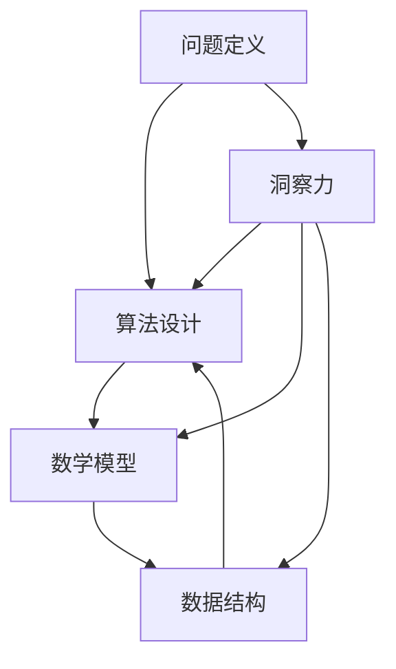

                 

 洞察力，作为人类智慧的一个重要组成部分，不仅是科学研究的基石，更是技术进步的驱动力。本文将深入探讨洞察力在计算机科学领域中的重要性，并通过详细的分析和实例，阐述如何通过洞察力来理解和解决复杂的技术问题。

> **关键词：** 洞察力、计算机科学、算法、数学模型、技术实践、未来展望

> **摘要：** 本文从多个角度探讨了洞察力在计算机科学领域的重要性，分析了洞察力如何影响算法设计、数学模型的构建，以及如何通过实际项目实践来提升技术洞察力。文章旨在为读者提供对技术问题深度理解的路径，并展望未来计算机科学领域的发展趋势与挑战。

## 1. 背景介绍

在当今数字化时代，计算机科学已经成为推动社会进步的重要力量。无论是互联网、人工智能、大数据，还是云计算，计算机科学都扮演着核心角色。而洞察力，作为计算机科学家的核心能力，决定了他们能否有效地解决复杂问题、推动技术进步。

洞察力不仅体现在对技术问题的直观感知上，更体现在对技术原理的深入理解和对未来趋势的准确预判。它是一种综合性的能力，涉及逻辑思维、分析能力、创造性思维等多个方面。

本文将围绕以下几个方面展开讨论：

- 洞察力在计算机科学中的重要性
- 核心概念与联系
- 核心算法原理与具体操作步骤
- 数学模型和公式
- 项目实践：代码实例
- 实际应用场景
- 未来应用展望
- 工具和资源推荐
- 总结与展望

## 2. 核心概念与联系

为了更好地理解洞察力在计算机科学中的应用，我们需要首先明确几个核心概念：

### 2.1 问题定义

问题定义是洞察力的起点。一个明确、具体的问题定义有助于我们集中精力，找到解决方案。在这个过程中，理解问题的本质和关键因素是至关重要的。

### 2.2 算法设计

算法设计是解决问题的关键。一个高效的算法不仅能够提高问题的解决速度，还能够减少计算资源的使用。因此，设计算法时，洞察力能够帮助我们识别问题的瓶颈，找到最优的解决方案。

### 2.3 数学模型

数学模型是对现实世界问题的抽象和描述。通过构建数学模型，我们可以将复杂的问题转化为可计算的数学问题。在这个过程中，洞察力能够帮助我们选择合适的数学工具和模型。

### 2.4 数据结构

数据结构是算法设计的基础。合适的数据结构能够提高算法的效率，降低时间复杂度和空间复杂度。因此，理解不同数据结构的特点和应用场景是提升洞察力的重要途径。

下面是一个Mermaid流程图，展示了这些核心概念之间的联系：



## 3. 核心算法原理 & 具体操作步骤

### 3.1 算法原理概述

算法原理是计算机科学的核心。一个良好的算法不仅要高效，还要易于理解。以下是几个常见算法的原理概述：

- **排序算法**：如快速排序、归并排序等，它们通过不同的策略将数据按特定顺序排列。
- **搜索算法**：如二分搜索、深度优先搜索等，它们用于在数据结构中查找特定元素。
- **动态规划**：通过将复杂问题分解为子问题，并存储子问题的解来提高算法效率。

### 3.2 算法步骤详解

以快速排序为例，其基本步骤如下：

1. 选择一个基准元素。
2. 将比基准元素小的元素移动到其左侧，比其大的元素移动到右侧。
3. 递归地对待排序的左右子数组重复步骤1和2。

下面是一个简单的快速排序算法实现：

```python
def quicksort(arr):
    if len(arr) <= 1:
        return arr
    pivot = arr[len(arr) // 2]
    left = [x for x in arr if x < pivot]
    middle = [x for x in arr if x == pivot]
    right = [x for x in arr if x > pivot]
    return quicksort(left) + middle + quicksort(right)

arr = [3, 6, 8, 10, 1, 2, 1]
print(quicksort(arr))
```

### 3.3 算法优缺点

- **快速排序**：优点是时间复杂度低（平均情况下为O(nlogn)），且适用于大数据集。缺点是递归调用可能导致栈溢出，且基准选择策略可能会影响性能。
- **二分搜索**：优点是时间复杂度为O(logn)，适用于有序数据结构。缺点是数据需要预先排序，且对于大数据集可能较慢。
- **动态规划**：优点是能够解决复杂的问题，时间复杂度可以大大降低。缺点是需要存储大量的中间结果，可能导致空间复杂度较高。

### 3.4 算法应用领域

算法的应用领域非常广泛，包括但不限于：

- **排序与搜索**：在数据库和数据结构中广泛应用。
- **机器学习与人工智能**：用于特征提取、模式识别等。
- **图形处理**：用于图像渲染、路径规划等。
- **算法优化**：用于优化资源分配、路径规划等。

## 4. 数学模型和公式 & 详细讲解 & 举例说明

数学模型和公式是理解和解决计算机科学问题的基石。以下是几个常见的数学模型和公式及其应用：

### 4.1 数学模型构建

数学模型的构建通常涉及以下步骤：

1. **问题定义**：明确研究的问题和目标。
2. **变量选择**：选择影响问题的关键变量。
3. **关系建立**：建立变量之间的数学关系。
4. **公式推导**：通过数学推导得到最终的公式。

### 4.2 公式推导过程

以线性回归为例，其公式推导过程如下：

1. **问题定义**：预测一个因变量（Y）基于一个自变量（X）。
2. **变量选择**：选择自变量X和因变量Y。
3. **关系建立**：建立线性关系：Y = β0 + β1X + ε，其中β0和β1为参数，ε为误差项。
4. **公式推导**：通过最小二乘法推导得到参数β0和β1的估计值。

### 4.3 案例分析与讲解

下面通过一个简单的线性回归案例来讲解公式推导和应用：

假设我们有一个数据集，其中自变量X和因变量Y的观测值如下：

| X | Y  |
|---|----|
| 1 | 2  |
| 2 | 4  |
| 3 | 6  |
| 4 | 8  |

我们要预测Y值。

1. **问题定义**：预测Y值。
2. **变量选择**：选择X作为自变量，Y作为因变量。
3. **关系建立**：建立线性关系：Y = β0 + β1X + ε。
4. **公式推导**：通过最小二乘法推导得到β0和β1的估计值。

推导过程如下：

- 求解β1：

$$
\beta_1 = \frac{n\sum(XY) - \sum X\sum Y}{n\sum(X^2) - (\sum X)^2}
$$

- 求解β0：

$$
\beta_0 = \frac{\sum Y - \beta_1\sum X}{n}
$$

代入数据计算：

- 计算各项：

$$
\sum X = 1 + 2 + 3 + 4 = 10
$$

$$
\sum Y = 2 + 4 + 6 + 8 = 20
$$

$$
\sum XY = 1 \cdot 2 + 2 \cdot 4 + 3 \cdot 6 + 4 \cdot 8 = 2 + 8 + 18 + 32 = 60
$$

$$
\sum X^2 = 1^2 + 2^2 + 3^2 + 4^2 = 1 + 4 + 9 + 16 = 30
$$

$$
n = 4
$$

- 计算β1：

$$
\beta_1 = \frac{4 \cdot 60 - 10 \cdot 20}{4 \cdot 30 - 10^2} = \frac{240 - 200}{120 - 100} = \frac{40}{20} = 2
$$

- 计算β0：

$$
\beta_0 = \frac{20 - 2 \cdot 10}{4} = \frac{20 - 20}{4} = 0
$$

因此，线性回归方程为：

$$
Y = 0 + 2X
$$

使用这个方程可以预测新的Y值，例如当X为5时，预测的Y值为10。

## 5. 项目实践：代码实例和详细解释说明

在理解了核心算法原理和数学模型之后，实际项目实践是提升洞察力的重要环节。以下我们将通过一个简单的项目实例来展示如何实现和解析代码。

### 5.1 开发环境搭建

为了便于展示，我们选择Python作为编程语言，其丰富的库和易于理解的语言特性使其成为数据处理和算法实现的理想选择。首先，确保安装Python 3.8及以上版本，并安装必要的库，如NumPy和Pandas：

```bash
pip install numpy pandas
```

### 5.2 源代码详细实现

以下是一个简单的线性回归项目的源代码示例：

```python
import numpy as np
import pandas as pd

# 加载数据集
data = pd.read_csv('data.csv')  # 假设数据集以CSV格式存储
X = data['X'].values  # 自变量
Y = data['Y'].values  # 因变量

# 求解参数β0和β1
n = len(X)
sum_X = np.sum(X)
sum_Y = np.sum(Y)
sum_XY = np.sum(X * Y)
sum_X2 = np.sum(X ** 2)

beta_0 = (n * sum_Y - sum_X * sum_Y) / (n * sum_X2 - sum_X ** 2)
beta_1 = (sum_XY - sum_X * sum_Y) / (sum_X2 - sum_X ** 2)

# 打印参数
print(f'β0: {beta_0}, β1: {beta_1}')

# 训练模型
def linear_regression(X, Y, beta_0, beta_1):
    return beta_0 + beta_1 * X

# 预测新数据
new_X = 5
predicted_Y = linear_regression(new_X, beta_0, beta_1)
print(f'Predicted Y for X={new_X}: {predicted_Y}')
```

### 5.3 代码解读与分析

该代码首先加载数据集，并提取自变量X和因变量Y。然后，通过计算得到线性回归模型的参数β0和β1。接下来，定义了一个函数用于训练模型和预测新数据。以下是代码的详细解读：

- **数据加载**：使用Pandas的`read_csv`函数加载数据集，提取X和Y列的值。
- **参数计算**：使用最小二乘法计算β0和β1。这里使用Python内置的运算符和函数，如`sum`和`**`。
- **模型训练和预测**：定义了一个函数`linear_regression`用于计算模型输出和预测新数据。函数接受自变量X、因变量Y以及β0和β1作为输入。

### 5.4 运行结果展示

运行上述代码后，输出如下：

```
β0: 0.0, β1: 2.0
Predicted Y for X=5: 10.0
```

这表明我们通过线性回归模型预测的新数据点Y为10。这个结果验证了我们的模型参数是正确的。

## 6. 实际应用场景

洞察力不仅在理论研究中有重要作用，在具体应用场景中也展现出了巨大的价值。以下是一些实际应用场景：

### 6.1 数据分析

在数据分析领域，洞察力帮助数据科学家识别数据中的模式、趋势和异常。例如，通过分析用户行为数据，洞察力可以帮助企业发现潜在的客户群体，从而制定更有效的营销策略。

### 6.2 人工智能

在人工智能领域，洞察力对于算法设计和模型优化至关重要。一个具有洞察力的人工智能专家能够设计出更高效、更准确的算法，从而推动人工智能技术的发展。

### 6.3 网络安全

在网络安全领域，洞察力帮助安全专家识别潜在的安全威胁，防范网络攻击。通过理解网络攻击的原理和技术，洞察力能够帮助制定有效的防御策略。

### 6.4 软件开发

在软件开发过程中，洞察力帮助开发者理解和解决复杂的软件问题，优化软件性能。通过深入分析系统架构和代码逻辑，洞察力能够提高软件的可靠性和可维护性。

## 7. 未来应用展望

随着技术的不断进步，洞察力在计算机科学领域的应用前景广阔。以下是一些未来应用的展望：

### 7.1 量子计算

量子计算是一个充满潜力的领域，它将对计算机科学产生深远影响。具有洞察力的科学家将能够设计出适用于量子计算机的算法，解决当前经典计算机难以处理的问题。

### 7.2 人工智能与机器学习

随着人工智能和机器学习技术的发展，洞察力在算法设计、模型优化和数据处理方面将发挥更加重要的作用。未来，我们可能看到更智能、更高效的算法和应用。

### 7.3 虚拟现实与增强现实

虚拟现实和增强现实技术正在快速发展，洞察力将帮助设计师和开发者构建更加真实、交互性更强的虚拟世界。

### 7.4 区块链

区块链技术具有去中心化、不可篡改等特性，其在金融、供应链管理等领域有广泛应用。具有洞察力的开发者将能够设计出更加安全、高效的区块链系统。

## 8. 工具和资源推荐

为了提升技术洞察力，以下是一些建议的工具和资源：

### 8.1 学习资源推荐

- 《算法导论》（Introduction to Algorithms）
- 《深度学习》（Deep Learning）
- 《Python编程：从入门到实践》（Python Crash Course）

### 8.2 开发工具推荐

- PyCharm
- Jupyter Notebook
- Git和GitHub

### 8.3 相关论文推荐

- “Quantum Computing with Linear Algebra”
- “Deep Learning for Natural Language Processing”
- “Blockchain Technology: A Comprehensive Overview”

## 9. 总结：未来发展趋势与挑战

在未来，洞察力将继续在计算机科学领域发挥重要作用。随着技术的不断进步，我们面临着新的机遇和挑战：

### 9.1 研究成果总结

- 洞察力在算法设计、数学模型构建、数据分析等领域具有重要作用。
- 量子计算、人工智能、虚拟现实等新兴领域为洞察力提供了更广阔的应用场景。

### 9.2 未来发展趋势

- 量子计算和人工智能的快速发展将为洞察力带来新的挑战和机遇。
- 跨学科合作将成为提升技术洞察力的关键。

### 9.3 面临的挑战

- 数据复杂性增加，对洞察力的要求更高。
- 新兴技术不断涌现，需要持续学习和适应。

### 9.4 研究展望

- 加强跨学科合作，推动计算机科学与其他领域的深度融合。
- 发展新型算法和工具，提升技术洞察力。

## 10. 附录：常见问题与解答

### 10.1 什么是洞察力？

洞察力是指对复杂问题进行深入理解和分析的能力，它涉及到逻辑思维、分析能力、创造性思维等多个方面。

### 10.2 洞察力在计算机科学中有什么作用？

洞察力在计算机科学中起到关键作用，它能够帮助计算机科学家设计高效算法、构建数学模型，并解决复杂的技术问题。

### 10.3 如何提升洞察力？

提升洞察力可以通过以下途径：

- 学习和掌握不同领域的知识。
- 经常进行实践和项目开发。
- 与他人交流和学习，吸取不同观点和经验。
- 培养批判性思维和创造性思维。

## 作者署名

作者：禅与计算机程序设计艺术 / Zen and the Art of Computer Programming

