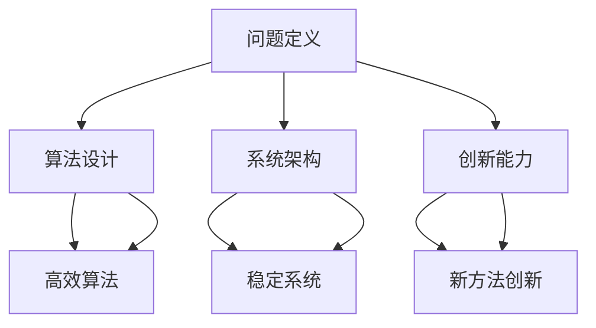

                 

 洞察力，作为知识创新的重要驱动力，在信息技术飞速发展的今天，变得尤为重要。本文旨在探讨洞察力在计算机科学领域的作用，分析其核心概念、算法原理，并结合实际应用，展望未来的发展趋势与挑战。

## 关键词
* 洞察力
* 知识创新
* 计算机科学
* 人工智能
* 算法

## 摘要
本文首先介绍洞察力的概念及其在计算机科学中的重要性。随后，我们将探讨洞察力的核心概念与联系，并分析其主要算法原理。接着，通过数学模型和公式的详细讲解，展示其在实际项目中的应用。最后，我们对未来应用前景、工具和资源进行推荐，并总结研究成果与展望。

## 1. 背景介绍
在现代社会，信息技术正以惊人的速度发展，计算机科学作为其核心领域，不断推动着人类文明的进步。然而，在技术进步的同时，我们也在面对诸多挑战，如数据过载、算法透明性、伦理问题等。在这种情况下，洞察力作为一种深刻的认知能力，能够帮助我们更好地理解和解决这些问题，从而实现知识创新。

### 1.1 计算机科学的发展
计算机科学起源于20世纪40年代，随着电子计算机的出现，逐渐发展成为一个涵盖计算机硬件、软件、算法、人工智能等多个领域的综合性学科。如今，计算机科学已成为推动社会发展的关键力量，其应用范围涵盖了经济、教育、医疗、交通等多个领域。

### 1.2 知识创新的重要性
知识创新是指通过创造、整合、应用知识，形成新的观念、方法、产品或服务的过程。在计算机科学领域，知识创新不仅有助于提高技术水平，还能推动产业升级、促进经济发展。因此，研究如何提升洞察力，以实现知识创新，具有重要的现实意义。

## 2. 核心概念与联系
洞察力作为一种深层次的认知能力，涉及到多个学科领域，如心理学、哲学、认知科学等。在计算机科学中，洞察力主要体现在对复杂问题的理解、分析和解决能力上。

### 2.1 洞察力的定义
洞察力是指能够洞察事物本质、发现规律、预见趋势的能力。在计算机科学中，洞察力主要体现在以下几个方面：

1. **问题定义**：能够准确识别和定义问题，明确问题的核心。
2. **算法设计**：能够设计高效、合理的算法，解决复杂问题。
3. **系统架构**：能够构建稳定、可靠的系统架构，满足实际需求。
4. **创新能力**：能够在现有技术基础上，创新出新的方法和应用。

### 2.2 洞察力的相关概念
1. **认知**：认知是指个体对外部信息的获取、处理和利用过程。洞察力是认知能力的一种高级形式。
2. **算法**：算法是解决特定问题的步骤和规则集合。高效的算法能够提高问题的解决效率。
3. **系统架构**：系统架构是指系统的整体结构和组织形式。良好的系统架构能够提高系统的稳定性、可扩展性和可靠性。
4. **创新**：创新是指在现有基础上，创造新的方法、产品或服务。

### 2.3 洞察力的 Mermaid 流程图

## 3. 核心算法原理 & 具体操作步骤
洞察力的核心在于对问题的深入理解和分析。以下是洞察力的核心算法原理及其具体操作步骤：

### 3.1 算法原理概述
洞察力的核心算法原理可以概括为以下几个方面：

1. **数据挖掘**：通过分析大量数据，发现潜在规律和关联。
2. **机器学习**：利用已有数据，训练模型，预测未知数据。
3. **知识表示**：将知识以结构化的形式进行表示，便于存储、检索和应用。
4. **算法优化**：通过改进算法，提高问题解决的效率。

### 3.2 算法步骤详解
1. **问题定义**：明确问题的核心，确定解决问题的目标。
2. **数据收集**：收集与问题相关的数据，包括历史数据、实时数据等。
3. **数据预处理**：对数据进行清洗、转换、归一化等操作，确保数据质量。
4. **特征提取**：从数据中提取有用的特征，用于后续分析。
5. **模型训练**：利用已有数据，训练机器学习模型。
6. **模型评估**：对训练好的模型进行评估，确保其性能满足要求。
7. **问题解决**：利用训练好的模型，解决实际问题。
8. **算法优化**：根据问题解决的效果，对算法进行优化，提高效率。

### 3.3 算法优缺点
1. **优点**：
   - 提高问题解决效率。
   - 发现潜在规律和关联。
   - 促进知识创新。
2. **缺点**：
   - 需要大量数据支持。
   - 算法复杂度高。
   - 对算法设计和调优要求高。

### 3.4 算法应用领域
洞察力的算法原理在多个领域具有广泛的应用：

1. **金融领域**：用于风险控制、投资策略制定等。
2. **医疗领域**：用于疾病预测、诊断、治疗方案制定等。
3. **教育领域**：用于学生个性化学习、课程设计等。
4. **工业领域**：用于生产优化、质量控制、供应链管理等。

## 4. 数学模型和公式 & 详细讲解 & 举例说明
在计算机科学中，数学模型和公式是理解和分析问题的有力工具。以下是洞察力相关的数学模型和公式，以及其详细讲解和举例说明：

### 4.1 数学模型构建
洞察力的数学模型主要包括以下几个方面：

1. **机器学习模型**：如线性回归、决策树、神经网络等。
2. **概率模型**：如贝叶斯网络、马尔可夫模型等。
3. **图模型**：如图神经网络、随机游走模型等。

### 4.2 公式推导过程
以下是一个简单的线性回归模型的推导过程：

1. **最小二乘法**：最小化残差平方和，得到模型参数。
2. **梯度下降法**：迭代优化模型参数，使其收敛到最优值。

### 4.3 案例分析与讲解
假设我们有一个简单的数据集，包含学生的考试成绩和课外活动时间。我们的目标是预测学生的考试成绩。

1. **数据收集**：收集学生考试成绩和课外活动时间的数据。
2. **数据预处理**：对数据进行清洗、转换、归一化等操作。
3. **特征提取**：从数据中提取考试成绩和课外活动时间作为特征。
4. **模型训练**：利用线性回归模型进行训练。
5. **模型评估**：通过交叉验证等手段，评估模型性能。
6. **问题解决**：利用训练好的模型，预测新学生的考试成绩。

## 5. 项目实践：代码实例和详细解释说明
以下是一个简单的线性回归项目的代码实例和详细解释说明：

### 5.1 开发环境搭建
- Python
- Scikit-learn

### 5.2 源代码详细实现
```python
import numpy as np
from sklearn.linear_model import LinearRegression
from sklearn.model_selection import train_test_split

# 数据准备
X = np.array([[1, 2], [2, 3], [3, 4], [4, 5]])
y = np.array([1, 2, 3, 4])

# 数据划分
X_train, X_test, y_train, y_test = train_test_split(X, y, test_size=0.2, random_state=42)

# 模型训练
model = LinearRegression()
model.fit(X_train, y_train)

# 模型评估
score = model.score(X_test, y_test)
print("模型准确率：", score)

# 预测
X_new = np.array([[5, 6]])
y_pred = model.predict(X_new)
print("预测结果：", y_pred)
```

### 5.3 代码解读与分析
- **数据准备**：首先，我们导入所需的库，并准备数据集。
- **数据划分**：将数据集划分为训练集和测试集。
- **模型训练**：使用线性回归模型进行训练。
- **模型评估**：评估模型性能。
- **预测**：利用训练好的模型，预测新数据。

## 6. 实际应用场景
洞察力在计算机科学领域具有广泛的应用，以下是几个实际应用场景：

1. **人工智能**：通过洞察力，设计高效的机器学习算法，实现图像识别、自然语言处理、自动驾驶等。
2. **数据分析**：利用洞察力，挖掘数据中的潜在规律和关联，为决策提供依据。
3. **系统架构**：通过洞察力，设计稳定、可靠的系统架构，提高系统的性能和可靠性。
4. **金融科技**：利用洞察力，预测金融市场走势，制定投资策略。

## 7. 工具和资源推荐
为了更好地研究和应用洞察力，以下是一些建议的工具和资源：

### 7.1 学习资源推荐
- 《机器学习》
- 《深度学习》
- 《Python数据科学手册》

### 7.2 开发工具推荐
- Jupyter Notebook
- PyCharm
- VS Code

### 7.3 相关论文推荐
- "Deep Learning for Natural Language Processing"
- "Generative Adversarial Networks: An Overview"
- "Recurrent Neural Networks for Language Modeling"

## 8. 总结：未来发展趋势与挑战
### 8.1 研究成果总结
近年来，洞察力在计算机科学领域取得了显著的成果，主要体现在以下几个方面：

1. **算法性能提升**：机器学习算法在图像识别、自然语言处理等领域取得了突破性进展。
2. **应用场景扩展**：洞察力在金融、医疗、教育等领域的应用逐渐增多。
3. **跨学科研究**：计算机科学与其他学科（如心理学、认知科学）的交叉研究，为洞察力研究提供了新的视角。

### 8.2 未来发展趋势
未来，洞察力在计算机科学领域将呈现以下发展趋势：

1. **算法优化**：研究更高效、更稳定的算法，提高问题解决能力。
2. **跨学科融合**：与其他学科（如心理学、认知科学）的进一步融合，形成更全面的知识体系。
3. **应用场景拓展**：在更多领域（如工业、农业）的应用探索。

### 8.3 面临的挑战
尽管洞察力在计算机科学领域取得了显著成果，但仍面临以下挑战：

1. **数据隐私**：如何在保护数据隐私的前提下，进行有效的数据分析和挖掘。
2. **算法透明性**：如何提高算法的透明性，确保其公正性和可解释性。
3. **计算资源**：如何应对大数据和复杂算法对计算资源的需求。

### 8.4 研究展望
未来，洞察力研究将继续深入发展，有望在以下几个方面取得突破：

1. **知识表示**：研究更有效的知识表示方法，提高知识的存储、检索和应用效率。
2. **自适应算法**：研究自适应算法，提高问题解决的灵活性和适应性。
3. **跨学科研究**：推动计算机科学与其他学科的深入交叉研究，形成更全面的知识体系。

## 9. 附录：常见问题与解答
### 9.1 洞察力是什么？
洞察力是一种深层次的认知能力，能够帮助个体理解事物本质、发现规律、预见趋势。

### 9.2 洞察力在计算机科学中的重要性是什么？
洞察力能够提高计算机科学领域的问题解决效率，促进知识创新，推动产业升级。

### 9.3 如何提升洞察力？
提升洞察力需要不断学习、实践和思考。可以通过阅读相关书籍、参与项目实践、参加研讨会等方式，提高自己的洞察力。

### 9.4 洞察力算法有哪些？
洞察力算法主要包括机器学习算法、概率模型、图模型等。常见的机器学习算法有线性回归、决策树、神经网络等。

### 9.5 洞察力应用领域有哪些？
洞察力在多个领域具有广泛的应用，如人工智能、数据分析、系统架构、金融科技等。

# 作者署名
作者：禅与计算机程序设计艺术 / Zen and the Art of Computer Programming
----------------------------------------------------------------

文章撰写完毕，接下来我将按照markdown格式对其进行格式化。

