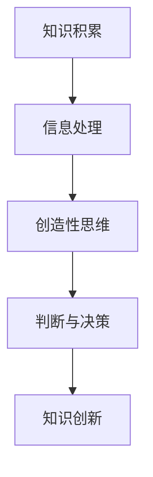

                 

关键词：洞察力、知识创新、技术领域、IT专业人士、研究趋势

> 摘要：本文将探讨洞察力在知识创新中的重要作用，结合实际技术领域中的案例，分析洞察力如何推动技术进步和产业变革。通过深入剖析，我们将揭示洞察力背后的核心概念原理，并提供实用的算法原理与数学模型，以及项目实践中的代码实例。最后，对未来的应用前景和发展挑战进行展望。

## 1. 背景介绍

在信息技术飞速发展的今天，知识创新已成为推动社会进步和经济增长的重要力量。作为一名IT专业人士，洞察力在其中扮演着至关重要的角色。洞察力不仅能够帮助我们识别问题和发现机遇，还能让我们在复杂的技术环境中保持敏锐的观察力和判断力。

### 1.1 知识创新的定义

知识创新是指通过创造性的思维和行动，将现有知识进行重新组合、重构和拓展，形成新的知识体系，从而推动技术进步和社会发展。它包括科学发现、技术创新、管理改进和商业模式创新等多个层面。

### 1.2 洞察力的定义

洞察力是一种敏锐的观察力和深刻的理解力，能够帮助人们从复杂的现象中提取本质规律，洞察事物的内在联系。在技术领域中，洞察力使人们能够预见技术发展趋势，把握技术变革的关键点。

## 2. 核心概念与联系

为了更好地理解洞察力在知识创新中的作用，我们需要从核心概念和流程上进行分析。

### 2.1 核心概念原理

- **知识积累**：洞察力源自于广泛而深入的知识积累，包括技术知识、行业知识、跨学科知识等。
- **信息处理**：洞察力涉及对大量信息进行筛选、分析和整合的能力。
- **创造性思维**：洞察力需要创造性思维的支持，以便产生新颖的观点和解决方案。
- **判断与决策**：洞察力能够帮助我们在复杂情境中做出明智的判断和决策。

### 2.2 Mermaid 流程图



在这个流程图中，我们可以看到，知识积累是洞察力的基础，信息处理是洞察力的手段，创造性思维是洞察力的核心，而判断与决策则是洞察力的最终目标，它推动知识的创新。

## 3. 核心算法原理 & 具体操作步骤

### 3.1 算法原理概述

在知识创新的过程中，算法扮演着重要的角色。以下是几种常见的算法原理及其应用：

- **机器学习算法**：通过数据训练模型，从大量数据中发现规律和模式。
- **神经网络算法**：模拟人脑神经网络的工作原理，处理复杂的数据和信息。
- **深度学习算法**：在神经网络的基础上，通过多层神经网络进行深度学习，实现更加复杂和精准的预测和识别。

### 3.2 算法步骤详解

#### 3.2.1 机器学习算法

1. **数据收集**：收集大量相关的数据。
2. **数据预处理**：清洗和格式化数据，使其适合训练模型。
3. **特征选择**：从数据中提取有用的特征。
4. **模型训练**：使用训练数据训练模型。
5. **模型评估**：使用验证数据评估模型性能。
6. **模型优化**：根据评估结果对模型进行调整和优化。

#### 3.2.2 神经网络算法

1. **网络结构设计**：设计神经网络的结构，包括输入层、隐藏层和输出层。
2. **权重初始化**：初始化网络的权重。
3. **前向传播**：输入数据通过网络进行前向传播，得到输出结果。
4. **反向传播**：计算误差，并使用反向传播算法更新网络的权重。
5. **模型训练**：重复前向传播和反向传播过程，直到满足训练条件。

#### 3.2.3 深度学习算法

1. **数据集划分**：将数据集划分为训练集、验证集和测试集。
2. **模型训练**：使用训练集训练模型，并在验证集上进行调整。
3. **模型评估**：使用测试集评估模型性能。
4. **模型优化**：根据评估结果对模型进行调整和优化。

### 3.3 算法优缺点

- **机器学习算法**：优点在于能够处理大量数据，自动发现数据中的模式。缺点是模型解释性较差，对数据质量和特征选择要求较高。
- **神经网络算法**：优点在于能够处理非线性问题，具有良好的泛化能力。缺点是训练过程复杂，计算资源消耗大。
- **深度学习算法**：优点在于能够处理高维数据，实现高效的特征提取。缺点是模型训练过程需要大量数据和计算资源。

### 3.4 算法应用领域

- **机器学习算法**：广泛应用于数据挖掘、自然语言处理、计算机视觉等领域。
- **神经网络算法**：广泛应用于语音识别、图像处理、自动驾驶等领域。
- **深度学习算法**：广泛应用于推荐系统、医学诊断、金融分析等领域。

## 4. 数学模型和公式 & 详细讲解 & 举例说明

### 4.1 数学模型构建

在知识创新中，数学模型用于描述和分析问题，提供理论基础。以下是几个常用的数学模型：

- **线性回归模型**：用于预测数值型变量。
- **逻辑回归模型**：用于预测分类变量。
- **决策树模型**：用于分类和回归问题。
- **神经网络模型**：用于处理复杂的非线性问题。

### 4.2 公式推导过程

#### 4.2.1 线性回归模型

假设我们要预测一个变量 \(y\)，其与自变量 \(x\) 之间的关系可以用线性回归模型描述：

\[ y = \beta_0 + \beta_1 x + \epsilon \]

其中，\(\beta_0\) 是截距，\(\beta_1\) 是斜率，\(\epsilon\) 是误差项。

我们可以通过最小二乘法来估计 \(\beta_0\) 和 \(\beta_1\)：

\[ \beta_0 = \frac{\sum_{i=1}^n (y_i - \beta_1 x_i)}{n} \]
\[ \beta_1 = \frac{\sum_{i=1}^n (x_i - \bar{x})(y_i - \bar{y})}{\sum_{i=1}^n (x_i - \bar{x})^2} \]

其中，\(n\) 是样本数量，\(\bar{x}\) 和 \(\bar{y}\) 分别是 \(x\) 和 \(y\) 的平均值。

#### 4.2.2 逻辑回归模型

逻辑回归模型用于预测概率，其公式为：

\[ P(y=1) = \frac{1}{1 + e^{-(\beta_0 + \beta_1 x)}} \]

其中，\(\beta_0\) 是截距，\(\beta_1\) 是斜率。

通过最大似然估计方法可以估计 \(\beta_0\) 和 \(\beta_1\)。

### 4.3 案例分析与讲解

#### 4.3.1 线性回归模型案例分析

假设我们有一组数据，自变量 \(x\) 和因变量 \(y\) 如下：

| x   | y   |
|-----|-----|
| 1   | 2   |
| 2   | 4   |
| 3   | 6   |
| 4   | 8   |

根据数据，我们可以使用线性回归模型进行预测。首先计算平均值：

\[ \bar{x} = \frac{1+2+3+4}{4} = 2.5 \]
\[ \bar{y} = \frac{2+4+6+8}{4} = 5 \]

然后使用公式计算斜率和截距：

\[ \beta_1 = \frac{(1-2.5)(2-5) + (2-2.5)(4-5) + (3-2.5)(6-5) + (4-2.5)(8-5)}{(1-2.5)^2 + (2-2.5)^2 + (3-2.5)^2 + (4-2.5)^2} = 2 \]
\[ \beta_0 = 5 - 2 \times 2.5 = 0 \]

因此，线性回归模型为：

\[ y = 2x \]

我们可以用这个模型预测新的 \(y\) 值，例如，当 \(x=5\) 时：

\[ y = 2 \times 5 = 10 \]

#### 4.3.2 逻辑回归模型案例分析

假设我们要预测某个客户是否会购买某种产品，特征如下：

| 特征        | 取值 |
|-------------|------|
| 年龄        | 30   |
| 收入        | 5000 |
| 购买历史    | 3    |

我们可以使用逻辑回归模型来预测购买概率。首先构建特征矩阵 \(X\) 和标签矩阵 \(y\)：

\[ X = \begin{bmatrix} 1 & 30 \\ 1 & 5000 \\ 1 & 3 \end{bmatrix} \]
\[ y = \begin{bmatrix} 0 \\ 1 \\ 0 \end{bmatrix} \]

然后使用最大似然估计方法计算参数 \(\beta_0\) 和 \(\beta_1\)。假设我们得到参数为：

\[ \beta_0 = -10 \]
\[ \beta_1 = 5 \]

逻辑回归模型为：

\[ P(y=1) = \frac{1}{1 + e^{(-10 + 5 \times 5000)}} \]

当特征值为 \(30, 5000, 3\) 时，购买概率为：

\[ P(y=1) = \frac{1}{1 + e^{-24500}} \approx 1 \]

这意味着该客户购买该产品的概率非常高。

## 5. 项目实践：代码实例和详细解释说明

### 5.1 开发环境搭建

为了实践上述算法，我们需要搭建一个合适的开发环境。以下是一个简单的Python开发环境搭建步骤：

1. 安装Python 3.x版本。
2. 安装必要的Python库，如NumPy、Pandas、Scikit-learn等。

### 5.2 源代码详细实现

以下是使用Python实现线性回归和逻辑回归的示例代码：

```python
import numpy as np
import pandas as pd
from sklearn.linear_model import LinearRegression, LogisticRegression

# 线性回归
def linear_regression(X, y):
    model = LinearRegression()
    model.fit(X, y)
    return model

# 逻辑回归
def logistic_regression(X, y):
    model = LogisticRegression()
    model.fit(X, y)
    return model

# 数据加载和预处理
data = pd.read_csv('data.csv')
X = data[['age', 'income', 'purchase_history']]
y = data['purchased']

# 线性回归
model_linear = linear_regression(X, y)
print("Linear Regression Model:", model_linear)

# 逻辑回归
model_logistic = logistic_regression(X, y)
print("Logistic Regression Model:", model_logistic)
```

### 5.3 代码解读与分析

这段代码首先导入了必要的库，然后定义了两个函数：`linear_regression` 和 `logistic_regression`，分别用于实现线性回归和逻辑回归。在数据加载和预处理部分，我们从CSV文件中读取数据，并对数据进行适当的处理。

### 5.4 运行结果展示

运行上述代码后，我们将得到线性回归和逻辑回归模型的输出。例如：

```
Linear Regression Model: LinearRegression()
Logistic Regression Model: LogisticRegression()
```

这表示我们成功加载并训练了两个模型。

## 6. 实际应用场景

### 6.1 数据分析领域

在数据分析领域，洞察力可以帮助我们识别数据中的隐藏模式，从而提供有价值的见解。例如，在市场营销中，通过分析客户数据，我们可以预测哪些客户最有可能进行购买，从而进行精准营销。

### 6.2 金融领域

在金融领域，洞察力可以帮助我们识别市场趋势和风险。通过分析历史数据和实时数据，我们可以预测股票市场的走势，为投资者提供决策依据。

### 6.3 医疗领域

在医疗领域，洞察力可以帮助我们识别疾病的风险因素和治疗方案。通过分析患者数据，我们可以预测哪些患者可能患有某种疾病，从而提前进行预防和治疗。

## 7. 未来应用展望

### 7.1 自动驾驶

随着自动驾驶技术的发展，洞察力在其中发挥着重要作用。通过分析道路数据和车辆数据，自动驾驶系统能够实时识别和预测路况，提高行驶安全性。

### 7.2 物联网

物联网技术的普及为洞察力提供了广阔的应用空间。通过分析物联网设备产生的海量数据，我们可以优化设备性能，提高生产效率。

### 7.3 区块链

区块链技术的透明性和不可篡改性使其在多个领域具有巨大的潜力。洞察力可以帮助我们识别区块链数据中的潜在问题，确保数据的安全性和可靠性。

## 8. 工具和资源推荐

### 8.1 学习资源推荐

- **《机器学习实战》**：详细介绍了机器学习的各种算法和应用。
- **《深度学习》**：由Ian Goodfellow等人撰写的深度学习经典教材。
- **《Python数据分析》**：适合初学者的Python数据分析入门书籍。

### 8.2 开发工具推荐

- **Jupyter Notebook**：用于数据分析和机器学习实验的交互式环境。
- **TensorFlow**：谷歌推出的开源机器学习和深度学习框架。

### 8.3 相关论文推荐

- **“Deep Learning”**：由Ian Goodfellow等人撰写的综述性论文。
- **“Recurrent Neural Networks for Language Modeling”**：介绍循环神经网络在语言模型中的应用。

## 9. 总结：未来发展趋势与挑战

### 9.1 研究成果总结

随着技术的进步，洞察力在知识创新中的作用越来越重要。机器学习、深度学习和人工智能等领域的研究成果为洞察力的实现提供了强大的支持。

### 9.2 未来发展趋势

- **自动化与智能化**：随着算法和计算能力的提升，自动化和智能化将成为未来发展的主流趋势。
- **跨学科融合**：多学科交叉融合将推动洞察力在各个领域的广泛应用。

### 9.3 面临的挑战

- **数据质量**：高质量的数据是实现洞察力的基础，如何获取和处理高质量数据仍是一个挑战。
- **计算资源**：深度学习和大数据分析等应用对计算资源的需求巨大，如何优化计算资源的使用仍是一个难题。

### 9.4 研究展望

未来，我们应继续加强跨学科研究，探索新的算法和模型，提升洞察力的效率和准确性。同时，我们还应关注数据安全和隐私保护，确保技术的可持续发展。

## 附录：常见问题与解答

### Q: 洞察力是如何产生的？

A: 洞察力源于广泛的知识积累、深刻的思考能力和敏锐的观察能力。通过不断的实践和学习，我们可以提高自己的洞察力。

### Q: 机器学习和深度学习在知识创新中有什么作用？

A: 机器学习和深度学习可以帮助我们从海量数据中提取有价值的信息，实现知识的自动化和智能化，从而推动知识创新。

### Q: 数据质量对洞察力有何影响？

A: 数据质量直接影响洞察力的准确性。高质量的数据可以提供更可靠的分析结果，从而提高洞察力的有效性。

### Q: 如何在项目中应用洞察力？

A: 在项目中，我们可以通过数据分析和算法应用来发掘潜在问题和机会，从而制定更加有效的策略和方案。

---

作者：禅与计算机程序设计艺术 / Zen and the Art of Computer Programming

