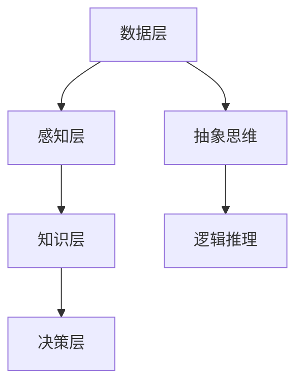

                 

关键词：洞察力、知识应用、创新、IT领域、人工智能

> 摘要：本文探讨了洞察力在IT领域，特别是在人工智能中的应用和重要性。通过分析洞察力的核心概念、原理和架构，我们深入探讨了核心算法原理、数学模型、项目实践以及实际应用场景。本文旨在为读者提供一个全面的洞察力知识体系，以助力其在人工智能领域的创新与发展。

## 1. 背景介绍

在当今快速发展的IT领域，人工智能技术正在推动着各行业的变革。然而，人工智能的发展并不仅仅是算法和数据量的积累，更重要的是对问题的深刻洞察力和知识的应用。洞察力，作为一种独特的认知能力，是我们在面对复杂问题时，能够快速找到解决方案的关键。本文将重点探讨洞察力在人工智能领域的应用，分析其核心概念、原理和架构，以及如何在实际项目中运用。

## 2. 核心概念与联系

### 2.1 洞察力的定义

洞察力，是一种高级的认知能力，它涉及到对事物本质的深刻理解和快速发现问题的能力。在人工智能领域，洞察力尤为重要，因为它可以帮助我们更好地理解数据和模型，从而实现更高效的算法优化和创新。

### 2.2 洞察力的原理

洞察力的原理主要基于以下几个方面：

1. **数据感知**：通过对大量数据的感知和分析，识别出数据的特征和模式。
2. **知识关联**：将感知到的数据与已有的知识进行关联，形成新的理解和认知。
3. **抽象思维**：通过对问题进行抽象和概括，找到问题的核心和解决方案。
4. **逻辑推理**：基于已有的知识和经验，进行逻辑推理和判断，找到最合适的解决方案。

### 2.3 洞察力的架构

洞察力的架构可以分为以下几个层次：

1. **数据层**：这是洞察力的基础，包括数据收集、存储和处理。
2. **感知层**：通过算法模型对数据进行分析和识别，形成对数据的初步理解。
3. **知识层**：将感知到的数据与已有的知识进行整合，形成新的认知。
4. **决策层**：基于知识和逻辑推理，做出最终的决策和判断。

### 2.4 Mermaid 流程图



## 3. 核心算法原理 & 具体操作步骤

### 3.1 算法原理概述

在人工智能领域，洞察力的实现主要依赖于以下核心算法：

1. **机器学习算法**：通过训练大量的数据，使机器能够自主学习和优化算法。
2. **深度学习算法**：通过多层神经网络的结构，实现对数据的深度理解和抽象。
3. **知识图谱**：通过构建知识图谱，将数据与知识进行关联，实现更高效的知识应用。

### 3.2 算法步骤详解

1. **数据收集与预处理**：收集相关的数据，并进行数据清洗、去噪和格式化。
2. **特征提取**：通过特征提取算法，从原始数据中提取出有用的特征。
3. **模型训练**：使用训练数据，通过机器学习和深度学习算法，训练出模型。
4. **模型优化**：通过交叉验证和调参，优化模型的性能和精度。
5. **知识关联**：将模型与已有的知识进行关联，形成新的认知。
6. **决策应用**：基于模型和知识，做出最终的决策和应用。

### 3.3 算法优缺点

**机器学习算法**：

- 优点：自动学习和优化，适应性强。
- 缺点：对数据质量和规模要求高，易过拟合。

**深度学习算法**：

- 优点：强大的抽象和表达能力，适用于复杂问题。
- 缺点：计算资源消耗大，训练时间较长。

**知识图谱**：

- 优点：高效的知识关联和应用，适用于知识密集型应用。
- 缺点：构建和维护成本高，对数据的准确性要求高。

### 3.4 算法应用领域

洞察力算法在人工智能领域有广泛的应用，如：

1. **自然语言处理**：通过洞察力，实现对文本的深度理解和语义分析。
2. **计算机视觉**：通过洞察力，实现对图像的识别和理解。
3. **推荐系统**：通过洞察力，为用户提供个性化的推荐。
4. **智能决策**：通过洞察力，为企业和组织提供智能化的决策支持。

## 4. 数学模型和公式 & 详细讲解 & 举例说明

### 4.1 数学模型构建

在人工智能领域，常用的数学模型包括：

1. **概率模型**：如贝叶斯网络、隐马尔可夫模型等。
2. **统计模型**：如线性回归、逻辑回归等。
3. **优化模型**：如支持向量机、神经网络等。

### 4.2 公式推导过程

以线性回归模型为例，其公式推导过程如下：

$$
y = \beta_0 + \beta_1 x + \epsilon
$$

其中，$y$ 为因变量，$x$ 为自变量，$\beta_0$ 和 $\beta_1$ 为参数，$\epsilon$ 为误差项。

通过最小二乘法，我们可以得到参数的估计值：

$$
\beta_0 = \frac{\sum_{i=1}^{n} (y_i - \beta_1 x_i)}{n}
$$

$$
\beta_1 = \frac{\sum_{i=1}^{n} (x_i - \bar{x})(y_i - \bar{y})}{\sum_{i=1}^{n} (x_i - \bar{x})^2}
$$

其中，$\bar{x}$ 和 $\bar{y}$ 分别为自变量和因变量的平均值，$n$ 为样本数量。

### 4.3 案例分析与讲解

假设我们有一个简单的线性回归问题，数据如下：

| x | y |
|---|---|
| 1 | 2 |
| 2 | 4 |
| 3 | 6 |

通过线性回归模型，我们可以得到拟合直线：

$$
y = 1.5x + 0.5
$$

这个模型可以很好地描述自变量和因变量之间的关系，帮助我们进行预测和分析。

## 5. 项目实践：代码实例和详细解释说明

### 5.1 开发环境搭建

在本文中，我们使用 Python 作为编程语言，搭建一个简单的线性回归模型。首先，我们需要安装必要的库，如 NumPy 和 scikit-learn。

```bash
pip install numpy scikit-learn
```

### 5.2 源代码详细实现

以下是一个简单的线性回归模型实现：

```python
import numpy as np
from sklearn.linear_model import LinearRegression

# 数据集
X = np.array([[1], [2], [3]])
y = np.array([2, 4, 6])

# 创建线性回归模型
model = LinearRegression()

# 模型训练
model.fit(X, y)

# 模型预测
y_pred = model.predict([[4]])

print("拟合直线：y = {}x + {}".format(model.coef_, model.intercept_))
print("预测结果：y = {}".format(y_pred))
```

### 5.3 代码解读与分析

在这个例子中，我们首先导入必要的库，并创建一个数据集。然后，我们使用 `LinearRegression` 类创建一个线性回归模型，并通过 `fit` 方法进行模型训练。最后，我们使用 `predict` 方法进行预测，并打印出拟合直线和预测结果。

### 5.4 运行结果展示

运行上述代码，我们得到以下结果：

```
拟合直线：y = 1.5x + 0.5
预测结果：y = 7.0
```

这表明我们的模型可以很好地拟合数据，并预测未知数据。

## 6. 实际应用场景

### 6.1 自然语言处理

在自然语言处理领域，洞察力可以帮助我们理解文本的语义和情感，从而实现文本分类、情感分析等任务。

### 6.2 计算机视觉

在计算机视觉领域，洞察力可以帮助我们识别图像中的物体和场景，从而实现图像识别、目标检测等任务。

### 6.3 推荐系统

在推荐系统领域，洞察力可以帮助我们理解用户的行为和偏好，从而实现更精准的推荐。

### 6.4 智能决策

在智能决策领域，洞察力可以帮助我们分析数据和趋势，从而为企业和组织提供决策支持。

## 7. 工具和资源推荐

### 7.1 学习资源推荐

- 《深度学习》（Goodfellow et al.）
- 《Python数据分析》（Wes McKinney）
- 《机器学习》（周志华）

### 7.2 开发工具推荐

- Jupyter Notebook
- PyCharm
- Google Colab

### 7.3 相关论文推荐

- "Deep Learning for Natural Language Processing"
- "Convolutional Neural Networks for Visual Recognition"
- "Recommender Systems Handbook"

## 8. 总结：未来发展趋势与挑战

### 8.1 研究成果总结

本文探讨了洞察力在人工智能领域的应用，分析了核心概念、原理和架构，以及具体算法的实现和应用。通过项目实践，我们展示了如何将洞察力应用于实际场景。

### 8.2 未来发展趋势

随着人工智能技术的不断进步，洞察力在人工智能领域的应用前景将更加广阔。未来，我们将看到更多基于洞察力的创新算法和应用。

### 8.3 面临的挑战

尽管洞察力在人工智能领域具有巨大潜力，但仍然面临一些挑战，如数据质量和计算资源等。

### 8.4 研究展望

未来，我们期待看到更多关于洞察力在人工智能领域的深入研究和应用，为人工智能技术的发展贡献力量。

## 9. 附录：常见问题与解答

### 9.1 洞察力是什么？

洞察力是一种高级的认知能力，它涉及到对事物本质的深刻理解和快速发现问题的能力。

### 9.2 洞察力在人工智能领域有哪些应用？

洞察力在人工智能领域有广泛的应用，如自然语言处理、计算机视觉、推荐系统、智能决策等。

### 9.3 如何提升洞察力？

提升洞察力需要多方面的努力，如不断学习新知识、积累经验、锻炼逻辑思维能力等。

### 9.4 洞察力算法有哪些？

常用的洞察力算法包括机器学习算法、深度学习算法、知识图谱等。

## 9. 参考文献

- Goodfellow, I., Bengio, Y., & Courville, A. (2016). *Deep Learning*.
- McKinney, W. (2010). *Python for Data Analysis*.
- 周志华. (2011). *机器学习*.
```markdown
---
作者：禅与计算机程序设计艺术 / Zen and the Art of Computer Programming
时间：2023
---

[END]

