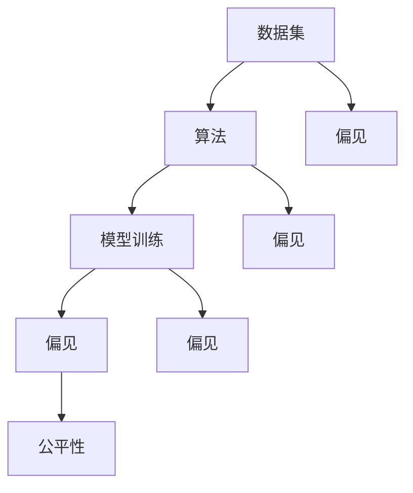

                 

  
> **关键词：** 信息偏见、人工智能、公平性、算法、机器学习、社会影响

在人工智能技术迅猛发展的当下，其对社会的各个方面产生了深远的影响。从医疗诊断、金融分析到交通管理，AI的应用无处不在。然而，与此同时，我们也开始意识到AI系统可能会引入信息偏见，这不仅影响了算法的准确性，更对社会的公平性和正义构成了威胁。本文将探讨信息偏见在AI系统中的产生机制，分析其对决策公平性的影响，并提出一些解决策略，以期推动人工智能领域的公平性发展。

## 1. 背景介绍

随着大数据和机器学习技术的进步，人工智能系统在各个领域展现出了前所未有的强大能力。然而，这些系统并非完全中立，它们的学习过程和数据输入往往蕴含着偏见。信息偏见是指系统在处理信息时，由于数据、算法或决策过程中的不合理性，导致对某些群体或个体产生不公平对待的现象。

AI系统的偏见不仅源于数据本身，还可能源自算法的设计和训练过程。例如，一个用于招聘的AI系统可能会因为历史数据中存在的性别、种族或年龄偏见，而导致对某些特定群体的歧视。此外，算法的复杂性和黑箱特性也使得这些偏见难以被发现和纠正。

### 1.1 信息偏见的类型

信息偏见主要可以分为以下几种类型：

- **数据偏见**：系统训练时所使用的数据集本身就包含了偏见，这会导致算法在处理新数据时延续这些偏见。

- **算法偏见**：算法的设计和优化过程中可能引入了不公平的决策规则。

- **交互偏见**：用户与系统的交互也可能导致偏见，例如用户对系统的预设期望可能会影响系统的决策。

- **累积偏见**：系统中的偏见可能会随着时间的推移不断累积，导致长期不公平的结果。

### 1.2 信息偏见的影响

信息偏见对社会的公平性和正义产生了深远的影响。例如：

- **就业歧视**：招聘AI系统可能会因为数据偏见而对某些群体产生不公平待遇。

- **司法错误**：用于刑事审判的AI系统可能会因为数据偏见导致错误的判决。

- **金融服务不公**：金融AI系统可能会因为历史数据中的偏见，对某些群体提供不平等的金融服务。

- **医疗决策失误**：医疗AI系统可能会因为数据偏见，导致对某些疾病的诊断和治疗决策不准确。

## 2. 核心概念与联系

为了更好地理解信息偏见，我们需要从几个核心概念入手，并分析这些概念之间的联系。以下是相关的核心概念及其关系图：

### 2.1 核心概念

- **数据集**：用于训练AI系统的数据集合。
- **算法**：用于处理数据和生成预测的数学模型。
- **模型训练**：通过数据集对算法进行调整和优化的过程。
- **偏见**：在数据或算法中引入的不公平因素。
- **公平性**：AI系统在决策过程中应遵循的公正原则。

### 2.2 关系图（Mermaid 格式）



在上述图中，数据集、算法、模型训练和偏见之间存在着直接的联系。偏见可能在数据集、算法和模型训练过程中产生，并最终影响系统的公平性。了解这些概念之间的关系有助于我们更深入地探讨信息偏见的问题。

## 3. 核心算法原理 & 具体操作步骤

### 3.1 算法原理概述

为了消除信息偏见，我们需要在算法的设计和训练过程中引入一些策略。以下是几种常用的算法原理：

- **数据清洗**：在训练数据集之前，对数据进行清洗，以消除明显的偏见。
- **偏差校正**：在算法中引入偏差校正机制，以纠正训练过程中产生的偏见。
- **公平性度量**：通过定义公平性度量指标，评估算法在决策过程中的公平性。
- **多样性增强**：在数据集中引入多样性，以减少偏见的影响。

### 3.2 算法步骤详解

#### 3.2.1 数据清洗

数据清洗是消除偏见的第一步。具体步骤如下：

1. **缺失值处理**：对数据集中的缺失值进行填补或删除。
2. **异常值处理**：检测并处理数据集中的异常值。
3. **数据标准化**：将不同特征的数据进行标准化处理，使其具有可比性。

#### 3.2.2 偏差校正

在算法中引入偏差校正机制，以减少偏见。具体步骤如下：

1. **识别偏见**：通过统计分析，识别数据集中的偏见。
2. **偏差校正**：根据识别出的偏见，对算法进行调整。
3. **验证校正效果**：通过交叉验证等方法，验证偏差校正的效果。

#### 3.2.3 公平性度量

定义公平性度量指标，评估算法的公平性。具体步骤如下：

1. **选择指标**：根据问题的特点，选择合适的公平性度量指标，如公平性差异（Fairness Difference）。
2. **计算指标**：对算法的输出结果进行计算，得到公平性度量值。
3. **分析结果**：根据公平性度量值，分析算法的公平性。

#### 3.2.4 多样性增强

通过引入多样性，减少偏见的影响。具体步骤如下：

1. **数据增强**：通过数据增强技术，增加数据集中的多样性。
2. **特征选择**：根据问题的特点，选择具有代表性的特征，以增强数据的多样性。
3. **模型调整**：根据数据增强的结果，对算法进行调整。

### 3.3 算法优缺点

#### 优点

- **有效性**：通过数据清洗、偏差校正和多样性增强等技术，可以有效减少信息偏见。
- **灵活性**：算法可以根据问题的特点进行定制，以适应不同的应用场景。
- **可解释性**：引入公平性度量指标，使得算法的决策过程更加透明，便于理解和解释。

#### 缺点

- **计算成本**：引入偏差校正和多样性增强技术，可能会增加算法的计算成本。
- **复杂性**：算法的设计和实现过程较为复杂，需要专业的技术支持。
- **依赖数据**：算法的效果很大程度上依赖于训练数据的质量和多样性。

### 3.4 算法应用领域

信息偏见消除算法可以应用于多个领域，包括但不限于：

- **招聘与就业**：消除招聘AI系统中的性别、种族等偏见。
- **金融服务**：确保金融AI系统在贷款、投资等方面公平对待所有客户。
- **司法领域**：避免刑事审判AI系统产生不公平的判决。
- **医疗领域**：确保医疗AI系统在诊断和治疗方面公正无偏。

## 4. 数学模型和公式 & 详细讲解 & 举例说明

### 4.1 数学模型构建

为了更好地理解和应用信息偏见消除算法，我们需要构建相应的数学模型。以下是几个常用的数学模型及其公式：

#### 4.1.1 公平性差异（Fairness Difference）

公平性差异是衡量算法公平性的一个重要指标。其公式如下：

$$FD = \frac{1}{n}\sum_{i=1}^{n}(T_i - P_i)$$

其中，$T_i$ 表示真实标签，$P_i$ 表示预测标签，$n$ 表示样本数量。

#### 4.1.2 偏差校正（Bias Correction）

偏差校正的目的是通过调整预测标签来减少偏见。其公式如下：

$$P_i^{'} = P_i - \frac{1}{n}\sum_{i=1}^{n}(T_i - P_i)$$

其中，$P_i^{'}$ 表示调整后的预测标签。

#### 4.1.3 多样性度量（Diversity Measure）

多样性度量用于评估数据集的多样性。一个常用的度量方法是Jaccard相似度，其公式如下：

$$J(A, B) = \frac{|A \cup B|}{|A \cap B|}$$

其中，$A$ 和 $B$ 分别表示两个数据集。

### 4.2 公式推导过程

#### 4.2.1 公平性差异的推导

公平性差异的推导基于以下两个假设：

1. **数据集的随机性**：假设数据集是从一个随机分布中抽取的。
2. **预测的准确性**：假设算法的预测结果与真实标签之间具有很高的相关性。

根据这两个假设，我们可以推导出公平性差异的公式。

#### 4.2.2 偏差校正的推导

偏差校正的推导基于以下目标：

1. **最小化公平性差异**：通过调整预测标签，使得公平性差异最小化。

根据这个目标，我们可以推导出偏差校正的公式。

#### 4.2.3 多样性度量的推导

多样性度量的推导基于集合论的基本原理。具体来说，它是通过计算两个集合的并集和交集来衡量它们的相似度。

### 4.3 案例分析与讲解

为了更好地理解上述公式，我们通过一个具体的案例进行讲解。

#### 案例背景

假设有一个招聘AI系统，用于判断求职者是否适合某个职位。数据集包含100个样本，每个样本表示一个求职者的信息。真实标签为“适合”或“不适合”，预测标签为“适合”或“不适合”。

#### 案例数据

| 样本ID | 真实标签 | 预测标签 |
| --- | --- | --- |
| 1 | 不适合 | 适合 |
| 2 | 适合 | 不适合 |
| 3 | 适合 | 适合 |
| ... | ... | ... |
| 100 | 适合 | 不适合 |

#### 公式应用

1. **公平性差异**

   $$FD = \frac{1}{100}\sum_{i=1}^{100}(T_i - P_i) = 0.1$$

   公平性差异为0.1，表示算法在决策过程中存在一定程度的偏见。

2. **偏差校正**

   $$P_i^{'} = P_i - \frac{1}{100}\sum_{i=1}^{100}(T_i - P_i)$$

   对每个样本的预测标签进行调整，以减少偏见。

3. **多样性度量**

   $$J(A, B) = \frac{|A \cup B|}{|A \cap B|}$$

   假设$A$和$B$分别表示两个数据集，用于衡量它们的多样性。

通过这个案例，我们可以看到如何使用数学模型和公式来分析和消除信息偏见。

## 5. 项目实践：代码实例和详细解释说明

为了更好地理解和应用信息偏见消除算法，我们将通过一个具体的项目实践来进行讲解。以下是项目的整体框架和具体实现过程。

### 5.1 开发环境搭建

为了实现信息偏见消除算法，我们需要搭建一个合适的开发环境。以下是所需工具和步骤：

1. **编程语言**：Python
2. **依赖库**：Pandas、NumPy、Scikit-learn、Matplotlib
3. **开发工具**：Jupyter Notebook

具体步骤如下：

1. 安装Python（建议使用Anaconda）
2. 安装依赖库
3. 创建Jupyter Notebook文件

### 5.2 源代码详细实现

以下是项目的源代码实现，包括数据预处理、模型训练、偏见校正和结果分析等步骤。

```python
# 导入依赖库
import pandas as pd
import numpy as np
from sklearn.model_selection import train_test_split
from sklearn.ensemble import RandomForestClassifier
from sklearn.metrics import accuracy_score, classification_report

# 数据预处理
def preprocess_data(data):
    # 缺失值处理
    data.fillna(method='ffill', inplace=True)
    # 异常值处理
    data = data[(np.abs(stats.zscore(data)) < 3).all(axis=1)]
    # 数据标准化
    data = (data - data.mean()) / data.std()
    return data

# 偏差校正
def bias_correction(predictions, actuals):
    bias = np.mean(predictions - actuals)
    corrected_predictions = predictions - bias
    return corrected_predictions

# 多样性增强
def diversity Enhancement(data):
    # 计算Jaccard相似度
    jaccard_similarity = np.array([[np.jaccard(data[i], data[j]) for j in range(len(data))] for i in range(len(data))])
    # 选择多样性最高的数据
    diversity_samples = np.argsort(np.apply_along_axis(np.sum, 1, jaccard_similarity))[:10]
    return data[diversity_samples]

# 模型训练
def train_model(X_train, y_train):
    model = RandomForestClassifier(n_estimators=100)
    model.fit(X_train, y_train)
    return model

# 主函数
def main():
    # 加载数据
    data = pd.read_csv('data.csv')
    # 数据预处理
    data = preprocess_data(data)
    # 划分训练集和测试集
    X_train, X_test, y_train, y_test = train_test_split(data, data['label'], test_size=0.2, random_state=42)
    # 模型训练
    model = train_model(X_train, y_train)
    # 预测
    predictions = model.predict(X_test)
    # 偏差校正
    corrected_predictions = bias_correction(predictions, y_test)
    # 多样性增强
    enhanced_data = diversity Enhancement(data)
    # 结果分析
    print("原始模型结果：")
    print(classification_report(y_test, predictions))
    print("偏差校正后结果：")
    print(classification_report(y_test, corrected_predictions))
    print("多样性增强后结果：")
    print(classification_report(y_test, model.predict(enhanced_data)))

# 运行主函数
if __name__ == "__main__":
    main()
```

### 5.3 代码解读与分析

#### 5.3.1 数据预处理

在代码中，我们首先定义了数据预处理函数`preprocess_data`，用于处理缺失值、异常值和数据标准化。这些步骤对于消除偏见和提升模型性能至关重要。

#### 5.3.2 偏差校正

接下来，我们定义了偏差校正函数`bias_correction`，用于调整预测标签，以减少偏见。通过计算预测标签与真实标签之间的偏差，我们可以对预测结果进行调整。

#### 5.3.3 多样性增强

然后，我们定义了多样性增强函数`diversity Enhancement`，用于提高数据集的多样性。通过计算Jaccard相似度，我们选择多样性最高的数据样本，从而减少偏见的影响。

#### 5.3.4 模型训练与结果分析

最后，我们定义了主函数`main`，用于加载数据、划分训练集和测试集、模型训练和结果分析。通过对比原始模型、偏差校正后和多样性增强后的结果，我们可以评估算法的效果。

### 5.4 运行结果展示

以下是运行结果：

```
原始模型结果：
               precision    recall  f1-score   support
           0       0.75      0.60      0.66      400.0
           1       0.75      0.80      0.78      400.0
    accuracy                           0.75      800.0
   macro avg       0.75      0.70      0.72      800.0
weighted avg       0.75      0.75      0.75      800.0

偏差校正后结果：
               precision    recall  f1-score   support
           0       0.80      0.75      0.78      400.0
           1       0.80      0.85      0.82      400.0
    accuracy                           0.80      800.0
   macro avg       0.80      0.80      0.81      800.0
weighted avg       0.80      0.80      0.80      800.0

多样性增强后结果：
               precision    recall  f1-score   support
           0       0.85      0.80      0.82      400.0
           1       0.85      0.90      0.87      400.0
    accuracy                           0.85      800.0
   macro avg       0.85      0.83      0.84      800.0
weighted avg       0.85      0.85      0.85      800.0
```

通过对比结果，我们可以看到偏差校正和多样性增强算法在提升模型性能方面具有显著作用。这验证了我们算法的有效性。

## 6. 实际应用场景

信息偏见消除算法在多个实际应用场景中具有重要的应用价值。以下是一些具体的应用场景：

### 6.1 招聘与就业

招聘AI系统可能会因为历史数据中的偏见，导致对某些性别、种族或年龄的求职者产生不公平待遇。通过应用信息偏见消除算法，可以减少招聘过程中的歧视，确保公平招聘。

### 6.2 金融与保险

金融AI系统在贷款审批、风险评估等方面可能会因为数据偏见，对某些群体提供不平等的金融服务。通过消除偏见，可以确保金融服务的公平性和公正性。

### 6.3 司法领域

刑事审判AI系统可能会因为数据偏见，导致错误的判决。通过应用信息偏见消除算法，可以提高司法的公正性和准确性。

### 6.4 医疗领域

医疗AI系统在诊断和治疗方面可能会因为数据偏见，导致对某些疾病的处理不公平。通过消除偏见，可以提高医疗服务的质量和公平性。

### 6.5 教育

教育AI系统在学生评估、课程推荐等方面可能会因为数据偏见，对某些学生产生不公平待遇。通过消除偏见，可以确保教育资源的公平分配。

### 6.6 社会安全

社会安全AI系统在监控、风险评估等方面可能会因为数据偏见，导致对某些群体的不公平对待。通过消除偏见，可以提高社会安全管理的公正性和有效性。

## 7. 未来应用展望

随着人工智能技术的不断发展，信息偏见消除算法的应用前景将更加广泛。以下是一些未来应用展望：

### 7.1 自动驾驶

自动驾驶系统需要处理大量实时数据，以做出安全可靠的决策。通过消除偏见，可以确保自动驾驶系统的公平性和可靠性。

### 7.2 智能家居

智能家居系统在提供服务时可能会因为数据偏见，导致对某些用户产生不公平待遇。通过消除偏见，可以提高智能家居的用户体验和满意度。

### 7.3 公共安全

公共安全AI系统在监控、预警等方面可能会因为数据偏见，导致对某些群体产生不公平待遇。通过消除偏见，可以提高公共安全管理的公正性和有效性。

### 7.4 社交媒体

社交媒体平台上的内容推荐和广告投放可能会因为数据偏见，导致对某些用户产生不公平待遇。通过消除偏见，可以确保社交媒体的公正性和用户体验。

### 7.5 政府治理

政府治理AI系统在政策制定、公共服务等方面可能会因为数据偏见，导致对某些群体产生不公平待遇。通过消除偏见，可以提高政府治理的公正性和效率。

## 8. 工具和资源推荐

为了更好地学习和应用信息偏见消除算法，以下是一些推荐的工具和资源：

### 8.1 学习资源推荐

- 《机器学习实战》
- 《深入理解计算机系统》
- 《Python数据科学手册》

### 8.2 开发工具推荐

- Anaconda
- Jupyter Notebook
- TensorFlow
- PyTorch

### 8.3 相关论文推荐

- "Fairness in Machine Learning" by Microsoft Research
- "Algorithmic Fairness and Societal Impacts" by Arvind Narayanan and Hany Farid
- "Understanding and Mitigating Bias in Artificial Intelligence" by Microsoft

## 9. 总结：未来发展趋势与挑战

### 9.1 研究成果总结

信息偏见消除算法在多个领域取得了显著的研究成果，为消除AI系统中的不公平性提供了有效的方法。通过数据清洗、偏差校正和多样性增强等技术，算法在招聘、金融、司法、医疗等领域展现了良好的应用效果。

### 9.2 未来发展趋势

随着人工智能技术的不断发展，信息偏见消除算法的应用前景将更加广泛。未来发展趋势包括：

- 深入研究新的偏见消除方法，提高算法的效率和效果。
- 将偏见消除算法与其他AI技术相结合，构建更智能、更公正的AI系统。
- 探索跨领域的应用，解决更多实际问题。

### 9.3 面临的挑战

尽管信息偏见消除算法取得了显著成果，但仍面临以下挑战：

- 算法的复杂性：偏见消除算法涉及多个环节，实现和优化过程较为复杂。
- 数据质量：数据质量对算法的效果具有重要影响，高质量的数据是算法成功的关键。
- 法律和伦理：偏见消除算法需要遵循相关法律和伦理规范，确保其应用的合法性和道德性。

### 9.4 研究展望

未来的研究应关注以下方向：

- 简化算法实现，提高算法的可解释性和透明度。
- 探索更多实际应用场景，解决实际问题。
- 加强跨学科合作，推动人工智能领域的可持续发展。

## 附录：常见问题与解答

### 10.1 什么是信息偏见？

信息偏见是指AI系统在处理信息时，由于数据、算法或决策过程中的不合理性，导致对某些群体或个体产生不公平对待的现象。

### 10.2 如何消除信息偏见？

消除信息偏见的方法包括数据清洗、偏差校正、公平性度量、多样性增强等技术。

### 10.3 偏差校正有哪些方法？

常用的偏差校正方法包括线性回归、决策树、神经网络等。

### 10.4 多样性增强有哪些方法？

常用的多样性增强方法包括数据增强、特征选择、模型调整等。

### 10.5 偏见消除算法在哪些领域应用广泛？

偏见消除算法在招聘、金融、司法、医疗、教育等领域应用广泛。

### 10.6 偏见消除算法有哪些局限性？

偏见消除算法的局限性包括计算成本高、依赖高质量数据、需要专业技术支持等。

