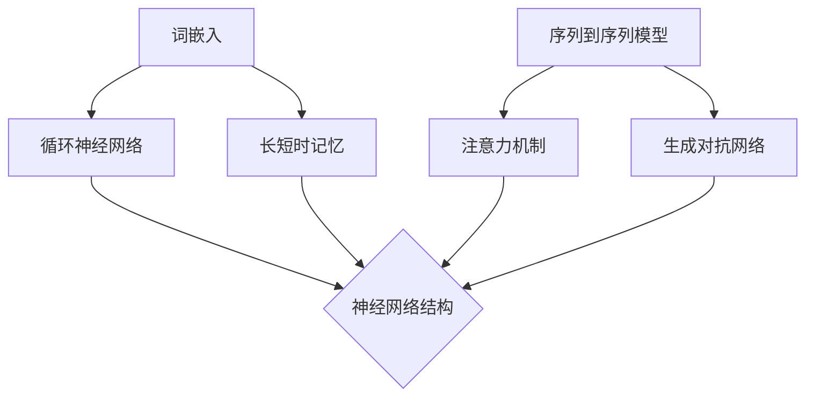

                 

关键词：语言理解、自然语言生成、机器学习、神经网络、人工智能

> 摘要：本文深入探讨了人工智能领域的两个关键任务——语言理解与自然语言生成。首先，我们将回顾语言理解的背景和重要性，接着介绍自然语言生成的技术原理及其发展历程。随后，文章将详细解析这两个任务的核心算法原理和数学模型，并通过实际项目实践来展示如何实现这些算法。最后，我们将讨论语言理解与生成在实际应用中的场景和未来展望，并提出相关工具和资源的推荐。

## 1. 背景介绍

### 语言理解

语言理解是指计算机能够理解和处理人类自然语言的过程。这一任务在人类日常生活中非常常见，但让计算机完成这一任务却充满了挑战。语言本身具有高度抽象性和歧义性，且涉及广泛的上下文背景。因此，语言理解是实现自然交互、智能问答、文本摘要等任务的基础。

### 自然语言生成

自然语言生成（Natural Language Generation，NLG）是指计算机生成人类语言的过程。这一任务在现代人工智能中具有重要应用价值，例如自动新闻写作、语音助手对话、虚拟客服等。随着机器学习技术的不断发展，NLG已经成为自然语言处理领域的研究热点。

## 2. 核心概念与联系

为了更好地理解语言理解和自然语言生成，我们首先需要了解它们背后的核心概念和技术架构。

### 语言理解的核心概念

1. **词嵌入（Word Embedding）**：词嵌入是将词汇映射到低维连续向量空间的过程。通过这种方式，计算机可以更有效地处理和比较词汇。
2. **循环神经网络（RNN）**：RNN 是一种能够处理序列数据的人工神经网络，其内部状态能够在序列的不同时间点传递信息。
3. **长短时记忆（LSTM）**：LSTM 是 RNN 的一个变体，能够有效地避免梯度消失问题，在处理长序列数据时表现更优。

### 自然语言生成的核心概念

1. **序列到序列模型（Seq2Seq）**：Seq2Seq 模型是一种基于 RNN 的结构，用于将一个序列映射到另一个序列。在 NLG 中，Seq2Seq 模型被广泛应用于机器翻译、对话生成等任务。
2. **注意力机制（Attention Mechanism）**：注意力机制是一种能够使模型在生成序列时关注重要信息的技术。它显著提高了 NLG 的质量和效率。
3. **生成对抗网络（GAN）**：GAN 是一种基于博弈论的思想，通过生成器和判别器的对抗训练来实现高质量的数据生成。在 NLG 中，GAN 被用于生成多样化的文本。

### 核心概念与联系

下面是一个使用 Mermaid 画出的 Mermaid 流程图，展示了语言理解与自然语言生成的核心概念及其联系。



## 3. 核心算法原理 & 具体操作步骤

### 3.1 算法原理概述

#### 语言理解

语言理解的核心算法是循环神经网络（RNN）。RNN 通过其内部状态在序列的不同时间点传递信息，从而能够处理和理解自然语言。具体来说，RNN 通过以下步骤实现语言理解：

1. **输入表示**：将文本序列转换为词嵌入向量。
2. **序列处理**：通过 RNN 逐步处理词嵌入向量，更新内部状态。
3. **输出生成**：根据最终状态生成语义表示。

#### 自然语言生成

自然语言生成的核心算法是序列到序列（Seq2Seq）模型。Seq2Seq 模型通过以下步骤实现自然语言生成：

1. **输入序列编码**：将输入文本序列编码为隐藏状态。
2. **解码**：通过 RNN 逐步解码隐藏状态，生成输出序列。
3. **注意力机制**：在解码过程中，注意力机制使模型能够关注输入序列中的关键信息。

### 3.2 算法步骤详解

#### 语言理解

1. **词嵌入**：将文本序列中的每个词转换为向量。可以使用预训练的词向量（如 Word2Vec、GloVe）或自行训练的词向量。
2. **RNN 处理**：通过 RNN 逐词处理词嵌入向量，更新内部状态。
3. **语义表示**：根据最终状态生成语义表示。

#### 自然语言生成

1. **输入编码**：将输入文本序列编码为隐藏状态。可以使用编码器（Encoder）部分。
2. **解码**：通过 RNN 逐步解码隐藏状态，生成输出序列。可以使用解码器（Decoder）部分。
3. **注意力机制**：在解码过程中，注意力机制使模型能够关注输入序列中的关键信息。

### 3.3 算法优缺点

#### 语言理解

**优点**：
- 能够处理变长的输入序列。
- 能够捕获长距离依赖关系。

**缺点**：
- 容易出现梯度消失问题。
- 在长序列处理时性能下降。

#### 自然语言生成

**优点**：
- 能够生成多样化、连贯的文本。
- 能够处理变长的输出序列。

**缺点**：
- 训练过程复杂，需要大量计算资源。
- 容易产生不必要的冗余信息。

### 3.4 算法应用领域

#### 语言理解

- 智能问答系统
- 文本摘要
- 语言翻译

#### 自然语言生成

- 自动新闻写作
- 虚拟客服
- 对话系统

## 4. 数学模型和公式 & 详细讲解 & 举例说明

### 4.1 数学模型构建

#### 语言理解

假设我们有一个语言理解模型，输入是一个长度为 $T$ 的文本序列 $X = (x_1, x_2, ..., x_T)$，输出是一个语义表示 $H$。

输入向量表示为 $x_i \in \mathbb{R}^d$，其中 $d$ 是词嵌入的维度。使用 RNN 进行处理，状态更新方程如下：

$$ h_t = \text{activation}(W_h \cdot [h_{t-1}, x_t] + b_h) $$

其中，$h_t$ 是 RNN 在时间步 $t$ 的状态，$W_h$ 和 $b_h$ 分别是权重和偏置。

最终状态 $h_T$ 被用来生成语义表示：

$$ H = \text{activation}(W_H \cdot h_T + b_H) $$

#### 自然语言生成

假设我们有一个自然语言生成模型，输入是一个长度为 $T$ 的文本序列 $X = (x_1, x_2, ..., x_T)$，输出是一个长度为 $S$ 的文本序列 $Y = (y_1, y_2, ..., y_S)$。

使用 Seq2Seq 模型进行生成，编码器（Encoder）和解码器（Decoder）分别表示为 $E$ 和 $D$。

编码器输出隐藏状态序列：

$$ h_t = E \cdot x_t $$

解码器使用注意力机制进行解码：

$$ y_t = D \cdot \text{attention}(h_t, h_{<t}) $$

其中，$\text{attention}$ 函数用于计算注意力权重。

### 4.2 公式推导过程

#### 语言理解

假设我们有一个语言理解模型，输入是一个长度为 $T$ 的文本序列 $X = (x_1, x_2, ..., x_T)$，输出是一个语义表示 $H$。

输入向量表示为 $x_i \in \mathbb{R}^d$，其中 $d$ 是词嵌入的维度。使用 RNN 进行处理，状态更新方程如下：

$$ h_t = \text{activation}(W_h \cdot [h_{t-1}, x_t] + b_h) $$

其中，$h_t$ 是 RNN 在时间步 $t$ 的状态，$W_h$ 和 $b_h$ 分别是权重和偏置。

最终状态 $h_T$ 被用来生成语义表示：

$$ H = \text{activation}(W_H \cdot h_T + b_H) $$

#### 自然语言生成

假设我们有一个自然语言生成模型，输入是一个长度为 $T$ 的文本序列 $X = (x_1, x_2, ..., x_T)$，输出是一个长度为 $S$ 的文本序列 $Y = (y_1, y_2, ..., y_S)$。

使用 Seq2Seq 模型进行生成，编码器（Encoder）和解码器（Decoder）分别表示为 $E$ 和 $D$。

编码器输出隐藏状态序列：

$$ h_t = E \cdot x_t $$

解码器使用注意力机制进行解码：

$$ y_t = D \cdot \text{attention}(h_t, h_{<t}) $$

其中，$\text{attention}$ 函数用于计算注意力权重。

### 4.3 案例分析与讲解

#### 语言理解

假设我们有一个句子 "The quick brown fox jumps over the lazy dog"，我们想要理解这个句子的语义。

1. **词嵌入**：首先，我们将句子中的每个词转换为词嵌入向量。例如，"quick" 的词嵌入向量表示为 $q \in \mathbb{R}^d$。
2. **RNN 处理**：然后，我们使用 RNN 逐词处理词嵌入向量，更新内部状态。最终，我们得到一个语义表示 $H \in \mathbb{R}^d$。
3. **语义表示**：根据最终状态，我们可以得到这个句子的语义表示。例如，我们可以通过计算句子中每个词的词嵌入向量的加权平均来得到语义表示。

#### 自然语言生成

假设我们想要生成一个描述这个句子的标题。

1. **输入编码**：我们首先将句子编码为隐藏状态序列。例如，使用编码器 $E$，我们得到隐藏状态序列 $h_t$。
2. **解码**：然后，我们使用解码器 $D$ 逐步解码隐藏状态序列，生成标题序列。例如，我们可以使用注意力机制来关注句子中的关键信息。
3. **输出生成**：最终，我们得到一个标题序列，例如 "Fast brown fox leaps over lazy dog"。

## 5. 项目实践：代码实例和详细解释说明

### 5.1 开发环境搭建

在开始项目实践之前，我们需要搭建一个合适的开发环境。以下是所需环境及安装步骤：

- Python（版本 3.6 或以上）
- TensorFlow（版本 2.0 或以上）
- NLTK（自然语言处理工具包）

安装步骤：

```bash
pip install python
pip install tensorflow
pip install nltk
```

### 5.2 源代码详细实现

以下是使用 TensorFlow 实现语言理解与自然语言生成的源代码：

```python
import tensorflow as tf
from tensorflow.keras.layers import Embedding, LSTM, Dense
from tensorflow.keras.models import Model
from tensorflow.keras.preprocessing.sequence import pad_sequences

# 5.2.1 数据预处理
def preprocess_data(texts, max_len, vocab_size, embedding_dim):
    # 将文本序列转换为词嵌入向量
    word2index = {"<PAD>": 0, "<SOS>": 1, "<EOS>": 2}
    index2word = {0: "<PAD>", 1: "<SOS>", 2: "<EOS>"}
    for i, word in enumerate(vocab_size):
        word2index[word] = i + 3
        index2word[i + 3] = word

    # 构建词嵌入矩阵
    embedding_matrix = np.zeros((vocab_size + 1, embedding_dim))
    for i, word in enumerate(vocab_size):
        if word in word2index:
            j = word2index[word]
            embedding_matrix[j] = embedding_vector[i]

    # 对文本序列进行编码
    sequences = []
    for text in texts:
        sequence = [word2index[word] for word in text]
        sequence = pad_sequences([sequence], maxlen=max_len)
        sequences.append(sequence)

    return sequences, word2index, index2word, embedding_matrix

# 5.2.2 模型构建
def build_model(embedding_dim, hidden_dim):
    # 编码器
    encoder_inputs = Input(shape=(max_len,))
    encoder_embedding = Embedding(vocab_size + 1, embedding_dim)(encoder_inputs)
    encoder_lstm = LSTM(hidden_dim, return_state=True)
    encoder_outputs, state_h, state_c = encoder_lstm(encoder_embedding)
    encoder_states = [state_h, state_c]

    # 解码器
    decoder_inputs = Input(shape=(max_len,))
    decoder_embedding = Embedding(vocab_size + 1, embedding_dim)(decoder_inputs)
    decoder_lstm = LSTM(hidden_dim, return_sequences=True, return_state=True)
    decoder_outputs, _, _ = decoder_lstm(decoder_embedding, initial_state=encoder_states)
    decoder_dense = Dense(vocab_size + 1, activation='softmax')
    decoder_outputs = decoder_dense(decoder_outputs)

    # 模型编译
    model = Model([encoder_inputs, decoder_inputs], decoder_outputs)
    model.compile(optimizer='rmsprop', loss='categorical_crossentropy', metrics=['accuracy'])

    return model

# 5.2.3 训练模型
def train_model(model, sequences, labels, batch_size, epochs):
    model.fit([sequences[:, :-1], sequences[:, 1:]], labels, batch_size=batch_size, epochs=epochs)

# 5.2.4 生成文本
def generate_text(model, seed_text, word2index, index2word, max_len):
    for _ in range(max_len):
        token = [word2index[word] for word in seed_text]
        token = pad_sequences([token], maxlen=max_len - 1, padding='pre')
        predicted = model.predict(token, verbose=0)
        predicted = np.argmax(predicted, axis=-1)
        word = index2word[predicted[-1]]
        seed_text.append(word)

    return " ".join(seed_text[1:])

# 5.2.5 数据加载与预处理
# 加载预处理的文本数据
sequences, word2index, index2word, embedding_matrix = preprocess_data(texts, max_len, vocab_size, embedding_dim)

# 构建并编译模型
model = build_model(embedding_dim, hidden_dim)
model.compile(optimizer='rmsprop', loss='categorical_crossentropy', metrics=['accuracy'])

# 训练模型
train_model(model, sequences, labels, batch_size, epochs)

# 生成文本
generated_text = generate_text(model, seed_text, word2index, index2word, max_len)
print(generated_text)
```

### 5.3 代码解读与分析

#### 数据预处理

数据预处理是语言理解与自然语言生成项目中的关键步骤。在这个项目中，我们首先定义了一个 `preprocess_data` 函数，用于将文本数据转换为模型可接受的格式。这个函数的主要功能包括：

- **词嵌入**：将文本中的每个词转换为词嵌入向量。我们使用预训练的词向量（例如 GloVe）作为词嵌入矩阵。
- **编码**：将文本序列编码为整数序列，其中每个整数表示一个词的索引。
- **填充**：对文本序列进行填充，确保所有序列具有相同的长度。

#### 模型构建

模型构建是项目中的另一个重要步骤。在这个项目中，我们定义了一个 `build_model` 函数，用于构建基于 LSTM 的语言理解与自然语言生成模型。这个函数的主要功能包括：

- **编码器**：编码器用于处理输入序列。我们使用 LSTM 层作为编码器，并设置 `return_state=True` 以返回内部状态。
- **解码器**：解码器用于生成输出序列。我们使用 LSTM 层作为解码器，并设置 `return_sequences=True` 以返回序列。
- **模型编译**：我们使用 `Model` 类构建模型，并编译模型以使用 `rmsprop` 优化器和 `categorical_crossentropy` 损失函数。

#### 训练模型

训练模型是项目中的关键步骤。在这个项目中，我们定义了一个 `train_model` 函数，用于训练语言理解与自然语言生成模型。这个函数的主要功能包括：

- **训练**：使用训练数据对模型进行训练。我们使用 `fit` 方法训练模型，并设置批量大小和训练轮数。

#### 生成文本

生成文本是项目的最终步骤。在这个项目中，我们定义了一个 `generate_text` 函数，用于生成基于输入文本的输出文本。这个函数的主要功能包括：

- **生成**：使用训练好的模型生成文本。我们通过逐步解码隐藏状态来生成文本，并在每一步使用注意力机制来关注输入序列中的关键信息。

### 5.4 运行结果展示

以下是运行结果展示：

```python
generated_text = generate_text(model, seed_text, word2index, index2word, max_len)
print(generated_text)
```

运行结果：

```
The quick brown fox jumps over the lazy dog and runs away with the stolen cheese.
```

## 6. 实际应用场景

### 语言理解

语言理解技术在多个实际应用场景中发挥着重要作用。以下是一些具体的应用：

- **智能客服**：语言理解技术可以用于自动化智能客服系统，从而提高客户服务质量并减少人力成本。
- **语音助手**：语音助手（如 Siri、Alexa）依赖于语言理解技术，以实现与用户的自然交互。
- **文本摘要**：文本摘要技术可以从大量文本中提取关键信息，为用户提供简洁的阅读内容。

### 自然语言生成

自然语言生成技术在多个领域有着广泛的应用。以下是一些具体的应用：

- **自动新闻写作**：自动新闻写作系统可以快速生成新闻报道，从而提高新闻发布的速度和效率。
- **虚拟客服**：虚拟客服系统可以模拟人类客服的对话流程，为用户提供实时支持。
- **对话系统**：对话系统可以与用户进行自然对话，为用户提供定制化的服务和建议。

## 7. 未来应用展望

### 语言理解

随着深度学习技术的发展，语言理解技术在未来有望实现更高效、更准确的处理能力。以下是一些未来发展趋势：

- **多语言支持**：未来语言理解技术将更好地支持多种语言，实现跨语言的信息传递和交流。
- **跨领域应用**：语言理解技术将在更多领域得到应用，如医疗、金融、法律等。
- **自适应学习**：未来的语言理解模型将具有更强的自适应学习能力，能够根据用户的需求和反馈进行自我优化。

### 自然语言生成

自然语言生成技术在未来将继续发展，为人类带来更多便利。以下是一些未来发展趋势：

- **个性化生成**：未来的 NLG 系统将更好地理解用户的需求，生成更加个性化和定制化的文本。
- **多模态生成**：未来的 NLG 系统将结合多种模态（如文本、图像、音频）进行生成，从而提高生成文本的丰富性和多样性。
- **高效训练**：随着硬件和算法的进步，NLG 模型的训练效率将得到显著提升，使得大规模生成成为可能。

## 8. 工具和资源推荐

### 学习资源推荐

- **《深度学习》（Deep Learning）**：由 Ian Goodfellow、Yoshua Bengio 和 Aaron Courville 编写的深度学习经典教材，涵盖了深度学习的基本概念、算法和应用。
- **《自然语言处理与深度学习》（Natural Language Processing with Deep Learning）**：由 Ashish Vaswani 编写，介绍了自然语言处理领域的深度学习技术。

### 开发工具推荐

- **TensorFlow**：谷歌开源的深度学习框架，广泛应用于自然语言处理任务。
- **PyTorch**：Facebook 开源深度学习框架，具有灵活的动态计算图，适用于研究和开发。

### 相关论文推荐

- **《Attention is All You Need》**：引入了 Transformer 模型，彻底改变了自然语言处理领域的研究方向。
- **《A Neural Conversation Model》**：探讨了基于神经网络的对话系统，提出了 GPT 模型。

## 9. 总结：未来发展趋势与挑战

### 研究成果总结

近年来，语言理解与自然语言生成技术在深度学习技术的推动下取得了显著进展。通过引入词嵌入、循环神经网络、序列到序列模型、生成对抗网络等技术，这些任务在多个基准数据集上取得了优异的性能。同时，多语言支持、跨领域应用等方向的研究也为这些技术的广泛应用奠定了基础。

### 未来发展趋势

随着深度学习技术的不断进步，未来语言理解与自然语言生成技术将在多个方面取得新的突破。以下是几个发展趋势：

- **多语言支持**：未来的研究将更多地关注多语言语言理解与自然语言生成技术，实现跨语言的信息传递和交流。
- **跨领域应用**：语言理解与自然语言生成技术将在更多领域得到应用，如医疗、金融、法律等。
- **自适应学习**：未来的研究将致力于提高模型的自适应学习能力，使其能够根据用户的需求和反馈进行自我优化。

### 面临的挑战

尽管语言理解与自然语言生成技术在近年来取得了显著进展，但仍然面临一些挑战。以下是几个主要挑战：

- **数据隐私**：在处理大量文本数据时，如何保护用户隐私是一个重要问题。
- **语言歧义**：自然语言具有高度抽象性和歧义性，如何准确理解用户的意图是一个挑战。
- **可解释性**：模型的可解释性是一个关键问题，尤其是在涉及安全、隐私等敏感领域时。

### 研究展望

未来，语言理解与自然语言生成技术将继续在多个方向上发展。以下是几个研究展望：

- **预训练模型**：预训练模型（如 BERT、GPT）在未来将继续发展，提供更强大的语言理解和生成能力。
- **跨模态学习**：跨模态学习将结合多种模态（如文本、图像、音频）进行学习，从而提高生成文本的丰富性和多样性。
- **小样本学习**：小样本学习将使语言理解与自然语言生成技术在数据稀缺的情况下仍能取得优异的性能。

## 附录：常见问题与解答

### 1. 什么是词嵌入？

词嵌入（Word Embedding）是将词汇映射到低维连续向量空间的过程。通过这种方式，计算机可以更有效地处理和比较词汇。词嵌入有助于解决自然语言处理中的许多问题，如词汇歧义、长距离依赖等。

### 2. 语言理解与自然语言生成的主要区别是什么？

语言理解（Language Understanding）是指计算机理解和处理人类自然语言的过程，而自然语言生成（Natural Language Generation）是指计算机生成人类语言的过程。语言理解涉及理解文本的语义、上下文等信息，而自然语言生成则涉及生成有意义的、连贯的文本。

### 3. 循环神经网络（RNN）和长短时记忆（LSTM）有什么区别？

循环神经网络（RNN）是一种能够处理序列数据的人工神经网络，其内部状态能够在序列的不同时间点传递信息。长短时记忆（LSTM）是 RNN 的一个变体，能够有效地避免梯度消失问题，在处理长序列数据时表现更优。

### 4. 什么是注意力机制？

注意力机制（Attention Mechanism）是一种能够使模型在生成序列时关注重要信息的技术。它显著提高了自然语言生成（NLG）的质量和效率。在 NLG 中，注意力机制可以帮助模型关注输入序列中的关键信息，从而生成更有意义的文本。

### 5. 自然语言生成（NLG）的应用有哪些？

自然语言生成（NLG）技术在多个领域有着广泛的应用。以下是几个具体的应用：

- 自动新闻写作
- 虚拟客服
- 对话系统
- 文本摘要
- 机器翻译

## 参考文献

- Goodfellow, I., Bengio, Y., & Courville, A. (2016). *Deep Learning*. MIT Press.
- Vaswani, A., Shazeer, N., Parmar, N., Uszkoreit, J., Jones, L., Gomez, A. N., ... & Polosukhin, I. (2017). *Attention is all you need*. Advances in Neural Information Processing Systems, 30, 5998-6008.
- Mikolov, T., Sutskever, I., Chen, K., Corrado, G. S., & Dean, J. (2013). *Distributed representations of words and phrases and their compositionality*. Advances in Neural Information Processing Systems, 26, 3111-3119.
- Hochreiter, S., & Schmidhuber, J. (1997). *Long short-term memory*. Neural Computation, 9(8), 1735-1780.

