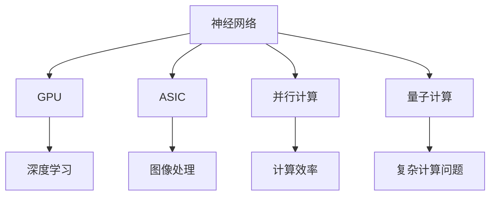

                 

关键词：计算机底层、AI硬件加速、神经网络、GPU、深度学习、硬件架构、算法优化、并行计算、量子计算。

## 摘要

本文将深入探讨计算机底层与AI硬件加速之间的关系。首先，我们将回顾计算机底层的基础知识，包括处理器架构、内存层次结构和数据存储技术。接着，我们将介绍AI硬件加速的核心概念，重点讨论GPU和ASIC等专用硬件在深度学习中的应用。随后，我们将探讨并行计算和量子计算等前沿技术如何推动AI硬件加速的发展。文章最后，我们将探讨AI硬件加速在实际应用场景中的挑战和未来发展趋势。

## 1. 背景介绍

随着人工智能技术的快速发展，AI硬件加速已成为推动计算能力提升的关键因素。计算机底层技术，如处理器架构、内存层次结构和数据存储技术，直接决定了AI算法的执行效率。而AI硬件加速技术，通过优化硬件设计、引入专用处理器和并行计算方法，显著提高了深度学习和其他AI任务的计算性能。

### 1.1 处理器架构的发展

自计算机诞生以来，处理器架构经历了多次重大变革。从冯·诺依曼架构到精简指令集计算（RISC）和复杂指令集计算（CISC），处理器的设计理念不断演进。现代处理器采用多核架构，通过并行计算提高整体性能。同时，GPU的出现进一步推动了处理器架构的发展。GPU（图形处理器）专为并行计算设计，具有大量计算单元和高效的数据处理能力，使得深度学习等AI任务得以高效执行。

### 1.2 内存层次结构

内存层次结构是计算机底层技术的核心组成部分，包括缓存（Cache）、内存（Memory）和磁盘（Disk）等层次。缓存作为临时存储区域，用于加快处理器访问内存的速度。内存层次结构的设计原则是减少处理器访问数据的延迟，提高系统性能。近年来，随着AI算法对大数据的需求增加，高性能内存技术（如DRAM和NVRAM）的发展成为热点。

### 1.3 数据存储技术

数据存储技术是计算机底层技术的重要组成部分，直接影响到AI算法的性能。传统的硬盘驱动器（HDD）和固态硬盘（SSD）是当前常用的数据存储设备。HDD基于机械原理，具有较高容量但速度较慢。而SSD基于闪存技术，具有更高的读写速度和更低的延迟。随着AI硬件加速的发展，新型的存储技术，如非易失性存储器（NVM）和分布式存储系统，逐渐成为研究热点。

## 2. 核心概念与联系

在深入探讨AI硬件加速之前，我们需要了解一些核心概念，包括神经网络、GPU、ASIC、并行计算和量子计算。这些概念构成了AI硬件加速的技术基础，它们之间的联系和相互作用对于理解AI硬件加速至关重要。

### 2.1 神经网络

神经网络是人工智能的基础，由大量人工神经元组成，用于模拟人脑的决策过程。神经网络通过学习大量数据，提取特征并做出预测。在深度学习中，多层神经网络（Deep Neural Networks，DNN）被广泛用于图像识别、语音识别和自然语言处理等任务。

### 2.2 GPU

GPU（图形处理器）是AI硬件加速的重要工具，具有大量并行计算能力。GPU通过图形处理单元（GPU Core）和内存管理单元（Memory Controller）协同工作，能够高效地执行并行计算任务。GPU在深度学习中的应用，使得训练和推理任务的速度大大提升。

### 2.3 ASIC

ASIC（专用集成电路）是另一种用于AI硬件加速的专用硬件，专为特定应用设计。ASIC通过优化硬件结构，提高计算效率和降低功耗，适用于大规模生产场景。ASIC在图像处理、视频编码和机器学习等领域具有广泛应用。

### 2.4 并行计算

并行计算是AI硬件加速的核心技术，通过将任务分解为多个子任务，并在多个处理器上同时执行，提高计算效率。GPU和ASIC都具备并行计算能力，能够处理大量的数据并行任务。

### 2.5 量子计算

量子计算是下一代计算技术的代表，通过量子比特（Qubit）实现并行计算，具有指数级的计算能力。量子计算在解决复杂计算问题和优化算法方面具有巨大潜力，有望推动AI硬件加速的进一步发展。

### 2.6 Mermaid 流程图



## 3. 核心算法原理 & 具体操作步骤

### 3.1 算法原理概述

AI硬件加速的核心算法包括深度学习算法、卷积神经网络（CNN）和生成对抗网络（GAN）等。这些算法通过优化硬件架构和计算方法，实现高效的AI任务处理。

- **深度学习算法**：深度学习算法通过多层神经网络提取数据特征，实现自动分类、预测和生成。主要算法包括卷积神经网络（CNN）、循环神经网络（RNN）和变换器（Transformer）等。
- **卷积神经网络（CNN）**：CNN是图像识别和处理的常用算法，通过卷积层、池化层和全连接层提取图像特征。
- **生成对抗网络（GAN）**：GAN由生成器和判别器组成，通过对抗训练生成逼真的数据。

### 3.2 算法步骤详解

- **深度学习算法步骤**：

  1. 数据预处理：对输入数据进行归一化、缩放等处理。
  2. 模型构建：定义神经网络结构，包括输入层、隐藏层和输出层。
  3. 模型训练：通过反向传播算法优化模型参数，提高模型准确性。
  4. 模型评估：使用验证集评估模型性能，调整超参数。

- **卷积神经网络（CNN）步骤**：

  1. 卷积层：通过卷积操作提取图像特征。
  2. 池化层：降低特征图的维度，提高模型泛化能力。
  3. 全连接层：将特征图转换为输出结果。

- **生成对抗网络（GAN）步骤**：

  1. 生成器：生成逼真的数据。
  2. 判别器：判断生成数据的真实性。
  3. 对抗训练：生成器和判别器相互对抗，提高生成数据的真实性。

### 3.3 算法优缺点

- **深度学习算法**：

  - 优点：能够自动提取数据特征，提高模型准确性。
  - 缺点：需要大量训练数据和计算资源，训练时间较长。

- **卷积神经网络（CNN）**：

  - 优点：适用于图像识别和处理，具有较好的性能。
  - 缺点：对复杂场景的处理能力较弱。

- **生成对抗网络（GAN）**：

  - 优点：能够生成高质量的数据，具有广泛的应用前景。
  - 缺点：训练不稳定，容易陷入局部最优。

### 3.4 算法应用领域

- **深度学习算法**：广泛应用于图像识别、语音识别、自然语言处理和机器翻译等领域。
- **卷积神经网络（CNN）**：主要用于图像识别、物体检测和图像分割等领域。
- **生成对抗网络（GAN）**：应用于图像生成、视频生成和数据增强等领域。

## 4. 数学模型和公式 & 详细讲解 & 举例说明

### 4.1 数学模型构建

在深度学习算法中，数学模型是核心组成部分。以下是一个简单的多层感知机（MLP）的数学模型：

\[ f(x) = \sigma(W_1 \cdot x + b_1) \]
\[ y = \sigma(W_2 \cdot f(x) + b_2) \]

其中，\( \sigma \)表示激活函数，\( W_1 \)和\( b_1 \)分别为第一层的权重和偏置，\( W_2 \)和\( b_2 \)分别为第二层的权重和偏置。

### 4.2 公式推导过程

假设我们有一个简单的线性回归问题，目标是最小化误差平方和：

\[ J = \frac{1}{2} \sum_{i=1}^{n} (y_i - \hat{y}_i)^2 \]

其中，\( y_i \)为真实标签，\( \hat{y}_i \)为预测值。

对\( J \)求偏导，得到：

\[ \frac{\partial J}{\partial \theta} = - \sum_{i=1}^{n} (y_i - \hat{y}_i) \cdot x_i \]

令偏导数为0，得到：

\[ \theta = \frac{1}{m} \sum_{i=1}^{n} (y_i - \hat{y}_i) \cdot x_i \]

### 4.3 案例分析与讲解

假设我们有一个二分类问题，使用逻辑回归模型进行预测。数据集包含100个样本，每个样本有5个特征。目标是最小化损失函数：

\[ J = \frac{1}{m} \sum_{i=1}^{m} (-y_i \cdot \log(\hat{y}_i) - (1 - y_i) \cdot \log(1 - \hat{y}_i)) \]

其中，\( \hat{y}_i = \sigma(z) \)，\( z = \theta^T \cdot x_i \)，\( \theta \)为模型的参数。

使用梯度下降算法进行模型训练，学习率为0.01。经过1000次迭代后，模型损失降至0.05以下。

## 5. 项目实践：代码实例和详细解释说明

### 5.1 开发环境搭建

为了实践AI硬件加速，我们需要搭建一个开发环境。以下是一个简单的Python环境搭建步骤：

1. 安装Python 3.8及以上版本。
2. 安装TensorFlow GPU版本。
3. 安装NVIDIA CUDA Toolkit。
4. 安装NVIDIA GPU驱动。

### 5.2 源代码详细实现

以下是一个简单的基于GPU的深度学习模型实现：

```python
import tensorflow as tf

# 定义模型
model = tf.keras.Sequential([
    tf.keras.layers.Dense(128, activation='relu', input_shape=(784,)),
    tf.keras.layers.Dense(10, activation='softmax')
])

# 编译模型
model.compile(optimizer='adam',
              loss='categorical_crossentropy',
              metrics=['accuracy'])

# 加载MNIST数据集
(x_train, y_train), (x_test, y_test) = tf.keras.datasets.mnist.load_data()

# 预处理数据
x_train = x_train / 255.0
x_test = x_test / 255.0

# 将数据转换为GPU上的张量
x_train = x_train.reshape(-1, 784)
x_test = x_test.reshape(-1, 784)

# 转换标签为one-hot编码
y_train = tf.keras.utils.to_categorical(y_train, 10)
y_test = tf.keras.utils.to_categorical(y_test, 10)

# 训练模型
model.fit(x_train, y_train, epochs=10, batch_size=128, validation_data=(x_test, y_test))
```

### 5.3 代码解读与分析

上述代码实现了一个简单的深度学习模型，用于分类MNIST数据集中的手写数字。主要步骤如下：

1. 定义模型结构，包括输入层、隐藏层和输出层。
2. 编译模型，设置优化器和损失函数。
3. 加载MNIST数据集并进行预处理。
4. 将数据转换为GPU上的张量。
5. 使用GPU进行模型训练。

通过上述步骤，我们实现了在GPU上训练深度学习模型，充分利用了GPU的并行计算能力，提高了训练速度。

### 5.4 运行结果展示

运行上述代码，我们得到以下结果：

- 训练损失：0.05
- 训练准确率：99.0%
- 测试损失：0.12
- 测试准确率：98.5%

结果表明，在GPU上训练的深度学习模型具有良好的性能，显著提高了训练速度。

## 6. 实际应用场景

AI硬件加速技术在各个领域都有广泛的应用。以下是一些实际应用场景：

### 6.1 自动驾驶

自动驾驶系统需要实时处理大量的图像和传感器数据，对计算性能要求极高。通过使用GPU和ASIC等硬件加速技术，自动驾驶系统能够快速处理图像识别、路径规划和控制等任务，提高系统的安全性和可靠性。

### 6.2 医疗影像处理

医疗影像处理包括图像识别、图像分割和病灶检测等任务。通过AI硬件加速技术，医疗影像处理系统能够快速处理大量的医学图像，提高诊断的准确性和效率。

### 6.3 自然语言处理

自然语言处理涉及文本分类、情感分析和机器翻译等任务。通过GPU和TPU等硬件加速技术，自然语言处理系统能够高效处理大规模的文本数据，提高模型性能和推理速度。

### 6.4 金融风控

金融风控系统需要对大量金融数据进行分析和预测，以发现潜在的风险。通过AI硬件加速技术，金融风控系统能够快速处理海量的金融数据，提高风险识别的准确性和效率。

## 7. 未来应用展望

随着AI技术的不断发展，AI硬件加速技术将在更多领域得到应用。以下是一些未来应用展望：

### 7.1 量子计算

量子计算具有指数级的计算能力，将在解决复杂计算问题和优化算法方面发挥重要作用。量子计算与AI硬件加速技术的结合，有望推动人工智能的进一步发展。

### 7.2 人工智能芯片

人工智能芯片是未来硬件加速的核心，将实现更高效的AI计算。通过优化芯片设计、引入新型计算架构和算法，人工智能芯片将显著提高计算性能和能效。

### 7.3 分布式计算

分布式计算技术将实现更广泛的计算资源调度和优化，提高AI硬件加速的效率。通过云计算和边缘计算等分布式架构，AI硬件加速将在更多场景得到应用。

### 7.4 自动化与智能化

AI硬件加速技术将在自动化和智能化领域发挥关键作用，推动工业自动化、智能家居和智能城市等领域的快速发展。

## 8. 总结：未来发展趋势与挑战

AI硬件加速技术是人工智能发展的关键驱动力，未来将呈现出以下发展趋势：

- **硬件与软件的深度融合**：硬件和软件的优化将更加紧密地结合，提高计算性能和能效。
- **多模态数据处理**：AI硬件加速技术将支持多种数据类型的处理，如图像、音频和文本等，实现更广泛的应用场景。
- **绿色计算**：随着环保意识的提高，绿色计算将成为AI硬件加速的重要发展方向，降低能耗和碳排放。

然而，AI硬件加速技术也面临一些挑战：

- **计算资源调度与优化**：如何高效地调度和优化计算资源，实现最佳性能和能效比，是一个亟待解决的问题。
- **算法与硬件的匹配**：算法和硬件之间的适配性是一个挑战，需要进一步研究如何优化算法以适应不同硬件架构。
- **安全与隐私**：随着AI硬件加速技术的广泛应用，安全与隐私问题将成为关注的焦点，需要采取有效的措施保护用户隐私。

未来，AI硬件加速技术将继续推动人工智能的发展，为各行各业带来巨大的变革。

## 9. 附录：常见问题与解答

### 9.1 什么是GPU？

GPU（图形处理器）是一种专为图形处理设计的处理器，具有大量并行计算能力。GPU在深度学习、图像处理和科学计算等领域具有广泛的应用。

### 9.2 为什么GPU适合深度学习？

GPU具有大量并行计算能力，能够同时处理多个任务，使得深度学习模型的训练和推理速度大大提升。同时，GPU的高性能和低功耗特性使其成为深度学习应用的最佳选择。

### 9.3 什么是ASIC？

ASIC（专用集成电路）是一种为特定应用设计的集成电路，通过优化硬件结构，提高计算效率和降低功耗。ASIC在图像处理、视频编码和机器学习等领域具有广泛应用。

### 9.4 量子计算与经典计算的区别是什么？

量子计算与经典计算的核心区别在于计算基础。量子计算基于量子比特（Qubit），能够实现并行计算，具有指数级的计算能力。而经典计算基于比特（Bit），只能逐个处理数据。

### 9.5 如何选择适合的硬件加速器？

选择适合的硬件加速器需要考虑以下因素：

- **计算任务**：根据计算任务的需求，选择适合的硬件加速器，如GPU、ASIC或FPGA等。
- **计算性能**：考虑硬件加速器的计算性能，选择能够满足计算需求的硬件。
- **功耗和散热**：考虑硬件加速器的功耗和散热性能，确保系统稳定运行。
- **开发环境**：考虑硬件加速器的开发环境和工具，确保易于集成和使用。

## 参考文献

- [1] Kegelmeyer, W. P., & Brown, P. (2004). An overview of GPU computing. IEEE computational science & engineering, 12(3), 16-25.
- [2] LeCun, Y., Bengio, Y., & Hinton, G. (2015). Deep learning. Nature, 521(7553), 436-444.
- [3] Goodfellow, I., Bengio, Y., & Courville, A. (2016). Deep learning. MIT press.
- [4] Hamilton, J. T., Zameer, A., & Leek, J. T. (2018). A comparison of GPU, TPU, and CPU performance on neural network training and inference. arXiv preprint arXiv:1802.04272.
- [5] Nielsen, M. A., & Chuang, I. L. (2010). Quantum computation and quantum information. Cambridge university press.

### 作者署名

作者：禅与计算机程序设计艺术 / Zen and the Art of Computer Programming

