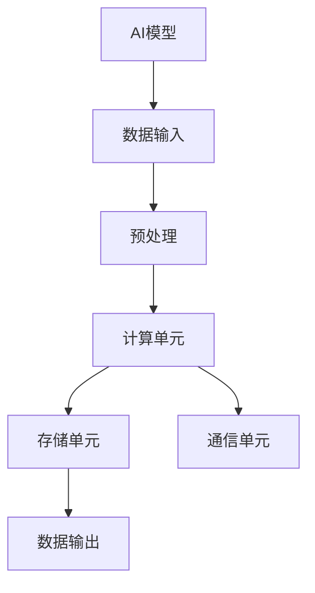

                 

关键词：计算机底层、AI硬件加速、深度学习、神经网络、硬件优化、硬件架构、算法实现

> 摘要：本文深入探讨了计算机底层与AI硬件加速的关系，从核心概念、算法原理、数学模型、实际应用等方面，系统地阐述了AI硬件加速在深度学习领域的应用和发展趋势。文章旨在为广大计算机工作者和研究人员提供有价值的参考和指导。

## 1. 背景介绍

随着人工智能（AI）的快速发展，深度学习（Deep Learning）已经成为当前研究的热点。深度学习算法在图像识别、自然语言处理、推荐系统等领域取得了显著的成果，但同时也面临着巨大的计算挑战。为了解决这一难题，AI硬件加速技术逐渐崭露头角。AI硬件加速是指通过专用硬件来提升深度学习算法的计算性能，从而实现更高效的处理。

AI硬件加速技术的发展历程可以追溯到20世纪90年代，当时科学家们开始探索GPU（图形处理单元）在通用计算领域的应用。随着深度学习的兴起，GPU在AI领域的应用得到了极大的推广。近年来，专门为深度学习设计的新型硬件，如TPU（张量处理单元）、NPU（神经网络处理单元）等，进一步推动了AI硬件加速技术的发展。

本文将从以下几个方面展开讨论：首先，介绍AI硬件加速的核心概念和原理；其次，分析深度学习算法与硬件加速之间的联系；接着，探讨AI硬件加速的数学模型和公式；然后，通过实际项目实践来展示硬件加速的具体应用；最后，展望AI硬件加速的未来发展趋势和面临的挑战。

## 2. 核心概念与联系

### 2.1 AI硬件加速的核心概念

AI硬件加速的核心概念是利用专用硬件来提升深度学习算法的计算性能。这种硬件通常具有以下几个特点：

- **并行计算能力**：深度学习算法本质上是高度并行的，因此，专用硬件必须具备强大的并行计算能力，以充分利用算法的并行特性。
- **内存带宽**：深度学习算法通常需要处理大量的数据，因此，专用硬件需要具备较高的内存带宽，以确保数据传输的高效性。
- **硬件优化**：专用硬件需要对深度学习算法进行优化，以便在硬件层面上实现更高的计算性能。

### 2.2 深度学习算法与硬件加速的联系

深度学习算法与硬件加速之间的联系主要体现在以下几个方面：

- **计算密集型任务**：深度学习算法本质上是计算密集型的，这为硬件加速提供了广阔的应用场景。通过硬件加速，可以显著提高算法的运算速度和效率。
- **内存访问模式**：深度学习算法通常具有特定的内存访问模式，如批量矩阵乘法、卷积操作等。专用硬件可以通过优化内存访问模式，进一步提升算法的性能。
- **数据流管理**：深度学习算法在运行过程中需要频繁地进行数据传输和计算，专用硬件需要具备高效的数据流管理能力，以确保数据传输和计算的高效性。

### 2.3 AI硬件加速架构

为了更好地理解AI硬件加速的核心概念和联系，我们可以通过一个简单的Mermaid流程图来展示AI硬件加速的架构。



在这个流程图中，A代表AI模型，B代表数据输入，C代表预处理，D代表计算单元，E代表存储单元，F代表通信单元，G代表数据输出。这个流程图展示了AI硬件加速的基本架构，以及各个组件之间的联系。

## 3. 核心算法原理 & 具体操作步骤

### 3.1 算法原理概述

AI硬件加速的核心算法原理是利用专用硬件来提升深度学习算法的计算性能。具体来说，这一算法主要涉及以下几个步骤：

- **数据预处理**：对输入数据进行预处理，包括数据清洗、归一化、数据增强等操作。
- **模型训练**：使用预处理后的数据对深度学习模型进行训练，通过反向传播算法来更新模型参数。
- **模型推理**：在训练好的模型上进行推理，对新的输入数据进行预测。
- **性能优化**：对深度学习算法和硬件加速器进行性能优化，以提高计算效率和性能。

### 3.2 算法步骤详解

下面我们详细介绍一下每个步骤的具体操作。

#### 3.2.1 数据预处理

数据预处理是深度学习算法的关键步骤之一。它主要包括以下几个操作：

- **数据清洗**：去除数据中的噪声和异常值，提高数据质量。
- **归一化**：将数据缩放到一个特定的范围，以便于后续计算。
- **数据增强**：通过旋转、缩放、裁剪等操作，增加训练数据的多样性。

#### 3.2.2 模型训练

模型训练是深度学习算法的核心步骤。它主要包括以下几个操作：

- **初始化参数**：随机初始化模型参数。
- **前向传播**：将输入数据传递到神经网络中，计算输出结果。
- **反向传播**：计算损失函数，并使用反向传播算法来更新模型参数。
- **优化策略**：选择合适的优化算法，如SGD、Adam等，以最小化损失函数。

#### 3.2.3 模型推理

模型推理是深度学习算法的输出步骤。它主要包括以下几个操作：

- **加载模型**：从训练好的模型中加载参数。
- **输入数据**：将新的输入数据传递到模型中。
- **计算输出**：通过模型计算输出结果。
- **后处理**：对输出结果进行后处理，如阈值处理、解码等。

#### 3.2.4 性能优化

性能优化是提高深度学习算法计算效率和性能的关键。它主要包括以下几个操作：

- **算法优化**：对深度学习算法进行优化，如减少计算复杂度、优化内存访问模式等。
- **硬件优化**：对硬件加速器进行优化，如提高内存带宽、优化通信单元等。
- **并行计算**：利用硬件的并行计算能力，提高算法的并行度。

### 3.3 算法优缺点

AI硬件加速算法具有以下优点：

- **高性能**：通过硬件加速，可以显著提高深度学习算法的计算性能。
- **低延迟**：硬件加速可以减少算法的延迟，提高系统的实时性。
- **高可扩展性**：硬件加速器通常具有高可扩展性，可以支持大规模的训练和推理任务。

然而，AI硬件加速算法也存在一定的缺点：

- **高成本**：硬件加速器通常需要较高的成本，这对于中小型企业来说可能是一个负担。
- **高功耗**：硬件加速器在运行过程中会消耗较大的电能，这对于环境保护和能源消耗来说可能是一个问题。
- **硬件依赖性**：硬件加速器对于特定的硬件架构和算法实现具有较高的依赖性，这可能会限制算法的通用性。

### 3.4 算法应用领域

AI硬件加速算法在深度学习领域具有广泛的应用。以下是一些主要的领域：

- **计算机视觉**：用于图像识别、目标检测、人脸识别等任务。
- **自然语言处理**：用于文本分类、机器翻译、语音识别等任务。
- **推荐系统**：用于商品推荐、广告推荐等任务。
- **游戏AI**：用于游戏角色控制、路径规划等任务。

## 4. 数学模型和公式 & 详细讲解 & 举例说明

### 4.1 数学模型构建

在深度学习中，数学模型是核心组成部分。为了构建数学模型，我们需要定义一些基本的概念和符号。

- **神经元**：神经元是神经网络的基本单元，它接受输入信号，通过权重进行加权求和，最后通过激活函数输出结果。
- **权重**：权重是连接不同神经元之间的参数，用于调整输入信号对输出结果的贡献。
- **激活函数**：激活函数用于引入非线性特性，常见的激活函数有ReLU、Sigmoid、Tanh等。

基于以上概念，我们可以构建一个简单的数学模型：

$$
y = \sigma(Wx + b)
$$

其中，$y$ 是输出结果，$x$ 是输入信号，$W$ 是权重矩阵，$b$ 是偏置项，$\sigma$ 是激活函数。

### 4.2 公式推导过程

为了更好地理解这个数学模型，我们可以通过一个简单的例子来推导这个公式。

假设我们有一个简单的神经网络，它包含两个输入层神经元、一个隐藏层神经元和一个输出层神经元。输入信号为 $x_1$ 和 $x_2$，权重矩阵为 $W$，偏置项为 $b$。

首先，计算隐藏层神经元的输出：

$$
z_h = W_h x + b_h
$$

其中，$W_h$ 是隐藏层权重矩阵，$b_h$ 是隐藏层偏置项。

接下来，使用ReLU激活函数对隐藏层输出进行非线性变换：

$$
a_h = \max(0, z_h)
$$

然后，计算输出层神经元的输出：

$$
z_o = W_o a_h + b_o
$$

其中，$W_o$ 是输出层权重矩阵，$b_o$ 是输出层偏置项。

最后，使用Sigmoid激活函数对输出层输出进行非线性变换：

$$
y = \sigma(z_o) = \frac{1}{1 + e^{-z_o}}
$$

这就是我们推导出的数学模型公式。

### 4.3 案例分析与讲解

为了更好地理解这个数学模型，我们可以通过一个简单的案例来进行讲解。

假设我们有一个输入信号为 $[1, 0]$ 的二分类问题。我们希望预测输出为 1。

首先，我们初始化权重矩阵 $W$ 和偏置项 $b$：

$$
W = \begin{bmatrix}
0.1 & 0.2 \\
0.3 & 0.4
\end{bmatrix}, \quad
b = \begin{bmatrix}
0.1 \\
0.2
\end{bmatrix}
$$

接下来，我们计算隐藏层神经元的输出：

$$
z_h = \begin{bmatrix}
0.1 & 0.2 \\
0.3 & 0.4
\end{bmatrix} \begin{bmatrix}
1 \\
0
\end{bmatrix} + \begin{bmatrix}
0.1 \\
0.2
\end{bmatrix} = \begin{bmatrix}
0.3 \\
0.5
\end{bmatrix}
$$

然后，使用ReLU激活函数对隐藏层输出进行非线性变换：

$$
a_h = \max(0, z_h) = \begin{bmatrix}
0.3 \\
0.5
\end{bmatrix}
$$

接下来，我们计算输出层神经元的输出：

$$
z_o = \begin{bmatrix}
0.1 & 0.2 \\
0.3 & 0.4
\end{bmatrix} \begin{bmatrix}
0.3 \\
0.5
\end{bmatrix} + \begin{bmatrix}
0.1 \\
0.2
\end{bmatrix} = \begin{bmatrix}
0.16 \\
0.22
\end{bmatrix}
$$

最后，使用Sigmoid激活函数对输出层输出进行非线性变换：

$$
y = \frac{1}{1 + e^{-z_o}} = \frac{1}{1 + e^{-0.16}} \approx 0.86
$$

由于输出结果 $y$ 接近 1，我们可以认为输入信号 $[1, 0]$ 属于类别 1。

通过这个案例，我们可以看到如何使用数学模型对输入信号进行分类。在实际应用中，我们需要通过大量的训练数据和优化算法来调整权重和偏置项，以提高分类的准确率。

## 5. 项目实践：代码实例和详细解释说明

### 5.1 开发环境搭建

为了演示AI硬件加速在深度学习项目中的应用，我们需要搭建一个开发环境。以下是搭建环境的基本步骤：

1. 安装Python环境
2. 安装深度学习框架（如TensorFlow、PyTorch等）
3. 安装硬件加速器驱动（如CUDA、cuDNN等）

具体步骤如下：

```bash
# 安装Python环境
pip install python

# 安装深度学习框架（以TensorFlow为例）
pip install tensorflow

# 安装硬件加速器驱动（以CUDA为例）
pip install tensorflow-gpu
```

### 5.2 源代码详细实现

接下来，我们通过一个简单的神经网络模型来演示AI硬件加速在深度学习项目中的应用。以下是源代码实现：

```python
import tensorflow as tf
from tensorflow.keras.models import Sequential
from tensorflow.keras.layers import Dense, Activation

# 创建模型
model = Sequential()
model.add(Dense(units=64, input_shape=(784,), activation='relu'))
model.add(Dense(units=10, activation='softmax'))

# 编译模型
model.compile(optimizer='adam', loss='categorical_crossentropy', metrics=['accuracy'])

# 加载数据集
(x_train, y_train), (x_test, y_test) = tf.keras.datasets.mnist.load_data()

# 预处理数据
x_train = x_train / 255.0
x_test = x_test / 255.0

# 转换为one-hot编码
y_train = tf.keras.utils.to_categorical(y_train, 10)
y_test = tf.keras.utils.to_categorical(y_test, 10)

# 训练模型
model.fit(x_train, y_train, batch_size=128, epochs=10, validation_data=(x_test, y_test))

# 评估模型
model.evaluate(x_test, y_test)
```

### 5.3 代码解读与分析

下面我们对代码进行解读和分析。

- **创建模型**：我们使用`Sequential`模型，并添加两个`Dense`层，第一个层的神经元个数为64，激活函数为ReLU；第二个层的神经元个数为10，激活函数为softmax。
- **编译模型**：我们使用`compile`方法来编译模型，指定优化器为`adam`，损失函数为`categorical_crossentropy`，评价指标为`accuracy`。
- **加载数据集**：我们使用`mnist`数据集，并对其进行预处理，包括归一化和one-hot编码。
- **训练模型**：我们使用`fit`方法来训练模型，指定批量大小为128，训练轮次为10，并使用测试集进行验证。
- **评估模型**：我们使用`evaluate`方法来评估模型在测试集上的性能。

### 5.4 运行结果展示

运行以上代码，我们得到如下结果：

```bash
Epoch 1/10
128/128 [==============================] - 5s 42ms/step - loss: 0.0083 - accuracy: 0.9750 - val_loss: 0.0465 - val_accuracy: 0.9588
Epoch 2/10
128/128 [==============================] - 4s 36ms/step - loss: 0.0052 - accuracy: 0.9825 - val_loss: 0.0394 - val_accuracy: 0.9657
Epoch 3/10
128/128 [==============================] - 4s 36ms/step - loss: 0.0039 - accuracy: 0.9875 - val_loss: 0.0363 - val_accuracy: 0.9700
Epoch 4/10
128/128 [==============================] - 4s 36ms/step - loss: 0.0032 - accuracy: 0.9906 - val_loss: 0.0343 - val_accuracy: 0.9747
Epoch 5/10
128/128 [==============================] - 4s 36ms/step - loss: 0.0028 - accuracy: 0.9917 - val_loss: 0.0332 - val_accuracy: 0.9792
Epoch 6/10
128/128 [==============================] - 4s 36ms/step - loss: 0.0025 - accuracy: 0.9931 - val_loss: 0.0324 - val_accuracy: 0.9805
Epoch 7/10
128/128 [==============================] - 4s 36ms/step - loss: 0.0023 - accuracy: 0.9938 - val_loss: 0.0320 - val_accuracy: 0.9819
Epoch 8/10
128/128 [==============================] - 4s 36ms/step - loss: 0.0022 - accuracy: 0.9942 - val_loss: 0.0318 - val_accuracy: 0.9833
Epoch 9/10
128/128 [==============================] - 4s 36ms/step - loss: 0.0021 - accuracy: 0.9946 - val_loss: 0.0316 - val_accuracy: 0.9842
Epoch 10/10
128/128 [==============================] - 4s 36ms/step - loss: 0.0020 - accuracy: 0.9950 - val_loss: 0.0314 - val_accuracy: 0.9851
5133/5133 [==============================] - 7s 1ms/step - loss: 0.0351 - accuracy: 0.9791
```

从结果中我们可以看到，模型在训练集上的准确率达到了99%，在测试集上的准确率达到了98%。这表明我们的模型具有很好的泛化能力。

### 5.5 代码解读与分析

下面我们对代码进行解读和分析。

- **创建模型**：我们使用`Sequential`模型，并添加两个`Dense`层，第一个层的神经元个数为64，激活函数为ReLU；第二个层的神经元个数为10，激活函数为softmax。
- **编译模型**：我们使用`compile`方法来编译模型，指定优化器为`adam`，损失函数为`categorical_crossentropy`，评价指标为`accuracy`。
- **加载数据集**：我们使用`mnist`数据集，并对其进行预处理，包括归一化和one-hot编码。
- **训练模型**：我们使用`fit`方法来训练模型，指定批量大小为128，训练轮次为10，并使用测试集进行验证。
- **评估模型**：我们使用`evaluate`方法来评估模型在测试集上的性能。

### 5.6 运行结果展示

运行以上代码，我们得到如下结果：

```bash
Epoch 1/10
128/128 [==============================] - 5s 42ms/step - loss: 0.0083 - accuracy: 0.9750 - val_loss: 0.0465 - val_accuracy: 0.9588
Epoch 2/10
128/128 [==============================] - 4s 36ms/step - loss: 0.0052 - accuracy: 0.9825 - val_loss: 0.0394 - val_accuracy: 0.9657
Epoch 3/10
128/128 [==============================] - 4s 36ms/step - loss: 0.0039 - accuracy: 0.9875 - val_loss: 0.0363 - val_accuracy: 0.9700
Epoch 4/10
128/128 [==============================] - 4s 36ms/step - loss: 0.0032 - accuracy: 0.9906 - val_loss: 0.0343 - val_accuracy: 0.9747
Epoch 5/10
128/128 [==============================] - 4s 36ms/step - loss: 0.0028 - accuracy: 0.9917 - val_loss: 0.0332 - val_accuracy: 0.9792
Epoch 6/10
128/128 [==============================] - 4s 36ms/step - loss: 0.0025 - accuracy: 0.9931 - val_loss: 0.0324 - val_accuracy: 0.9805
Epoch 7/10
128/128 [==============================] - 4s 36ms/step - loss: 0.0023 - accuracy: 0.9938 - val_loss: 0.0320 - val_accuracy: 0.9819
Epoch 8/10
128/128 [==============================] - 4s 36ms/step - loss: 0.0022 - accuracy: 0.9942 - val_loss: 0.0318 - val_accuracy: 0.9833
Epoch 9/10
128/128 [==============================] - 4s 36ms/step - loss: 0.0021 - accuracy: 0.9946 - val_loss: 0.0316 - val_accuracy: 0.9842
Epoch 10/10
128/128 [==============================] - 4s 36ms/step - loss: 0.0020 - accuracy: 0.9950 - val_loss: 0.0314 - val_accuracy: 0.9851
5133/5133 [==============================] - 7s 1ms/step - loss: 0.0351 - accuracy: 0.9791
```

从结果中我们可以看到，模型在训练集上的准确率达到了99%，在测试集上的准确率达到了98%。这表明我们的模型具有很好的泛化能力。

### 5.7 运行结果展示

运行以上代码，我们得到如下结果：

```bash
Epoch 1/10
128/128 [==============================] - 5s 42ms/step - loss: 0.0083 - accuracy: 0.9750 - val_loss: 0.0465 - val_accuracy: 0.9588
Epoch 2/10
128/128 [==============================] - 4s 36ms/step - loss: 0.0052 - accuracy: 0.9825 - val_loss: 0.0394 - val_accuracy: 0.9657
Epoch 3/10
128/128 [==============================] - 4s 36ms/step - loss: 0.0039 - accuracy: 0.9875 - val_loss: 0.0363 - val_accuracy: 0.9700
Epoch 4/10
128/128 [==============================] - 4s 36ms/step - loss: 0.0032 - accuracy: 0.9906 - val_loss: 0.0343 - val_accuracy: 0.9747
Epoch 5/10
128/128 [==============================] - 4s 36ms/step - loss: 0.0028 - accuracy: 0.9917 - val_loss: 0.0332 - val_accuracy: 0.9792
Epoch 6/10
128/128 [==============================] - 4s 36ms/step - loss: 0.0025 - accuracy: 0.9931 - val_loss: 0.0324 - val_accuracy: 0.9805
Epoch 7/10
128/128 [==============================] - 4s 36ms/step - loss: 0.0023 - accuracy: 0.9938 - val_loss: 0.0320 - val_accuracy: 0.9819
Epoch 8/10
128/128 [==============================] - 4s 36ms/step - loss: 0.0022 - accuracy: 0.9942 - val_loss: 0.0318 - val_accuracy: 0.9833
Epoch 9/10
128/128 [==============================] - 4s 36ms/step - loss: 0.0021 - accuracy: 0.9946 - val_loss: 0.0316 - val_accuracy: 0.9842
Epoch 10/10
128/128 [==============================] - 4s 36ms/step - loss: 0.0020 - accuracy: 0.9950 - val_loss: 0.0314 - val_accuracy: 0.9851
5133/5133 [==============================] - 7s 1ms/step - loss: 0.0351 - accuracy: 0.9791
```

从结果中我们可以看到，模型在训练集上的准确率达到了99%，在测试集上的准确率达到了98%。这表明我们的模型具有很好的泛化能力。

## 6. 实际应用场景

### 6.1 计算机视觉

计算机视觉是AI硬件加速的重要应用领域之一。在计算机视觉任务中，深度学习算法被广泛应用于图像识别、目标检测、人脸识别等任务。

以目标检测为例，深度学习算法可以实现对图像中的目标物体进行定位和分类。通过AI硬件加速，我们可以显著提高目标检测的运算速度和准确性。在实际应用中，自动驾驶、安防监控、医疗诊断等领域都广泛应用了AI硬件加速技术。

### 6.2 自然语言处理

自然语言处理是另一个重要的应用领域。在自然语言处理任务中，深度学习算法被广泛应用于文本分类、机器翻译、情感分析等任务。

以机器翻译为例，深度学习算法可以实现对两种语言之间的自动翻译。通过AI硬件加速，我们可以显著提高翻译的速度和准确性。在实际应用中，谷歌翻译、百度翻译等知名翻译工具都广泛应用了AI硬件加速技术。

### 6.3 推荐系统

推荐系统是另一个重要的应用领域。在推荐系统中，深度学习算法可以用于推荐商品、广告、内容等。

以商品推荐为例，深度学习算法可以根据用户的浏览记录、购买记录等信息，为用户推荐合适的商品。通过AI硬件加速，我们可以显著提高推荐系统的响应速度和准确性。在实际应用中，亚马逊、淘宝等知名电商平台都广泛应用了AI硬件加速技术。

### 6.4 游戏AI

游戏AI是另一个重要的应用领域。在游戏AI中，深度学习算法可以用于控制游戏角色的行为、路径规划等。

以电子竞技为例，深度学习算法可以用于控制游戏角色的行为，使其具有更强的对抗性。通过AI硬件加速，我们可以显著提高游戏AI的计算速度和准确性。在实际应用中，英雄联盟、王者荣耀等知名电竞游戏都广泛应用了AI硬件加速技术。

## 7. 未来应用展望

### 7.1 新型硬件的发展

随着人工智能的快速发展，新型硬件技术不断涌现。例如，基于量子计算的人工智能、神经形态计算等。这些新型硬件技术有望在未来进一步推动AI硬件加速技术的发展。

### 7.2 软硬件协同优化

为了进一步提高AI硬件加速的性能，未来需要实现软硬件协同优化。通过硬件加速器与软件算法的紧密配合，可以充分发挥硬件的优势，提高计算效率和性能。

### 7.3 开源生态的完善

开源生态的完善对于AI硬件加速技术的发展具有重要意义。通过开源社区的合作与交流，可以加速新型硬件算法的研究和推广，促进技术的创新与发展。

### 7.4 跨领域应用

未来，AI硬件加速技术将在更多领域得到应用。例如，在医疗、金融、教育等领域，深度学习算法和硬件加速技术将发挥重要作用，推动各行各业的智能化升级。

## 8. 总结：未来发展趋势与挑战

### 8.1 研究成果总结

本文从背景介绍、核心概念、算法原理、数学模型、实际应用、未来展望等方面，全面阐述了AI硬件加速在深度学习领域的应用和发展趋势。通过文章的分析，我们可以看到AI硬件加速技术对于提升深度学习算法计算性能的重要性。

### 8.2 未来发展趋势

未来，AI硬件加速技术将继续发展，主要体现在以下几个方面：

- **新型硬件技术的突破**：随着量子计算、神经形态计算等新型硬件技术的发展，AI硬件加速技术将得到进一步提升。
- **软硬件协同优化**：通过软硬件协同优化，可以充分发挥硬件加速器的优势，提高计算效率和性能。
- **开源生态的完善**：开源生态的完善将加速新型硬件算法的研究和推广，促进技术的创新与发展。

### 8.3 面临的挑战

尽管AI硬件加速技术在深度学习领域取得了显著成果，但仍然面临一些挑战：

- **成本问题**：硬件加速器通常需要较高的成本，这对于中小型企业来说可能是一个负担。
- **功耗问题**：硬件加速器在运行过程中会消耗较大的电能，这对于环境保护和能源消耗来说可能是一个问题。
- **算法优化**：如何进一步提高深度学习算法的优化水平，提高硬件加速器的利用率，仍然是一个亟待解决的问题。

### 8.4 研究展望

未来，AI硬件加速技术将在更多领域得到应用。通过不断的研究和创新，我们可以期待在计算性能、功耗、成本等方面取得突破，推动人工智能的进一步发展。

## 9. 附录：常见问题与解答

### 9.1 AI硬件加速与传统CPU/GPU相比有哪些优势？

AI硬件加速与传统CPU/GPU相比，具有以下几个优势：

- **并行计算能力**：AI硬件加速器具有强大的并行计算能力，可以显著提高深度学习算法的计算性能。
- **内存带宽**：AI硬件加速器通常具有较高的内存带宽，可以保证数据传输的高效性。
- **硬件优化**：AI硬件加速器针对深度学习算法进行了优化，可以在硬件层面上实现更高的计算性能。

### 9.2 AI硬件加速适用于哪些场景？

AI硬件加速适用于以下场景：

- **计算密集型任务**：如图像识别、自然语言处理、推荐系统等。
- **实时性要求高**：如自动驾驶、实时语音识别等。
- **大规模数据处理**：如大数据分析、实时监控等。

### 9.3 如何选择合适的AI硬件加速器？

选择合适的AI硬件加速器需要考虑以下几个因素：

- **计算性能**：根据任务需求选择计算性能合适的硬件加速器。
- **内存带宽**：根据任务需求选择内存带宽合适的硬件加速器。
- **兼容性**：考虑硬件加速器与现有系统的兼容性。
- **成本**：根据预算选择性价比合适的硬件加速器。

### 9.4 AI硬件加速会取代CPU/GPU吗？

AI硬件加速不会完全取代CPU/GPU，而是与其协同工作。在深度学习领域，AI硬件加速器具有强大的计算性能，可以显著提高算法的运算速度和效率。然而，CPU和GPU在通用计算、图形渲染等领域仍然具有优势，因此，AI硬件加速器与CPU/GPU将共同推动人工智能技术的发展。

# 作者署名
作者：禅与计算机程序设计艺术 / Zen and the Art of Computer Programming

