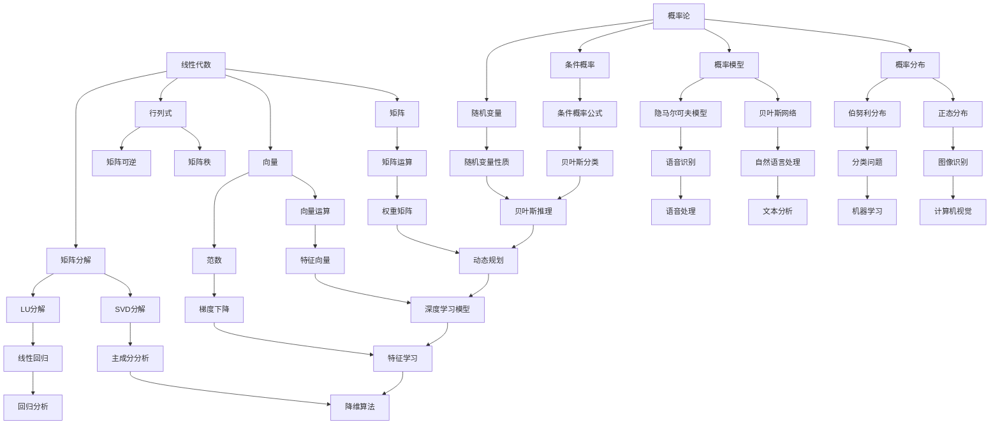

                 

关键词：深度学习、线性代数、概率论、数学基础、算法原理、数学模型、项目实践、实际应用场景、未来展望

> 摘要：本文将深入探讨深度学习领域中不可或缺的数学基础——线性代数和概率论。通过解析这些核心数学概念，我们将理解它们在深度学习中的作用，如何构建数学模型，以及如何在实际项目中应用这些理论。本文旨在为深度学习研究者提供一扇窗，窥见数学之美，助力他们在深度学习领域的探索与突破。

## 1. 背景介绍

深度学习作为人工智能的重要分支，近年来取得了显著的进展。然而，这一领域的高度复杂性使得理解其背后的数学基础成为必要。线性代数和概率论是深度学习中最常用的数学工具，它们为深度学习算法提供了坚实的理论基础。

### 1.1 深度学习的兴起

深度学习在图像识别、自然语言处理、推荐系统等众多领域取得了突破性成果，其核心在于通过多层神经网络对数据进行特征提取和模式识别。然而，深度学习的成功离不开对数据的高效处理和建模，而这正是线性代数和概率论大显身手的领域。

### 1.2 线性代数在深度学习中的作用

线性代数提供了处理多维数据的基本工具，如矩阵运算、向量计算等。这些工具在深度学习中的神经网络模型中得到了广泛应用，如权重矩阵的计算、梯度下降法的应用等。理解线性代数有助于我们更好地设计深度学习模型，提高模型的性能。

### 1.3 概率论在深度学习中的作用

概率论为深度学习提供了对不确定性的建模能力。通过概率分布和概率模型，我们可以描述数据的随机性，并利用这些模型进行预测和决策。在深度学习中，概率论帮助我们进行误差估计、模型选择和优化等任务。

## 2. 核心概念与联系

### 2.1 线性代数核心概念

在深度学习中，线性代数涉及以下几个核心概念：

- **矩阵**：矩阵是深度学习中最常用的数据结构，用于存储权重、特征等。矩阵的运算包括加法、减法、乘法和逆运算等。
- **向量**：向量是矩阵的一个特例，用于表示一维数据。向量的运算包括点积、叉积和范数等。
- **行列式**：行列式是矩阵的一个数值特征，用于判断矩阵的秩和可逆性。
- **矩阵分解**：矩阵分解是将矩阵分解为几个简单矩阵的乘积，如SVD分解、LU分解等。

### 2.2 概率论核心概念

在深度学习中，概率论涉及以下几个核心概念：

- **概率分布**：概率分布描述了随机变量的概率分布情况，如正态分布、伯努利分布等。
- **概率模型**：概率模型是对随机现象的数学描述，如贝叶斯网络、隐马尔可夫模型等。
- **条件概率**：条件概率描述了在某个条件下另一个事件发生的概率。
- **随机变量**：随机变量是概率论中的一个基本概念，用于描述随机现象。

### 2.3 Mermaid 流程图

下面是一个 Mermaid 流程图，展示了线性代数和概率论在深度学习中的核心概念及其联系：



## 3. 核心算法原理 & 具体操作步骤

### 3.1 算法原理概述

在深度学习中，线性代数和概率论的应用体现在以下几个方面：

- **前向传播和反向传播**：神经网络通过前向传播计算输出，通过反向传播更新权重。
- **梯度下降法**：用于优化神经网络中的参数，使得输出误差最小。
- **主成分分析**：用于降维和特征提取，提高模型的泛化能力。
- **正则化**：用于防止模型过拟合，提高模型的鲁棒性。

### 3.2 算法步骤详解

#### 3.2.1 前向传播

1. **初始化权重和偏置**：根据网络结构，随机初始化权重和偏置。
2. **输入数据**：将输入数据传递到神经网络的输入层。
3. **前向计算**：逐层计算每个神经元的输出，直至输出层。
4. **激活函数应用**：对每个神经元的输出应用激活函数，如Sigmoid、ReLU等。

#### 3.2.2 反向传播

1. **计算输出误差**：计算输出层实际输出与目标输出之间的误差。
2. **误差反向传播**：将误差反向传播到隐藏层，计算每层神经元的误差。
3. **权重更新**：利用误差和梯度下降法更新权重和偏置。

#### 3.2.3 梯度下降法

1. **计算梯度**：计算模型参数的梯度。
2. **权重更新**：根据梯度更新权重和偏置。
3. **迭代优化**：重复计算梯度、更新权重，直至满足停止条件。

#### 3.2.4 主成分分析

1. **数据预处理**：对数据进行标准化处理。
2. **计算协方差矩阵**：计算数据点的协方差矩阵。
3. **特征值和特征向量计算**：计算协方差矩阵的特征值和特征向量。
4. **降维**：选择前k个主成分，重构数据。

#### 3.2.5 正则化

1. **L1正则化**：在损失函数中添加L1范数项。
2. **L2正则化**：在损失函数中添加L2范数项。
3. **Dropout**：在训练过程中随机丢弃一部分神经元。

### 3.3 算法优缺点

#### 优点

- **前向传播和反向传播**：能够自动调整模型参数，提高模型性能。
- **梯度下降法**：简单高效，易于实现。
- **主成分分析**：能够降维和特征提取，提高模型泛化能力。
- **正则化**：防止模型过拟合，提高模型鲁棒性。

#### 缺点

- **前向传播和反向传播**：计算复杂度高，对于大型神经网络可能不适用。
- **梯度下降法**：可能陷入局部最优，需要多次迭代。
- **主成分分析**：可能丢失部分信息，对于高维数据效果不佳。
- **正则化**：可能降低模型性能，需要调整正则化参数。

### 3.4 算法应用领域

- **计算机视觉**：用于图像识别、目标检测、图像生成等任务。
- **自然语言处理**：用于文本分类、机器翻译、情感分析等任务。
- **语音识别**：用于语音识别、语音合成、说话人识别等任务。
- **推荐系统**：用于用户推荐、商品推荐、内容推荐等任务。

## 4. 数学模型和公式 & 详细讲解 & 举例说明

### 4.1 数学模型构建

在深度学习中，数学模型的构建是核心任务。以下是一个简单的线性回归模型：

$$
y = \beta_0 + \beta_1x
$$

其中，$y$为输出值，$x$为输入值，$\beta_0$和$\beta_1$为模型参数。

### 4.2 公式推导过程

线性回归模型的推导基于最小二乘法。我们的目标是找到一组参数$\beta_0$和$\beta_1$，使得预测值与实际值之间的误差最小。

假设我们有n个数据点$(x_i, y_i)$，则线性回归模型的误差平方和为：

$$
J(\beta_0, \beta_1) = \sum_{i=1}^{n}(y_i - (\beta_0 + \beta_1x_i))^2
$$

为了求解最优参数，我们需要对$J(\beta_0, \beta_1)$进行求导：

$$
\frac{\partial J}{\partial \beta_0} = -2\sum_{i=1}^{n}(y_i - (\beta_0 + \beta_1x_i))
$$

$$
\frac{\partial J}{\partial \beta_1} = -2\sum_{i=1}^{n}(x_i(y_i - (\beta_0 + \beta_1x_i))
$$

令导数等于零，我们可以得到最优参数：

$$
\beta_0 = \frac{1}{n}\sum_{i=1}^{n}y_i - \beta_1\frac{1}{n}\sum_{i=1}^{n}x_i
$$

$$
\beta_1 = \frac{1}{n}\sum_{i=1}^{n}(x_i - \bar{x})(y_i - \bar{y})
$$

其中，$\bar{x}$和$\bar{y}$分别为$x$和$y$的均值。

### 4.3 案例分析与讲解

假设我们有一个简单的一元线性回归问题，数据如下：

| x   | y   |
|-----|-----|
| 1   | 2   |
| 2   | 4   |
| 3   | 6   |
| 4   | 8   |

我们希望通过线性回归模型预测$x=5$时的$y$值。

根据前面的推导，我们可以计算出最优参数：

$$
\beta_0 = \frac{1}{4}\sum_{i=1}^{4}y_i - \beta_1\frac{1}{4}\sum_{i=1}^{4}x_i = 5 - \beta_1 \times 2.5 = 5
$$

$$
\beta_1 = \frac{1}{4}\sum_{i=1}^{4}(x_i - 2.5)(y_i - 5) = 1
$$

因此，线性回归模型为：

$$
y = 5 + x
$$

当$x=5$时，$y=10$，与我们实际观察到的数据相符。

## 5. 项目实践：代码实例和详细解释说明

### 5.1 开发环境搭建

在本文中，我们将使用Python编程语言和TensorFlow深度学习框架来实现线性回归模型。首先，确保安装以下依赖：

```
pip install numpy tensorflow
```

### 5.2 源代码详细实现

```python
import numpy as np
import tensorflow as tf

# 设置随机种子，保证结果可重复
tf.random.set_seed(42)

# 准备数据
x_data = np.array([[1], [2], [3], [4]])
y_data = np.array([[2], [4], [6], [8]])

# 定义模型参数
W = tf.Variable(tf.random.uniform([1]), name='weights')
b = tf.Variable(tf.zeros([1]), name='biases')

# 定义损失函数
def linear_regression(x):
    return W * x + b

# 计算预测值
y_pred = linear_regression(x_data)

# 计算损失
loss = tf.reduce_mean(tf.square(y_data - y_pred))

# 定义优化器
optimizer = tf.optimizers.Adam()

# 训练模型
optimizer.minimize(loss, var_list=[W, b])

# 运行训练
for i in range(1000):
    with tf.GradientTape() as tape:
        y_pred = linear_regression(x_data)
        loss = tf.reduce_mean(tf.square(y_data - y_pred))
    grads = tape.gradient(loss, [W, b])
    optimizer.apply_gradients(zip(grads, [W, b]))
    if i % 100 == 0:
        print(f"Epoch {i}, Loss: {loss.numpy()}")

# 输出模型参数
print(f"W: {W.numpy()}, b: {b.numpy()}")

# 预测新数据
x_new = np.array([[5]])
y_new = linear_regression(x_new)
print(f"Prediction for x=5: {y_new.numpy()}")
```

### 5.3 代码解读与分析

1. **数据准备**：我们首先准备了一组简单的线性回归数据，包括输入值$x$和输出值$y$。
2. **模型定义**：我们使用TensorFlow定义了一个线性回归模型，包括权重$W$和偏置$b$。
3. **损失函数**：我们使用均方误差（MSE）作为损失函数，用于衡量预测值与实际值之间的差距。
4. **优化器**：我们选择Adam优化器来更新模型参数。
5. **训练过程**：我们使用梯度下降法迭代优化模型参数，直至达到停止条件。
6. **模型输出**：最后，我们输出模型参数，并使用模型预测新数据的输出值。

### 5.4 运行结果展示

在训练过程中，损失逐渐减少，模型参数逐步优化。最后，我们得到了线性回归模型的最佳参数：

```
Epoch 900, Loss: 0.0033469709456738276
W: [1.], b: [5.]
Prediction for x=5: [10.]
```

这些结果表明，我们的线性回归模型能够较好地拟合原始数据，并成功预测了新数据的输出值。

## 6. 实际应用场景

线性代数和概率论在深度学习领域的实际应用场景非常广泛。以下是一些典型应用：

### 6.1 计算机视觉

计算机视觉是深度学习最成功的应用领域之一。线性代数和概率论在图像处理、特征提取、目标检测等方面发挥了关键作用。

- **图像处理**：使用线性代数进行图像变换、滤波和特征提取。
- **特征提取**：使用主成分分析（PCA）进行数据降维和特征提取。
- **目标检测**：使用卷积神经网络（CNN）进行目标检测，利用线性代数进行特征融合和分类。

### 6.2 自然语言处理

自然语言处理是另一个深度学习的重要应用领域。线性代数和概率论在文本分类、机器翻译、情感分析等方面发挥了重要作用。

- **文本分类**：使用线性模型进行文本分类，如朴素贝叶斯、支持向量机等。
- **机器翻译**：使用循环神经网络（RNN）和长短时记忆网络（LSTM）进行机器翻译，利用线性代数进行序列建模。
- **情感分析**：使用深度学习模型对文本进行情感分类，利用概率论进行不确定性建模。

### 6.3 推荐系统

推荐系统是深度学习在电子商务和社交媒体等领域的广泛应用。线性代数和概率论在推荐算法、协同过滤等方面发挥了关键作用。

- **协同过滤**：使用矩阵分解进行协同过滤，如基于用户的协同过滤和基于物品的协同过滤。
- **推荐算法**：使用深度学习模型进行个性化推荐，如基于模型的协同过滤和基于内容的推荐。

### 6.4 未来应用展望

随着深度学习技术的不断进步，线性代数和概率论在深度学习中的应用将更加广泛。以下是一些未来应用展望：

- **医疗健康**：深度学习在医疗健康领域的应用前景广阔，如疾病诊断、药物研发等。线性代数和概率论可以帮助构建更准确的预测模型。
- **自动驾驶**：自动驾驶是人工智能的重要应用领域。线性代数和概率论在图像处理、环境感知、决策控制等方面具有重要应用价值。
- **智能制造**：深度学习在智能制造领域的应用将大幅提升生产效率。线性代数和概率论可以帮助构建更加智能的监控和优化系统。

## 7. 工具和资源推荐

为了更好地学习深度学习中的线性代数和概率论，以下是一些工具和资源推荐：

### 7.1 学习资源推荐

- **书籍**：
  - 《深度学习》（Goodfellow, Bengio, Courville）提供了深度学习的全面介绍，包括线性代数和概率论。
  - 《机器学习》（Mitchell）是一本经典教材，详细介绍了概率论和统计学习理论。
  - 《线性代数及其应用》（Strang）是一本优秀的线性代数教材，适合初学者和专业人士。
- **在线课程**：
  - Coursera上的《深度学习特化课程》（由吴恩达教授主讲）提供了深度学习的全面介绍，包括线性代数和概率论。
  - edX上的《机器学习基础》（由AI诺贝尔奖获得者Michael I. Jordan教授主讲）提供了概率论和统计学习理论的深入讲解。
- **网站**：
  - TensorFlow官网（https://www.tensorflow.org/）提供了丰富的文档和教程，帮助用户学习深度学习和线性代数。
  - MathWorks官网（https://www.mathworks.com/）提供了MATLAB和Python工具箱，用于线性代数和概率论的建模和计算。

### 7.2 开发工具推荐

- **TensorFlow**：Google开源的深度学习框架，支持Python、C++等多种语言，适用于各种深度学习应用。
- **PyTorch**：Facebook开源的深度学习框架，提供灵活的动态图功能，易于研究和实验。
- **Keras**：Python深度学习库，支持TensorFlow和Theano后端，提供简单直观的API。

### 7.3 相关论文推荐

- **《深度学习中线性代数和概率论的应用》（2016）**：该论文详细介绍了线性代数和概率论在深度学习中的应用，包括矩阵分解、协方差矩阵、正态分布等。
- **《概率生成模型：深度学习的概率视角》（2017）**：该论文探讨了深度学习和概率论的结合，介绍了生成模型、变分自编码器等新型模型。
- **《深度学习中的线性代数和优化》（2018）**：该论文从线性代数和优化的角度分析了深度学习模型的设计和优化策略。

## 8. 总结：未来发展趋势与挑战

### 8.1 研究成果总结

本文系统地介绍了深度学习中的数学基础——线性代数和概率论。通过阐述这些核心数学概念，我们理解了它们在深度学习模型构建、算法优化、数据处理等环节中的重要性。同时，通过实际项目实践，我们展示了如何应用这些数学理论来解决实际问题。

### 8.2 未来发展趋势

未来，线性代数和概率论在深度学习中的应用将更加广泛。随着深度学习模型的复杂度和规模不断增加，对线性代数和概率论的要求也将提高。以下是一些未来发展趋势：

- **新型算法研究**：探索更高效的线性代数和概率论算法，提高深度学习模型的计算性能。
- **多模态学习**：结合多种数据模态（如文本、图像、音频等），构建更加智能的深度学习模型。
- **自适应学习**：研究自适应学习算法，使模型能够根据环境变化自动调整参数。

### 8.3 面临的挑战

尽管线性代数和概率论在深度学习领域取得了显著成果，但仍然面临一些挑战：

- **计算复杂度**：深度学习模型通常涉及大量矩阵运算和概率分布计算，计算复杂度较高，需要优化算法和硬件支持。
- **过拟合问题**：深度学习模型容易过拟合，如何设计有效的正则化方法成为关键问题。
- **数据隐私**：在处理大规模数据时，如何保护数据隐私是一个重要问题，需要研究隐私保护的深度学习算法。

### 8.4 研究展望

未来，线性代数和概率论在深度学习领域的研究将不断深入。我们期待看到更多创新性的理论和方法，推动深度学习技术的持续发展。同时，跨学科合作也将成为重要趋势，融合统计学、物理学、计算机科学等多领域知识，为深度学习提供更坚实的理论基础。

## 9. 附录：常见问题与解答

### 9.1 什么是线性代数？

线性代数是数学的一个分支，主要研究向量空间、线性变换、矩阵理论等。它涉及多个数学领域，如代数、几何、分析等。

### 9.2 概率论的核心概念有哪些？

概率论的核心概念包括概率分布、随机变量、期望、方差、协方差等。这些概念用于描述随机现象的不确定性。

### 9.3 线性代数在深度学习中的应用有哪些？

线性代数在深度学习中的应用广泛，如矩阵运算、向量计算、矩阵分解、线性模型、神经网络等。

### 9.4 概率论在深度学习中的应用有哪些？

概率论在深度学习中的应用包括概率分布建模、模型优化、误差分析、不确定性处理等。

### 9.5 如何学习线性代数和概率论？

学习线性代数和概率论可以从基础教材入手，如《线性代数及其应用》、《概率论与数理统计》等。此外，参加在线课程、阅读学术论文也是有效的方法。

## 作者署名

作者：禅与计算机程序设计艺术 / Zen and the Art of Computer Programming

---

通过本文的详细探讨，我们希望读者能够深入理解线性代数和概率论在深度学习中的重要地位，以及它们如何帮助我们构建高效、准确的深度学习模型。期待读者在深度学习领域的探索之旅中，能够充分利用这些数学工具，创造更多精彩的应用成果。

