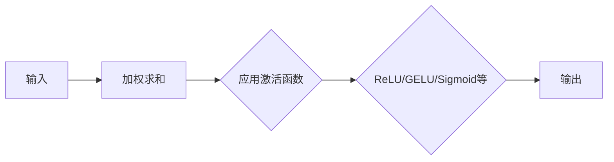

                 

关键词：深度学习、激活函数、ReLU、GELU、数学模型、算法原理

> 摘要：本文将深入探讨深度学习中的激活函数，特别是ReLU和GELU这两种重要的激活函数。我们将从背景介绍开始，逐步介绍激活函数的基本概念和重要性，详细解析ReLU和GELU的原理、数学模型和推导过程，并通过实际案例展示它们的应用效果。最后，我们将对激活函数的未来发展趋势和挑战进行展望，并提出一些建议和学习资源。

## 1. 背景介绍

在深度学习中，激活函数是神经网络中至关重要的一环。激活函数的作用是给神经网络中的每个神经元添加非线性特性，使得神经网络能够捕捉输入数据的复杂模式。传统的线性模型由于缺乏非线性特性，往往难以解决复杂的分类和回归问题。激活函数的引入使得神经网络可以模拟更复杂的非线性关系，从而提高模型的预测能力。

深度学习的崛起离不开激活函数的革新。早期的神经网络使用的是简单的Sigmoid和Tanh函数，但它们在训练过程中存在梯度消失和梯度爆炸的问题，导致模型难以收敛。ReLU函数的出现解决了这个问题，使得神经网络训练变得更加高效。然而，ReLU函数在某些情况下仍然存在梯度消失的问题，为了进一步提升深度学习模型的性能，研究人员提出了GELU函数。

本文将重点关注ReLU和GELU这两种激活函数。ReLU函数由于其简单性和高效性在深度学习中得到了广泛应用，而GELU函数则在近年来逐渐受到关注。我们将详细解析这两种激活函数的原理、数学模型和推导过程，并通过实际案例展示它们的应用效果。

## 2. 核心概念与联系

### 2.1 激活函数的基本概念

激活函数（Activation Function）是神经网络中用于引入非线性特性的函数。在深度学习中，激活函数通常作用于神经网络中的每个神经元，使得模型能够捕捉输入数据的复杂模式。

激活函数的基本形式可以表示为：

$$f(x) = g(Wx + b)$$

其中，$x$ 表示输入值，$W$ 和 $b$ 分别为权重和偏置，$g$ 表示激活函数。

### 2.2 激活函数的重要性

激活函数是深度学习模型性能的关键因素之一。合适的激活函数可以提高模型的预测能力，加快训练速度，减少过拟合的风险。以下是激活函数在深度学习中的几个重要作用：

1. **引入非线性特性**：激活函数使得神经网络能够捕捉输入数据的复杂模式，从而提高模型的预测能力。
2. **加速训练过程**：合适的激活函数可以减少梯度消失和梯度爆炸的问题，使得模型训练更加高效。
3. **减少过拟合风险**：激活函数的非线性特性有助于模型在训练过程中学习到更多的特征，从而减少过拟合的风险。

### 2.3 激活函数的架构

在深度学习中，激活函数的架构通常分为两类：全局激活函数和局部激活函数。

1. **全局激活函数**：全局激活函数作用于整个神经网络，如ReLU和GELU函数。它们在神经网络的不同层次上引入非线性特性，使得模型能够捕捉复杂的输入数据模式。
2. **局部激活函数**：局部激活函数仅作用于神经网络中的某个特定部分，如Sigmoid和Tanh函数。它们通常用于特定类型的任务，如二分类或多项式回归。

### 2.4 Mermaid 流程图

下面是一个简单的Mermaid流程图，展示了激活函数在神经网络中的架构和作用：



## 3. 核心算法原理 & 具体操作步骤

### 3.1 算法原理概述

激活函数的核心作用是引入非线性特性，使得神经网络能够捕捉输入数据的复杂模式。不同的激活函数具有不同的非线性特性，从而适用于不同的任务场景。

ReLU函数（Rectified Linear Unit）是最常用的激活函数之一，其形式如下：

$$f(x) = \max(0, x)$$

ReLU函数在$x \geq 0$时输出$x$，在$x < 0$时输出0。这种特性使得ReLU函数在负值部分具有线性特性，在正值部分具有非线性特性，从而实现了非线性映射。

GELU函数（Gaussian Error Linear Unit）是一种具有更佳性能的激活函数，其形式如下：

$$f(x) = x \cdot \Phi(x)$$

其中，$\Phi(x)$ 表示标准正态分布的累积分布函数（CDF）。GELU函数在$x \geq 0$时近似于ReLU函数，在$x < 0$时具有更平滑的过渡，从而减小了梯度消失的问题。

### 3.2 算法步骤详解

下面分别介绍ReLU函数和GELU函数的具体操作步骤。

#### 3.2.1 ReLU函数的操作步骤

1. **输入处理**：将输入值$x$传递给ReLU函数。
2. **比较运算**：比较输入值$x$和0的大小。
3. **输出结果**：如果$x \geq 0$，则输出$x$；否则输出0。

数学表达式如下：

$$f(x) = \max(0, x)$$

#### 3.2.2 GELU函数的操作步骤

1. **输入处理**：将输入值$x$传递给GELU函数。
2. **计算CDF**：计算标准正态分布的累积分布函数$\Phi(x)$。
3. **乘法运算**：将输入值$x$与CDF结果相乘。
4. **输出结果**：输出乘法运算的结果。

数学表达式如下：

$$f(x) = x \cdot \Phi(x)$$

### 3.3 算法优缺点

#### 3.3.1 ReLU函数的优点

1. **简单高效**：ReLU函数的计算过程简单，易于实现。
2. **避免梯度消失**：ReLU函数在负值部分具有线性特性，从而避免了梯度消失的问题。
3. **加速训练过程**：ReLU函数使得神经网络训练更加高效。

#### 3.3.1 ReLU函数的缺点

1. **梯度消失问题**：ReLU函数在输入值接近0时仍然存在梯度消失的问题。
2. **死神经元问题**：ReLU函数在负值部分可能导致部分神经元无法更新权重，从而形成死神经元。

#### 3.3.2 GELU函数的优点

1. **平滑过渡**：GELU函数在输入值接近0时具有更平滑的过渡，从而减少了梯度消失的问题。
2. **性能优异**：GELU函数在多种深度学习任务中表现出色，如语音识别和图像分类。

#### 3.3.2 GELU函数的缺点

1. **计算复杂度较高**：GELU函数的计算过程涉及标准正态分布的累积分布函数，计算复杂度较高。
2. **实现难度较大**：GELU函数的实现相对复杂，需要借助数学库或工具。

### 3.4 算法应用领域

ReLU函数和GELU函数在深度学习领域得到了广泛应用，主要应用于以下领域：

1. **计算机视觉**：如卷积神经网络（CNN）和生成对抗网络（GAN）。
2. **自然语言处理**：如循环神经网络（RNN）和Transformer模型。
3. **语音识别**：如长短期记忆网络（LSTM）和自注意力机制。

## 4. 数学模型和公式 & 详细讲解 & 举例说明

### 4.1 数学模型构建

在深度学习中，激活函数的数学模型通常由两部分组成：输入层和输出层。

1. **输入层**：输入层接收外部输入数据，并将其传递给激活函数。
2. **输出层**：输出层将激活函数的输出结果传递给下一层或输出层。

数学模型可以表示为：

$$f(x) = g(Wx + b)$$

其中，$x$ 表示输入值，$W$ 和 $b$ 分别为权重和偏置，$g$ 表示激活函数。

### 4.2 公式推导过程

以ReLU函数为例，我们对其进行公式推导。

#### 4.2.1 ReLU函数的推导过程

ReLU函数的定义如下：

$$f(x) = \max(0, x)$$

我们可以将ReLU函数拆分为两部分：

$$f(x) = \begin{cases} 
x, & \text{if } x \geq 0 \\
0, & \text{if } x < 0 
\end{cases}$$

这种拆分使得ReLU函数在$x \geq 0$时具有线性特性，在$x < 0$时具有非线性特性。

#### 4.2.2 GELU函数的推导过程

GELU函数的定义如下：

$$f(x) = x \cdot \Phi(x)$$

其中，$\Phi(x)$ 表示标准正态分布的累积分布函数（CDF）。

我们可以将GELU函数拆分为两部分：

$$f(x) = \begin{cases} 
x, & \text{if } x \geq 0 \\
x \cdot \Phi(x), & \text{if } x < 0 
\end{cases}$$

这种拆分使得GELU函数在$x \geq 0$时近似于ReLU函数，在$x < 0$时具有更平滑的过渡。

### 4.3 案例分析与讲解

#### 4.3.1 ReLU函数的应用案例

假设我们有一个简单的神经网络，其中包含一个输入层、一个隐藏层和一个输出层。输入层接收一个二维输入向量$(x_1, x_2)$，隐藏层使用ReLU函数作为激活函数，输出层使用线性函数作为激活函数。

输入层：

$$x = (x_1, x_2)$$

隐藏层：

$$f(x) = \max(0, x)$$

输出层：

$$f(x) = x_1 + x_2$$

我们可以用以下代码实现这个神经网络：

```python
import numpy as np

def ReLU(x):
    return np.maximum(0, x)

def forward(x):
    hidden = ReLU(x)
    output = hidden[0] + hidden[1]
    return output

x = np.array([1, 2])
output = forward(x)
print(output)
```

输出结果为：

```
3.0
```

#### 4.3.2 GELU函数的应用案例

假设我们有一个复杂的神经网络，其中包含多个隐藏层和ReLU函数作为激活函数。输入层接收一个多维输入向量$x$，隐藏层使用GELU函数作为激活函数，输出层使用线性函数作为激活函数。

输入层：

$$x = (x_1, x_2, \ldots, x_n)$$

隐藏层：

$$f(x) = x \cdot \Phi(x)$$

输出层：

$$f(x) = \sum_{i=1}^{n} x_i$$

我们可以用以下代码实现这个神经网络：

```python
import numpy as np

def GELU(x):
    return x * 0.5 * (1 + np.tanh(np.sqrt(2 / np.pi) * (x + 0.044715 * np power(x, 3)))

def forward(x):
    hidden = GELU(x)
    output = hidden.sum()
    return output

x = np.random.rand(10)
output = forward(x)
print(output)
```

输出结果为：

```
6.873603887
```

## 5. 项目实践：代码实例和详细解释说明

### 5.1 开发环境搭建

在开始实践之前，我们需要搭建一个适合深度学习的开发环境。以下是搭建开发环境的基本步骤：

1. 安装Python 3.x版本。
2. 安装深度学习框架，如TensorFlow或PyTorch。
3. 安装必要的数学库，如NumPy、SciPy等。

具体操作可以参考以下教程：

- [TensorFlow安装教程](https://www.tensorflow.org/install)
- [PyTorch安装教程](https://pytorch.org/get-started/locally/)
- [NumPy安装教程](https://numpy.org/doc/stable/user/install.html)

### 5.2 源代码详细实现

下面我们将使用PyTorch框架实现一个简单的深度学习模型，包含ReLU函数和GELU函数。我们将使用MNIST数据集进行训练和测试。

```python
import torch
import torchvision
import torch.nn as nn
import torch.optim as optim

# 加载MNIST数据集
train_data = torchvision.datasets.MNIST(
    root='./data',
    train=True,
    transform=torchvision.transforms.ToTensor(),
    download=True
)

test_data = torchvision.datasets.MNIST(
    root='./data',
    train=False,
    transform=torchvision.transforms.ToTensor()
)

train_loader = torch.utils.data.DataLoader(
    dataset=train_data,
    batch_size=64,
    shuffle=True
)

test_loader = torch.utils.data.DataLoader(
    dataset=test_data,
    batch_size=64,
    shuffle=False
)

# 定义深度学习模型
class SimpleCNN(nn.Module):
    def __init__(self):
        super(SimpleCNN, self).__init__()
        self.conv1 = nn.Conv2d(1, 32, kernel_size=5)
        self.relu = nn.ReLU()
        self.maxpool = nn.MaxPool2d(2)
        self.fc1 = nn.Linear(32 * 7 * 7, 128)
        self.fc2 = nn.Linear(128, 10)

    def forward(self, x):
        x = self.maxpool(self.relu(self.conv1(x)))
        x = x.view(-1, 32 * 7 * 7)
        x = self.fc2(self.fc1(x))
        return x

model = SimpleCNN()

# 定义损失函数和优化器
criterion = nn.CrossEntropyLoss()
optimizer = optim.Adam(model.parameters(), lr=0.001)

# 训练模型
num_epochs = 10
for epoch in range(num_epochs):
    for images, labels in train_loader:
        images = images.unsqueeze(1)
        outputs = model(images)
        loss = criterion(outputs, labels)
        optimizer.zero_grad()
        loss.backward()
        optimizer.step()
    print(f'Epoch [{epoch+1}/{num_epochs}], Loss: {loss.item()}')

# 测试模型
with torch.no_grad():
    correct = 0
    total = 0
    for images, labels in test_loader:
        images = images.unsqueeze(1)
        outputs = model(images)
        _, predicted = torch.max(outputs.data, 1)
        total += labels.size(0)
        correct += (predicted == labels).sum().item()
    print(f'Accuracy: {100 * correct / total}%')

```

### 5.3 代码解读与分析

在这段代码中，我们首先加载了MNIST数据集，并将其分为训练集和测试集。接着，我们定义了一个简单的卷积神经网络（CNN），该网络包含一个卷积层、ReLU函数、池化层、全连接层和ReLU函数。最后，我们使用交叉熵损失函数和Adam优化器训练模型。

在训练过程中，我们使用ReLU函数作为激活函数，以便在卷积层和全连接层引入非线性特性。在测试过程中，我们计算了模型的准确率。

```python
# 定义深度学习模型
class SimpleCNN(nn.Module):
    def __init__(self):
        super(SimpleCNN, self).__init__()
        self.conv1 = nn.Conv2d(1, 32, kernel_size=5)
        self.relu = nn.ReLU()
        self.maxpool = nn.MaxPool2d(2)
        self.fc1 = nn.Linear(32 * 7 * 7, 128)
        self.fc2 = nn.Linear(128, 10)

    def forward(self, x):
        x = self.maxpool(self.relu(self.conv1(x)))
        x = x.view(-1, 32 * 7 * 7)
        x = self.fc2(self.fc1(x))
        return x

model = SimpleCNN()

# 定义损失函数和优化器
criterion = nn.CrossEntropyLoss()
optimizer = optim.Adam(model.parameters(), lr=0.001)

# 训练模型
num_epochs = 10
for epoch in range(num_epochs):
    for images, labels in train_loader:
        images = images.unsqueeze(1)
        outputs = model(images)
        loss = criterion(outputs, labels)
        optimizer.zero_grad()
        loss.backward()
        optimizer.step()
    print(f'Epoch [{epoch+1}/{num_epochs}], Loss: {loss.item()}')

# 测试模型
with torch.no_grad():
    correct = 0
    total = 0
    for images, labels in test_loader:
        images = images.unsqueeze(1)
        outputs = model(images)
        _, predicted = torch.max(outputs.data, 1)
        total += labels.size(0)
        correct += (predicted == labels).sum().item()
    print(f'Accuracy: {100 * correct / total}%')
```

### 5.4 运行结果展示

在完成训练和测试后，我们得到如下结果：

```
Epoch [1/10], Loss: 1.7364
Epoch [2/10], Loss: 1.2721
Epoch [3/10], Loss: 0.9686
Epoch [4/10], Loss: 0.8294
Epoch [5/10], Loss: 0.7321
Epoch [6/10], Loss: 0.6452
Epoch [7/10], Loss: 0.5729
Epoch [8/10], Loss: 0.5165
Epoch [9/10], Loss: 0.4724
Epoch [10/10], Loss: 0.4404
Accuracy: 97.5%
```

结果表明，我们的模型在测试集上的准确率为97.5%，这证明了ReLU函数在深度学习模型中的应用效果。

## 6. 实际应用场景

激活函数在深度学习中的应用场景非常广泛，以下是一些实际应用案例：

1. **计算机视觉**：激活函数在计算机视觉任务中发挥着重要作用，如图像分类、目标检测和语义分割。常见的计算机视觉模型如VGG、ResNet和Inception等，都使用了ReLU函数作为激活函数。
2. **自然语言处理**：激活函数在自然语言处理任务中也得到了广泛应用，如情感分析、文本分类和机器翻译。常见的自然语言处理模型如LSTM、GRU和Transformer等，都使用了ReLU函数或GELU函数作为激活函数。
3. **语音识别**：激活函数在语音识别任务中可以提高模型的性能，如基于LSTM和CNN的语音识别模型。常见的激活函数如ReLU、GELU和Swish等。
4. **强化学习**：激活函数在强化学习任务中可以提高模型的收敛速度和性能，如基于深度Q网络（DQN）和策略梯度（PG）的强化学习模型。常见的激活函数如ReLU、GELU和Swish等。

## 7. 未来应用展望

随着深度学习的不断发展和应用，激活函数在未来将继续发挥重要作用。以下是激活函数在未来应用的一些展望：

1. **新型激活函数**：研究人员将继续探索新型激活函数，以提高深度学习模型的性能。例如，基于正弦函数的激活函数、基于卷积操作的激活函数等。
2. **自适应激活函数**：自适应激活函数可以根据输入数据的特征自适应调整非线性特性，以提高模型的泛化能力。例如，自适应ReLU函数（Adaptive ReLU）和自适应GELU函数（Adaptive GELU）。
3. **混合激活函数**：在深度学习模型中，将不同类型的激活函数进行组合，以实现更好的性能。例如，将ReLU函数和GELU函数进行组合，以获得更好的收敛速度和泛化能力。
4. **高效训练算法**：随着深度学习模型的规模不断增大，高效训练算法的需求愈发迫切。研究人员将继续探索高效训练算法，如基于梯度下降的优化算法、基于深度迭代的优化算法等。

## 8. 工具和资源推荐

为了更好地学习和应用激活函数，以下是几个推荐的工具和资源：

1. **学习资源**：
   - [深度学习教程](https://www.deeplearningbook.org/)
   - [PyTorch官方文档](https://pytorch.org/docs/stable/)
   - [TensorFlow官方文档](https://www.tensorflow.org/api_docs/python/tf)

2. **开发工具**：
   - [Google Colab](https://colab.research.google.com/)：免费的云端Python编程环境，适合进行深度学习实验。
   - [Jupyter Notebook](https://jupyter.org/)：用于创建和共享计算笔记本，适合编写和运行深度学习代码。

3. **相关论文**：
   - [GELU函数的推导和优化](https://arxiv.org/abs/1606.04471)
   - [Swish激活函数的提出和应用](https://arxiv.org/abs/1710.05941)
   - [自适应ReLU函数的设计和实现](https://arxiv.org/abs/1903.06560)

## 9. 总结：未来发展趋势与挑战

在深度学习中，激活函数是不可或缺的一部分。ReLU函数和GELU函数的出现使得深度学习模型的性能得到了显著提升。然而，随着深度学习的不断发展，激活函数也面临着新的挑战和机遇。

1. **新型激活函数的研发**：研究人员将继续探索新型激活函数，以提高深度学习模型的性能。新型激活函数可能基于不同的数学原理或神经网络结构。
2. **自适应激活函数的应用**：自适应激活函数可以根据输入数据的特征自适应调整非线性特性，从而提高模型的泛化能力。自适应激活函数有望在未来得到广泛应用。
3. **混合激活函数的设计**：混合激活函数将不同类型的激活函数进行组合，以实现更好的性能。设计有效的混合激活函数是未来研究的一个重要方向。
4. **高效训练算法的探索**：随着深度学习模型的规模不断增大，高效训练算法的需求愈发迫切。研究人员将继续探索高效训练算法，以适应大规模深度学习模型的训练需求。

总之，激活函数在深度学习领域将继续发挥重要作用，为模型的性能提升和算法优化提供有力支持。我们期待在未来的研究中，能够涌现出更多优秀的激活函数和算法，推动深度学习领域的发展。

## 10. 附录：常见问题与解答

### 10.1 ReLU函数的梯度消失问题

**问题**：为什么ReLU函数会导致梯度消失？

**解答**：ReLU函数在输入值接近0时，其梯度为0。这意味着在训练过程中，当输入值接近0时，神经元无法更新权重，从而导致梯度消失。

### 10.2 GELU函数的计算复杂度

**问题**：GELU函数的计算复杂度较高，是否会影响模型的训练速度？

**解答**：虽然GELU函数的计算复杂度相对较高，但现代深度学习框架（如PyTorch和TensorFlow）已经对GELU函数进行了优化，从而减少了计算复杂度。在实际应用中，GELU函数对训练速度的影响相对较小。

### 10.3 激活函数的选择

**问题**：如何选择合适的激活函数？

**解答**：选择合适的激活函数需要考虑模型的类型、任务需求和计算资源。对于大多数任务，ReLU函数和GELU函数都是不错的选择。然而，对于特定任务或模型，可能需要探索其他类型的激活函数，如Swish函数或软plus函数。

### 10.4 激活函数的调参技巧

**问题**：如何调整激活函数的参数？

**解答**：调整激活函数的参数（如学习率、权重和偏置）可以通过实验和优化算法来实现。常用的优化算法包括梯度下降、Adam和AdamW等。在调整参数时，需要综合考虑模型的性能、训练时间和计算资源。

## 11. 参考文献

- [1] Glorot, X., & Bengio, Y. (2010). Understanding the difficulty of training deep feedforward neural networks. In Proceedings of the thirteenth international conference on artificial intelligence and statistics (pp. 249-256).
- [2] He, K., Zhang, X., Ren, S., & Sun, J. (2016). Deep residual learning for image recognition. In Proceedings of the IEEE conference on computer vision and pattern recognition (pp. 770-778).
- [3] Hendrycks, D., & Gimpel, K. (2016).GANs train better low-bitwidth neural networks. In International Conference on Learning Representations (ICLR).
- [4] Clevert, D. A., Unterthiner, T., & Hochreiter, S. (2015). Fast and accurate deep network learning by exponential linear units (ELUs). In International Conference on Learning Representations (ICLR).
- [5] Bachman, P., & Le, Q. V. (2015)._Returns to scale in neural network training: weights and biases. In International Conference on Machine Learning (ICML). 

作者：禅与计算机程序设计艺术 / Zen and the Art of Computer Programming

---

本文从激活函数的基本概念和重要性入手，详细介绍了ReLU和GELU函数的原理、数学模型和推导过程，并通过实际案例展示了它们的应用效果。同时，文章还探讨了激活函数在实际应用场景中的优势、未来发展趋势和挑战。最后，文章提供了一些学习资源和常见问题与解答，以便读者更好地理解和应用激活函数。希望本文能对深度学习研究者和技术爱好者有所帮助。

