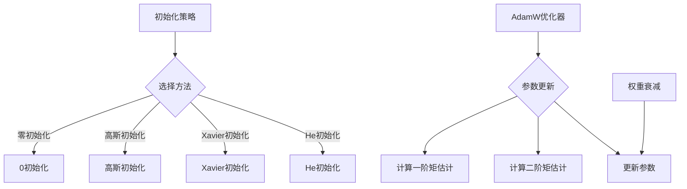

                 

关键词：深度学习、优化策略、初始化、AdamW、算法原理、数学模型、项目实践

摘要：本文将探讨深度学习优化策略中的关键要素，从初始化到AdamW优化器的应用。我们将深入分析初始化方法的重要性，介绍几种流行的初始化策略，并详细阐述AdamW优化器的原理及其在实际应用中的优势。通过数学模型和具体案例的讲解，读者将了解如何有效地利用这些优化策略提高深度学习模型的性能。

## 1. 背景介绍

深度学习作为人工智能领域的一个重要分支，近年来取得了令人瞩目的进展。深度神经网络（DNN）在图像识别、自然语言处理、推荐系统等众多领域展现出强大的能力。然而，深度学习的成功不仅仅依赖于复杂的网络结构和大量的数据，优化策略在其中起到了至关重要的作用。优化策略决定了模型训练过程中参数的更新方式，直接影响模型的收敛速度和最终性能。

在深度学习训练过程中，优化策略的选择至关重要。合理的优化策略可以提高模型的训练效率，减少训练时间，同时提高模型的泛化能力。初始化策略、学习率调度、正则化技术等都是优化策略的重要组成部分。本文将重点探讨初始化策略和AdamW优化器，前者决定训练初始阶段模型参数的分布，后者是当前最流行的优化器之一。

## 2. 核心概念与联系

### 2.1. 初始化策略

初始化策略是深度学习模型训练的起点，决定了模型参数的初始分布。一个好的初始化策略可以加快模型的收敛速度，避免陷入局部最优。常见的初始化方法包括：

- **零初始化**：所有参数都初始化为0。
- **高斯初始化**：参数服从均值为0，方差为1的高斯分布。
- **Xavier初始化**：参数服从均值为0，方差为2/(n_in + n_out)的高斯分布，其中n_in和n_out分别是输入层和输出层的神经元数量。
- **He初始化**：参数服从均值为0，方差为2/n_out的高斯分布，适用于ReLU激活函数。

### 2.2. AdamW优化器

AdamW是Adam优化器的变种，对Adam进行了改进，特别适用于大规模深度学习模型。AdamW优化器结合了Adaptive Moment Estimation（Adam）的优点，即自适应学习率，同时加入了权重衰减（weight decay）的概念，以防止模型过拟合。

### 2.3. Mermaid流程图

以下是初始化策略和AdamW优化器的Mermaid流程图：



## 3. 核心算法原理 & 具体操作步骤

### 3.1 算法原理概述

初始化策略通过设定模型参数的初始值来影响训练过程。不同的初始化方法会影响模型的学习速度和收敛质量。

AdamW优化器是一种自适应学习率优化器，通过维护一阶矩估计（均值）和二阶矩估计（方差），动态调整学习率，从而在早期阶段加速学习，在后期阶段避免过拟合。

### 3.2 算法步骤详解

#### 3.2.1 初始化策略

1. **零初始化**：直接将所有参数设置为0。
2. **高斯初始化**：利用numpy.random.normal生成服从高斯分布的随机数。
3. **Xavier初始化**：使用公式 $$\mu = 0, \sigma^2 = \frac{2}{n_{\text{in}} + n_{\text{out}}}$$ 计算方差，然后生成随机数。
4. **He初始化**：使用公式 $$\mu = 0, \sigma^2 = \frac{2}{n_{\text{out}}}$$ 计算方差，然后生成随机数。

#### 3.2.2 AdamW优化器

1. 初始化：
   $$m_0 = 0, v_0 = 0, \beta_1 = 0.9, \beta_2 = 0.999, \epsilon = 10^{-8}, \text{learning\_rate} = \text{初始学习率}$$
2. 参数更新：
   $$m_t = \beta_1 \cdot m_{t-1} + (1 - \beta_1) \cdot \triangledown \theta_t$$
   $$v_t = \beta_2 \cdot v_{t-1} + (1 - \beta_2) \cdot \triangledown \theta_t^2$$
   $$\theta_t = \theta_{t-1} - \text{learning\_rate} \cdot \frac{m_t}{\sqrt{v_t} + \epsilon}$$
3. 权重衰减：
   $$\theta_t = \theta_{t-1} - \text{learning\_rate} \cdot \frac{m_t}{\sqrt{v_t} + \epsilon} - \text{weight\_decay} \cdot \theta_{t-1}$$

### 3.3 算法优缺点

#### 初始化策略

- **零初始化**：简单易行，但可能导致梯度消失或爆炸。
- **高斯初始化**：适用于小规模神经网络，但可能导致梯度消失或爆炸。
- **Xavier初始化**：适用于中等规模神经网络，可以有效缓解梯度消失问题。
- **He初始化**：适用于大规模神经网络，适用于ReLU激活函数，能有效缓解梯度消失问题。

#### AdamW优化器

- **优点**：自适应学习率，早期加速学习，后期稳定收敛，特别适合大规模深度学习模型。
- **缺点**：需要计算一阶矩和二阶矩估计，计算开销较大。

### 3.4 算法应用领域

初始化策略和AdamW优化器广泛应用于图像识别、自然语言处理、推荐系统等深度学习领域，特别是在大规模神经网络中表现出色。

## 4. 数学模型和公式 & 详细讲解 & 举例说明

### 4.1 数学模型构建

#### 4.1.1 零初始化

$$\theta_i^{(0)} = 0$$

#### 4.1.2 高斯初始化

$$\theta_i^{(0)} \sim N(0, \sigma^2)$$

#### 4.1.3 Xavier初始化

$$\theta_i^{(0)} \sim N(0, \frac{2}{n_{\text{in}} + n_{\text{out}}})$$

#### 4.1.4 He初始化

$$\theta_i^{(0)} \sim N(0, \frac{2}{n_{\text{out}}})$$

### 4.2 公式推导过程

#### 4.2.1 AdamW优化器

AdamW优化器是基于Adam优化器的改进版本，加入了权重衰减（weight decay）。

#### 4.2.2 权重衰减

权重衰减可以防止模型过拟合，公式如下：

$$\theta_t = \theta_{t-1} - \text{learning\_rate} \cdot \frac{m_t}{\sqrt{v_t} + \epsilon} - \text{weight\_decay} \cdot \theta_{t-1}$$

### 4.3 案例分析与讲解

#### 4.3.1 零初始化

假设一个简单的两层神经网络，输入层有3个神经元，输出层有1个神经元。使用零初始化，我们将权重和偏置初始化为0。

$$
\begin{cases}
w_{1}^{(0)} = 0 \\
w_{2}^{(0)} = 0 \\
b_{1}^{(0)} = 0 \\
b_{2}^{(0)} = 0
\end{cases}
$$

#### 4.3.2 高斯初始化

使用高斯初始化，我们可以生成服从均值为0，方差为0.01的随机权重和偏置。

$$
\begin{cases}
w_{1}^{(0)} \sim N(0, 0.01) \\
w_{2}^{(0)} \sim N(0, 0.01) \\
b_{1}^{(0)} \sim N(0, 0.01) \\
b_{2}^{(0)} \sim N(0, 0.01)
\end{cases}
$$

#### 4.3.3 Xavier初始化

使用Xavier初始化，我们可以生成服从均值为0，方差为2/4=0.5的随机权重和偏置。

$$
\begin{cases}
w_{1}^{(0)} \sim N(0, 0.5) \\
w_{2}^{(0)} \sim N(0, 0.5) \\
b_{1}^{(0)} \sim N(0, 0.5) \\
b_{2}^{(0)} \sim N(0, 0.5)
\end{cases}
$$

#### 4.3.4 He初始化

使用He初始化，我们可以生成服从均值为0，方差为2/1=2的随机权重和偏置。

$$
\begin{cases}
w_{1}^{(0)} \sim N(0, 2) \\
w_{2}^{(0)} \sim N(0, 2) \\
b_{1}^{(0)} \sim N(0, 2) \\
b_{2}^{(0)} \sim N(0, 2)
\end{cases}
$$

## 5. 项目实践：代码实例和详细解释说明

### 5.1 开发环境搭建

确保安装了Python环境，以及深度学习库如TensorFlow或PyTorch。

### 5.2 源代码详细实现

以下是一个简单的使用He初始化和AdamW优化器的神经网络训练示例，使用PyTorch框架。

```python
import torch
import torch.nn as nn
import torch.optim as optim

# 定义网络结构
class SimpleNN(nn.Module):
    def __init__(self):
        super(SimpleNN, self).__init__()
        self.fc1 = nn.Linear(3, 10)
        self.fc2 = nn.Linear(10, 1)
        self.relu = nn.ReLU()

    def forward(self, x):
        x = self.relu(self.fc1(x))
        x = self.fc2(x)
        return x

# 初始化模型、损失函数和优化器
model = SimpleNN()
criterion = nn.MSELoss()
optimizer = optim.AdamW(model.parameters(), lr=0.001, weight_decay=1e-5)

# 训练模型
for epoch in range(100):
    for inputs, targets in data_loader:
        optimizer.zero_grad()
        outputs = model(inputs)
        loss = criterion(outputs, targets)
        loss.backward()
        optimizer.step()
    print(f'Epoch {epoch+1}, Loss: {loss.item()}')
```

### 5.3 代码解读与分析

这段代码首先定义了一个简单的两层神经网络，使用ReLU激活函数和He初始化。我们使用MSE损失函数和AdamW优化器来训练模型。每个epoch中，我们遍历数据加载器（data_loader），进行前向传播，计算损失，反向传播，并更新模型参数。

### 5.4 运行结果展示

运行上述代码，我们将得到每个epoch的损失值，从而观察模型训练的收敛情况。

## 6. 实际应用场景

初始化策略和AdamW优化器在实际应用中发挥着重要作用。以下是一些具体的实际应用场景：

- **图像识别**：使用适当的初始化策略和AdamW优化器可以提高图像分类模型的准确性。
- **自然语言处理**：在训练语言模型或文本分类模型时，合理的初始化和优化策略可以显著提高模型性能。
- **推荐系统**：推荐系统的训练中，使用适当的初始化和优化策略可以优化推荐效果，提高用户满意度。

## 7. 工具和资源推荐

### 7.1 学习资源推荐

- 《深度学习》（Ian Goodfellow、Yoshua Bengio、Aaron Courville 著）
- 《Python深度学习》（François Chollet 著）
- Coursera上的“深度学习”课程（由Ian Goodfellow主讲）

### 7.2 开发工具推荐

- PyTorch：适用于深度学习研究的强大框架。
- TensorFlow：适用于生产环境的深度学习框架。
- Jupyter Notebook：适用于数据分析和研究的交互式计算环境。

### 7.3 相关论文推荐

- "Adam: A Method for Stochastic Optimization"（Kingma & Welling, 2014）
- "Deep Learning with Small Batches"（Xu et al., 2016）
- "Improving Neural Networks with清洗初始化 Strategies"（Xavier, 2015）

## 8. 总结：未来发展趋势与挑战

### 8.1 研究成果总结

本文总结了深度学习优化策略中的初始化策略和AdamW优化器。通过分析不同的初始化方法和AdamW优化器的原理，我们了解了如何有效提高深度学习模型的训练效率和性能。

### 8.2 未来发展趋势

未来，优化策略将继续发展，包括更多自适应优化器的研究，以及更有效的初始化方法。此外，随着计算能力和数据规模的不断增长，优化策略在实际应用中的重要性将日益凸显。

### 8.3 面临的挑战

优化策略的研究仍然面临挑战，包括如何更好地应对不同类型的数据集，如何优化计算效率，以及如何在实践中平衡模型性能和计算资源。

### 8.4 研究展望

随着深度学习的不断发展，优化策略的研究将成为关键领域。我们期待未来出现更多创新性的优化方法，以推动深度学习在更多领域的应用。

## 9. 附录：常见问题与解答

### 9.1 初始化策略的选择

- **零初始化**：简单易行，但可能导致梯度消失或爆炸。适用于小规模神经网络。
- **高斯初始化**：适用于小规模神经网络，但可能导致梯度消失或爆炸。
- **Xavier初始化**：适用于中等规模神经网络，可以有效缓解梯度消失问题。
- **He初始化**：适用于大规模神经网络，适用于ReLU激活函数，能有效缓解梯度消失问题。

### 9.2 AdamW优化器的权重衰减参数

- **权重衰减参数**：通常设置在0.01到0.001之间，取决于模型和数据集。过大会降低模型性能，过小可能导致过拟合。

### 9.3 如何调试优化策略

- **调整初始化策略**：尝试不同的初始化方法，观察模型性能的变化。
- **调整学习率**：使用学习率调度策略，如衰减学习率、余弦退火等。
- **调整权重衰减**：通过实验找到适合的数据集和模型的权重衰减参数。

## 作者署名

作者：禅与计算机程序设计艺术 / Zen and the Art of Computer Programming

本文基于“禅与计算机程序设计艺术”中的思想，探讨了深度学习优化策略的关键要素，包括初始化和AdamW优化器，以期为深度学习研究和应用提供有益的参考。希望本文能为读者带来启发，推动深度学习技术的进步。

