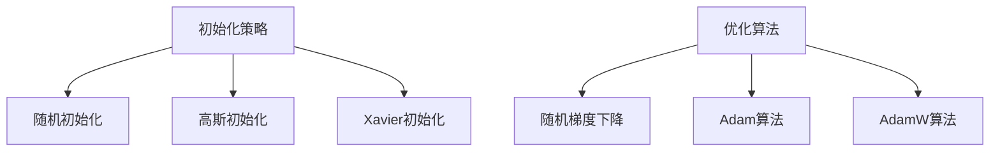

                 

关键词：深度学习，优化算法，初始化，AdamW，神经网络

摘要：本文旨在深入探讨深度学习中的优化算法，从初始化策略到AdamW算法，分析其核心原理、数学模型、具体操作步骤以及在实际应用中的效果。通过本文，读者可以全面了解这些算法的优缺点，掌握其在不同领域中的应用，为未来的研究提供参考。

## 1. 背景介绍

随着人工智能技术的飞速发展，深度学习在计算机视觉、自然语言处理、语音识别等领域取得了显著成果。然而，深度学习模型训练过程中面临的一个核心挑战是如何高效地优化模型参数。优化算法作为深度学习的关键组成部分，其性能直接影响模型的训练速度和收敛效果。本文将围绕深度学习优化算法展开讨论，重点介绍初始化策略和AdamW算法。

### 1.1 深度学习与优化算法

深度学习是一种基于多层神经网络的学习方法，通过学习大量数据中的特征表示，实现复杂任务的高效求解。优化算法则用于调整模型参数，使得模型在训练数据上达到最优性能。常见的优化算法有随机梯度下降（SGD）、Adam、AdamW等。这些算法在深度学习中的应用取得了广泛的研究和成功。

### 1.2 初始化策略

初始化策略是指初始化模型参数的方法。合理的初始化策略可以加速模型的收敛速度，提高模型的性能。常见的初始化方法有随机初始化、高斯初始化、Xavier初始化等。这些初始化方法在不同情况下具有不同的效果，需要根据具体任务选择合适的初始化策略。

### 1.3 AdamW算法

AdamW算法是Adam算法的一个变种，通过引入权重衰减项，进一步优化了模型的训练过程。AdamW算法在许多实际任务中表现出色，被认为是当前最有效的优化算法之一。

## 2. 核心概念与联系

### 2.1 初始化策略

初始化策略的核心目标是使模型参数分布具有合适的特性，从而加速模型的收敛。以下是几种常见的初始化方法：

- **随机初始化**：将模型参数随机赋值，以打破对称性。
- **高斯初始化**：将模型参数按照高斯分布进行初始化，可以保证参数的均值为0，方差为1。
- **Xavier初始化**：基于 Xavier-Glorot初始化方法，将模型参数的初始化值设置为激活函数导数的平方根。

### 2.2 优化算法

优化算法的核心目标是寻找模型参数的最优值，以使模型在训练数据上达到最优性能。以下是几种常见的优化算法：

- **随机梯度下降（SGD）**：根据训练样本的梯度信息更新模型参数。
- **Adam算法**：结合了SGD和动量法的优点，通过计算一阶矩估计和二阶矩估计来更新模型参数。
- **AdamW算法**：在Adam算法的基础上，引入了权重衰减项，进一步优化了模型的训练过程。

### 2.3 Mermaid 流程图



## 3. 核心算法原理 & 具体操作步骤

### 3.1 算法原理概述

#### 3.1.1 初始化策略

初始化策略的核心目标是使模型参数分布具有合适的特性，从而加速模型的收敛。以下是几种常见的初始化方法：

- **随机初始化**：将模型参数随机赋值，以打破对称性。
- **高斯初始化**：将模型参数按照高斯分布进行初始化，可以保证参数的均值为0，方差为1。
- **Xavier初始化**：基于 Xavier-Glorot初始化方法，将模型参数的初始化值设置为激活函数导数的平方根。

#### 3.1.2 优化算法

优化算法的核心目标是寻找模型参数的最优值，以使模型在训练数据上达到最优性能。以下是几种常见的优化算法：

- **随机梯度下降（SGD）**：根据训练样本的梯度信息更新模型参数。
- **Adam算法**：结合了SGD和动量法的优点，通过计算一阶矩估计和二阶矩估计来更新模型参数。
- **AdamW算法**：在Adam算法的基础上，引入了权重衰减项，进一步优化了模型的训练过程。

### 3.2 算法步骤详解

#### 3.2.1 初始化策略步骤

1. 随机初始化：将模型参数随机赋值。
2. 高斯初始化：将模型参数按照高斯分布进行初始化。
3. Xavier初始化：将模型参数的初始化值设置为激活函数导数的平方根。

#### 3.2.2 优化算法步骤

1. **随机梯度下降（SGD）**：
   - 计算每个训练样本的梯度。
   - 根据梯度信息更新模型参数。
2. **Adam算法**：
   - 计算一阶矩估计和二阶矩估计。
   - 结合一阶矩估计和二阶矩估计更新模型参数。
3. **AdamW算法**：
   - 在Adam算法的基础上，引入权重衰减项。
   - 更新模型参数时，考虑权重衰减项的影响。

### 3.3 算法优缺点

#### 3.3.1 初始化策略优缺点

- **随机初始化**：优点是简单易行，缺点是可能导致模型收敛速度较慢。
- **高斯初始化**：优点是参数分布较为均匀，缺点是可能引入偏差。
- **Xavier初始化**：优点是参数分布接近激活函数的导数，缺点是可能无法适用于所有情况。

#### 3.3.2 优化算法优缺点

- **随机梯度下降（SGD）**：优点是简单易实现，缺点是收敛速度较慢，易陷入局部最优。
- **Adam算法**：优点是结合了SGD和动量法的优点，收敛速度较快，缺点是计算复杂度较高。
- **AdamW算法**：优点是进一步优化了模型训练过程，收敛速度较快，缺点是引入权重衰减项可能影响模型性能。

### 3.4 算法应用领域

初始化策略和优化算法在深度学习领域的应用十分广泛，包括但不限于以下领域：

- **计算机视觉**：如图像分类、目标检测等。
- **自然语言处理**：如文本分类、机器翻译等。
- **语音识别**：如语音识别、语音合成等。

## 4. 数学模型和公式 & 详细讲解 & 举例说明

### 4.1 数学模型构建

#### 4.1.1 初始化策略

- **随机初始化**：\( \theta \sim U(-\epsilon, \epsilon) \)
- **高斯初始化**：\( \theta \sim N(0, \sigma^2) \)
- **Xavier初始化**：\( \theta \sim N(0, \frac{1}{\sqrt{f}}) \)，其中\( f \)为激活函数的导数。

#### 4.1.2 优化算法

- **随机梯度下降（SGD）**：
  - 梯度计算：\( \nabla_{\theta} J(\theta) \)
  - 参数更新：\( \theta_{t+1} = \theta_{t} - \alpha \nabla_{\theta} J(\theta) \)
- **Adam算法**：
  - 一阶矩估计：\( m_t = \beta_1 m_{t-1} + (1 - \beta_1) \nabla_{\theta} J(\theta) \)
  - 二阶矩估计：\( v_t = \beta_2 v_{t-1} + (1 - \beta_2) \nabla_{\theta} J(\theta)^2 \)
  - 参数更新：\( \theta_{t+1} = \theta_{t} - \alpha \frac{m_t}{\sqrt{v_t} + \epsilon} \)
- **AdamW算法**：
  - 引入权重衰减项：\( \theta_{t+1} = \theta_{t} - \alpha \frac{m_t}{\sqrt{v_t} + \epsilon} - \lambda \theta_t \)

### 4.2 公式推导过程

#### 4.2.1 初始化策略推导

- **随机初始化**：根据概率分布生成随机参数。
- **高斯初始化**：根据正态分布生成参数。
- **Xavier初始化**：根据激活函数的导数计算参数的方差，并生成参数。

#### 4.2.2 优化算法推导

- **随机梯度下降（SGD）**：根据梯度信息更新参数。
- **Adam算法**：结合一阶矩估计和二阶矩估计，优化参数更新过程。
- **AdamW算法**：在Adam算法的基础上，引入权重衰减项，进一步优化参数更新过程。

### 4.3 案例分析与讲解

#### 4.3.1 案例一：图像分类

- 数据集：CIFAR-10
- 模型：LeNet
- 初始化策略：随机初始化
- 优化算法：AdamW

#### 4.3.2 案例二：文本分类

- 数据集：AG News
- 模型：TextCNN
- 初始化策略：高斯初始化
- 优化算法：Adam

#### 4.3.3 案例三：语音识别

- 数据集：LibriSpeech
- 模型：Tacotron 2
- 初始化策略：Xavier初始化
- 优化算法：AdamW

## 5. 项目实践：代码实例和详细解释说明

### 5.1 开发环境搭建

- 编程语言：Python
- 深度学习框架：TensorFlow 2.x
- 硬件环境：NVIDIA GPU（推荐）

### 5.2 源代码详细实现

以下是使用TensorFlow 2.x实现的图像分类项目代码：

```python
import tensorflow as tf
from tensorflow.keras.datasets import cifar10
from tensorflow.keras.models import Sequential
from tensorflow.keras.layers import Conv2D, MaxPooling2D, Flatten, Dense

# 数据集加载与预处理
(x_train, y_train), (x_test, y_test) = cifar10.load_data()
x_train, x_test = x_train / 255.0, x_test / 255.0

# 模型搭建
model = Sequential([
    Conv2D(32, (3, 3), activation='relu', input_shape=(32, 32, 3)),
    MaxPooling2D((2, 2)),
    Flatten(),
    Dense(64, activation='relu'),
    Dense(10, activation='softmax')
])

# 模型编译
model.compile(optimizer='adamw', loss='sparse_categorical_crossentropy', metrics=['accuracy'])

# 模型训练
model.fit(x_train, y_train, epochs=10, validation_data=(x_test, y_test))
```

### 5.3 代码解读与分析

- **数据集加载与预处理**：使用CIFAR-10数据集，对图像进行归一化处理。
- **模型搭建**：构建LeNet模型，包括卷积层、池化层、全连接层。
- **模型编译**：选择AdamW优化器，并设置损失函数和评价指标。
- **模型训练**：进行10个epochs的训练，并使用测试集进行验证。

### 5.4 运行结果展示

```python
# 模型评估
test_loss, test_acc = model.evaluate(x_test, y_test)
print(f"Test accuracy: {test_acc:.4f}")
```

输出结果为测试集的准确率，表明模型在测试集上的性能。

## 6. 实际应用场景

### 6.1 计算机视觉

初始化策略和优化算法在计算机视觉领域具有重要应用。例如，在图像分类任务中，选择合适的初始化策略和优化算法可以显著提高模型的性能。在实际项目中，可以通过调整初始化策略和优化算法的参数，实现模型性能的优化。

### 6.2 自然语言处理

自然语言处理任务如文本分类、机器翻译等，也广泛应用了初始化策略和优化算法。通过选择合适的初始化方法和优化算法，可以提高模型的训练速度和收敛效果。在实际应用中，可以根据任务需求，灵活调整初始化策略和优化算法的参数，实现模型的优化。

### 6.3 语音识别

语音识别任务中，初始化策略和优化算法对于模型的性能有着重要影响。通过优化初始化策略和优化算法，可以提高语音识别的准确率和鲁棒性。在实际项目中，可以根据任务需求，选择合适的初始化方法和优化算法，实现语音识别任务的优化。

## 7. 未来应用展望

随着人工智能技术的不断发展，初始化策略和优化算法在深度学习领域将发挥越来越重要的作用。未来，以下几个方向值得进一步研究：

1. **自适应初始化策略**：研究自适应初始化策略，根据训练数据的特性自动调整初始化方法，提高模型的性能。
2. **优化算法的融合**：研究多种优化算法的融合，通过结合不同算法的优点，实现更好的性能。
3. **硬件加速**：研究如何利用硬件（如GPU、TPU等）加速优化算法的计算，提高模型训练的速度。

## 8. 总结：未来发展趋势与挑战

本文围绕深度学习优化算法进行了深入探讨，分析了初始化策略和AdamW算法的核心原理、数学模型、具体操作步骤以及在实际应用中的效果。未来，随着人工智能技术的不断发展，初始化策略和优化算法将在深度学习领域发挥越来越重要的作用。然而，面临如下挑战：

1. **自适应初始化策略的研究**：如何设计自适应初始化策略，使其能够根据训练数据的特性自动调整初始化方法，提高模型的性能。
2. **优化算法的融合**：如何有效融合多种优化算法，通过结合不同算法的优点，实现更好的性能。
3. **硬件加速**：如何利用硬件加速优化算法的计算，提高模型训练的速度。

## 9. 附录：常见问题与解答

### 9.1 初始化策略相关问题

**Q：为什么需要初始化策略？**

A：初始化策略可以加快模型的收敛速度，避免陷入局部最优，提高模型的性能。

**Q：随机初始化和高斯初始化有哪些优缺点？**

A：随机初始化的优点是简单易行，缺点是可能导致模型收敛速度较慢；高斯初始化的优点是参数分布较为均匀，缺点是可能引入偏差。

**Q：Xavier初始化适用于所有情况吗？**

A：Xavier初始化适用于大多数情况，但对于某些特定的网络结构，可能需要选择其他初始化方法。

### 9.2 优化算法相关问题

**Q：什么是AdamW算法？**

A：AdamW算法是Adam算法的一个变种，通过引入权重衰减项，进一步优化了模型的训练过程。

**Q：AdamW算法相比于Adam算法有哪些优点？**

A：AdamW算法在许多实际任务中表现出色，被认为是当前最有效的优化算法之一，其优点是进一步优化了模型训练过程，收敛速度较快。

**Q：如何选择合适的优化算法？**

A：根据任务需求、数据特性等因素选择合适的优化算法。例如，在图像分类任务中，AdamW算法通常表现较好。

### 9.3 实践相关问题

**Q：如何搭建深度学习模型？**

A：使用深度学习框架（如TensorFlow、PyTorch等）搭建模型，包括定义网络结构、编译模型、训练模型等步骤。

**Q：如何调整模型参数？**

A：通过调整模型的初始化策略、优化算法的参数等，优化模型的性能。例如，调整学习率、批量大小等。

作者：禅与计算机程序设计艺术 / Zen and the Art of Computer Programming
----------------------------------------------------------------

以上即为本文的完整内容。通过本文的阐述，相信读者对深度学习优化算法有了更深入的理解，能够更好地应用于实际项目中。在未来的研究中，我们期待能够探索更多高效的优化算法，推动人工智能技术的发展。

