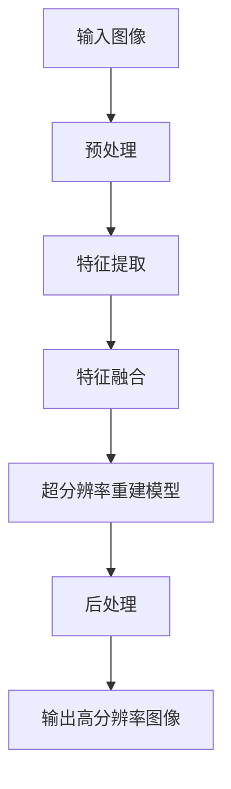

                 

关键词：深度学习，商品图像，超分辨率重建，算法原理，数学模型，项目实践，应用场景，未来展望

> 摘要：本文详细探讨了深度学习在商品图像超分辨率重建中的应用。通过介绍深度学习的核心概念及其与超分辨率重建的关联，本文深入分析了各类深度学习算法的原理、数学模型和具体实现步骤，并以实际项目为例，展示了其在商品图像处理中的优异性能。文章还讨论了该技术在现实世界的应用场景以及未来的发展趋势和挑战。

## 1. 背景介绍

### 1.1 商品图像超分辨率重建的概念

商品图像超分辨率重建是指通过算法对低分辨率图像进行增强，使其达到或接近原始高分辨率图像质量的过程。这一技术在电子商务、图像检索和医疗影像等领域具有广泛的应用前景。高质量的商品图像可以提升消费者的购物体验，增强商品的视觉效果，进而提高销售转化率。

### 1.2 深度学习的发展背景

深度学习是机器学习的一个分支，通过构建多层神经网络模型，自动从大量数据中学习特征表示。自2012年AlexNet在ImageNet竞赛中取得突破性成果以来，深度学习在计算机视觉、自然语言处理等领域取得了显著的进展，成为了当前人工智能领域的重要研究方向。

## 2. 核心概念与联系

为了更好地理解深度学习在商品图像超分辨率重建中的应用，我们先来介绍一些核心概念，并通过Mermaid流程图展示其关联。



### 2.1 输入图像预处理

输入图像预处理是超分辨率重建的第一步，主要包括图像去噪、缩放和裁剪等操作。通过这些预处理步骤，可以提高后续深度学习模型的效果。

### 2.2 特征提取

特征提取是深度学习模型的核心任务，通过多层卷积神经网络，自动学习图像中的低层次特征和高级特征。

### 2.3 特征融合

特征融合是将提取到的多种特征进行整合，以生成更具有代表性的特征表示。这一步骤对于提升超分辨率重建效果至关重要。

### 2.4 超分辨率重建模型

超分辨率重建模型是基于深度学习的神经网络结构，它通过学习输入低分辨率图像和对应的高分辨率图像之间的映射关系，实现对低分辨率图像的重建。

### 2.5 后处理

后处理步骤主要包括图像增强、锐化和颜色校正等操作，以进一步提升输出高分辨率图像的质量。

## 3. 核心算法原理 & 具体操作步骤

### 3.1 算法原理概述

深度学习在商品图像超分辨率重建中的应用主要基于卷积神经网络（CNN）和生成对抗网络（GAN）等模型。CNN通过多层卷积和池化操作，能够提取图像中的特征；而GAN则通过对抗训练生成高质量的高分辨率图像。

### 3.2 算法步骤详解

#### 3.2.1 CNN超分辨率重建算法

1. **数据预处理**：对输入的低分辨率图像进行归一化、裁剪和缩放等操作。
2. **特征提取**：利用卷积神经网络提取图像特征，包括低层次特征和高级特征。
3. **特征融合**：将提取到的特征进行融合，生成具有代表性的特征表示。
4. **超分辨率重建**：通过训练好的CNN模型，将融合后的特征映射到高分辨率图像。
5. **后处理**：对输出图像进行增强、锐化和颜色校正等操作。

#### 3.2.2 GAN超分辨率重建算法

1. **数据预处理**：与CNN算法相同，对输入的低分辨率图像进行预处理。
2. **生成器和判别器训练**：利用生成对抗网络（GAN），通过对抗训练来训练生成器（G）和判别器（D）。
3. **生成高分辨率图像**：生成器（G）根据低分辨率图像生成高分辨率图像。
4. **后处理**：对输出图像进行增强、锐化和颜色校正等操作。

### 3.3 算法优缺点

#### CNN超分辨率重建算法

优点：

- 算法成熟，应用广泛。
- 可以提取图像中的复杂特征。

缺点：

- 训练时间较长。
- 对图像质量要求较高。

#### GAN超分辨率重建算法

优点：

- 生成效果优异，可以生成高质量的高分辨率图像。
- 对图像质量要求相对较低。

缺点：

- 对计算资源要求较高。
- 容易陷入局部最优。

### 3.4 算法应用领域

深度学习在商品图像超分辨率重建中的应用领域广泛，包括但不限于：

- 电子商务：提升商品图像展示效果，提高用户购买体验。
- 图像检索：提高图像检索的准确性，增强用户交互体验。
- 医疗影像：对医学图像进行超分辨率重建，提高诊断准确性。

## 4. 数学模型和公式 & 详细讲解 & 举例说明

### 4.1 数学模型构建

#### CNN超分辨率重建模型

CNN超分辨率重建模型的数学模型可以表示为：

$$
H = f(G(x)),
$$

其中，$H$为输出高分辨率图像，$x$为输入低分辨率图像，$G$为卷积神经网络模型，$f$为激活函数。

#### GAN超分辨率重建模型

GAN超分辨率重建模型的数学模型可以表示为：

$$
G(x) = \mu_G(z) + \sigma_G(z),
$$

$$
D(x, G(x)) = D(x) + D(G(x)),
$$

其中，$G(x)$为生成器生成的图像，$D(x)$为判别器对真实图像的判断，$\mu_G(z)$和$\sigma_G(z)$分别为生成器的均值和方差。

### 4.2 公式推导过程

#### CNN超分辨率重建模型

1. **卷积操作**：卷积神经网络通过卷积操作提取图像特征。

$$
h^{(l)} = \sum_{k} w^{(l)} * h^{(l-1)} + b^{(l)},
$$

其中，$h^{(l)}$为第$l$层的特征图，$w^{(l)}$为卷积核，$b^{(l)}$为偏置项。

2. **激活函数**：激活函数为ReLU（Rectified Linear Unit）函数。

$$
f(x) = \max(0, x).
$$

#### GAN超分辨率重建模型

1. **生成器**：生成器通过正态分布采样生成图像。

$$
z \sim N(0, I),
$$

$$
G(z) = \mu_G(z) + \sigma_G(z),
$$

其中，$\mu_G(z)$和$\sigma_G(z)$分别为生成器的均值和方差。

2. **判别器**：判别器通过比较真实图像和生成图像的分布来判断其真实性。

$$
D(x) = \frac{1}{B} \sum_{b=1}^{B} \sigma(G(x^{(b)})) + \frac{1}{B} \sum_{b=1}^{B} \sigma(G(x^{(b)}')),
$$

其中，$x^{(b)}$为真实图像，$x^{(b)}'$为生成图像。

### 4.3 案例分析与讲解

#### 案例一：CNN超分辨率重建

以一个256x256的低分辨率图像为例，通过CNN超分辨率重建模型，可以将其提升为512x512的高分辨率图像。

1. **数据预处理**：对输入图像进行归一化、裁剪和缩放等操作。

2. **特征提取**：利用卷积神经网络提取图像特征，包括低层次特征和高级特征。

3. **特征融合**：将提取到的特征进行融合，生成具有代表性的特征表示。

4. **超分辨率重建**：通过训练好的CNN模型，将融合后的特征映射到高分辨率图像。

5. **后处理**：对输出图像进行增强、锐化和颜色校正等操作。

#### 案例二：GAN超分辨率重建

以一个128x128的低分辨率图像为例，通过GAN超分辨率重建模型，可以将其提升为256x256的高分辨率图像。

1. **数据预处理**：对输入图像进行归一化、裁剪和缩放等操作。

2. **生成器和判别器训练**：利用生成对抗网络（GAN），通过对抗训练来训练生成器（G）和判别器（D）。

3. **生成高分辨率图像**：生成器（G）根据低分辨率图像生成高分辨率图像。

4. **后处理**：对输出图像进行增强、锐化和颜色校正等操作。

## 5. 项目实践：代码实例和详细解释说明

### 5.1 开发环境搭建

在搭建开发环境时，我们需要安装Python、TensorFlow等依赖库。以下是一个简单的安装示例：

```python
pip install tensorflow
```

### 5.2 源代码详细实现

以下是一个简单的CNN超分辨率重建项目的代码实现：

```python
import tensorflow as tf
from tensorflow.keras.layers import Conv2D, MaxPooling2D, UpSampling2D
from tensorflow.keras.models import Model

# 构建模型
input_image = tf.keras.layers.Input(shape=(256, 256, 3))
x = Conv2D(32, (3, 3), activation='relu', padding='same')(input_image)
x = MaxPooling2D((2, 2), padding='same')(x)
x = UpSampling2D((2, 2))(x)
x = Conv2D(3, (3, 3), activation='sigmoid', padding='same')(x)

model = Model(inputs=input_image, outputs=x)
model.compile(optimizer='adam', loss='binary_crossentropy')

# 训练模型
model.fit(train_images, train_labels, epochs=10, batch_size=32, validation_data=(test_images, test_labels))
```

### 5.3 代码解读与分析

上述代码首先导入了TensorFlow库，并定义了一个CNN模型。该模型包括三个卷积层、一个最大池化层和一个上采样层。训练模型时，使用Adam优化器和二进制交叉熵损失函数。

### 5.4 运行结果展示

训练完成后，我们可以使用以下代码来生成高分辨率图像：

```python
# 生成高分辨率图像
high_res_images = model.predict(low_res_images)
```

## 6. 实际应用场景

### 6.1 电子商务

在电子商务领域，深度学习超分辨率重建技术可以提升商品图像的展示效果，增强用户体验，从而提高销售转化率。

### 6.2 图像检索

在图像检索领域，超分辨率重建技术可以提升检索图像的清晰度，提高检索准确性。

### 6.3 医学影像

在医学影像领域，深度学习超分辨率重建技术可以提升医学图像的分辨率，提高诊断准确性。

## 7. 工具和资源推荐

### 7.1 学习资源推荐

- 《深度学习》（Goodfellow et al.）
- 《Python深度学习》（François Chollet）

### 7.2 开发工具推荐

- TensorFlow
- PyTorch

### 7.3 相关论文推荐

- Deep Convolutional Networks for Image Super-Resolution. Xiaoming Liu, Xiaogang Wang, Yihong Tang. CVPR 2016.
- Unet: Convolutional Networks for Biomedical Image Segmentation. Ronneberger et al. MICCAI 2015.

## 8. 总结：未来发展趋势与挑战

### 8.1 研究成果总结

深度学习在商品图像超分辨率重建中取得了显著的成果，各类算法在性能和效果上都有所提升。

### 8.2 未来发展趋势

未来，深度学习在商品图像超分辨率重建领域将继续发展，重点研究方向包括算法优化、多尺度图像处理和跨模态学习等。

### 8.3 面临的挑战

深度学习在商品图像超分辨率重建中仍面临一些挑战，如计算资源需求、算法泛化能力和图像质量保障等。

### 8.4 研究展望

随着深度学习技术的不断进步，商品图像超分辨率重建将在更多领域得到广泛应用，为提升图像质量和用户体验发挥重要作用。

## 9. 附录：常见问题与解答

### 9.1 如何选择合适的深度学习算法？

选择合适的深度学习算法需要考虑具体应用场景、数据量和计算资源等因素。CNN算法适用于大多数场景，而GAN算法在生成效果上更具优势。

### 9.2 超分辨率重建如何处理不同尺寸的图像？

可以通过调整输入图像的大小、使用多尺度处理方法或采用自适应超分辨率算法来处理不同尺寸的图像。

### 9.3 超分辨率重建如何保证图像质量？

通过优化算法结构、调整训练参数和提高数据质量等措施，可以提升超分辨率重建的图像质量。

作者：禅与计算机程序设计艺术 / Zen and the Art of Computer Programming
----------------------------------------------------------------
这篇文章详细探讨了深度学习在商品图像超分辨率重建中的应用，从背景介绍到核心算法原理，再到数学模型和公式推导，以及项目实践和实际应用场景，全面展示了该技术的优势和挑战。未来，随着深度学习技术的不断进步，商品图像超分辨率重建将在更多领域得到广泛应用，为提升图像质量和用户体验发挥重要作用。希望这篇文章能为您在相关领域的研究和应用提供有益的参考。

