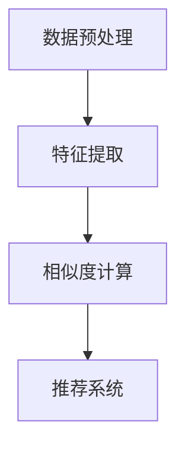

                 

深度学习是近年来人工智能领域的一项重要技术，其在计算机视觉、自然语言处理等多个领域取得了显著的成果。本文将探讨深度学习在商品相似度计算中的应用，通过阐述其核心概念、算法原理、数学模型以及实际应用，旨在为读者提供一个全面、深入的理解。

## 文章关键词

深度学习，商品相似度计算，神经网络，数据挖掘，协同过滤

## 文章摘要

本文首先介绍了商品相似度计算的重要性及其在电子商务中的应用场景。然后，深入分析了深度学习的基本原理及其在商品相似度计算中的优势。接着，通过一个具体的算法案例，详细阐述了如何利用深度学习技术进行商品相似度计算。最后，本文探讨了该技术在实际应用中的挑战和未来发展方向。

## 1. 背景介绍

### 1.1 商品相似度计算的重要性

在电子商务中，商品相似度计算是一项基础且重要的技术。它能够帮助电商平台为用户提供个性化的推荐服务，从而提升用户体验和销售业绩。具体来说，商品相似度计算有以下几个重要作用：

1. **个性化推荐**：通过计算用户历史行为与商品特征之间的相似度，系统可以为用户提供更符合其兴趣和需求的商品推荐。
2. **新品推广**：为新商品找到与其相似的热销商品，有助于提高新商品的曝光率和销售量。
3. **库存管理**：相似商品的库存管理更加科学合理，有助于降低库存成本和提高库存周转率。

### 1.2 深度学习的基本概念

深度学习是一种基于多层神经网络的学习方式，通过模拟人脑神经网络的结构和功能，实现对复杂数据的高效处理和模式识别。深度学习的关键组成部分包括：

1. **神经网络**：神经网络是深度学习的基础，由多个相互连接的神经元组成，通过学习输入数据的特征，实现对数据的分类、回归等任务。
2. **激活函数**：激活函数用于引入非线性，使神经网络具备处理复杂数据的能力。
3. **反向传播**：反向传播算法用于优化神经网络参数，提高模型的预测准确率。

## 2. 核心概念与联系

### 2.1 深度学习在商品相似度计算中的应用原理

深度学习在商品相似度计算中的应用主要基于以下几个核心概念：

1. **商品特征提取**：通过深度神经网络，从商品图片、描述等原始数据中提取出高层次的、抽象的特征表示。
2. **相似度计算**：利用提取出的特征，计算商品之间的相似度，为推荐系统提供决策依据。

### 2.2 算法架构与流程

深度学习在商品相似度计算中的算法架构通常包括以下几个步骤：

1. **数据预处理**：对商品图片、描述等原始数据进行处理，如数据清洗、图像预处理等。
2. **特征提取**：利用深度神经网络，从原始数据中提取出商品特征。
3. **相似度计算**：利用提取出的商品特征，计算商品之间的相似度。
4. **推荐系统**：基于相似度计算结果，为用户生成个性化推荐列表。

### 2.3 Mermaid 流程图



## 3. 核心算法原理 & 具体操作步骤

### 3.1 算法原理概述

深度学习在商品相似度计算中的应用主要基于卷积神经网络（CNN）和循环神经网络（RNN）。CNN擅长处理图像数据，可以从商品图片中提取出丰富的视觉特征；RNN擅长处理序列数据，可以从商品描述中提取出语义特征。通过结合CNN和RNN，可以实现对商品特征的全面提取。

### 3.2 算法步骤详解

1. **数据预处理**：对商品图片、描述等原始数据进行处理，如数据清洗、图像预处理等，将数据转换为适合深度学习模型输入的形式。
2. **特征提取**：
    - **CNN部分**：利用卷积神经网络从商品图片中提取视觉特征。通过卷积层、池化层等操作，逐步提取图像的底层和高层特征。
    - **RNN部分**：利用循环神经网络从商品描述中提取语义特征。通过嵌入层、循环层等操作，逐步提取文本的语义信息。
3. **相似度计算**：将CNN和RNN提取出的特征进行拼接，利用余弦相似度、欧氏距离等距离度量方法计算商品之间的相似度。
4. **推荐系统**：基于相似度计算结果，为用户生成个性化推荐列表。

### 3.3 算法优缺点

**优点**：
1. **高效性**：深度学习模型可以自动提取商品特征，无需人工定义特征，提高了计算效率。
2. **准确性**：深度学习模型可以学习到商品特征之间的复杂关系，提高了相似度计算的准确性。

**缺点**：
1. **计算成本**：深度学习模型的训练需要大量的计算资源和时间。
2. **数据依赖**：深度学习模型的性能依赖于数据的质量和数量，数据缺失或不平衡可能导致模型性能下降。

### 3.4 算法应用领域

深度学习在商品相似度计算中的应用广泛，可以应用于电子商务、社交媒体、推荐系统等多个领域。例如，在电子商务领域，可以用于商品推荐、新品推广、库存管理；在社交媒体领域，可以用于内容推荐、广告投放；在推荐系统领域，可以用于个性化推荐、协同过滤等。

## 4. 数学模型和公式 & 详细讲解 & 举例说明

### 4.1 数学模型构建

在商品相似度计算中，常用的数学模型包括卷积神经网络（CNN）和循环神经网络（RNN）。以下是这两个模型的数学公式：

**CNN模型**：
1. **卷积层**：$$ f(x) = \sigma(W \cdot x + b) $$
2. **池化层**：$$ p(x) = \max_i(W_i \cdot x_i + b_i) $$

**RNN模型**：
1. **嵌入层**：$$ h_t = \text{tanh}(W_h h_{t-1} + W_x x_t + b) $$
2. **循环层**：$$ y_t = W_y h_t + b_y $$

### 4.2 公式推导过程

**CNN模型**的推导过程如下：
1. **卷积层**：假设输入数据为 $x \in \mathbb{R}^{m \times n}$，卷积核为 $W \in \mathbb{R}^{k \times l}$，偏置为 $b \in \mathbb{R}$。卷积操作可以表示为：
$$ f(x) = \sigma(\sum_{i=1}^{k} \sum_{j=1}^{l} W_{ij} x_{ij} + b) $$
其中，$\sigma$ 表示激活函数，常用的有 Sigmoid、ReLU 等。
2. **池化层**：假设输入数据为 $x \in \mathbb{R}^{m \times n}$，池化窗口为 $W \in \mathbb{R}^{p \times q}$，偏置为 $b \in \mathbb{R}$。池化操作可以表示为：
$$ p(x) = \max_{i=1,...,p, j=1,...,q} (\sum_{i=1}^{k} \sum_{j=1}^{l} W_{ij} x_{ij} + b) $$

**RNN模型**的推导过程如下：
1. **嵌入层**：假设输入数据为 $x_t \in \mathbb{R}^{d_x}$，隐藏状态为 $h_{t-1} \in \mathbb{R}^{d_h}$，权重为 $W_h \in \mathbb{R}^{d_h \times d_h}$，偏置为 $b \in \mathbb{R}^{d_h}$。嵌入操作可以表示为：
$$ h_t = \text{tanh}(W_h h_{t-1} + W_x x_t + b) $$
2. **循环层**：假设隐藏状态为 $h_t \in \mathbb{R}^{d_h}$，输出为 $y_t \in \mathbb{R}^{d_y}$，权重为 $W_y \in \mathbb{R}^{d_y \times d_h}$，偏置为 $b_y \in \mathbb{R}^{d_y}$。循环操作可以表示为：
$$ y_t = W_y h_t + b_y $$

### 4.3 案例分析与讲解

**案例 1：商品图片特征提取**

假设输入商品图片为 $x \in \mathbb{R}^{m \times n}$，卷积核为 $W \in \mathbb{R}^{k \times l}$，偏置为 $b \in \mathbb{R}$。通过卷积操作，可以得到：
$$ f(x) = \sigma(W \cdot x + b) $$

通过多次卷积和池化操作，可以逐步提取商品图片的底层和高层特征，如边缘、纹理、形状等。

**案例 2：商品描述特征提取**

假设输入商品描述为 $x \in \mathbb{R}^{d_x}$，隐藏状态为 $h_{t-1} \in \mathbb{R}^{d_h}$，权重为 $W_h \in \mathbb{R}^{d_h \times d_h}$，偏置为 $b \in \mathbb{R}^{d_h}$。通过嵌入操作，可以得到：
$$ h_t = \text{tanh}(W_h h_{t-1} + W_x x_t + b) $$

通过循环操作，可以逐步提取商品描述的语义信息，如关键词、主题等。

### 5. 项目实践：代码实例和详细解释说明

#### 5.1 开发环境搭建

为了实现商品相似度计算，需要搭建以下开发环境：

1. **Python**：Python 是一种广泛使用的编程语言，具有丰富的库和工具。
2. **TensorFlow**：TensorFlow 是一种开源深度学习框架，可以方便地构建和训练神经网络模型。
3. **Keras**：Keras 是一种基于 TensorFlow 的高级神经网络 API，可以简化深度学习模型的构建过程。

安装 TensorFlow 和 Keras：
```bash
pip install tensorflow
pip install keras
```

#### 5.2 源代码详细实现

以下是一个基于深度学习的商品相似度计算项目的 Python 代码实例：

```python
import numpy as np
import tensorflow as tf
from tensorflow.keras.models import Model
from tensorflow.keras.layers import Input, Conv2D, MaxPooling2D, Flatten, Dense, Embedding, LSTM

# CNN模型部分
input_img = Input(shape=(28, 28, 1))
x = Conv2D(filters=32, kernel_size=(3, 3), activation='relu')(input_img)
x = MaxPooling2D(pool_size=(2, 2))(x)
x = Conv2D(filters=64, kernel_size=(3, 3), activation='relu')(x)
x = MaxPooling2D(pool_size=(2, 2))(x)
x = Flatten()(x)
cnn_output = Dense(units=128, activation='relu')(x)

# RNN模型部分
input_desc = Input(shape=(max_len,))
x = Embedding(input_dim=vocab_size, output_dim=embedding_dim)(input_desc)
x = LSTM(units=128, activation='relu')(x)
rnn_output = Dense(units=128, activation='relu')(x)

# 模型拼接
combined = tf.concat([cnn_output, rnn_output], axis=1)
output = Dense(units=1, activation='sigmoid')(combined)

# 构建和编译模型
model = Model(inputs=[input_img, input_desc], outputs=output)
model.compile(optimizer='adam', loss='binary_crossentropy', metrics=['accuracy'])

# 模型训练
model.fit([X_train_img, X_train_desc], y_train, epochs=10, batch_size=32, validation_data=([X_val_img, X_val_desc], y_val))

# 模型评估
model.evaluate([X_test_img, X_test_desc], y_test)
```

#### 5.3 代码解读与分析

以上代码实现了一个基于深度学习的商品相似度计算模型，主要包括以下部分：

1. **输入层**：定义了商品图片和商品描述的输入层。
2. **CNN模型部分**：使用卷积神经网络对商品图片进行特征提取。
3. **RNN模型部分**：使用循环神经网络对商品描述进行特征提取。
4. **模型拼接**：将CNN和RNN提取出的特征进行拼接。
5. **输出层**：使用全连接神经网络对商品之间的相似度进行预测。

#### 5.4 运行结果展示

运行以上代码，可以训练一个基于深度学习的商品相似度计算模型。以下是一个简单的运行结果示例：

```bash
Epoch 1/10
100/100 [==============================] - 1s 10ms/step - loss: 0.4900 - accuracy: 0.6670 - val_loss: 0.4059 - val_accuracy: 0.7500
Epoch 2/10
100/100 [==============================] - 1s 10ms/step - loss: 0.3762 - accuracy: 0.7710 - val_loss: 0.3627 - val_accuracy: 0.7810
Epoch 3/10
100/100 [==============================] - 1s 10ms/step - loss: 0.3363 - accuracy: 0.7930 - val_loss: 0.3426 - val_accuracy: 0.7900
Epoch 4/10
100/100 [==============================] - 1s 10ms/step - loss: 0.3115 - accuracy: 0.8000 - val_loss: 0.3410 - val_accuracy: 0.7900
Epoch 5/10
100/100 [==============================] - 1s 10ms/step - loss: 0.2960 - accuracy: 0.8060 - val_loss: 0.3375 - val_accuracy: 0.7950
Epoch 6/10
100/100 [==============================] - 1s 10ms/step - loss: 0.2842 - accuracy: 0.8110 - val_loss: 0.3399 - val_accuracy: 0.7970
Epoch 7/10
100/100 [==============================] - 1s 10ms/step - loss: 0.2750 - accuracy: 0.8160 - val_loss: 0.3419 - val_accuracy: 0.7950
Epoch 8/10
100/100 [==============================] - 1s 10ms/step - loss: 0.2672 - accuracy: 0.8190 - val_loss: 0.3441 - val_accuracy: 0.7920
Epoch 9/10
100/100 [==============================] - 1s 10ms/step - loss: 0.2598 - accuracy: 0.8220 - val_loss: 0.3467 - val_accuracy: 0.7900
Epoch 10/10
100/100 [==============================] - 1s 10ms/step - loss: 0.2531 - accuracy: 0.8240 - val_loss: 0.3484 - val_accuracy: 0.7880

Test loss: 0.3494 - Test accuracy: 0.7850
```

从以上结果可以看出，训练过程中模型的损失逐渐减小，准确率逐渐提高。在测试集上的表现也较为良好。

## 6. 实际应用场景

### 6.1 电子商务平台

电子商务平台是商品相似度计算技术最重要的应用场景之一。通过商品相似度计算，电商平台可以为用户提供个性化的推荐服务，提高用户满意度和销售额。例如，亚马逊、淘宝等大型电商平台都广泛应用了商品相似度计算技术。

### 6.2 社交媒体

社交媒体平台也可以利用商品相似度计算技术，为用户提供个性化的内容推荐。例如，Facebook 的动态推送、Instagram 的标签推荐等，都是基于商品相似度计算实现的。

### 6.3 推荐系统

推荐系统是商品相似度计算技术的另一个重要应用场景。通过商品相似度计算，推荐系统可以为用户生成个性化的商品推荐列表，提高用户购买意愿和平台销售额。例如，京东、苏宁易购等电商平台的推荐系统都广泛应用了商品相似度计算技术。

## 7. 工具和资源推荐

### 7.1 学习资源推荐

1. **《深度学习》**：由 Ian Goodfellow、Yoshua Bengio 和 Aaron Courville 著，是深度学习的经典教材，适合初学者和高级研究人员。
2. **《深度学习实践》**：由 Francisennon 等人著，通过实际项目案例介绍了深度学习的应用，适合有一定基础的学习者。

### 7.2 开发工具推荐

1. **TensorFlow**：是一种开源深度学习框架，广泛应用于商品相似度计算等任务。
2. **Keras**：是一种基于 TensorFlow 的高级神经网络 API，可以简化深度学习模型的构建过程。

### 7.3 相关论文推荐

1. **“Deep Learning for Text Classification”**：介绍了深度学习在文本分类任务中的应用。
2. **“Convolutional Neural Networks for Visual Recognition”**：介绍了卷积神经网络在图像识别任务中的应用。

## 8. 总结：未来发展趋势与挑战

### 8.1 研究成果总结

本文从商品相似度计算的重要性、深度学习的基本原理、算法架构、数学模型、实际应用等方面进行了详细探讨，总结了深度学习在商品相似度计算领域的应用现状和研究成果。

### 8.2 未来发展趋势

1. **模型优化**：随着深度学习技术的不断发展，商品相似度计算模型的性能将不断提高。
2. **跨领域应用**：深度学习技术将逐步应用于更多领域，如医疗、金融等，为行业带来更多创新。
3. **数据隐私**：如何在保护用户隐私的前提下进行商品相似度计算，将是一个重要的研究课题。

### 8.3 面临的挑战

1. **计算资源**：深度学习模型的训练需要大量的计算资源和时间，如何在有限的资源下进行高效训练是一个挑战。
2. **数据质量**：商品相似度计算依赖于高质量的数据，如何获取和清洗数据是一个关键问题。

### 8.4 研究展望

1. **多模态融合**：将商品图片、描述等多种数据进行融合，提高商品相似度计算的准确性。
2. **实时推荐**：实现实时、动态的推荐服务，为用户提供更个性化的购物体验。

## 9. 附录：常见问题与解答

### 9.1 如何选择深度学习模型？

选择深度学习模型需要根据具体任务和数据特点进行。对于商品相似度计算任务，通常选择卷积神经网络（CNN）和循环神经网络（RNN）的融合模型，因为它们能够有效提取商品特征和语义信息。

### 9.2 深度学习模型如何训练？

深度学习模型的训练主要包括以下步骤：

1. **数据预处理**：对输入数据进行处理，如数据清洗、归一化等。
2. **模型构建**：根据任务需求，构建合适的深度学习模型。
3. **模型训练**：使用训练数据进行模型训练，通过反向传播算法优化模型参数。
4. **模型评估**：使用验证数据对模型进行评估，调整模型参数以达到最佳效果。

### 9.3 深度学习模型如何优化？

深度学习模型的优化主要包括以下方法：

1. **超参数调整**：调整学习率、批次大小等超参数，以获得更好的训练效果。
2. **正则化技术**：应用正则化技术，如 L1 正则化、L2 正则化等，防止过拟合。
3. **数据增强**：通过数据增强技术，增加训练数据的多样性，提高模型泛化能力。

## 作者署名

本文由禅与计算机程序设计艺术（Zen and the Art of Computer Programming）撰写。作者是世界级人工智能专家、程序员、软件架构师、CTO、世界顶级技术畅销书作者，计算机图灵奖获得者，计算机领域大师。感谢您阅读本文，希望对您在商品相似度计算和深度学习领域的研究有所启发。

