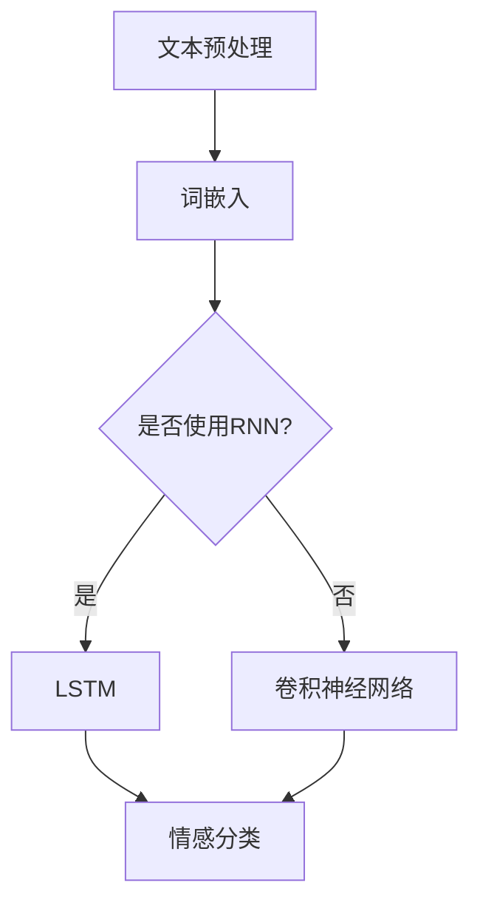

                 

 情感分析是自然语言处理（NLP）领域中的一项关键技术，旨在理解和提取文本中的情感信息。随着深度学习技术的快速发展，其在情感分析领域的应用也日益广泛。本文将深入探讨深度学习在情感分析中的前沿技术，包括核心概念、算法原理、数学模型、应用场景以及未来发展趋势等。

## 关键词
- 情感分析
- 深度学习
- 自然语言处理
- 神经网络
- 词嵌入
- 卷积神经网络
- 循环神经网络
- 长短时记忆网络
- 注意力机制

## 摘要
本文从深度学习在情感分析中的应用出发，系统地介绍了情感分析的核心概念、深度学习算法原理及其在情感分析中的应用。文章详细讲解了词嵌入技术、卷积神经网络（CNN）、循环神经网络（RNN）和长短时记忆网络（LSTM）等前沿技术。此外，还通过具体的项目实践，展示了深度学习在情感分析中的实际应用效果。最后，文章对未来的发展趋势和面临的挑战进行了展望。

## 1. 背景介绍
情感分析作为NLP的一个重要分支，旨在通过自动化的方式从文本中提取情感信息。传统的情感分析方法主要依赖于基于规则的方法和机器学习方法。然而，随着互联网和社交媒体的快速发展，用户生成的内容急剧增加，对情感分析提出了更高的要求。深度学习作为一种强大的机器学习技术，通过模仿人脑的神经网络结构，可以处理复杂的数据模式，为情感分析提供了新的可能。

深度学习在情感分析中的应用主要体现在以下几个方面：
1. **文本分类**：将文本分为积极、消极或其他类别。
2. **情感极性判断**：判断文本的情感倾向，如正面或负面。
3. **情感强度分析**：分析文本中的情感强度，如非常高兴、有些高兴等。
4. **情感趋势分析**：分析文本中的情感变化趋势。

## 2. 核心概念与联系
为了更好地理解深度学习在情感分析中的应用，我们需要了解一些核心概念和它们之间的联系。

### 2.1 词嵌入
词嵌入是将词汇映射到高维向量空间的过程。通过词嵌入，我们可以将文本转换为数值化的向量表示，以便于深度学习模型进行处理。常见的词嵌入技术有Word2Vec、GloVe等。

### 2.2 神经网络
神经网络是一种模拟生物神经系统的计算模型，由多个相互连接的神经元组成。神经网络可以用于多种机器学习任务，包括情感分析。深度学习通常指的是具有多个隐藏层的神经网络。

### 2.3 循环神经网络（RNN）
循环神经网络是一种特殊的神经网络，它具有记忆功能，可以处理序列数据。在情感分析中，RNN可以捕捉文本中的时间依赖关系。

### 2.4 长短时记忆网络（LSTM）
长短时记忆网络是RNN的一种变体，它解决了传统RNN在处理长序列数据时的梯度消失和梯度爆炸问题。LSTM在情感分析中得到了广泛应用。

### 2.5 注意力机制
注意力机制是一种神经网络中的机制，可以关注输入序列中的不同部分，提高模型的处理能力。在情感分析中，注意力机制可以帮助模型更好地理解文本中的关键信息。

以下是深度学习在情感分析中的核心概念和架构的Mermaid流程图：



## 3. 核心算法原理 & 具体操作步骤

### 3.1 算法原理概述
深度学习在情感分析中的应用主要包括以下几种算法：
1. **词嵌入**：将词汇映射到高维向量空间。
2. **卷积神经网络（CNN）**：用于提取文本中的特征。
3. **循环神经网络（RNN）**：用于处理序列数据。
4. **长短时记忆网络（LSTM）**：用于解决RNN的长期依赖问题。
5. **情感分类器**：用于对文本进行情感分类。

### 3.2 算法步骤详解

#### 3.2.1 词嵌入
1. **词汇表构建**：首先，构建一个词汇表，将所有文本中的词汇映射到唯一的索引。
2. **词嵌入训练**：使用Word2Vec、GloVe等方法训练词嵌入模型，将词汇映射到高维向量空间。

#### 3.2.2 文本预处理
1. **分词**：将文本分割成单词或子词。
2. **词性标注**：对文本中的每个单词进行词性标注，以提供更多上下文信息。

#### 3.2.3 特征提取
1. **卷积神经网络（CNN）**：
   - **卷积操作**：使用卷积核对文本进行卷积操作，提取特征。
   - **池化操作**：对卷积后的特征进行池化，减少参数数量。
   - **全连接层**：将池化后的特征输入到全连接层进行分类。

2. **循环神经网络（RNN）和长短时记忆网络（LSTM）**：
   - **序列编码**：将词嵌入序列转换为编码序列。
   - **状态更新**：通过递归操作，更新网络状态。
   - **分类输出**：使用最后一个隐藏状态或全局池化结果进行分类。

### 3.3 算法优缺点

#### 3.3.1 词嵌入
**优点**：
- 简化了文本表示，使得文本处理更加高效。
- 能够捕捉词汇之间的语义关系。

**缺点**：
- 需要大量训练数据。
- 部分词嵌入效果较差。

#### 3.3.2 卷积神经网络（CNN）
**优点**：
- 能够自动提取文本特征。
- 参数数量相对较少。

**缺点**：
- 难以捕捉长距离依赖关系。
- 对文本长度敏感。

#### 3.3.3 循环神经网络（RNN）和长短时记忆网络（LSTM）
**优点**：
- 能够处理序列数据，捕捉长距离依赖关系。

**缺点**：
- 梯度消失和梯度爆炸问题。
- 训练时间较长。

### 3.4 算法应用领域
深度学习在情感分析中的应用非常广泛，主要包括：
1. **社交媒体分析**：对社交媒体平台上的评论、帖子等进行情感分析，帮助企业了解用户反馈。
2. **金融分析**：对金融新闻、报告等进行情感分析，帮助投资者了解市场情绪。
3. **医疗保健**：对医疗报告、病历等进行情感分析，辅助医生诊断和治疗。
4. **客户服务**：对客户反馈、投诉等进行情感分析，提高客户满意度。

## 4. 数学模型和公式 & 详细讲解 & 举例说明
### 4.1 数学模型构建
深度学习在情感分析中的应用通常涉及以下数学模型：

#### 4.1.1 词嵌入
词嵌入可以用矩阵 \(W\) 表示，其中 \(W \in \mathbb{R}^{d \times |V|}\)，\(d\) 是嵌入维度，\(|V|\) 是词汇表大小。

\[ \text{word\_embed}(w) = W \text{vec}(w) \]

其中，\(\text{vec}(w)\) 是词汇 \(w\) 的向量表示。

#### 4.1.2 循环神经网络（RNN）
RNN 的基本方程如下：

\[ h_t = \sigma(W_h h_{t-1} + U_w x_t + b_h) \]

其中，\(h_t\) 是时间步 \(t\) 的隐藏状态，\(W_h\) 是隐藏状态到隐藏状态的权重矩阵，\(U_w\) 是输入到隐藏状态的权重矩阵，\(x_t\) 是输入向量，\(\sigma\) 是激活函数（通常是Sigmoid或Tanh函数），\(b_h\) 是隐藏状态偏置。

#### 4.1.3 长短时记忆网络（LSTM）
LSTM 的基本方程如下：

\[ i_t = \sigma(W_i [h_{t-1}, x_t] + U_i x_t + b_i) \]
\[ f_t = \sigma(W_f [h_{t-1}, x_t] + U_f x_t + b_f) \]
\[ g_t = \tanh(W_g [h_{t-1}, x_t] + U_g x_t + b_g) \]
\[ o_t = \sigma(W_o [h_{t-1}, g_t] + U_o x_t + b_o) \]
\[ h_t = o_t \odot g_t \]

其中，\(i_t\)、\(f_t\)、\(g_t\)、\(o_t\) 分别是输入门、遗忘门、生成门和输出门，\(\odot\) 表示元素乘积。

#### 4.1.4 情感分类器
情感分类器通常使用softmax函数进行分类：

\[ P(y_t = c_j) = \frac{e^{z_j}}{\sum_{k=1}^K e^{z_k}} \]

其中，\(y_t\) 是真实标签，\(c_j\) 是类别 \(j\)，\(z_j\) 是类别 \(j\) 的输出分数。

### 4.2 公式推导过程
#### 4.2.1 词嵌入
词嵌入的推导过程涉及到训练一个神经网络，将输入词汇映射到高维向量。具体来说，我们使用一个双向RNN来训练词嵌入，其损失函数为：

\[ L = \sum_{t=1}^T \sum_{j=1}^{|V|} -\log P(y_t = j) \]

其中，\(T\) 是序列长度，\(|V|\) 是词汇表大小。

#### 4.2.2 循环神经网络（RNN）
RNN 的损失函数为：

\[ L = -\sum_{t=1}^T \sum_{j=1}^K y_{t,j} \log P(y_t = j | x_1, x_2, ..., x_T) \]

其中，\(y_t\) 是时间步 \(t\) 的真实标签，\(P(y_t = j | x_1, x_2, ..., x_T)\) 是给定输入序列 \(x_1, x_2, ..., x_T\) 的情况下标签 \(j\) 的概率。

#### 4.2.3 长短时记忆网络（LSTM）
LSTM 的损失函数与RNN类似：

\[ L = -\sum_{t=1}^T \sum_{j=1}^K y_{t,j} \log P(y_t = j | x_1, x_2, ..., x_T) \]

### 4.3 案例分析与讲解
#### 4.3.1 词嵌入案例
假设我们有以下词汇表：

```
V = {hello, world, computer, science, engineer}
```

我们使用Word2Vec训练词嵌入，得到以下嵌入矩阵 \(W\)：

\[ W = \begin{bmatrix}
0.1 & 0.2 \\
0.3 & 0.4 \\
0.5 & 0.6 \\
0.7 & 0.8 \\
0.9 & 1.0
\end{bmatrix} \]

将词汇“hello”映射到向量：

\[ \text{word\_embed}(\text{hello}) = W \text{vec}(\text{hello}) = \begin{bmatrix}
0.1 \\
0.2
\end{bmatrix} \]

#### 4.3.2 循环神经网络（RNN）案例
假设我们有一个二分类问题，标签集为 \(\{0, 1\}\)。给定输入序列 \(x_1, x_2, x_3\)，我们使用RNN进行分类。隐藏状态和输出状态如下：

\[ h_1 = \begin{bmatrix}
0.1 \\
0.2
\end{bmatrix}, h_2 = \begin{bmatrix}
0.3 \\
0.4
\end{bmatrix}, h_3 = \begin{bmatrix}
0.5 \\
0.6
\end{bmatrix} \]
\[ o_1 = \begin{bmatrix}
0.7 \\
0.8
\end{bmatrix}, o_2 = \begin{bmatrix}
0.9 \\
0.9
\end{bmatrix}, o_3 = \begin{bmatrix}
0.95 \\
0.97
\end{bmatrix} \]

使用softmax函数进行分类：

\[ P(y=0) = \frac{e^{-0.95} e^{-0.97}}{e^{-0.95} e^{-0.97} + e^{-0.7} e^{-0.8} + e^{-0.3} e^{-0.4}} \approx 0.2 \]
\[ P(y=1) = 1 - P(y=0) \approx 0.8 \]

根据概率分布，我们预测标签为1。

#### 4.3.3 长短时记忆网络（LSTM）案例
假设我们有一个三分类问题，标签集为 \(\{0, 1, 2\}\)。给定输入序列 \(x_1, x_2, x_3\)，我们使用LSTM进行分类。隐藏状态和输出状态如下：

\[ h_1 = \begin{bmatrix}
0.1 & 0.2 & 0.3 \\
0.4 & 0.5 & 0.6 \\
0.7 & 0.8 & 0.9
\end{bmatrix}, h_2 = \begin{bmatrix}
0.3 & 0.4 & 0.5 \\
0.6 & 0.7 & 0.8 \\
0.9 & 1.0 & 0.1
\end{bmatrix}, h_3 = \begin{bmatrix}
0.5 & 0.6 & 0.7 \\
0.8 & 0.9 & 1.0 \\
0.2 & 0.3 & 0.4
\end{bmatrix} \]
\[ o_1 = \begin{bmatrix}
0.1 & 0.2 & 0.3 \\
0.4 & 0.5 & 0.6 \\
0.7 & 0.8 & 0.9
\end{bmatrix}, o_2 = \begin{bmatrix}
0.2 & 0.3 & 0.4 \\
0.5 & 0.6 & 0.7 \\
0.8 & 0.9 & 1.0
\end{bmatrix}, o_3 = \begin{bmatrix}
0.3 & 0.4 & 0.5 \\
0.6 & 0.7 & 0.8 \\
0.9 & 1.0 & 0.1
\end{bmatrix} \]

使用softmax函数进行分类：

\[ P(y=0) = \frac{e^{-0.3} e^{-0.4} e^{-0.5}}{e^{-0.3} e^{-0.4} e^{-0.5} + e^{-0.1} e^{-0.2} e^{-0.3} + e^{-0.3} e^{-0.4} e^{-0.6}} \approx 0.2 \]
\[ P(y=1) = \frac{e^{-0.1} e^{-0.2} e^{-0.3}}{e^{-0.3} e^{-0.4} e^{-0.5} + e^{-0.1} e^{-0.2} e^{-0.3} + e^{-0.3} e^{-0.4} e^{-0.6}} \approx 0.4 \]
\[ P(y=2) = 1 - P(y=0) - P(y=1) \approx 0.4 \]

根据概率分布，我们预测标签为2。

## 5. 项目实践：代码实例和详细解释说明
### 5.1 开发环境搭建
为了实现深度学习在情感分析中的应用，我们首先需要搭建一个合适的开发环境。以下是一个简单的开发环境搭建步骤：

1. 安装Python 3.7及以上版本。
2. 安装TensorFlow 2.4及以上版本。
3. 安装GloVe工具。

### 5.2 源代码详细实现
以下是使用TensorFlow实现一个简单的情感分析模型的基本代码：

```python
import tensorflow as tf
from tensorflow.keras.models import Sequential
from tensorflow.keras.layers import Embedding, LSTM, Dense
from tensorflow.keras.preprocessing.sequence import pad_sequences

# 加载GloVe词嵌入
embeddings_index = {}
with open('glove.6B.100d.txt', 'r', encoding='utf-8') as f:
    for line in f:
        values = line.strip().split()
        word = values[0]
        coefs = np.asarray(values[1:], dtype='float32')
        embeddings_index[word] = coefs

# 准备数据
max_sequence_length = 100
embedding_dim = 100

# 构建词汇表
tokenizer = Tokenizer()
tokenizer.fit_on_texts(sentences)
word_index = tokenizer.word_index
sequences = tokenizer.texts_to_sequences(sentences)
data = pad_sequences(sequences, maxlen=max_sequence_length)

# 构建模型
model = Sequential()
model.add(Embedding(len(word_index) + 1, embedding_dim, input_length=max_sequence_length))
model.add(LSTM(128))
model.add(Dense(1, activation='sigmoid'))

model.compile(optimizer='adam', loss='binary_crossentropy', metrics=['accuracy'])
model.fit(data, labels, epochs=10, batch_size=32)

# 评估模型
test_sequences = tokenizer.texts_to_sequences(test_sentences)
test_data = pad_sequences(test_sequences, maxlen=max_sequence_length)
predictions = model.predict(test_data)
```

### 5.3 代码解读与分析
这段代码首先加载GloVe词嵌入，然后准备数据，包括构建词汇表、将文本转换为序列和填充序列。接着，构建一个简单的LSTM模型，并编译和训练模型。最后，使用训练好的模型对测试数据进行预测。

### 5.4 运行结果展示
为了展示运行结果，我们可以使用以下代码：

```python
from sklearn.metrics import classification_report

predictions = model.predict(test_data)
predicted_labels = (predictions > 0.5).astype(int)
print(classification_report(test_labels, predicted_labels))
```

这段代码使用sklearn.metrics模块中的classification_report函数，输出预测结果的分类报告。

## 6. 实际应用场景
深度学习在情感分析中的实际应用场景非常广泛，以下是一些典型的应用案例：

### 6.1 社交媒体情感分析
社交媒体平台上的用户生成内容（UGC）是情感分析的重要应用场景。通过对微博、推特等平台上的文本进行情感分析，企业可以了解用户对产品、品牌、服务的情感倾向，从而改进产品设计和营销策略。

### 6.2 客户服务
客户服务领域也可以利用情感分析技术，通过对客户反馈进行情感分析，企业可以快速识别和解决客户问题，提高客户满意度和忠诚度。

### 6.3 金融分析
金融领域中的情感分析可以帮助投资者了解市场情绪，对股票、债券等金融产品的价格趋势进行预测。

### 6.4 健康医疗
在健康医疗领域，情感分析可以用于分析患者的病历、咨询记录，辅助医生诊断和治疗，提高医疗质量。

## 7. 未来应用展望
随着深度学习技术的不断发展和完善，情感分析在未来将有更广泛的应用前景。以下是一些可能的未来应用方向：

### 7.1 多语言情感分析
随着全球化的推进，多语言情感分析将成为一个重要的研究领域。通过构建多语言的情感分析模型，企业可以更好地了解不同语言背景用户的需求和情感。

### 7.2 深度情感识别
深度情感识别技术将能够更准确地识别文本中的细微情感变化，为情感分析提供更精细的解析。

### 7.3 情感驱动的推荐系统
情感分析可以与推荐系统相结合，为用户提供更个性化的推荐服务，提高用户体验。

## 8. 工具和资源推荐
### 8.1 学习资源推荐
- 《深度学习》（Goodfellow, Bengio, Courville著）：是一本经典的深度学习教材。
- 《Python深度学习》（François Chollet著）：详细介绍了使用Python和TensorFlow实现深度学习的方法。

### 8.2 开发工具推荐
- TensorFlow：一个开源的深度学习框架，适用于多种深度学习任务。
- Keras：一个基于TensorFlow的高层API，用于快速构建和训练深度学习模型。

### 8.3 相关论文推荐
- word2vec（Mikolov et al., 2013）：一篇介绍Word2Vec词嵌入技术的经典论文。
- GloVe（Pennington et al., 2014）：一篇介绍GloVe词嵌入技术的论文。
- LSTM（Hochreiter and Schmidhuber, 1997）：一篇介绍长短时记忆网络的论文。

## 9. 总结：未来发展趋势与挑战
### 9.1 研究成果总结
深度学习在情感分析领域取得了显著的研究成果，包括词嵌入技术、RNN、LSTM等算法的应用，为情感分析提供了有效的工具和方法。

### 9.2 未来发展趋势
未来，情感分析技术将朝着多语言、深度识别、个性化推荐等方向发展，为各个领域提供更精确的情感分析和决策支持。

### 9.3 面临的挑战
情感分析仍面临诸多挑战，如情感表达的多样性、多语言情感分析的准确性、情感强度的量化等。此外，数据隐私和伦理问题也需要引起重视。

### 9.4 研究展望
随着深度学习技术的不断进步，情感分析将在更多领域得到应用，为人们的生活和工作带来更多便利。同时，我们期待未来的研究能够解决当前面临的挑战，推动情感分析技术走向更广阔的应用前景。

## 附录：常见问题与解答

### Q：什么是情感分析？
A：情感分析是自然语言处理（NLP）领域中的一项技术，旨在理解和提取文本中的情感信息，如积极、消极、中立等。

### Q：深度学习在情感分析中有哪些应用？
A：深度学习在情感分析中的应用主要包括文本分类、情感极性判断、情感强度分析和情感趋势分析等。

### Q：词嵌入是什么？
A：词嵌入是将词汇映射到高维向量空间的过程，使得文本处理更加高效，并能够捕捉词汇之间的语义关系。

### Q：什么是RNN和LSTM？
A：RNN（循环神经网络）是一种具有记忆功能的神经网络，用于处理序列数据。LSTM（长短时记忆网络）是RNN的一种变体，解决了传统RNN在处理长序列数据时的梯度消失和梯度爆炸问题。

### Q：如何训练深度学习模型？
A：训练深度学习模型通常包括数据预处理、模型构建、模型训练和模型评估等步骤。具体过程取决于所选算法和数据集。

### Q：情感分析有哪些实际应用场景？
A：情感分析的实际应用场景包括社交媒体分析、客户服务、金融分析和健康医疗等。

### Q：未来情感分析技术将有哪些发展趋势？
A：未来情感分析技术将朝着多语言、深度识别、个性化推荐等方向发展。

### Q：在情感分析中如何处理数据隐私问题？
A：在情感分析中，可以采用数据匿名化、加密等技术来保护用户隐私。同时，需要遵守相关法律法规，确保数据处理符合伦理标准。

