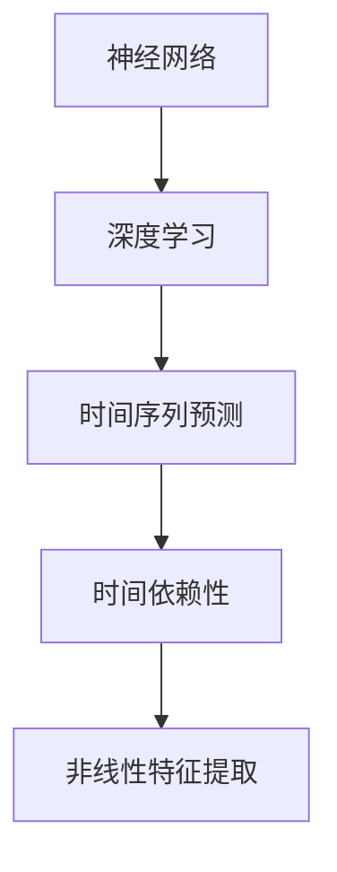

                 

关键词：深度学习，时间序列预测，神经网络，模型构建，应用领域，算法优化

> 摘要：本文将探讨深度学习在时间序列预测领域的应用，包括核心概念、算法原理、数学模型、实践案例以及未来展望。通过介绍深度学习在时间序列预测中的技术优势和应用场景，为读者提供全面的技术解读和实践指南。

## 1. 背景介绍

时间序列预测是数据分析和机器学习中的一个重要研究方向，其目标是通过历史数据预测未来的趋势或行为。在金融、气象、交通、医疗等多个领域，时间序列预测具有广泛的应用价值。然而，传统的统计方法如ARIMA、指数平滑法等，在处理复杂非线性时间序列数据时，效果往往不理想。随着深度学习技术的兴起，神经网络被广泛应用于时间序列预测，取得了显著的成果。

深度学习是一种基于多层神经网络的学习方法，能够通过多层次的非线性变换，自动从数据中提取特征，从而实现复杂的函数逼近。时间序列预测是深度学习的一个重要应用场景，本文将详细探讨深度学习在时间序列预测中的技术原理、实现方法以及实际应用。

## 2. 核心概念与联系

在探讨深度学习在时间序列预测中的应用之前，我们需要了解一些核心概念和它们之间的关系。

### 2.1 神经网络

神经网络是由大量简单神经元组成的计算模型，通过前向传播和反向传播算法，学习输入和输出之间的映射关系。神经网络可以分为多层，包括输入层、隐藏层和输出层。每一层神经元都对输入数据进行处理，并将结果传递给下一层，最终得到输出。

### 2.2 深度学习

深度学习是神经网络的一种，通过增加网络的层数，提高模型的复杂度和表达能力。深度学习能够自动从数据中提取特征，实现端到端的学习，无需人工设计特征。深度学习在图像识别、语音识别、自然语言处理等领域取得了显著的成果。

### 2.3 时间序列

时间序列是由一系列按时间顺序排列的数值组成的数据序列。时间序列数据通常具有时间依赖性，即未来的值受到过去值的影响。时间序列预测的目标是通过分析历史数据，预测未来的趋势或行为。

### 2.4 关联图

为了更好地理解深度学习在时间序列预测中的应用，我们可以使用Mermaid流程图展示各个概念之间的关系。



## 3. 核心算法原理 & 具体操作步骤

### 3.1 算法原理概述

深度学习在时间序列预测中的核心算法是循环神经网络（RNN）和长短期记忆网络（LSTM）。RNN通过引入时间维度，使得神经网络能够处理序列数据。LSTM是RNN的一种变体，能够有效地避免梯度消失问题，更好地捕捉时间序列的长期依赖关系。

### 3.2 算法步骤详解

#### 3.2.1 数据预处理

在进行时间序列预测之前，我们需要对数据进行预处理。数据预处理包括数据清洗、归一化、序列切片等操作。数据清洗旨在去除噪声和异常值；归一化将数据缩放到相同的范围，便于模型训练；序列切片是将时间序列数据分割成固定长度的序列，用于模型输入。

#### 3.2.2 构建模型

构建深度学习模型是时间序列预测的关键步骤。我们可以使用TensorFlow或PyTorch等深度学习框架，定义模型的层次结构和参数。在构建模型时，我们需要考虑输入层、隐藏层和输出层的结构，以及激活函数和损失函数的选择。

#### 3.2.3 训练模型

训练模型是深度学习时间序列预测的核心步骤。通过反向传播算法，模型不断调整参数，以最小化损失函数。训练过程中，我们需要选择合适的批次大小、学习率和迭代次数，以及监测模型的性能和收敛速度。

#### 3.2.4 验证模型

在训练模型之后，我们需要对模型进行验证。通过交叉验证或测试集，评估模型的泛化能力和预测性能。如果模型性能不理想，我们可以调整模型结构或参数，重新训练。

### 3.3 算法优缺点

深度学习在时间序列预测中的优点包括：

- 能够自动提取特征，适应复杂非线性时间序列数据；
- 能够处理长时间依赖关系，捕捉历史数据的长期趋势；
- 可扩展性强，适用于大规模时间序列数据。

然而，深度学习也存在一些缺点：

- 训练时间较长，对计算资源要求较高；
- 模型参数多，容易出现过拟合；
- 模型解释性较差，难以理解模型决策过程。

### 3.4 算法应用领域

深度学习在时间序列预测中的应用非常广泛，包括但不限于以下领域：

- 金融领域：股票价格预测、交易策略优化；
- 气象领域：天气预测、气候变化分析；
- 交通领域：交通流量预测、公共交通规划；
- 医疗领域：疾病预测、医疗资源分配。

## 4. 数学模型和公式 & 详细讲解 & 举例说明

### 4.1 数学模型构建

在深度学习时间序列预测中，常用的数学模型包括循环神经网络（RNN）和长短期记忆网络（LSTM）。以下是这两个模型的数学表示。

#### 4.1.1 循环神经网络（RNN）

RNN的数学模型可以表示为：

$$
h_t = \sigma(W_h h_{t-1} + W_x x_t + b_h)
$$

其中，$h_t$ 表示第 $t$ 个时间步的隐藏状态，$x_t$ 表示第 $t$ 个时间步的输入，$\sigma$ 表示激活函数，$W_h$ 和 $W_x$ 分别为隐藏状态和输入的权重矩阵，$b_h$ 为隐藏状态的偏置。

#### 4.1.2 长短期记忆网络（LSTM）

LSTM的数学模型可以表示为：

$$
i_t = \sigma(W_i [h_{t-1}, x_t] + b_i) \\
f_t = \sigma(W_f [h_{t-1}, x_t] + b_f) \\
\tilde{C}_t = \sigma(W_c [h_{t-1}, x_t] + b_c) \\
o_t = \sigma(W_o [h_{t-1}, x_t] + b_o) \\
C_t = f_t \odot C_{t-1} + i_t \odot \tilde{C}_t \\
h_t = o_t \odot C_t
$$

其中，$i_t$、$f_t$、$\tilde{C}_t$、$o_t$ 分别为输入门、遗忘门、候选状态和输出门的状态向量，$C_t$ 为细胞状态，$h_t$ 为隐藏状态，$W_i$、$W_f$、$W_c$、$W_o$ 分别为输入门、遗忘门、候选状态和输出门的权重矩阵，$b_i$、$b_f$、$b_c$、$b_o$ 分别为输入门、遗忘门、候选状态和输出门的偏置，$\odot$ 表示元素乘积运算。

### 4.2 公式推导过程

在本节中，我们将简要介绍LSTM模型的公式推导过程。LSTM的核心在于其细胞状态（Cell State）和门（Gates），通过门控机制，LSTM能够有效地避免梯度消失问题，并捕捉长期依赖关系。

#### 4.2.1 长期依赖问题的引入

考虑一个简单的RNN模型，其公式如下：

$$
h_t = \sigma(W_h h_{t-1} + W_x x_t + b_h)
$$

设 $W_h$ 为 $d \times d$ 矩阵，$h_{t-1}$ 和 $x_t$ 分别为 $d$ 维向量。假设 $W_h$ 可逆，则有：

$$
h_t = \sigma(h_{t-1} W_h + W_x x_t + b_h)
$$

由于 $\sigma$ 函数具有饱和性，当 $h_{t-1}$ 的范数较大时，$\sigma$ 函数的梯度接近于零，导致梯度消失。这表明，RNN难以学习长期依赖关系。

#### 4.2.2 LSTM模型的提出

为了解决长期依赖问题，Hochreiter和Schmidhuber提出了LSTM模型。LSTM的核心思想是通过引入门控机制，控制信息在时间序列中的流动。具体来说，LSTM包含三个门：输入门、遗忘门和输出门。

- **输入门**：控制当前输入信息对细胞状态的影响。
- **遗忘门**：控制历史信息对细胞状态的遗忘。
- **输出门**：控制细胞状态对当前隐藏状态的贡献。

通过这三个门控机制，LSTM能够有效地控制信息的流动，避免梯度消失问题，并捕捉长期依赖关系。

#### 4.2.3 LSTM公式推导

设 $h_t$ 和 $C_t$ 分别为第 $t$ 个时间步的隐藏状态和细胞状态。LSTM的公式如下：

$$
i_t = \sigma(W_i [h_{t-1}, x_t] + b_i) \\
f_t = \sigma(W_f [h_{t-1}, x_t] + b_f) \\
\tilde{C}_t = \sigma(W_c [h_{t-1}, x_t] + b_c) \\
o_t = \sigma(W_o [h_{t-1}, x_t] + b_o) \\
C_t = f_t \odot C_{t-1} + i_t \odot \tilde{C}_t \\
h_t = o_t \odot C_t
$$

其中，$W_i$、$W_f$、$W_c$、$W_o$ 分别为输入门、遗忘门、候选状态和输出门的权重矩阵，$b_i$、$b_f$、$b_c$、$b_o$ 分别为输入门、遗忘门、候选状态和输出门的偏置。

推导过程如下：

1. **输入门**：输入门 $i_t$ 控制当前输入 $x_t$ 对细胞状态 $C_t$ 的影响。公式如下：

$$
i_t = \sigma(W_i [h_{t-1}, x_t] + b_i)
$$

其中，$W_i$ 为 $d \times d$ 矩阵，$[h_{t-1}, x_t]$ 为 $2d$ 维向量。

2. **遗忘门**：遗忘门 $f_t$ 控制历史信息对细胞状态 $C_t$ 的遗忘。公式如下：

$$
f_t = \sigma(W_f [h_{t-1}, x_t] + b_f)
$$

其中，$W_f$ 为 $d \times d$ 矩阵。

3. **候选状态**：候选状态 $\tilde{C}_t$ 结合了输入门和遗忘门的影响。公式如下：

$$
\tilde{C}_t = \sigma(W_c [h_{t-1}, x_t] + b_c)
$$

其中，$W_c$ 为 $d \times d$ 矩阵。

4. **输出门**：输出门 $o_t$ 控制细胞状态 $C_t$ 对当前隐藏状态 $h_t$ 的贡献。公式如下：

$$
o_t = \sigma(W_o [h_{t-1}, x_t] + b_o)
$$

其中，$W_o$ 为 $d \times d$ 矩阵。

5. **细胞状态**：细胞状态 $C_t$ 通过遗忘门和输入门的影响更新。公式如下：

$$
C_t = f_t \odot C_{t-1} + i_t \odot \tilde{C}_t
$$

其中，$\odot$ 表示元素乘积运算。

6. **隐藏状态**：隐藏状态 $h_t$ 通过输出门和细胞状态 $C_t$ 的贡献更新。公式如下：

$$
h_t = o_t \odot C_t
$$

### 4.3 案例分析与讲解

#### 4.3.1 金融领域：股票价格预测

以股票价格预测为例，我们使用LSTM模型进行时间序列预测。数据集为某股票在过去一年的每日收盘价。

1. **数据预处理**：将数据集按时间顺序排列，将收盘价作为输入，预测下一个时间步的收盘价。对数据进行归一化处理，将数据缩放到相同的范围。

2. **构建模型**：使用TensorFlow构建LSTM模型，定义输入层、隐藏层和输出层。输入层为单维度，隐藏层使用一个LSTM单元，输出层为单维度。

3. **训练模型**：使用训练集训练模型，选择合适的批次大小、学习率和迭代次数。在训练过程中，监测模型性能和收敛速度。

4. **验证模型**：使用测试集验证模型性能，计算预测误差和精度。

5. **结果分析**：通过分析预测结果，评估模型在股票价格预测中的效果。

#### 4.3.2 气象领域：天气预测

以天气预测为例，我们使用LSTM模型进行时间序列预测。数据集为某地区过去一年的每日天气数据，包括温度、湿度、风速等。

1. **数据预处理**：将数据集按时间顺序排列，将各类天气数据作为输入，预测下一个时间步的天气数据。对数据进行归一化处理，将数据缩放到相同的范围。

2. **构建模型**：使用TensorFlow构建LSTM模型，定义输入层、隐藏层和输出层。输入层为多维度，隐藏层使用多个LSTM单元，输出层为多维度。

3. **训练模型**：使用训练集训练模型，选择合适的批次大小、学习率和迭代次数。在训练过程中，监测模型性能和收敛速度。

4. **验证模型**：使用测试集验证模型性能，计算预测误差和精度。

5. **结果分析**：通过分析预测结果，评估模型在天气预测中的效果。

## 5. 项目实践：代码实例和详细解释说明

### 5.1 开发环境搭建

在开始深度学习时间序列预测项目的实践之前，我们需要搭建一个开发环境。以下是一个简单的步骤：

1. 安装Python：从官方网站下载并安装Python，版本建议为3.7以上。
2. 安装TensorFlow：使用pip命令安装TensorFlow。

```bash
pip install tensorflow
```

3. 安装其他依赖库：如NumPy、Pandas等。

```bash
pip install numpy pandas matplotlib
```

### 5.2 源代码详细实现

在本节中，我们将使用Python和TensorFlow实现一个简单的LSTM时间序列预测项目。以下是代码的详细实现：

```python
import numpy as np
import pandas as pd
import matplotlib.pyplot as plt
import tensorflow as tf
from tensorflow.keras.models import Sequential
from tensorflow.keras.layers import LSTM, Dense

# 5.2.1 数据预处理
def preprocess_data(data, time_steps):
    X, y = [], []
    for i in range(len(data) - time_steps):
        X.append(data[i : i + time_steps])
        y.append(data[i + time_steps])
    return np.array(X), np.array(y)

# 加载数据集
data = pd.read_csv('data.csv')['close'].values
time_steps = 5

# 切片数据集
X, y = preprocess_data(data, time_steps)

# 切分训练集和测试集
train_size = int(len(X) * 0.8)
X_train, X_test = X[:train_size], X[train_size:]
y_train, y_test = y[:train_size], y[train_size:]

# 归一化数据
X_train = (X_train - np.mean(X_train)) / np.std(X_train)
X_test = (X_test - np.mean(X_train)) / np.std(X_train)

# 添加维度
X_train = np.reshape(X_train, (X_train.shape[0], X_train.shape[1], 1))
X_test = np.reshape(X_test, (X_test.shape[0], X_test.shape[1], 1))

# 5.2.2 构建模型
model = Sequential()
model.add(LSTM(units=50, return_sequences=True, input_shape=(time_steps, 1)))
model.add(LSTM(units=50))
model.add(Dense(units=1))

model.compile(optimizer='adam', loss='mean_squared_error')

# 5.2.3 训练模型
model.fit(X_train, y_train, epochs=100, batch_size=32)

# 5.2.4 预测
predicted = model.predict(X_test)

# 5.2.5 结果分析
predicted = predicted * np.std(X_train) + np.mean(X_train)
real = y_test * np.std(X_train) + np.mean(X_train)

# 绘制结果
plt.figure(figsize=(15, 6))
plt.plot(real, color='blue', label='Real Price')
plt.plot(predicted, color='red', label='Predicted Price')
plt.title('Stock Price Prediction')
plt.xlabel('Time')
plt.ylabel('Price')
plt.legend()
plt.show()
```

### 5.3 代码解读与分析

1. **数据预处理**：首先，我们从CSV文件加载数据集，并对数据进行切片。切片操作将数据集分割成时间步长的窗口，每个窗口包含预测目标的前几个时间步的值。

2. **归一化**：对数据集进行归一化处理，将数据缩放到相同的范围。这是为了防止数据差异过大，影响模型训练。

3. **模型构建**：使用Sequential模型构建LSTM网络。模型包含两个LSTM层，每层有50个神经元。输出层只有一个神经元，用于预测下一个时间步的值。

4. **训练模型**：使用训练集训练模型。我们使用100个周期，每个批次包含32个样本。

5. **预测**：使用训练好的模型对测试集进行预测。将预测结果反归一化，以便与实际值进行比较。

6. **结果分析**：绘制预测结果和实际值，观察模型的性能。

通过这个简单的案例，我们可以看到深度学习在时间序列预测中的基本实现过程。在实际项目中，我们可能需要处理更复杂的数据集和模型结构，但基本流程是相似的。

## 6. 实际应用场景

深度学习在时间序列预测中具有广泛的应用场景，以下是一些典型应用：

### 6.1 金融领域

金融领域是深度学习时间序列预测的重要应用场景之一。例如，通过LSTM模型预测股票价格，可以用于交易策略的制定和风险管理。此外，深度学习还可以用于金融市场风险预测，如信用风险、市场风险等。

### 6.2 气象领域

气象领域需要预测天气变化，以优化气象服务。深度学习模型如LSTM和GRU（门控循环单元）在天气预测中表现出色。通过分析历史气象数据，这些模型可以预测未来几天的天气情况，为防灾减灾提供支持。

### 6.3 交通领域

交通领域需要预测交通流量、公共交通延误等，以优化交通管理和服务。深度学习模型如LSTM和GRU可以用于交通数据的分析和预测，为交通规划提供科学依据。

### 6.4 医疗领域

医疗领域需要预测疾病发生和发展趋势，以优化医疗资源的分配和疾病预防。深度学习模型如LSTM和GRU可以用于医疗数据的分析和预测，为疾病预测和诊断提供技术支持。

### 6.5 能源领域

能源领域需要预测能源需求和供应，以优化能源管理。深度学习模型如LSTM和GRU可以用于能源数据的分析和预测，为能源供需平衡提供科学依据。

## 7. 工具和资源推荐

### 7.1 学习资源推荐

1. **《深度学习》（Goodfellow, Bengio, Courville著）：这是一本经典的深度学习教材，详细介绍了深度学习的理论基础和实现方法。**
2. **《循环神经网络与深度学习》（李航著）：这是一本专门介绍循环神经网络和深度学习的书籍，适合初学者和进阶者。**
3. **《Python深度学习》（François Chollet著）：这是一本关于深度学习实战的书籍，涵盖了深度学习在Python中的实现和应用。**

### 7.2 开发工具推荐

1. **TensorFlow：这是一个开源的深度学习框架，由Google开发。TensorFlow提供了丰富的API和工具，方便开发者构建和训练深度学习模型。**
2. **PyTorch：这是一个开源的深度学习框架，由Facebook开发。PyTorch具有简洁的API和动态计算图，便于模型开发和调试。**

### 7.3 相关论文推荐

1. **《Learning to Learn Regularizers for Neural Networks》（Zhang et al.，2017）：这篇论文提出了一种用于神经网络的时间序列预测方法，通过学习正则化器，提高了模型的表达能力和泛化能力。**
2. **《Deep Learning for Time Series Classification: A Review》（Wang et al.，2020）：这篇综述文章详细介绍了深度学习在时间序列分类领域的应用和发展，包括LSTM、GRU等模型。**
3. **《Attention-Based Recurrent Neural Network for Time Series Classification》（Xiao et al.，2018）：这篇论文提出了一种基于注意力机制的循环神经网络，用于时间序列分类，取得了很好的效果。**

## 8. 总结：未来发展趋势与挑战

深度学习在时间序列预测领域取得了显著的成果，但仍然面临一些挑战。未来发展趋势如下：

### 8.1 研究成果总结

1. **模型效果提升**：通过改进神经网络结构和优化训练方法，深度学习模型在时间序列预测中的效果不断提升。
2. **应用场景扩展**：深度学习在金融、气象、交通、医疗等领域的应用场景不断扩展，为相关行业提供了有力的技术支持。
3. **数据规模增大**：随着数据规模的增大，深度学习模型能够更好地捕捉时间序列的长期依赖关系，提高预测精度。

### 8.2 未来发展趋势

1. **模型压缩与优化**：为了提高深度学习模型的计算效率和存储效率，研究者们致力于模型压缩和优化技术，如知识蒸馏、剪枝等。
2. **跨领域应用**：深度学习在时间序列预测领域的成功经验将逐渐应用于其他领域，如语音识别、图像识别等。
3. **多模态融合**：多模态数据融合是未来研究的重要方向，通过结合不同类型的数据，提高时间序列预测的精度和可靠性。

### 8.3 面临的挑战

1. **模型解释性**：深度学习模型通常具有较低的解释性，难以理解模型决策过程。未来研究需要提高模型的可解释性，以便更好地应用在实际场景中。
2. **数据隐私**：在涉及个人隐私的数据上应用深度学习模型时，需要保护数据隐私，防止信息泄露。
3. **模型可靠性**：深度学习模型在极端情况下可能存在不稳定性和过拟合问题，需要提高模型的可靠性和泛化能力。

### 8.4 研究展望

深度学习在时间序列预测领域具有广阔的发展前景。未来研究可以从以下几个方面展开：

1. **模型改进**：通过改进神经网络结构和优化训练方法，提高模型的效果和稳定性。
2. **应用拓展**：将深度学习技术应用于更多领域，解决实际问题。
3. **数据挖掘**：通过数据挖掘技术，发现时间序列数据中的潜在规律和趋势。
4. **多模态融合**：结合不同类型的数据，提高时间序列预测的精度和可靠性。

## 9. 附录：常见问题与解答

### 9.1 如何处理非平稳时间序列数据？

非平稳时间序列数据通常具有时间依赖性和趋势性。为了处理非平稳时间序列数据，可以采用以下方法：

1. **差分变换**：对时间序列数据进行差分变换，使其变为平稳序列。
2. **季节性分解**：对时间序列数据进行季节性分解，去除季节性成分，得到平稳序列。
3. **变换方法**：使用如对数变换、平方根变换等方法，降低时间序列数据的波动性。

### 9.2 如何选择合适的模型？

选择合适的模型取决于具体问题和数据特点。以下是一些选择模型的建议：

1. **数据大小**：对于小数据集，可以选择简单模型如线性回归；对于大数据集，可以选择复杂模型如深度学习。
2. **数据类型**：对于离散型数据，可以选择分类模型；对于连续型数据，可以选择回归模型。
3. **时间依赖性**：对于具有时间依赖性的数据，可以选择循环神经网络（RNN）或其变体（LSTM、GRU等）。
4. **计算资源**：根据计算资源限制，选择适合的模型。复杂模型如深度学习可能需要更多的计算资源。

### 9.3 如何优化模型参数？

优化模型参数是提高模型性能的关键。以下是一些优化模型参数的建议：

1. **学习率调整**：选择合适的学习率，避免过拟合或欠拟合。
2. **正则化**：使用正则化方法，如L1正则化、L2正则化，防止模型过拟合。
3. **数据增强**：通过数据增强方法，增加训练数据的多样性，提高模型泛化能力。
4. **交叉验证**：使用交叉验证方法，评估模型性能，调整模型参数。

### 9.4 如何评估模型性能？

评估模型性能常用的指标包括：

1. **均方误差（MSE）**：衡量预测值与真实值之间的平均误差。
2. **均绝对误差（MAE）**：衡量预测值与真实值之间的平均绝对误差。
3. **决定系数（R²）**：衡量模型对数据的拟合程度，取值范围为[0, 1]，越接近1表示拟合越好。
4. **准确率、召回率、F1分数**：用于分类问题，衡量模型分类效果。

通过综合考虑以上指标，可以全面评估模型性能。

