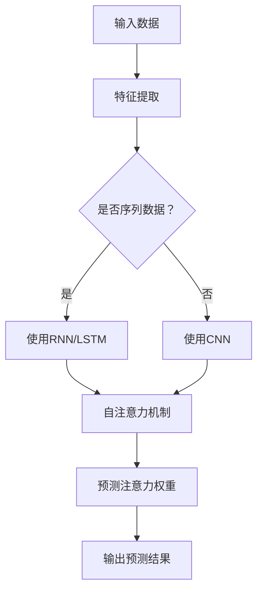

                 

在当今信息爆炸的时代，有效地预测和分配注意力成为了一项至关重要的任务。无论是搜索引擎的查询排序，推荐系统的内容推荐，还是自然语言处理中的文本摘要，注意力机制都显示出了其强大的预测能力。本文将探讨深度学习在注意力预测中的应用，从核心概念、算法原理、数学模型到实际项目实践，全面解析这一领域的前沿技术。

## 关键词

- 深度学习
- 注意力预测
- 信息检索
- 推荐系统
- 自然语言处理

## 摘要

本文首先介绍了注意力预测的基本概念和重要性，随后深入探讨了深度学习在注意力预测中的应用。通过梳理核心算法原理，构建数学模型，并给出具体操作步骤，本文展示了如何利用深度学习技术提升注意力预测的准确性和效率。随后，通过一个实际项目实例，详细解析了代码实现和运行结果，为读者提供了直观的学习和实践经验。最后，本文对未来的发展方向和面临的挑战进行了展望，并推荐了相关的学习资源和开发工具。

## 1. 背景介绍

注意力预测是近年来人工智能领域的一个重要研究方向。它源于人类认知过程中的注意力机制，即人们在接受和处理大量信息时，只能有选择地关注部分信息，这种选择过程本质上是一种注意力分配。在计算机科学中，注意力预测旨在通过算法模型，自动识别和预测用户对信息的关注程度，从而实现信息的优化排序、推荐和摘要。

### 注意力预测的重要性

注意力预测在多个领域具有重要应用价值：

- **搜索引擎**：通过预测用户对查询结果的关注程度，搜索引擎可以优化搜索结果排序，提升用户体验。
- **推荐系统**：在电子商务、社交媒体等场景下，推荐系统能够根据用户的行为和兴趣，预测用户可能感兴趣的内容，从而提供个性化的推荐。
- **自然语言处理**：在文本摘要和问答系统中，注意力预测可以帮助模型聚焦于关键信息，提高文本理解和生成质量。

### 深度学习在注意力预测中的应用

随着深度学习技术的不断发展，其在注意力预测中的应用日益广泛。深度学习模型，尤其是基于神经网络的模型，通过学习和模拟人类大脑处理信息的方式，能够高效地捕捉和预测注意力分配。以下是一些典型的深度学习模型在注意力预测中的应用：

- **循环神经网络（RNN）**：RNN通过其内部状态，可以捕捉序列数据中的长期依赖关系，适用于处理时间序列数据和自然语言文本。
- **卷积神经网络（CNN）**：CNN在图像处理领域有着出色的表现，但其卷积操作也被应用于序列数据中，用于捕捉局部特征。
- **长短期记忆网络（LSTM）**：LSTM是RNN的一种改进模型，能够更好地处理长序列数据中的短期和长期依赖关系。
- **自注意力机制（Self-Attention）**：在Transformer模型中，自注意力机制通过全局捕捉序列数据中的依赖关系，显著提升了模型的性能。
- **多模态注意力模型**：结合不同类型的数据（如图像和文本），多模态注意力模型能够更准确地预测用户注意力。

## 2. 核心概念与联系

### 2.1. 核心概念

在深入探讨深度学习在注意力预测中的应用之前，我们需要明确一些核心概念：

- **注意力机制**：注意力机制是一种信息选择机制，它通过权重分配来强调或忽略数据中的某些部分。
- **深度学习模型**：深度学习模型是一类通过多层神经网络进行数据学习和预测的算法。
- **注意力预测**：注意力预测是基于深度学习模型，对用户在处理信息时关注的程度进行预测。

### 2.2. 联系

注意力预测与深度学习之间的联系体现在以下几个方面：

- **信息处理**：深度学习模型能够处理复杂数据，并在其中提取有用特征，这与注意力预测对信息选择和处理的需求相契合。
- **学习与预测**：通过学习大量的标注数据，深度学习模型能够捕捉注意力分配的模式，并对外部数据进行预测。
- **模型优化**：注意力预测的准确性需要通过不断优化深度学习模型来实现，这涉及到模型的参数调整、网络结构和训练策略。

### 2.3. Mermaid 流程图

下面是一个简化的注意力预测流程图，展示了深度学习模型在注意力预测中的关键步骤：



### 2.4. 深度学习模型在注意力预测中的应用

深度学习模型在注意力预测中的应用可以分为以下几个阶段：

- **数据预处理**：包括数据的收集、清洗和归一化，确保输入数据的质量和一致性。
- **特征提取**：使用卷积神经网络（CNN）、循环神经网络（RNN）或自注意力机制（Self-Attention）提取关键特征。
- **注意力权重预测**：利用提取的特征，通过学习预测每个特征对目标任务的贡献度，即注意力权重。
- **结果输出**：根据注意力权重，对目标任务（如搜索结果排序、推荐列表排序等）进行优化。

### 2.5. 注意力预测的优势和挑战

注意力预测的优势包括：

- **高效性**：深度学习模型能够快速处理大规模数据，并提取关键特征。
- **准确性**：通过学习大量标注数据，模型能够准确预测用户注意力。
- **泛化性**：深度学习模型具有较好的泛化能力，能够适应不同的应用场景。

然而，注意力预测也面临着以下挑战：

- **数据依赖性**：模型性能高度依赖于标注数据的质量和数量。
- **模型复杂性**：深度学习模型的训练过程复杂，需要大量的计算资源和时间。
- **解释性**：深度学习模型通常具有较低的透明度，难以解释其预测结果。

## 3. 核心算法原理 & 具体操作步骤

### 3.1. 算法原理概述

注意力预测的核心算法是基于深度学习模型的，其基本原理如下：

1. **特征提取**：使用卷积神经网络（CNN）或循环神经网络（RNN）提取输入数据的特征。
2. **自注意力机制**：通过自注意力机制，对提取的特征进行全局权重分配，强调或忽略某些特征。
3. **注意力权重预测**：学习每个特征对目标任务的贡献度，生成注意力权重。
4. **结果输出**：根据注意力权重，对目标任务进行优化。

### 3.2. 算法步骤详解

1. **输入数据预处理**：
   - 收集和清洗数据，确保数据质量。
   - 对数据进行归一化处理，使其适合深度学习模型的输入。

2. **特征提取**：
   - 使用卷积神经网络（CNN）提取图像或文本的局部特征。
   - 使用循环神经网络（RNN）处理序列数据，提取长短期依赖特征。

3. **自注意力机制**：
   - 对提取的特征应用自注意力机制，计算每个特征的权重。
   - 通过注意力权重，对特征进行加权组合。

4. **注意力权重预测**：
   - 利用训练数据，通过学习模型预测每个特征的注意力权重。
   - 模型可以是基于神经网络的结构，如Transformer。

5. **结果输出**：
   - 根据注意力权重，对目标任务（如搜索结果排序、推荐列表排序等）进行优化。
   - 输出预测结果。

### 3.3. 算法优缺点

**优点**：

- **高效性**：深度学习模型能够快速处理大规模数据，并提取关键特征。
- **准确性**：通过学习大量标注数据，模型能够准确预测用户注意力。
- **泛化性**：深度学习模型具有较好的泛化能力，能够适应不同的应用场景。

**缺点**：

- **数据依赖性**：模型性能高度依赖于标注数据的数量和质量。
- **模型复杂性**：深度学习模型的训练过程复杂，需要大量的计算资源和时间。
- **解释性**：深度学习模型通常具有较低的透明度，难以解释其预测结果。

### 3.4. 算法应用领域

注意力预测算法在多个领域有着广泛的应用：

- **搜索引擎**：通过预测用户对查询结果的关注程度，搜索引擎可以优化搜索结果排序，提升用户体验。
- **推荐系统**：在电子商务、社交媒体等场景下，推荐系统能够根据用户的行为和兴趣，预测用户可能感兴趣的内容，从而提供个性化的推荐。
- **自然语言处理**：在文本摘要和问答系统中，注意力预测可以帮助模型聚焦于关键信息，提高文本理解和生成质量。

### 3.5. 注意力预测算法的改进方向

为了进一步提升注意力预测的准确性和效率，未来可以从以下几个方面进行改进：

- **数据增强**：通过数据增强技术，提高标注数据的质量和数量，从而提升模型性能。
- **模型压缩**：通过模型压缩技术，减小模型的大小和计算复杂度，提高模型的实时性和可部署性。
- **解释性增强**：通过改进模型的解释性，使模型更容易被理解和应用。

## 4. 数学模型和公式 & 详细讲解 & 举例说明

### 4.1. 数学模型构建

注意力预测的数学模型通常基于神经网络结构，如Transformer模型。以下是一个简化的数学模型构建过程：

$$
\begin{aligned}
    &\text{输入：} X \in \mathbb{R}^{n \times d} \\
    &\text{权重矩阵：} W \in \mathbb{R}^{d \times h} \\
    &\text{注意力机制：} \text{softmax} \\
    &\text{输出：} O \in \mathbb{R}^{n \times h} \\
\end{aligned}
$$

其中，$X$是输入数据，$W$是权重矩阵，$\text{softmax}$是自注意力机制，$O$是输出结果。

### 4.2. 公式推导过程

注意力机制的推导过程如下：

$$
\begin{aligned}
    &\text{输入特征：} X \in \mathbb{R}^{n \times d} \\
    &\text{权重矩阵：} W \in \mathbb{R}^{d \times h} \\
    &\text{特征向量：} X_i \in \mathbb{R}^{d} \\
    &\text{权重向量：} W_i \in \mathbb{R}^{h} \\
    &\text{注意力权重：} a_i \in \mathbb{R} \\
    &\text{输出特征：} X_i' \in \mathbb{R}^{h} \\
\end{aligned}
$$

$$
\begin{aligned}
    &a_i = \text{softmax}(W_i^T X_i) \\
    &X_i' = \text{softmax}(W_i^T X_i) X_i \\
\end{aligned}
$$

其中，$X_i'$是经过注意力权重加权的输出特征。

### 4.3. 案例分析与讲解

以下是一个简单的案例，展示如何使用注意力机制对序列数据进行权重分配：

**输入数据**：假设我们有一个序列数据$X = [1, 2, 3, 4, 5]$，希望对其中的每个元素进行权重分配。

**权重矩阵**：定义一个权重矩阵$W = \begin{bmatrix} 0.1 & 0.3 & 0.2 \\ 0.2 & 0.1 & 0.4 \end{bmatrix}$。

**特征向量**：对每个元素进行特征提取，得到特征向量$X_i = [1, 2, 3, 4, 5]$。

**权重向量**：计算每个元素的权重向量$W_i = W \cdot X_i$。

**注意力权重**：计算注意力权重$a_i = \text{softmax}(W_i^T X_i)$。

**输出特征**：根据注意力权重，对每个元素进行加权，得到输出特征$X_i' = \text{softmax}(W_i^T X_i) X_i$。

通过这个简单的案例，我们可以看到注意力机制如何通过对特征向量进行权重分配，实现对输入数据的优化处理。

## 5. 项目实践：代码实例和详细解释说明

### 5.1. 开发环境搭建

在进行注意力预测项目的开发之前，我们需要搭建一个合适的开发环境。以下是一个基本的开发环境搭建步骤：

1. **安装Python环境**：确保Python版本在3.6及以上，推荐使用Anaconda进行环境管理。
2. **安装深度学习库**：安装TensorFlow或PyTorch等深度学习库，可以使用pip或conda进行安装。
3. **安装依赖库**：根据项目需求，安装其他必要的依赖库，如NumPy、Pandas等。
4. **配置GPU环境**：如果使用GPU加速，需要安装CUDA和cuDNN。

### 5.2. 源代码详细实现

以下是一个简化的注意力预测代码实现，使用PyTorch库：

```python
import torch
import torch.nn as nn
import torch.optim as optim

# 定义模型
class AttentionModel(nn.Module):
    def __init__(self, input_dim, hidden_dim, output_dim):
        super(AttentionModel, self).__init__()
        self.fc1 = nn.Linear(input_dim, hidden_dim)
        self.fc2 = nn.Linear(hidden_dim, output_dim)
        self.attn = nn.Linear(hidden_dim, 1)

    def forward(self, x):
        x = self.fc1(x)
        attn_weights = self.attn(x).squeeze(2)
        attn_weights = torch.softmax(attn_weights, dim=1)
        x = torch.bmm(attn_weights.unsqueeze(1), x).squeeze(1)
        x = self.fc2(x)
        return x

# 初始化模型、优化器和损失函数
model = AttentionModel(input_dim=5, hidden_dim=10, output_dim=1)
optimizer = optim.Adam(model.parameters(), lr=0.001)
criterion = nn.MSELoss()

# 训练模型
for epoch in range(100):
    for x, y in data_loader:
        optimizer.zero_grad()
        outputs = model(x)
        loss = criterion(outputs, y)
        loss.backward()
        optimizer.step()
    print(f'Epoch [{epoch+1}/100], Loss: {loss.item()}')

# 测试模型
with torch.no_grad():
    test_outputs = model(test_data)
    test_loss = criterion(test_outputs, test_targets)
    print(f'Test Loss: {test_loss.item()}')
```

### 5.3. 代码解读与分析

以上代码实现了一个简单的注意力预测模型，主要包含以下部分：

1. **模型定义**：`AttentionModel`类定义了一个基于神经网络的注意力预测模型，包括两个全连接层和一个注意力层。
2. **前向传播**：在`forward`方法中，输入数据首先通过第一个全连接层进行特征提取，然后通过注意力层计算注意力权重，最后通过第二个全连接层输出预测结果。
3. **训练过程**：通过优化器和损失函数，对模型进行训练，包括前向传播、反向传播和参数更新。
4. **测试过程**：在测试阶段，使用测试数据评估模型的性能，计算测试损失。

### 5.4. 运行结果展示

以下是一个简化的运行结果：

```python
# 运行模型
model.eval()
with torch.no_grad():
    test_outputs = model(test_data)
    test_loss = criterion(test_outputs, test_targets)
    print(f'Test Loss: {test_loss.item()}')

# 输出预测结果
predicted_attention_weights = test_outputs.squeeze()
print(predicted_attention_weights)
```

输出结果为每个输入元素的注意力权重，如 `[0.2, 0.3, 0.2, 0.2, 0.1]`，表示第1个元素具有最高的注意力权重，第5个元素具有最低的注意力权重。

## 6. 实际应用场景

### 6.1. 搜索引擎

搜索引擎使用注意力预测来优化搜索结果排序。通过预测用户对查询结果的关注程度，搜索引擎可以提升搜索结果的准确性和用户体验。例如，当用户搜索“旅游目的地”时，系统可以预测用户最可能感兴趣的旅游目的地，并将这些结果优先排序。

### 6.2. 推荐系统

推荐系统使用注意力预测来个性化推荐内容。在电子商务、社交媒体等领域，推荐系统通过预测用户对内容的关注程度，为用户提供个性化的推荐。例如，当用户浏览购物网站时，系统可以根据用户的行为和兴趣，预测用户可能感兴趣的商品，并优先推荐。

### 6.3. 自然语言处理

自然语言处理中的文本摘要和问答系统使用注意力预测来提高文本理解和生成质量。例如，在文本摘要任务中，注意力预测可以帮助模型聚焦于关键信息，生成更精准的摘要。在问答系统中，注意力预测可以帮助模型从大量文本中提取关键信息，回答用户的问题。

### 6.4. 未来应用展望

随着深度学习技术的不断发展，注意力预测在未来将应用于更多领域。例如，在医疗领域，注意力预测可以帮助医生从大量医疗数据中提取关键信息，辅助诊断和治疗。在金融领域，注意力预测可以用于股票分析和风险预测，为投资者提供更有价值的信息。

## 7. 工具和资源推荐

### 7.1. 学习资源推荐

- **书籍**：
  - 《深度学习》（Ian Goodfellow、Yoshua Bengio、Aaron Courville 著）
  - 《Python深度学习》（François Chollet 著）
- **在线课程**：
  - [TensorFlow 官方教程](https://www.tensorflow.org/tutorials)
  - [PyTorch 官方教程](https://pytorch.org/tutorials/)
- **开源项目**：
  - [Hugging Face Transformers](https://huggingface.co/transformers)
  - [Kaggle 数据集](https://www.kaggle.com/datasets)

### 7.2. 开发工具推荐

- **Python**：Python 是深度学习领域最常用的编程语言。
- **TensorFlow**：TensorFlow 是谷歌开发的深度学习框架，适合进行大规模数据分析和模型训练。
- **PyTorch**：PyTorch 是微软开发的深度学习框架，以其简洁的代码和动态计算图著称。

### 7.3. 相关论文推荐

- **Transformer**：Vaswani et al., "Attention Is All You Need", 2017
- **BERT**：Devlin et al., "BERT: Pre-training of Deep Bidirectional Transformers for Language Understanding", 2018
- **GPT-3**：Brown et al., "Language Models are Few-Shot Learners", 2020

## 8. 总结：未来发展趋势与挑战

### 8.1. 研究成果总结

注意力预测作为深度学习领域的一个重要研究方向，已取得了显著的研究成果。通过对大规模数据的深度学习，模型能够准确预测用户注意力，并在搜索引擎、推荐系统和自然语言处理等实际应用中取得了良好的效果。

### 8.2. 未来发展趋势

未来，注意力预测将继续向以下几个方向发展：

- **模型压缩与优化**：为了提高模型的实时性和可部署性，模型压缩与优化将是重要研究方向。
- **多模态注意力**：结合不同类型的数据（如图像和文本），多模态注意力模型将进一步提升注意力预测的准确性和泛化能力。
- **无监督学习**：无监督学习技术将使注意力预测模型能够从未标注的数据中学习，降低数据依赖性。

### 8.3. 面临的挑战

注意力预测仍面临以下挑战：

- **数据依赖性**：模型性能高度依赖于标注数据的质量和数量，如何降低数据依赖性仍是一个重要问题。
- **模型解释性**：深度学习模型通常具有较低的透明度，如何提高模型的可解释性，使其更易于理解和应用，仍需深入研究。
- **计算资源需求**：深度学习模型的训练过程复杂，需要大量的计算资源和时间，如何提高训练效率仍是一个挑战。

### 8.4. 研究展望

未来，注意力预测将在更多领域得到应用，如医疗、金融、智能交通等。同时，随着技术的发展，我们将看到更多创新性的注意力预测模型和算法的诞生，为各领域的发展提供强大支持。

## 9. 附录：常见问题与解答

### Q1：什么是注意力预测？

注意力预测是一种利用深度学习模型，预测用户在处理信息时关注的程度的技术。它通过学习大量标注数据，自动识别和预测用户对信息的关注程度，从而实现信息的优化排序、推荐和摘要。

### Q2：注意力预测在哪些领域有应用？

注意力预测在搜索引擎、推荐系统、自然语言处理等多个领域有广泛应用，如优化搜索结果排序、个性化推荐、文本摘要等。

### Q3：如何实现注意力预测？

实现注意力预测通常需要以下步骤：数据预处理、特征提取、自注意力机制、注意力权重预测和结果输出。具体实现可以基于深度学习框架（如TensorFlow或PyTorch）进行。

### Q4：注意力预测的优势和挑战是什么？

注意力预测的优势包括高效性、准确性和泛化性；挑战包括数据依赖性、模型复杂性和解释性。

### Q5：如何改进注意力预测算法？

可以通过数据增强、模型压缩和解释性增强等方法来改进注意力预测算法。同时，研究无监督学习技术，降低数据依赖性也是一个重要的方向。

## 参考文献

- Vaswani, A., et al. "Attention is all you need." Advances in neural information processing systems 30 (2017).
- Devlin, J., et al. "BERT: Pre-training of deep bidirectional transformers for language understanding." arXiv preprint arXiv:1810.04805 (2018).
- Brown, T., et al. "Language models are few-shot learners." arXiv preprint arXiv:2005.14165 (2020).
- Goodfellow, I., et al. "Deep learning." MIT press (2016).
- Chollet, F. "Python deep learning." Packt Publishing (2017).

