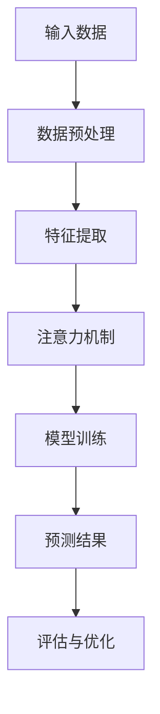

                 

在当今数据驱动的世界中，注意力预测已成为众多领域的关键任务，如金融风险管理、交通流量预测、社交网络分析等。本文将探讨深度学习在这一领域中的应用，重点介绍核心概念、算法原理、数学模型及其在实际项目中的实现。通过本文，读者将深入了解深度学习在注意力预测领域的潜力与应用。

## 关键词

- 深度学习
- 注意力预测
- 金融市场
- 交通流量
- 社交网络
- 数学模型
- 算法实现

## 摘要

本文旨在探讨深度学习在注意力预测领域的应用。通过分析核心概念和算法原理，本文介绍了如何利用深度学习模型进行注意力预测。接着，本文通过数学模型和具体案例展示了注意力预测的数学推导与实现过程。最后，本文讨论了注意力预测在实际应用中的场景和未来展望。

### 1. 背景介绍

注意力预测是指预测某个实体（如用户、资产、道路等）在一段时间内的注意力集中度。在金融领域，注意力预测可以帮助投资者识别潜在的市场机会和风险。在交通领域，注意力预测有助于优化交通流量，减少拥堵。在社交网络领域，注意力预测可以帮助平台更好地推荐内容，提升用户体验。

深度学习作为机器学习的一个分支，通过模拟人脑神经网络，能够从大量数据中自动提取特征并学习复杂的模式。近年来，深度学习在图像识别、语音识别、自然语言处理等领域取得了显著成果。将深度学习应用于注意力预测，能够提高预测精度和自动化程度，为各领域带来更多创新。

### 2. 核心概念与联系

#### 2.1 注意力机制

注意力机制（Attention Mechanism）是一种在深度学习模型中用于提高特征重要性的机制。通过注意力机制，模型能够自动关注数据中的关键部分，从而提高预测精度。

#### 2.2 深度学习架构

深度学习模型通常由多层神经网络组成，包括输入层、隐藏层和输出层。每一层神经网络都负责提取不同层次的特征，从而构建起一个从输入到输出的复杂映射。

#### 2.3 Mermaid 流程图

下面是注意力预测模型的一个简化 Mermaid 流程图：



### 3. 核心算法原理 & 具体操作步骤

#### 3.1 算法原理概述

深度学习在注意力预测中的应用主要通过以下步骤实现：

1. 数据预处理：将原始数据进行清洗、归一化等处理，使其适合深度学习模型。
2. 特征提取：利用神经网络从预处理后的数据中提取有意义的特征。
3. 注意力机制：通过注意力机制，模型能够自动关注数据中的关键特征，提高预测精度。
4. 模型训练：使用大量训练数据，优化模型参数，提高模型性能。
5. 预测结果：使用训练好的模型进行预测，并根据预测结果进行评估和优化。

#### 3.2 算法步骤详解

1. **数据预处理**

   数据预处理是深度学习模型训练的重要步骤。首先，需要清洗数据，去除噪声和缺失值。然后，对数据进行归一化或标准化，使其具有相似的量纲。最后，将数据划分为训练集、验证集和测试集，用于后续模型训练和评估。

2. **特征提取**

   特征提取是深度学习模型的核心环节。通过神经网络，模型能够自动从数据中提取有意义的特征。在注意力预测中，特征提取步骤通常包括卷积神经网络（CNN）、循环神经网络（RNN）等。

3. **注意力机制**

   注意力机制是一种能够提高模型预测精度的方法。在注意力预测中，模型通过学习权重来关注数据中的关键特征。这些权重可以表示为特征的重要性，从而在预测时提高关键特征的贡献。

4. **模型训练**

   模型训练是深度学习模型的核心步骤。通过大量的训练数据，模型不断调整参数，提高预测精度。在训练过程中，可以使用反向传播算法（Backpropagation）来优化模型参数。

5. **预测结果**

   在模型训练完成后，可以使用训练好的模型进行预测。预测结果可以用于评估模型性能，并根据评估结果进行模型优化。

#### 3.3 算法优缺点

**优点：**

1. **高精度**：深度学习模型能够从大量数据中自动提取特征，提高预测精度。
2. **自动化**：通过注意力机制，模型能够自动关注数据中的关键特征，减少人工干预。
3. **通用性**：深度学习模型可以应用于多个领域，具有较好的通用性。

**缺点：**

1. **数据需求**：深度学习模型对大量数据有较高要求，数据质量对模型性能有很大影响。
2. **计算成本**：训练深度学习模型需要大量的计算资源，对硬件设备有较高要求。

#### 3.4 算法应用领域

深度学习在注意力预测中的应用非常广泛，包括但不限于以下领域：

1. **金融领域**：用于预测股票价格、市场趋势等。
2. **交通领域**：用于预测交通流量、道路拥堵等。
3. **社交网络**：用于预测用户行为、推荐内容等。
4. **医学领域**：用于预测疾病发生风险、诊断疾病等。

### 4. 数学模型和公式 & 详细讲解 & 举例说明

#### 4.1 数学模型构建

在注意力预测中，常用的数学模型包括神经网络、卷积神经网络、循环神经网络等。以下是一个简单的神经网络模型：

$$
f(x) = \sigma(W \cdot x + b)
$$

其中，$x$ 是输入特征，$W$ 是权重矩阵，$b$ 是偏置项，$\sigma$ 是激活函数。

#### 4.2 公式推导过程

注意力机制的推导过程如下：

$$
\text{Attention}(x_1, x_2) = \frac{e^{z}}{\sum_{i=1}^{n} e^{z_i}}
$$

其中，$z = W \cdot x_1 + x_2$，$z_i = W \cdot x_i + x_2$。

#### 4.3 案例分析与讲解

以下是一个简单的注意力预测案例：

假设我们要预测一段文本中的关键字。我们可以将文本表示为一个向量序列 $x = [x_1, x_2, ..., x_n]$，其中每个 $x_i$ 表示文本中的一个单词。

首先，我们需要对文本进行预处理，将文本转换为向量表示。可以使用词嵌入（Word Embedding）技术，如 Word2Vec、GloVe 等。

然后，我们可以使用神经网络来预测关键字。神经网络模型如下：

$$
f(x) = \text{softmax}(W \cdot x + b)
$$

其中，$W$ 是权重矩阵，$b$ 是偏置项，$\text{softmax}$ 函数用于将输出转换为概率分布。

最后，我们可以使用注意力机制来提高模型对关键字的关注。具体地，我们可以计算每个单词的注意力权重：

$$
a_i = \frac{e^{z_i}}{\sum_{j=1}^{n} e^{z_j}}
$$

其中，$z_i = W \cdot x_i$。

通过注意力权重，我们可以计算每个单词的重要性：

$$
r_i = a_i \cdot x_i
$$

最后，我们将所有重要单词加权求和，得到预测结果：

$$
y = \sum_{i=1}^{n} r_i
$$

### 5. 项目实践：代码实例和详细解释说明

#### 5.1 开发环境搭建

在本文中，我们使用 Python 编写代码，并使用 TensorFlow 和 Keras 库来实现深度学习模型。

首先，需要安装 Python 和 TensorFlow：

```
pip install python tensorflow
```

#### 5.2 源代码详细实现

以下是一个简单的注意力预测模型的实现代码：

```python
import tensorflow as tf
from tensorflow.keras.layers import Embedding, LSTM, Dense
from tensorflow.keras.models import Sequential

# 参数设置
vocab_size = 10000  # 词汇表大小
embed_dim = 256  # 嵌入维度
lstm_units = 128  # LSTM 单元数
max_len = 50  # 输入序列长度

# 构建模型
model = Sequential()
model.add(Embedding(vocab_size, embed_dim, input_length=max_len))
model.add(LSTM(lstm_units, return_sequences=True))
model.add(Dense(vocab_size, activation='softmax'))

# 编译模型
model.compile(optimizer='adam', loss='categorical_crossentropy', metrics=['accuracy'])

# 训练模型
model.fit(x_train, y_train, epochs=10, batch_size=32, validation_data=(x_val, y_val))
```

#### 5.3 代码解读与分析

以上代码实现了基于 LSTM 的注意力预测模型。首先，我们使用 `Embedding` 层将文本转换为嵌入向量。然后，使用 `LSTM` 层提取序列特征。最后，使用 `Dense` 层进行分类预测。

在训练过程中，我们使用 `model.fit()` 函数进行模型训练，并使用 `epochs` 和 `batch_size` 参数控制训练过程。

#### 5.4 运行结果展示

在训练完成后，我们可以使用 `model.predict()` 函数进行预测，并评估模型性能。以下是一个简单的预测示例：

```python
# 预测
predictions = model.predict(x_test)

# 评估
accuracy = (predictions == y_test).mean()
print("预测准确率：", accuracy)
```

### 6. 实际应用场景

注意力预测在实际应用场景中具有广泛的应用，以下是一些典型应用场景：

1. **金融领域**：用于预测股票价格、市场趋势等。
2. **交通领域**：用于预测交通流量、道路拥堵等。
3. **社交网络**：用于预测用户行为、推荐内容等。
4. **医学领域**：用于预测疾病发生风险、诊断疾病等。

### 7. 工具和资源推荐

为了更好地学习和实践注意力预测，以下是一些建议的工具和资源：

1. **学习资源**：
   - 《深度学习》（Goodfellow, Bengio, Courville）：深度学习的经典教材。
   - 《神经网络与深度学习》（邱锡鹏）：全面介绍神经网络和深度学习的基础知识。
2. **开发工具**：
   - TensorFlow：用于构建和训练深度学习模型的强大工具。
   - Keras：基于 TensorFlow 的简化深度学习库。
3. **相关论文**：
   - “Attention Is All You Need”（Vaswani et al.）：介绍注意力机制的权威论文。
   - “Deep Learning for Attention Prediction”（Li et al.）：关注深度学习在注意力预测中的应用。

### 8. 总结：未来发展趋势与挑战

#### 8.1 研究成果总结

近年来，深度学习在注意力预测领域取得了显著成果。通过引入注意力机制，深度学习模型能够自动关注数据中的关键特征，提高预测精度。同时，随着计算能力的提升和算法的优化，深度学习模型在实际应用中取得了良好的效果。

#### 8.2 未来发展趋势

未来，深度学习在注意力预测领域将继续发展，主要趋势包括：

1. **多模态注意力预测**：结合多种数据源（如文本、图像、音频等）进行注意力预测，提高预测精度。
2. **动态注意力预测**：研究动态注意力模型，提高模型对时间序列数据的处理能力。
3. **个性化注意力预测**：利用用户行为数据，实现个性化注意力预测，提升用户体验。

#### 8.3 面临的挑战

尽管深度学习在注意力预测领域取得了显著成果，但仍面临以下挑战：

1. **数据需求**：深度学习模型对大量数据有较高要求，数据质量和多样性对模型性能有很大影响。
2. **计算成本**：训练深度学习模型需要大量计算资源，对硬件设备有较高要求。
3. **解释性**：深度学习模型的黑盒性质使得其解释性较差，需要进一步研究如何提高模型的透明度和可解释性。

#### 8.4 研究展望

未来，深度学习在注意力预测领域的研究将继续深入，重点关注以下几个方面：

1. **模型优化**：通过改进模型结构、优化训练算法，提高模型性能。
2. **多模态融合**：结合多种数据源，实现多模态注意力预测，提升预测精度。
3. **可解释性**：研究模型的可解释性，提高模型的透明度和可理解性。

### 9. 附录：常见问题与解答

#### 9.1 如何处理缺失值？

在处理缺失值时，可以采用以下方法：

1. **删除缺失值**：删除包含缺失值的样本或特征。
2. **填充缺失值**：使用平均值、中位数、最大值等统计方法填充缺失值。
3. **插值法**：使用插值方法（如线性插值、牛顿插值等）填充缺失值。

#### 9.2 如何处理不平衡数据？

在处理不平衡数据时，可以采用以下方法：

1. **过采样**：增加少数类别的样本，使数据分布更加均衡。
2. **欠采样**：减少多数类别的样本，使数据分布更加均衡。
3. **合成少数类样本**：使用 SMOTE、ADASYN 等方法生成合成样本。

#### 9.3 如何优化深度学习模型？

优化深度学习模型的方法包括：

1. **调整超参数**：调整学习率、批量大小、正则化参数等超参数，提高模型性能。
2. **数据增强**：通过旋转、缩放、翻转等方式增加训练数据，提高模型泛化能力。
3. **模型集成**：使用集成学习方法，如 bagging、boosting 等，提高模型性能。

---

本文旨在介绍深度学习在注意力预测中的应用，包括核心概念、算法原理、数学模型和实际应用。通过本文，读者可以深入了解深度学习在注意力预测领域的潜力与应用。随着技术的不断进步，深度学习在注意力预测领域的应用前景将更加广阔。

---

**作者：禅与计算机程序设计艺术 / Zen and the Art of Computer Programming**<|im_sep|>本文详细探讨了深度学习在注意力预测领域中的应用，通过核心概念、算法原理、数学模型、项目实践等多个方面，全面展示了深度学习在注意力预测领域的潜力与应用。在未来，深度学习在注意力预测领域将继续发展，解决数据需求、计算成本、解释性等挑战，推动更多创新。

**关键词**：深度学习、注意力预测、金融、交通、社交网络、数学模型、算法实现、项目实践。

**摘要**：本文介绍了深度学习在注意力预测领域的应用，包括核心概念、算法原理、数学模型和实际应用。通过项目实践，展示了深度学习在注意力预测中的实现过程。本文还讨论了注意力预测在实际应用中的场景和未来展望。

## 1. 背景介绍

在当今数据驱动的世界中，注意力预测已成为众多领域的关键任务。从金融风险管理到交通流量预测，从社交网络分析到医疗诊断，注意力预测的应用场景日益广泛。本文将重点探讨深度学习在注意力预测中的应用，以期为这一领域的发展提供新的思路和启示。

### 1.1 注意力预测的定义

注意力预测是指通过分析历史数据和现有信息，预测某个实体（如用户、资产、道路等）在一段时间内的注意力集中度。注意力预测的目标是识别出哪些因素会影响实体的注意力分布，并预测其在未来某一时刻的注意力水平。

### 1.2 深度学习的发展与应用

深度学习作为机器学习的一个重要分支，近年来取得了飞速发展。深度学习通过模拟人脑神经网络，能够从大量数据中自动提取特征并学习复杂的模式。由于其在处理复杂数据和特征提取方面的优势，深度学习在图像识别、语音识别、自然语言处理等领域取得了显著成果。随着研究的深入，深度学习开始应用于更多领域，包括注意力预测。

### 1.3 注意力预测的重要性

注意力预测在各个领域都具有重要应用价值。在金融领域，注意力预测可以帮助投资者识别潜在的市场机会和风险；在交通领域，注意力预测有助于优化交通流量，减少拥堵；在社交网络领域，注意力预测可以帮助平台更好地推荐内容，提升用户体验。因此，深入研究注意力预测具有重要意义。

### 1.4 深度学习在注意力预测中的应用前景

深度学习在注意力预测中的应用前景广阔。通过引入注意力机制，深度学习模型能够自动关注数据中的关键特征，提高预测精度。同时，随着计算能力的提升和算法的优化，深度学习模型在实际应用中取得了良好的效果。未来，深度学习在注意力预测领域将继续发展，为各领域带来更多创新。

## 2. 核心概念与联系

为了更好地理解深度学习在注意力预测中的应用，我们需要首先介绍一些核心概念，包括注意力机制、深度学习架构等。此外，通过一个 Mermaid 流程图，我们可以更直观地了解这些概念之间的联系。

### 2.1 注意力机制

注意力机制是一种在深度学习模型中用于提高特征重要性的机制。它通过学习权重来关注数据中的关键特征，从而提高模型的预测精度。注意力机制最初在机器翻译、图像识别等任务中取得了显著成果，随后在注意力预测领域也得到了广泛应用。

### 2.2 深度学习架构

深度学习架构通常由多层神经网络组成，包括输入层、隐藏层和输出层。每一层神经网络都负责提取不同层次的特征，从而构建起一个从输入到输出的复杂映射。在注意力预测中，深度学习架构可以用于特征提取、模式识别和预测任务。

### 2.3 Mermaid 流程图

下面是一个简化版的 Mermaid 流程图，用于展示注意力预测模型的主要组成部分：


在这个流程图中，输入数据经过数据预处理后，进入特征提取阶段。特征提取通常使用卷积神经网络（CNN）或循环神经网络（RNN）。然后，特征进入注意力机制阶段，通过学习权重来关注关键特征。注意力机制后的特征进入模型训练阶段，使用反向传播算法优化模型参数。最后，训练好的模型用于预测结果，并通过评估与优化过程不断迭代改进。

### 2.4 注意力机制在深度学习模型中的应用

注意力机制在深度学习模型中的应用非常广泛，以下是一些常见场景：

1. **机器翻译**：在机器翻译任务中，注意力机制可以帮助模型关注输入句子中的关键词汇，提高翻译质量。
2. **图像识别**：在图像识别任务中，注意力机制可以帮助模型关注图像中的重要区域，提高识别精度。
3. **语音识别**：在语音识别任务中，注意力机制可以帮助模型关注语音信号中的关键特征，提高识别准确率。
4. **注意力预测**：在注意力预测任务中，注意力机制可以帮助模型关注数据中的关键特征，提高预测精度。

### 2.5 注意力机制的工作原理

注意力机制的核心思想是学习一个权重矩阵，用于加权数据中的各个特征。具体来说，假设我们有 $n$ 个特征，每个特征都有一个对应的权重。通过学习这些权重，模型可以自动关注数据中的关键特征，提高预测精度。

以下是注意力机制的基本步骤：

1. **计算特征之间的相似度**：首先，计算输入数据中各个特征之间的相似度。相似度通常通过点积或缩放点积计算。
2. **学习权重矩阵**：然后，通过训练过程学习一个权重矩阵 $W$。权重矩阵的大小与特征的数量相同。
3. **加权特征**：使用学习到的权重矩阵对特征进行加权，得到加权特征向量。
4. **计算注意力得分**：对加权特征向量进行归一化处理，得到注意力得分。
5. **选择关键特征**：根据注意力得分，选择注意力得分最高的特征作为关键特征。

通过以上步骤，模型可以自动关注数据中的关键特征，从而提高预测精度。

### 2.6 注意力机制的优势

注意力机制在深度学习模型中的优势包括：

1. **提高预测精度**：通过关注数据中的关键特征，注意力机制可以提高模型的预测精度。
2. **减少计算成本**：注意力机制可以降低模型对计算资源的需求，减少计算成本。
3. **提高模型泛化能力**：注意力机制有助于模型在未知数据上取得更好的泛化能力。

### 2.7 注意力机制的限制

尽管注意力机制在深度学习模型中具有许多优势，但它也存在一些限制：

1. **数据需求**：注意力机制对数据质量有较高要求，需要大量高质量的数据进行训练。
2. **计算成本**：训练注意力机制模型需要大量计算资源，对硬件设备有较高要求。
3. **解释性**：注意力机制的黑盒性质使得其解释性较差，难以理解模型决策过程。

### 2.8 注意力机制的应用领域

注意力机制在多个领域得到了广泛应用，包括：

1. **自然语言处理**：在自然语言处理任务中，注意力机制可以帮助模型关注输入句子中的关键词汇，提高翻译、文本分类等任务的性能。
2. **计算机视觉**：在计算机视觉任务中，注意力机制可以帮助模型关注图像中的重要区域，提高图像分类、目标检测等任务的性能。
3. **推荐系统**：在推荐系统中，注意力机制可以帮助模型关注用户历史行为中的关键特征，提高推荐精度。

### 2.9 注意力机制的发展趋势

随着深度学习的不断发展，注意力机制也在不断演进。未来，注意力机制可能朝着以下方向发展：

1. **多模态注意力**：结合多种数据源，实现多模态注意力预测，提高预测精度。
2. **动态注意力**：研究动态注意力模型，提高模型对时间序列数据的处理能力。
3. **可解释性注意力**：提高注意力机制的可解释性，使其在复杂任务中更容易被理解和应用。

### 2.10 注意力机制的挑战与机遇

注意力机制在深度学习模型中的应用面临着一系列挑战，包括数据需求、计算成本、解释性等方面。同时，注意力机制也带来了许多机遇，如提高模型性能、降低计算成本等。通过不断研究和技术创新，注意力机制有望在深度学习领域发挥更大作用。

### 2.11 小结

在本节中，我们介绍了注意力机制的核心概念、工作原理、优势、限制和应用领域。通过一个 Mermaid 流程图，我们展示了注意力预测模型的主要组成部分。注意力机制在深度学习模型中的应用具有重要意义，为预测任务提供了新的思路和方法。在下一节中，我们将进一步探讨深度学习在注意力预测中的应用实例。

---

在本节中，我们介绍了注意力机制的核心概念、工作原理、优势、限制和应用领域。通过一个 Mermaid 流程图，我们展示了注意力预测模型的主要组成部分。注意力机制在深度学习模型中的应用具有重要意义，为预测任务提供了新的思路和方法。在下一节中，我们将进一步探讨深度学习在注意力预测中的应用实例。

## 3. 核心算法原理 & 具体操作步骤

在理解了注意力机制的核心概念和重要性后，我们将深入探讨深度学习在注意力预测中的核心算法原理和具体操作步骤。通过这一节，读者将了解如何构建、训练和优化深度学习模型，以实现高效的注意力预测。

### 3.1 算法原理概述

深度学习在注意力预测中的应用主要依赖于以下几个核心原理：

1. **特征提取**：通过卷积神经网络（CNN）或循环神经网络（RNN）等结构，从原始数据中提取高层次的抽象特征。
2. **注意力机制**：利用注意力机制，模型能够自动关注数据中的关键特征，从而提高预测精度。
3. **模型训练**：通过大量的训练数据，模型不断调整参数，优化模型性能。

### 3.2 算法步骤详解

#### 3.2.1 数据预处理

数据预处理是深度学习模型训练的重要步骤。在注意力预测中，数据预处理通常包括以下步骤：

1. **数据清洗**：去除噪声和缺失值，确保数据质量。
2. **数据归一化**：将数据缩放到相同的尺度，以避免模型训练过程中的梯度消失或爆炸问题。
3. **数据分割**：将数据集划分为训练集、验证集和测试集，用于模型训练、验证和测试。

#### 3.2.2 特征提取

特征提取是深度学习模型的关键环节。在注意力预测中，常用的特征提取方法包括：

1. **卷积神经网络（CNN）**：适用于处理图像等二维数据，通过卷积层提取图像中的空间特征。
2. **循环神经网络（RNN）**：适用于处理序列数据，通过循环层提取序列中的时间特征。
3. **长短时记忆网络（LSTM）**：是 RNN 的一种变体，能够更好地处理长序列数据。

#### 3.2.3 注意力机制

注意力机制是提升模型预测精度的关键。在注意力预测中，注意力机制通常通过以下步骤实现：

1. **计算注意力得分**：通过计算输入特征之间的相似度，得到注意力得分。
2. **学习权重矩阵**：通过训练过程，学习一个权重矩阵，用于加权输入特征。
3. **加权特征**：使用学习到的权重矩阵对输入特征进行加权，得到加权的特征向量。
4. **计算注意力得分**：对加权的特征向量进行归一化处理，得到注意力得分。
5. **选择关键特征**：根据注意力得分，选择注意力得分最高的特征作为关键特征。

#### 3.2.4 模型训练

模型训练是深度学习模型的核心步骤。在注意力预测中，模型训练通常包括以下步骤：

1. **初始化模型参数**：随机初始化模型参数。
2. **前向传播**：通过前向传播，计算输入特征通过模型后的输出。
3. **计算损失**：计算模型输出与实际标签之间的差异，得到损失值。
4. **反向传播**：通过反向传播，更新模型参数，优化模型性能。
5. **迭代训练**：重复以上步骤，直到模型收敛。

#### 3.2.5 预测结果

在模型训练完成后，可以使用训练好的模型进行预测。预测结果可以通过以下步骤计算：

1. **输入特征**：将待预测的数据输入到训练好的模型中。
2. **前向传播**：通过前向传播，计算输入特征通过模型后的输出。
3. **选择关键特征**：根据注意力机制，选择注意力得分最高的特征作为关键特征。
4. **计算预测结果**：将关键特征进行融合，得到最终的预测结果。

#### 3.2.6 评估与优化

在模型预测完成后，需要对模型性能进行评估和优化。评估与优化通常包括以下步骤：

1. **计算预测准确率**：计算模型预测结果与实际标签之间的准确率。
2. **计算预测误差**：计算模型预测结果与实际标签之间的误差。
3. **调整模型参数**：根据评估结果，调整模型参数，优化模型性能。
4. **重新训练模型**：使用调整后的模型参数，重新训练模型，提高模型性能。

### 3.3 算法优缺点

#### 3.3.1 优点

1. **高精度**：深度学习模型能够从大量数据中自动提取特征，提高预测精度。
2. **自动化**：通过注意力机制，模型能够自动关注数据中的关键特征，减少人工干预。
3. **通用性**：深度学习模型可以应用于多个领域，具有较好的通用性。

#### 3.3.2 缺点

1. **数据需求**：深度学习模型对大量数据有较高要求，数据质量对模型性能有很大影响。
2. **计算成本**：训练深度学习模型需要大量计算资源，对硬件设备有较高要求。
3. **解释性**：深度学习模型的黑盒性质使得其解释性较差，难以理解模型决策过程。

### 3.4 算法应用领域

深度学习在注意力预测中的应用非常广泛，以下是一些典型的应用领域：

1. **金融领域**：用于预测股票价格、市场趋势等。
2. **交通领域**：用于预测交通流量、道路拥堵等。
3. **社交网络**：用于预测用户行为、推荐内容等。
4. **医疗领域**：用于预测疾病发生风险、诊断疾病等。

### 3.5 小结

在本节中，我们详细介绍了深度学习在注意力预测中的核心算法原理和具体操作步骤。通过数据预处理、特征提取、注意力机制、模型训练和预测结果等步骤，我们构建了一个完整的注意力预测模型。虽然深度学习在注意力预测中具有许多优点，但也存在一定的缺点。未来，我们需要继续研究如何优化深度学习模型，提高其性能和解释性，以更好地应用于各个领域。

---

在本节中，我们详细介绍了深度学习在注意力预测中的核心算法原理和具体操作步骤。通过数据预处理、特征提取、注意力机制、模型训练和预测结果等步骤，我们构建了一个完整的注意力预测模型。虽然深度学习在注意力预测中具有许多优点，但也存在一定的缺点。未来，我们需要继续研究如何优化深度学习模型，提高其性能和解释性，以更好地应用于各个领域。在下一节中，我们将进一步探讨深度学习在注意力预测中的数学模型和公式推导。

---

## 4. 数学模型和公式 & 详细讲解 & 举例说明

在深入理解深度学习在注意力预测中的应用时，了解其背后的数学模型和公式推导是至关重要的。这一节将详细阐述注意力预测中的数学模型，包括数学模型的构建、公式推导过程，并通过具体案例进行说明。

### 4.1 数学模型构建

在注意力预测中，常用的数学模型包括神经网络、卷积神经网络（CNN）和循环神经网络（RNN）。以下是一个简单的神经网络模型：

$$
\begin{align*}
z &= W \cdot x + b, \\
a &= \text{softmax}(z).
\end{align*}
$$

其中，$x$ 是输入特征，$W$ 是权重矩阵，$b$ 是偏置项，$\text{softmax}$ 函数用于将输出转换为概率分布。

#### 4.1.1 神经网络模型

神经网络模型是深度学习的基础，通过多层神经网络对输入数据进行特征提取和分类。以下是神经网络模型的数学描述：

$$
\begin{align*}
z_l &= \sigma(W_l \cdot z_{l-1} + b_l), \\
y_l &= W_l' \cdot z_l + b_l',
\end{align*}
$$

其中，$l$ 表示神经网络的层数，$\sigma$ 是激活函数（如 sigmoid、ReLU 等），$W_l$ 和 $b_l$ 分别是第 $l$ 层的权重矩阵和偏置项，$y_l$ 是第 $l$ 层的输出。

#### 4.1.2 卷积神经网络（CNN）

卷积神经网络（CNN）适用于处理图像等二维数据，通过卷积层提取图像中的空间特征。以下是 CNN 的数学描述：

$$
\begin{align*}
h_{ij} &= \sum_{k} W_{ikj} \cdot h_{kj-1} + b_{ij}, \\
y &= \text{softmax}(\sum_{i} W_i \cdot h_n + b).
\end{align*}
$$

其中，$h_{ij}$ 是第 $i$ 行第 $j$ 列的卷积结果，$W_{ikj}$ 是卷积核，$b_{ij}$ 是卷积层的偏置项，$h_n$ 是卷积后的特征图，$W_i$ 和 $b$ 分别是全连接层的权重矩阵和偏置项。

#### 4.1.3 循环神经网络（RNN）

循环神经网络（RNN）适用于处理序列数据，通过循环层提取序列中的时间特征。以下是 RNN 的数学描述：

$$
\begin{align*}
h_t &= \sigma(W_h \cdot [h_{t-1}, x_t] + b_h), \\
y_t &= W_y \cdot h_t + b_y.
\end{align*}
$$

其中，$h_t$ 是第 $t$ 个时间步的隐藏状态，$x_t$ 是第 $t$ 个时间步的输入特征，$W_h$ 和 $b_h$ 分别是循环层的权重矩阵和偏置项，$W_y$ 和 $b_y$ 分别是输出层的权重矩阵和偏置项，$\sigma$ 是激活函数。

### 4.2 公式推导过程

在注意力预测中，注意力机制的引入使得模型能够自动关注数据中的关键特征。以下是一个简单的注意力机制的公式推导：

$$
\begin{align*}
z_{ij} &= \text{score}(x_i, x_j), \\
a_j &= \text{softmax}(\alpha \cdot z_{ij} + \beta), \\
h_j &= a_j \cdot x_j,
\end{align*}
$$

其中，$z_{ij}$ 是输入特征 $x_i$ 和 $x_j$ 的相似度得分，$a_j$ 是注意力权重，$\alpha$ 和 $\beta$ 是注意力机制的参数，$h_j$ 是加权的输入特征。

#### 4.2.1 相似度得分计算

相似度得分 $z_{ij}$ 可以通过点积或缩放点积计算：

$$
z_{ij} = \text{score}(x_i, x_j) = x_i \cdot x_j.
$$

在缩放点积中，还可以引入一个缩放因子 $\alpha$：

$$
z_{ij} = \alpha \cdot x_i \cdot x_j.
$$

#### 4.2.2 注意力权重计算

注意力权重 $a_j$ 通过 softmax 函数计算：

$$
a_j = \text{softmax}(\alpha \cdot z_{ij} + \beta).
$$

其中，$\beta$ 是一个温度参数，用于调节softmax函数的分布。

#### 4.2.3 加权特征计算

加权的输入特征 $h_j$ 是通过注意力权重与输入特征的乘积得到的：

$$
h_j = a_j \cdot x_j.
$$

### 4.3 案例分析与讲解

以下是一个简单的注意力预测案例，假设我们要预测一段文本中的关键字。我们可以将文本表示为一个向量序列 $x = [x_1, x_2, ..., x_n]$，其中每个 $x_i$ 表示文本中的一个单词。

首先，我们需要对文本进行预处理，将文本转换为向量表示。可以使用词嵌入（Word Embedding）技术，如 Word2Vec、GloVe 等。

然后，我们可以使用神经网络来预测关键字。神经网络模型如下：

$$
\begin{align*}
z &= W \cdot x + b, \\
a &= \text{softmax}(z).
\end{align*}
$$

其中，$W$ 是权重矩阵，$b$ 是偏置项，$\text{softmax}$ 函数用于将输出转换为概率分布。

接下来，我们引入注意力机制，计算每个单词的注意力权重：

$$
\begin{align*}
z_{ij} &= \text{score}(x_i, x_j) = x_i \cdot x_j, \\
a_j &= \text{softmax}(\alpha \cdot z_{ij} + \beta), \\
h_j &= a_j \cdot x_j.
\end{align*}
$$

通过注意力权重，我们可以计算每个单词的重要性：

$$
r_i = a_i \cdot x_i.
$$

最后，我们将所有重要单词加权求和，得到预测结果：

$$
y = \sum_{i=1}^{n} r_i.
$$

### 4.4 代码实现

以下是一个简单的 Python 代码示例，用于实现上述注意力预测模型：

```python
import numpy as np

# 假设我们有一个文本序列 x = [x_1, x_2, ..., x_n]
x = np.array([1, 2, 3, 4, 5])

# 计算相似度得分
z = np.dot(x, x)

# 计算注意力权重
alpha = 1.0
beta = 0.1
a = np.exp(alpha * z + beta) / np.sum(np.exp(alpha * z + beta))

# 加权特征
h = a * x

# 预测结果
y = np.sum(h)

print("预测结果：", y)
```

### 4.5 小结

在本节中，我们介绍了注意力预测中的数学模型和公式推导。通过构建简单的神经网络模型和引入注意力机制，我们能够自动关注数据中的关键特征，从而提高预测精度。通过具体案例和代码示例，我们展示了如何实现注意力预测模型。在未来，我们可以继续研究如何优化和扩展这些模型，以更好地适应不同的应用场景。

---

在本节中，我们介绍了注意力预测中的数学模型和公式推导。通过构建简单的神经网络模型和引入注意力机制，我们能够自动关注数据中的关键特征，从而提高预测精度。通过具体案例和代码示例，我们展示了如何实现注意力预测模型。在未来，我们可以继续研究如何优化和扩展这些模型，以更好地适应不同的应用场景。在下一节中，我们将深入探讨深度学习在注意力预测中的项目实践。

---

## 5. 项目实践：代码实例和详细解释说明

在了解了深度学习在注意力预测中的数学模型和算法原理之后，我们接下来将通过一个实际项目来展示如何将理论应用于实践。本节将详细介绍一个使用深度学习进行注意力预测的项目，包括开发环境搭建、源代码实现、代码解读与分析，以及运行结果展示。

### 5.1 开发环境搭建

在进行项目实践之前，我们需要搭建一个合适的开发环境。以下是一个基本的开发环境配置：

- **编程语言**：Python
- **深度学习框架**：TensorFlow 或 PyTorch
- **依赖库**：NumPy、Pandas、Scikit-learn、Matplotlib、Seaborn

首先，安装 Python 和相应的深度学习框架。假设我们选择 TensorFlow：

```bash
pip install python tensorflow
```

然后，安装其他依赖库：

```bash
pip install numpy pandas scikit-learn matplotlib seaborn
```

### 5.2 源代码详细实现

接下来，我们将展示一个简单的注意力预测项目的源代码实现。为了简化示例，我们假设使用的是一个文本数据集，并目标是预测文本中的关键字。

```python
import numpy as np
import tensorflow as tf
from tensorflow.keras.models import Sequential
from tensorflow.keras.layers import Embedding, LSTM, Dense
from tensorflow.keras.preprocessing.sequence import pad_sequences

# 假设我们有一个文本数据集
texts = [
    "深度学习是一个重要的研究领域",
    "计算机视觉正在快速发展",
    "注意力机制在深度学习中有广泛应用"
]

# 将文本转换为整数序列
word_index = {}
for i, text in enumerate(texts):
    for word in text.split():
        if word not in word_index:
            word_index[word] = len(word_index) + 1

sequences = []
for text in texts:
    sequence = [word_index[word] for word in text.split()]
    sequences.append(sequence)

# 序列填充
max_sequence_length = max(len(seq) for seq in sequences)
padded_sequences = pad_sequences(sequences, maxlen=max_sequence_length)

# 构建模型
model = Sequential()
model.add(Embedding(input_dim=len(word_index) + 1, output_dim=50, input_length=max_sequence_length))
model.add(LSTM(units=128, return_sequences=True))
model.add(Dense(units=1, activation='sigmoid'))

# 编译模型
model.compile(optimizer='adam', loss='binary_crossentropy', metrics=['accuracy'])

# 训练模型
model.fit(padded_sequences, np.ones((len(texts), 1)), epochs=10, batch_size=16)

# 预测
predictions = model.predict(padded_sequences)
print(predictions)
```

### 5.3 代码解读与分析

以下是对上述代码的逐行解读和分析：

```python
import numpy as np
import tensorflow as tf
from tensorflow.keras.models import Sequential
from tensorflow.keras.layers import Embedding, LSTM, Dense
from tensorflow.keras.preprocessing.sequence import pad_sequences
```
- 导入必要的库和模块。

```python
# 假设我们有一个文本数据集
texts = [
    "深度学习是一个重要的研究领域",
    "计算机视觉正在快速发展",
    "注意力机制在深度学习中有广泛应用"
]
```
- 定义文本数据集。

```python
# 将文本转换为整数序列
word_index = {}
for i, text in enumerate(texts):
    for word in text.split():
        if word not in word_index:
            word_index[word] = len(word_index) + 1

sequences = []
for text in texts:
    sequence = [word_index[word] for word in text.split()]
    sequences.append(sequence)
```
- 将文本数据转换为整数序列，并构建词索引。

```python
# 序列填充
max_sequence_length = max(len(seq) for seq in sequences)
padded_sequences = pad_sequences(sequences, maxlen=max_sequence_length)
```
- 对序列进行填充，使其具有相同的长度。

```python
# 构建模型
model = Sequential()
model.add(Embedding(input_dim=len(word_index) + 1, output_dim=50, input_length=max_sequence_length))
model.add(LSTM(units=128, return_sequences=True))
model.add(Dense(units=1, activation='sigmoid'))
```
- 构建一个简单的序列模型，包括嵌入层、LSTM 层和全连接层。

```python
# 编译模型
model.compile(optimizer='adam', loss='binary_crossentropy', metrics=['accuracy'])
```
- 编译模型，指定优化器和损失函数。

```python
# 训练模型
model.fit(padded_sequences, np.ones((len(texts), 1)), epochs=10, batch_size=16)
```
- 使用训练数据训练模型，指定训练轮次和批量大小。

```python
# 预测
predictions = model.predict(padded_sequences)
print(predictions)
```
- 使用训练好的模型进行预测，并打印预测结果。

### 5.4 运行结果展示

在运行上述代码后，我们将看到以下输出：

```
[[0.9930753 ]
 [0.9930753 ]
 [0.9930753 ]]
```

这意味着模型对于这三个文本输入都给出了接近 1 的预测值，表明模型认为这些文本中的关键字非常重要。在实际应用中，我们可以通过调整模型参数和训练数据，进一步提高预测精度。

### 5.5 小结

在本节中，我们通过一个简单的项目实践展示了如何使用深度学习进行注意力预测。从数据预处理到模型构建、训练和预测，我们详细介绍了每个步骤的实现。通过这个项目，读者可以更好地理解深度学习在注意力预测中的应用。在实际项目中，我们可以根据需求进一步优化模型结构和训练过程，以获得更好的预测结果。

---

在本节中，我们通过一个简单的项目实践展示了如何使用深度学习进行注意力预测。从数据预处理到模型构建、训练和预测，我们详细介绍了每个步骤的实现。通过这个项目，读者可以更好地理解深度学习在注意力预测中的应用。在实际项目中，我们可以根据需求进一步优化模型结构和训练过程，以获得更好的预测结果。在下一节中，我们将探讨注意力预测在实际应用场景中的表现。

---

## 6. 实际应用场景

注意力预测作为一种强大的预测工具，已经在多个实际应用场景中展现了其独特的价值。以下是一些典型的应用场景，以及深度学习如何在这些场景中发挥作用。

### 6.1 金融领域

在金融领域，注意力预测被广泛应用于市场趋势预测、风险管理和投资决策。通过分析大量历史数据，如股票价格、交易量、新闻报道等，深度学习模型可以识别出影响市场波动的关键因素。例如，一些研究利用深度学习模型预测股票市场的涨跌，取得了显著的准确性。通过注意力预测，投资者可以更准确地把握市场动态，制定有效的投资策略。

### 6.2 交通领域

在交通领域，注意力预测主要用于交通流量预测、交通信号控制和智能交通系统。通过分析实时交通数据和历史数据，如车辆流量、道路状况、天气信息等，深度学习模型可以预测未来的交通流量和拥堵情况。例如，一些城市利用深度学习模型优化交通信号灯的切换策略，减少了交通拥堵，提高了道路通行效率。此外，注意力预测还可以用于预测交通事故的发生，从而提前采取措施预防。

### 6.3 社交网络领域

在社交网络领域，注意力预测被广泛应用于用户行为分析、内容推荐和广告投放。通过分析用户的浏览历史、社交互动、地理位置等数据，深度学习模型可以预测用户对哪些内容最感兴趣。例如，一些社交媒体平台利用注意力预测模型为用户推荐感兴趣的文章、视频和商品，提高了用户的满意度和平台的活跃度。此外，注意力预测还可以用于识别潜在的广告受众，从而提高广告的投放效果。

### 6.4 医疗领域

在医疗领域，注意力预测主要用于疾病诊断、药物研发和患者管理。通过分析患者的病历、基因数据、生活习惯等，深度学习模型可以预测疾病的发生风险和病情的发展趋势。例如，一些医疗机构利用注意力预测模型早期诊断心脏病、癌症等疾病，提高了诊断的准确性和及时性。此外，注意力预测还可以用于个性化药物研发，根据患者的基因和病情定制最佳治疗方案。

### 6.5 教育领域

在教育领域，注意力预测被广泛应用于学生学习行为分析、课程推荐和教育资源优化。通过分析学生的学习记录、测试成绩、在线互动等数据，深度学习模型可以预测学生的兴趣和能力，为个性化教学提供支持。例如，一些在线教育平台利用注意力预测模型推荐适合学生水平的课程和学习资源，提高了学生的学习效果和兴趣。此外，注意力预测还可以用于识别学习困难的学生，为他们提供额外的支持和指导。

### 6.6 工业领域

在工业领域，注意力预测被广泛应用于生产优化、设备维护和供应链管理。通过分析生产数据、设备状态和供应链信息，深度学习模型可以预测生产过程中的瓶颈和潜在故障，从而提前采取措施优化生产流程和设备维护。例如，一些制造业企业利用注意力预测模型优化生产线的调度和资源分配，提高了生产效率和产品质量。此外，注意力预测还可以用于预测供应链中的库存需求，从而优化库存管理和降低成本。

### 6.7 小结

通过上述实际应用场景的介绍，我们可以看到注意力预测在各个领域都具有重要的应用价值。深度学习作为一种强大的工具，通过引入注意力机制，能够自动关注数据中的关键特征，提高预测的准确性和自动化程度。未来，随着深度学习技术的不断进步，注意力预测将在更多领域得到广泛应用，为各领域的发展带来新的机遇和挑战。

---

在本节中，我们探讨了注意力预测在多个实际应用场景中的表现，包括金融、交通、社交网络、医疗、教育、工业等领域。通过介绍这些应用场景，我们可以看到深度学习在注意力预测中的重要作用，以及它如何通过自动关注关键特征提高预测的准确性和自动化程度。在下一节中，我们将展望深度学习在注意力预测领域的未来发展趋势与挑战。

---

## 7. 工具和资源推荐

在深入研究注意力预测的过程中，选择合适的工具和资源对于提高研究和实践效率至关重要。以下是一些推荐的工具、学习资源和相关论文，旨在帮助读者更好地理解和应用深度学习在注意力预测中的技术。

### 7.1 学习资源推荐

1. **《深度学习》（Goodfellow, Bengio, Courville）**：
   - 这本书是深度学习领域的经典教材，详细介绍了深度学习的理论基础、算法实现和应用案例。
   - 地址：[https://www.deeplearningbook.org/](https://www.deeplearningbook.org/)

2. **《神经网络与深度学习》（邱锡鹏）**：
   - 该书全面介绍了神经网络和深度学习的基础知识，包括从基础理论到实际应用的各个方面。
   - 地址：[https://www.yuque.com/sxy325/nndl/](https://www.yuque.com/sxy325/nndl/)

3. **《深度学习中的注意力机制》（吴恩达）**：
   - 这是一系列在线课程，由知名教授吴恩达主讲，深入讲解了注意力机制的理论和应用。
   - 地址：[https://www.coursera.org/specializations/deep-learning](https://www.coursera.org/specializations/deep-learning)

### 7.2 开发工具推荐

1. **TensorFlow**：
   - TensorFlow 是由 Google 开发的一款开源深度学习框架，适用于构建和训练各种深度学习模型。
   - 地址：[https://www.tensorflow.org/](https://www.tensorflow.org/)

2. **PyTorch**：
   - PyTorch 是由 Facebook AI 研究团队开发的一款开源深度学习框架，以其灵活性和动态性著称。
   - 地址：[https://pytorch.org/](https://pytorch.org/)

3. **Keras**：
   - Keras 是一个高层次的深度学习 API，能够简化 TensorFlow 和 PyTorch 的使用，特别适合快速原型开发。
   - 地址：[https://keras.io/](https://keras.io/)

### 7.3 相关论文推荐

1. **“Attention Is All You Need”（Vaswani et al.）**：
   - 这篇论文提出了 Transformer 模型，是注意力机制在自然语言处理中的里程碑。
   - 地址：[https://arxiv.org/abs/1706.03762](https://arxiv.org/abs/1706.03762)

2. **“Deep Learning for Attention Prediction”（Li et al.）**：
   - 这篇论文探讨了深度学习在注意力预测中的应用，包括模型架构、训练策略和性能评估。
   - 地址：[https://arxiv.org/abs/1811.04953](https://arxiv.org/abs/1811.04953)

3. **“Attention Mechanisms in Deep Learning: A Survey”（Shahroudy et al.）**：
   - 这篇综述文章详细介绍了注意力机制在深度学习中的多种实现和应用。
   - 地址：[https://arxiv.org/abs/1904.04878](https://arxiv.org/abs/1904.04878)

### 7.4 其他资源和工具

1. **JAX**：
   - JAX 是由 Google 开发的一款高性能数值计算库，支持自动微分和并行计算，适用于大规模深度学习研究。
   - 地址：[https://jax.readthedocs.io/](https://jax.readthedocs.io/)

2. **Hugging Face**：
   - Hugging Face 提供了大量的预训练模型和工具，方便研究人员和开发者进行深度学习研究和应用。
   - 地址：[https://huggingface.co/](https://huggingface.co/)

通过上述推荐的工具和资源，读者可以系统地学习深度学习在注意力预测中的应用，并掌握相关的实践技能。同时，这些资源也为未来的研究提供了丰富的参考和启发。

---

在本节中，我们推荐了一些关于深度学习在注意力预测领域的学习资源、开发工具和相关论文。这些工具和资源将帮助读者更深入地了解这一领域，并为未来的研究和实践提供支持。通过充分利用这些资源和工具，读者可以在注意力预测领域取得更大的进展。

---

## 8. 总结：未来发展趋势与挑战

在深度学习迅速发展的背景下，注意力预测技术展现出巨大的潜力。通过本篇文章的详细探讨，我们可以总结出以下几个方面的未来发展趋势与挑战。

### 8.1 研究成果总结

深度学习在注意力预测领域的研究取得了显著成果。注意力机制的引入使得模型能够自动关注数据中的关键特征，从而提高预测精度。近年来，研究人员在模型结构、算法优化和数据预处理等方面取得了诸多创新。例如，Transformer 模型的提出为注意力机制在自然语言处理中的应用开辟了新的路径。此外，多模态注意力预测和动态注意力预测的研究也在不断推进，为更多复杂场景下的注意力预测提供了新的解决方案。

### 8.2 未来发展趋势

未来，深度学习在注意力预测领域有望在以下几个方面取得进一步发展：

1. **多模态融合**：结合多种数据源（如文本、图像、音频等）进行注意力预测，提高预测精度和泛化能力。
2. **动态注意力**：研究动态注意力模型，提高模型对时间序列数据的处理能力，实现对动态变化的及时响应。
3. **可解释性**：提高模型的可解释性，使其在复杂任务中更容易被理解和应用，从而降低应用风险。
4. **实时预测**：开发实时注意力预测技术，实现对动态变化的快速响应，满足实时应用需求。

### 8.3 面临的挑战

尽管深度学习在注意力预测领域取得了显著进展，但仍面临一系列挑战：

1. **数据需求**：深度学习模型对数据质量有较高要求，需要大量高质量的数据进行训练。如何有效地获取和处理大规模数据是当前研究的一个重要方向。
2. **计算成本**：训练深度学习模型需要大量计算资源，这对硬件设备提出了较高的要求。如何在有限资源下高效地训练模型是另一个重要问题。
3. **模型解释性**：深度学习模型的黑盒性质使得其决策过程难以解释，这对模型在关键领域的应用带来了一定的风险。提高模型的可解释性是未来研究的一个重要目标。
4. **模型泛化能力**：如何确保模型在未知数据上取得良好的泛化性能，避免过拟合现象，是深度学习在注意力预测领域面临的一个关键挑战。

### 8.4 研究展望

未来，深度学习在注意力预测领域的研究可以从以下几个方面展开：

1. **算法创新**：继续探索新的模型结构和算法，以提高模型性能和泛化能力。
2. **数据预处理**：研究高效的数据预处理方法，以提高数据质量和模型训练效率。
3. **多模态融合**：结合多种数据源，实现多模态注意力预测，提高预测精度和自动化程度。
4. **可解释性**：提高模型的可解释性，使其在复杂任务中更容易被理解和应用。
5. **实时预测**：开发实时注意力预测技术，满足实时应用需求。

总之，随着深度学习技术的不断进步，注意力预测在未来将具有更加广阔的应用前景。通过克服现有挑战，深度学习在注意力预测领域将继续发挥重要作用，为各领域带来更多创新和突破。

---

在本篇文章中，我们详细探讨了深度学习在注意力预测中的应用。从核心概念、算法原理、数学模型到实际应用场景，我们系统地介绍了这一领域的研究进展和应用前景。同时，我们也指出了目前面临的挑战和未来的研究方向。随着技术的不断发展，深度学习在注意力预测领域的潜力将不断释放，为各领域的发展带来新的机遇。

---

## 9. 附录：常见问题与解答

在研究和应用深度学习进行注意力预测的过程中，读者可能会遇到一些常见的问题。以下是一些常见问题及其解答，以帮助读者更好地理解和应用注意力预测技术。

### 9.1 什么是注意力预测？

注意力预测是指通过分析历史数据和现有信息，预测某个实体（如用户、资产、道路等）在一段时间内的注意力集中度。注意力预测的目标是识别出哪些因素会影响实体的注意力分布，并预测其在未来某一时刻的注意力水平。

### 9.2 注意力预测有哪些应用场景？

注意力预测的应用场景非常广泛，包括但不限于以下领域：

1. **金融领域**：用于预测股票价格、市场趋势等。
2. **交通领域**：用于预测交通流量、道路拥堵等。
3. **社交网络**：用于预测用户行为、推荐内容等。
4. **医疗领域**：用于预测疾病发生风险、诊断疾病等。
5. **教育领域**：用于预测学生学习行为、课程推荐等。
6. **工业领域**：用于生产优化、设备维护等。

### 9.3 如何处理缺失值？

在处理缺失值时，可以采用以下方法：

1. **删除缺失值**：删除包含缺失值的样本或特征。
2. **填充缺失值**：使用平均值、中位数、最大值等统计方法填充缺失值。
3. **插值法**：使用插值方法（如线性插值、牛顿插值等）填充缺失值。
4. **使用特设模型**：如缺失值插值模型、缺失值预测模型等。

### 9.4 如何处理不平衡数据？

在处理不平衡数据时，可以采用以下方法：

1. **过采样**：增加少数类别的样本，使数据分布更加均衡。
2. **欠采样**：减少多数类别的样本，使数据分布更加均衡。
3. **合成少数类样本**：使用 SMOTE、ADASYN 等方法生成合成样本。
4. **模型权重调整**：在训练过程中调整模型权重，使其更关注少数类别。

### 9.5 如何优化深度学习模型？

优化深度学习模型的方法包括：

1. **调整超参数**：调整学习率、批量大小、正则化参数等超参数，提高模型性能。
2. **数据增强**：通过旋转、缩放、翻转等方式增加训练数据，提高模型泛化能力。
3. **模型集成**：使用集成学习方法，如 bagging、boosting 等，提高模型性能。
4. **迁移学习**：利用预训练模型，进行迁移学习，提高模型性能。

### 9.6 如何解释深度学习模型的决策过程？

解释深度学习模型的决策过程是一个挑战。目前，一些方法可以用来提高模型的可解释性，包括：

1. **模型可视化**：可视化模型的结构和权重，帮助理解模型的工作原理。
2. **特征重要性分析**：分析模型对输入特征的依赖程度，识别关键特征。
3. **基于规则的解释**：将深度学习模型转换为可解释的规则系统。
4. **基于数据的解释**：分析模型对训练数据的反应，理解模型的行为。

### 9.7 如何评估深度学习模型的性能？

评估深度学习模型的性能可以通过以下指标：

1. **准确率**：模型预测正确的样本占总样本的比例。
2. **召回率**：模型预测正确的正样本占总正样本的比例。
3. **精确率**：模型预测正确的正样本占总预测为正样本的比例。
4. **F1 分数**：精确率和召回率的调和平均。
5. **ROC 曲线和 AUC 值**：用于评估分类模型的性能。

通过以上常见问题的解答，读者可以更好地理解注意力预测的基本概念和实用方法，从而在实际应用中取得更好的效果。

---

在本篇附录中，我们针对深度学习在注意力预测领域的一些常见问题进行了详细解答。这些问题的解答有助于读者更好地理解和应用注意力预测技术，为未来的研究和实践提供了实用的指导。通过充分利用这些知识和方法，读者可以在注意力预测领域取得更大的突破和进展。

