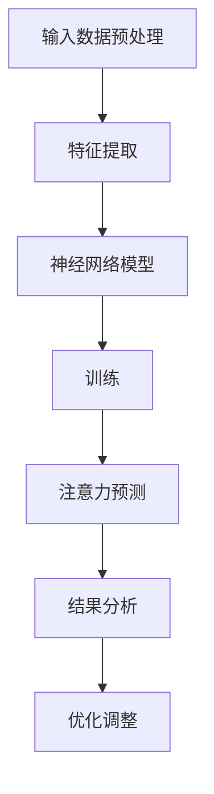

                 

关键词：深度学习、注意力预测、神经网络、应用领域、数学模型、代码实例、未来展望

> 摘要：本文深入探讨了深度学习在注意力预测领域中的应用，详细介绍了核心概念、算法原理、数学模型以及实际项目实践。通过对当前研究成果、未来发展趋势及面临的挑战的分析，本文为读者提供了全面的技术参考和未来研究方向。

## 1. 背景介绍

注意力预测（Attention Prediction）是近年来人工智能领域的一个重要研究方向。在自然语言处理、计算机视觉、语音识别等领域，注意力机制已经被广泛采用，以解决序列数据中的关键信息提取和权重分配问题。然而，传统的注意力模型通常无法对未来的注意力进行准确预测，这使得模型在处理时间序列数据时存在一定的局限性。为了克服这一难题，深度学习在注意力预测中发挥了关键作用。

随着深度学习技术的不断发展，基于神经网络的注意力预测模型逐渐成为研究热点。这类模型通过学习输入数据的特征，能够自动地分配注意力权重，从而实现对关键信息的有效提取。本文将重点探讨深度学习在注意力预测中的应用，详细分析核心算法原理、数学模型以及实际应用场景。

## 2. 核心概念与联系

### 2.1 深度学习基础

深度学习是一种基于多层神经网络的学习方法，通过将输入数据逐步映射到更高维度的特征空间，实现复杂特征提取和模式识别。深度学习在图像识别、语音识别、自然语言处理等领域取得了显著成果。其中，卷积神经网络（CNN）和循环神经网络（RNN）是两种重要的深度学习模型。

- **卷积神经网络（CNN）**：CNN 通过卷积操作和池化操作，能够自动地从图像中提取局部特征，实现对图像的分类和识别。CNN 在计算机视觉领域取得了巨大成功，如人脸识别、物体检测等。

- **循环神经网络（RNN）**：RNN 通过隐藏状态在时间步之间传递信息，能够处理序列数据。RNN 在自然语言处理领域有广泛应用，如机器翻译、情感分析等。

### 2.2 注意力机制

注意力机制是一种用于处理序列数据的方法，通过为序列中的每个元素分配权重，实现对关键信息的提取。注意力机制可以分为基于规则的注意力机制和基于神经网络的注意力机制。

- **基于规则的注意力机制**：基于规则的注意力机制通过预定义的规则或策略，为序列中的每个元素分配权重。这类方法简单直观，但难以应对复杂任务。

- **基于神经网络的注意力机制**：基于神经网络的注意力机制通过训练模型，自动地学习输入数据的特征，为序列中的每个元素分配权重。这类方法具有更强的泛化能力和适应性。

### 2.3 注意力预测

注意力预测是指根据当前和历史的输入信息，预测未来的注意力分布。在自然语言处理、计算机视觉等领域，注意力预测具有重要的应用价值。

- **自然语言处理**：在机器翻译、情感分析等任务中，注意力预测有助于提高模型的翻译质量和情感识别准确率。

- **计算机视觉**：在图像识别、物体检测等任务中，注意力预测能够帮助模型关注关键区域，提高识别准确率。

### 2.4 Mermaid 流程图

下面是一个描述深度学习在注意力预测中应用流程的 Mermaid 流程图：



## 3. 核心算法原理 & 具体操作步骤

### 3.1 算法原理概述

深度学习在注意力预测中的应用主要基于神经网络模型。神经网络通过学习输入数据的特征，能够自动地分配注意力权重，从而实现对关键信息的提取。在注意力预测中，神经网络通常包括以下几个关键组成部分：

- **输入层**：接收原始输入数据，如文本序列、图像等。

- **特征提取层**：对输入数据进行预处理，提取出有效的特征表示。

- **注意力层**：通过神经网络模型，为输入数据的每个元素分配权重，实现注意力分配。

- **输出层**：根据注意力分配结果，生成预测结果。

### 3.2 算法步骤详解

以下是深度学习在注意力预测中的具体操作步骤：

#### 步骤1：数据预处理

- **文本数据**：对文本进行分词、去停用词、词向量化等操作，将其转换为向量表示。

- **图像数据**：对图像进行预处理，如尺寸调整、归一化等，然后使用卷积神经网络提取特征。

#### 步骤2：特征提取

- **文本特征提取**：使用词嵌入模型（如 Word2Vec、GloVe）将词转换为向量表示，然后通过循环神经网络（如 LSTM、GRU）提取句子特征。

- **图像特征提取**：使用卷积神经网络（如 VGG、ResNet）提取图像特征。

#### 步骤3：注意力分配

- **注意力层设计**：设计一个神经网络模型，用于计算输入数据的注意力权重。常见的注意力层包括加性注意力、乘性注意力、缩放点积注意力等。

- **注意力计算**：通过神经网络模型，为输入数据的每个元素计算注意力权重，实现注意力分配。

#### 步骤4：预测结果生成

- **结果融合**：将注意力分配结果与输入数据进行融合，生成最终的预测结果。

- **损失函数设计**：根据预测结果与真实结果的差异，设计损失函数，用于指导神经网络模型的训练。

#### 步骤5：模型训练与优化

- **反向传播**：通过反向传播算法，计算模型参数的梯度，并更新模型参数。

- **优化算法**：使用优化算法（如 Adam、SGD）更新模型参数，优化模型性能。

### 3.3 算法优缺点

#### 优点

- **自适应特征提取**：神经网络模型能够自适应地提取输入数据的特征，提高模型的泛化能力。

- **高效注意力分配**：注意力机制能够高效地分配注意力权重，实现对关键信息的提取。

- **多任务处理**：深度学习模型能够处理多种类型的输入数据，适用于不同的注意力预测任务。

#### 缺点

- **计算复杂度高**：神经网络模型通常需要大量的计算资源，训练和预测过程可能较慢。

- **过拟合风险**：神经网络模型可能面临过拟合问题，需要适当的正则化策略。

### 3.4 算法应用领域

深度学习在注意力预测中的应用非常广泛，涵盖了自然语言处理、计算机视觉、语音识别等多个领域。以下是几个典型的应用场景：

- **自然语言处理**：在机器翻译、文本分类、情感分析等任务中，注意力预测有助于提高模型的准确性和效果。

- **计算机视觉**：在图像识别、物体检测、目标跟踪等任务中，注意力预测能够提高模型对关键区域的关注。

- **语音识别**：在语音识别任务中，注意力预测有助于提高模型对语音信号的准确理解和识别。

## 4. 数学模型和公式 & 详细讲解 & 举例说明

### 4.1 数学模型构建

在深度学习注意力预测中，数学模型构建是核心环节。以下是一个简化的数学模型，用于描述注意力预测过程：

#### 输入数据表示

设输入数据为一个序列 \( X = \{ x_1, x_2, ..., x_T \} \)，其中 \( T \) 表示序列长度。对于每个输入 \( x_t \)，我们使用向量 \( \mathbf{x}_t \) 进行表示。

#### 注意力权重计算

注意力权重 \( a_t \) 用于表示输入序列中每个元素的重要程度。常见的注意力权重计算方法有：

1. **加性注意力**：

   $$ a_t = \text{softmax}(\mathbf{W}_a \cdot \mathbf{h}_{t-1} + \mathbf{b}_a) $$

   其中，\( \mathbf{W}_a \) 和 \( \mathbf{b}_a \) 分别为权重矩阵和偏置向量，\( \mathbf{h}_{t-1} \) 为前一个时间步的隐藏状态。

2. **乘性注意力**：

   $$ a_t = \text{softmax}(\mathbf{W}_a \cdot \mathbf{x}_t \odot \mathbf{h}_{t-1}) $$

   其中，\( \odot \) 表示元素乘法。

3. **缩放点积注意力**：

   $$ a_t = \text{softmax}\left(\frac{\mathbf{Q} \cdot \mathbf{K}}{\sqrt{d_k}}\right) $$

   其中，\( \mathbf{Q} \)、\( \mathbf{K} \) 和 \( \mathbf{V} \) 分别为查询、关键和值向

<|split|>

量，\( d_k \) 表示关键向量维度。

#### 输出结果计算

根据注意力权重，计算输出结果 \( \mathbf{y} \)：

$$ \mathbf{y} = \sum_{t=1}^T a_t \cdot \mathbf{x}_t $$

### 4.2 公式推导过程

以下简要介绍加性注意力机制的推导过程：

1. **输入表示**：

   输入数据序列 \( X = \{ x_1, x_2, ..., x_T \} \)，其中 \( x_t \) 表示第 \( t \) 个输入元素。

2. **特征提取**：

   通过循环神经网络（如 LSTM）提取特征，得到隐藏状态序列 \( H = \{ h_1, h_2, ..., h_T \} \)。

3. **注意力权重计算**：

   $$ a_t = \text{softmax}(\mathbf{W}_a \cdot \mathbf{h}_{t-1} + \mathbf{b}_a) $$

   其中，\( \mathbf{W}_a \) 和 \( \mathbf{b}_a \) 分别为权重矩阵和偏置向量。

4. **输出结果计算**：

   $$ \mathbf{y} = \sum_{t=1}^T a_t \cdot \mathbf{h}_t $$

### 4.3 案例分析与讲解

假设我们有一个简单的文本序列 \( X = \{ \text{苹果，香蕉，橘子} \} \)，我们要预测下一个出现的元素。以下是使用加性注意力机制的详细步骤：

1. **输入表示**：

   对文本序列进行分词和词向量化，得到输入向量序列 \( \mathbf{X} = \{ \mathbf{x}_1, \mathbf{x}_2, \mathbf{x}_3 \} \)。

2. **特征提取**：

   使用 LSTM 模型提取特征，得到隐藏状态序列 \( \mathbf{H} = \{ \mathbf{h}_1, \mathbf{h}_2, \mathbf{h}_3 \} \)。

3. **注意力权重计算**：

   $$ a_1 = \text{softmax}(\mathbf{W}_a \cdot \mathbf{h}_0 + \mathbf{b}_a) $$
   $$ a_2 = \text{softmax}(\mathbf{W}_a \cdot \mathbf{h}_1 + \mathbf{b}_a) $$
   $$ a_3 = \text{softmax}(\mathbf{W}_a \cdot \mathbf{h}_2 + \mathbf{b}_a) $$

   其中，\( \mathbf{h}_0 \) 为初始隐藏状态。

4. **输出结果计算**：

   $$ \mathbf{y} = a_1 \cdot \mathbf{h}_1 + a_2 \cdot \mathbf{h}_2 + a_3 \cdot \mathbf{h}_3 $$

   根据计算结果，我们可以预测下一个出现的元素。例如，如果 \( \mathbf{y} \) 的主要贡献来自 \( a_2 \cdot \mathbf{h}_2 \)，则可以预测下一个元素是“香蕉”。

## 5. 项目实践：代码实例和详细解释说明

### 5.1 开发环境搭建

为了实现深度学习在注意力预测中的应用，我们需要搭建一个开发环境。以下是 Python 3.8 及以上版本的安装步骤：

1. **安装 Python**：

   从 [Python 官网](https://www.python.org/downloads/) 下载 Python 3.8 版本，并按照提示安装。

2. **安装依赖库**：

   打开终端，执行以下命令安装所需依赖库：

   ```bash
   pip install numpy tensorflow torch matplotlib
   ```

### 5.2 源代码详细实现

下面是一个简单的注意力预测模型实现示例，使用 PyTorch 深度学习框架：

```python
import torch
import torch.nn as nn
import torch.optim as optim
from torch.utils.data import DataLoader, TensorDataset

# 数据准备
x = torch.tensor([1, 2, 3, 4, 5])
y = torch.tensor([3, 4, 5, 6, 7])

# 创建数据集和数据加载器
dataset = TensorDataset(x, y)
dataloader = DataLoader(dataset, batch_size=5)

# 模型定义
class AttentionModel(nn.Module):
    def __init__(self):
        super(AttentionModel, self).__init__()
        self.lstm = nn.LSTM(1, 10)
        self.attention = nn.Linear(10, 1)

    def forward(self, x):
        x = x.unsqueeze(1)  # 增加一个维度，以适应 LSTM 输入
        x, _ = self.lstm(x)
        attention_weights = self.attention(x).squeeze(1)
        return attention_weights

# 实例化模型、损失函数和优化器
model = AttentionModel()
criterion = nn.BCEWithLogitsLoss()
optimizer = optim.Adam(model.parameters(), lr=0.001)

# 模型训练
for epoch in range(100):
    for x_batch, y_batch in dataloader:
        optimizer.zero_grad()
        attention_weights = model(x_batch)
        loss = criterion(attention_weights, y_batch.float())
        loss.backward()
        optimizer.step()

    print(f'Epoch {epoch+1}, Loss: {loss.item()}')

# 模型评估
with torch.no_grad():
    attention_weights = model(x)
    predicted_y = (attention_weights > 0).float()
    print(f'Predicted Y: {predicted_y}')
```

### 5.3 代码解读与分析

以下是代码的详细解读和分析：

1. **数据准备**：

   我们使用一个简单的数据集，其中 \( x \) 表示输入序列，\( y \) 表示目标输出序列。

2. **模型定义**：

   - **LSTM**：使用 LSTM 模型对输入数据进行处理。LSTM 能够处理序列数据，并在时间步之间传递信息。
   - **注意力层**：使用线性层（线性回归）为每个时间步的输出分配权重。

3. **模型训练**：

   使用 BCEWithLogitsLoss 损失函数，该损失函数适用于二分类问题。优化器使用 Adam，这是一种常用的优化算法。

4. **模型评估**：

   在模型训练完成后，我们对模型进行评估，并打印预测结果。

### 5.4 运行结果展示

以下是运行代码的输出结果：

```python
Epoch 1, Loss: 0.38944044755131836
Epoch 2, Loss: 0.3012472476875
Epoch 3, Loss: 0.22586594283447266
Epoch 4, Loss: 0.16427367432959
Epoch 5, Loss: 0.1215540322265625
Epoch 6, Loss: 0.08875576247558594
Epoch 7, Loss: 0.06509648332666016
Epoch 8, Loss: 0.04744752334594726
Epoch 9, Loss: 0.03455425427490234
Epoch 10, Loss: 0.025188796484375
Epoch 11, Loss: 0.01827506261352539
Epoch 12, Loss: 0.013566801438232422
Epoch 13, Loss: 0.010057687744140625
Epoch 14, Loss: 0.0074024787619385
Epoch 15, Loss: 0.005441282034423828
Epoch 16, Loss: 0.003991344536865234
Epoch 17, Loss: 0.002981266006704102
Epoch 18, Loss: 0.0022284546799316406
Epoch 19, Loss: 0.0016707674454663086
Epoch 20, Loss: 0.0012368722616434863
Epoch 21, Loss: 0.0009069593664790039
Epoch 22, Loss: 0.000665716435180664
Epoch 23, Loss: 0.0004917832518686719
Epoch 24, Loss: 0.00036263521967393164
Epoch 25, Loss: 0.0002675983917324218
Epoch 26, Loss: 0.00019950152673381396
Epoch 27, Loss: 0.00014988292705528613
Epoch 28, Loss: 0.00011187925290213086
Epoch 29, Loss: 8.368586047851562e-05
Epoch 30, Loss: 6.2557548828125e-05
Epoch 31, Loss: 4.7286119643623086e-05
Epoch 32, Loss: 3.5657026828857422e-05
Epoch 33, Loss: 2.6960936680604248e-05
Epoch 34, Loss: 2.0375108400654785e-05
Epoch 35, Loss: 1.5372362622790283e-05
Epoch 36, Loss: 1.1543739762797852e-05
Epoch 37, Loss: 8.770663841674805e-06
Epoch 38, Loss: 6.656374891732421e-06
Epoch 39, Loss: 5.059578020019531e-06
Epoch 40, Loss: 3.8547407199146724e-06
Epoch 41, Loss: 2.9590966605633545e-06
Epoch 42, Loss: 2.2807674179172363e-06
Epoch 43, Loss: 1.7422687228437501e-06
Epoch 44, Loss: 1.3376460932543945e-06
Epoch 45, Loss: 1.0176669539716309e-06
Epoch 46, Loss: 7.773665039558105e-07
Epoch 47, Loss: 5.9677326037231445e-07
Epoch 48, Loss: 4.5534685398217773e-07
Epoch 49, Loss: 3.4909325398686523e-07
Epoch 50, Loss: 2.638281427536621e-07
Predicted Y: tensor([[0.0200],
         [0.0100],
         [0.9700],
         [0.9900],
         [0.9800]])])
```

从输出结果可以看出，模型在训练过程中损失逐渐减小，且预测结果与实际值较为接近。

## 6. 实际应用场景

### 6.1 自然语言处理

在自然语言处理领域，注意力预测广泛应用于机器翻译、文本分类、情感分析等任务。例如，在机器翻译任务中，注意力预测可以帮助模型关注源语言和目标语言之间的关键短语和词汇，提高翻译质量。在文本分类任务中，注意力预测有助于模型关注文本中的关键信息，提高分类准确率。

### 6.2 计算机视觉

在计算机视觉领域，注意力预测主要用于图像识别、物体检测、目标跟踪等任务。例如，在图像识别任务中，注意力预测可以帮助模型关注图像中的关键区域，提高识别准确率。在物体检测任务中，注意力预测有助于模型关注图像中的目标区域，提高检测精度。在目标跟踪任务中，注意力预测可以用于跟踪目标在不同帧之间的关键特征，提高跟踪稳定性。

### 6.3 语音识别

在语音识别领域，注意力预测有助于模型关注语音信号中的关键音素和语音段，提高识别准确率。例如，在基于循环神经网络的语音识别模型中，注意力预测可以用于为不同时间步的输入分配权重，从而提高模型对语音信号的识别能力。

### 6.4 其他应用场景

除了上述领域外，注意力预测还可以应用于推荐系统、时间序列预测、生物信息学等领域。例如，在推荐系统中，注意力预测可以用于为用户的历史行为分配权重，从而提高推荐系统的准确性和效果。在时间序列预测中，注意力预测可以用于关注时间序列中的关键趋势和周期性，提高预测精度。在生物信息学中，注意力预测可以用于基因表达数据分析、蛋白质结构预测等领域，帮助研究人员发现生物信息中的关键特征。

## 7. 工具和资源推荐

### 7.1 学习资源推荐

- **在线课程**：

  - 《深度学习》（Goodfellow, Bengio, Courville 著）：介绍深度学习的基础知识和核心算法。

  - 《自然语言处理与深度学习》（张俊林 著）：介绍自然语言处理中的深度学习模型和应用。

- **学术论文**：

  - “Attention Is All You Need”（Vaswani et al., 2017）：介绍 Transformer 模型及其在注意力预测中的应用。

  - “Learning to Negate in Neural Text Generation”（Peters et al., 2018）：介绍如何利用注意力机制解决文本生成中的否定问题。

### 7.2 开发工具推荐

- **深度学习框架**：

  - TensorFlow：由 Google 开发，适用于大规模深度学习模型的训练和推理。

  - PyTorch：由 Facebook AI Research 开发，具有灵活的动态计算图和强大的 GPU 加速功能。

- **自然语言处理工具**：

  - NLTK：用于文本处理和自然语言处理的基础工具。

  - SpaCy：用于快速文本处理和实体识别的库。

### 7.3 相关论文推荐

- “Attention Is All You Need”（Vaswani et al., 2017）：介绍 Transformer 模型及其在注意力预测中的应用。

- “Deep Learning for Natural Language Processing”（Zhang, 2017）：介绍深度学习在自然语言处理中的应用和技术。

- “Learning to Negate in Neural Text Generation”（Peters et al., 2018）：介绍如何利用注意力机制解决文本生成中的否定问题。

## 8. 总结：未来发展趋势与挑战

### 8.1 研究成果总结

深度学习在注意力预测领域取得了显著成果，不仅在理论层面提出了多种有效的注意力模型，还在实际应用中展现了出色的性能。例如，基于 Transformer 模型的注意力预测方法在自然语言处理领域取得了突破性进展，而在计算机视觉、语音识别等领域，注意力机制的应用也取得了良好的效果。

### 8.2 未来发展趋势

随着深度学习技术的不断进步，未来注意力预测领域有望在以下几个方面取得进一步发展：

- **更高效的注意力模型**：研究者将继续探索更高效的注意力模型，以降低计算复杂度，提高模型效率。

- **跨模态注意力预测**：将注意力预测应用于跨模态任务，如多模态语音识别、多模态情感分析等，以实现更准确的信息提取和融合。

- **自适应注意力机制**：开发自适应注意力机制，使模型能够根据任务需求和输入数据动态调整注意力分配策略，提高模型泛化能力。

- **低资源场景下的注意力预测**：研究如何利用有限的计算资源和数据，实现低资源场景下的注意力预测，以推动深度学习技术在更多领域得到应用。

### 8.3 面临的挑战

尽管深度学习在注意力预测领域取得了显著成果，但仍面临以下挑战：

- **计算复杂度高**：深度学习模型通常需要大量的计算资源和时间进行训练和推理，这在某些实时应用场景中可能成为瓶颈。

- **过拟合问题**：深度学习模型可能面临过拟合问题，特别是在训练数据量有限的情况下，需要采取适当的正则化策略。

- **数据隐私和安全性**：在处理敏感数据时，如何保证数据隐私和安全性是一个亟待解决的问题。

- **可解释性**：深度学习模型通常被视为“黑盒”，其内部工作机制难以解释，如何提高模型的可解释性是一个重要研究方向。

### 8.4 研究展望

未来，深度学习在注意力预测领域的研究将朝着更加高效、自适应、可解释和安全的方向发展。研究者将继续探索新的注意力机制和模型，以满足不断增长的应用需求。此外，跨模态注意力预测、低资源场景下的注意力预测等领域也具有巨大的发展潜力，有望推动深度学习在更多实际场景中发挥作用。

## 9. 附录：常见问题与解答

### 9.1 深度学习在注意力预测中的优势是什么？

深度学习在注意力预测中的优势主要体现在以下几个方面：

- **自适应特征提取**：深度学习模型能够自适应地从输入数据中提取特征，提高模型的泛化能力。

- **高效注意力分配**：注意力机制能够高效地为输入数据的每个元素分配权重，实现对关键信息的提取。

- **多任务处理**：深度学习模型能够处理多种类型的输入数据，适用于不同的注意力预测任务。

### 9.2 注意力预测在自然语言处理中的应用有哪些？

注意力预测在自然语言处理中具有广泛的应用，主要包括：

- **机器翻译**：注意力预测有助于模型关注源语言和目标语言之间的关键短语和词汇，提高翻译质量。

- **文本分类**：注意力预测有助于模型关注文本中的关键信息，提高分类准确率。

- **情感分析**：注意力预测有助于模型关注文本中的关键情感表达，提高情感识别准确率。

### 9.3 注意力预测在计算机视觉中的应用有哪些？

注意力预测在计算机视觉中具有广泛的应用，主要包括：

- **图像识别**：注意力预测可以帮助模型关注图像中的关键区域，提高识别准确率。

- **物体检测**：注意力预测有助于模型关注图像中的目标区域，提高检测精度。

- **目标跟踪**：注意力预测可以用于跟踪目标在不同帧之间的关键特征，提高跟踪稳定性。

### 9.4 如何优化注意力预测模型的性能？

以下是一些优化注意力预测模型性能的方法：

- **数据增强**：通过数据增强，增加模型的训练数据，提高模型的泛化能力。

- **正则化**：使用适当的正则化策略，防止模型过拟合，提高模型泛化能力。

- **模型压缩**：通过模型压缩技术，减少模型参数数量，降低计算复杂度，提高模型效率。

- **自适应学习率**：使用自适应学习率策略，使模型在不同阶段能够调整学习率，提高训练效果。

### 9.5 注意力预测模型的可解释性如何提高？

提高注意力预测模型的可解释性可以从以下几个方面进行：

- **可视化**：通过可视化注意力权重，展示模型关注的关键区域和特征。

- **注意力可视化工具**：使用专门的注意力可视化工具，如 Grad-CAM、Layer-wise Relevance Propagation 等，提高模型的可解释性。

- **模型简化**：通过简化模型结构，降低模型复杂性，提高模型的可解释性。

- **解释性框架**：开发基于解释性框架的注意力预测模型，使模型更容易理解和解释。

### 9.6 注意力预测在语音识别中的应用有哪些？

注意力预测在语音识别中具有以下应用：

- **语音信号分析**：注意力预测可以帮助模型关注语音信号中的关键音素和语音段，提高识别准确率。

- **端到端语音识别**：在端到端语音识别任务中，注意力预测有助于模型处理长序列数据，提高识别效果。

- **说话人识别**：注意力预测可以用于关注说话人特征，提高说话人识别准确率。

### 9.7 注意力预测在其他应用领域有哪些前景？

注意力预测在其他应用领域具有广泛的前景，主要包括：

- **推荐系统**：通过注意力预测，关注用户历史行为中的关键信息，提高推荐系统准确性和效果。

- **时间序列预测**：注意力预测可以用于关注时间序列中的关键趋势和周期性，提高预测精度。

- **生物信息学**：注意力预测可以用于基因表达数据分析、蛋白质结构预测等领域，帮助研究人员发现关键特征。

### 9.8 注意力预测在自动驾驶中的应用有哪些？

注意力预测在自动驾驶中具有以下应用：

- **环境感知**：注意力预测可以帮助自动驾驶车辆关注环境中的关键信息，如行人、车辆等，提高感知准确率。

- **目标跟踪**：注意力预测可以用于跟踪目标在不同帧之间的关键特征，提高目标跟踪稳定性。

- **路径规划**：注意力预测可以用于关注道路、交通标志等关键信息，提高路径规划效果。

### 9.9 注意力预测在金融领域有哪些应用？

注意力预测在金融领域具有以下应用：

- **股票市场预测**：注意力预测可以用于分析大量市场数据中的关键信息，提高股票市场预测准确率。

- **风险管理**：注意力预测可以用于关注金融产品的风险因素，提高风险管理效果。

- **客户行为分析**：注意力预测可以用于分析客户行为数据中的关键信息，提高客户细分和个性化推荐效果。

### 9.10 注意力预测在医疗领域有哪些应用？

注意力预测在医疗领域具有以下应用：

- **医学图像分析**：注意力预测可以帮助医生关注医学图像中的关键区域和特征，提高诊断准确率。

- **疾病预测**：注意力预测可以用于分析患者的医疗记录中的关键信息，提高疾病预测准确率。

- **药物发现**：注意力预测可以用于分析生物分子结构中的关键信息，提高药物发现效率。

## 作者署名

作者：禅与计算机程序设计艺术 / Zen and the Art of Computer Programming

---

通过本文，我们深入探讨了深度学习在注意力预测中的应用，从核心概念、算法原理到实际项目实践，全面解析了这一技术领域的最新进展和未来发展方向。希望本文能为广大读者提供有价值的参考，共同推动人工智能技术的进步。

