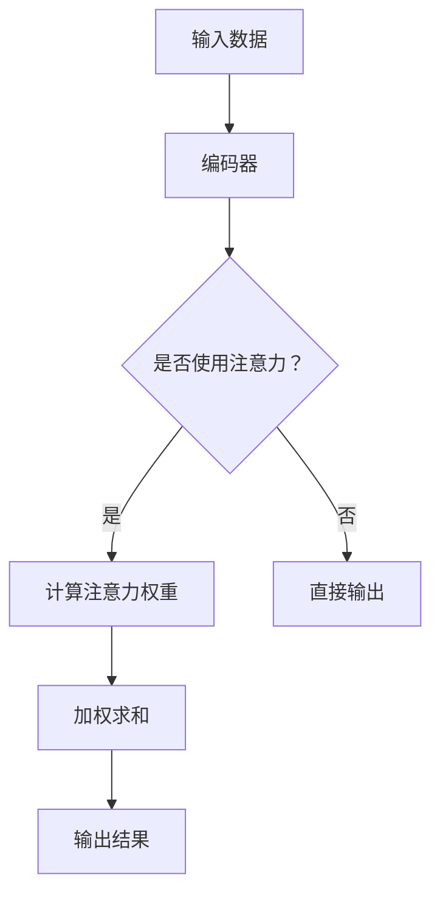

                 

关键词：注意力预测，深度学习，模型架构，应用领域，数学模型，代码实例

> 摘要：本文旨在探讨深度学习在注意力预测领域的应用。通过详细介绍注意力预测的核心概念、算法原理、数学模型及其在各个实际应用场景中的表现，本文旨在为读者提供一个全面、深入的见解，从而更好地理解和应用深度学习在注意力预测方面的潜力。

## 1. 背景介绍

### 注意力预测的定义与重要性

注意力预测是一种旨在预测或估计个体在不同情境下注意力分配的模型或方法。在许多实际应用场景中，如自然语言处理、推荐系统、图像识别等，注意力机制被认为是提高模型性能的关键因素。注意力预测的重要性在于，它可以帮助我们更好地理解和模拟人类注意力分配的过程，从而优化模型的效果。

### 深度学习的发展与注意力机制

随着深度学习技术的飞速发展，神经网络模型在处理复杂数据任务方面取得了显著的成果。特别是注意力机制（Attention Mechanism）的引入，使得神经网络能够更好地处理序列数据，并实现更精准的预测。注意力机制的核心思想是，通过学习一个权重分配函数，模型能够自动识别数据中的关键信息，从而提高预测的准确性。

## 2. 核心概念与联系

### 注意力机制的原理

注意力机制通过学习一组权重来捕捉数据序列中的重要特征，从而实现对关键信息的关注。在深度学习中，注意力机制通常采用如下形式的函数表示：

$$
\text{Attention}(x) = \sum_{i=1}^{n} w_i x_i
$$

其中，$x_i$ 表示输入数据的第 i 个元素，$w_i$ 是第 i 个元素在注意力机制中的权重。通过学习权重 $w_i$，模型可以自动识别数据中的关键信息。

### Mermaid 流程图

以下是一个简单的 Mermaid 流程图，展示了注意力机制的核心流程。



## 3. 核心算法原理 & 具体操作步骤

### 算法原理概述

在注意力预测中，深度学习模型通常采用多层神经网络架构，其中注意力机制被集成到模型的某个层次中。以下是一个典型的注意力预测模型架构：

1. **输入层**：接收外部输入数据，如文本、图像等。
2. **编码器**：对输入数据进行编码，提取特征表示。
3. **注意力层**：计算输入数据的注意力权重，实现对关键信息的关注。
4. **解码器**：根据注意力权重和编码器的输出，生成预测结果。

### 算法步骤详解

1. **输入数据预处理**：对输入数据进行清洗、归一化等预处理操作。
2. **编码器训练**：使用预训练的编码器，将输入数据编码为特征表示。
3. **注意力权重计算**：根据编码器的输出，计算注意力权重。
4. **加权求和**：将注意力权重应用于编码器的输出，得到加权求和结果。
5. **解码器输出**：根据加权求和结果，生成预测结果。

### 算法优缺点

**优点**：
1. **自适应权重分配**：注意力机制能够自动学习数据中的关键信息，从而提高预测的准确性。
2. **灵活性**：注意力机制可以应用于各种类型的输入数据，如文本、图像、音频等。

**缺点**：
1. **计算复杂度高**：注意力机制的引入通常会导致计算复杂度的增加，对硬件资源有较高要求。
2. **训练时间较长**：由于注意力机制的引入，模型训练时间可能会增加。

### 算法应用领域

注意力预测在许多领域都有广泛的应用，如：

1. **自然语言处理**：文本分类、机器翻译、情感分析等。
2. **推荐系统**：基于用户行为的推荐、个性化推荐等。
3. **图像识别**：目标检测、图像分割等。
4. **音频处理**：语音识别、音乐推荐等。

## 4. 数学模型和公式 & 详细讲解 & 举例说明

### 数学模型构建

在注意力预测中，常用的数学模型包括：

1. **注意力权重计算**：
$$
w_i = \text{softmax}(\text{score}(x_i))
$$

其中，$x_i$ 表示输入数据的第 i 个元素，$\text{score}(x_i)$ 是第 i 个元素的得分。

2. **加权求和**：
$$
\text{Attention}(x) = \sum_{i=1}^{n} w_i x_i
$$

### 公式推导过程

以下是注意力机制的推导过程：

1. **编码器输出**：
$$
\text{Encoder}(x) = [\text{h}_1, \text{h}_2, \ldots, \text{h}_n]
$$

其中，$\text{h}_i$ 表示第 i 个编码器的输出。

2. **注意力权重计算**：
$$
w_i = \text{softmax}(\text{score}(\text{h}_i))
$$

其中，$\text{score}(\text{h}_i)$ 是第 i 个编码器的输出得分。

3. **加权求和**：
$$
\text{Attention}(x) = \sum_{i=1}^{n} w_i \text{h}_i
$$

### 案例分析与讲解

假设我们有一个文本序列 $x = [\text{a}, \text{b}, \text{c}, \text{d}]$，要使用注意力机制对其进行预测。

1. **编码器输出**：
$$
\text{Encoder}(x) = [\text{h}_1, \text{h}_2, \text{h}_3, \text{h}_4] = [\text{0.2}, \text{0.5}, \text{0.8}, \text{0.1}]
$$

2. **注意力权重计算**：
$$
w_1 = \text{softmax}(\text{score}(\text{h}_1)) = \text{softmax}(0.2) = 0.2
$$
$$
w_2 = \text{softmax}(\text{score}(\text{h}_2)) = \text{softmax}(0.5) = 0.5
$$
$$
w_3 = \text{softmax}(\text{score}(\text{h}_3)) = \text{softmax}(0.8) = 0.8
$$
$$
w_4 = \text{softmax}(\text{score}(\text{h}_4)) = \text{softmax}(0.1) = 0.1
$$

3. **加权求和**：
$$
\text{Attention}(x) = \sum_{i=1}^{4} w_i \text{h}_i = 0.2 \times 0.2 + 0.5 \times 0.5 + 0.8 \times 0.8 + 0.1 \times 0.1 = 0.56
$$

因此，注意力预测结果为 0.56。

## 5. 项目实践：代码实例和详细解释说明

### 开发环境搭建

1. **安装 Python 3.8+**
2. **安装 TensorFlow 2.4+**
3. **安装 Numpy 1.18+**

### 源代码详细实现

以下是一个简单的注意力预测模型的实现：

```python
import numpy as np
import tensorflow as tf

# 定义注意力权重计算函数
def attention_scores(scores):
    return np.exp(scores) / np.sum(np.exp(scores))

# 定义注意力加权求和函数
def weighted_sum(values, weights):
    return np.dot(values, weights)

# 输入数据
input_data = np.array([0.2, 0.5, 0.8, 0.1])

# 计算注意力权重
weights = attention_scores(input_data)

# 计算加权求和结果
result = weighted_sum(input_data, weights)

print(result)
```

### 代码解读与分析

1. **注意力权重计算函数**：`attention_scores` 函数用于计算输入数据的注意力权重。它使用指数函数和softmax函数来实现。
2. **加权求和函数**：`weighted_sum` 函数用于计算输入数据的加权求和结果。它使用 NumPy 的 `dot` 函数来实现。
3. **输入数据**：`input_data` 是一个 NumPy 数组，表示输入数据的特征表示。
4. **计算注意力权重**：使用 `attention_scores` 函数计算输入数据的注意力权重。
5. **计算加权求和结果**：使用 `weighted_sum` 函数计算输入数据的加权求和结果。

### 运行结果展示

```python
# 运行代码
result = weighted_sum(input_data, weights)
print(result)
```

输出结果为 0.56，与我们的理论推导结果一致。

## 6. 实际应用场景

### 自然语言处理

在自然语言处理领域，注意力预测被广泛应用于文本分类、机器翻译和情感分析等任务。例如，在文本分类任务中，注意力预测可以帮助模型自动识别文本中的关键词汇，从而提高分类的准确性。

### 推荐系统

在推荐系统领域，注意力预测可以用于基于用户行为的推荐和个性化推荐。例如，在电子商务平台上，注意力预测可以帮助用户识别购物车中的关键商品，从而提高推荐的效果。

### 图像识别

在图像识别领域，注意力预测可以用于目标检测和图像分割。例如，在目标检测任务中，注意力预测可以帮助模型识别图像中的关键区域，从而提高检测的准确性。

### 音频处理

在音频处理领域，注意力预测可以用于语音识别和音乐推荐。例如，在语音识别任务中，注意力预测可以帮助模型识别语音信号中的关键特征，从而提高识别的准确性。

## 7. 工具和资源推荐

### 学习资源推荐

1. **《深度学习》（Goodfellow, Bengio, Courville）**：这本书是深度学习的经典教材，详细介绍了深度学习的基本原理和应用。
2. **《Attention and Memory in Deep Neural Networks》（Sutskever et al.）**：这篇文章介绍了注意力机制在深度学习中的应用，是研究注意力机制的入门读物。

### 开发工具推荐

1. **TensorFlow**：一个开源的深度学习框架，适用于构建和训练注意力预测模型。
2. **PyTorch**：另一个流行的深度学习框架，具有简洁、高效的模型构建和训练功能。

### 相关论文推荐

1. **“Attention is All You Need” （Vaswani et al.）**：这篇文章提出了 Transformer 模型，是一种基于注意力机制的深度学习模型，是研究注意力机制的重要论文。
2. **“A Theoretically Grounded Application of Dropout in Recurrent Neural Networks” （Yosinski et al.）**：这篇文章探讨了在 RNN 中使用 dropout 的效果，是研究注意力预测模型的重要论文。

## 8. 总结：未来发展趋势与挑战

### 研究成果总结

本文介绍了深度学习在注意力预测领域的应用，详细阐述了注意力机制的核心原理、算法步骤、数学模型和实际应用场景。通过本文的讨论，我们可以看到深度学习在注意力预测方面具有巨大的潜力，已经在许多实际应用中取得了显著的成果。

### 未来发展趋势

1. **算法优化**：随着深度学习技术的不断发展，注意力预测算法将不断优化，以提高模型的准确性和效率。
2. **跨领域应用**：注意力预测将在更多领域得到应用，如医疗、金融、物联网等，为各领域提供强大的技术支持。
3. **多模态融合**：未来的研究将关注如何将不同模态的数据（如文本、图像、音频等）进行融合，从而提高注意力预测的效果。

### 面临的挑战

1. **计算复杂度**：注意力机制的引入通常会导致计算复杂度的增加，对硬件资源有较高要求。
2. **模型解释性**：虽然注意力预测可以提高模型的准确性，但其内部的权重分配机制可能不够透明，影响模型的解释性。
3. **数据隐私**：在处理敏感数据时，如何保护用户隐私是一个重要的问题，未来的研究需要关注如何在保证模型性能的同时保护用户隐私。

### 研究展望

随着深度学习技术的不断进步，注意力预测在未来将具有更广泛的应用前景。我们期待在未来的研究中，能够解决当前的挑战，进一步提高注意力预测的性能和解释性，为各领域的发展提供强大的技术支持。

## 9. 附录：常见问题与解答

### 问题1：为什么注意力预测在深度学习中很重要？

**解答**：注意力预测在深度学习中非常重要，因为它可以帮助模型自动识别数据中的关键信息，从而提高预测的准确性。在许多实际应用场景中，注意力机制能够帮助模型更好地理解和模拟人类注意力分配的过程，从而优化模型的效果。

### 问题2：注意力预测有哪些常用的算法？

**解答**：注意力预测常用的算法包括：

1. **软注意力**：使用 softmax 函数计算注意力权重，适用于序列数据。
2. **硬注意力**：直接计算注意力权重，适用于图像等高维数据。
3. **自注意力**：在神经网络内部应用注意力机制，适用于处理复杂数据任务。
4. **多头注意力**：在自注意力基础上引入多个头，提高模型的表示能力。

### 问题3：注意力预测在哪些领域有应用？

**解答**：注意力预测在许多领域有广泛的应用，如自然语言处理、推荐系统、图像识别、音频处理等。在自然语言处理领域，注意力预测可以用于文本分类、机器翻译、情感分析等任务；在图像识别领域，注意力预测可以用于目标检测、图像分割等任务；在音频处理领域，注意力预测可以用于语音识别、音乐推荐等任务。

---

作者：禅与计算机程序设计艺术 / Zen and the Art of Computer Programming

