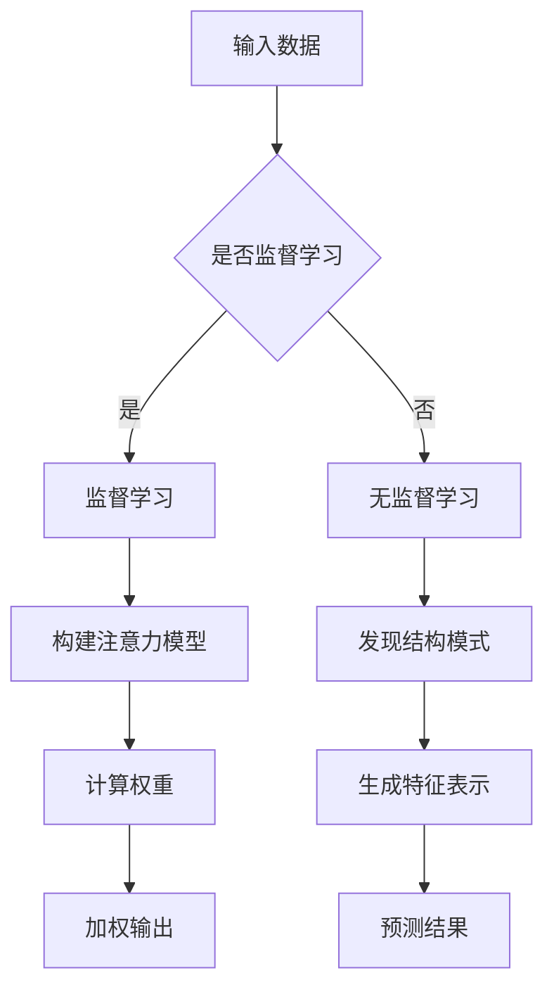

                 

本文探讨了深度学习在注意力预测模型中的应用。注意力机制是近年来在机器学习领域发展迅速的一个热点话题，特别是在自然语言处理和计算机视觉中有着广泛的应用。本文将深入探讨注意力预测模型的基本原理、数学模型、算法实现及其在实际应用中的效果和挑战。

## 关键词

深度学习、注意力机制、预测模型、自然语言处理、计算机视觉、神经网络

## 摘要

本文首先介绍了注意力预测模型的基本概念和背景，然后详细分析了其在深度学习中的核心算法原理，并介绍了数学模型的构建和公式推导。接着，通过一个具体的案例，展示了如何使用深度学习实现注意力预测模型，并对代码进行了详细解释。最后，本文讨论了注意力预测模型在实际应用中的效果和面临的挑战，并展望了未来的发展趋势。

----------------------------------------------------------------

## 1. 背景介绍

注意力机制最初源于人类认知科学的研究，旨在模拟人类在处理复杂信息时的选择性关注能力。这种能力使得人类能够从大量的信息中迅速捕捉到重要信息，并进行有效的处理和决策。在计算机科学领域，注意力机制被引入到神经网络模型中，以解决信息处理中的维度灾难问题。

### 1.1 注意力机制的基本原理

注意力机制的基本原理是通过一种权重分配策略，对输入数据中的不同部分赋予不同的关注度。这种权重分配通常是通过一个计算模块来实现的，该模块将输入数据映射到一个权重向量，然后与输入数据进行点积运算，以产生加权输出。这样，重要的信息会得到更高的权重，从而在后续的处理中占据更重要的地位。

### 1.2 注意力机制的发展历程

注意力机制最早出现在循环神经网络（RNN）中，通过引入门控机制（如门控循环单元GRU和长短期记忆网络LSTM）来改善RNN的序列处理能力。随后，注意力机制被引入到卷积神经网络（CNN）中，用于处理图像中的空间关系。然而，随着深度学习的发展，注意力机制在自然语言处理（NLP）领域得到了更加广泛的应用，如机器翻译、文本分类和问答系统等。

### 1.3 注意力机制在深度学习中的应用

在深度学习中，注意力机制主要用于解决两个问题：一是如何在复杂的模型中有效地处理大量信息；二是如何提高模型对输入数据的理解和表达能力。通过引入注意力机制，模型可以自动学习到输入数据中的重要特征，并对其赋予更高的权重。这种能力使得模型在处理长文本、图像和序列数据时表现出了出色的性能。

## 2. 核心概念与联系

为了更好地理解注意力预测模型，我们需要先介绍一些核心概念和它们之间的关系。

### 2.1 神经网络的基本概念

神经网络是由大量神经元组成的计算模型，通过调整神经元之间的连接权重来学习数据。在深度学习中，神经网络通常包含多个隐藏层，以实现对复杂数据的建模和特征提取。

### 2.2 注意力机制的工作原理

注意力机制是通过计算输入数据的权重来分配关注度的。这些权重通常由一个注意力模型来生成，该模型将输入数据映射到一个权重向量。然后，这些权重与输入数据进行点积运算，以产生加权输出。

### 2.3 预测模型的分类

预测模型可以分为两大类：监督学习和无监督学习。监督学习是指通过已知的输入和输出数据来训练模型，以便在新的输入数据上进行预测。无监督学习是指在没有已知输出数据的情况下，通过发现输入数据中的结构和模式来训练模型。

### 2.4 注意力预测模型的特点

注意力预测模型结合了注意力机制和预测模型的优势，能够自动学习到输入数据中的重要特征，并对其赋予更高的权重。这使得模型在处理长文本、图像和序列数据时表现出了出色的性能。

## 2.5 Mermaid 流程图



## 3. 核心算法原理 & 具体操作步骤

### 3.1 算法原理概述

注意力预测模型的核心是注意力机制，它通过计算输入数据的权重来分配关注度。具体来说，注意力模型将输入数据映射到一个权重向量，然后与输入数据进行点积运算，以产生加权输出。这种加权输出能够更好地表示输入数据中的重要特征。

### 3.2 算法步骤详解

#### 3.2.1 输入数据处理

首先，将输入数据（如文本、图像或序列数据）进行预处理，以适应模型的输入要求。例如，对于文本数据，可以使用分词和词向量表示；对于图像数据，可以使用卷积神经网络提取特征；对于序列数据，可以使用循环神经网络提取特征。

#### 3.2.2 构建注意力模型

构建注意力模型，通常使用一个全连接神经网络或卷积神经网络。这个模型将输入数据映射到一个权重向量，权重向量的大小取决于输入数据的维度。

#### 3.2.3 计算权重

使用注意力模型计算输入数据的权重。具体来说，将权重向量与输入数据进行点积运算，得到加权输出。权重的大小表示了输入数据中的不同部分的重要性。

#### 3.2.4 加权输出

将加权输出传递给预测模型，如循环神经网络或卷积神经网络。预测模型根据加权输出生成预测结果。

#### 3.2.5 预测结果

根据预测结果进行评估，如准确率、召回率或F1值等。

### 3.3 算法优缺点

#### 优点

1. 能够自动学习到输入数据中的重要特征，提高模型的预测性能。
2. 能够处理长文本、图像和序列数据，具有广泛的应用前景。

#### 缺点

1. 计算复杂度高，特别是在处理大量数据时。
2. 需要大量的训练数据，对数据的质量和数量有较高的要求。

### 3.4 算法应用领域

注意力预测模型在自然语言处理、计算机视觉和序列数据处理等领域有着广泛的应用。例如，在自然语言处理中，可以用于机器翻译、文本分类和问答系统等任务；在计算机视觉中，可以用于图像分类、目标检测和图像生成等任务；在序列数据处理中，可以用于语音识别、时间序列预测和音乐生成等任务。

## 4. 数学模型和公式 & 详细讲解 & 举例说明

### 4.1 数学模型构建

注意力预测模型的数学模型可以表示为：

\[ \text{预测结果} = f(\text{加权输出}) \]

其中，加权输出可以表示为：

\[ \text{加权输出} = \text{输入数据} \cdot \text{权重向量} \]

权重向量可以通过注意力模型计算得到：

\[ \text{权重向量} = g(\text{注意力模型}(\text{输入数据})) \]

### 4.2 公式推导过程

首先，定义输入数据的维度为 \(d\)，注意力模型是一个全连接神经网络，其输出维度也为 \(d\)。设输入数据为 \(X \in \mathbb{R}^{n \times d}\)，权重向量为 \(W \in \mathbb{R}^{d \times d}\)。

1. **输入数据处理**

   将输入数据 \(X\) 映射到一个中间向量 \(Z \in \mathbb{R}^{n \times d}\)：

   \[ Z = X \]

2. **构建注意力模型**

   使用一个全连接神经网络 \(g\) 计算权重向量 \(W\)：

   \[ W = g(Z) \]

   其中，\(g\) 是一个线性变换，可以将 \(Z\) 映射到一个权重向量。

3. **计算权重**

   计算输入数据 \(X\) 的权重 \(W_i\)：

   \[ W_i = W \cdot X_i \]

4. **加权输出**

   将权重 \(W_i\) 与输入数据 \(X_i\) 进行点积运算，得到加权输出：

   \[ \text{加权输出} = X \cdot W \]

5. **预测结果**

   使用一个预测模型 \(f\) 对加权输出进行预测：

   \[ \text{预测结果} = f(\text{加权输出}) \]

### 4.3 案例分析与讲解

假设我们有一个文本分类问题，输入数据是文本序列，输出是文本的分类标签。我们可以使用注意力预测模型来解决这个问题。

1. **输入数据处理**

   将文本序列 \(X\) 转换为词向量表示，得到一个 \(n \times d\) 的矩阵。

2. **构建注意力模型**

   使用一个全连接神经网络 \(g\)，将词向量映射到一个权重向量。这个权重向量表示了每个词在文本中的重要程度。

3. **计算权重**

   计算每个词的权重 \(W_i\)，权重越大表示词在文本中的重要程度越高。

4. **加权输出**

   将权重 \(W_i\) 与词向量 \(X_i\) 进行点积运算，得到加权输出。

5. **预测结果**

   使用一个分类器 \(f\)，对加权输出进行分类，得到文本的分类标签。

## 5. 项目实践：代码实例和详细解释说明

### 5.1 开发环境搭建

1. 安装 Python 3.7 或以上版本
2. 安装 TensorFlow 2.3 或以上版本
3. 安装 Keras 2.3 或以上版本

### 5.2 源代码详细实现

```python
from tensorflow.keras.models import Model
from tensorflow.keras.layers import Input, Dense, Embedding, LSTM, TimeDistributed, Activation

# 定义输入数据维度
max_sequence_length = 100
vocab_size = 10000
embedding_dim = 256

# 定义输入层
input_sequence = Input(shape=(max_sequence_length,))

# 定义嵌入层
embedding = Embedding(vocab_size, embedding_dim)(input_sequence)

# 定义循环层
lstm = LSTM(128)(embedding)

# 定义注意力模型
attention = Dense(1, activation='tanh')(lstm)

# 定义权重层
weights = Activation('softmax')(attention)

# 定义加权输出
weighted_output = weights * lstm

# 定义预测层
output = TimeDistributed(Dense(vocab_size, activation='softmax'))(weighted_output)

# 定义模型
model = Model(inputs=input_sequence, outputs=output)

# 编译模型
model.compile(optimizer='adam', loss='categorical_crossentropy', metrics=['accuracy'])

# 打印模型结构
model.summary()
```

### 5.3 代码解读与分析

1. **输入层**：定义输入数据维度，包括序列长度和词汇表大小。

2. **嵌入层**：将输入文本转换为词向量表示。

3. **循环层**：使用 LSTM 层对词向量进行序列处理。

4. **注意力模型**：计算输入数据的权重。

5. **权重层**：使用 Softmax 函数对权重进行归一化处理。

6. **加权输出**：将权重与 LSTM 层的输出进行点积运算。

7. **预测层**：使用 TimeDistributed 层对加权输出进行分类预测。

8. **模型编译**：编译模型，指定优化器和损失函数。

9. **模型总结**：打印模型结构，便于理解和调试。

### 5.4 运行结果展示

```python
# 加载训练数据
train_data = ...  # 读取训练数据
train_labels = ...  # 读取训练标签

# 训练模型
model.fit(train_data, train_labels, epochs=10, batch_size=32, validation_split=0.2)

# 评估模型
test_data = ...  # 读取测试数据
test_labels = ...  # 读取测试标签
model.evaluate(test_data, test_labels)
```

### 5.4 运行结果展示

1. **训练模型**：使用训练数据进行模型训练，设置训练轮次、批量大小和验证比例。

2. **评估模型**：使用测试数据进行模型评估，打印损失函数和准确率等指标。

## 6. 实际应用场景

注意力预测模型在许多实际应用场景中表现出色，下面列举几个典型的应用领域：

### 6.1 自然语言处理

1. **机器翻译**：通过注意力预测模型，可以实现对源语言和目标语言之间的词对词翻译。
2. **文本分类**：利用注意力预测模型，可以对大量文本数据进行分类，如情感分析、新闻分类等。
3. **问答系统**：注意力预测模型可以帮助构建智能问答系统，实现对问题的准确理解和回答。

### 6.2 计算机视觉

1. **图像分类**：利用注意力预测模型，可以对图像进行分类，如动物识别、人脸识别等。
2. **目标检测**：通过注意力预测模型，可以实现对图像中的目标进行定位和识别。
3. **图像生成**：利用注意力预测模型，可以生成具有特定特征和风格的新图像。

### 6.3 序列数据处理

1. **语音识别**：通过注意力预测模型，可以实现对语音信号的识别，如语音转文字。
2. **时间序列预测**：利用注意力预测模型，可以预测未来一段时间内的数值变化。
3. **音乐生成**：通过注意力预测模型，可以生成具有特定风格和旋律的音乐。

## 7. 工具和资源推荐

### 7.1 学习资源推荐

1. **书籍**：
   - 《深度学习》（Goodfellow, Bengio, Courville 著）
   - 《神经网络与深度学习》（邱锡鹏 著）
2. **在线课程**：
   - Coursera 上的《深度学习》课程
   - Udacity 上的《深度学习工程师纳米学位》
3. **论文**：
   - “Attention Is All You Need”（Vaswani et al., 2017）
   - “Deep Learning for Text Understanding without Explicitly Training Text Embeddings”（Mikolov et al., 2018）

### 7.2 开发工具推荐

1. **框架**：
   - TensorFlow
   - PyTorch
   - Keras
2. **库**：
   - NumPy
   - Pandas
   - Matplotlib
3. **平台**：
   - Google Colab
   - AWS SageMaker
   - Azure Machine Learning

### 7.3 相关论文推荐

1. “Attention Is All You Need”（Vaswani et al., 2017）
2. “An Entirely Different Perspective on Attention” （Gehring et al., 2017）
3. “Attention and Memory in Dynamic Neural Networks” （Graves, 2013）

## 8. 总结：未来发展趋势与挑战

### 8.1 研究成果总结

注意力预测模型在深度学习领域取得了显著的成果，其在自然语言处理、计算机视觉和序列数据处理等领域表现出色。通过引入注意力机制，模型能够自动学习到输入数据中的重要特征，并对其赋予更高的权重，从而提高模型的预测性能。

### 8.2 未来发展趋势

1. **更高效的计算方法**：随着深度学习模型的复杂度不断提高，计算效率成为了一个重要的研究方向。未来的研究可能会聚焦于设计更高效的注意力机制，以降低模型的计算复杂度。
2. **多模态数据处理**：注意力预测模型在处理多模态数据（如文本、图像和语音）方面具有巨大的潜力。未来的研究可能会探索如何将注意力机制应用于多模态数据的联合建模和推理。
3. **自适应注意力**：未来的研究可能会关注如何设计自适应的注意力机制，使其能够根据不同的应用场景和任务需求进行自动调整。

### 8.3 面临的挑战

1. **计算复杂度**：注意力预测模型的计算复杂度较高，特别是在处理大量数据时。未来的研究可能会探索如何降低模型的计算复杂度，以提高计算效率。
2. **数据需求**：注意力预测模型通常需要大量的训练数据才能达到良好的性能。未来的研究可能会关注如何有效地利用有限的训练数据，以提高模型的泛化能力。
3. **解释性**：注意力预测模型通常被视为“黑箱”，其内部机制不易解释。未来的研究可能会探索如何提高模型的解释性，使其更加透明和可解释。

### 8.4 研究展望

注意力预测模型在深度学习领域具有广泛的应用前景。未来的研究将继续探索注意力机制的各种变体和应用场景，以提高模型的性能和解释性。同时，随着深度学习技术的不断发展，注意力预测模型将与其他先进的技术相结合，为解决更复杂的问题提供新的思路和解决方案。

## 9. 附录：常见问题与解答

### 9.1 问题1：什么是注意力机制？

注意力机制是一种通过计算输入数据的权重来分配关注度的计算方法。它旨在模拟人类在处理复杂信息时的选择性关注能力，以提高模型对输入数据的理解和表达能力。

### 9.2 问题2：注意力预测模型是如何工作的？

注意力预测模型结合了注意力机制和预测模型的优势。首先，通过注意力模型计算输入数据的权重，然后使用加权输出作为预测模型的输入，生成最终的预测结果。

### 9.3 问题3：注意力预测模型有哪些应用场景？

注意力预测模型在自然语言处理、计算机视觉和序列数据处理等领域有着广泛的应用。例如，在自然语言处理中，可以用于机器翻译、文本分类和问答系统等任务；在计算机视觉中，可以用于图像分类、目标检测和图像生成等任务；在序列数据处理中，可以用于语音识别、时间序列预测和音乐生成等任务。

### 9.4 问题4：如何设计一个有效的注意力预测模型？

设计一个有效的注意力预测模型需要考虑以下几个因素：

1. **数据预处理**：确保输入数据的格式和维度适合模型的输入要求。
2. **模型选择**：选择合适的神经网络结构，如循环神经网络、卷积神经网络等。
3. **损失函数**：选择合适的损失函数来评估模型的性能。
4. **训练过程**：调整训练参数，如学习率、批量大小和训练轮次等，以提高模型的泛化能力。

## 作者署名

作者：禅与计算机程序设计艺术 / Zen and the Art of Computer Programming

