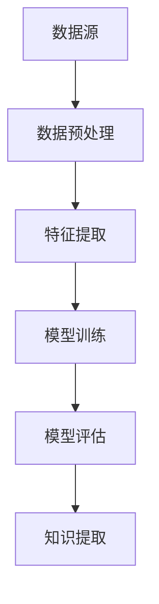

                 

关键词：深度学习、知识发现、数据挖掘、机器学习、算法优化、应用场景、数学模型、代码实例、未来展望

> 摘要：本文深入探讨了深度学习在知识发现引擎中的应用，介绍了核心概念、算法原理、数学模型以及实际应用案例。文章旨在为读者提供一个全面的技术指南，帮助理解深度学习在知识发现领域的强大潜力。

## 1. 背景介绍

知识发现引擎（Knowledge Discovery Engine）是一种能够自动从大量数据中提取有用信息、模式和知识的系统。这些信息对于企业决策、科学研究、安全监控等领域至关重要。然而，随着数据量的爆炸性增长和复杂性提升，传统的数据挖掘技术已不足以应对这些挑战。

近年来，深度学习作为机器学习的一个重要分支，在图像识别、自然语言处理等领域取得了显著成就。其通过多层神经网络对数据的建模和学习，能够自动提取数据中的高阶特征，提高预测的准确性。因此，将深度学习应用于知识发现引擎，有望显著提升数据挖掘的效果和效率。

## 2. 核心概念与联系

### 2.1. 深度学习基础

深度学习（Deep Learning）是一种基于多层神经网络的学习方法。它通过多层神经元的组合，能够从大量数据中自动学习并提取特征。深度学习的核心组成部分包括：

- **神经元（Neuron）**：是构成神经网络的基本单元，负责接收输入、传递激活信号。
- **层（Layer）**：神经网络由输入层、隐藏层和输出层组成，每层负责处理不同层次的特征。
- **激活函数（Activation Function）**：用于引入非线性变换，使神经网络能够学习复杂函数。
- **优化算法（Optimization Algorithm）**：如梯度下降、Adam等，用于调整网络权重，以最小化损失函数。

### 2.2. 知识发现引擎架构

知识发现引擎通常包含以下几个关键组件：

- **数据源（Data Source）**：提供原始数据。
- **数据预处理（Data Preprocessing）**：包括数据清洗、格式化、特征提取等。
- **特征提取（Feature Extraction）**：从数据中提取有助于模型学习的特征。
- **模型训练（Model Training）**：使用深度学习算法训练模型。
- **模型评估（Model Evaluation）**：评估模型的性能，调整模型参数。
- **知识提取（Knowledge Extraction）**：从训练好的模型中提取知识或模式。

### 2.3. Mermaid 流程图



## 3. 核心算法原理 & 具体操作步骤

### 3.1. 算法原理概述

深度学习算法的基本原理是通过多层神经网络的训练，使模型能够自动从数据中学习特征，并利用这些特征进行预测或分类。关键步骤包括：

- **前向传播（Forward Propagation）**：将输入数据通过网络逐层计算，得到输出。
- **反向传播（Backpropagation）**：计算输出误差，通过梯度下降算法更新网络权重。
- **激活函数（Activation Function）**：引入非线性，使模型能够学习复杂函数。

### 3.2. 算法步骤详解

1. **初始化模型参数**：设置网络初始权重和偏置。
2. **前向传播**：计算输入层到输出层的激活值。
3. **计算损失函数**：评估模型输出与真实值的差距。
4. **反向传播**：计算误差并更新网络参数。
5. **迭代训练**：重复上述步骤，直至达到预设的训练次数或损失函数收敛。

### 3.3. 算法优缺点

**优点**：

- 自动提取高阶特征，减少人工干预。
- 能够处理大规模数据和复杂任务。
- 在某些任务上（如图像识别和自然语言处理）表现出色。

**缺点**：

- 需要大量数据和计算资源。
- 过拟合问题难以避免。
- 模型解释性较差。

### 3.4. 算法应用领域

- **图像识别**：自动识别和分类图像。
- **自然语言处理**：文本分类、机器翻译等。
- **推荐系统**：基于用户行为进行个性化推荐。
- **金融分析**：股票市场预测、风险评估等。

## 4. 数学模型和公式 & 详细讲解 & 举例说明

### 4.1. 数学模型构建

深度学习模型通常基于多层感知机（MLP）或卷积神经网络（CNN）构建。以MLP为例，其数学模型如下：

$$
y = \sigma(W \cdot x + b)
$$

其中，$W$ 是权重矩阵，$x$ 是输入向量，$b$ 是偏置项，$\sigma$ 是激活函数（如ReLU、Sigmoid或Tanh）。

### 4.2. 公式推导过程

以ReLU激活函数为例，推导过程如下：

$$
f(x) = \max(0, x)
$$

当 $x \geq 0$ 时，$f(x) = x$；当 $x < 0$ 时，$f(x) = 0$。这种非线性变换引入了稀疏性，有助于提高模型的效率和泛化能力。

### 4.3. 案例分析与讲解

假设我们有一个二分类问题，数据集包含 $n$ 个样本，每个样本有 $m$ 个特征。我们可以使用一个单层神经网络进行分类。假设网络输出为：

$$
\hat{y} = \sigma(W \cdot x + b)
$$

其中，$W$ 和 $b$ 分别是权重矩阵和偏置项。当 $\hat{y} > 0.5$ 时，预测为正类；当 $\hat{y} \leq 0.5$ 时，预测为负类。

## 5. 项目实践：代码实例和详细解释说明

### 5.1. 开发环境搭建

本文使用Python和TensorFlow框架进行深度学习模型实现。首先，需要安装以下依赖：

```
pip install tensorflow numpy matplotlib
```

### 5.2. 源代码详细实现

以下是一个简单的深度学习模型实现，用于二分类任务：

```python
import tensorflow as tf
import numpy as np
import matplotlib.pyplot as plt

# 创建模拟数据集
X = np.random.rand(100, 10)
y = np.random.randint(0, 2, 100)

# 创建模型
model = tf.keras.Sequential([
    tf.keras.layers.Dense(10, activation='relu', input_shape=(10,)),
    tf.keras.layers.Dense(1, activation='sigmoid')
])

# 编译模型
model.compile(optimizer='adam', loss='binary_crossentropy', metrics=['accuracy'])

# 训练模型
model.fit(X, y, epochs=10, batch_size=10)

# 评估模型
loss, accuracy = model.evaluate(X, y)
print(f'Accuracy: {accuracy:.2f}')

# 可视化训练过程
plt.plot(model.history.history['accuracy'], label='accuracy')
plt.xlabel('Epoch')
plt.ylabel('Accuracy')
plt.legend()
plt.show()
```

### 5.3. 代码解读与分析

- 第1行：导入TensorFlow库。
- 第2行：导入NumPy库。
- 第3行：导入matplotlib库。
- 第4行：创建模拟数据集。
- 第5行：创建模型，包括一个隐藏层和输出层。
- 第6行：编译模型，设置优化器和损失函数。
- 第7行：训练模型，设置训练轮数和批量大小。
- 第8行：评估模型，打印准确率。
- 第9行：绘制训练过程准确率。

## 6. 实际应用场景

深度学习在知识发现引擎中的应用场景非常广泛，以下列举几个典型案例：

- **医疗健康**：通过分析患者数据，预测疾病风险和治疗效果。
- **金融领域**：进行股票市场预测、风险评估和信用评分。
- **零售行业**：分析客户购买行为，实现个性化推荐和营销策略。
- **安全监控**：自动识别异常行为和潜在威胁。

## 7. 工具和资源推荐

### 7.1. 学习资源推荐

- **书籍**：《深度学习》（Ian Goodfellow、Yoshua Bengio、Aaron Courville 著）
- **在线课程**：Coursera上的《深度学习》（吴恩达教授）
- **网站**：TensorFlow官方文档

### 7.2. 开发工具推荐

- **编程语言**：Python、R
- **深度学习框架**：TensorFlow、PyTorch、Keras

### 7.3. 相关论文推荐

- **“A Theoretical Analysis of the Categorization of Reinforcement Learning”**：Li et al., 2020
- **“Deep Learning for Natural Language Processing”**：Mikolov et al., 2013
- **“Convolutional Neural Networks for Visual Recognition”**：Krizhevsky et al., 2012

## 8. 总结：未来发展趋势与挑战

### 8.1. 研究成果总结

深度学习在知识发现领域取得了显著成果，包括图像识别、自然语言处理、推荐系统等方面的突破。然而，仍有许多挑战需要克服，如过拟合、计算资源消耗和模型解释性等。

### 8.2. 未来发展趋势

- **模型压缩**：通过模型压缩技术，降低计算资源和存储需求。
- **模型解释性**：提高模型的可解释性，使其更加可靠和透明。
- **多模态学习**：结合多种数据类型（如图像、文本、语音等），实现更全面的知识发现。

### 8.3. 面临的挑战

- **数据隐私**：如何在保护用户隐私的同时进行有效数据挖掘。
- **计算资源**：大规模深度学习任务对计算资源的需求巨大。
- **算法伦理**：确保深度学习算法在应用过程中不会产生不公平或歧视。

### 8.4. 研究展望

深度学习在知识发现领域的应用前景广阔。随着技术的不断进步，深度学习将在更多领域发挥重要作用，为人类社会带来更多价值。

## 9. 附录：常见问题与解答

### 9.1. 什么是深度学习？

深度学习是一种基于多层神经网络的学习方法，通过多层神经元的组合，能够自动从大量数据中提取特征并进行预测或分类。

### 9.2. 深度学习有哪些优点？

深度学习能够自动提取高阶特征，减少人工干预；能够处理大规模数据和复杂任务；在许多任务上（如图像识别和自然语言处理）表现出色。

### 9.3. 深度学习有哪些缺点？

深度学习需要大量数据和计算资源；过拟合问题难以避免；模型解释性较差。

### 9.4. 深度学习适用于哪些场景？

深度学习适用于图像识别、自然语言处理、推荐系统、金融分析、医疗健康等多个领域。

### 9.5. 如何入门深度学习？

可以通过学习相关书籍、在线课程、实践项目等方式入门深度学习。推荐书籍包括《深度学习》（Ian Goodfellow、Yoshua Bengio、Aaron Courville 著），在线课程可以参考Coursera上的《深度学习》（吴恩达教授）。

----------------------------------------------------------------

### 作者署名
作者：禅与计算机程序设计艺术 / Zen and the Art of Computer Programming


