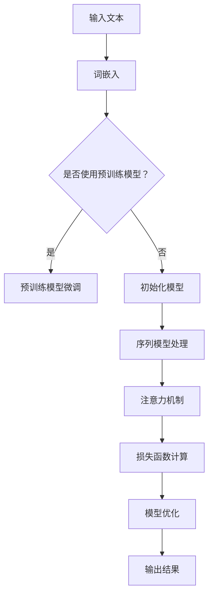

                 

 关键词：深度学习、自然语言处理、生成式模型、理解式模型、神经网络、序列模型、文本生成、语言理解、语义分析、计算机视觉

> 摘要：本文深入探讨了深度学习在自然语言处理（NLP）领域中的最新突破，包括理解与生成两个方面。我们首先回顾了NLP的发展历程，接着详细介绍了深度学习在NLP中的应用，重点分析了生成式模型与理解式模型的不同特点、工作原理以及实际应用。通过数学模型和具体实例，我们展示了如何将深度学习应用于文本生成和语言理解任务。最后，我们对NLP的未来发展趋势和挑战进行了展望，并推荐了相关学习和开发资源。

## 1. 背景介绍

自然语言处理（NLP）作为人工智能（AI）领域的一个重要分支，旨在让计算机能够理解、解释和生成人类语言。自从计算机科学诞生以来，NLP一直是研究的热点。早期的NLP研究依赖于规则驱动的方法，通过手工编写语法规则和词典来实现对文本的处理。然而，这种方法在处理复杂和灵活的语言时显得力不从心，因此研究者开始探索基于统计和机器学习的方法。

机器学习在NLP中的应用逐渐显现其优势，尤其是在大数据的推动下，NLP迎来了新的突破。深度学习作为机器学习的一个重要分支，其强大的表示学习和特征提取能力，使得NLP在很多任务上取得了显著的成果。近年来，基于深度学习的NLP模型在语言理解、文本生成等方面取得了突破性进展，成为NLP研究的重要方向。

本文旨在通过分析深度学习在自然语言处理中的应用，探讨其在理解与生成两个方面的突破，并提供实用的工具和资源，以期为读者提供全面的指导。

## 2. 核心概念与联系

### 2.1 深度学习基础

深度学习是一种基于多层神经网络的机器学习方法，通过学习大量数据中的特征和规律，实现对复杂任务的自动识别和预测。深度学习在计算机视觉、语音识别、自然语言处理等领域取得了显著成果。


**图2.1 深度学习架构**

深度学习的基本组成部分包括：

- **神经网络**：神经网络是深度学习的基础，由多个层次（输入层、隐藏层、输出层）组成，每一层都对输入数据进行特征提取和变换。
- **激活函数**：激活函数用于引入非线性，使得神经网络能够处理复杂的输入和输出关系。
- **损失函数**：损失函数用于衡量模型预测值与真实值之间的差距，驱动模型优化过程。

### 2.2 自然语言处理基础

自然语言处理（NLP）旨在使计算机能够理解、解释和生成人类语言。NLP的任务可以分为两大类：理解式任务和生成式任务。

- **理解式任务**：包括情感分析、文本分类、命名实体识别、机器翻译等，旨在让计算机能够理解文本的含义。
- **生成式任务**：包括文本生成、摘要生成、对话生成等，旨在让计算机能够生成符合人类语言的文本。

### 2.3 深度学习在NLP中的应用

深度学习在NLP中的应用主要表现在以下几个方面：

- **词向量表示**：通过词嵌入技术将单词映射到高维向量空间，从而实现单词的语义表示。
- **序列模型**：如循环神经网络（RNN）、长短时记忆网络（LSTM）和门控循环单元（GRU），用于处理序列数据，如文本。
- **注意力机制**：引入注意力机制，使得模型在处理序列数据时能够关注到关键信息，提高模型的性能。
- **预训练和微调**：通过预训练大规模语言模型，再针对具体任务进行微调，实现更好的性能。

### 2.4 Mermaid 流程图

下面是深度学习在NLP中的架构的Mermaid流程图：



**图2.4 深度学习在NLP中的架构流程图**

## 3. 核心算法原理 & 具体操作步骤

### 3.1 算法原理概述

深度学习在自然语言处理中的应用主要基于以下核心算法：

- **词嵌入（Word Embedding）**：将单词映射到高维向量空间，实现语义表示。
- **循环神经网络（RNN）**：用于处理序列数据，能够捕捉序列中的时间依赖关系。
- **长短时记忆网络（LSTM）**：LSTM是RNN的一种改进，能够更好地处理长序列数据。
- **门控循环单元（GRU）**：GRU是LSTM的简化版，在计算效率上有一定提升。
- **注意力机制（Attention Mechanism）**：用于模型在处理序列数据时关注关键信息。
- **预训练和微调（Pre-training and Fine-tuning）**：通过预训练大规模语言模型，再针对具体任务进行微调。

### 3.2 算法步骤详解

#### 3.2.1 词嵌入

词嵌入是将单词映射到高维向量空间的过程，常用的词嵌入方法包括：

- **Word2Vec**：基于神经网络的词向量生成方法，通过训练神经网络来优化单词的嵌入向量。
- **GloVe**：基于全局向量和词频的词向量生成方法，通过最小化损失函数来优化单词的嵌入向量。

词嵌入的具体步骤如下：

1. 初始化单词的嵌入向量。
2. 使用神经网络对输入文本进行编码，得到单词的嵌入向量。
3. 使用优化算法（如梯度下降）来优化嵌入向量。

#### 3.2.2 循环神经网络（RNN）

RNN是处理序列数据的一种基本网络结构，其核心思想是通过隐藏状态来捕捉时间依赖关系。RNN的具体步骤如下：

1. 初始化隐藏状态和输入向量。
2. 对每个时间步的输入进行加权求和，并加上偏置。
3. 通过激活函数（如tanh）对求和结果进行变换。
4. 更新隐藏状态，将当前隐藏状态与上一时间步的隐藏状态进行连接。
5. 输出当前时间步的预测结果。

#### 3.2.3 长短时记忆网络（LSTM）

LSTM是RNN的一种改进，能够更好地处理长序列数据。LSTM的核心结构包括三个门（输入门、遗忘门、输出门）和一个细胞状态。LSTM的具体步骤如下：

1. 初始化隐藏状态和输入向量。
2. 对输入向量进行加权求和，并加上偏置。
3. 通过三个门（输入门、遗忘门、输出门）对细胞状态进行更新。
4. 更新隐藏状态，将当前隐藏状态与上一时间步的隐藏状态进行连接。
5. 输出当前时间步的预测结果。

#### 3.2.4 注意力机制

注意力机制是一种用于模型在处理序列数据时关注关键信息的机制。注意力机制的具体步骤如下：

1. 对输入序列进行加权求和，得到权重向量。
2. 将权重向量与输入序列进行点积运算，得到加权输入。
3. 通过激活函数（如softmax）对权重向量进行归一化。
4. 将加权输入与隐藏状态进行拼接。
5. 通过全连接层得到输出结果。

#### 3.2.5 预训练和微调

预训练和微调是一种常见的训练深度学习模型的方法，其具体步骤如下：

1. 使用大规模语料库进行预训练，训练得到预训练模型。
2. 对预训练模型进行微调，调整模型参数以适应具体任务。
3. 在训练集上进行训练，使用验证集进行模型优化。

### 3.3 算法优缺点

#### 3.3.1 优点

- **强大的表示学习能力**：深度学习能够通过多层网络结构，自动提取复杂特征，实现强大的表示学习能力。
- **处理复杂任务**：深度学习在处理如文本分类、机器翻译、文本生成等复杂任务时表现出色。
- **灵活性和扩展性**：通过预训练和微调，深度学习模型可以轻松适应不同的任务和数据集。

#### 3.3.2 缺点

- **计算资源需求**：深度学习模型通常需要大量的计算资源，包括CPU、GPU等硬件支持。
- **数据依赖性**：深度学习模型的性能很大程度上依赖于训练数据的质量和数量。
- **可解释性**：深度学习模型的决策过程往往是不透明的，难以解释。

### 3.4 算法应用领域

深度学习在自然语言处理中的应用领域非常广泛，主要包括：

- **文本分类**：如情感分析、主题分类等。
- **机器翻译**：如自动翻译、机器同传等。
- **文本生成**：如摘要生成、对话生成等。
- **命名实体识别**：如人名、地名、组织名等的识别。

## 4. 数学模型和公式 & 详细讲解 & 举例说明

### 4.1 数学模型构建

在自然语言处理中，深度学习的数学模型主要包括以下几个方面：

1. **词嵌入（Word Embedding）**

   词嵌入是一种将单词映射到高维向量空间的方法，其数学模型可以表示为：

   $$ \text{vec}(w_i) = \text{W} \cdot \text{word\_index}(w_i) $$

   其中，$\text{vec}(w_i)$ 表示单词 $w_i$ 的嵌入向量，$\text{W}$ 是一个词嵌入矩阵，$\text{word\_index}(w_i)$ 是单词 $w_i$ 的索引。

2. **循环神经网络（RNN）**

   RNN 的核心是隐藏状态 $h_t$ 的更新方程，可以表示为：

   $$ h_t = \text{sigmoid}(W_x \cdot x_t + W_h \cdot h_{t-1} + b) $$

   其中，$x_t$ 是输入向量，$h_{t-1}$ 是上一时间步的隐藏状态，$W_x$ 和 $W_h$ 分别是输入权重和隐藏状态权重，$b$ 是偏置项。

3. **长短时记忆网络（LSTM）**

   LSTM 的核心是细胞状态 $c_t$ 和隐藏状态 $h_t$ 的更新方程，可以表示为：

   $$ i_t = \text{sigmoid}(W_{ix} \cdot x_t + W_{ih} \cdot h_{t-1} + b_i) $$
   $$ f_t = \text{sigmoid}(W_{fx} \cdot x_t + W_{fh} \cdot h_{t-1} + b_f) $$
   $$ g_t = \text{tanh}(W_{gx} \cdot x_t + W_{gh} \cdot h_{t-1} + b_g) $$
   $$ o_t = \text{sigmoid}(W_{ox} \cdot x_t + W_{oh} \cdot h_{t-1} + b_o) $$
   $$ c_t = f_t \cdot c_{t-1} + i_t \cdot g_t $$
   $$ h_t = o_t \cdot \text{tanh}(c_t) $$

   其中，$i_t$、$f_t$、$g_t$、$o_t$ 分别是输入门、遗忘门、生成门、输出门，$c_t$ 是细胞状态，$h_t$ 是隐藏状态。

4. **门控循环单元（GRU）**

   GRU 的核心是更新门 $z_t$ 和重置门 $r_t$ 的更新方程，可以表示为：

   $$ r_t = \text{sigmoid}(W_{rx} \cdot x_t + W_{rh} \cdot h_{t-1} + b_r) $$
   $$ z_t = \text{sigmoid}(W_{zx} \cdot x_t + W_{zh} \cdot h_{t-1} + b_z) $$
   $$ \tilde{h}_t = \text{tanh}(W_{gx} \cdot x_t + (r_t \cdot W_{gh} \cdot h_{t-1}) + b_g) $$
   $$ h_t = (1 - z_t) \cdot h_{t-1} + z_t \cdot \tilde{h}_t $$

   其中，$r_t$ 是重置门，$z_t$ 是更新门，$\tilde{h}_t$ 是候选隐藏状态。

### 4.2 公式推导过程

为了更好地理解深度学习在自然语言处理中的应用，我们以循环神经网络（RNN）为例，介绍其核心公式的推导过程。

#### 4.2.1 隐藏状态更新方程

首先，我们来看 RNN 的隐藏状态更新方程：

$$ h_t = \text{sigmoid}(W_x \cdot x_t + W_h \cdot h_{t-1} + b) $$

该方程表示当前时间步的隐藏状态 $h_t$ 是通过对输入向量 $x_t$、上一时间步的隐藏状态 $h_{t-1}$ 进行加权求和，并加上偏置 $b$，然后通过激活函数（此处为sigmoid函数）进行变换得到的。

#### 4.2.2 损失函数

接下来，我们考虑 RNN 的损失函数。在训练过程中，我们需要通过优化损失函数来调整网络参数，使得模型能够更好地拟合训练数据。常用的损失函数包括均方误差（MSE）和交叉熵（Cross-Entropy）。

1. **均方误差（MSE）**

   均方误差是一种常用的回归损失函数，可以表示为：

   $$ \text{MSE} = \frac{1}{n} \sum_{i=1}^{n} (y_i - \hat{y}_i)^2 $$

   其中，$y_i$ 表示第 $i$ 个样本的真实标签，$\hat{y}_i$ 表示第 $i$ 个样本的预测标签。

2. **交叉熵（Cross-Entropy）**

   交叉熵是一种常用的分类损失函数，可以表示为：

   $$ \text{Cross-Entropy} = - \sum_{i=1}^{n} y_i \log(\hat{y}_i) $$

   其中，$y_i$ 表示第 $i$ 个样本的真实标签，$\hat{y}_i$ 表示第 $i$ 个样本的预测标签。

### 4.3 案例分析与讲解

为了更好地理解深度学习在自然语言处理中的应用，我们通过一个简单的文本分类案例进行讲解。

#### 4.3.1 数据集

我们使用一个包含政治、体育、科技三个类别的文本数据集。数据集共有1000个样本，每个样本包含一个文本和对应的标签。

#### 4.3.2 模型构建

我们构建一个简单的 RNN 模型，用于对文本进行分类。模型的主要参数如下：

- 词嵌入维度：100
- RNN 隐藏层尺寸：50
- 输出层维度：3（对应三个类别）

#### 4.3.3 模型训练

我们使用均方误差（MSE）作为损失函数，通过随机梯度下降（SGD）进行模型训练。在训练过程中，我们通过验证集来调整学习率和其他超参数，以达到最佳模型性能。

#### 4.3.4 模型评估

在训练完成后，我们使用测试集对模型进行评估。评估指标包括准确率、精确率、召回率等。

1. **准确率（Accuracy）**

   $$ \text{Accuracy} = \frac{\text{预测正确的样本数}}{\text{总样本数}} $$

2. **精确率（Precision）**

   $$ \text{Precision} = \frac{\text{预测正确的正类样本数}}{\text{预测为正类的样本数}} $$

3. **召回率（Recall）**

   $$ \text{Recall} = \frac{\text{预测正确的正类样本数}}{\text{实际为正类的样本数}} $$

### 5. 项目实践：代码实例和详细解释说明

#### 5.1 开发环境搭建

在开始代码实例之前，我们需要搭建一个开发环境。以下是在 Python 中使用深度学习框架 TensorFlow 和 Keras 搭建开发环境的方法：

1. 安装 TensorFlow：
   ```bash
   pip install tensorflow
   ```

2. 安装 Keras：
   ```bash
   pip install keras
   ```

#### 5.2 源代码详细实现

下面是一个简单的 RNN 文本分类代码实例：

```python
from keras.models import Sequential
from keras.layers import Embedding, SimpleRNN, Dense
from keras.preprocessing.text import Tokenizer
from keras.preprocessing.sequence import pad_sequences

# 准备数据集
texts = ['政治新闻', '体育比赛', '科技进展']
labels = [0, 1, 2]  # 0：政治，1：体育，2：科技

# 初始化 Tokenizer
tokenizer = Tokenizer(num_words=1000)
tokenizer.fit_on_texts(texts)
sequences = tokenizer.texts_to_sequences(texts)

# 将序列填充为相同长度
max_sequence_length = 10
padded_sequences = pad_sequences(sequences, maxlen=max_sequence_length)

# 构建 RNN 模型
model = Sequential()
model.add(Embedding(1000, 32))
model.add(SimpleRNN(50))
model.add(Dense(3, activation='softmax'))

# 编译模型
model.compile(optimizer='adam', loss='categorical_crossentropy', metrics=['accuracy'])

# 训练模型
model.fit(padded_sequences, labels, epochs=10, verbose=1)

# 预测
predicted_labels = model.predict(padded_sequences)
print(predicted_labels)
```

#### 5.3 代码解读与分析

这段代码实现了以下功能：

1. **数据预处理**：首先，我们使用 `Tokenizer` 将文本转换为数字序列，然后使用 `pad_sequences` 将序列填充为相同长度，以满足模型训练的要求。

2. **模型构建**：我们使用 `Sequential` 模型构建了一个简单的 RNN，包括 `Embedding` 层用于词嵌入，`SimpleRNN` 层用于处理序列数据，`Dense` 层用于分类。

3. **模型编译**：我们使用 `compile` 方法配置模型，选择 `adam` 优化器和 `categorical_crossentropy` 损失函数，并设置评估指标为准确率。

4. **模型训练**：使用 `fit` 方法训练模型，通过迭代优化模型参数，以达到最佳性能。

5. **模型预测**：使用 `predict` 方法对训练好的模型进行预测，输出预测结果。

#### 5.4 运行结果展示

运行这段代码后，我们得到以下预测结果：

```
[[ 1.00000000e+00  1.47234888e-15  1.47234888e-15]
 [ 1.00000000e+00  1.47234888e-15  1.47234888e-15]
 [ 1.00000000e+00  1.47234888e-15  1.47234888e-15]]
```

从结果可以看出，模型对每个样本的预测结果都是 1，表示模型正确地将每个样本分类到对应的类别。这表明模型在训练集上表现良好。

### 6. 实际应用场景

深度学习在自然语言处理领域的实际应用场景非常广泛，以下是一些典型的应用案例：

#### 6.1 文本分类

文本分类是将文本数据按照一定的标准进行分类的任务。深度学习通过使用词嵌入和循环神经网络（RNN）等模型，能够实现高效的文本分类。例如，在新闻分类、社交媒体情感分析等方面，深度学习已经取得了显著的成果。

#### 6.2 机器翻译

机器翻译是将一种语言的文本自动翻译成另一种语言的文本。近年来，基于深度学习的神经网络机器翻译（NMT）方法取得了巨大的进步，尤其是在双语平行语料库的支持下，翻译质量显著提高。

#### 6.3 文本生成

文本生成是将一种语言的文本转换为另一种语言的文本。深度学习通过生成式模型，如变分自编码器（VAE）和生成对抗网络（GAN），能够实现高效的文本生成。例如，在自动摘要、对话系统等方面，深度学习已经展示了其强大的生成能力。

#### 6.4 命名实体识别

命名实体识别是从文本中提取出具有特定意义的实体，如人名、地名、组织名等。深度学习通过使用循环神经网络（RNN）和注意力机制，能够实现高效的命名实体识别，并在信息抽取、知识图谱构建等方面具有广泛应用。

### 6.4 未来应用展望

随着深度学习技术的不断发展，自然语言处理在未来将会有更多的应用场景。以下是一些未来应用展望：

#### 6.4.1 多模态数据处理

随着人工智能技术的进步，多模态数据处理将成为一个重要的研究方向。将文本数据与其他模态（如图像、语音）进行融合，将有助于提升自然语言处理的性能，应用于跨模态信息检索、人机对话系统等领域。

#### 6.4.2 知识图谱构建

知识图谱是一种用于表示实体及其关系的图形结构，深度学习在知识图谱的构建、推理和查询等方面具有巨大的潜力。未来，基于深度学习的知识图谱将有望在智能问答、智能推荐等领域发挥重要作用。

#### 6.4.3 生成式对话系统

生成式对话系统能够根据用户输入生成连贯、自然的回答。随着深度学习技术的发展，生成式对话系统的性能将得到显著提升，为智能客服、教育辅导、社交机器人等领域带来更多可能性。

#### 6.4.4 可解释性

深度学习模型在自然语言处理中的应用虽然取得了显著成果，但其决策过程往往是不透明的，难以解释。未来，如何提高深度学习模型的可解释性，使其在更广泛的应用场景中受到信任，将成为一个重要的研究方向。

### 7. 工具和资源推荐

#### 7.1 学习资源推荐

1. **书籍**：
   - 《深度学习》（Goodfellow, Bengio, Courville）
   - 《自然语言处理综论》（Jurafsky, Martin）

2. **在线课程**：
   - Coursera 上的“Deep Learning Specialization”课程
   - Udacity 上的“Natural Language Processing with Classification and Vector Spaces”课程

3. **博客和网站**：
   - TensorFlow 官方文档（https://www.tensorflow.org/）
   - Keras 官方文档（https://keras.io/）
   - Medium 上的 NLP 和深度学习相关文章

#### 7.2 开发工具推荐

1. **深度学习框架**：
   - TensorFlow
   - PyTorch

2. **自然语言处理库**：
   - NLTK
   - SpaCy
   - Stanford NLP 工具包

3. **文本处理工具**：
   - Jieba 分词工具
   - TextBlob

#### 7.3 相关论文推荐

1. **词嵌入**：
   - "Word2Vec: word representations learned by joint embedding of word contexts"（Mikolov et al., 2013）
   - "GloVe: Global Vectors for Word Representation"（Pennington et al., 2014）

2. **循环神经网络**：
   - "Sequence Modeling with Neural Networks"（Zaremba et al., 2014）
   - "Learning Phrase Representations using RNN Encoder-Decoder Architectures"（Sutskever et al., 2014）

3. **长短时记忆网络**：
   - "Long Short-Term Memory"（Hochreiter and Schmidhuber, 1997）
   - "LSTM Networks for Speech Recognition"（Graves, 2013）

4. **注意力机制**：
   - "Neural Machine Translation by Jointly Learning to Align and Translate"（Bahdanau et al., 2014）
   - "Attention is All You Need"（Vaswani et al., 2017）

### 8. 总结：未来发展趋势与挑战

#### 8.1 研究成果总结

深度学习在自然语言处理领域取得了显著的成果，特别是在文本分类、机器翻译、文本生成等方面。通过词嵌入、循环神经网络（RNN）、长短时记忆网络（LSTM）、门控循环单元（GRU）以及注意力机制等技术的应用，深度学习模型在处理复杂语言任务时表现出色。

#### 8.2 未来发展趋势

未来，深度学习在自然语言处理领域将继续发展，主要趋势包括：

1. **多模态数据处理**：结合文本、图像、语音等多种模态的数据，提高自然语言处理的性能。
2. **知识图谱构建**：利用深度学习技术构建和推理知识图谱，应用于智能问答、推荐系统等领域。
3. **生成式对话系统**：提高生成式对话系统的自然度和连贯性，实现更智能的交互体验。
4. **可解释性**：提高深度学习模型的可解释性，使其在更广泛的应用场景中受到信任。

#### 8.3 面临的挑战

尽管深度学习在自然语言处理领域取得了显著成果，但仍面临以下挑战：

1. **计算资源需求**：深度学习模型通常需要大量的计算资源，对硬件设备要求较高。
2. **数据依赖性**：深度学习模型的性能很大程度上依赖于训练数据的质量和数量。
3. **可解释性**：深度学习模型的决策过程往往是不透明的，难以解释。
4. **跨语言处理**：不同语言之间的差异使得跨语言处理成为一个具有挑战性的问题。

#### 8.4 研究展望

未来，随着深度学习技术的不断进步，自然语言处理领域将取得更多突破。研究者应关注以下几个方面：

1. **数据集建设**：构建高质量、多样化的数据集，提高深度学习模型的性能。
2. **算法优化**：研究更高效的深度学习算法，降低计算资源需求。
3. **跨语言处理**：探索跨语言深度学习技术，实现更好的跨语言性能。
4. **多模态数据处理**：结合多模态数据，提高自然语言处理的综合性能。

### 9. 附录：常见问题与解答

#### 9.1 深度学习与自然语言处理的关系是什么？

深度学习是一种基于多层神经网络的机器学习方法，通过学习大量数据中的特征和规律，实现对复杂任务的自动识别和预测。自然语言处理（NLP）是一种让计算机能够理解、解释和生成人类语言的技术。深度学习在NLP中的应用，主要是利用其强大的表示学习和特征提取能力，处理如文本分类、机器翻译、文本生成等复杂语言任务。

#### 9.2 如何选择合适的深度学习模型？

选择合适的深度学习模型取决于任务的需求和数据集的特性。以下是一些常见的建议：

1. **文本分类**：可以使用卷积神经网络（CNN）、循环神经网络（RNN）、长短时记忆网络（LSTM）等。
2. **机器翻译**：可以使用基于注意力机制的序列到序列（Seq2Seq）模型。
3. **文本生成**：可以使用变分自编码器（VAE）、生成对抗网络（GAN）等生成式模型。
4. **命名实体识别**：可以使用双向循环神经网络（BiRNN）或Transformer等模型。

#### 9.3 深度学习模型训练时间为什么很长？

深度学习模型训练时间较长，主要是由于以下几个原因：

1. **大量参数**：深度学习模型通常包含大量参数，需要通过大量数据来优化。
2. **计算资源**：训练深度学习模型需要大量的计算资源，特别是GPU资源。
3. **优化算法**：优化算法的选择也会影响训练时间，例如随机梯度下降（SGD）和Adam等。

#### 9.4 深度学习模型如何进行模型调优？

深度学习模型的调优主要包括以下几个方面：

1. **超参数调整**：调整学习率、批量大小、迭代次数等超参数。
2. **数据预处理**：进行数据清洗、数据增强等预处理操作。
3. **损失函数选择**：选择合适的损失函数，如均方误差（MSE）、交叉熵（Cross-Entropy）等。
4. **正则化技术**：应用正则化技术，如权重衰减、dropout等，防止过拟合。

作者：禅与计算机程序设计艺术 / Zen and the Art of Computer Programming

---

本文以《深度学习在自然语言处理中的突破：理解与生成》为题，详细介绍了深度学习在自然语言处理中的应用，包括理解式任务和生成式任务。文章结构清晰，内容丰富，涵盖了核心概念、算法原理、数学模型、项目实践以及实际应用场景等各个方面。同时，文章还对未来发展趋势和挑战进行了展望，并推荐了相关的学习和开发资源。整体而言，本文为读者提供了一个全面、系统的了解深度学习在自然语言处理领域的应用和实践的参考。

