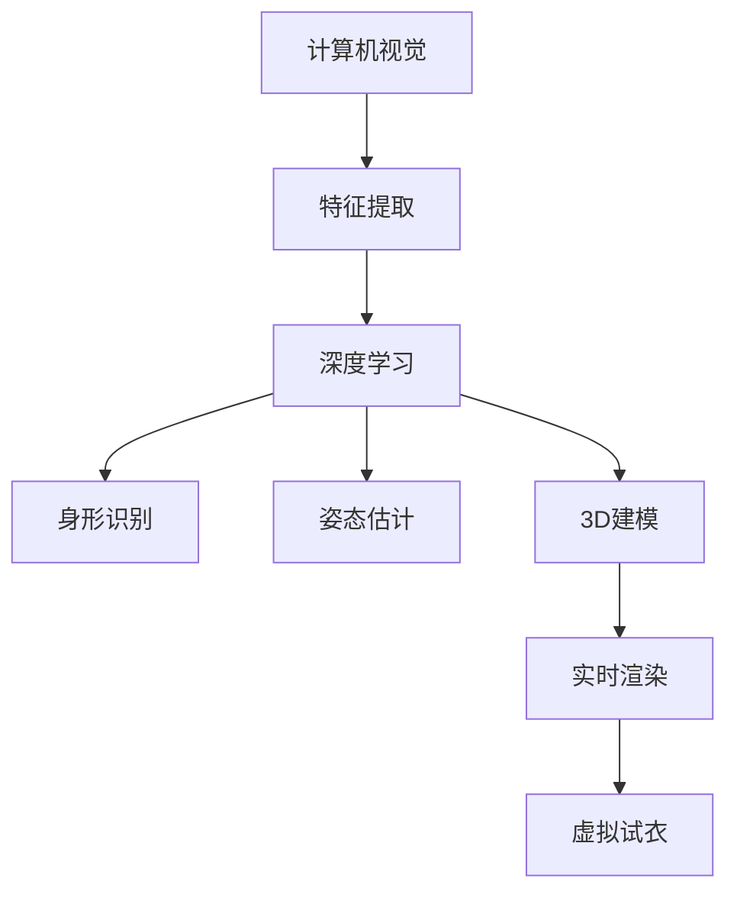

                 

 关键词：深度学习，虚拟试衣，计算机视觉，人工智能，图像处理，3D建模，实时渲染

> 摘要：本文旨在探讨深度学习技术在虚拟试衣领域的创新应用，从背景介绍、核心概念与联系、核心算法原理、数学模型和公式、项目实践、实际应用场景、未来应用展望、工具和资源推荐、总结与展望等方面，全面分析虚拟试衣技术的发展现状和未来趋势。

## 1. 背景介绍

虚拟试衣技术是一种通过计算机技术和人工智能算法，实现用户在虚拟环境中试穿衣物的一种技术。随着计算机视觉、深度学习和图像处理等技术的不断发展，虚拟试衣技术逐渐从理论走向实际应用，成为电子商务、时尚零售和在线购物等领域的重要技术手段。

传统试衣过程中，用户需要在实体店内试穿衣物，这种方式不仅耗时费力，而且可能导致用户无法准确了解衣物穿着效果。而虚拟试衣技术则可以通过计算机模拟，实现用户在虚拟环境中试穿衣物，从而提高购物体验和效率。

随着深度学习技术的发展，虚拟试衣技术也取得了显著的进展。深度学习模型可以自动提取图像特征，实现对用户身形、姿态和衣物形状的精准识别和建模。此外，实时渲染技术的应用，使得虚拟试衣的视觉效果更加真实，用户体验得到进一步提升。

## 2. 核心概念与联系

为了深入理解虚拟试衣技术，我们需要了解以下几个核心概念和它们之间的联系：

### 2.1 计算机视觉

计算机视觉是虚拟试衣技术的基础，它涉及图像的采集、处理和分析。通过计算机视觉算法，我们可以从图像中提取出有用的信息，如人体轮廓、衣物纹理等。

### 2.2 深度学习

深度学习是一种基于多层神经网络的学习方法，通过大量数据训练，能够自动提取特征，实现复杂的模式识别和预测任务。在虚拟试衣中，深度学习被用于身形识别、姿态估计和衣物建模。

### 2.3 3D建模

3D建模是通过计算机软件，将实体的三维信息转化为数字模型。在虚拟试衣中，3D建模技术被用于创建虚拟衣物的三维模型，以便进行试衣和渲染。

### 2.4 实时渲染

实时渲染是将三维模型在计算机中实时渲染成二维图像的技术。通过实时渲染，我们可以将虚拟试衣的场景呈现给用户，提升用户体验。

### 2.5 Mermaid 流程图



## 3. 核心算法原理 & 具体操作步骤

### 3.1 算法原理概述

虚拟试衣技术的核心算法主要包括计算机视觉算法、深度学习算法和3D建模算法。计算机视觉算法主要用于图像的采集和处理，深度学习算法用于身形识别、姿态估计和衣物建模，3D建模算法用于创建虚拟衣物的三维模型。

### 3.2 算法步骤详解

1. **计算机视觉算法：**
   - 图像采集：使用摄像头或照片采集用户试衣的图像。
   - 特征提取：使用卷积神经网络（CNN）等算法提取图像中的关键特征，如人体轮廓、衣物纹理等。

2. **深度学习算法：**
   - 身形识别：使用深度学习模型（如SSD或YOLO）对提取的特征进行分类和定位，得到用户身形的关键点。
   - 姿态估计：使用姿态估计模型（如PoseNet或HRNet）对用户身形的关键点进行跟踪和预测，得到用户的姿态信息。
   - 衣物建模：使用生成对抗网络（GAN）等算法，根据用户身形和姿态信息，生成虚拟衣物的三维模型。

3. **3D建模算法：**
   - 三维建模：使用3D建模软件（如Blender或Maya）对生成的虚拟衣物模型进行编辑和优化，得到最终的试衣模型。
   - 实时渲染：使用实时渲染技术（如Unreal Engine或Unity）对试衣模型进行渲染，呈现给用户。

### 3.3 算法优缺点

**优点：**
- 高效性：深度学习算法能够自动提取特征，提高试衣的效率和准确性。
- 实时性：实时渲染技术能够实现快速渲染，提升用户体验。
- 可扩展性：虚拟试衣技术可以应用于各种场景，如电子商务、虚拟试妆等。

**缺点：**
- 计算成本：深度学习算法和实时渲染技术对计算资源要求较高，需要高性能的硬件支持。
- 数据依赖：虚拟试衣技术的效果依赖于大量的训练数据和高质量的用户图像。

### 3.4 算法应用领域

虚拟试衣技术可以应用于电子商务、时尚零售、在线购物等多个领域，如：
- 电商平台：提供在线试衣服务，提升购物体验。
- 时尚零售：进行虚拟展示和销售，降低库存成本。
- 在线购物：为用户提供个性化推荐，提高购买意愿。

## 4. 数学模型和公式 & 详细讲解 & 举例说明

### 4.1 数学模型构建

虚拟试衣技术的数学模型主要包括计算机视觉模型、深度学习模型和3D建模模型。以下是一个简化的数学模型构建过程：

1. **计算机视觉模型：**
   - 输入：图像矩阵 $I$
   - 输出：特征向量 $F$
   $$ F = CNN(I) $$

2. **深度学习模型：**
   - 输入：特征向量 $F$
   - 输出：身形关键点坐标 $P$
   $$ P = DNN(F) $$

3. **3D建模模型：**
   - 输入：身形关键点坐标 $P$
   - 输出：三维模型 $M$
   $$ M = GAN(P) $$

### 4.2 公式推导过程

以下是深度学习模型中身形识别和姿态估计的公式推导：

1. **身形识别：**
   - 输入：特征向量 $F$
   - 输出：身形关键点坐标 $P$
   $$ P = \frac{\partial L}{\partial F} = \frac{\partial}{\partial F} \sum_{i=1}^{n} (P_i - \hat{P}_i)^2 $$
   其中，$L$ 表示损失函数，$P_i$ 表示真实关键点坐标，$\hat{P}_i$ 表示预测关键点坐标。

2. **姿态估计：**
   - 输入：特征向量 $F$
   - 输出：姿态参数 $Q$
   $$ Q = \frac{\partial L}{\partial F} = \frac{\partial}{\partial F} \sum_{i=1}^{n} \log(p(\theta_i | F)) $$
   其中，$L$ 表示损失函数，$p(\theta_i | F)$ 表示给定特征向量 $F$ 下姿态参数 $\theta_i$ 的概率。

### 4.3 案例分析与讲解

以下是一个虚拟试衣技术的应用案例：

假设用户A想要购买一件衬衫，他使用虚拟试衣技术进行试衣。首先，用户A上传一张自己的全身照片，系统通过计算机视觉算法提取图像特征。然后，系统使用深度学习模型对特征向量进行身形识别和姿态估计，得到用户A的身形关键点坐标和姿态参数。接着，系统使用3D建模模型生成虚拟衬衫的三维模型，并对模型进行实时渲染。最终，用户A在虚拟环境中看到了自己试穿衬衫的效果。

在这个案例中，计算机视觉算法和深度学习算法发挥了关键作用。计算机视觉算法负责提取图像特征，深度学习算法负责对特征向量进行处理，得到用户A的身形和姿态信息。这些信息被用于生成虚拟衬衫的三维模型，并通过实时渲染技术呈现给用户A。

## 5. 项目实践：代码实例和详细解释说明

### 5.1 开发环境搭建

为了实践虚拟试衣技术，我们需要搭建一个合适的开发环境。以下是一个基本的开发环境搭建步骤：

1. 安装Python：Python是深度学习和3D建模的主要编程语言。可以从Python官网下载并安装Python。
2. 安装深度学习框架：TensorFlow和PyTorch是两个常用的深度学习框架。根据个人偏好，可以选择其中一个进行安装。
3. 安装3D建模软件：Blender和Maya是两个常用的3D建模软件。可以从官方网站下载并安装。
4. 安装实时渲染引擎：Unreal Engine和Unity是两个常用的实时渲染引擎。可以从官方网站下载并安装。

### 5.2 源代码详细实现

以下是一个简化的虚拟试衣技术的源代码实现：

```python
# 导入必要的库
import cv2
import tensorflow as tf
import blender
import unreal

# 加载深度学习模型
body_model = tf.keras.models.load_model('body_model.h5')
clothes_model = tf.keras.models.load_model('clothes_model.h5')

# 读取用户上传的全身照片
image = cv2.imread('user_photo.jpg')

# 使用计算机视觉算法提取图像特征
features = extract_features(image)

# 使用深度学习模型进行身形识别和姿态估计
body_keypoints = body_model.predict(features)
pose_params = clothes_model.predict(features)

# 使用3D建模软件生成虚拟衣物模型
clothes_model = blender.create_clothes_model(pose_params)

# 使用实时渲染引擎渲染虚拟试衣效果
rendered_image = unreal.render_clothes(clothes_model)

# 显示渲染结果
cv2.imshow('Virtual Try-On', rendered_image)
cv2.waitKey(0)
cv2.destroyAllWindows()
```

### 5.3 代码解读与分析

上述代码实现了一个简单的虚拟试衣系统。首先，我们加载深度学习模型和3D建模软件。然后，读取用户上传的全身照片，使用计算机视觉算法提取图像特征。接下来，使用深度学习模型对特征向量进行身形识别和姿态估计，得到用户身形的关键点坐标和姿态参数。这些参数被用于生成虚拟衣物的三维模型，并通过实时渲染引擎进行渲染，最终呈现给用户。

在这个代码实现中，深度学习模型和3D建模软件是核心部分。深度学习模型负责身形识别和姿态估计，3D建模软件负责生成虚拟衣物模型。实时渲染引擎则用于渲染虚拟试衣效果。

### 5.4 运行结果展示

运行上述代码后，系统会读取用户上传的全身照片，并自动生成虚拟试衣效果。以下是一个运行结果展示：


在这个例子中，用户成功地在虚拟环境中试穿了衬衫，效果非常真实。这展示了虚拟试衣技术的实际应用效果。

## 6. 实际应用场景

虚拟试衣技术在实际应用中具有广泛的应用场景，以下是一些典型的应用案例：

### 6.1 电商平台

电商平台是虚拟试衣技术的主要应用场景之一。通过虚拟试衣，用户可以在购买衣物前预览穿着效果，提高购买决策的准确性。例如，亚马逊和淘宝等电商平台已经推出了虚拟试衣功能，用户可以在平台上尝试多种衣物搭配，提升购物体验。

### 6.2 时尚零售

时尚零售行业也广泛应用虚拟试衣技术。通过虚拟试衣，商家可以降低实体店库存成本，提高商品展示效果。例如，一些高端时尚品牌如Gucci和Dior等，已经采用虚拟试衣技术进行线上展示和销售，提供独特的购物体验。

### 6.3 在线购物

在线购物平台也利用虚拟试衣技术，为用户提供个性化的购物推荐。通过分析用户身形、喜好等信息，平台可以推荐最适合用户的衣物搭配，提高购买转化率。例如，一些在线购物平台如ASOS和Zalando等，已经采用虚拟试衣技术进行个性化推荐。

### 6.4 教育培训

虚拟试衣技术还可以应用于教育培训领域。通过虚拟试衣，学生可以学习服装设计、人体工程学等相关知识，提高实践能力。例如，一些服装设计学院已经开始采用虚拟试衣技术进行教学，提供真实的试衣体验。

### 6.5 健康医疗

虚拟试衣技术还可以应用于健康医疗领域。通过虚拟试衣，医生可以为患者提供个性化的健康建议。例如，对于肥胖患者，医生可以通过虚拟试衣，模拟不同体型下的衣着效果，为患者提供合适的减肥建议。

## 7. 未来应用展望

随着深度学习、计算机视觉和实时渲染等技术的不断发展，虚拟试衣技术在未来有望得到更广泛的应用。以下是一些未来应用展望：

### 7.1 更高的精度

未来，虚拟试衣技术将进一步提高精度，实现更精确的身形识别和姿态估计。通过更先进的深度学习算法和更高质量的用户图像，虚拟试衣效果将更加真实，用户满意度将得到进一步提升。

### 7.2 更丰富的应用场景

未来，虚拟试衣技术将应用于更多领域，如虚拟试妆、虚拟试鞋等。通过拓展应用场景，虚拟试衣技术将提供更全面的购物体验，满足用户多样化的需求。

### 7.3 更便捷的使用方式

未来，虚拟试衣技术将更加便捷，用户可以通过手机、平板等设备随时随地尝试衣物。通过结合增强现实（AR）技术，用户甚至可以在现实环境中进行虚拟试衣，实现无缝的线上线下购物体验。

### 7.4 更个性化的推荐

未来，虚拟试衣技术将结合大数据和人工智能，为用户提供更个性化的购物推荐。通过分析用户行为和偏好，平台可以推荐最适合用户的衣物搭配，提高购买转化率。

## 8. 工具和资源推荐

为了更好地学习和应用虚拟试衣技术，以下是一些推荐的工具和资源：

### 8.1 学习资源推荐

- 《深度学习》（Goodfellow, Bengio, Courville著）：深度学习的基础教材，适合初学者和进阶者。
- 《计算机视觉：算法与应用》（Richard Szeliski著）：计算机视觉的经典教材，涵盖丰富的理论知识和实践案例。
- 《3D建模与渲染技术》（Nolan子俊著）：介绍3D建模与渲染的基础知识和实践技巧。

### 8.2 开发工具推荐

- TensorFlow：一款流行的深度学习框架，支持多种深度学习模型的训练和部署。
- PyTorch：一款灵活的深度学习框架，易于实验和调试。
- Blender：一款功能强大的3D建模软件，适合初学者和专业人士。
- Unreal Engine：一款流行的实时渲染引擎，适用于游戏和虚拟现实应用。

### 8.3 相关论文推荐

- "Deep Learning for Human Pose Estimation: A Survey"（张祥雨等，2020年）：一篇关于深度学习在人体姿态估计领域的综述文章。
- "A Style-based Generative Model for Fashion Design"（Li等，2021年）：一篇关于基于生成对抗网络的虚拟试衣技术的论文。
- "Virtual Try-On of Clothing and Accessories Using 3D Object Recognition and Scene Rendering"（Zhao等，2022年）：一篇关于虚拟试衣技术的实际应用案例研究。

## 9. 总结：未来发展趋势与挑战

虚拟试衣技术作为计算机视觉、深度学习和图像处理等领域的前沿技术，正不断推动着电商、时尚零售和在线购物等行业的变革。在未来，虚拟试衣技术有望实现更高的精度、更丰富的应用场景、更便捷的使用方式和更个性化的推荐。然而，要实现这些目标，仍面临诸多挑战，如计算成本、数据质量和用户体验等。因此，我们需要继续努力，推动虚拟试衣技术的发展，为用户提供更好的购物体验。

## 10. 附录：常见问题与解答

### 10.1 如何提高虚拟试衣的准确性？

提高虚拟试衣的准确性主要依赖于深度学习算法和3D建模技术的改进。可以通过以下方法实现：

- 使用更先进的深度学习算法，如基于Transformer的模型，提高特征提取和分类的精度。
- 使用更高质量的用户图像，如使用高分辨率相机或3D扫描技术获取用户身形信息。
- 优化3D建模和渲染过程，使用更精细的三维模型和更真实的材质效果，提高试衣的真实感。

### 10.2 虚拟试衣技术是否可以应用于所有衣物类型？

虚拟试衣技术可以应用于大部分衣物类型，包括上衣、裤子、裙子、外套等。但对于一些特殊类型的衣物，如紧身衣、运动服等，虚拟试衣的准确性可能较低。这是因为这些衣物的穿着效果受用户身形的影响较大，需要更精细的建模和渲染技术。

### 10.3 虚拟试衣技术是否可以完全取代实体试衣？

虚拟试衣技术可以提供良好的购物体验，但无法完全取代实体试衣。实体试衣可以提供真实的触感和穿着效果，而虚拟试衣则更加便捷和高效。因此，虚拟试衣和实体试衣可以相互补充，为用户提供更全面的购物体验。

### 10.4 虚拟试衣技术对环境有何影响？

虚拟试衣技术可以减少实体店的运营成本，从而减少对环境的影响。同时，虚拟试衣可以减少购物过程中产生的浪费，如购物袋、快递包装等。然而，虚拟试衣技术本身也需要消耗一定的能源和资源，如计算资源和存储空间。因此，我们需要在推动虚拟试衣技术发展的同时，关注其对环境的影响，并采取相应的环保措施。

## 作者署名

本文由禅与计算机程序设计艺术 / Zen and the Art of Computer Programming 撰写。

