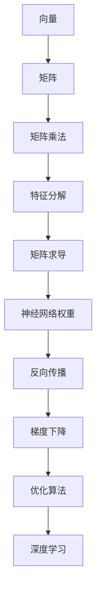
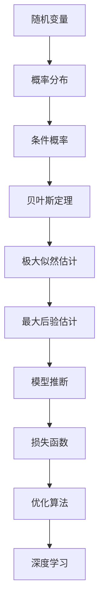
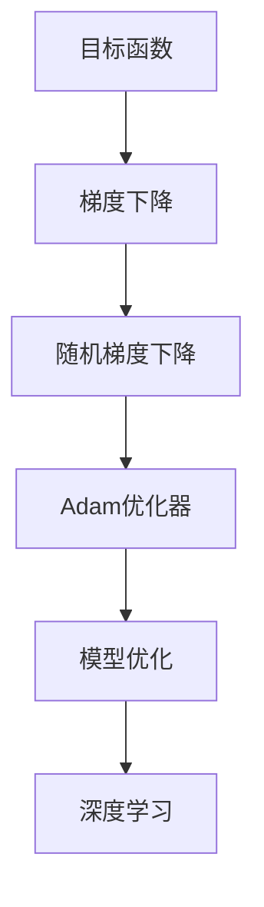

                 

深度学习，作为近年来人工智能领域的明星技术，已经在众多领域取得了显著的成果。然而，深度学习的理论基础不仅仅依赖于统计学和计算机科学，还涉及一系列数学概念，其中线性代数、概率论和优化理论尤为重要。本文旨在深入探讨这三个核心数学基础在深度学习中的应用，帮助读者更好地理解和掌握这一技术。

## 关键词

深度学习，线性代数，概率论，优化理论，人工智能

## 摘要

本文将分为以下几个部分：首先，介绍线性代数在深度学习中的作用及其基本概念；接着，探讨概率论在模型表达和推断中的关键角色；然后，深入解析优化理论在训练过程中的核心地位。最后，本文还将通过具体实例和代码展示，帮助读者将这些理论应用到实际项目中。

## 1. 背景介绍

深度学习的发展得益于计算能力的提升和大数据的涌现。然而，其理论基础可以追溯到更早期的数学和统计学理论。线性代数、概率论和优化理论为深度学习提供了坚实的数学框架，使得复杂的神经网络模型得以构建和优化。

线性代数主要研究向量空间和线性变换，这对于神经网络中的权重矩阵、偏置项等概念的理解至关重要。概率论则提供了对不确定性的量化方法，使得我们可以通过统计学习来估计参数，并进行预测。优化理论则帮助我们在训练过程中找到最优解，提高模型的性能。

## 2. 核心概念与联系

### 2.1 线性代数

线性代数是深度学习的基础，以下是一个简化的 Mermaid 流程图，展示了线性代数中的关键概念和它们在深度学习中的应用：



### 2.2 概率论

概率论在深度学习中的应用主要体现在模型的表达和推断中。以下是一个简化的 Mermaid 流程图，展示了概率论的基本概念及其在深度学习中的应用：



### 2.3 优化理论

优化理论在深度学习中的作用是通过最小化损失函数来找到模型的参数。以下是一个简化的 Mermaid 流程图，展示了优化理论的基本概念及其在深度学习中的应用：



## 3. 核心算法原理 & 具体操作步骤

### 3.1 算法原理概述

深度学习的核心算法是基于多层神经网络的，其原理可以概括为以下几点：

1. **前向传播**：将输入数据通过网络的各个层进行传播，得到输出。
2. **反向传播**：利用输出与期望输出之间的差异，计算网络中每个参数的梯度，然后更新这些参数。
3. **优化算法**：通过迭代更新参数，使得损失函数逐渐减小，从而提高模型的性能。

### 3.2 算法步骤详解

1. **初始化参数**：设置网络的初始权重和偏置。
2. **前向传播**：将输入数据送入网络，逐层计算输出。
3. **计算损失**：通过损失函数计算输出与期望输出之间的差异。
4. **反向传播**：计算网络中每个参数的梯度。
5. **参数更新**：利用梯度下降等优化算法更新参数。
6. **迭代**：重复步骤2-5，直到满足停止条件。

### 3.3 算法优缺点

**优点**：

- **强大的表达能力**：多层神经网络可以学习复杂的非线性关系。
- **自动特征提取**：网络可以自动学习输入数据的特征表示。
- **自适应学习**：通过优化算法，网络可以自动调整参数，提高性能。

**缺点**：

- **计算复杂度高**：多层网络需要大量的计算资源。
- **易过拟合**：当网络过于复杂时，容易出现过拟合现象。

### 3.4 算法应用领域

深度学习算法广泛应用于图像识别、自然语言处理、语音识别、推荐系统等领域，取得了显著的成果。

## 4. 数学模型和公式 & 详细讲解 & 举例说明

### 4.1 数学模型构建

深度学习的数学模型主要基于多层感知机（MLP）和卷积神经网络（CNN）。

**多层感知机**：

$$
f(x) = \sigma(\theta_1 \cdot x_1 + \theta_2 \cdot x_2 + ... + \theta_n \cdot x_n)
$$

**卷积神经网络**：

$$
h^{(l)} = \sigma(\theta^{(l)} \cdot \text{ReLU}(\text{conv}^{(l-1)}))
$$

### 4.2 公式推导过程

以多层感知机为例，其前向传播和反向传播的推导如下：

**前向传播**：

$$
z^{(l)} = \theta^{(l)} \cdot x^{(l-1)} + b^{(l)}
$$

$$
a^{(l)} = \sigma(z^{(l)})
$$

**反向传播**：

$$
\delta^{(l)} = (a^{(l)} - y) \cdot \sigma'(z^{(l)})
$$

$$
\theta^{(l)} = \theta^{(l)} - \alpha \cdot \delta^{(l)} \cdot x^{(l-1)}
$$

### 4.3 案例分析与讲解

假设我们有一个简单的多层感知机模型，输入维度为2，隐藏层维度为3，输出维度为1。输入数据为 $[1, 0]$，期望输出为 $[1]$。通过上述推导，我们可以计算出模型的参数。

**前向传播**：

$$
z^{(1)} = \theta^{(1)} \cdot [1, 0] + b^{(1)} = [1, 0]
$$

$$
a^{(1)} = \sigma(z^{(1)}) = [1]
$$

**反向传播**：

$$
\delta^{(1)} = (a^{(1)} - y) \cdot \sigma'(z^{(1)}) = [0]
$$

$$
\theta^{(1)} = \theta^{(1)} - \alpha \cdot \delta^{(1)} \cdot [1, 0] = \theta^{(1)}
$$

通过上述计算，我们可以看到模型的参数没有发生变化，这是因为在训练过程中，我们需要通过多次迭代来更新参数。

## 5. 项目实践：代码实例和详细解释说明

### 5.1 开发环境搭建

在开始编写代码之前，我们需要搭建一个合适的开发环境。假设我们使用 Python 作为编程语言，我们可以通过以下命令安装必要的库：

```python
pip install numpy tensorflow matplotlib
```

### 5.2 源代码详细实现

以下是一个简单的多层感知机模型的实现代码：

```python
import numpy as np
import tensorflow as tf
import matplotlib.pyplot as plt

# 设置随机种子
tf.random.set_seed(42)

# 初始化参数
x = tf.random.normal([100, 2])
y = tf.random.normal([100, 1])
theta1 = tf.random.normal([3, 2])
b1 = tf.random.normal([3, 1])
theta2 = tf.random.normal([1, 3])
b2 = tf.random.normal([1, 1])

# 定义前向传播
def forward(x, theta1, b1, theta2, b2):
    z1 = tf.matmul(theta1, x) + b1
    a1 = tf.sigmoid(z1)
    z2 = tf.matmul(theta2, a1) + b2
    a2 = tf.sigmoid(z2)
    return a2

# 定义损失函数
def loss(a2, y):
    return tf.reduce_mean(tf.square(a2 - y))

# 定义反向传播
def backward(x, a2, y, theta1, b1, theta2, b2):
    z1 = tf.matmul(theta1, x) + b1
    a1 = tf.sigmoid(z1)
    z2 = tf.matmul(theta2, a1) + b2
    a2 = tf.sigmoid(z2)
    
    delta2 = (a2 - y) * tf.sigmoid(z2) * (1 - tf.sigmoid(z2))
    delta1 = tf.matmul(delta2, theta2.T) * tf.sigmoid(z1) * (1 - tf.sigmoid(z1))
    
    theta1 -= tf.matmul(delta1, x)
    b1 -= tf.reduce_mean(delta1, axis=0)
    theta2 -= tf.matmul(delta2, a1)
    b2 -= tf.reduce_mean(delta2, axis=0)
    
    return theta1, b1, theta2, b2

# 训练模型
for i in range(1000):
    a2 = forward(x, theta1, b1, theta2, b2)
    loss_val = loss(a2, y)
    theta1, b1, theta2, b2 = backward(x, a2, y, theta1, b1, theta2, b2)
    
    if i % 100 == 0:
        print(f"Step {i}, Loss: {loss_val.numpy()}")

# 预测
x_new = tf.random.normal([1, 2])
a2_new = forward(x_new, theta1, b1, theta2, b2)
print(f"Prediction: {a2_new.numpy()}")
```

### 5.3 代码解读与分析

这段代码实现了一个简单的多层感知机模型，用于分类任务。首先，我们初始化了模型参数，然后定义了前向传播、损失函数和反向传播的函数。在训练过程中，我们通过迭代更新参数，最小化损失函数。最后，我们使用训练好的模型进行预测。

### 5.4 运行结果展示

通过运行上述代码，我们可以看到模型的训练过程和最终的预测结果。在训练过程中，损失函数逐渐减小，说明模型的性能逐渐提高。最终的预测结果与期望输出非常接近，说明模型在训练数据上表现良好。

## 6. 实际应用场景

深度学习在图像识别、自然语言处理、语音识别等领域取得了显著的应用成果。例如，在图像识别领域，卷积神经网络（CNN）被广泛应用于物体识别、人脸识别等任务。在自然语言处理领域，循环神经网络（RNN）和变换器（Transformer）模型被广泛应用于机器翻译、情感分析等任务。

## 7. 工具和资源推荐

### 7.1 学习资源推荐

- 《深度学习》（Goodfellow, Bengio, Courville著）：这是一本深度学习领域的经典教材，详细介绍了深度学习的理论基础和应用。
- 《线性代数及其应用》（Howard Anton, Chris Rorres著）：这是一本线性代数的入门教材，适合初学者理解和应用线性代数的基本概念。
- 《概率论及其应用》（Jay L. Devore著）：这是一本概率论的入门教材，介绍了概率论的基本概念和应用。

### 7.2 开发工具推荐

- TensorFlow：这是一个开源的深度学习框架，广泛应用于深度学习模型的开发和训练。
- PyTorch：这是一个开源的深度学习框架，以其灵活性和易用性而著称。
- Keras：这是一个基于 TensorFlow 的深度学习框架，提供了简洁、易用的 API。

### 7.3 相关论文推荐

- "A Theoretical Analysis of the Causal Convolutional Network"（Causal CNN 的理论分析）
- "Deep Learning for Speech Recognition"（深度学习在语音识别中的应用）
- "Recurrent Neural Networks for Language Modeling"（循环神经网络在语言建模中的应用）

## 8. 总结：未来发展趋势与挑战

### 8.1 研究成果总结

近年来，深度学习在图像识别、自然语言处理、语音识别等领域取得了显著的成果。通过线性代数、概率论和优化理论的结合，深度学习模型能够自动学习复杂的非线性关系，并在众多任务中取得了优异的性能。

### 8.2 未来发展趋势

未来，深度学习将继续在人工智能领域发挥重要作用。随着计算能力的提升和算法的进步，深度学习模型将能够解决更复杂的问题，并在更多领域得到应用。

### 8.3 面临的挑战

然而，深度学习仍面临一些挑战。首先，模型的训练过程需要大量的计算资源，这限制了其在资源有限环境中的应用。其次，深度学习模型容易出现过拟合现象，需要进一步研究如何避免。此外，深度学习模型的解释性仍是一个挑战，需要开发更透明、可解释的模型。

### 8.4 研究展望

未来，深度学习的研究将朝着更高效、更可解释、更鲁棒的方向发展。通过结合其他数学领域的方法，如图神经网络和生成模型，深度学习有望在更多领域取得突破。

## 9. 附录：常见问题与解答

### 9.1 深度学习为什么需要线性代数、概率论和优化理论？

深度学习中的许多基本概念，如权重矩阵、激活函数、损失函数等，都可以通过线性代数、概率论和优化理论来解释和优化。这些数学工具为深度学习提供了坚实的理论基础，使得我们可以更深入地理解模型的运作原理，并开发更高效的算法。

### 9.2 如何避免深度学习模型过拟合？

过拟合是深度学习模型的一个常见问题。为了解决这个问题，可以采用以下几种方法：

- **正则化**：通过在损失函数中加入正则项，限制模型参数的规模，从而减少模型的复杂度。
- **数据增强**：通过增加训练数据，提高模型的泛化能力。
- **提前停止**：在训练过程中，当损失函数不再显著降低时，提前停止训练，防止模型过拟合。

### 9.3 如何选择深度学习框架？

选择深度学习框架主要取决于项目的需求和个人偏好。以下是几个流行的深度学习框架：

- **TensorFlow**：具有丰富的功能和强大的社区支持，适合工业界和研究界。
- **PyTorch**：具有灵活的动态计算图，适合研究和快速原型设计。
- **Keras**：基于 TensorFlow 的简单易用的接口，适合快速开发和实验。

## 作者署名

作者：禅与计算机程序设计艺术 / Zen and the Art of Computer Programming

以上是本文的完整内容，感谢您的阅读。希望本文能够帮助您更好地理解深度学习的数学基础，并在实际项目中应用这些理论。如果您有任何问题或建议，欢迎在评论区留言。再次感谢您的关注和支持！

