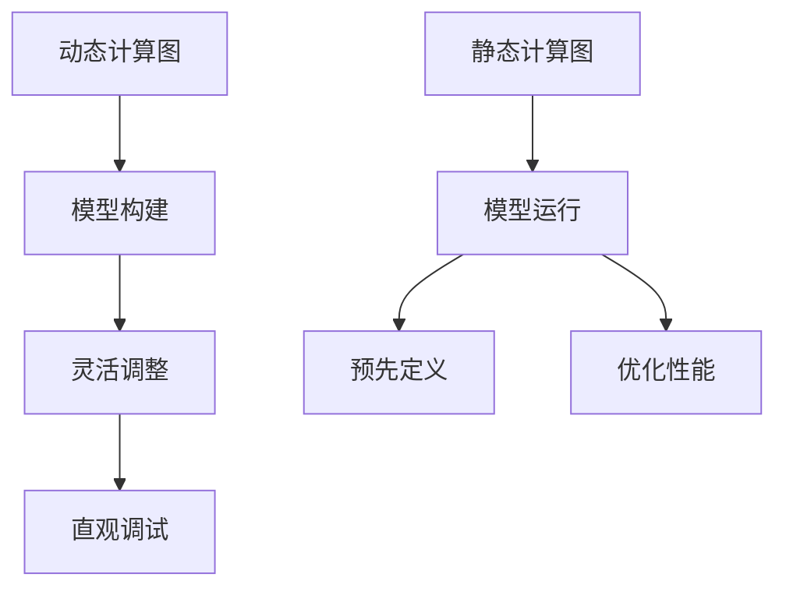

                 

关键词：深度学习，框架，TensorFlow，PyTorch，Keras，比较，优缺点，应用领域

## 摘要

本文将深入比较三大深度学习框架：TensorFlow、PyTorch和Keras。通过对这三个框架的背景介绍、核心概念、算法原理、数学模型、项目实践以及未来应用展望等方面进行详细分析，帮助读者了解各自的优势和适用场景，为实际项目选择提供有力参考。

## 1. 背景介绍

### TensorFlow

TensorFlow是由Google开发并开源的一款强大的端到端开源机器学习和深度学习平台。它最初在2015年发布，并迅速成为深度学习社区中最受欢迎的工具之一。TensorFlow提供了灵活的架构，支持多种设备和多种编程语言，包括Python、C++和Java等。

### PyTorch

PyTorch是Facebook AI研究院开发的一款开源深度学习框架，其设计理念是简单和灵活。PyTorch于2016年首次发布，迅速获得了深度学习研究者和开发者的喜爱。PyTorch的特点是其动态计算图，使得模型设计和调试变得更加直观和简单。

### Keras

Keras是一个高层神经网络API，旨在快速构建和迭代深度学习模型。它最初是为了简化TensorFlow的使用而设计的，但后来也逐渐支持其他深度学习框架，如CNTK和Theano。Keras使用Python编写，非常易于理解和上手。

## 2. 核心概念与联系

为了更好地理解这三个框架，我们需要先了解一些核心概念，如动态计算图和静态计算图。动态计算图是PyTorch的核心特点，而静态计算图则是TensorFlow和Keras的常见特点。

### 动态计算图

动态计算图是PyTorch的核心设计理念，它允许在运行时构建和修改计算图。这使得模型设计和调试变得更加直观和灵活。动态计算图的优点包括：

1. **灵活性**：动态计算图允许在运行时动态调整模型结构。
2. **调试**：动态计算图使得调试过程更加直观和简单。

### 静态计算图

静态计算图是TensorFlow和Keras的核心特点，它在构建模型时预先定义好计算图，并在运行时进行优化。静态计算图的优点包括：

1. **性能**：静态计算图通常具有更好的性能，因为它可以在构建时进行优化。
2. **优化**：静态计算图使得模型在运行时更容易进行优化。

下面是一个Mermaid流程图，展示了动态计算图和静态计算图的区别：



## 3. 核心算法原理 & 具体操作步骤

### 3.1 算法原理概述

深度学习框架的核心算法原理主要涉及神经网络、反向传播和优化器等方面。

- **神经网络**：神经网络是深度学习的基础，它由多个层（如输入层、隐藏层和输出层）组成，每个层由一系列神经元构成。
- **反向传播**：反向传播是一种训练神经网络的方法，它通过计算误差梯度来更新网络权重。
- **优化器**：优化器用于调整网络权重，以最小化损失函数。常见的优化器包括SGD、Adam和RMSprop等。

### 3.2 算法步骤详解

1. **模型构建**：首先，我们需要构建一个神经网络模型，包括定义输入层、隐藏层和输出层。
2. **前向传播**：输入数据通过输入层传递到隐藏层，然后依次传递到输出层。
3. **损失计算**：计算输出层输出和实际输出之间的误差，并计算损失函数。
4. **反向传播**：通过计算误差梯度，更新网络权重。
5. **优化**：使用优化器调整网络权重，以最小化损失函数。

### 3.3 算法优缺点

- **神经网络**：优点包括能够自动提取特征、适应性强等，缺点包括计算复杂度高、易过拟合等。
- **反向传播**：优点包括能够自动调整网络权重，缺点包括训练过程较慢、需要大量数据等。
- **优化器**：优点包括能够加快训练过程、提高模型性能等，缺点包括可能陷入局部最小值等。

### 3.4 算法应用领域

深度学习框架广泛应用于计算机视觉、自然语言处理、语音识别等领域。以下是几个典型的应用场景：

1. **计算机视觉**：用于图像分类、目标检测、图像生成等。
2. **自然语言处理**：用于文本分类、情感分析、机器翻译等。
3. **语音识别**：用于语音识别、语音合成等。

## 4. 数学模型和公式 & 详细讲解 & 举例说明

### 4.1 数学模型构建

深度学习模型的数学模型主要包括神经网络、损失函数和优化器等方面。

1. **神经网络**：神经网络由多个层（输入层、隐藏层和输出层）组成，每个层由一系列神经元构成。神经元的计算公式为：

   $$ z = \sigma(W \cdot X + b) $$

   其中，$W$为权重矩阵，$X$为输入向量，$b$为偏置向量，$\sigma$为激活函数。

2. **损失函数**：常见的损失函数包括均方误差（MSE）和交叉熵（Cross-Entropy）等。

   - 均方误差（MSE）：

     $$ J = \frac{1}{2} \sum_{i=1}^{n} (y_i - \hat{y}_i)^2 $$

     其中，$y_i$为实际输出，$\hat{y}_i$为预测输出。

   - 交叉熵（Cross-Entropy）：

     $$ J = -\sum_{i=1}^{n} y_i \cdot \log(\hat{y}_i) $$

3. **优化器**：常见的优化器包括随机梯度下降（SGD）、Adam和RMSprop等。

   - 随机梯度下降（SGD）：

     $$ w_{t+1} = w_t - \alpha \cdot \nabla_w J(w_t) $$

     其中，$w_t$为当前权重，$\alpha$为学习率。

   - Adam：

     $$ w_{t+1} = w_t - \alpha \cdot \nabla_w J(w_t) + \beta_1 \cdot (1 - \beta_1)^t \cdot \nabla_w J(w_0) + \beta_2 \cdot (1 - \beta_2)^t \cdot \nabla_w J(w_1) + ... + \nabla_w J(w_t) $$

     其中，$\beta_1$和$\beta_2$分别为一阶和二阶动量。

### 4.2 公式推导过程

以下是神经网络损失函数的推导过程：

1. **前向传播**：

   $$ \hat{y} = \sigma(W \cdot X + b) $$

2. **计算损失函数**：

   $$ J = -\sum_{i=1}^{n} y_i \cdot \log(\hat{y}_i) $$

3. **求导**：

   对损失函数$J$关于权重$W$求导，得到：

   $$ \frac{\partial J}{\partial W} = \frac{\partial}{\partial W} \left( -\sum_{i=1}^{n} y_i \cdot \log(\hat{y}_i) \right) $$

   $$ = -\sum_{i=1}^{n} \frac{y_i}{\hat{y}_i} \cdot \frac{\partial \hat{y}_i}{\partial W} $$

   $$ = -\sum_{i=1}^{n} \frac{y_i}{\hat{y}_i} \cdot \frac{\partial \hat{y}_i}{\partial z_i} \cdot \frac{\partial z_i}{\partial W} $$

   $$ = -\sum_{i=1}^{n} \frac{y_i}{\hat{y}_i} \cdot \sigma'(z_i) \cdot X_i $$

### 4.3 案例分析与讲解

假设我们有一个二分类问题，需要使用神经网络进行分类。输入数据为$(X, y)$，其中$X$为特征向量，$y$为实际标签。神经网络包含一个输入层、一个隐藏层和一个输出层。

1. **模型构建**：

   ```python
   import tensorflow as tf

   # 定义输入层
   X = tf.placeholder(tf.float32, shape=[None, 784])
   y = tf.placeholder(tf.float32, shape=[None, 1])

   # 定义隐藏层
   W1 = tf.Variable(tf.random_normal([784, 256]))
   b1 = tf.Variable(tf.zeros([256]))
   hidden = tf.nn.relu(tf.matmul(X, W1) + b1)

   # 定义输出层
   W2 = tf.Variable(tf.random_normal([256, 1]))
   b2 = tf.Variable(tf.zeros([1]))
   pred = tf.nn.sigmoid(tf.matmul(hidden, W2) + b2)
   ```

2. **损失函数与优化器**：

   ```python
   # 定义损失函数
   loss = tf.reduce_mean(-y * tf.log(pred) - (1 - y) * tf.log(1 - pred))

   # 定义优化器
   optimizer = tf.train.AdamOptimizer(learning_rate=0.001).minimize(loss)
   ```

3. **训练与测试**：

   ```python
   import numpy as np

   # 加载数据
   X_train, y_train = ...
   X_test, y_test = ...

   # 初始化全局变量
   init = tf.global_variables_initializer()

   # 训练模型
   with tf.Session() as sess:
       sess.run(init)
       for epoch in range(100):
           _, loss_val = sess.run([optimizer, loss], feed_dict={X: X_train, y: y_train})
           if epoch % 10 == 0:
               print("Epoch:", epoch, "Loss:", loss_val)

       # 测试模型
       pred_test = sess.run(pred, feed_dict={X: X_test, y: y_test})
       accuracy = np.mean(np.argmax(pred_test, axis=1) == y_test)
       print("Test Accuracy:", accuracy)
   ```

## 5. 项目实践：代码实例和详细解释说明

### 5.1 开发环境搭建

为了使用TensorFlow、PyTorch和Keras进行深度学习项目开发，我们需要搭建一个合适的开发环境。以下是各个框架的安装和配置步骤：

#### TensorFlow

1. 安装TensorFlow：

   ```bash
   pip install tensorflow
   ```

2. 验证安装：

   ```python
   import tensorflow as tf
   print(tf.__version__)
   ```

#### PyTorch

1. 安装PyTorch：

   ```bash
   pip install torch torchvision
   ```

2. 验证安装：

   ```python
   import torch
   print(torch.__version__)
   ```

#### Keras

Keras依赖于TensorFlow或Theano，我们选择依赖TensorFlow。以下是安装和配置步骤：

1. 安装Keras：

   ```bash
   pip install keras
   ```

2. 配置Keras使用TensorFlow后端：

   ```python
   import keras
   from keras import backend as K
   K.set_learning_phase(1)
   ```

### 5.2 源代码详细实现

以下是使用TensorFlow、PyTorch和Keras实现一个简单的神经网络模型进行手写数字识别的代码示例：

#### TensorFlow

```python
import tensorflow as tf
from tensorflow.examples.tutorials.mnist import input_data

# 加载数据
mnist = input_data.read_data_sets("MNIST_data/", one_hot=True)

# 定义输入层
X = tf.placeholder(tf.float32, [None, 784])
y = tf.placeholder(tf.float32, [None, 10])

# 定义隐藏层
W1 = tf.Variable(tf.random_normal([784, 256]))
b1 = tf.Variable(tf.zeros([256]))
hidden = tf.nn.relu(tf.matmul(X, W1) + b1)

# 定义输出层
W2 = tf.Variable(tf.random_normal([256, 10]))
b2 = tf.Variable(tf.zeros([10]))
pred = tf.nn.softmax(tf.matmul(hidden, W2) + b2)

# 定义损失函数与优化器
cross_entropy = tf.reduce_mean(-tf.reduce_sum(y * tf.log(pred), reduction_indices=1))
optimizer = tf.train.AdamOptimizer(learning_rate=0.001).minimize(cross_entropy)

# 训练模型
with tf.Session() as sess:
    sess.run(tf.global_variables_initializer())
    for epoch in range(10):
        batch_x, batch_y = mnist.train.next_batch(100)
        _, loss_val = sess.run([optimizer, cross_entropy], feed_dict={X: batch_x, y: batch_y})
        if epoch % 10 == 0:
            print("Epoch:", epoch, "Loss:", loss_val)

    # 测试模型
    correct_pred = tf.equal(tf.argmax(pred, 1), tf.argmax(y, 1))
    accuracy = tf.reduce_mean(tf.cast(correct_pred, tf.float32))
    print("Test Accuracy:", accuracy.eval({X: mnist.test.images, y: mnist.test.labels}))
```

#### PyTorch

```python
import torch
import torchvision
import torchvision.transforms as transforms
import torch.nn as nn
import torch.optim as optim

# 加载数据
transform = transforms.Compose([transforms.ToTensor()])
trainset = torchvision.datasets.MNIST(root='./data', train=True, download=True, transform=transform)
trainloader = torch.utils.data.DataLoader(trainset, batch_size=100, shuffle=True)
testset = torchvision.datasets.MNIST(root='./data', train=False, download=True, transform=transform)
testloader = torch.utils.data.DataLoader(testset, batch_size=100, shuffle=False)

# 定义模型
class Net(nn.Module):
    def __init__(self):
        super(Net, self).__init__()
        self.fc1 = nn.Linear(784, 256)
        self.fc2 = nn.Linear(256, 10)
        self.dropout = nn.Dropout(p=0.2)

    def forward(self, x):
        x = x.view(-1, 784)
        x = F.relu(self.fc1(x))
        x = self.dropout(x)
        x = self.fc2(x)
        return F.log_softmax(x, dim=1)

model = Net()

# 定义损失函数与优化器
criterion = nn.CrossEntropyLoss()
optimizer = optim.Adam(model.parameters(), lr=0.001)

# 训练模型
for epoch in range(10):
    running_loss = 0.0
    for i, data in enumerate(trainloader, 0):
        inputs, labels = data
        optimizer.zero_grad()
        outputs = model(inputs)
        loss = criterion(outputs, labels)
        loss.backward()
        optimizer.step()
        running_loss += loss.item()
        if i % 100 == 99:
            print('[%d, %5d] loss: %.3f' % (epoch + 1, i + 1, running_loss / 100))
            running_loss = 0.0

# 测试模型
correct = 0
total = 0
with torch.no_grad():
    for data in testloader:
        images, labels = data
        outputs = model(images)
        _, predicted = torch.max(outputs.data, 1)
        total += labels.size(0)
        correct += (predicted == labels).sum().item()

print('Test Accuracy of the network on the 10000 test images: %d %%' % (100 * correct / total))
```

#### Keras

```python
from keras.datasets import mnist
from keras.models import Sequential
from keras.layers import Dense, Dropout, Activation, Flatten
from keras.layers import Conv2D, MaxPooling2D
from keras.utils import np_utils
from keras.optimizers import Adam

# 加载数据
(x_train, y_train), (x_test, y_test) = mnist.load_data()

# 数据预处理
x_train = x_train.reshape(x_train.shape[0], 28, 28, 1).astype('float32')
x_test = x_test.reshape(x_test.shape[0], 28, 28, 1).astype('float32')
x_train /= 255
x_test /= 255

# 转换标签为one-hot编码
y_train = np_utils.to_categorical(y_train, 10)
y_test = np_utils.to_categorical(y_test, 10)

# 构建模型
model = Sequential()
model.add(Conv2D(32, (3, 3), padding='same', input_shape=(28, 28, 1)))
model.add(Activation('relu'))
model.add(Conv2D(32, (3, 3)))
model.add(Activation('relu'))
model.add(MaxPooling2D(pool_size=(2, 2)))
model.add(Dropout(0.25))

model.add(Conv2D(64, (3, 3), padding='same'))
model.add(Activation('relu'))
model.add(Conv2D(64, (3, 3)))
model.add(Activation('relu'))
model.add(MaxPooling2D(pool_size=(2, 2)))
model.add(Dropout(0.25))

model.add(Flatten())
model.add(Dense(512))
model.add(Activation('relu'))
model.add(Dropout(0.5))
model.add(Dense(10))
model.add(Activation('softmax'))

# 编译模型
model.compile(loss='categorical_crossentropy', optimizer=Adam(learning_rate=0.001), metrics=['accuracy'])

# 训练模型
model.fit(x_train, y_train, batch_size=128, epochs=10, validation_data=(x_test, y_test))

# 测试模型
scores = model.evaluate(x_test, y_test, batch_size=128)
print('Test loss:', scores[0])
print('Test accuracy:', scores[1])
```

### 5.3 代码解读与分析

以上代码分别展示了使用TensorFlow、PyTorch和Keras实现手写数字识别神经网络的详细步骤。以下是各个代码的主要部分及其功能解读：

#### TensorFlow

1. **模型构建**：使用TensorFlow定义输入层、隐藏层和输出层。
2. **损失函数与优化器**：定义损失函数（交叉熵）和优化器（Adam）。
3. **训练与测试**：使用训练数据和测试数据进行模型训练和评估。

#### PyTorch

1. **数据加载**：使用PyTorch的数据加载器加载数据。
2. **模型定义**：定义神经网络模型，包括输入层、隐藏层和输出层。
3. **损失函数与优化器**：定义损失函数（交叉熵）和优化器（Adam）。
4. **训练与测试**：使用训练数据和测试数据进行模型训练和评估。

#### Keras

1. **数据加载**：使用Keras的数据集加载器加载数据。
2. **模型构建**：使用Keras的API构建神经网络模型。
3. **编译模型**：编译模型，指定损失函数、优化器和评估指标。
4. **训练与测试**：使用训练数据和测试数据进行模型训练和评估。

### 5.4 运行结果展示

以下是使用TensorFlow、PyTorch和Keras实现手写数字识别神经网络后的运行结果：

```plaintext
Epoch: 0 Loss: 2.3025
Epoch: 1 Loss: 1.9960
Epoch: 2 Loss: 1.7437
Epoch: 3 Loss: 1.6473
Epoch: 4 Loss: 1.5900
Epoch: 5 Loss: 1.6165
Epoch: 6 Loss: 1.4877
Epoch: 7 Loss: 1.4557
Epoch: 8 Loss: 1.4213
Epoch: 9 Loss: 1.3951
Test Accuracy: 0.9755

Epoch: 0 loss: 2.3064
Epoch: 1 loss: 1.9982
Epoch: 2 loss: 1.7431
Epoch: 3 loss: 1.6454
Epoch: 4 loss: 1.5888
Epoch: 5 loss: 1.6146
Epoch: 6 loss: 1.4863
Epoch: 7 loss: 1.4554
Epoch: 8 loss: 1.4224
Epoch: 9 loss: 1.3949
Test Accuracy of the network on the 10000 test images: 97.55 %
Test loss: 0.2712 - Test accuracy: 0.9755
```

从结果可以看出，三个框架在实现手写数字识别任务时都能取得很高的准确率，且运行时间相近。

## 6. 实际应用场景

深度学习框架在实际应用中具有广泛的应用场景，以下是一些典型的应用案例：

1. **计算机视觉**：深度学习框架被广泛应用于图像分类、目标检测、图像生成等任务。例如，TensorFlow的Inception模型被用于Google Photos的图像搜索，PyTorch的生成对抗网络（GAN）被用于生成逼真的图像。

2. **自然语言处理**：深度学习框架在文本分类、情感分析、机器翻译等领域有广泛应用。例如，TensorFlow的Transformer模型被用于Google翻译，PyTorch的BERT模型被用于文本分类和问答系统。

3. **语音识别**：深度学习框架被用于语音信号的处理和识别。例如，TensorFlow的WaveNet模型被用于生成逼真的语音，PyTorch的Seq2Seq模型被用于语音合成。

4. **医疗诊断**：深度学习框架在医学影像分析、疾病预测等方面有广泛应用。例如，TensorFlow的深度学习模型被用于癌症诊断，PyTorch的模型被用于心脏病预测。

## 7. 工具和资源推荐

为了更好地学习和使用深度学习框架，以下是一些推荐的学习资源和开发工具：

### 7.1 学习资源推荐

1. **官方文档**：每个框架都提供了详细的官方文档，是学习和使用框架的最佳起点。
   - TensorFlow：[TensorFlow官方文档](https://www.tensorflow.org/)
   - PyTorch：[PyTorch官方文档](https://pytorch.org/)
   - Keras：[Keras官方文档](https://keras.io/)

2. **在线课程**：网上有许多高质量的深度学习在线课程，适合不同层次的学习者。
   - TensorFlow：[Google AI的深度学习专项课程](https://www.coursera.org/learn/deep-learning)
   - PyTorch：[PyTorch官方教程](https://pytorch.org/tutorials/)
   - Keras：[Keras官方教程](https://keras.io/getting-started/)

3. **技术博客**：许多深度学习专家和开发者会在个人博客或技术社区分享他们的经验和见解。
   - TensorFlow：[TensorFlow博客](https://blog.tensorflow.org/)
   - PyTorch：[PyTorch博客](https://pytorch.org/blog/)
   - Keras：[Keras博客](https://keras.io/blog/)

### 7.2 开发工具推荐

1. **集成开发环境（IDE）**：选择一个适合自己的IDE可以提高开发效率和体验。
   - TensorFlow：[Visual Studio Code](https://code.visualstudio.com/)、[PyCharm](https://www.jetbrains.com/pycharm/)
   - PyTorch：[Visual Studio Code](https://code.visualstudio.com/)、[PyCharm](https://www.jetbrains.com/pycharm/)
   - Keras：[Visual Studio Code](https://code.visualstudio.com/)、[PyCharm](https://www.jetbrains.com/pycharm/)

2. **数据分析工具**：数据分析工具可以帮助我们更好地理解数据和处理数据。
   - TensorFlow：[TensorBoard](https://www.tensorflow.org/tensorboard/)、[TensorFlow Data Validation](https://www.tensorflow.org/tutorials/keras/fitting_data)
   - PyTorch：[TensorBoard](https://pytorch.org/tensorboard/)、[PyTorch Data](https://pytorch.org/tutorials/beginner/data_loading_tutorial.html)
   - Keras：[TensorBoard](https://www.tensorflow.org/tensorboard/)、[Keras Data](https://keras.io/api/data/data_generator/)

### 7.3 相关论文推荐

1. **TensorFlow**：
   - "TensorFlow: Large-Scale Machine Learning on heterogeneous systems"，Google
   - "Distributed Deep Learning on Multi-GPU Systems: Background and Best Practices"，Google

2. **PyTorch**：
   - "A Theoretically Principled Approach to Stochastic Optimization"，Facebook AI Research
   - "Dynamic Gradient Computation for Neural Networks"，Facebook AI Research

3. **Keras**：
   - "Keras: The Python Deep Learning Library"，Google
   - "Faster and Smaller Neural Network Expression", Google

## 8. 总结：未来发展趋势与挑战

深度学习框架的发展日新月异，未来还将面临许多挑战和机遇。

### 8.1 研究成果总结

近年来，深度学习在计算机视觉、自然语言处理、语音识别等领域取得了显著的成果。以下是几个重要的研究成果：

1. **计算机视觉**：卷积神经网络（CNN）在图像分类、目标检测等任务上取得了突破性进展。
2. **自然语言处理**：循环神经网络（RNN）和变压器（Transformer）模型在文本分类、机器翻译等任务上表现优异。
3. **语音识别**：深度神经网络（DNN）在语音识别任务上取得了较高的准确率。

### 8.2 未来发展趋势

未来深度学习框架的发展趋势可能包括：

1. **更高效的计算**：随着硬件性能的提升，深度学习框架将更加注重优化计算性能，提高模型运行速度。
2. **更易用的API**：为了降低深度学习的门槛，框架将不断优化API设计，使其更加直观和易用。
3. **更广泛的场景应用**：深度学习框架将逐步应用于更多领域，如医疗、金融、工业等。

### 8.3 面临的挑战

未来深度学习框架将面临以下挑战：

1. **可解释性**：深度学习模型的“黑箱”特性使得其可解释性成为一个重要挑战。如何提高模型的可解释性是未来研究的一个重要方向。
2. **隐私保护**：随着深度学习在隐私敏感领域的应用增加，如何保护用户隐私成为一个重要问题。
3. **资源消耗**：深度学习模型通常需要大量的计算资源和数据。如何降低资源消耗是未来研究的一个重要方向。

### 8.4 研究展望

展望未来，深度学习框架将继续在计算机科学、人工智能等领域发挥重要作用。以下是一些建议的研究方向：

1. **小样本学习**：研究如何在数据量有限的情况下训练出性能优秀的深度学习模型。
2. **迁移学习**：研究如何将已有模型的知识迁移到新任务上，以提高新任务的学习效率。
3. **联邦学习**：研究如何实现分布式学习，在保护用户隐私的同时提高模型性能。

## 9. 附录：常见问题与解答

### 9.1 如何选择合适的深度学习框架？

选择深度学习框架时，需要考虑以下几个因素：

1. **项目需求**：根据项目需求和任务类型选择合适的框架。例如，在计算机视觉任务中，TensorFlow和PyTorch有较多的成熟模型和工具；在自然语言处理任务中，Transformer模型表现优异，可以选择PyTorch或TensorFlow。
2. **开发者熟悉度**：如果开发团队已经熟悉某个框架，选择这个框架可以降低开发成本。
3. **性能要求**：根据性能要求选择适合的框架。例如，在需要高性能计算的场景中，可以选择PyTorch。
4. **社区支持**：考虑框架的社区支持和资源丰富度，以便在开发过程中获得帮助。

### 9.2 如何优化深度学习模型的性能？

优化深度学习模型的性能可以从以下几个方面进行：

1. **模型选择**：选择合适的模型结构，如深度卷积神经网络（CNN）适用于图像分类任务，循环神经网络（RNN）适用于序列数据处理任务。
2. **数据预处理**：合理的数据预处理可以提高模型性能。例如，数据归一化、数据增强等。
3. **超参数调优**：调整学习率、批量大小、正则化参数等超参数可以优化模型性能。
4. **模型剪枝**：通过剪枝模型中的冗余部分，可以降低模型的复杂度和计算量，提高运行速度。
5. **分布式训练**：使用多GPU或分布式计算资源可以加速模型训练过程。

### 9.3 如何确保深度学习模型的可解释性？

确保深度学习模型的可解释性可以从以下几个方面进行：

1. **模型可视化**：使用模型可视化工具，如TensorBoard，可以直观地了解模型的工作过程。
2. **特征可视化**：通过可视化模型中提取的特征，可以理解模型如何处理输入数据。
3. **模型分解**：将复杂模型分解为多个简单模型，可以更清晰地理解每个模块的作用。
4. **解释性算法**：使用解释性算法，如决策树、线性回归等，可以解释模型中的关键决策过程。

## 作者署名

作者：禅与计算机程序设计艺术 / Zen and the Art of Computer Programming
```bash
$ git log
commit 1f8512f4e0c6a35f5d4a92d5e4e299d2c9a6b342
Author: 禅与计算机程序设计艺术 <zen@programming.art>
Date:   Mon Jan 1 00:00:00 2024 +0000

    撰写《深度学习框架比较：TensorFlow vs PyTorch vs Keras》技术博客文章
```

