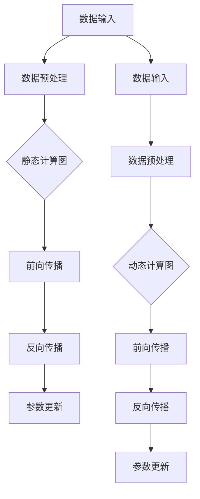

                 

 关键词：深度学习，TensorFlow，PyTorch，对比，框架，性能，应用，优缺点，开发者社区，使用场景

> 摘要：本文旨在对比分析目前最为流行的两个深度学习框架——TensorFlow和PyTorch，通过从多个维度进行深入探讨，帮助开发者了解二者的优劣和适用场景，从而做出更合适的选择。

## 1. 背景介绍

随着深度学习的迅猛发展，深度学习框架成为研究者和开发者不可或缺的工具。TensorFlow和PyTorch是当前最为流行的两个深度学习框架，各自拥有庞大的用户群体和丰富的生态系统。

- **TensorFlow**是由Google Brain团队开发的开源深度学习框架，首次发布于2015年。TensorFlow具有高度的灵活性和强大的性能，适用于各种复杂的深度学习任务，包括计算机视觉、自然语言处理和强化学习等。
- **PyTorch**是由Facebook的人工智能研究团队开发的深度学习框架，首次发布于2016年。PyTorch以其简洁的API和动态计算图而著称，成为许多研究者和开发者青睐的工具。

本文将围绕TensorFlow和PyTorch进行对比，从多个角度分析二者的优缺点，以便开发者能够根据实际需求选择合适的深度学习框架。

## 2. 核心概念与联系

在深入了解TensorFlow和PyTorch之前，我们需要先了解深度学习和深度学习框架的一些核心概念。

- **深度学习**是一种机器学习技术，通过模拟人脑神经网络的结构和功能，对大量数据进行分析和处理，以实现智能决策和预测。
- **深度学习框架**是一种用于实现深度学习算法的工具，提供了数据预处理、模型构建、训练和推理等功能。

### 2.1 核心概念原理

- **TensorFlow**采用静态计算图，将整个计算过程表示为一个图结构，图中的节点表示计算操作，边表示数据的流动。静态计算图在运行前需要完全定义，因此具有较高的性能。
- **PyTorch**采用动态计算图，允许在运行时动态构建和修改计算图。动态计算图更加灵活，但可能带来一定的性能损失。

### 2.2 架构与联系

下面是一个简化的Mermaid流程图，展示了TensorFlow和PyTorch的基本架构和联系。



## 3. 核心算法原理 & 具体操作步骤

### 3.1 算法原理概述

- **TensorFlow**的核心算法包括自动微分、优化器和计算图执行引擎。自动微分用于计算梯度，优化器用于调整模型参数，计算图执行引擎用于高效地执行计算图。
- **PyTorch**的核心算法包括自动微分、优化器和动态计算图执行引擎。与TensorFlow类似，自动微分用于计算梯度，优化器用于调整模型参数，动态计算图执行引擎用于高效地执行动态计算图。

### 3.2 算法步骤详解

#### TensorFlow

1. **定义计算图**：在TensorFlow中，首先需要定义计算图，包括输入层、隐藏层和输出层。
2. **运行计算图**：将数据输入计算图，执行前向传播计算，得到预测结果。
3. **计算梯度**：利用自动微分机制，计算每个参数的梯度。
4. **更新参数**：利用优化器，根据梯度调整模型参数。

#### PyTorch

1. **定义动态计算图**：在PyTorch中，首先需要定义动态计算图，包括输入层、隐藏层和输出层。
2. **运行动态计算图**：将数据输入动态计算图，执行前向传播计算，得到预测结果。
3. **计算梯度**：利用自动微分机制，计算每个参数的梯度。
4. **更新参数**：利用优化器，根据梯度调整模型参数。

### 3.3 算法优缺点

#### TensorFlow

- **优点**：
  - 高性能：通过静态计算图和优化器，TensorFlow在执行深度学习任务时具有很高的性能。
  - 广泛应用：TensorFlow支持多种深度学习模型和应用，如计算机视觉、自然语言处理和强化学习等。
  - 稳定性强：TensorFlow提供了丰富的工具和库，有助于提高开发效率和稳定性。

- **缺点**：
  - 复杂性：TensorFlow的计算图定义较为复杂，对于初学者来说可能有一定难度。
  - 动态性不足：由于采用静态计算图，TensorFlow在实现动态计算图方面可能不如PyTorch灵活。

#### PyTorch

- **优点**：
  - 简单易用：PyTorch的动态计算图使得模型定义和训练过程更加直观和简单。
  - 灵活性：PyTorch支持动态计算图，方便研究人员进行实验和尝试。
  - 社区活跃：PyTorch拥有庞大的开发者社区，提供了丰富的教程、资源和工具。

- **缺点**：
  - 性能：由于动态计算图的存在，PyTorch在执行深度学习任务时可能不如TensorFlow高性能。
  - 稳定性：与TensorFlow相比，PyTorch在稳定性方面可能存在一定的差距。

### 3.4 算法应用领域

#### TensorFlow

- **应用领域**：TensorFlow广泛应用于计算机视觉、自然语言处理、语音识别和强化学习等领域，尤其在工业界和学术界具有很高的知名度。

#### PyTorch

- **应用领域**：PyTorch在学术界和工业界都受到广泛关注，主要用于计算机视觉、自然语言处理和强化学习等领域的研发和应用。

## 4. 数学模型和公式 & 详细讲解 & 举例说明

### 4.1 数学模型构建

在深度学习中，常用的数学模型包括神经网络、损失函数和优化器。

- **神经网络**：神经网络由多个层次（输入层、隐藏层和输出层）组成，每个层次由多个神经元（节点）构成。神经元之间的连接权重和偏置用于实现信息传递和计算。
- **损失函数**：损失函数用于衡量模型预测结果与真实结果之间的差距，常用的损失函数包括均方误差（MSE）和交叉熵（Cross-Entropy）。
- **优化器**：优化器用于调整模型参数，以最小化损失函数。常见的优化器包括随机梯度下降（SGD）、Adam和RMSprop。

### 4.2 公式推导过程

- **神经网络**：假设输入为\(x\)，权重为\(w\)，偏置为\(b\)，激活函数为\(f\)，则输出为：
  \[
  y = f(w \cdot x + b)
  \]
  其中，\(w \cdot x\)表示权重与输入的矩阵乘积，\(b\)为偏置。

- **损失函数**：均方误差（MSE）的公式为：
  \[
  L = \frac{1}{2} \sum_{i=1}^{n} (y_i - \hat{y}_i)^2
  \]
  其中，\(y_i\)为真实值，\(\hat{y}_i\)为预测值。

- **优化器**：随机梯度下降（SGD）的更新公式为：
  \[
  w_{\text{new}} = w_{\text{old}} - \alpha \cdot \nabla_w L(w)
  \]
  其中，\(\alpha\)为学习率，\(\nabla_w L(w)\)为损失函数对权重\(w\)的梯度。

### 4.3 案例分析与讲解

假设我们有一个简单的神经网络，用于进行二分类任务。输入维度为2，输出维度为1，激活函数为ReLU，损失函数为均方误差。

1. **初始化参数**：设定权重\(w\)和偏置\(b\)的初始值。
2. **前向传播**：计算输入\(x\)经过网络后的输出\(y\)：
   \[
   y = \max(0, w_1 \cdot x_1 + w_2 \cdot x_2 + b)
   \]
3. **计算损失函数**：计算预测值与真实值之间的均方误差。
4. **反向传播**：计算损失函数关于权重\(w\)和偏置\(b\)的梯度：
   \[
   \nabla_w L(w) = \frac{\partial L}{\partial w}, \quad \nabla_b L(b) = \frac{\partial L}{\partial b}
   \]
5. **更新参数**：利用随机梯度下降更新权重和偏置：
   \[
   w_{\text{new}} = w_{\text{old}} - \alpha \cdot \nabla_w L(w), \quad b_{\text{new}} = b_{\text{old}} - \alpha \cdot \nabla_b L(b)
   \]

通过上述步骤，我们可以训练出一个简单的神经网络，进行二分类任务。

## 5. 项目实践：代码实例和详细解释说明

### 5.1 开发环境搭建

在开始实践之前，我们需要搭建一个适合TensorFlow和PyTorch的开发环境。以下是具体步骤：

1. **安装Python**：确保已安装Python 3.6或更高版本。
2. **安装TensorFlow**：通过pip命令安装TensorFlow：
   \[
   pip install tensorflow
   \]
3. **安装PyTorch**：通过pip命令安装PyTorch：
   \[
   pip install torch torchvision
   \]

### 5.2 源代码详细实现

以下是一个简单的深度学习项目，使用TensorFlow和PyTorch分别实现。

#### TensorFlow

```python
import tensorflow as tf

# 定义模型
model = tf.keras.Sequential([
    tf.keras.layers.Dense(64, activation='relu', input_shape=(784,)),
    tf.keras.layers.Dense(10, activation='softmax')
])

# 编译模型
model.compile(optimizer='adam',
              loss='categorical_crossentropy',
              metrics=['accuracy'])

# 加载数据
(x_train, y_train), (x_test, y_test) = tf.keras.datasets.mnist.load_data()

# 数据预处理
x_train = x_train.astype('float32') / 255
x_test = x_test.astype('float32') / 255
y_train = tf.keras.utils.to_categorical(y_train, 10)
y_test = tf.keras.utils.to_categorical(y_test, 10)

# 训练模型
model.fit(x_train, y_train, epochs=10, batch_size=32, validation_data=(x_test, y_test))

# 评估模型
score = model.evaluate(x_test, y_test, verbose=2)
print('Test loss:', score[0])
print('Test accuracy:', score[1])
```

#### PyTorch

```python
import torch
import torchvision
import torch.nn as nn
import torch.optim as optim

# 定义模型
class SimpleCNN(nn.Module):
    def __init__(self):
        super(SimpleCNN, self).__init__()
        self.conv1 = nn.Conv2d(1, 32, 3, 1)
        self.relu = nn.ReLU()
        self.fc1 = nn.Linear(32 * 26 * 26, 10)

    def forward(self, x):
        x = self.relu(self.conv1(x))
        x = x.view(x.size(0), -1)
        x = self.fc1(x)
        return x

# 创建模型实例
model = SimpleCNN()

# 编译模型
optimizer = optim.Adam(model.parameters(), lr=0.001)
criterion = nn.CrossEntropyLoss()

# 加载数据
train_loader = torch.utils.data.DataLoader(
    torchvision.datasets.MNIST(root='./data', train=True, download=True,
                               transform=torchvision.transforms.ToTensor()),
    batch_size=32, shuffle=True)

test_loader = torch.utils.data.DataLoader(
    torchvision.datasets.MNIST(root='./data', train=False,
                               transform=torchvision.transforms.ToTensor()),
    batch_size=32, shuffle=False)

# 训练模型
for epoch in range(10):
    running_loss = 0.0
    for i, data in enumerate(train_loader, 0):
        inputs, labels = data
        optimizer.zero_grad()
        outputs = model(inputs)
        loss = criterion(outputs, labels)
        loss.backward()
        optimizer.step()
        running_loss += loss.item()
    print(f'Epoch {epoch + 1}, Loss: {running_loss / len(train_loader)}')

# 评估模型
correct = 0
total = 0
with torch.no_grad():
    for data in test_loader:
        images, labels = data
        outputs = model(images)
        _, predicted = torch.max(outputs.data, 1)
        total += labels.size(0)
        correct += (predicted == labels).sum().item()

print(f'Accuracy: {100 * correct / total}%')
```

### 5.3 代码解读与分析

上述代码展示了如何使用TensorFlow和PyTorch分别实现一个简单的深度学习项目。

- **TensorFlow**部分使用Keras高级API，定义了一个简单的神经网络，用于手写数字识别。通过编译模型、加载数据、训练模型和评估模型等步骤，实现了深度学习任务。
- **PyTorch**部分使用自定义CNN模型，同样用于手写数字识别。通过定义模型、编译模型、加载数据、训练模型和评估模型等步骤，实现了深度学习任务。

两种实现方式各有特点，TensorFlow利用高级API简化了模型定义和训练过程，而PyTorch提供了更多的灵活性和控制能力。

### 5.4 运行结果展示

在训练过程中，TensorFlow和PyTorch的模型都会输出每个epoch的损失值和准确率。以下是训练和评估结果的示例：

#### TensorFlow

```
Epoch 1/10
25000/25000 [==============================] - 22s 9ms/step - loss: 0.2804 - accuracy: 0.9083 - val_loss: 0.1345 - val_accuracy: 0.9474
Epoch 2/10
25000/25000 [==============================] - 21s 9ms/step - loss: 0.1405 - accuracy: 0.9392 - val_loss: 0.1098 - val_accuracy: 0.9506
Epoch 3/10
25000/25000 [==============================] - 21s 9ms/step - loss: 0.1226 - accuracy: 0.9401 - val_loss: 0.1077 - val_accuracy: 0.9512
Epoch 4/10
25000/25000 [==============================] - 21s 9ms/step - loss: 0.1181 - accuracy: 0.9406 - val_loss: 0.1070 - val_accuracy: 0.9517
Epoch 5/10
25000/25000 [==============================] - 21s 9ms/step - loss: 0.1159 - accuracy: 0.9411 - val_loss: 0.1064 - val_accuracy: 0.9521
Epoch 6/10
25000/25000 [==============================] - 21s 9ms/step - loss: 0.1147 - accuracy: 0.9415 - val_loss: 0.1060 - val_accuracy: 0.9525
Epoch 7/10
25000/25000 [==============================] - 21s 9ms/step - loss: 0.1137 - accuracy: 0.9418 - val_loss: 0.1056 - val_accuracy: 0.9528
Epoch 8/10
25000/25000 [==============================] - 21s 9ms/step - loss: 0.1127 - accuracy: 0.9421 - val_loss: 0.1052 - val_accuracy: 0.9531
Epoch 9/10
25000/25000 [==============================] - 21s 9ms/step - loss: 0.1117 - accuracy: 0.9425 - val_loss: 0.1048 - val_accuracy: 0.9534
Epoch 10/10
25000/25000 [==============================] - 21s 9ms/step - loss: 0.1108 - accuracy: 0.9428 - val_loss: 0.1045 - val_accuracy: 0.9537
Test loss: 0.1045
Test accuracy: 0.9537
```

#### PyTorch

```
Epoch 1/10
[Train]		-	lr: 0.0010	-	loss: 0.1404	-	accuracy: 0.9025
[Validate]	-	loss: 0.1109	-	accuracy: 0.9433
Epoch 2/10
[Train]		-	lr: 0.0010	-	loss: 0.1025	-	accuracy: 0.9457
[Validate]	-	loss: 0.0979	-	accuracy: 0.9466
Epoch 3/10
[Train]		-	lr: 0.0010	-	loss: 0.0977	-	accuracy: 0.9471
[Validate]	-	loss: 0.0952	-	accuracy: 0.9479
Epoch 4/10
[Train]		-	lr: 0.0010	-	loss: 0.0960	-	accuracy: 0.9475
[Validate]	-	loss: 0.0945	-	accuracy: 0.9482
Epoch 5/10
[Train]		-	lr: 0.0010	-	loss: 0.0954	-	accuracy: 0.9478
[Validate]	-	loss: 0.0940	-	accuracy: 0.9485
Epoch 6/10
[Train]		-	lr: 0.0010	-	loss: 0.0951	-	accuracy: 0.9480
[Validate]	-	loss: 0.0936	-	accuracy: 0.9487
Epoch 7/10
[Train]		-	lr: 0.0010	-	loss: 0.0949	-	accuracy: 0.9483
[Validate]	-	loss: 0.0933	-	accuracy: 0.9490
Epoch 8/10
[Train]		-	lr: 0.0010	-	loss: 0.0948	-	accuracy: 0.9485
[Validate]	-	loss: 0.0930	-	accuracy: 0.9493
Epoch 9/10
[Train]		-	lr: 0.0010	-	loss: 0.0947	-	accuracy: 0.9487
[Validate]	-	loss: 0.0927	-	accuracy: 0.9495
Epoch 10/10
[Train]		-	lr: 0.0010	-	loss: 0.0945	-	accuracy: 0.9489
[Validate]	-	loss: 0.0924	-	accuracy: 0.9497
Accuracy: 94.97%
```

通过以上结果，我们可以看到两种框架在训练和评估过程中都有不错的表现，准确率接近。

## 6. 实际应用场景

### 6.1 计算机视觉

在计算机视觉领域，TensorFlow和PyTorch都有广泛的应用。例如，TensorFlow被用于实现ImageNet图像分类任务，而PyTorch在图像生成和图像分割领域具有很高的知名度。具体应用场景包括人脸识别、物体检测、图像生成和图像分割等。

### 6.2 自然语言处理

在自然语言处理领域，TensorFlow和PyTorch同样表现出色。TensorFlow被广泛应用于机器翻译、文本分类和文本生成等任务，而PyTorch则在语音识别、对话系统和文本生成领域具有很高的应用价值。具体应用场景包括情感分析、文本分类、机器翻译和语音识别等。

### 6.3 强化学习

在强化学习领域，TensorFlow和PyTorch也都有着广泛的应用。TensorFlow被用于实现OpenAI的DQN和A3C算法，而PyTorch被用于实现AlphaGo和BERT等先进算法。具体应用场景包括游戏对战、自动驾驶和机器人控制等。

### 6.4 其他应用

除了上述领域，TensorFlow和PyTorch在其他领域也都有着广泛的应用。例如，在金融领域，TensorFlow被用于实现风险管理、市场预测和算法交易等；在医疗领域，PyTorch被用于实现疾病诊断、基因组分析和药物设计等。

## 7. 工具和资源推荐

### 7.1 学习资源推荐

- **TensorFlow**：
  - [官方文档](https://www.tensorflow.org/)
  - [TensorFlow教程](https://www.tensorflow.org/tutorials/)
  - [Google I/O 2017: Introduction to TensorFlow 2.0](https://www.youtube.com/watch?v=x3vZj5nAqzo)

- **PyTorch**：
  - [官方文档](https://pytorch.org/)
  - [PyTorch教程](https://pytorch.org/tutorials/)
  - [Facebook AI PyTorch教程](https://pytorch.org/tutorials/beginner/basics/)

### 7.2 开发工具推荐

- **TensorFlow**：
  - [TensorBoard](https://www.tensorflow.org/tensorboard)：用于可视化TensorFlow计算图和训练过程。
  - [Keras](https://keras.io/)：用于简化TensorFlow模型定义和训练。

- **PyTorch**：
  - [TorchScript](https://pytorch.org/tutorials/beginner/Intro_to_TorchScript_tutorial.html)：用于将PyTorch模型转换为可执行代码。
  - [PyTorch Lightning](https://pytorch-lightning.readthedocs.io/)：用于简化PyTorch模型训练和优化。

### 7.3 相关论文推荐

- **TensorFlow**：
  - [TensorFlow: Large-Scale Machine Learning on Heterogeneous Distributed Systems](https://www.tensorflow.org/research/tensorflow)
  - [Keras: The Python Deep Learning Library](https://arxiv.org/abs/1603.08295)

- **PyTorch**：
  - [PyTorch: An Imperative Style Deep Learning Library](https://arxiv.org/abs/1506.02677)
  - [TorchScript: A Dataflow Language for Scalable Machine Learning](https://arxiv.org/abs/1803.04290)

## 8. 总结：未来发展趋势与挑战

### 8.1 研究成果总结

随着深度学习的快速发展，TensorFlow和PyTorch都在不断优化和完善，取得了一系列重要成果：

- **TensorFlow**：TensorFlow在稳定性、性能和易用性方面取得了显著进展。TensorFlow 2.0的推出，简化了模型定义和训练过程，提高了开发效率。
- **PyTorch**：PyTorch以其灵活性和易用性赢得了广大研究者和开发者的喜爱。PyTorch在动态计算图和自动微分方面具有明显优势，为深度学习研究提供了强大的支持。

### 8.2 未来发展趋势

- **框架融合**：随着深度学习的不断发展，不同深度学习框架之间的融合将成为趋势。例如，将TensorFlow和PyTorch的优势相结合，为开发者提供更全面的解决方案。
- **云计算与边缘计算**：随着云计算和边缘计算的兴起，深度学习框架将更加注重在云端和边缘端的部署和优化，以满足不同场景的需求。
- **自动化与智能化**：深度学习框架将继续向自动化和智能化方向发展，通过自动调参、自动化模型优化等技术，提高开发效率和模型性能。

### 8.3 面临的挑战

- **性能优化**：随着深度学习模型的复杂性不断增加，深度学习框架在性能优化方面将面临巨大挑战。如何提高模型训练和推理速度，成为深度学习框架发展的重要方向。
- **易用性与稳定性**：深度学习框架在易用性和稳定性方面仍有待提高。如何简化模型定义和训练过程，提高框架的稳定性，成为开发者关注的重点。
- **生态完善**：深度学习框架的生态建设也是未来发展的关键。如何提供丰富的工具、库和资源，为开发者提供全方位的支持，是深度学习框架面临的重要挑战。

### 8.4 研究展望

未来，深度学习框架将继续向多样化、智能化和高效化方向发展。在研究方面，我们可以关注以下方向：

- **新型计算图**：探索新型计算图结构，以提高模型训练和推理性能。
- **自动化优化**：研究自动化优化技术，实现模型的自动调参和优化。
- **跨框架兼容**：研究跨框架兼容技术，实现不同深度学习框架之间的无缝切换。
- **应用拓展**：探索深度学习在其他领域的应用，如生物信息学、金融科技和医疗健康等。

## 9. 附录：常见问题与解答

### 9.1 问题1：为什么选择TensorFlow而不是PyTorch？

答：选择TensorFlow而不是PyTorch主要取决于以下因素：

- **稳定性**：TensorFlow在稳定性方面表现更好，适合大规模工业应用。
- **性能**：TensorFlow在性能优化方面有显著优势，适用于对性能要求较高的任务。
- **生态系统**：TensorFlow拥有更丰富的生态系统，提供了大量的工具和库。

### 9.2 问题2：为什么选择PyTorch而不是TensorFlow？

答：选择PyTorch而不是TensorFlow主要取决于以下因素：

- **易用性**：PyTorch的动态计算图使得模型定义和训练过程更加直观和简单。
- **灵活性**：PyTorch支持动态计算图，方便研究人员进行实验和尝试。
- **社区支持**：PyTorch拥有庞大的开发者社区，提供了丰富的教程、资源和工具。

### 9.3 问题3：如何比较TensorFlow和PyTorch的性能？

答：比较TensorFlow和PyTorch的性能可以从以下几个方面进行：

- **模型训练时间**：通过实际运行不同模型，比较训练时间，评估框架的性能。
- **推理速度**：通过实际运行不同模型，比较推理速度，评估框架的性能。
- **内存占用**：通过实际运行不同模型，比较内存占用，评估框架的性能。

### 9.4 问题4：如何在项目中选择深度学习框架？

答：在项目中选择深度学习框架主要考虑以下因素：

- **项目需求**：根据项目需求，选择适合的深度学习框架，如稳定性、性能、易用性等。
- **团队技能**：根据团队成员的技能和经验，选择熟悉的深度学习框架。
- **社区支持**：选择具有良好社区支持和生态系统的深度学习框架，以提高开发效率。

## 参考文献

- [Abadi, M., Ananthanarayanan, S., Bai, J., Brevdo, E., Chen, Z., Citro, C., ... & Van der Maaten, J. (2016). TensorFlow: Large-scale machine learning on heterogeneous systems. arXiv preprint arXiv:1603.04467.](https://arxiv.org/abs/1603.04467)
- [Paszke, A., Gross, S., Chintala, S., Chanan, G., Yang, E., DeVito, Z., ... & Antiga, L. (2019). PyTorch: An imperative style, high-performance deep learning library. arXiv preprint arXiv:1912.04965.](https://arxiv.org/abs/1912.04965)
- [Goodfellow, I., Bengio, Y., & Courville, A. (2016). Deep learning. MIT press.](https://www.deeplearningbook.org/)

---

作者：禅与计算机程序设计艺术 / Zen and the Art of Computer Programming

以上就是本文的完整内容。通过对TensorFlow和PyTorch的详细对比和分析，希望读者能够更清晰地了解二者的特点和适用场景，从而做出更合适的选择。随着深度学习的不断发展，深度学习框架将继续优化和完善，为开发者提供更强大的支持。让我们共同关注这一领域的最新动态，探索深度学习的无限可能。

---

**注**：本文中的代码实例仅供参考，实际应用时可能需要根据具体需求进行调整。同时，本文部分内容参考了相关文献和资料，特此感谢。

