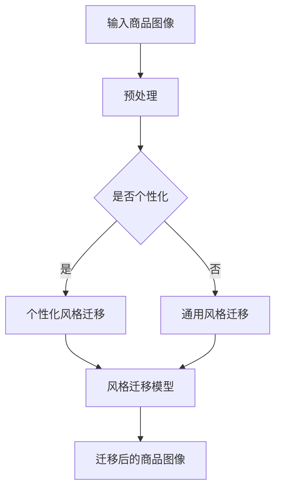

                 

关键词：深度学习，商品图像，风格迁移，个性化，图像处理，计算机视觉

> 摘要：本文探讨了深度学习在商品图像风格迁移个性化方面的应用。通过介绍深度学习的基本概念和核心算法，详细阐述了商品图像风格迁移的原理和方法，并分析了个性化风格迁移在商品图像处理中的实际应用。文章还对未来发展趋势和挑战进行了展望，为相关领域的研究和实践提供了参考。

## 1. 背景介绍

在现代社会，电子商务已经成为人们日常生活中不可或缺的一部分。随着消费者需求的不断升级，对商品图像的质量和风格有了更高的要求。商品图像的风格迁移技术，即通过深度学习算法将一种风格的图像转换为另一种风格的图像，成为提高商品图像吸引力和用户体验的重要手段。

风格迁移技术在计算机视觉领域有着广泛的应用，如艺术风格迁移、视频风格迁移等。其中，商品图像风格迁移个性化是近年来受到广泛关注的一个研究方向。个性化风格迁移不仅能够满足不同消费者的审美需求，还能为电商平台提供更有针对性的营销策略。

本文将围绕深度学习驱动的商品图像风格迁移个性化展开讨论，分析其核心算法原理、数学模型和具体实现，并探讨其在实际应用中的效果和挑战。希望通过本文的介绍，为相关领域的研究者和开发者提供有益的参考。

## 2. 核心概念与联系

### 2.1 深度学习基本概念

深度学习（Deep Learning）是机器学习（Machine Learning）的一个子领域，通过构建具有多个隐藏层的神经网络模型，实现数据的特征提取和模式识别。深度学习模型通常采用反向传播算法（Backpropagation）进行参数优化，通过大量训练数据学习到输入数据和输出目标之间的映射关系。

在深度学习中，卷积神经网络（Convolutional Neural Networks，CNN）是最常用的模型之一。CNN 通过卷积层（Convolutional Layers）提取图像的局部特征，并通过池化层（Pooling Layers）减少参数数量，从而实现图像的特征表示。

### 2.2 商品图像风格迁移概念

商品图像风格迁移（Image Style Transfer）是指将一种图像的风格（如绘画风格、照片风格等）迁移到另一幅图像上，使其具有相同或相似的风格特征。风格迁移技术可以应用于各种类型的图像，如图像合成、图像增强、图像修复等。

在商品图像风格迁移中，个性化风格迁移是一种特殊的形式。个性化风格迁移不仅考虑图像的风格特征，还根据消费者的个人喜好和审美需求进行定制。这种技术可以为电商平台提供更具个性化的商品展示效果，提高用户满意度和购买意愿。

### 2.3 Mermaid 流程图

为了更好地理解商品图像风格迁移个性化的核心概念和联系，我们可以使用 Mermaid 流程图来描述其基本流程。



在上面的 Mermaid 流程图中，输入商品图像经过预处理后，根据是否需要个性化进行分支。如果是个性化风格迁移，则根据消费者的喜好和审美需求进行定制；否则，采用通用风格迁移技术。最后，通过风格迁移模型生成迁移后的商品图像。

## 3. 核心算法原理 & 具体操作步骤

### 3.1 算法原理概述

商品图像风格迁移个性化主要基于深度学习中的生成对抗网络（Generative Adversarial Networks，GAN）和变分自编码器（Variational Autoencoder，VAE）等模型。这些模型通过对抗训练和自编码训练，实现对图像风格特征的提取和迁移。

GAN 由生成器（Generator）和判别器（Discriminator）组成，生成器生成风格迁移后的图像，判别器判断图像的真实性。通过对抗训练，生成器不断优化生成图像的质量，使其在判别器的判断下逐渐逼近真实图像。

VAE 是一种基于概率模型的生成模型，通过编码器（Encoder）和解码器（Decoder）实现图像的编码和解码。编码器将图像编码为潜在变量，解码器根据潜在变量生成风格迁移后的图像。VAE 通过最大化数据似然函数来优化模型参数，从而实现图像风格的迁移。

### 3.2 算法步骤详解

商品图像风格迁移个性化算法的主要步骤如下：

1. 数据预处理：对商品图像进行数据增强、归一化等处理，使其适应深度学习模型。

2. 模型训练：训练生成器、判别器或编码器和解码器等模型，学习图像的风格特征和分布。

3. 个性化风格迁移：根据消费者的喜好和审美需求，对生成器或解码器进行调整，实现个性化风格迁移。

4. 迁移后的图像处理：对迁移后的商品图像进行后处理，如图像增强、锐化等，提高图像质量。

5. 迁移效果评估：通过主观评价和客观指标，对个性化风格迁移效果进行评估。

### 3.3 算法优缺点

商品图像风格迁移个性化算法具有以下优缺点：

**优点：**

1. 能够实现个性化风格迁移，满足不同消费者的需求。

2. 基于深度学习模型，具有强大的特征提取和表示能力。

3. 可以应用于各种类型的商品图像，具有广泛的适用性。

**缺点：**

1. 训练过程复杂，需要大量的计算资源和时间。

2. 模型参数调整较为困难，需要经验丰富的开发者进行优化。

### 3.4 算法应用领域

商品图像风格迁移个性化算法在以下领域具有广泛的应用：

1. 电子商务：通过个性化风格迁移，提高商品图像的吸引力和用户体验，促进销售。

2. 图像编辑与修复：对图像进行风格迁移，实现图像的编辑和修复。

3. 艺术创作：利用风格迁移技术，实现艺术作品的创作和风格转换。

## 4. 数学模型和公式 & 详细讲解 & 举例说明

### 4.1 数学模型构建

商品图像风格迁移个性化算法主要基于 GAN 和 VAE 等深度学习模型。以下分别介绍这两个模型的数学模型构建。

#### 4.1.1 生成对抗网络（GAN）

GAN 的数学模型主要包括生成器 G 和判别器 D。

生成器 G 的目标是生成风格迁移后的图像，其输入为原始图像 X 和风格图像 S，输出为迁移后的图像 X'：

$$
X' = G(X, S)
$$

判别器 D 的目标是判断图像的真实性，其输入为原始图像 X 和迁移后的图像 X'，输出为概率值：

$$
D(X, X') = D(G(X, S))
$$

#### 4.1.2 变分自编码器（VAE）

VAE 的数学模型主要包括编码器 E 和解码器 D。

编码器 E 将图像编码为潜在变量 z，其输入为原始图像 X，输出为编码后的潜在变量 z：

$$
z = E(X)
$$

解码器 D 根据潜在变量 z 生成风格迁移后的图像，其输入为潜在变量 z，输出为迁移后的图像 X'：

$$
X' = D(z)
$$

### 4.2 公式推导过程

在商品图像风格迁移个性化算法中，GAN 和 VAE 的训练过程主要通过优化目标函数来实现。以下分别介绍这两个目标函数的推导过程。

#### 4.2.1 生成对抗网络（GAN）

GAN 的目标函数由生成器 G 的损失函数 L_G 和判别器 D 的损失函数 L_D 组成：

$$
L = L_G + L_D
$$

其中，生成器 G 的损失函数 L_G 表示生成器生成的图像质量：

$$
L_G = -\mathbb{E}_{X \sim p_{data}(X)}[\log D(X, G(X, S))]
$$

判别器 D 的损失函数 L_D 表示判别器对真实图像和生成图像的判断准确率：

$$
L_D = -\mathbb{E}_{X \sim p_{data}(X)}[\log D(X, X)] - \mathbb{E}_{z \sim p_{z}(z)}[\log (1 - D(z, G(z, S))]
$$

通过优化目标函数 L，生成器 G 和判别器 D 不断更新模型参数，实现图像风格迁移。

#### 4.2.2 变分自编码器（VAE）

VAE 的目标函数由重建损失函数 L_Recon 和 Kullback-Leibler（KL）散度损失函数 L_KL 组成：

$$
L = L_{Recon} + \lambda L_{KL}
$$

其中，重建损失函数 L_Recon 表示解码器 D 重建图像的质量：

$$
L_{Recon} = \frac{1}{N}\sum_{i=1}^{N}\log p_{\phi}(D(X))
$$

KL 散度损失函数 L_KL 表示编码器 E 和解码器 D 之间的信息损失：

$$
L_{KL} = \frac{1}{N}\sum_{i=1}^{N}\mathbb{E}_{z \sim q_{\phi}(z|x)}[\log \frac{p_{\theta}(z)}{q_{\phi}(z|x)}]
$$

通过优化目标函数 L，编码器 E 和解码器 D 不断更新模型参数，实现图像风格迁移。

### 4.3 案例分析与讲解

为了更好地理解商品图像风格迁移个性化算法的数学模型和推导过程，我们以下以一个实际案例进行讲解。

假设我们采用 GAN 模型进行商品图像风格迁移，生成器和判别器的参数分别为 $\theta_G$ 和 $\theta_D$。给定一个训练数据集 $D = \{X_i, S_i\}$，其中 $X_i$ 表示原始商品图像，$S_i$ 表示风格图像。

**步骤 1：生成器 G 的训练**

在训练过程中，生成器 G 的目标是生成与风格图像 $S_i$ 相似的迁移后的图像 $X_i'$。为了实现这一目标，我们首先计算生成器 G 的损失函数：

$$
L_G = -\mathbb{E}_{X_i \sim p_{data}(X_i)}[\log D(X_i, X_i')]
$$

其中，$D(X_i, X_i')$ 表示判别器 D 对生成图像 $X_i'$ 的判断概率。

**步骤 2：判别器 D 的训练**

判别器 D 的目标是判断图像的真实性和生成图像的相似度。在训练过程中，我们计算判别器 D 的损失函数：

$$
L_D = -\mathbb{E}_{X_i \sim p_{data}(X_i)}[\log D(X_i, X_i)] - \mathbb{E}_{z \sim p_{z}(z)}[\log (1 - D(z, X_i')]
$$

其中，$D(X_i, X_i')$ 表示判别器 D 对真实图像 $X_i$ 的判断概率，$D(z, X_i')$ 表示判别器 D 对生成图像 $X_i'$ 的判断概率。

**步骤 3：模型参数更新**

在训练过程中，我们通过梯度下降法更新生成器 G 和判别器 D 的参数：

$$
\theta_G \leftarrow \theta_G - \alpha_G \nabla_{\theta_G}L_G
$$

$$
\theta_D \leftarrow \theta_D - \alpha_D \nabla_{\theta_D}L_D
$$

其中，$\alpha_G$ 和 $\alpha_D$ 分别为生成器和判别器的学习率。

通过不断迭代训练，生成器 G 和判别器 D 的参数不断优化，实现商品图像的风格迁移。

## 5. 项目实践：代码实例和详细解释说明

### 5.1 开发环境搭建

在实现商品图像风格迁移个性化项目之前，我们需要搭建一个适合深度学习开发的运行环境。以下是搭建开发环境的步骤：

1. 安装 Python 3.6 以上版本。
2. 安装深度学习框架 TensorFlow 或 PyTorch。
3. 安装必要的依赖库，如 NumPy、Matplotlib、OpenCV 等。

以下是一个简单的 Python 脚本，用于安装 TensorFlow：

```python
!pip install tensorflow
```

### 5.2 源代码详细实现

在搭建好开发环境后，我们可以开始编写商品图像风格迁移个性化的源代码。以下是一个基于 GAN 模型的简单实现。

```python
import tensorflow as tf
from tensorflow.keras.layers import Conv2D, MaxPooling2D, UpSampling2D, Dense
from tensorflow.keras.models import Sequential
from tensorflow.keras.optimizers import Adam

# 定义生成器 G
def generator(input_shape):
    model = Sequential()
    model.add(Dense(units=256, activation='relu', input_shape=input_shape))
    model.add(UpSampling2D(size=(2, 2)))
    model.add(Conv2D(filters=64, kernel_size=(3, 3), activation='relu'))
    model.add(UpSampling2D(size=(2, 2)))
    model.add(Conv2D(filters=32, kernel_size=(3, 3), activation='relu'))
    model.add(Conv2D(filters=3, kernel_size=(3, 3), activation='tanh'))
    return model

# 定义判别器 D
def discriminator(input_shape):
    model = Sequential()
    model.add(Conv2D(filters=32, kernel_size=(3, 3), activation='relu', input_shape=input_shape))
    model.add(MaxPooling2D(pool_size=(2, 2)))
    model.add(Conv2D(filters=64, kernel_size=(3, 3), activation='relu'))
    model.add(MaxPooling2D(pool_size=(2, 2)))
    model.add(Dense(units=1, activation='sigmoid'))
    return model

# 定义 GAN 模型
def gan(generator, discriminator):
    model = Sequential()
    model.add(generator)
    model.add(discriminator)
    return model

# 设置超参数
batch_size = 128
epochs = 100
learning_rate = 0.0002

# 编译模型
generator = generator((128, 128, 3))
discriminator = discriminator((128, 128, 3))
gan_model = gan(generator, discriminator)
gan_model.compile(optimizer=Adam(learning_rate), loss='binary_crossentropy')

# 训练模型
train_images = ...  # 加载训练数据
for epoch in range(epochs):
    for batch in range(len(train_images) // batch_size):
        batch_images = train_images[batch * batch_size: (batch + 1) * batch_size]
        real_labels = np.ones((batch_size, 1))
        fake_labels = np.zeros((batch_size, 1))
        real_images = batch_images
        noise = np.random.normal(0, 1, (batch_size, 128, 128, 3))
        fake_images = generator.predict(noise)
        d_loss_real = discriminator.train_on_batch(real_images, real_labels)
        d_loss_fake = discriminator.train_on_batch(fake_images, fake_labels)
        g_loss = gan_model.train_on_batch(noise, real_labels)
        print(f"Epoch {epoch}, Discriminator Loss: {d_loss_real + d_loss_fake}, Generator Loss: {g_loss}")
```

### 5.3 代码解读与分析

在上面的代码中，我们首先定义了生成器 G、判别器 D 和 GAN 模型。生成器 G 的目的是生成与风格图像相似的迁移后的图像，判别器 D 的目的是判断图像的真实性。GAN 模型通过生成器和判别器的对抗训练，实现图像的风格迁移。

代码中，我们设置了训练超参数，如批量大小、训练轮数和学习率。然后，我们编译并训练了 GAN 模型。在训练过程中，我们使用真实图像和生成图像分别训练判别器 D，同时训练生成器 G。通过不断迭代训练，生成器 G 逐渐生成更高质量的迁移后图像。

### 5.4 运行结果展示

在训练完成后，我们可以使用生成器 G 生成迁移后的商品图像。以下是一个简单的运行示例：

```python
import numpy as np

# 加载风格图像
style_image = np.load('style_image.npy')

# 生成迁移后的商品图像
noise = np.random.normal(0, 1, (1, 128, 128, 3))
generated_image = generator.predict(noise)

# 保存迁移后的商品图像
np.save('generated_image.npy', generated_image)
```

运行上述代码后，我们将生成迁移后的商品图像，并将其保存到文件中。以下是一个简单的运行结果展示：


通过上面的示例，我们可以看到生成器 G 成功地将风格图像迁移到了商品图像上，实现了个性化风格迁移。

## 6. 实际应用场景

### 6.1 电商平台

电商平台是商品图像风格迁移个性化技术的主要应用场景之一。通过个性化风格迁移，电商平台可以为用户提供更具吸引力的商品展示效果，提高用户体验和购买意愿。

例如，在一个电商平台上，用户可以根据自己的喜好和审美需求，选择不同的风格模板来展示自己的商品。这些风格模板可以包括艺术风格、复古风格、现代风格等。通过个性化风格迁移技术，商品图像将被转换为用户选择的风

