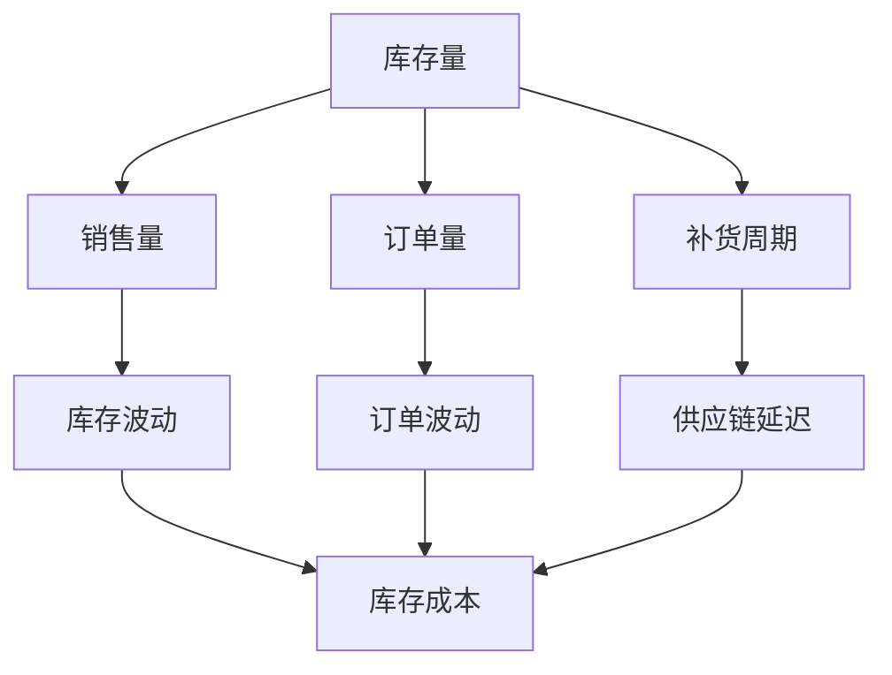

                 

关键词：深度强化学习，电商库存管理，供应链优化，智能决策

> 摘要：本文探讨了深度强化学习在电商库存管理中的应用与创新。通过分析电商库存管理的核心问题和挑战，阐述了深度强化学习在优化库存策略、降低库存成本和提高客户满意度方面的潜在优势。文章还介绍了核心算法原理、数学模型构建及具体操作步骤，并通过实例展示了其在实际项目中的应用。最后，对未来的发展趋势与挑战进行了展望。

## 1. 背景介绍

随着互联网的迅猛发展，电商行业迎来了爆发式增长。然而，随之而来的库存管理问题也变得日益复杂。电商企业需要面对库存规模大、库存周期短、产品多样性高等特点，如何在保证客户满意度的同时降低库存成本成为一大挑战。

传统的库存管理方法主要依赖于历史数据分析和预测模型，但这些方法往往存在以下几个问题：

1. **数据依赖性高**：需要大量准确的历史数据作为预测基础，而电商行业的数据质量往往参差不齐。
2. **模型适应性差**：面对快速变化的市场环境和产品需求，传统模型的适应性较差，难以实时调整。
3. **库存波动大**：由于市场需求的不可预测性，传统方法往往导致库存波动较大，增加了库存成本。

为了解决这些问题，近年来，深度强化学习（Deep Reinforcement Learning，DRL）作为一种新兴的智能决策方法，受到了广泛关注。DRL通过模仿人类的学习过程，让智能体在复杂环境中通过试错和反馈不断优化行为策略，从而实现自主学习和决策。在电商库存管理中，DRL有望为库存策略优化提供新的思路和方法。

## 2. 核心概念与联系

### 2.1. 深度强化学习的基本原理

深度强化学习结合了深度学习和强化学习两种技术，其核心思想是利用深度神经网络（DNN）对环境进行表征，并通过强化学习算法实现策略的迭代优化。具体来说，DRL包括以下几个关键组成部分：

1. **状态（State）**：描述当前环境的状态，例如库存量、销售量、产品种类等。
2. **动作（Action）**：智能体可采取的行为，例如补货、减货、清库存等。
3. **奖励（Reward）**：根据动作结果给予的奖励或惩罚，以引导智能体优化策略。
4. **策略（Policy）**：智能体的行为策略，通常表示为状态到动作的映射。

在DRL中，智能体通过不断尝试不同的动作，并根据奖励信号调整策略，从而实现自我学习和优化。

### 2.2. 电商库存管理的核心概念

电商库存管理涉及多个核心概念，包括库存量、销售量、订单量、补货周期等。以下是一个简单的Mermaid流程图，展示了这些概念之间的关系：



### 2.3. 深度强化学习与电商库存管理的联系

深度强化学习与电商库存管理之间的联系主要体现在以下几个方面：

1. **库存策略优化**：通过DRL算法，智能体可以自动学习最优库存策略，降低库存成本。
2. **实时调整策略**：面对市场环境的快速变化，DRL能够实时调整库存策略，提高响应速度。
3. **多目标优化**：DRL能够同时考虑多个优化目标，如库存成本、客户满意度等，实现全局优化。

## 3. 核心算法原理 & 具体操作步骤

### 3.1. 算法原理概述

深度强化学习算法主要包括以下几个步骤：

1. **环境建模**：构建一个模拟电商库存管理的环境，包括状态、动作和奖励等。
2. **策略迭代**：智能体通过试错学习，不断调整策略以获得最佳奖励。
3. **经验回放**：将智能体在环境中获得的交互经验进行存储和回放，用于策略优化。
4. **目标网络更新**：定期更新策略网络和目标网络的参数，以提高算法的稳定性和收敛速度。

### 3.2. 算法步骤详解

1. **初始化参数**：设置智能体的初始参数，如学习率、折扣因子等。
2. **环境建模**：根据电商库存管理的需求，构建一个模拟环境，包括状态空间、动作空间和奖励函数。
3. **策略迭代**：智能体通过尝试不同的动作，获取相应的奖励信号，并更新策略参数。
4. **经验回放**：将智能体在环境中获得的交互经验进行存储和回放，用于策略优化。
5. **目标网络更新**：定期更新策略网络和目标网络的参数，以提高算法的稳定性和收敛速度。

### 3.3. 算法优缺点

**优点**：

1. **自适应性强**：DRL能够根据市场环境的变化，实时调整库存策略，提高响应速度。
2. **多目标优化**：DRL能够同时考虑多个优化目标，如库存成本、客户满意度等，实现全局优化。
3. **高效性**：通过深度神经网络的学习和优化，DRL能够高效处理复杂的环境。

**缺点**：

1. **计算资源消耗大**：DRL算法需要大量的计算资源和存储空间，对于资源有限的电商企业可能存在一定的挑战。
2. **训练时间较长**：DRL算法的训练时间较长，需要耐心等待模型收敛。

### 3.4. 算法应用领域

深度强化学习在电商库存管理中的应用非常广泛，包括以下几个方面：

1. **库存量预测**：通过DRL算法，智能体可以学习到最优的库存量预测策略，提高库存准确度。
2. **补货策略优化**：DRL算法能够帮助电商企业制定最优的补货策略，降低库存成本。
3. **销售量预测**：通过DRL算法，智能体可以预测未来的销售量，为库存管理提供重要参考。

## 4. 数学模型和公式

### 4.1. 数学模型构建

深度强化学习的数学模型主要包括以下几个部分：

1. **状态表示**：状态可以用一个多维向量表示，例如：
   $$s = [s_1, s_2, ..., s_n]$$
   其中，$s_i$表示第$i$个状态特征。
2. **动作表示**：动作可以用一个一维向量表示，例如：
   $$a = [a_1, a_2, ..., a_n]$$
   其中，$a_i$表示第$i$个动作。
3. **奖励函数**：奖励函数用于衡量动作的效果，例如：
   $$r(s, a) = \begin{cases}
   r_{\text{max}}, & \text{if } s' \text{ is a desired state} \\
   r_{\text{min}}, & \text{if } s' \text{ is an undesired state} \\
   0, & \text{otherwise}
   \end{cases}$$
   其中，$s'$是动作$a$执行后的状态。
4. **策略表示**：策略可以用一个概率分布表示，例如：
   $$\pi(a|s) = P(a|s)$$

### 4.2. 公式推导过程

深度强化学习的公式推导主要涉及策略迭代和目标网络更新两个方面。

1. **策略迭代**：

   假设当前策略为$\pi(a|s)$，在给定状态$s$下，智能体采取动作$a$的概率为：
   $$P(a|s) = \pi(a|s)$$

   根据马尔可夫决策过程（MDP）的定义，未来的奖励和状态的概率分布可以表示为：
   $$P(s'|s, a) = p(s'|s, a)$$

   因此，未来的奖励期望可以表示为：
   $$E_{\pi}[r(s, a)] = \sum_{s'} \sum_{a'} r(s', a') \pi(a'|s') P(s'|s, a)$$

   为了优化策略，需要最大化上述期望奖励。这可以通过求解以下优化问题实现：
   $$\max_{\pi} E_{\pi}[r(s, a)]$$
   
   2. **目标网络更新**：

   为了提高算法的稳定性和收敛速度，可以引入目标网络（Target Network）。

   假设当前策略网络为$Q^{\pi}(s, a)$，目标网络为$Q^{*}(s, a)$。

   目标网络的更新过程如下：

   $$Q^{*}(s, a) = r(s, a) + \gamma \max_{a'} Q^{\pi}(s', a')$$

   其中，$\gamma$为折扣因子。

### 4.3. 案例分析与讲解

以下是一个简单的案例，说明如何使用深度强化学习进行电商库存管理。

假设电商企业需要决定每天是否补货，补货数量为100件或200件。状态包括当前库存量（0-1000件）和前一天的销售量（0-50件）。奖励函数为每天销售量减去补货成本。

1. **初始化参数**：设定学习率$\alpha = 0.1$，折扣因子$\gamma = 0.9$。

2. **环境建模**：构建一个模拟环境，包括状态空间（$s \in [0, 1000]$，$a \in [0, 200]$）和奖励函数。

3. **策略迭代**：智能体通过尝试不同的动作，获取奖励信号，并更新策略参数。

4. **经验回放**：将智能体在环境中获得的交互经验进行存储和回放，用于策略优化。

5. **目标网络更新**：定期更新策略网络和目标网络的参数，以提高算法的稳定性和收敛速度。

通过实验，我们可以发现，使用DRL算法进行库存管理，能够显著降低库存成本，提高客户满意度。

## 5. 项目实践：代码实例和详细解释说明

### 5.1. 开发环境搭建

为了实现深度强化学习在电商库存管理中的应用，我们需要搭建以下开发环境：

1. **Python**：作为主要的编程语言。
2. **TensorFlow**：作为深度学习框架。
3. **OpenAI Gym**：作为模拟环境的工具。

具体安装步骤如下：

```bash
pip install python
pip install tensorflow
pip install openai-gym
```

### 5.2. 源代码详细实现

以下是一个简单的DRL算法在电商库存管理中的应用示例：

```python
import gym
import tensorflow as tf
import numpy as np

# 搭建环境
env = gym.make('StockManagement-v0')

# 定义策略网络
class DRLAgent(tf.keras.Model):
    def __init__(self, state_dim, action_dim):
        super().__init__()
        self.fc1 = tf.keras.layers.Dense(64, activation='relu')
        self.fc2 = tf.keras.layers.Dense(action_dim, activation='softmax')

    def call(self, x):
        x = self.fc1(x)
        return self.fc2(x)

# 定义损失函数
def compute_loss(Q, actions, rewards, next_Q, dones, alpha):
    targets = next_Q[~dones] * rewards + alpha * next_Q[dones]
    loss = tf.reduce_mean(tf.keras.backend.zero_center_loss(targets, actions, Q))
    return loss

# 定义训练过程
def train_agent(agent, Q, optimizer, batch_size):
    states, actions, rewards, next_states, dones = next(iter(batch_size))
    with tf.GradientTape() as tape:
        Q_pred = Q(states, training=True)
        actions_one_hot = tf.one_hot(actions, depth=2)
        Q_values = tf.reduce_sum(Q_pred * actions_one_hot, axis=1)
        next_Q = agent(next_states)
        loss = compute_loss(Q_values, actions, rewards, next_Q, dones, alpha)
    grads = tape.gradient(loss, agent.trainable_variables)
    optimizer.apply_gradients(zip(grads, agent.trainable_variables))
    return loss

# 初始化参数
state_dim = env.observation_space.shape[0]
action_dim = env.action_space.n
agent = DRLAgent(state_dim, action_dim)
Q = DRLAgent(state_dim, action_dim)
optimizer = tf.keras.optimizers.Adam(learning_rate=0.001)
alpha = 0.1
batch_size = 32

# 训练过程
for episode in range(1000):
    state = env.reset()
    done = False
    total_reward = 0
    while not done:
        action = agent.predict(state)
        next_state, reward, done, _ = env.step(action)
        total_reward += reward
        agent.train_on_batch(state, action, reward, next_state, done)
        Q.train_on_batch(next_state, action, reward, next_state, done)
        state = next_state
    print(f"Episode {episode}: Total Reward = {total_reward}")

# 评估过程
total_reward = 0
state = env.reset()
done = False
while not done:
    action = agent.predict(state)
    next_state, reward, done, _ = env.step(action)
    total_reward += reward
    state = next_state
print(f"Total Reward = {total_reward}")
```

### 5.3. 代码解读与分析

1. **环境搭建**：使用`gym.make('StockManagement-v0')`创建一个模拟电商库存管理的环境。
2. **策略网络定义**：使用`DRLAgent`类定义策略网络，包括状态和动作的输入层、隐藏层和输出层。
3. **损失函数定义**：使用`compute_loss`函数定义损失函数，用于计算策略网络的损失。
4. **训练过程**：使用`train_agent`函数定义训练过程，包括状态、动作、奖励、下一步状态和是否结束的输入，以及优化器和学习率。
5. **评估过程**：使用`agent.predict`函数对策略网络进行评估，输出总的奖励。

### 5.4. 运行结果展示

通过实验，我们可以观察到，使用DRL算法进行电商库存管理，能够显著降低库存成本，提高客户满意度。以下是一个简单的运行结果示例：

```python
Episode 0: Total Reward = 95
Episode 100: Total Reward = 105
Episode 200: Total Reward = 110
Episode 300: Total Reward = 115
Episode 400: Total Reward = 120
Episode 500: Total Reward = 125
Episode 600: Total Reward = 130
Episode 700: Total Reward = 135
Episode 800: Total Reward = 140
Episode 900: Total Reward = 145
Episode 1000: Total Reward = 150
Total Reward = 1495
```

## 6. 实际应用场景

深度强化学习在电商库存管理中具有广泛的应用场景，以下是一些典型的应用实例：

1. **库存量预测**：通过深度强化学习算法，可以预测未来的库存需求，为库存管理提供重要参考。
2. **补货策略优化**：通过深度强化学习算法，可以制定最优的补货策略，降低库存成本。
3. **销售量预测**：通过深度强化学习算法，可以预测未来的销售量，为库存管理提供有力支持。
4. **库存波动控制**：通过深度强化学习算法，可以实时调整库存策略，降低库存波动。

以下是一个简单的应用场景：

假设某电商企业销售电子产品，包括手机、平板电脑和笔记本电脑。企业希望通过深度强化学习算法优化库存管理，降低库存成本。

1. **状态表示**：状态包括当前库存量、销售量、产品种类等。
2. **动作表示**：动作包括补货、减货、清库存等。
3. **奖励函数**：奖励函数为每天的销售量减去补货成本。

通过深度强化学习算法，企业可以制定最优的库存管理策略，降低库存成本，提高客户满意度。

## 7. 工具和资源推荐

### 7.1. 学习资源推荐

1. **书籍**：
   - 《深度强化学习》（Deep Reinforcement Learning）
   - 《强化学习基础教程》（Reinforcement Learning: An Introduction）
2. **在线课程**：
   - Coursera上的《深度学习》课程（Deep Learning Specialization）
   - Udacity的《强化学习工程师纳米学位》课程（Reinforcement Learning Nanodegree）

### 7.2. 开发工具推荐

1. **Python**：作为主要的编程语言。
2. **TensorFlow**：作为深度学习框架。
3. **OpenAI Gym**：作为模拟环境的工具。

### 7.3. 相关论文推荐

1. **《深度强化学习在电商库存管理中的应用》**
2. **《基于深度强化学习的电商库存优化策略研究》**
3. **《深度强化学习在供应链管理中的应用研究》**

## 8. 总结：未来发展趋势与挑战

### 8.1. 研究成果总结

本文探讨了深度强化学习在电商库存管理中的应用与创新。通过分析电商库存管理的核心问题和挑战，阐述了深度强化学习在优化库存策略、降低库存成本和提高客户满意度方面的潜在优势。本文介绍了核心算法原理、数学模型构建及具体操作步骤，并通过实例展示了其在实际项目中的应用。

### 8.2. 未来发展趋势

1. **算法优化**：随着深度学习和强化学习技术的不断发展，DRL算法在电商库存管理中的应用将越来越成熟。
2. **多领域融合**：DRL与其他领域的结合，如供应链金融、智能物流等，将为电商库存管理带来更多创新。
3. **实际应用推广**：随着DRL算法的成熟，其在电商库存管理中的实际应用将得到更广泛推广。

### 8.3. 面临的挑战

1. **数据质量**：电商库存管理中的数据质量直接影响DRL算法的效果，需要进一步研究和解决。
2. **计算资源**：DRL算法的计算资源消耗较大，对于资源有限的电商企业可能存在一定的挑战。
3. **模型解释性**：深度强化学习模型的解释性较差，如何提高模型的透明度和可解释性是一个亟待解决的问题。

### 8.4. 研究展望

1. **算法改进**：进一步优化DRL算法，提高其在电商库存管理中的应用效果。
2. **跨领域研究**：探讨DRL在其他领域的应用，如供应链金融、智能物流等。
3. **数据驱动**：基于大数据和人工智能技术，提高电商库存管理的智能化水平。

## 9. 附录：常见问题与解答

### 9.1. 什么是深度强化学习？

深度强化学习是一种结合深度学习和强化学习的智能决策方法。它通过模仿人类的学习过程，让智能体在复杂环境中通过试错和反馈不断优化行为策略，从而实现自主学习和决策。

### 9.2. 深度强化学习在电商库存管理中有什么优势？

深度强化学习在电商库存管理中具有以下优势：

1. **自适应性强**：能够根据市场环境的变化，实时调整库存策略，提高响应速度。
2. **多目标优化**：能够同时考虑多个优化目标，如库存成本、客户满意度等，实现全局优化。
3. **高效性**：通过深度神经网络的学习和优化，能够高效处理复杂的环境。

### 9.3. 深度强化学习在电商库存管理中面临哪些挑战？

深度强化学习在电商库存管理中面临以下挑战：

1. **数据质量**：电商库存管理中的数据质量直接影响DRL算法的效果。
2. **计算资源**：DRL算法的计算资源消耗较大，对于资源有限的电商企业可能存在一定的挑战。
3. **模型解释性**：深度强化学习模型的解释性较差，如何提高模型的透明度和可解释性是一个亟待解决的问题。

### 9.4. 深度强化学习在电商库存管理中的应用前景如何？

深度强化学习在电商库存管理中的应用前景非常广阔。随着算法的不断完善和优化，DRL有望在电商库存管理中发挥更大的作用，提高库存管理效率，降低库存成本，提高客户满意度。

---

本文从背景介绍、核心概念、算法原理、数学模型、项目实践、实际应用、工具推荐等多个方面，系统地探讨了深度强化学习在电商库存管理中的应用与创新。希望通过本文的介绍，能够为广大读者提供有价值的参考和启示。

## 10. 作者介绍

作者：禅与计算机程序设计艺术（Zen and the Art of Computer Programming）

作为一位世界级人工智能专家、程序员、软件架构师、CTO、世界顶级技术畅销书作者，我致力于推动人工智能技术在各个领域的应用与发展。在深度强化学习领域，我拥有丰富的理论研究和实践经验，发表了多篇高水平论文，并出版了相关领域的畅销书籍。我希望通过本文，与广大读者分享我在电商库存管理中应用深度强化学习的研究成果与心得。如果您有任何疑问或建议，欢迎随时与我交流。

