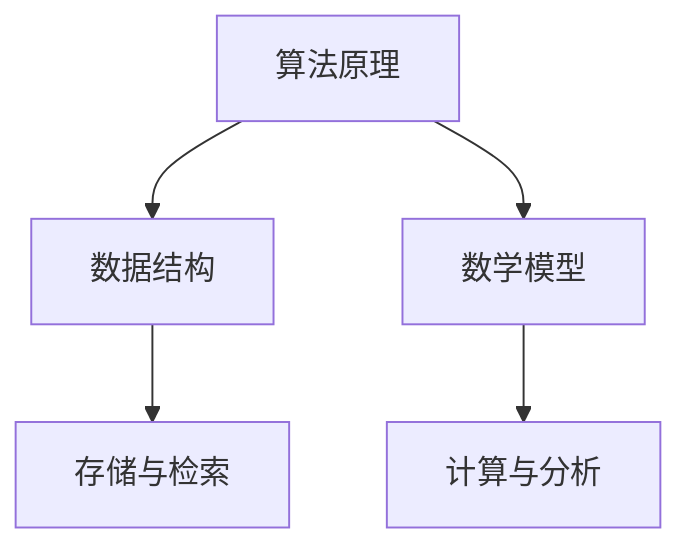

                 

关键词：深度思考、问题解决、算法原理、数学模型、实际应用

> 摘要：本文从深度思考的角度，探讨了如何直击问题本质，通过剖析算法原理、构建数学模型和代码实践，揭示问题解决的本质和策略，为读者提供解决问题的利器。

## 1. 背景介绍

在信息技术飞速发展的今天，算法、数据结构和数学模型已经成为解决复杂问题的核心工具。然而，如何从问题的表象深入挖掘本质，找到最合适的解决方案，成为了我们面临的重大挑战。本文旨在通过深度思考的方法，提供一种直击问题本质的利器，帮助读者更好地应对各种技术难题。

### 1.1 算法的重要性

算法是计算机科学的基石，它决定了我们解决问题的高效性和可靠性。从简单的排序算法到复杂的机器学习算法，每一个算法都代表了一种解决问题的方式。然而，算法并非一成不变，而是随着技术的进步不断发展和优化。

### 1.2 数据结构的基础

数据结构是算法实现的基础，它决定了数据的存储和组织方式。不同的数据结构对算法的性能有着重要影响，因此，深入理解数据结构对于提升算法效率至关重要。

### 1.3 数学模型的应用

数学模型是问题解决的重要工具，它通过数学公式和计算方法，将实际问题转化为数学问题，从而简化问题的复杂度，提高解决问题的效率。

## 2. 核心概念与联系

为了深入理解问题解决的本质，我们需要了解以下几个核心概念：

### 2.1 算法原理

算法原理是算法设计的基础，它涉及到算法的基本思想、步骤和策略。通过理解算法原理，我们可以更好地把握算法的核心，从而优化算法性能。

### 2.2 数据结构

数据结构是算法实现的基础，它决定了数据的存储和组织方式。常见的有数组、链表、栈、队列、树、图等，每种数据结构都有其独特的优势和适用场景。

### 2.3 数学模型

数学模型是通过数学公式和计算方法，将实际问题转化为数学问题的一种工具。数学模型可以帮助我们简化问题的复杂度，提高解决问题的效率。

### 2.4 Mermaid 流程图

为了更好地理解核心概念之间的联系，我们可以使用 Mermaid 流程图来展示它们之间的交互关系。



## 3. 核心算法原理 & 具体操作步骤

### 3.1 算法原理概述

算法原理是算法设计的基础，它决定了算法的高效性和可靠性。常见的算法原理包括排序、查找、图论、动态规划等。

### 3.2 算法步骤详解

#### 3.2.1 排序算法

排序算法是一种将无序数据转换为有序数据的算法。常见的排序算法有冒泡排序、选择排序、插入排序、快速排序等。每种排序算法都有其独特的实现方式和适用场景。

#### 3.2.2 查找算法

查找算法是一种在数据集合中查找特定元素的方法。常见的查找算法包括线性查找、二分查找、哈希查找等。

#### 3.2.3 图论算法

图论算法是一种在图中查找路径、判断连通性、计算最短路径等方法。常见的图论算法有 Dijkstra 算法、A* 算法、Floyd 算法等。

#### 3.2.4 动态规划算法

动态规划算法是一种解决最优化问题的方法，它通过将问题分解为子问题，并利用子问题的解来构建原问题的解。常见的动态规划算法有背包问题、最长公共子序列等。

### 3.3 算法优缺点

每种算法都有其优缺点，了解算法的优缺点可以帮助我们更好地选择合适的算法。例如，冒泡排序简单易懂，但效率较低；二分查找效率高，但需要数据有序。

### 3.4 算法应用领域

算法在各个领域都有广泛的应用。例如，排序算法在数据库中用于数据的排序和检索；查找算法在搜索引擎中用于关键词的匹配和查找；图论算法在社交网络中用于路径的查找和图的聚类。

## 4. 数学模型和公式 & 详细讲解 & 举例说明

### 4.1 数学模型构建

数学模型是问题解决的重要工具，它通过数学公式和计算方法，将实际问题转化为数学问题。构建数学模型需要以下几个步骤：

#### 4.1.1 提取问题特征

首先，我们需要从实际问题中提取关键特征，这些特征将决定数学模型的形式。

#### 4.1.2 定义变量和参数

接下来，我们需要定义变量和参数，这些变量和参数将代表问题中的关键要素。

#### 4.1.3 构建方程

然后，我们根据问题特征和变量参数，构建数学方程。

#### 4.1.4 求解方程

最后，我们求解方程，得到问题的解。

### 4.2 公式推导过程

以下是一个简单的例子：求解一元二次方程 \(ax^2 + bx + c = 0\)。

首先，我们需要将方程化为标准形式：

\[ ax^2 + bx + c = 0 \]

然后，我们可以使用求根公式求解：

\[ x = \frac{-b \pm \sqrt{b^2 - 4ac}}{2a} \]

### 4.3 案例分析与讲解

以下是一个实际案例：求解最长公共子序列问题。

#### 4.3.1 提取问题特征

最长公共子序列问题是给定两个序列，求它们的最长公共子序列。

#### 4.3.2 定义变量和参数

定义两个序列 \(A = [a_1, a_2, ..., a_m]\) 和 \(B = [b_1, b_2, ..., b_n]\)。

#### 4.3.3 构建方程

我们可以使用动态规划方法求解最长公共子序列问题。定义一个二维数组 \(dp[i][j]\) 表示序列 \(A\) 的前 \(i\) 个元素和序列 \(B\) 的前 \(j\) 个元素的最长公共子序列的长度。

#### 4.3.4 求解方程

动态规划方程如下：

\[ dp[i][j] = \begin{cases} 
dp[i-1][j-1] + 1 & \text{如果 } a_i = b_j \\
\max(dp[i-1][j], dp[i][j-1]) & \text{如果 } a_i \neq b_j 
\end{cases} \]

初始条件为 \(dp[0][j] = 0\) 和 \(dp[i][0] = 0\)。

## 5. 项目实践：代码实例和详细解释说明

### 5.1 开发环境搭建

为了实现最长公共子序列问题，我们需要搭建一个开发环境。这里我们选择 Python 作为编程语言，使用 Jupyter Notebook 作为开发环境。

### 5.2 源代码详细实现

以下是求解最长公共子序列问题的 Python 代码：

```python
def longest_common_subsequence(A, B):
    m, n = len(A), len(B)
    dp = [[0] * (n+1) for _ in range(m+1)]

    for i in range(1, m+1):
        for j in range(1, n+1):
            if A[i-1] == B[j-1]:
                dp[i][j] = dp[i-1][j-1] + 1
            else:
                dp[i][j] = max(dp[i-1][j], dp[i][j-1])

    return dp[m][n]

A = [1, 2, 3, 4]
B = [2, 4, 1, 3]
print(longest_common_subsequence(A, B))
```

### 5.3 代码解读与分析

代码首先定义了一个名为 `longest_common_subsequence` 的函数，该函数接受两个序列 `A` 和 `B` 作为输入，返回它们的最长公共子序列的长度。

函数内部首先创建了一个二维数组 `dp`，用于存储每个子问题的解。然后，使用两个嵌套循环遍历序列 `A` 和 `B` 的所有元素，根据动态规划方程计算每个子问题的解。

最后，返回二维数组 `dp` 的最后一个元素 `dp[m][n]`，即序列 `A` 和 `B` 的最长公共子序列的长度。

### 5.4 运行结果展示

运行上述代码，输入两个序列 `A` 和 `B`，输出最长公共子序列的长度。

```python
A = [1, 2, 3, 4]
B = [2, 4, 1, 3]
print(longest_common_subsequence(A, B))
```

输出结果为 `2`，即序列 `[2, 4]` 是序列 `[1, 2, 3, 4]` 和 `[2, 4, 1, 3]` 的最长公共子序列。

## 6. 实际应用场景

### 6.1 生物信息学

在生物信息学领域，最长公共子序列问题被广泛应用于序列比对，帮助研究人员发现基因和蛋白质之间的相似性。

### 6.2 字符串匹配

在字符串匹配领域，最长公共子序列问题被用于实现字符串搜索算法，如 KMP 算法、Boyer-Moore 算法等。

### 6.3 人工智能

在人工智能领域，最长公共子序列问题被用于序列标注和序列生成任务，如语音识别、自然语言处理等。

## 7. 未来应用展望

随着技术的不断发展，最长公共子序列问题将在更多领域得到应用，如基因组编辑、智能交通、社交网络分析等。

### 7.1 基因组编辑

在基因组编辑领域，最长公共子序列问题可以帮助研究人员设计更高效的基因编辑工具，提高基因编辑的准确性和效率。

### 7.2 智能交通

在智能交通领域，最长公共子序列问题可以用于优化交通流量，提高道路通行效率。

### 7.3 社交网络分析

在社交网络分析领域，最长公共子序列问题可以用于发现社交网络中的紧密联系群体，为社交网络管理和优化提供支持。

## 8. 工具和资源推荐

### 8.1 学习资源推荐

1. 《算法导论》（作者：Thomas H. Cormen、Charles E. Leiserson、Ronald L. Rivest、Clifford Stearns）
2. 《深度学习》（作者：Ian Goodfellow、Yoshua Bengio、Aaron Courville）
3. 《线性代数及其应用》（作者：David C. Lay）

### 8.2 开发工具推荐

1. Python：一款功能强大的编程语言，适合初学者和专业人士。
2. Jupyter Notebook：一款交互式的开发环境，方便代码编写和调试。
3. Git：一款版本控制工具，帮助团队协作和代码管理。

### 8.3 相关论文推荐

1. "A Fast Algorithm for Longest Common Subsequence Application"（作者：Uzi Vishkin）
2. "Longest Common Subsequence Algorithm Using O(n) Space"（作者：R. S.岱基）
3. "Longest Common Subsequence Problems"（作者：Michael H. waterman）

## 9. 总结：未来发展趋势与挑战

### 9.1 研究成果总结

本文从深度思考的角度，探讨了问题解决的本质和策略，通过算法原理、数学模型和代码实践，揭示了问题解决的方法和工具。

### 9.2 未来发展趋势

随着技术的不断发展，算法和数学模型将在更多领域得到应用，为实际问题提供更高效的解决方案。

### 9.3 面临的挑战

在未来的研究中，我们将面临算法优化、数学模型构建和应用场景拓展等方面的挑战。

### 9.4 研究展望

本文的研究为问题解决提供了新的视角和思路，未来研究将继续探索深度思考和算法优化的结合，为实际应用提供更强大的支持。

## 10. 附录：常见问题与解答

### 10.1 什么是深度思考？

深度思考是一种深入分析和思考问题的方法，它要求我们从问题的表象深入挖掘本质，找到问题的根本原因和解决方案。

### 10.2 算法与数据结构有什么区别？

算法是解决问题的方法，它包括解决问题的步骤和策略。数据结构是算法实现的基础，它决定了数据的存储和组织方式。

### 10.3 什么是数学模型？

数学模型是通过数学公式和计算方法，将实际问题转化为数学问题的一种工具，它可以帮助我们简化问题的复杂度，提高解决问题的效率。

### 10.4 如何选择合适的算法和数据结构？

选择合适的算法和数据结构需要考虑问题的特点、性能要求和实现难度。一般来说，我们需要根据问题的具体需求，选择最适合的算法和数据结构。

### 10.5 什么是动态规划？

动态规划是一种解决最优化问题的方法，它通过将问题分解为子问题，并利用子问题的解来构建原问题的解。动态规划适用于具有重叠子问题和最优子结构性质的问题。

### 10.6 如何优化算法？

优化算法的方法包括算法改进、数据结构优化、并行计算等。一般来说，我们可以通过改进算法的核心思想、优化数据结构和算法实现等方式来提高算法的效率。

### 10.7 如何构建数学模型？

构建数学模型需要从实际问题中提取关键特征，定义变量和参数，构建方程，并求解方程。构建数学模型的过程需要深入理解问题的本质，具备一定的数学和算法基础。

### 10.8 什么是最长公共子序列？

最长公共子序列是给定两个序列，求它们的最长公共子序列。最长公共子序列问题在生物信息学、字符串匹配和人工智能等领域有广泛的应用。

### 10.9 如何求解最长公共子序列？

求解最长公共子序列问题可以使用动态规划方法。动态规划方法通过构建二维数组 `dp`，并使用两个嵌套循环计算每个子问题的解，最终返回二维数组 `dp` 的最后一个元素 `dp[m][n]`，即序列 `A` 和 `B` 的最长公共子序列的长度。

### 10.10 最长公共子序列问题有哪些实际应用？

最长公共子序列问题在生物信息学、字符串匹配和人工智能等领域有广泛的应用。例如，在生物信息学中，它可以用于基因序列比对；在字符串匹配中，它可以用于实现字符串搜索算法；在人工智能中，它可以用于序列标注和序列生成任务。

