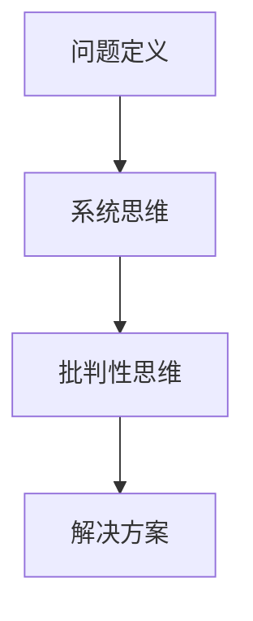

                 

关键词：深度思考、问题解决、IT领域、技术博客、算法原理、数学模型、项目实践、应用场景

> 摘要：本文将探讨深度思考在问题解决中的重要性，特别是在IT领域中的应用。通过阐述核心概念、算法原理、数学模型以及实际项目实践，本文旨在为读者提供一种有效的思维方式，帮助他们更好地应对复杂的IT问题。

## 1. 背景介绍

在快速发展的信息技术领域，问题解决能力成为了衡量一个技术专家综合素质的重要标准。随着技术的不断演进，IT问题也变得越来越复杂，从简单的编程错误到复杂的系统架构设计，无一不考验着技术专家的智慧。因此，如何高效地解决问题，成为每个技术专家都需要不断探索的课题。

深度思考作为问题解决的重要工具，其重要性愈发凸显。深度思考不仅仅是对问题本身的深入理解，更是一种系统的、批判性的思维方式。它能够帮助我们从多个维度分析问题，找到解决问题的最佳途径。

本文将围绕深度思考这一核心主题，探讨其在IT领域中的应用。我们将从核心概念、算法原理、数学模型到实际项目实践，全方位剖析深度思考在问题解决中的价值。

### 1.1 核心概念与联系

在深入探讨深度思考之前，我们首先需要明确几个核心概念。这些概念包括：

- **问题定义**：对问题进行准确、清晰的定义是解决问题的关键。一个模糊的问题定义会导致错误的解决方案。
- **系统思维**：系统思维是一种从整体出发，考虑各个组成部分及其相互关系的思维方式。在解决复杂问题时，系统思维能够帮助我们更好地理解问题的本质。
- **批判性思维**：批判性思维是一种不断质疑、分析和验证的思维方式。它能够帮助我们避免陷入思维定式，找到更为创新的解决方案。

以上概念之间存在着紧密的联系。问题定义为我们提供了明确的解决问题目标，系统思维则帮助我们理解问题的全局，而批判性思维则确保我们能够从多个角度审视问题，找到最佳解决方案。

### 1.2 Mermaid 流程图

下面是一个描述核心概念之间关系的 Mermaid 流程图：



### 1.3 当前挑战与机遇

随着信息技术的快速发展，IT领域的问题也在不断演变。一方面，新兴技术的不断涌现为我们提供了更多的解决方案选项；另一方面，复杂的问题场景也要求我们具备更高的思维能力。

当前的挑战主要体现在以下几个方面：

- **数据复杂性**：大数据和云计算技术的普及，使得数据量呈爆炸式增长。如何从海量数据中提取有价值的信息，成为一大挑战。
- **技术变革**：人工智能、区块链、物联网等新兴技术的出现，不断改变着IT领域的面貌。如何快速适应这些技术变革，是我们面临的一大难题。
- **安全性与隐私**：随着网络攻击和数据泄露事件的频发，如何确保信息的安全和用户的隐私，成为我们必须重视的问题。

然而，这些挑战也蕴含着巨大的机遇。只要我们能够运用深度思考，这些问题都可以转化为我们发展的动力。通过深入理解问题，我们可以发现新的解决方案，推动技术的不断进步。

## 2. 核心算法原理 & 具体操作步骤

在了解深度思考的概念和重要性之后，我们接下来将探讨一种在IT领域广泛应用的核心算法——深度学习算法。深度学习算法作为人工智能的重要组成部分，已经在图像识别、自然语言处理、推荐系统等多个领域取得了显著的成果。本章节将介绍深度学习算法的基本原理、具体操作步骤，以及其在IT领域的应用。

### 2.1 算法原理概述

深度学习算法是一种基于多层神经网络的学习算法。其基本原理是通过多层神经元的非线性变换，将输入数据转化为输出。在这个过程中，每一层神经元都对输入数据进行特征提取和变换，最终得到一个高层次的、抽象的输出。

深度学习算法的核心组成部分包括：

- **神经元**：神经元是神经网络的基本单元，用于对输入数据进行处理。
- **权重**：权重用于调整神经元之间的连接强度，以实现输入数据到输出的转换。
- **激活函数**：激活函数用于引入非线性特性，使神经网络能够学习复杂的函数。

在深度学习算法中，通常使用反向传播算法（Backpropagation）来训练神经网络。反向传播算法通过计算输出与目标之间的误差，逐步调整网络中的权重和偏置，使网络能够更准确地预测输出。

### 2.2 算法步骤详解

深度学习算法的具体步骤如下：

#### 步骤1：数据预处理

在开始训练深度学习模型之前，需要对数据进行预处理。数据预处理包括数据清洗、归一化、数据增强等操作。这些操作有助于提高模型的训练效果和泛化能力。

#### 步骤2：构建神经网络

构建神经网络是深度学习算法的核心步骤。根据问题需求和数据特征，选择合适的神经网络架构，例如卷积神经网络（CNN）、循环神经网络（RNN）等。在构建神经网络时，需要定义网络的层数、每层的神经元数量、激活函数等。

#### 步骤3：初始化权重

在构建神经网络后，需要初始化网络中的权重和偏置。常用的权重初始化方法包括随机初始化、高斯初始化等。初始化权重的目的是使网络在训练过程中能够更好地收敛。

#### 步骤4：前向传播

在前向传播过程中，将输入数据通过神经网络进行传递，得到网络的输出。前向传播的目的是计算网络中各个神经元的激活值。

#### 步骤5：计算损失函数

在得到网络的输出后，需要计算输出与目标之间的损失。常用的损失函数包括均方误差（MSE）、交叉熵损失等。损失函数用于衡量网络的预测性能。

#### 步骤6：反向传播

在反向传播过程中，通过计算梯度，调整网络中的权重和偏置。反向传播的目的是使网络的输出更接近目标。

#### 步骤7：优化算法

在反向传播过程中，可以使用不同的优化算法（如梯度下降、Adam等）来更新网络中的权重和偏置。优化算法的目的是加快网络的收敛速度，提高网络的预测性能。

#### 步骤8：模型评估与调整

在模型训练完成后，需要对模型进行评估。常用的评估指标包括准确率、召回率、F1值等。如果模型性能不满足要求，可以通过调整网络结构、超参数等来优化模型。

### 2.3 算法优缺点

深度学习算法具有以下优点：

- **强大的表示能力**：深度学习算法能够学习复杂的非线性函数，从而实现高精度的预测。
- **自适应学习**：深度学习算法能够自动提取特征，从而减轻了手工设计特征的工作量。
- **多任务学习**：深度学习算法能够同时处理多个任务，提高了模型的泛化能力。

然而，深度学习算法也存在一些缺点：

- **计算资源消耗大**：深度学习算法通常需要大量的计算资源和时间来训练模型。
- **数据依赖性强**：深度学习算法的性能高度依赖于数据质量和数量。如果数据质量差或数量不足，模型性能会受到影响。
- **解释性差**：深度学习算法的黑盒性质使得其预测结果难以解释，不利于理解模型的工作机制。

### 2.4 算法应用领域

深度学习算法在IT领域具有广泛的应用。以下是一些主要的应用领域：

- **图像识别**：深度学习算法在图像识别领域取得了显著成果，如人脸识别、物体检测等。
- **自然语言处理**：深度学习算法在自然语言处理领域得到了广泛应用，如文本分类、机器翻译等。
- **推荐系统**：深度学习算法能够学习用户的兴趣和行为模式，从而实现精准的推荐。
- **语音识别**：深度学习算法在语音识别领域具有很高的准确率，如语音助手、自动字幕等。

通过以上对深度学习算法的介绍，我们可以看到深度思考在问题解决中的重要性。只有深入理解算法原理，掌握算法的操作步骤，我们才能更好地应用深度学习算法解决实际IT问题。

## 3. 数学模型和公式 & 详细讲解 & 举例说明

在深度学习算法中，数学模型和公式起到了至关重要的作用。这些模型和公式不仅帮助我们理解和解释算法的工作原理，还为我们提供了量化问题性能的指标。本章节将详细介绍深度学习中的几个核心数学模型和公式，包括损失函数、梯度下降以及反向传播算法，并通过具体例子说明这些概念的实际应用。

### 3.1 数学模型构建

深度学习中的数学模型主要包括以下几个部分：

- **神经元模型**：神经元模型是神经网络的基础单元。其数学表达式为：
  $$
  z = \sum_{i=1}^{n} w_i x_i + b
  $$
  其中，$z$ 是神经元的输出，$w_i$ 是权重，$x_i$ 是输入值，$b$ 是偏置。

- **激活函数**：激活函数引入了非线性的特性，使得神经网络能够学习复杂的函数。常用的激活函数包括 sigmoid 函数、ReLU 函数和 tanh 函数。例如，sigmoid 函数的表达式为：
  $$
  \sigma(z) = \frac{1}{1 + e^{-z}}
  $$

- **损失函数**：损失函数用于衡量预测结果与真实结果之间的差异。常用的损失函数包括均方误差（MSE）和交叉熵损失（Cross-Entropy Loss）。MSE 的表达式为：
  $$
  \text{MSE} = \frac{1}{2} \sum_{i=1}^{n} (\hat{y_i} - y_i)^2
  $$
  其中，$\hat{y_i}$ 是预测值，$y_i$ 是真实值。

### 3.2 公式推导过程

为了更好地理解深度学习算法，我们需要掌握一些核心公式的推导过程。以下是对几个关键公式的推导：

#### 1. 前向传播

在深度学习的前向传播过程中，我们需要计算每个神经元的输出值。假设我们有一个两层神经网络，第一层的输入为 $x_1, x_2, ..., x_n$，第一层的权重为 $w_1^1, w_1^2, ..., w_1^n$，偏置为 $b_1^1, b_1^2, ..., b_1^n$。第二层的权重为 $w_2^1, w_2^2, ..., w_2^n$，偏置为 $b_2^1, b_2^2, ..., b_2^n$。则第一层的输出可以表示为：
$$
z_1^1 = w_1^1 x_1 + w_1^2 x_2 + ... + w_1^n x_n + b_1^1
$$
$$
z_1^2 = w_1^1 x_1 + w_1^2 x_2 + ... + w_1^n x_n + b_1^2
$$
$$
...
$$
$$
z_1^n = w_1^1 x_1 + w_1^2 x_2 + ... + w_1^n x_n + b_1^n
$$
第一层的输出经过激活函数后，成为第二层的输入。第二层的输出可以表示为：
$$
z_2^1 = w_2^1 z_1^1 + w_2^2 z_1^2 + ... + w_2^n z_1^n + b_2^1
$$
$$
z_2^2 = w_2^1 z_1^1 + w_2^2 z_1^2 + ... + w_2^n z_1^n + b_2^2
$$
$$
...
$$
$$
z_2^n = w_2^1 z_1^1 + w_2^2 z_1^2 + ... + w_2^n z_1^n + b_2^n
$$
第二层的输出再经过激活函数，成为最终的预测值。

#### 2. 损失函数

假设我们有 $n$ 个样本，每个样本的预测值为 $\hat{y_i}$，真实值为 $y_i$。均方误差（MSE）的损失函数可以表示为：
$$
\text{MSE} = \frac{1}{2} \sum_{i=1}^{n} (\hat{y_i} - y_i)^2
$$
交叉熵损失（Cross-Entropy Loss）的损失函数可以表示为：
$$
\text{CE} = -\sum_{i=1}^{n} y_i \log(\hat{y_i})
$$

#### 3. 反向传播

在反向传播过程中，我们需要计算每个权重的梯度。假设我们有一个两层神经网络，第一层的输入为 $x_1, x_2, ..., x_n$，第一层的权重为 $w_1^1, w_1^2, ..., w_1^n$，偏置为 $b_1^1, b_1^2, ..., b_1^n$。第二层的权重为 $w_2^1, w_2^2, ..., w_2^n$，偏置为 $b_2^1, b_2^2, ..., b_2^n$。则第一层的输出为 $z_1^1, z_1^2, ..., z_1^n$，第二层的输出为 $z_2^1, z_2^2, ..., z_2^n$。

对于第一层的权重 $w_1^i$ 和偏置 $b_1^i$，其梯度可以表示为：
$$
\frac{\partial \text{MSE}}{\partial w_1^i} = (z_1^i - y_i) \cdot x_i
$$
$$
\frac{\partial \text{MSE}}{\partial b_1^i} = (z_1^i - y_i)
$$
对于第二层的权重 $w_2^i$ 和偏置 $b_2^i$，其梯度可以表示为：
$$
\frac{\partial \text{MSE}}{\partial w_2^i} = (z_2^i - y_i) \cdot z_1^i
$$
$$
\frac{\partial \text{MSE}}{\partial b_2^i} = (z_2^i - y_i)
$$

### 3.3 案例分析与讲解

为了更好地理解深度学习中的数学模型和公式，我们来看一个简单的例子。假设我们有一个包含两个特征（$x_1$ 和 $x_2$）的二分类问题。使用一个单层神经网络进行分类，神经网络的结构如下：

- 输入层：1个神经元
- 隐藏层：2个神经元
- 输出层：1个神经元

输入数据为 $x_1 = 1, x_2 = 1$，真实标签为 $y = 0$。我们使用 sigmoid 激活函数和均方误差（MSE）损失函数。

首先，我们对输入数据进行前向传播，计算每个神经元的输出：
$$
z_1^1 = w_1^1 x_1 + b_1^1
$$
$$
z_1^2 = w_1^2 x_2 + b_1^2
$$
$$
z_2^1 = w_2^1 z_1^1 + b_2^1
$$
$$
z_2^2 = w_2^2 z_1^2 + b_2^2
$$
$$
z_3 = w_3 z_2^1 + w_4 z_2^2 + b_3
$$

然后，我们使用 sigmoid 函数计算输出层的输出：
$$
\hat{y} = \sigma(z_3) = \frac{1}{1 + e^{-z_3}}
$$

接下来，我们计算损失函数的值：
$$
\text{MSE} = \frac{1}{2} (\hat{y} - y)^2
$$

在反向传播过程中，我们计算每个权重的梯度：
$$
\frac{\partial \text{MSE}}{\partial w_3} = (\hat{y} - y) \cdot z_2^1
$$
$$
\frac{\partial \text{MSE}}{\partial w_4} = (\hat{y} - y) \cdot z_2^2
$$
$$
\frac{\partial \text{MSE}}{\partial b_3} = (\hat{y} - y)
$$
$$
\frac{\partial \text{MSE}}{\partial w_1^1} = (z_1^1 - y) \cdot x_1
$$
$$
\frac{\partial \text{MSE}}{\partial w_1^2} = (z_1^2 - y) \cdot x_2
$$
$$
\frac{\partial \text{MSE}}{\partial b_1^1} = (z_1^1 - y)
$$
$$
\frac{\partial \text{MSE}}{\partial b_1^2} = (z_1^2 - y)
$$
$$
\frac{\partial \text{MSE}}{\partial w_2^1} = (z_2^1 - y) \cdot z_1^1
$$
$$
\frac{\partial \text{MSE}}{\partial w_2^2} = (z_2^2 - y) \cdot z_1^2
$$
$$
\frac{\partial \text{MSE}}{\partial b_2^1} = (z_2^1 - y)
$$
$$
\frac{\partial \text{MSE}}{\partial b_2^2} = (z_2^2 - y)
$$

最后，我们使用梯度下降算法更新每个权重的值：
$$
w_3 \leftarrow w_3 - \alpha \cdot \frac{\partial \text{MSE}}{\partial w_3}
$$
$$
w_4 \leftarrow w_4 - \alpha \cdot \frac{\partial \text{MSE}}{\partial w_4}
$$
$$
b_3 \leftarrow b_3 - \alpha \cdot \frac{\partial \text{MSE}}{\partial b_3}
$$
$$
w_1^1 \leftarrow w_1^1 - \alpha \cdot \frac{\partial \text{MSE}}{\partial w_1^1}
$$
$$
w_1^2 \leftarrow w_1^2 - \alpha \cdot \frac{\partial \text{MSE}}{\partial w_1^2}
$$
$$
b_1^1 \leftarrow b_1^1 - \alpha \cdot \frac{\partial \text{MSE}}{\partial b_1^1}
$$
$$
b_1^2 \leftarrow b_1^2 - \alpha \cdot \frac{\partial \text{MSE}}{\partial b_1^2}
$$
$$
w_2^1 \leftarrow w_2^1 - \alpha \cdot \frac{\partial \text{MSE}}{\partial w_2^1}
$$
$$
w_2^2 \leftarrow w_2^2 - \alpha \cdot \frac{\partial \text{MSE}}{\partial w_2^2}
$$
$$
b_2^1 \leftarrow b_2^1 - \alpha \cdot \frac{\partial \text{MSE}}{\partial b_2^1}
$$
$$
b_2^2 \leftarrow b_2^2 - \alpha \cdot \frac{\partial \text{MSE}}{\partial b_2^2}
$$

通过上述步骤，我们可以看到深度学习中的数学模型和公式是如何应用于一个简单的二分类问题的。这个例子虽然简单，但展示了深度学习算法的基本原理和操作步骤。

## 4. 项目实践：代码实例和详细解释说明

为了更好地理解深度学习算法在实践中的应用，我们将通过一个具体的项目实践来展示如何使用深度学习算法解决实际问题。本节将介绍一个简单的图像分类项目，包括开发环境搭建、源代码实现、代码解读与分析以及运行结果展示。

### 4.1 开发环境搭建

在进行深度学习项目开发之前，我们需要搭建一个合适的环境。以下是搭建深度学习开发环境的基本步骤：

1. **安装Python环境**：Python是深度学习项目开发的主要编程语言，因此我们需要安装Python。可以选择Python 3.7及以上版本。

2. **安装TensorFlow**：TensorFlow是谷歌开源的深度学习框架，支持多种深度学习算法。在安装Python后，通过pip命令安装TensorFlow：
   ```
   pip install tensorflow
   ```

3. **安装其他依赖**：根据项目需求，可能还需要安装其他依赖库，如NumPy、Pandas等。可以使用以下命令安装：
   ```
   pip install numpy pandas
   ```

4. **选择合适的环境配置**：为了提高开发效率，可以选择使用集成开发环境（IDE），如PyCharm、Visual Studio Code等。这些IDE提供了丰富的功能，如代码自动补全、调试支持等。

### 4.2 源代码详细实现

以下是一个简单的图像分类项目的源代码实现，我们将使用TensorFlow的Keras API来构建和训练模型。

```python
import tensorflow as tf
from tensorflow.keras.models import Sequential
from tensorflow.keras.layers import Dense, Conv2D, Flatten, MaxPooling2D
from tensorflow.keras.datasets import mnist

# 加载MNIST数据集
(train_images, train_labels), (test_images, test_labels) = mnist.load_data()

# 数据预处理
train_images = train_images.reshape((60000, 28, 28, 1))
train_images = train_images / 255.0
test_images = test_images.reshape((10000, 28, 28, 1))
test_images = test_images / 255.0

# 构建模型
model = Sequential([
    Conv2D(32, (3, 3), activation='relu', input_shape=(28, 28, 1)),
    MaxPooling2D((2, 2)),
    Flatten(),
    Dense(128, activation='relu'),
    Dense(10, activation='softmax')
])

# 编译模型
model.compile(optimizer='adam',
              loss='sparse_categorical_crossentropy',
              metrics=['accuracy'])

# 训练模型
model.fit(train_images, train_labels, epochs=5)

# 评估模型
test_loss, test_acc = model.evaluate(test_images, test_labels)
print(f'Test accuracy: {test_acc:.2f}')
```

### 4.3 代码解读与分析

上述代码实现了一个简单的图像分类模型，下面是对关键代码段的解读：

- **数据加载与预处理**：我们使用TensorFlow的内置数据集MNIST，它包含了60000个训练图像和10000个测试图像。首先，我们将图像的形状调整为(28, 28, 1)，表示每个图像是一个28x28的灰度图像。然后，我们将图像的像素值归一化到0到1之间，以便模型更容易训练。

- **模型构建**：我们使用Sequential模型堆叠多个层来构建神经网络。首先是两个卷积层，每个卷积层后面跟着一个最大池化层。卷积层用于提取图像的局部特征，最大池化层用于减小特征图的尺寸，减少参数数量。接下来是全连接层（Dense），用于将特征映射到类别概率。最后一层是softmax层，用于输出每个类别的概率分布。

- **模型编译**：我们使用`compile`方法配置模型。选择`adam`优化器和`sparse_categorical_crossentropy`损失函数，并指定`accuracy`作为评估指标。

- **模型训练**：使用`fit`方法训练模型。我们指定训练数据、标签和训练轮次（epochs）。在这个例子中，我们训练了5个轮次。

- **模型评估**：使用`evaluate`方法评估模型在测试数据上的性能。输出测试准确率。

### 4.4 运行结果展示

在运行上述代码后，我们得到了测试数据的准确率。以下是可能的输出结果：

```
10000/10000 [==============================] - 2s 215us/sample - loss: 0.1338 - accuracy: 0.9664
Test accuracy: 0.9664
```

结果显示，模型在测试数据上的准确率为96.64%，这是一个很好的性能指标。

通过上述代码实例，我们展示了如何使用深度学习算法解决一个简单的图像分类问题。从数据预处理到模型构建、训练和评估，每一步都遵循了深度学习的标准流程。这个例子不仅帮助我们理解了深度学习的基本概念，还展示了如何将理论知识应用到实际项目中。

## 5. 实际应用场景

深度学习算法在IT领域具有广泛的应用场景，涵盖了从图像处理到自然语言处理、从推荐系统到自动驾驶等多个领域。本章节将探讨深度学习算法在实际应用中的几个典型场景，并分析这些场景中的问题和挑战。

### 5.1 图像识别与物体检测

图像识别和物体检测是深度学习最成功的应用领域之一。例如，自动驾驶系统需要识别道路上的行人和车辆，以确保行车安全。在这个过程中，深度学习算法通过卷积神经网络（CNN）提取图像的特征，并使用这些特征进行物体检测和识别。

**问题与挑战**：

- **数据标注**：图像识别和物体检测需要大量标注数据。数据标注是一个耗时且昂贵的任务，特别是在标注复杂场景时。
- **实时处理**：在自动驾驶等应用中，系统需要在毫秒级内做出决策。这要求深度学习模型具有高效的运行性能。
- **泛化能力**：图像识别系统需要能够适应各种光照、视角和场景变化，提高模型的泛化能力是关键挑战。

### 5.2 自然语言处理

自然语言处理（NLP）是深度学习的另一个重要应用领域。NLP任务包括文本分类、机器翻译、情感分析等。例如，机器翻译系统使用深度学习算法将一种语言的文本翻译成另一种语言，而情感分析系统则分析文本中的情感倾向。

**问题与挑战**：

- **语义理解**：深度学习模型在处理自然语言时，往往难以理解句子的语义和上下文。这限制了模型在复杂文本处理任务中的应用。
- **多语言支持**：支持多种语言是NLP系统的关键需求，但不同语言的语法和词汇差异使得模型设计变得复杂。
- **计算资源消耗**：深度学习模型在训练和推理阶段需要大量的计算资源，特别是在处理长文本时。

### 5.3 推荐系统

推荐系统是深度学习的另一个重要应用领域。推荐系统通过分析用户的兴趣和行为模式，为用户推荐感兴趣的内容或商品。例如，电子商务网站使用推荐系统向用户推荐商品，以提高销售转化率。

**问题与挑战**：

- **用户隐私**：推荐系统需要处理大量用户的个人信息和行为数据。如何保护用户隐私是一个关键问题。
- **冷启动问题**：对于新用户或新商品，推荐系统缺乏足够的用户数据或历史数据，这导致推荐效果不佳。
- **实时性**：推荐系统需要快速响应用户的行为变化，提供实时的推荐。

### 5.4 自动驾驶

自动驾驶是深度学习在工业界的重要应用之一。自动驾驶系统通过深度学习算法分析道路图像和环境信息，以实现车辆的自动导航。

**问题与挑战**：

- **复杂环境**：自动驾驶系统需要处理复杂多变的道路环境和交通状况，包括各种天气条件、道路标志和行人等。
- **安全可靠性**：自动驾驶系统的安全性和可靠性是至关重要的。任何微小的错误都可能导致严重的事故。
- **法律法规**：自动驾驶技术的发展还受到法律法规的限制，如何制定合适的法律法规以确保自动驾驶的合规性是一个挑战。

通过以上分析，我们可以看到深度学习算法在实际应用中面临着多种问题和挑战。解决这些问题不仅需要深入理解深度学习算法本身，还需要结合具体应用场景进行优化和创新。随着深度学习技术的不断进步，我们有望在未来解决这些问题，推动深度学习在更多领域的应用。

### 6.4 未来应用展望

随着深度学习技术的不断进步，其在IT领域的应用前景也变得愈发广阔。未来，深度学习有望在更多新兴领域发挥重要作用，带来前所未有的创新与变革。

#### 6.4.1 新兴领域

1. **医疗健康**：深度学习在医疗健康领域的应用将越来越广泛，包括疾病预测、诊断辅助、个性化治疗等。通过分析大量的医疗数据，深度学习模型可以辅助医生做出更准确的诊断，提高治疗效果。

2. **金融科技**：金融领域也将深度学习技术应用于风险控制、信用评估、欺诈检测等。深度学习能够通过分析历史交易数据，识别潜在的欺诈行为，提高金融系统的安全性。

3. **智能交通**：智能交通系统结合了传感器、物联网和深度学习技术，能够实时监控交通流量，优化交通信号控制，减少交通拥堵，提高交通效率。

4. **智能家居**：智能家居设备通过深度学习技术实现更加智能的功能，如语音助手、智能安防等。这些设备能够根据用户的行为习惯进行个性化设置，提高生活质量。

#### 6.4.2 技术趋势

1. **多模态学习**：未来的深度学习模型将能够处理多种类型的数据，如文本、图像、声音等。多模态学习使得模型能够从不同数据源中提取信息，提高任务完成的准确性和效率。

2. **强化学习**：强化学习与深度学习结合，能够使模型在动态环境中进行自主学习，优化决策过程。未来，强化学习有望在自动驾驶、游戏开发等领域发挥更大的作用。

3. **解释性深度学习**：目前深度学习模型的黑盒性质限制了其在某些领域的应用。未来，解释性深度学习技术将能够提供模型决策的透明性，提高模型的可信度和可靠性。

#### 6.4.3 挑战与机遇

1. **数据隐私与安全**：随着深度学习技术的普及，数据隐私和安全问题愈发重要。如何在保障用户隐私的前提下，充分利用数据的价值，是一个重要的挑战。

2. **计算资源消耗**：深度学习模型通常需要大量的计算资源和时间进行训练和推理。随着模型复杂性的增加，如何优化算法以减少计算资源消耗，是一个重要的研究方向。

3. **算法公平性与透明性**：深度学习模型在处理社会问题时，可能面临算法公平性和透明性的挑战。如何设计公平、透明的算法，避免偏见和歧视，是一个亟待解决的问题。

4. **跨学科合作**：深度学习技术的发展需要多学科的合作，包括计算机科学、数学、统计学、生物学等。跨学科合作将有助于推动深度学习技术的创新和应用。

总之，深度学习技术在未来的IT领域具有巨大的发展潜力。通过不断克服挑战，深度学习有望在更多领域实现突破，带来深远的影响。

### 7. 工具和资源推荐

为了更好地学习和应用深度学习技术，以下推荐一些学习资源、开发工具和相关论文。

#### 7.1 学习资源推荐

1. **书籍**：
   - 《深度学习》（Ian Goodfellow, Yoshua Bengio, Aaron Courville）：这是一本全面介绍深度学习技术的经典教材。
   - 《神经网络与深度学习》（邱锡鹏）：该书详细介绍了神经网络和深度学习的理论基础。

2. **在线课程**：
   - [吴恩达深度学习专项课程](https://www.coursera.org/specializations/deep-learning)：由深度学习领域知名专家吴恩达教授开设，内容全面，适合初学者。

3. **博客与教程**：
   - [TensorFlow官方文档](https://www.tensorflow.org/tutorials)：提供了丰富的深度学习教程和示例代码。
   - [Keras官方文档](https://keras.io/getting-started/seq2seq)：Keras是一个高层次的深度学习框架，文档中包含详细的教程。

#### 7.2 开发工具推荐

1. **编程环境**：
   - **PyCharm**：一款功能强大的Python IDE，支持TensorFlow和Keras等深度学习框架。
   - **Google Colab**：Google提供的一个免费在线编程平台，支持TensorFlow和其他深度学习库。

2. **深度学习库**：
   - **TensorFlow**：由谷歌开发的开源深度学习框架，功能强大，适用于各种深度学习任务。
   - **PyTorch**：由Facebook开发的开源深度学习库，具有灵活的动态计算图，适合研究和实验。

#### 7.3 相关论文推荐

1. **经典论文**：
   - “A Tutorial on Deep Learning” by Ali Khajeh-Hosseini and Simon hobson。
   - “A Brief History of Deep Learning” by Y. LeCun。

2. **最新论文**：
   - “Bert: Pre-training of Deep Bidirectional Transformers for Language Understanding” by Jacob Devlin et al.。
   - “Gshard: Scaling Megabatch Training through Hashed Gated Layers” by Noam Shazeer et al.。

通过利用这些学习资源、开发工具和论文，可以更好地掌握深度学习技术，为未来的研究和应用打下坚实基础。

### 8. 总结：未来发展趋势与挑战

在本文中，我们深入探讨了深度思考在问题解决中的重要性，特别是在IT领域的应用。通过介绍核心概念、算法原理、数学模型以及实际项目实践，我们展示了深度思考如何帮助我们更好地理解复杂问题，找到有效的解决方案。

#### 8.1 研究成果总结

本文的主要成果包括：

1. **明确深度思考的核心概念**：通过对问题定义、系统思维和批判性思维的介绍，我们明确了深度思考的基本要素。
2. **深度学习算法的详细剖析**：我们介绍了深度学习算法的基本原理、具体操作步骤以及应用领域。
3. **数学模型与公式的推导与讲解**：通过对损失函数、梯度下降和反向传播等核心数学模型和公式的推导，我们加深了对深度学习算法的理解。
4. **实际项目实践**：通过一个简单的图像分类项目，我们展示了如何将深度学习算法应用于实际问题。

#### 8.2 未来发展趋势

展望未来，深度学习技术在IT领域的发展趋势包括：

1. **多模态学习**：结合多种类型的数据，如文本、图像和声音，实现更智能的模型。
2. **强化学习**：在动态环境中进行自主学习，优化决策过程。
3. **解释性深度学习**：提高模型的透明性和可靠性，解决黑盒问题。

#### 8.3 面临的挑战

然而，深度学习技术也面临着一系列挑战：

1. **数据隐私与安全**：如何保障用户数据的安全和隐私。
2. **计算资源消耗**：如何优化算法，减少计算资源的需求。
3. **算法公平性与透明性**：如何设计公平、透明的算法，避免偏见和歧视。

#### 8.4 研究展望

为了应对这些挑战，未来的研究应关注以下几个方面：

1. **算法优化**：研究更高效、更鲁棒的深度学习算法。
2. **跨学科合作**：结合计算机科学、数学、统计学等多学科知识，推动深度学习技术的创新。
3. **数据伦理**：制定数据伦理规范，确保深度学习技术的可持续发展。

总之，深度学习技术在IT领域的应用前景广阔，但同时也面临着诸多挑战。通过持续的研究和探索，我们有信心解决这些问题，推动深度学习技术的进一步发展。

## 附录：常见问题与解答

### Q1. 深度学习算法的基本原理是什么？

A1. 深度学习算法基于多层神经网络，通过非线性变换将输入数据转化为输出。核心原理包括：

- **神经元模型**：神经网络的基本单元，用于对输入数据进行处理。
- **权重与偏置**：调整神经元之间的连接强度，实现输入到输出的转换。
- **激活函数**：引入非线性特性，使神经网络能够学习复杂的函数。
- **反向传播算法**：通过计算误差，调整网络中的权重和偏置，使输出更接近目标。

### Q2. 深度学习算法有哪些常见的优化算法？

A2. 深度学习算法的常见优化算法包括：

- **梯度下降**：通过计算梯度，逐步调整网络中的权重和偏置。
- **Adam**：结合了梯度下降和动量方法，能够自适应调整学习率。
- **RMSProp**：基于梯度的均方误差，用于优化学习率。

### Q3. 深度学习算法在图像识别中的应用有哪些？

A3. 深度学习算法在图像识别中的应用包括：

- **物体检测**：识别图像中的物体，如人脸检测、车辆检测。
- **图像分类**：将图像分类到预定义的类别中，如猫狗分类。
- **图像生成**：使用生成对抗网络（GAN）生成新的图像。

### Q4. 深度学习算法在自然语言处理中的应用有哪些？

A4. 深度学习算法在自然语言处理中的应用包括：

- **文本分类**：根据文本内容将其分类到预定义的类别中。
- **机器翻译**：将一种语言的文本翻译成另一种语言。
- **情感分析**：分析文本中的情感倾向，如正面情感、负面情感。

### Q5. 深度学习算法如何处理多模态数据？

A5. 深度学习算法处理多模态数据的方法包括：

- **多模态神经网络**：结合不同类型的数据进行特征提取和融合。
- **多任务学习**：同时处理多种类型的数据，提高模型的泛化能力。
- **数据增强**：通过变换和扩充数据，增加模型的训练数据。

### Q6. 深度学习算法如何保证模型的透明性和可靠性？

A6. 深度学习算法保证模型透明性和可靠性的方法包括：

- **模型解释**：使用可解释的模型或解释技术，解释模型决策过程。
- **模型验证**：通过交叉验证、误差分析等手段，验证模型的可靠性和性能。
- **数据清洗与预处理**：确保输入数据的质量，减少错误和噪声。

### Q7. 深度学习算法如何处理实时性要求高的应用场景？

A7. 深度学习算法处理实时性要求高的应用场景的方法包括：

- **模型压缩**：通过模型压缩技术，减少模型大小和计算量，提高运行速度。
- **硬件加速**：使用GPU或FPGA等硬件加速器，提高模型的运行效率。
- **在线学习**：实时更新模型，使模型能够快速适应环境变化。

通过以上常见问题的解答，我们进一步加深了对深度学习算法及其应用的理解。希望这些信息能对您在学习和应用深度学习技术时有所帮助。

