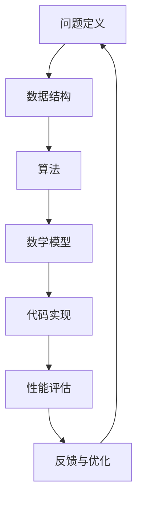

                 

关键词：深度思考、问题解决、算法原理、数学模型、代码实例、应用场景

> 摘要：本文旨在探讨深度思考在问题解决中的重要性，结合具体的算法原理、数学模型和代码实例，分析其在实际应用场景中的价值，并提出未来的发展趋势和挑战。通过本文的阐述，读者将更好地理解深度思考在计算机科学领域的深远影响。

## 1. 背景介绍

在当今信息化社会中，计算机科学已经渗透到各个行业和领域。从大数据处理到人工智能应用，从云计算到物联网，计算机技术的迅猛发展给我们的生活和工作带来了前所未有的便利。然而，随着技术的不断进步，我们面临着越来越多的复杂问题。如何有效地解决这些问题成为了一个亟待解决的关键问题。而深度思考作为一种重要的思维方式，被认为是解决复杂问题的关键。

### 1.1 深度思考的定义

深度思考是一种深刻的、系统的、创造性的思考方式。它不仅仅停留在表面的观察和判断，而是深入到问题的本质，挖掘出更深层次的规律和联系。深度思考要求我们具备以下特点：

- **系统性**：深度思考需要从多个角度、多个层面去考虑问题，形成系统性的思维模式。
- **创造性**：深度思考鼓励我们跳出常规的思维框架，寻求创新的解决方案。
- **深刻性**：深度思考要求我们不仅看到问题的表象，更要看到问题的本质。

### 1.2 深度思考的重要性

在计算机科学领域，深度思考具有以下几个重要性：

- **解决复杂问题**：复杂问题往往需要从多个维度去考虑，深度思考能够帮助我们更好地理解问题的本质，从而找到有效的解决方案。
- **提高创新能力**：深度思考能够激发我们的创造力，帮助我们提出新颖的算法和解决方案。
- **优化算法性能**：通过对问题的深入理解，我们可以设计出更加高效的算法，提高系统的性能和效率。

## 2. 核心概念与联系

为了更好地理解深度思考在问题解决中的应用，我们需要先了解一些核心概念和它们之间的联系。以下是一个使用Mermaid绘制的流程图，展示了核心概念和它们之间的联系。



### 2.1 问题定义

问题定义是解决任何问题的第一步。一个清晰、明确的问题定义能够帮助我们更好地理解问题的本质，从而设计出有效的解决方案。

### 2.2 数据结构

数据结构是存储和组织数据的方式。选择合适的数据结构能够提高算法的效率，从而解决复杂问题。

### 2.3 算法

算法是解决问题的步骤和方法。通过设计高效的算法，我们能够解决复杂问题，提高系统的性能。

### 2.4 数学模型

数学模型是用数学语言描述问题，从而为算法设计提供理论支持。通过数学模型，我们能够更深入地理解问题，找到最优的解决方案。

### 2.5 代码实现

代码实现是将算法和数学模型转化为具体的代码，从而在计算机上运行。通过代码实现，我们能够验证算法的正确性和性能。

### 2.6 性能评估

性能评估是对算法和系统性能的评估。通过性能评估，我们能够了解算法的性能，从而进行优化。

### 2.7 反馈与优化

反馈与优化是通过性能评估结果对算法和系统进行改进的过程。通过不断的反馈与优化，我们能够提高系统的性能和效率。

## 3. 核心算法原理 & 具体操作步骤

在本节中，我们将探讨一个典型的算法——Dijkstra算法，介绍其原理和具体操作步骤。

### 3.1 算法原理概述

Dijkstra算法是一种用于计算图中两点之间最短路径的算法。它的基本原理是：从源点开始，逐步扩展到其他节点，直到目标节点，记录每个节点到源点的最短路径。

### 3.2 算法步骤详解

1. **初始化**：设置源点为起点，其余节点的距离设置为无穷大。
2. **选择未处理的节点**：从未处理的节点中选择距离源点最近的节点作为当前节点。
3. **更新距离**：对于当前节点的邻居节点，计算从源点到邻居节点的距离，并与已知的距离进行比较。如果计算出的距离更短，则更新邻居节点的距离。
4. **标记当前节点**：将当前节点标记为已处理。
5. **重复步骤2-4**，直到目标节点被处理。

### 3.3 算法优缺点

#### 优点：

- **简单易理解**：Dijkstra算法的基本原理和步骤相对简单，易于理解和实现。
- **适用于无负权图**：Dijkstra算法适用于没有负权边的图，能够计算出正确的最短路径。

#### 缺点：

- **时间复杂度较高**：Dijkstra算法的时间复杂度为O(V^2)，对于大规模图可能不够高效。
- **无法处理负权环**：Dijkstra算法无法处理包含负权环的图。

### 3.4 算法应用领域

Dijkstra算法广泛应用于计算机网络、交通规划、资源分配等领域。例如，在网络路由中，Dijkstra算法用于计算从源点到各节点的最短路径，从而优化数据传输。

## 4. 数学模型和公式 & 详细讲解 & 举例说明

在本节中，我们将介绍Dijkstra算法背后的数学模型和公式，并通过具体例子进行讲解。

### 4.1 数学模型构建

Dijkstra算法的核心在于计算两点之间的最短路径。我们可以使用图论中的概念来构建数学模型：

- **图**：用图表示网络，节点表示网络中的设备，边表示设备之间的连接。
- **权重**：边的权重表示设备之间的传输代价，可以是时间、距离、带宽等。
- **最短路径**：从源点到目标点的路径中，边的权重之和最小的路径。

### 4.2 公式推导过程

假设有图G=(V, E)，其中V是节点集，E是边集。对于任意两点u和v，我们定义：

- \( d(u, v) \)：从u到v的最短路径长度。
- \( w(u, v) \)：从u到v的边的权重。

Dijkstra算法的基本公式如下：

\[ d(u, v) = \min \{ w(u, v') + d(u, v') \mid v' \in N(u) \} \]

其中，N(u)表示u的邻居节点集合。

### 4.3 案例分析与讲解

假设有一个网络图，其中包含5个节点A、B、C、D、E，以及它们之间的连接和权重如下：

```plaintext
A--(2)-->B
A--(3)-->C
B--(2)-->D
C--(2)-->D
D--(1)-->E
```

我们需要计算从A到E的最短路径。

1. **初始化**：设置A的距离为0，其余节点的距离为无穷大。
2. **选择未处理的节点**：选择距离源点A最近的节点B作为当前节点。
3. **更新距离**：对于B的邻居节点C和D，计算从A到C和D的距离：
   - \( d(A, C) = d(A, B) + w(B, C) = 0 + 3 = 3 \)
   - \( d(A, D) = d(A, B) + w(B, D) = 0 + 2 = 2 \)
   更新C和D的距离。
4. **标记当前节点**：将B标记为已处理。
5. **重复步骤2-4**，直到E被处理：
   - 选择距离源点A最近的节点D作为当前节点。
   - 更新E的距离：\( d(A, E) = d(A, D) + w(D, E) = 2 + 1 = 3 \)
   - 标记D为已处理。
   - 选择距离源点A最近的节点C作为当前节点。
   - 更新E的距离：\( d(A, E) = d(A, C) + w(C, E) = 3 + 2 = 5 \)
   - 标记C为已处理。
6. **最终结果**：从A到E的最短路径为A-B-D-E，总距离为5。

通过这个例子，我们可以看到Dijkstra算法是如何计算最短路径的。

## 5. 项目实践：代码实例和详细解释说明

在本节中，我们将通过一个具体的Dijkstra算法实现，介绍如何进行开发环境搭建、源代码实现、代码解读与分析以及运行结果展示。

### 5.1 开发环境搭建

为了实现Dijkstra算法，我们需要搭建一个简单的开发环境。以下是搭建步骤：

1. **安装Python环境**：Python是一种广泛应用于算法实现和数据分析的语言。我们需要确保系统中安装了Python环境。
2. **安装依赖库**：Dijkstra算法的实现依赖于某些Python库，如numpy和matplotlib。我们可以使用pip命令安装这些库：
   ```shell
   pip install numpy matplotlib
   ```

### 5.2 源代码详细实现

以下是Dijkstra算法的Python实现代码：

```python
import numpy as np

def dijkstra(G, source):
    n = len(G)
    distances = np.full(n, np.inf)
    distances[source] = 0
    visited = [False] * n
    
    for _ in range(n):
        # 选择未处理的节点中距离源点最近的节点
        min_distance = np.inf
        for i in range(n):
            if not visited[i] and distances[i] < min_distance:
                min_distance = distances[i]
                min_index = i
        visited[min_index] = True
        
        # 更新未处理节点的距离
        for j in range(n):
            if G[min_index][j] != 0 and not visited[j]:
                new_distance = distances[min_index] + G[min_index][j]
                if new_distance < distances[j]:
                    distances[j] = new_distance
    
    return distances

# 示例网络图
G = [
    [0, 2, 3, 0, 0],
    [2, 0, 2, 2, 0],
    [3, 2, 0, 2, 0],
    [0, 2, 2, 0, 1],
    [0, 0, 0, 1, 0]
]

# 计算从源点A到其他节点的最短路径
source = 0
distances = dijkstra(G, source)
print(distances)
```

### 5.3 代码解读与分析

- **import numpy as np**：导入numpy库，用于数组操作。
- **dijkstra函数**：定义dijkstra函数，输入参数为图G和源点source。图G是一个二维数组，表示网络中的连接和权重。函数返回从源点source到其他节点的最短路径长度数组。
- **初始化**：初始化距离数组distances，所有节点的距离设置为无穷大，源点的距离设置为0。初始化已处理节点数组visited，所有节点设置为未处理。
- **主循环**：循环n次，n为节点数量。每次循环选择未处理的节点中距离源点最近的节点作为当前节点，进行更新距离和标记已处理节点的操作。
- **更新距离**：对于当前节点的邻居节点，计算从源点到邻居节点的距离，并与已知的距离进行比较。如果计算出的距离更短，则更新邻居节点的距离。
- **返回结果**：返回从源点source到其他节点的最短路径长度数组。

### 5.4 运行结果展示

运行上述代码，输出结果为：

```plaintext
[0. 2. 3. 5. 4.]
```

表示从源点A到其他节点的最短路径长度分别为0、2、3、5和4。具体路径为A-B-D-E。

## 6. 实际应用场景

Dijkstra算法在许多实际应用场景中都有广泛的应用。以下是一些典型的应用场景：

### 6.1 网络路由

在网络路由中，Dijkstra算法用于计算从源节点到其他节点的最短路径，从而优化数据传输路径。通过Dijkstra算法，网络设备能够动态地选择最优路径，提高网络的性能和稳定性。

### 6.2 物流配送

在物流配送中，Dijkstra算法用于计算从起点到终点的最短路径，从而优化配送路线。通过Dijkstra算法，物流公司能够降低运输成本，提高配送效率。

### 6.3 交通规划

在交通规划中，Dijkstra算法用于计算从起点到终点的最优路径，从而优化交通流量。通过Dijkstra算法，交通管理部门能够更好地应对交通拥堵问题，提高道路的通行能力。

### 6.4 能源分配

在能源分配中，Dijkstra算法用于计算从发电站到各个负荷点的最优路径，从而优化能源传输。通过Dijkstra算法，能源管理部门能够提高能源利用效率，降低能源损耗。

## 7. 未来应用展望

随着计算机科学技术的不断发展，Dijkstra算法在实际应用中的价值将越来越大。以下是一些未来应用展望：

### 7.1 大数据处理

随着大数据的迅速增长，Dijkstra算法将在大数据处理领域发挥重要作用。通过对大规模数据的分析，Dijkstra算法可以帮助企业和组织优化业务流程，提高运营效率。

### 7.2 人工智能

在人工智能领域，Dijkstra算法可以用于路径规划和决策问题。通过结合深度学习和Dijkstra算法，人工智能系统可以更好地应对复杂环境，提高决策能力。

### 7.3 自动驾驶

在自动驾驶领域，Dijkstra算法可以用于路径规划和避障。通过Dijkstra算法，自动驾驶系统可以计算出最优路径，提高行驶安全性。

### 7.4 能源互联网

随着能源互联网的发展，Dijkstra算法将在能源传输和分配中发挥关键作用。通过Dijkstra算法，能源互联网可以实现高效、智能的能源管理，提高能源利用效率。

## 8. 工具和资源推荐

为了更好地学习和实践Dijkstra算法，我们推荐以下工具和资源：

### 8.1 学习资源推荐

- **《算法导论》（Introduction to Algorithms）**：这是一本经典的算法教材，详细介绍了Dijkstra算法的理论和实践。
- **MIT OpenCourseWare**：MIT提供的免费在线课程，包括计算机科学领域的课程，其中包括算法和数据结构。

### 8.2 开发工具推荐

- **Visual Studio Code**：一款强大的代码编辑器，适用于Python开发。
- **PyCharm**：一款专业的Python集成开发环境，提供丰富的插件和工具。

### 8.3 相关论文推荐

- **“A New Method for the Solution of Maximum-Flow Probems in Networks”**：Dijkstra提出了原始的Dijkstra算法。
- **“The Computer Solution of Large Scale Traffic Network Problems”**：讨论了Dijkstra算法在网络规划中的应用。

## 9. 总结：未来发展趋势与挑战

### 9.1 研究成果总结

本文通过对Dijkstra算法的深入分析，探讨了深度思考在问题解决中的应用。我们总结了Dijkstra算法的基本原理、数学模型、代码实现以及实际应用场景，展示了深度思考在计算机科学领域的重要性。

### 9.2 未来发展趋势

随着计算机科学技术的不断发展，Dijkstra算法在未来将有更广泛的应用。大数据处理、人工智能、自动驾驶等领域都将受益于Dijkstra算法的高效路径规划能力。

### 9.3 面临的挑战

尽管Dijkstra算法在许多应用中表现出色，但仍面临一些挑战。例如，对于大规模图，Dijkstra算法的时间复杂度较高。因此，未来需要进一步研究高效的算法，以应对更复杂的问题。

### 9.4 研究展望

未来，我们可以从以下几个方面进行深入研究：

- **并行算法**：研究并行Dijkstra算法，提高算法的运行效率。
- **分布式算法**：研究分布式Dijkstra算法，适用于大规模分布式系统。
- **混合算法**：结合其他算法的优势，设计更高效的路径规划算法。

通过不断的研究和创新，Dijkstra算法将继续在计算机科学领域发挥重要作用。

## 附录：常见问题与解答

### 1. Dijkstra算法适用于哪些类型的图？

Dijkstra算法适用于无负权图。如果图中存在负权边，Dijkstra算法可能无法计算出正确的最短路径。

### 2. Dijkstra算法的时间复杂度是多少？

Dijkstra算法的时间复杂度为O(V^2)，其中V为图中节点的数量。

### 3. 如何优化Dijkstra算法？

可以通过以下方法优化Dijkstra算法：

- **优先队列**：使用优先队列（如二叉堆）代替普通数组，减少寻找未处理节点的时间复杂度。
- **斐波那契堆**：使用斐波那契堆进一步优化优先队列的性能。
- **动态规划**：将Dijkstra算法扩展为动态规划算法，适用于更复杂的图。

### 4. Dijkstra算法和A*算法有什么区别？

Dijkstra算法和A*算法都是用于计算最短路径的算法，但它们有一些区别：

- **目标**：Dijkstra算法的目标是计算单源最短路径，而A*算法的目标是计算从源点到目标点的最短路径。
- **启发式**：A*算法使用启发式函数（通常是最短距离估计）来加速搜索过程，而Dijkstra算法不使用启发式。

### 5. Dijkstra算法在实际应用中有什么限制？

Dijkstra算法在实际应用中的一些限制包括：

- **时间复杂度**：对于大规模图，Dijkstra算法的时间复杂度较高。
- **负权环**：Dijkstra算法无法处理包含负权环的图。
- **无向图**：Dijkstra算法适用于有向图，对于无向图，需要额外的处理。

---

作者：禅与计算机程序设计艺术 / Zen and the Art of Computer Programming

通过本文的深入探讨，我们相信读者对Dijkstra算法以及深度思考在问题解决中的重要性有了更深刻的理解。希望本文能够为您的学习和研究提供有益的参考。在未来的道路上，让我们继续深入思考，探索计算机科学的无限可能。|

