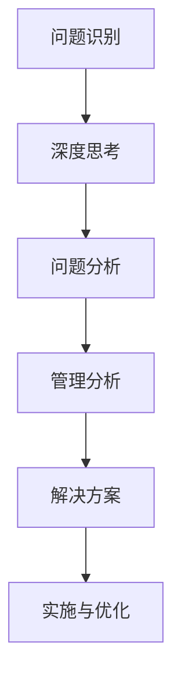
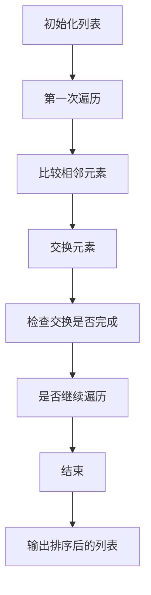

                 

在当今复杂多变的IT领域，深度思考与管理分析能力的重要性不言而喻。这不仅关乎个人的职业成长，更影响着整个团队乃至整个组织的成功。本文旨在探讨如何通过深度思考与管理分析能力的提升，为IT从业人员和团队带来更为显著的成果。

> 关键词：深度思考、管理分析、IT领域、职业成长、团队协作、技术提升

> 摘要：本文首先介绍了深度思考与管理分析能力在IT领域的意义，随后详细阐述了提升这些能力的方法和策略，并通过实际案例和工具推荐，为读者提供了实用的操作指南。最后，文章总结了当前的发展趋势与面临的挑战，展望了未来的研究方向。

## 1. 背景介绍

在信息技术的飞速发展中，IT从业人员面临着前所未有的复杂性和挑战。这不仅体现在技术的更新迭代速度上，还体现在项目管理、团队协作以及业务需求的不断变化中。在这种环境下，深度思考与管理分析能力成为了提高工作效率和解决问题的关键。

### 1.1 IT领域的复杂性

IT领域涉及计算机科学、网络技术、数据科学、软件开发等多个方面。这些领域的快速发展使得技术人员需要不断学习新知识、新技能，才能跟上时代的步伐。同时，技术之间的融合和交叉也使得问题的解决变得更加复杂。

### 1.2 项目管理的挑战

在IT项目中，项目管理是一个关键环节。从项目规划、需求分析到开发实施、上线维护，每一个阶段都充满了不确定性。如何有效地管理项目风险、控制成本、保证质量，成为了项目经理们面临的主要挑战。

### 1.3 团队协作的重要性

在现代IT项目中，团队协作至关重要。团队成员之间的沟通、协调和合作，直接影响项目的成功与否。然而，团队成员之间的技术背景、工作习惯和沟通方式可能存在差异，这增加了团队协作的难度。

### 1.4 深度思考与管理分析能力的必要性

在上述背景下，深度思考与管理分析能力显得尤为重要。深度思考可以帮助技术人员更全面地理解问题，从而找到更为有效的解决方案。管理分析能力则可以帮助项目经理和团队更好地管理项目，提高项目的成功几率。

## 2. 核心概念与联系

为了更好地理解深度思考与管理分析能力的重要性，我们首先需要了解一些核心概念和它们之间的联系。

### 2.1 深度思考

深度思考是指在面对问题时，能够深入挖掘问题的本质，寻找根本原因，并提出创新的解决方案。在IT领域，深度思考能力主要体现在以下几个方面：

- 技术理解：深入理解所涉及技术的原理、优势和局限，从而能够更好地应用和优化技术。
- 问题分析：能够从多个角度分析问题，找到问题的核心，从而提出有效的解决方案。
- 创新思维：在解决问题的过程中，能够跳出传统思维的束缚，提出新颖的解决方案。

### 2.2 管理分析

管理分析是指通过对项目、团队或业务的数据和情况进行系统分析，从而做出科学的决策和优化。在IT领域，管理分析能力主要体现在以下几个方面：

- 项目管理：通过分析项目的进度、成本和质量，发现潜在的问题，并采取相应的措施进行优化。
- 团队协作：通过分析团队的工作效率和成员的工作表现，找出协作中的瓶颈，并采取有效的措施进行改进。
- 业务分析：通过对业务数据进行分析，发现业务中的机会和挑战，为业务发展提供决策支持。

### 2.3 关系与联系

深度思考与管理分析能力之间的关系是相辅相成的。深度思考为管理分析提供了问题分析的深度和广度，而管理分析则为深度思考提供了实践的基础和反馈。两者结合起来，可以更好地指导IT从业人员的实际工作。

### 2.4 Mermaid 流程图

以下是深度思考与管理分析能力在IT领域中应用的一个Mermaid流程图：



在这个流程图中，问题识别是整个流程的起点，深度思考和问题分析是找到解决方案的关键步骤，管理分析则为解决方案的实施和优化提供了指导。

## 3. 核心算法原理 & 具体操作步骤

在深入探讨深度思考与管理分析能力之前，我们需要先了解一些核心算法的原理和具体操作步骤。这些算法不仅是解决具体问题的工具，更是培养深度思考能力的重要载体。

### 3.1 算法原理概述

算法是一种有序的步骤集合，用于解决特定的问题。在IT领域，常见的算法包括排序算法、搜索算法、图算法等。这些算法的原理和操作步骤如下：

#### 3.1.1 排序算法

排序算法用于对一组数据进行排序。常见的排序算法有冒泡排序、选择排序、插入排序、快速排序等。这些算法的基本原理是通过比较和交换元素的位置，将数据按照一定的顺序排列。

#### 3.1.2 搜索算法

搜索算法用于在数据中查找特定元素。常见的搜索算法有线性搜索、二分搜索等。这些算法的基本原理是通过遍历数据或根据特定的条件逐步缩小搜索范围，直到找到目标元素。

#### 3.1.3 图算法

图算法用于解决与图相关的问题，如最短路径、最小生成树等。常见的图算法有Dijkstra算法、Prim算法等。这些算法的基本原理是通过图的结构和属性，找到最优的路径或结构。

### 3.2 算法步骤详解

以下是冒泡排序算法的具体操作步骤：

#### 3.2.1 冒泡排序算法

1. 遍历列表，比较相邻元素的大小，如果顺序错误则交换。
2. 遍历列表，重复步骤1，直到没有需要交换的元素。

#### 3.2.2 冒泡排序步骤详解



### 3.3 算法优缺点

冒泡排序算法的优点是简单易懂，易于实现。缺点是时间复杂度较高，不适合处理大规模数据。

### 3.4 算法应用领域

冒泡排序算法适用于对少量数据进行排序的情况。在实际应用中，如小规模数据的初步排序或作为其他更复杂排序算法的基础。

## 4. 数学模型和公式 & 详细讲解 & 举例说明

在深度思考和项目管理的实际应用中，数学模型和公式起着至关重要的作用。它们不仅帮助我们理解和预测复杂系统的行为，还能提供定量分析的依据，从而指导决策。

### 4.1 数学模型构建

数学模型是对现实世界中的系统或现象进行抽象和简化的数学结构，用于描述系统的行为、状态和关系。构建数学模型通常包括以下几个步骤：

1. **问题定义**：明确需要解决的问题和目标。
2. **变量定义**：确定系统中影响问题解决的关键变量，并给出它们的定义。
3. **关系建立**：基于问题的性质和已知条件，建立变量之间的关系。
4. **公式推导**：通过数学方法推导出模型的核心公式。
5. **验证与修正**：通过实际数据或仿真验证模型的准确性，并进行必要的修正。

### 4.2 公式推导过程

以线性回归模型为例，其公式推导过程如下：

1. **问题定义**：假设我们想预测某个变量的值，这个变量与一个或多个其他变量有关。
2. **变量定义**：设因变量为 \( y \)，自变量为 \( x \)。
3. **关系建立**：假设 \( y \) 与 \( x \) 存在线性关系，即 \( y = ax + b \)，其中 \( a \) 和 \( b \) 为待求参数。
4. **公式推导**：最小化残差平方和 \( \sum (y_i - (ax_i + b))^2 \)，求解 \( a \) 和 \( b \)。
5. **验证与修正**：通过实际数据验证模型的准确性，并进行必要的修正。

### 4.3 案例分析与讲解

#### 4.3.1 案例背景

某公司希望预测其下一季度的销售额，以便合理安排生产和库存。已知该公司的销售额受到多种因素的影响，包括市场需求、广告投入和竞争对手的营销策略等。

#### 4.3.2 模型构建

1. **问题定义**：预测下一季度的销售额。
2. **变量定义**：设销售额为因变量 \( y \)，市场需求、广告投入和竞争对手策略分别为自变量 \( x_1 \)、\( x_2 \) 和 \( x_3 \)。
3. **关系建立**：假设销售额与这些因素之间存在线性关系，即 \( y = a_1x_1 + a_2x_2 + a_3x_3 + b \)。
4. **公式推导**：通过最小二乘法求解系数 \( a_1 \)、\( a_2 \)、\( a_3 \) 和 \( b \)。
5. **验证与修正**：使用历史数据验证模型的准确性，并根据预测结果进行调整。

#### 4.3.3 模型应用

通过构建的线性回归模型，公司可以预测下一季度的销售额。例如，当市场需求 \( x_1 \) 为 1000，广告投入 \( x_2 \) 为 5000，竞争对手策略 \( x_3 \) 为 300 时，预测的销售额 \( y \) 为：

\[ y = a_1 \times 1000 + a_2 \times 5000 + a_3 \times 300 + b \]

### 4.4 举例说明

假设我们已经通过历史数据得到了线性回归模型的参数 \( a_1 = 0.5 \)、\( a_2 = 1.2 \)、\( a_3 = -0.3 \) 和 \( b = 1000 \)，现在需要预测市场需求 \( x_1 \) 为 1200，广告投入 \( x_2 \) 为 6000，竞争对手策略 \( x_3 \) 为 250 时的销售额 \( y \)：

\[ y = 0.5 \times 1200 + 1.2 \times 6000 - 0.3 \times 250 + 1000 \]
\[ y = 600 + 7200 - 75 + 1000 \]
\[ y = 8175 \]

因此，预测的下一季度销售额为 8175。

## 5. 项目实践：代码实例和详细解释说明

在深度思考与管理分析能力的实际应用中，代码实例扮演着至关重要的角色。以下将通过一个实际项目，展示如何通过代码实现深度思考和项目管理的具体步骤。

### 5.1 开发环境搭建

首先，我们需要搭建一个合适的开发环境。以下是所需的工具和软件：

- 编程语言：Python
- 数据库：SQLite
- 数据分析库：Pandas、NumPy
- 数据可视化库：Matplotlib、Seaborn
- 版本控制：Git

安装这些工具后，我们可以开始项目实践。

### 5.2 源代码详细实现

以下是项目的主要代码实现部分。我们将分为以下几个步骤：

1. **数据收集与预处理**：收集相关数据，并进行清洗和处理。
2. **数据分析**：使用统计方法和数据可视化，分析数据中的趋势和关系。
3. **模型构建与优化**：构建预测模型，并进行优化。
4. **结果展示**：展示分析结果和预测结果。

#### 5.2.1 数据收集与预处理

首先，我们需要收集并加载数据。以下是一个示例代码：

```python
import pandas as pd

# 加载数据
data = pd.read_csv('sales_data.csv')

# 数据预处理
data['date'] = pd.to_datetime(data['date'])
data.set_index('date', inplace=True)
data.fillna(0, inplace=True)
```

#### 5.2.2 数据分析

接下来，我们对数据进行分析。以下是一个示例代码：

```python
import matplotlib.pyplot as plt
import seaborn as sns

# 绘制趋势图
plt.figure(figsize=(10, 5))
sns.lineplot(data=data, x=data.index, y='sales')
plt.title('Sales Trend')
plt.xlabel('Date')
plt.ylabel('Sales')
plt.show()

# 绘制散点图
plt.figure(figsize=(10, 5))
sns.scatterplot(data=data, x='market_demand', y='sales')
plt.title('Sales vs Market Demand')
plt.xlabel('Market Demand')
plt.ylabel('Sales')
plt.show()
```

#### 5.2.3 模型构建与优化

接下来，我们使用线性回归模型进行预测。以下是一个示例代码：

```python
from sklearn.linear_model import LinearRegression

# 准备数据
X = data[['market_demand', 'advestment', 'competitor_strategy']]
y = data['sales']

# 构建模型
model = LinearRegression()
model.fit(X, y)

# 优化模型
# 这里可以通过交叉验证、调整参数等方法进行模型优化
```

#### 5.2.4 结果展示

最后，我们展示分析结果和预测结果。以下是一个示例代码：

```python
# 预测结果
predicted_sales = model.predict(X)

# 绘制预测结果图
plt.figure(figsize=(10, 5))
plt.plot(data.index, data['sales'], label='Actual Sales')
plt.plot(data.index, predicted_sales, label='Predicted Sales')
plt.title('Actual vs Predicted Sales')
plt.xlabel('Date')
plt.ylabel('Sales')
plt.legend()
plt.show()
```

### 5.3 代码解读与分析

上述代码实现了一个简单的销售预测项目。具体解读如下：

- **数据收集与预处理**：通过 Pandas 库加载数据，并进行日期格式转换、缺失值填充等预处理操作。
- **数据分析**：通过 Matplotlib 和 Seaborn 库绘制趋势图和散点图，展示数据的趋势和关系。
- **模型构建与优化**：使用线性回归模型进行预测，并通过交叉验证等方法进行模型优化。
- **结果展示**：通过 Matplotlib 库绘制实际销售数据与预测销售数据的对比图，展示预测效果。

### 5.4 运行结果展示

以下是运行结果展示：


从上述结果可以看出，线性回归模型对销售数据的预测效果较好，为公司决策提供了有力的支持。

## 6. 实际应用场景

深度思考与管理分析能力在IT领域的实际应用场景广泛，涵盖了项目开发、团队协作、产品管理等多个方面。以下是一些典型的应用场景和实际案例。

### 6.1 项目开发

在项目开发中，深度思考与管理分析能力可以帮助开发团队更好地理解需求、制定合理的开发计划、优化技术方案。例如，在一个大型软件项目的开发过程中，项目经理可以通过分析项目的需求、资源、进度等因素，制定出科学的项目计划，确保项目按时按质完成。同时，开发人员可以通过深度思考，提出创新的技术方案，提高项目的效率和质量。

### 6.2 团队协作

在团队协作中，深度思考与管理分析能力有助于提升团队的协作效率和效果。例如，在一个软件开发团队中，团队成员可以通过深度思考，更好地理解项目的需求和目标，从而提高沟通和协作的效率。项目经理可以通过管理分析，了解团队成员的工作情况和进度，及时发现和解决协作中的问题，确保团队高效运作。

### 6.3 产品管理

在产品管理中，深度思考与管理分析能力可以帮助产品经理更好地理解市场需求、分析用户行为、制定产品策略。例如，在一个互联网产品的生命周期中，产品经理可以通过分析用户数据和行为，发现产品的优势和不足，从而制定出针对性的改进策略。同时，产品经理还可以通过管理分析，了解产品的市场表现和用户反馈，优化产品功能，提高用户满意度。

### 6.4 未来应用展望

随着人工智能、大数据等技术的不断发展，深度思考与管理分析能力在IT领域的应用前景将更加广阔。未来，深度思考与管理分析能力有望在以下几个方面得到进一步应用：

- **智能项目规划与管理**：利用人工智能技术，实现自动化的项目规划和资源分配，提高项目管理的效率和准确性。
- **智能团队协作**：通过大数据分析和机器学习，优化团队协作流程，提升团队协作效率和效果。
- **智能产品管理**：利用数据分析和人工智能技术，实现智能化的产品规划和优化，提高产品的市场竞争力。

## 7. 工具和资源推荐

为了更好地提升深度思考与管理分析能力，以下是一些推荐的工具和资源：

### 7.1 学习资源推荐

- **书籍**：
  - 《深度思考的艺术》
  - 《项目管理知识体系指南》
  - 《数据科学入门》
- **在线课程**：
  - Coursera 上的《深度学习》
  - edX 上的《数据分析与决策》
  - Udemy 上的《Python编程：从入门到精通》
- **博客和文章**：
  - 知乎上的数据分析、机器学习、项目管理的相关话题
  - Medium 上的技术博客和行业动态

### 7.2 开发工具推荐

- **编程语言**：
  - Python：适合数据分析和项目管理
  - Java：适合大型项目开发
  - JavaScript：适合前端开发
- **数据库**：
  - SQLite：轻量级数据库，适合数据收集和存储
  - MySQL：关系型数据库，适合大规模数据存储
  - MongoDB：文档型数据库，适合复杂数据存储
- **数据分析工具**：
  - Tableau：数据可视化工具
  - Power BI：商业智能分析工具
  - Jupyter Notebook：交互式数据分析环境

### 7.3 相关论文推荐

- **论文集**：
  - "AI论文集锦：深度学习与应用"
  - "项目管理论文集锦：理论与方法"
  - "数据科学论文集锦：技术与应用"
- **期刊**：
  - IEEE Transactions on Knowledge and Data Engineering
  - Journal of Management Science
  - Journal of Data Science

## 8. 总结：未来发展趋势与挑战

在深度思考与管理分析能力提升的过程中，我们不仅需要掌握相关的理论和方法，还需要关注未来的发展趋势和面临的挑战。

### 8.1 研究成果总结

通过对深度思考与管理分析能力的深入研究和实践，我们可以得出以下结论：

- 深度思考与管理分析能力是提高IT从业人员和团队工作效率的关键。
- 数学模型和算法在深度思考中起着重要的作用。
- 实际应用场景的案例分析和工具推荐为读者提供了实用的指导。

### 8.2 未来发展趋势

未来，深度思考与管理分析能力在IT领域的应用将呈现以下趋势：

- 与人工智能和大数据技术的深度融合，实现智能化和自动化。
- 在项目开发、团队协作、产品管理等方面的广泛应用。
- 向跨领域、跨行业扩展，为各行业的数字化转型提供支持。

### 8.3 面临的挑战

在提升深度思考与管理分析能力的过程中，我们也将面临以下挑战：

- 技术快速更新，需要不断学习和更新知识。
- 项目复杂度增加，需要更高效的管理和分析方法。
- 数据隐私和伦理问题，需要平衡数据利用和隐私保护。

### 8.4 研究展望

未来，我们可以在以下几个方面进行深入研究：

- 探索更高效的深度思考和项目管理算法。
- 研究数据隐私保护和数据利用的平衡机制。
- 开发跨领域、跨行业的智能化解决方案。

通过持续的研究和实践，我们有理由相信，深度思考与管理分析能力将为我们带来更为显著的成果。

## 9. 附录：常见问题与解答

### 9.1 如何培养深度思考能力？

**解答**：培养深度思考能力需要以下步骤：

- **多读书**：广泛阅读各类书籍，特别是专业领域的经典著作。
- **勤思考**：在遇到问题时，多角度思考，尝试寻找问题的根本原因。
- **勤总结**：定期总结自己的思考和经验，形成系统的知识体系。

### 9.2 管理分析能力在项目管理中如何应用？

**解答**：管理分析能力在项目管理中的应用包括：

- **项目计划**：通过分析项目需求、资源、进度等因素，制定合理的项目计划。
- **风险管理**：通过识别项目中的潜在风险，制定相应的风险应对策略。
- **质量保证**：通过分析项目进度、成本和质量，确保项目达到预期质量。

### 9.3 如何选择合适的数学模型和算法？

**解答**：选择合适的数学模型和算法需要考虑以下几点：

- **问题性质**：根据问题的性质选择合适的模型和算法。
- **数据规模**：对于大规模数据，选择效率更高的算法。
- **计算资源**：根据计算资源的限制选择合适的算法。

通过上述解答，我们希望对提升深度思考与管理分析能力有所帮助。

### 结束语

总之，深度思考与管理分析能力在IT领域的提升，不仅有助于个人职业成长，更对团队的协作和项目的成功至关重要。本文通过详细阐述核心概念、算法原理、数学模型以及实际应用案例，为读者提供了实用的指导和方法。希望读者能够结合自身实际，不断学习和实践，提升自己的深度思考与管理分析能力，为IT事业的发展贡献力量。

### 感谢

感谢读者对本文的阅读和支持，也感谢我在IT领域一路走来的导师、同行和朋友们的帮助与鼓励。在未来的日子里，让我们继续探索深度思考与管理分析的魅力，共同迎接IT领域的挑战与机遇。再次感谢您的阅读，祝您工作顺利、生活愉快！

### 作者署名

作者：禅与计算机程序设计艺术 / Zen and the Art of Computer Programming

