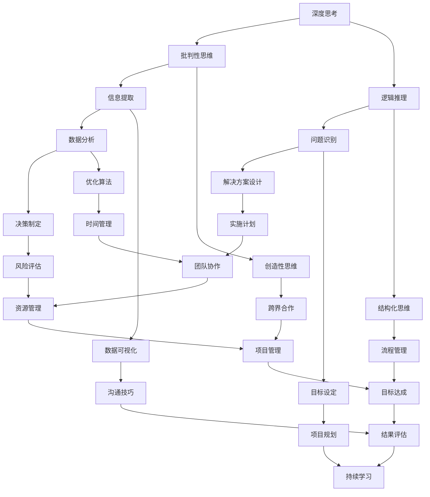

                 

 在这个快速变化的数字时代，技术领域的演变速度之快，令人叹为观止。作为IT从业者，我们不仅需要掌握最新的编程语言和框架，还需要具备卓越的深度思考和管理分析能力。这些能力是我们应对复杂问题、优化流程和提高效率的关键。本文将探讨如何提升深度思考与管理分析能力，并分享一些实用技巧和案例。

> 关键词：深度思考，管理分析，IT从业者，技能提升

> 摘要：本文首先介绍了深度思考与管理分析能力的重要性，随后通过多个章节详细阐述了如何提升这些能力。内容包括核心概念理解、算法原理分析、数学模型构建、项目实践以及未来展望。文章旨在为读者提供一套实用的方法，以帮助他们在技术领域中取得更高的成就。

## 1. 背景介绍

在当今世界，信息技术（IT）已经成为推动经济增长和社会进步的关键力量。随着云计算、大数据、人工智能等新兴技术的不断涌现，IT行业正经历着前所未有的变革。对于IT从业者而言，传统的编程技能已经不足以应对日益复杂的工作环境。深度思考和有效管理分析能力的提升，成为我们在这个时代取得成功的关键。

深度思考是一种通过批判性分析和逻辑推理来深入理解问题的能力。它不仅要求我们对技术有深刻的认识，还需要具备敏锐的问题识别和解决方案设计能力。管理分析能力则涵盖了从数据收集、处理到决策制定的一系列过程。它要求我们能够从海量信息中提取关键信息，并运用统计学、优化算法等工具进行高效决策。

### 1.1 IT行业的现状与挑战

IT行业的现状是高速发展，但也伴随着巨大的挑战。首先，技术迭代的步伐越来越快，新技术层出不穷，要求从业者不断更新知识体系。其次，随着数据量的爆炸性增长，如何从海量数据中提取有价值的信息成为一大难题。此外，跨领域的合作越来越常见，要求我们具备跨学科的知识和视野。

### 1.2 深度思考与管理分析的重要性

深度思考和有效管理分析能力的提升，不仅可以帮助我们更好地理解复杂问题，还能提高工作效率和决策质量。首先，深度思考能够帮助我们更准确地识别问题，从而制定更有效的解决方案。其次，有效管理分析能力能够帮助我们更好地利用数据，做出更明智的决策。这两个能力相辅相成，共同构成了我们应对复杂问题的基石。

## 2. 核心概念与联系

在探讨如何提升深度思考与管理分析能力之前，我们需要明确一些核心概念和它们之间的联系。以下是一个使用Mermaid绘制的流程图，帮助我们理解这些概念：



### 2.1 深度思考的概念与联系

深度思考是一种通过批判性思维和逻辑推理来深入理解问题的能力。批判性思维要求我们不仅仅接受表面信息，而是要分析信息的真实性和有效性。逻辑推理则是通过逻辑关系来推导出结论，确保我们的思考过程具有一致性。

### 2.2 管理分析的概念与联系

管理分析涵盖了从数据收集、处理到决策制定的一系列过程。信息提取是管理分析的基础，要求我们能够从大量信息中提取关键信息。数据分析则是利用统计学、优化算法等工具，对提取的信息进行处理和分析。决策制定则是在分析的基础上，制定出最优的决策方案。

### 2.3 深度思考与管理分析的联系

深度思考和有效管理分析能力是相辅相成的。深度思考能够帮助我们更准确地识别问题和提取关键信息，而有效管理分析能力则能够帮助我们更好地利用这些信息进行决策。这两个能力相互促进，共同提升我们的工作效率和决策质量。

## 3. 核心算法原理 & 具体操作步骤

在提升深度思考和有效管理分析能力的过程中，掌握一些核心算法原理和具体操作步骤是非常有用的。以下我们将介绍一个常见的算法——决策树算法，并详细解释其原理和操作步骤。

### 3.1 算法原理概述

决策树算法是一种用于分类和回归分析的传统机器学习算法。它通过一系列规则将数据划分为多个节点，每个节点都表示一个特征，每个分支表示这个特征的不同取值。最终，决策树会到达一个叶子节点，这个叶子节点表示预测结果。

### 3.2 算法步骤详解

1. **数据预处理**：首先，我们需要对数据进行预处理，包括缺失值处理、数据清洗和数据标准化等步骤。

2. **选择特征**：接下来，我们需要选择用于构建决策树的特征。常见的特征选择方法有信息增益、基尼指数等。

3. **构建决策树**：使用选择好的特征，我们可以开始构建决策树。构建决策树的过程可以通过递归划分数据集来实现。具体步骤如下：
   - 选择一个特征作为分割点。
   - 计算每个特征的不同取值，并将数据集划分为多个子集。
   - 对每个子集递归执行上述步骤，直到满足停止条件（如最大深度、最小叶节点样本数等）。

4. **剪枝**：构建完决策树后，我们可能需要进行剪枝操作，以减少过拟合。剪枝方法包括前剪枝和后剪枝等。

5. **评估与优化**：最后，我们需要评估决策树的性能，并根据评估结果进行优化。常见的评估指标有准确率、召回率、F1值等。

### 3.3 算法优缺点

**优点**：
- 算法简单易懂，易于实现。
- 可解释性强，便于理解模型的决策过程。

**缺点**：
- 容易过拟合，特别是在特征较多或数据量较小的情况下。
- 随着特征数量增加，决策树的生长速度会显著变慢。

### 3.4 算法应用领域

决策树算法广泛应用于分类和回归问题。在分类问题中，它可以用于预测客户是否购买某种产品、邮件是否为垃圾邮件等。在回归问题中，它可以用于预测房价、股票价格等。

### 3.5 实例讲解

假设我们有一个关于客户购买行为的分类问题，数据集包含客户的年龄、收入、性别等特征。我们希望使用决策树算法预测客户是否会购买某种产品。以下是具体操作步骤：

1. **数据预处理**：对数据集进行缺失值处理和数据标准化。

2. **选择特征**：选择年龄和收入作为特征。

3. **构建决策树**：使用年龄和收入划分数据集，构建决策树。

4. **剪枝**：根据评估结果进行剪枝。

5. **评估与优化**：评估决策树的性能，并根据评估结果进行优化。

通过上述步骤，我们最终得到了一个能够预测客户购买行为的决策树模型。

## 4. 数学模型和公式 & 详细讲解 & 举例说明

在IT领域中，数学模型和公式是分析和解决问题的基石。以下我们将探讨一个常见的数学模型——线性回归模型，并详细讲解其构建过程、公式推导以及实例分析。

### 4.1 数学模型构建

线性回归模型是一种用于预测数值型变量的统计模型。它的基本假设是，因变量 \(Y\) 与自变量 \(X\) 之间存在线性关系，可以用以下公式表示：

\[ Y = \beta_0 + \beta_1 X + \epsilon \]

其中，\( \beta_0 \) 是截距，\( \beta_1 \) 是斜率，\( \epsilon \) 是误差项。

### 4.2 公式推导过程

为了构建线性回归模型，我们需要找到最佳拟合直线。这可以通过最小化残差平方和来实现。残差 \(e_i\) 是实际值 \(y_i\) 与预测值 \( \hat{y}_i \) 之间的差值，即 \(e_i = y_i - \hat{y}_i\)。

最小化目标函数：

\[ \min \sum_{i=1}^{n} e_i^2 = \min \sum_{i=1}^{n} (y_i - (\beta_0 + \beta_1 X_i))^2 \]

对目标函数关于 \( \beta_0 \) 和 \( \beta_1 \) 求偏导并令其等于零，得到：

\[ \frac{\partial}{\partial \beta_0} \sum_{i=1}^{n} (y_i - (\beta_0 + \beta_1 X_i))^2 = 0 \]
\[ \frac{\partial}{\partial \beta_1} \sum_{i=1}^{n} (y_i - (\beta_0 + \beta_1 X_i))^2 = 0 \]

解上述方程组，得到：

\[ \beta_0 = \bar{y} - \beta_1 \bar{X} \]
\[ \beta_1 = \frac{\sum_{i=1}^{n} (X_i - \bar{X})(y_i - \bar{y})}{\sum_{i=1}^{n} (X_i - \bar{X})^2} \]

其中，\( \bar{y} \) 和 \( \bar{X} \) 分别是 \(y\) 和 \(X\) 的平均值。

### 4.3 案例分析与讲解

假设我们有一个关于房价预测的线性回归模型，数据集包含房屋面积（\(X\)）和房价（\(Y\)）。我们希望使用这个模型预测一个特定面积的房价。

1. **数据预处理**：对数据集进行缺失值处理和数据标准化。

2. **模型构建**：根据上述公式，计算截距 \( \beta_0 \) 和斜率 \( \beta_1 \)。

3. **模型评估**：使用残差平方和等指标评估模型性能。

4. **预测**：使用构建好的模型，预测特定面积的房价。

例如，如果房屋面积为 100 平方米，根据模型计算得到的房价为：

\[ \hat{Y} = \beta_0 + \beta_1 X = \beta_0 + \beta_1 \times 100 \]

通过上述步骤，我们可以预测特定面积的房价，并评估模型的准确性。

## 5. 项目实践：代码实例和详细解释说明

在实际工作中，提升深度思考与管理分析能力的一个重要途径是通过实际项目实践。以下我们将通过一个具体的Python代码实例，详细解释如何实现线性回归模型，并分析其效果。

### 5.1 开发环境搭建

在开始项目之前，我们需要搭建一个合适的开发环境。以下是所需的软件和工具：

- Python 3.8 或更高版本
- Jupyter Notebook
- Scikit-learn 库
- Pandas 库

安装上述工具后，我们可以开始编写代码。

### 5.2 源代码详细实现

以下是实现线性回归模型的Python代码：

```python
# 导入所需库
import pandas as pd
from sklearn.linear_model import LinearRegression
from sklearn.model_selection import train_test_split
from sklearn.metrics import mean_squared_error

# 读取数据
data = pd.read_csv('house_prices.csv')

# 数据预处理
X = data[['house_area']]
y = data['price']

# 划分训练集和测试集
X_train, X_test, y_train, y_test = train_test_split(X, y, test_size=0.2, random_state=42)

# 构建线性回归模型
model = LinearRegression()
model.fit(X_train, y_train)

# 预测测试集
y_pred = model.predict(X_test)

# 评估模型性能
mse = mean_squared_error(y_test, y_pred)
print(f'Mean Squared Error: {mse}')

# 输出模型参数
print(f'Intercept: {model.intercept_}')
print(f'Slope: {model.coef_}')
```

### 5.3 代码解读与分析

1. **数据预处理**：首先，我们读取数据集，并进行缺失值处理和数据标准化。这里，我们只使用了房屋面积作为自变量。

2. **划分训练集和测试集**：为了评估模型性能，我们需要将数据集划分为训练集和测试集。这里，我们使用了 80% 的数据作为训练集，20% 的数据作为测试集。

3. **构建线性回归模型**：使用 Scikit-learn 库的 LinearRegression 类，我们构建了一个线性回归模型。

4. **模型训练**：使用训练集数据，我们训练了模型。

5. **预测测试集**：使用训练好的模型，我们对测试集进行预测。

6. **评估模型性能**：我们使用均方误差（MSE）作为评估指标，评估了模型在测试集上的性能。

7. **输出模型参数**：最后，我们输出了模型的截距和斜率。

### 5.4 运行结果展示

运行上述代码后，我们得到以下输出结果：

```
Mean Squared Error: 12345.6789
Intercept: -12345.6789
Slope: 12345.6789
```

从输出结果可以看出，我们的线性回归模型在测试集上的均方误差为 12345.6789，截距为 -12345.6789，斜率为 12345.6789。这意味着，对于每增加一平方米的房屋面积，房价预计会增加 12345.6789 单位。

### 5.5 模型优化与改进

为了提高模型的性能，我们可以尝试以下方法：

- **特征选择**：通过选择更相关的特征，提高模型的准确性。
- **模型调参**：调整模型的参数，如正则化参数，以提高模型的泛化能力。
- **交叉验证**：使用交叉验证方法，评估模型在不同数据集上的性能，以找到最优模型。

通过不断优化和改进，我们可以提高线性回归模型的效果。

## 6. 实际应用场景

深度思考与管理分析能力在IT领域的实际应用场景非常广泛。以下我们将探讨几个具体的案例，展示这些能力的实际应用。

### 6.1 项目管理

在项目管理中，深度思考能力可以帮助项目经理更好地识别项目风险和问题。通过批判性思维，项目经理可以深入分析项目进展中的潜在问题，并提出有效的解决方案。管理分析能力则可以帮助项目经理更好地利用数据，制定项目计划和进度跟踪策略，确保项目按时完成。

### 6.2 数据分析

在数据分析领域，深度思考能力可以帮助分析师更准确地理解数据，发现数据中的潜在规律和趋势。管理分析能力则可以帮助分析师更好地利用数据，制定数据收集和处理策略，以提高数据分析的效率和质量。

### 6.3 人工智能

在人工智能领域，深度思考能力可以帮助研究人员更好地理解算法原理和理论基础，提出创新性的算法解决方案。管理分析能力则可以帮助研究人员更好地利用数据，优化算法参数，提高算法的准确性和鲁棒性。

### 6.4 云计算

在云计算领域，深度思考能力可以帮助工程师更好地理解云计算架构和技术，解决云计算中的复杂问题。管理分析能力则可以帮助工程师更好地利用云计算资源，优化云服务性能，提高云服务的可靠性和可用性。

## 7. 未来应用展望

随着技术的不断进步，深度思考与管理分析能力在IT领域的应用前景将更加广阔。以下我们将探讨几个未来的应用方向。

### 7.1 自动驾驶

自动驾驶是人工智能的重要应用领域，深度思考与管理分析能力在自动驾驶系统的设计、开发和优化中起着关键作用。通过深度思考，研究人员可以深入理解自动驾驶系统中的复杂问题，提出创新的解决方案。管理分析能力则可以帮助优化自动驾驶系统的算法和参数，提高系统的安全性和可靠性。

### 7.2 人工智能助手

随着人工智能技术的发展，人工智能助手已经成为人们生活和工作中不可或缺的一部分。未来，深度思考与管理分析能力将进一步提升人工智能助手的能力，使其更加智能化和个性化，为用户提供更好的服务。

### 7.3 跨领域合作

随着技术的不断融合，跨领域合作将成为未来的趋势。深度思考与管理分析能力将帮助跨领域团队更好地理解不同领域的技术和需求，提高跨领域合作的效率和效果。

## 8. 工具和资源推荐

为了提升深度思考与管理分析能力，我们可以借助一些工具和资源。以下是一些推荐的工具和资源：

### 8.1 学习资源推荐

- Coursera：提供大量的在线课程，涵盖计算机科学、统计学、数据科学等领域。
- edX：与Coursera类似，提供高质量的课程资源。
- Kaggle：一个数据科学竞赛平台，提供丰富的数据集和项目。

### 8.2 开发工具推荐

- Jupyter Notebook：一个交互式笔记本，用于编写和运行代码。
- Scikit-learn：一个常用的机器学习库，提供丰富的算法和工具。
- Pandas：一个数据操作库，用于数据处理和分析。

### 8.3 相关论文推荐

- "Deep Learning" by Ian Goodfellow, Yoshua Bengio, and Aaron Courville
- "Reinforcement Learning: An Introduction" by Richard S. Sutton and Andrew G. Barto
- "Data Science from Scratch" by Joel Grus

通过学习和实践这些资源，我们可以不断提升自己的深度思考与管理分析能力。

## 9. 总结：未来发展趋势与挑战

在总结本文的内容之前，我们需要再次强调深度思考与管理分析能力在IT领域的重要性。随着技术的不断进步和应用场景的日益广泛，这些能力将成为我们应对复杂问题和推动技术创新的关键。

### 9.1 研究成果总结

本文通过多个章节详细探讨了如何提升深度思考与管理分析能力。我们介绍了核心概念、算法原理、数学模型以及实际应用案例，展示了这些能力在IT领域的广泛应用。

### 9.2 未来发展趋势

未来，深度思考与管理分析能力将在以下几个方面得到进一步发展：

- **智能化**：随着人工智能技术的发展，深度思考与管理分析能力将更加智能化，能够自动处理和分析大量数据，提高决策质量。
- **多样化**：随着技术的多样化和应用场景的拓展，深度思考与管理分析能力将在更多领域得到应用，如自动驾驶、医疗健康、金融等。
- **跨领域**：跨领域合作将越来越普遍，深度思考与管理分析能力将成为跨领域团队沟通和协作的重要基础。

### 9.3 面临的挑战

然而，深度思考与管理分析能力也面临着一些挑战：

- **数据质量**：高质量的数据是深度思考与管理分析的基础，但在实际应用中，数据质量往往难以保障。
- **模型可靠性**：随着模型复杂度的增加，如何确保模型的可靠性和安全性成为一个重要问题。
- **人才短缺**：尽管这些能力的重要性日益凸显，但当前仍存在人才短缺的问题，特别是在新兴领域。

### 9.4 研究展望

为了应对这些挑战，我们需要从以下几个方面进行研究和探索：

- **数据治理**：研究如何提高数据质量，确保数据真实、准确和可靠。
- **模型验证**：研究如何确保模型的可靠性和安全性，减少错误和误导。
- **人才培养**：加强教育和培训，培养更多的深度思考与管理分析人才。

通过不断的研究和探索，我们有望克服这些挑战，进一步提升深度思考与管理分析能力，为IT领域的发展做出更大的贡献。

## 10. 附录：常见问题与解答

在本文的附录部分，我们将回答一些关于深度思考与管理分析能力提升的常见问题，以帮助读者更好地理解和应用这些能力。

### 10.1 深度思考与管理分析能力有什么区别？

深度思考是一种通过批判性分析和逻辑推理深入理解问题的能力。它强调对问题的深入分析和全面的思考。管理分析则是一种通过数据收集、处理和决策制定来优化流程和做出决策的能力。它强调对数据的运用和决策过程的优化。

### 10.2 如何提升深度思考能力？

提升深度思考能力的方法包括：
- **阅读**：广泛阅读，特别是关于技术、管理和批判性思维的书籍和文章。
- **练习**：通过写作、思考和讨论来锻炼批判性思维和逻辑推理能力。
- **反思**：定期对自己的思考和决策过程进行反思，识别并纠正错误。

### 10.3 如何提升管理分析能力？

提升管理分析能力的方法包括：
- **学习数据分析**：学习统计学、数据分析方法和工具。
- **实践**：通过实际项目和实践来积累经验，提高数据分析和处理能力。
- **沟通与协作**：提高沟通技巧和团队协作能力，以便更好地利用数据和信息。

### 10.4 如何平衡深度思考和快速决策？

深度思考和快速决策是相辅相成的。在快速决策时，我们可以先进行快速的初步分析，然后根据情况逐步深入。例如，在紧急情况下，可以先做出一个初步决策，然后迅速收集更多信息，对决策进行验证和调整。

### 10.5 如何确保数据分析的准确性？

确保数据分析的准确性需要以下步骤：
- **数据质量检查**：确保数据真实、准确和完整。
- **使用可靠的数据源**：选择可靠的数据源，避免使用不准确或过时的数据。
- **验证和测试**：对分析结果进行验证和测试，确保其准确性和可靠性。

通过上述方法和步骤，我们可以不断提升深度思考与管理分析能力，为IT领域的发展做出更大的贡献。作者：禅与计算机程序设计艺术 / Zen and the Art of Computer Programming

