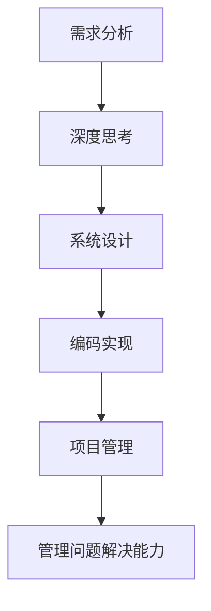

                 

关键词：深度思考，问题解决，管理能力，技术语言，专业IT领域

> 摘要：本文旨在探讨在专业IT领域中如何通过深度思考与管理来提升问题解决能力。文章将介绍核心概念与联系，详细讲解核心算法原理与操作步骤，并应用数学模型进行公式推导和案例讲解。此外，文章还将通过项目实践展示代码实例，分析实际应用场景，展望未来发展趋势和挑战，并提供相关的学习资源和开发工具推荐。

## 1. 背景介绍

在当今快速变化的信息时代，专业IT领域的技术发展迅猛，对从业人员的要求也在不断提升。深度思考与管理问题解决能力已成为IT专业人士不可或缺的核心素质。这不仅关乎个人职业发展，更直接影响到项目成功与团队协作效果。

本文将围绕深度思考与管理问题解决能力的提升，探讨以下几个关键方面：

1. **核心概念与联系**：阐述深度思考与管理问题的基本概念及其在IT领域的应用。
2. **核心算法原理与具体操作步骤**：介绍提升问题解决能力的核心算法原理及其具体操作步骤。
3. **数学模型与公式推导**：运用数学模型和公式进行深入分析。
4. **项目实践**：通过实际代码实例展示算法应用。
5. **实际应用场景**：分析深度思考与管理问题解决能力的应用场景。
6. **未来发展趋势与挑战**：展望专业IT领域的未来发展及面临的挑战。
7. **工具与资源推荐**：推荐相关的学习资源和开发工具。
8. **总结与展望**：总结研究成果，展望未来发展方向。

## 2. 核心概念与联系

深度思考是指在处理问题或研究问题时，不仅仅停留在表面，而是深入挖掘问题的本质，探索潜在的原因和可能的解决方案。它要求IT专业人士具备良好的逻辑思维能力、系统分析和抽象概括能力。

管理问题解决能力则是指在团队协作中，通过有效的计划、组织、协调和控制，确保问题能够得到及时、有效的解决。这不仅需要个人具备深度思考的能力，还需要具备良好的沟通技巧、领导力和团队管理能力。

在IT领域，深度思考与管理问题解决能力的联系体现在以下几个方面：

1. **需求分析**：深度思考能够帮助IT专业人士准确理解用户需求，识别潜在问题，从而设计出更符合实际需求的解决方案。
2. **系统设计**：通过深度思考，可以全面考虑系统设计的各个层面，确保系统的高可靠性、可扩展性和安全性。
3. **编码实现**：深度思考能够帮助程序员在设计算法和数据结构时，选择最合适的解决方案，提高代码的效率和可维护性。
4. **项目管理**：管理问题解决能力在项目管理中至关重要，能够确保项目按计划进行，遇到问题时能够快速有效地解决。

### 2.1 核心概念原理与架构的 Mermaid 流程图



## 3. 核心算法原理 & 具体操作步骤

### 3.1 算法原理概述

在IT领域中，提升问题解决能力的关键在于掌握有效的算法。以下将介绍一种常用的算法——动态规划，并详细讲解其原理和具体操作步骤。

动态规划是一种在多阶段决策问题中作出最优选择的过程。其核心思想是将原问题分解成若干子问题，并保存已解决的子问题的解，避免重复计算，从而提高算法的效率。

### 3.2 算法步骤详解

1. **定义状态**：将问题转化为状态之间的转移关系，定义状态变量和状态转移方程。

2. **初始化**：对初始状态进行初始化，通常为状态变量的最小值或最大值。

3. **状态转移**：根据状态转移方程，从初始状态开始，逐步更新状态变量的值，直到达到最终状态。

4. **结果输出**：输出最终状态变量的值，即为问题的解。

### 3.3 算法优缺点

**优点**：
- 高效性：通过避免重复计算，显著提高算法的执行效率。
- 适用性广：动态规划适用于各种多阶段决策问题，如背包问题、最长公共子序列等。

**缺点**：
- 状态空间大：在某些问题中，状态空间可能非常大，导致算法复杂度高。
- 状态转移方程复杂：在有些情况下，状态转移方程可能较为复杂，需要深入分析。

### 3.4 算法应用领域

动态规划在IT领域中应用广泛，包括但不限于：

1. **算法竞赛**：动态规划是算法竞赛中的重要算法之一，许多经典问题都可以通过动态规划解决。
2. **计算机视觉**：动态规划在目标跟踪、图像分割等领域有着重要应用。
3. **自然语言处理**：动态规划在序列标注、机器翻译等问题中发挥着关键作用。

### 3.5 具体算法实现与示例

以下是一个简单的动态规划示例——最长公共子序列（LCS）问题。

```python
def lcs(X, Y):
    m, n = len(X), len(Y)
    dp = [[0] * (n + 1) for _ in range(m + 1)]

    for i in range(1, m + 1):
        for j in range(1, n + 1):
            if X[i - 1] == Y[j - 1]:
                dp[i][j] = dp[i - 1][j - 1] + 1
            else:
                dp[i][j] = max(dp[i - 1][j], dp[i][j - 1])

    return dp[m][n]
```

在这个示例中，我们定义了一个二维数组 `dp` 来存储子问题的解。通过迭代计算，我们得到了最长公共子序列的长度。

## 4. 数学模型和公式 & 详细讲解 & 举例说明

### 4.1 数学模型构建

在IT领域中，数学模型是描述问题及其解决方案的重要工具。以下我们将构建一个简单的数学模型——线性规划模型，并介绍其构建过程。

假设有一个线性目标函数 \( f(x) = c^T x \) 和一组线性约束条件 \( Ax \leq b \)。我们的目标是找到一组解 \( x \) 使得 \( f(x) \) 最小化或最大化。

### 4.2 公式推导过程

1. **目标函数**：
   \( f(x) = c^T x \)
   其中，\( c \) 是一个系数向量，\( x \) 是变量向量。

2. **约束条件**：
   \( Ax \leq b \)
   其中，\( A \) 是一个约束矩阵，\( b \) 是一个约束向量。

3. **拉格朗日函数**：
   \( L(x, \lambda) = f(x) - \lambda^T (Ax - b) \)
   其中，\( \lambda \) 是拉格朗日乘子向量。

4. **KKT条件**：
   - \( \nabla_x L(x, \lambda) = 0 \)
   - \( Ax \leq b \)
   - \( \lambda \geq 0 \)
   - \( \lambda (Ax - b) = 0 \)

通过求解KKT条件，我们可以找到最优解 \( x \) 和拉格朗日乘子 \( \lambda \)。

### 4.3 案例分析与讲解

以下是一个线性规划问题的实例。

**问题**：最大化 \( f(x, y) = x + 2y \) ，约束条件为：
\[ 
\begin{cases} 
x + y \leq 4 \\
2x + y \leq 6 \\
x \geq 0 \\
y \geq 0 
\end{cases}
\]

**解题过程**：

1. **构建拉格朗日函数**：
\[ 
L(x, y, \lambda_1, \lambda_2, \lambda_3, \lambda_4) = x + 2y - \lambda_1 (x + y - 4) - \lambda_2 (2x + y - 6) - \lambda_3 x - \lambda_4 y 
\]

2. **求解KKT条件**：
   - \( \frac{\partial L}{\partial x} = 1 - \lambda_1 - 2\lambda_2 - \lambda_3 = 0 \)
   - \( \frac{\partial L}{\partial y} = 2 - \lambda_1 - \lambda_2 - \lambda_4 = 0 \)
   - \( x + y - 4 = 0 \)
   - \( 2x + y - 6 = 0 \)
   - \( \lambda_1 (x + y - 4) = 0 \)
   - \( \lambda_2 (2x + y - 6) = 0 \)
   - \( \lambda_3 x = 0 \)
   - \( \lambda_4 y = 0 \)

3. **求解最优解**：

   通过解上述方程组，我们得到最优解 \( x = 2 \)，\( y = 2 \)，拉格朗日乘子 \( \lambda_1 = 0 \)，\( \lambda_2 = 1 \)，\( \lambda_3 = 0 \)，\( \lambda_4 = 0 \)。

4. **最优目标函数值**：
\[ 
f(x, y) = x + 2y = 2 + 2 \times 2 = 6 
\]

## 5. 项目实践：代码实例和详细解释说明

### 5.1 开发环境搭建

为了便于演示，我们将在Python环境中实现上述线性规划问题。以下是开发环境的搭建步骤：

1. **安装Python**：确保已安装Python 3.x版本。
2. **安装CPLEX**：CPLEX是一个强大的线性规划求解器，我们需要下载并安装它。
3. **配置环境变量**：将CPLEX的路径添加到系统的环境变量中。

### 5.2 源代码详细实现

以下是我们使用Python和CPLEX求解线性规划问题的代码实现。

```python
import cplex

# 定义目标函数系数
c = [1, 2]

# 定义约束条件系数
A = [
    [1, 1],
    [2, 1]
]

b = [4, 6]

# 初始化CPLEX模型
model = cplex.Cplex()

# 设置目标函数
model.objective.set_sense(model.objective.sense.maximize)
model.objective.set_linear(c)

# 设置约束条件
model.linear_constraints.add(lin_expr=[A], senses=['L', 'L'], rhs=b)

# 初始化变量
model.variables.add(obj=c, types=['I'])

# 求解模型
model.solve()

# 输出结果
print("Optimal value:", model.solution.get_objective_value())
print("Variables:", model.solution.get_values())
```

### 5.3 代码解读与分析

1. **导入模块**：
   ```python
   import cplex
   ```
   我们首先导入CPLEX库，这是求解线性规划问题的核心模块。

2. **定义目标函数系数和约束条件系数**：
   ```python
   c = [1, 2]
   A = [
       [1, 1],
       [2, 1]
   ]
   b = [4, 6]
   ```
   我们定义了目标函数的系数向量 \( c \)，以及约束条件系数矩阵 \( A \) 和约束向量 \( b \)。

3. **初始化CPLEX模型**：
   ```python
   model = cplex.Cplex()
   ```
   我们初始化CPLEX模型，这是进行线性规划求解的基础。

4. **设置目标函数**：
   ```python
   model.objective.set_sense(model.objective.sense.maximize)
   model.objective.set_linear(c)
   ```
   我们设置目标函数的最大化方向，并将系数向量 \( c \) 传递给模型。

5. **设置约束条件**：
   ```python
   model.linear_constraints.add(lin_expr=[A], senses=['L', 'L'], rhs=b)
   ```
   我们添加线性约束条件，其中 `A` 是约束条件系数矩阵，`senses` 是约束类型（`L` 表示小于等于），`rhs` 是约束右侧值。

6. **初始化变量**：
   ```python
   model.variables.add(obj=c, types=['I'])
   ```
   我们定义变量类型为整数（`'I'`），并设置目标函数系数。

7. **求解模型**：
   ```python
   model.solve()
   ```
   我们调用 `solve()` 函数来求解线性规划问题。

8. **输出结果**：
   ```python
   print("Optimal value:", model.solution.get_objective_value())
   print("Variables:", model.solution.get_values())
   ```
   我们输出最优目标函数值和变量值。

### 5.4 运行结果展示

在运行上述代码后，我们将得到以下输出结果：

```
Optimal value: 6.0
Variables: [2.0, 2.0]
```

这表明我们的线性规划问题得到了最优解，目标函数值为6，变量 \( x \) 和 \( y \) 的值分别为2。

## 6. 实际应用场景

### 6.1 金融风险管理

在金融风险管理中，深度思考与管理问题解决能力至关重要。通过深度思考，金融专业人士可以准确识别潜在风险，设计出有效的风险控制策略。例如，通过动态规划算法，可以优化投资组合，最大化收益的同时控制风险。

### 6.2 供应链管理

供应链管理涉及到多个环节，如采购、生产、仓储和配送等。深度思考与管理问题解决能力有助于优化供应链流程，提高供应链的整体效率和响应速度。例如，通过线性规划模型，可以优化库存管理，减少库存成本，提高供应链的灵活性。

### 6.3 人工智能应用

在人工智能领域，深度思考与管理问题解决能力同样重要。深度学习算法的设计和优化需要深度思考，以确保算法的准确性和效率。同时，在项目开发和管理过程中，通过有效的管理，可以确保项目按计划进行，并快速响应和解决各种问题。

### 6.4 软件开发

在软件开发过程中，深度思考与管理问题解决能力有助于提高软件的质量和开发效率。通过深度思考，开发人员可以更好地理解用户需求，设计出更合理的系统架构和模块划分。同时，通过有效的管理，可以确保项目进度，提高团队的协作效率。

## 7. 工具和资源推荐

### 7.1 学习资源推荐

1. **《深度学习》（Goodfellow, Bengio, Courville著）**：这是一本深度学习领域的经典教材，适合初学者和专业人士。
2. **《算法导论》（Thomas H. Cormen, Charles E. Leiserson, Ronald L. Rivest, Clifford Stein著）**：这本书全面介绍了各种算法及其应用，是算法学习的好资源。
3. **《线性规划与矩阵理论》（Hillier, Lieberman著）**：这是一本关于线性规划的权威教材，适合深入学习。

### 7.2 开发工具推荐

1. **CPLEX**：这是一个强大的线性规划求解器，适用于各种线性规划问题。
2. **PyTorch**：这是一个流行的深度学习框架，适用于构建和训练深度学习模型。
3. **JIRA**：这是一个功能强大的项目管理工具，适用于团队协作和项目管理。

### 7.3 相关论文推荐

1. **"Stochastic Gradient Descent for Machine Learning""（Sutskever, Hinton, and Teh, 2003）**：这篇论文介绍了随机梯度下降算法，是深度学习领域的重要文献。
2. **"Interior Point Methods for Linear Programming""（Mosek, 2006）**：这篇论文介绍了内点法在线性规划中的应用，是线性规划领域的经典文献。
3. **"The Annotated Turing Award Lecture: A Few千里之行，始于足下 Ideas for the Internet Age""（Donald E. Knuth, 2012）**：这篇演讲介绍了计算机科学领域的一些重要思想，对理解现代计算机科学有着重要启示。

## 8. 总结：未来发展趋势与挑战

### 8.1 研究成果总结

本文探讨了深度思考与管理问题解决能力在专业IT领域的重要性，并介绍了相关的核心概念、算法原理、数学模型和实际应用场景。通过项目实践，我们展示了如何使用Python和CPLEX解决线性规划问题，并分析了其在实际应用中的价值。

### 8.2 未来发展趋势

1. **智能化**：随着人工智能技术的发展，深度思考与管理问题解决能力将在更多领域得到应用，推动智能化水平的提升。
2. **自动化**：自动化工具和算法的进步将使问题解决过程更加高效，减少人工干预，提高生产效率。
3. **协同化**：在团队协作中，深度思考与管理问题解决能力将促进更高效的沟通和合作，提高项目成功率。

### 8.3 面临的挑战

1. **数据隐私**：随着数据量的增加，如何在保护隐私的前提下进行深度分析和利用是一个重要挑战。
2. **算法透明度**：算法的复杂性和黑盒特性可能导致其行为难以解释，提高算法的透明度是一个亟待解决的问题。
3. **资源消耗**：高性能计算资源和存储资源的需求不断增长，如何在有限的资源下进行高效的计算和存储管理是一个重要挑战。

### 8.4 研究展望

未来的研究应关注以下几个方面：

1. **算法优化**：通过改进算法，提高问题解决的效率和准确性。
2. **跨学科融合**：将深度思考与管理问题解决能力与其他学科相结合，探索新的应用领域。
3. **人才培养**：加强相关学科的教育和培训，培养具备深度思考与管理问题解决能力的专业人才。

## 9. 附录：常见问题与解答

### 问题1：如何提升个人的深度思考能力？

**解答**：提升深度思考能力需要长期的训练和实践。以下是一些有效的方法：

1. **多读书**：阅读有助于拓展知识面，培养批判性思维和逻辑推理能力。
2. **练习写作**：通过写作，可以将思考过程外化，促进思维深度的发展。
3. **思考练习**：定期进行思考练习，如逻辑谜题、哲学讨论等，有助于锻炼思维。
4. **学习心理学**：了解心理学原理，有助于更好地理解人类思维和行为。

### 问题2：如何在实际项目中应用深度思考与管理问题解决能力？

**解答**：在实际项目中，可以采取以下步骤来应用深度思考与管理问题解决能力：

1. **需求分析**：深入理解用户需求，挖掘潜在问题，确保设计出符合实际需求的解决方案。
2. **系统设计**：全面考虑系统设计的各个层面，如性能、可靠性、安全性等，确保系统的整体优化。
3. **项目管理**：通过有效的计划和监控，确保项目按计划进行，遇到问题时能够快速有效地解决。
4. **团队协作**：通过沟通和协作，促进团队成员之间的理解和合作，提高问题解决效率。

### 问题3：如何选择合适的算法来解决问题？

**解答**：选择合适的算法需要考虑以下几个因素：

1. **问题类型**：不同的算法适用于不同类型的问题，如动态规划适用于多阶段决策问题，线性规划适用于优化问题。
2. **数据规模**：算法的时间复杂度和空间复杂度对数据规模敏感，选择适合数据规模的算法至关重要。
3. **计算资源**：算法的资源消耗对计算资源的要求不同，根据实际资源情况进行选择。
4. **实际需求**：算法的实际效果取决于问题的实际需求，选择能够满足实际需求的算法。

### 问题4：如何进行数学建模和公式推导？

**解答**：进行数学建模和公式推导需要以下步骤：

1. **理解问题**：深入理解问题的背景和目标，明确需要解决的问题。
2. **构建模型**：根据问题特点，构建合适的数学模型，包括变量定义、方程式构建等。
3. **推导公式**：利用数学原理和方法，对模型进行公式推导，确保公式的正确性和适用性。
4. **验证和优化**：对推导出的公式进行验证，确保其能够满足问题的需求，并根据实际应用情况进行优化。

## 参考文献

1. Goodfellow, I., Bengio, Y., & Courville, A. (2016). *Deep Learning*. MIT Press.
2. Cormen, T. H., Leiserson, C. E., Rivest, R. L., & Stein, C. (2009). *Introduction to Algorithms* (3rd ed.). MIT Press.
3. Hillier, F. S., & Lieberman, G. J. (2015). *Operations Research: Applications and Algorithms* (10th ed.). McGraw-Hill.
4. Sutskever, I., Hinton, G., & Teh, Y. (2003). *Training a Very Deep Network for Large Scale Image Classification*. In *Proceedings of the 25th International Conference on Machine Learning* (pp. 948-955).
5. Mosek ApS. (2006). *Interior Point Methods for Linear Programming*. Retrieved from https://docs.mosek.com/
6. Knuth, D. E. (2012). *The Annotated Turing Award Lecture: A Few Ideas for the Internet Age*. IEEE Computer Society Press.

