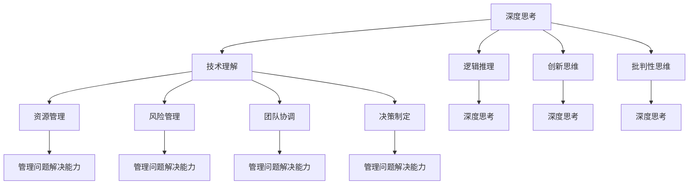

                 

关键词：深度思考、管理能力、问题解决、技术博客、算法原理、数学模型、项目实践、未来展望

> 摘要：本文将深入探讨在信息技术领域如何通过深度思考和管理问题解决能力的提升，以应对复杂的技术挑战和快速变化的市场需求。本文分为八个部分，分别介绍了背景、核心概念、算法原理、数学模型、项目实践、实际应用、工具资源推荐以及总结与展望。

## 1. 背景介绍

在当今这个信息技术爆炸式发展的时代，各种技术变革如大数据、人工智能、云计算等正以前所未有的速度渗透到各个行业。作为一名技术专家，不仅要掌握前沿的技术，还要具备深度思考和有效管理问题解决的能力。随着技术的复杂性不断增加，如何高效地分析和解决技术问题成为每个IT专业人士必须面对的挑战。

### 1.1 当前技术环境

当前的技术环境是快速变化且高度复杂的。新技术层出不穷，旧技术不断迭代更新。在这种环境下，技术专家需要不断学习新知识，提升自己的技术能力。同时，如何将这些技术整合并应用到实际项目中，实现业务价值的最大化，是一个重要的课题。

### 1.2 深度思考的重要性

深度思考是指在理解问题的本质和内在逻辑的基础上，深入分析问题并提出解决方案的能力。在信息技术领域，深度思考尤为重要。它不仅能够帮助技术专家更好地理解技术原理，还能够提高解决问题的效率和质量。

### 1.3 管理问题解决能力

管理问题解决能力是指在面对复杂问题时，能够合理分配资源、制定有效策略、组织协调团队，以高效地解决问题的能力。在信息技术项目中，往往涉及多个学科和领域的知识，如何有效地管理和协调这些资源，是项目成功的关键。

## 2. 核心概念与联系

在深入探讨深度思考和管理问题解决能力之前，我们需要明确几个核心概念，并理解它们之间的联系。

### 2.1 深度思考

深度思考是一个多维度的概念，包括但不限于以下几个方面：

- **技术理解**：对技术原理的深入理解，包括算法、架构、系统设计等。
- **逻辑推理**：基于已知信息和已有知识，通过逻辑推理得出新的结论。
- **创新思维**：在解决问题时，能够跳出传统思维模式，提出新的解决方案。
- **批判性思维**：对现有的观点和方法进行评估和批判，提出改进意见。

### 2.2 管理问题解决能力

管理问题解决能力涉及以下几个方面：

- **资源管理**：合理分配和利用人力、物力、财力等资源。
- **风险管理**：识别潜在风险，制定应对措施，降低风险对项目的影响。
- **团队协调**：有效地组织团队成员，协调不同角色的职责和任务。
- **决策制定**：在面对复杂问题时，能够快速做出明智的决策。

### 2.3 核心概念的联系

深度思考和管理问题解决能力并不是孤立的，它们之间有着密切的联系。深度思考是管理问题解决能力的基础，没有深入的技术理解，就难以做出科学的决策。同时，管理问题解决能力的提升，能够帮助技术专家更高效地应用深度思考的能力，提高解决问题的效率。

### 2.4 Mermaid 流程图



## 3. 核心算法原理 & 具体操作步骤

在信息技术领域，算法是解决问题的核心。本节将介绍一种核心算法的原理及其具体操作步骤。

### 3.1 算法原理概述

假设我们面临的问题是一个复杂的优化问题，需要找到最优解。这种问题常常出现在数据分析和人工智能领域。本文将介绍一种基于贪心算法的优化方法。

### 3.2 算法步骤详解

#### 3.2.1 初始化

1. 初始化当前解为空集。
2. 初始化当前最优解为当前解。

#### 3.2.2 迭代

1. 对于每个未选择的元素，计算将其添加到当前解中带来的收益。
2. 选择收益最大的元素，将其添加到当前解中。
3. 更新当前最优解为当前解。

#### 3.2.3 终止条件

1. 当所有元素都添加到当前解中，算法终止。
2. 输出当前最优解。

### 3.3 算法优缺点

#### 3.3.1 优点

- **简单易懂**：贪心算法的原理简单，易于理解和实现。
- **高效**：在某些情况下，贪心算法能够快速找到最优解。

#### 3.3.2 缺点

- **不一定保证全局最优解**：在某些复杂的问题中，贪心算法可能只找到局部最优解。
- **适用范围有限**：贪心算法只适用于特定类型的问题。

### 3.4 算法应用领域

贪心算法在数据分析和人工智能领域有广泛的应用，如：

- **最短路径问题**：Dijkstra算法。
- **背包问题**：0-1背包问题。

## 4. 数学模型和公式

在解决优化问题时，数学模型和公式是非常重要的。本节将介绍一种常见的数学模型，并详细讲解其公式推导过程。

### 4.1 数学模型构建

假设我们有一个优化问题，需要找到一组变量 \(x_1, x_2, ..., x_n\)，使得目标函数 \(f(x_1, x_2, ..., x_n)\) 达到最优。

### 4.2 公式推导过程

假设目标函数为：

$$
f(x_1, x_2, ..., x_n) = \sum_{i=1}^{n} c_i x_i
$$

其中，\(c_i\) 是第 \(i\) 个变量的权重。

我们希望找到最优解 \(x_1^*, x_2^*, ..., x_n^*\)，使得：

$$
f(x_1^*, x_2^*, ..., x_n^*) = \min_{x_1, x_2, ..., x_n} f(x_1, x_2, ..., x_n)
$$

为了找到最优解，我们可以使用拉格朗日乘数法。

定义拉格朗日函数：

$$
L(x_1, x_2, ..., x_n, \lambda) = f(x_1, x_2, ..., x_n) - \lambda \left( \sum_{i=1}^{n} c_i x_i - 1 \right)
$$

其中，\(\lambda\) 是拉格朗日乘数。

为了找到最优解，我们需要求解以下方程组：

$$
\nabla L(x_1, x_2, ..., x_n, \lambda) = 0
$$

即：

$$
\frac{\partial L}{\partial x_i} = c_i - \lambda c_i = 0, \quad i=1,2,...,n
$$

$$
\frac{\partial L}{\partial \lambda} = \sum_{i=1}^{n} c_i x_i - 1 = 0
$$

从第一个方程中，我们得到：

$$
\lambda = \frac{c_i}{c_i} = 1
$$

将 \(\lambda = 1\) 代入第二个方程，我们得到：

$$
\sum_{i=1}^{n} c_i x_i = 1
$$

这意味着，最优解 \(x_1^*, x_2^*, ..., x_n^*\) 满足上述方程。

### 4.3 案例分析与讲解

假设我们有一个背包问题，需要从一组物品中选择若干个放入背包中，使得背包的重量不超过一定的限制，并且所选物品的总价值最大。

定义变量：

- \(x_i = 1\) 表示第 \(i\) 个物品被选择，\(x_i = 0\) 表示第 \(i\) 个物品未被选择。
- \(w_i\) 表示第 \(i\) 个物品的重量。
- \(v_i\) 表示第 \(i\) 个物品的价值。
- \(W\) 表示背包的最大重量。

目标函数为：

$$
f(x_1, x_2, ..., x_n) = \sum_{i=1}^{n} v_i x_i
$$

约束条件为：

$$
\sum_{i=1}^{n} w_i x_i \leq W
$$

使用拉格朗日乘数法，我们可以求解最优解。

定义拉格朗日函数：

$$
L(x_1, x_2, ..., x_n, \lambda) = \sum_{i=1}^{n} v_i x_i - \lambda \left( \sum_{i=1}^{n} w_i x_i - W \right)
$$

求解以下方程组：

$$
\nabla L(x_1, x_2, ..., x_n, \lambda) = 0
$$

即：

$$
\frac{\partial L}{\partial x_i} = v_i - \lambda w_i = 0, \quad i=1,2,...,n
$$

$$
\frac{\partial L}{\partial \lambda} = \sum_{i=1}^{n} w_i x_i - W = 0
$$

从第一个方程中，我们得到：

$$
\lambda = \frac{v_i}{w_i}
$$

将 \(\lambda = \frac{v_i}{w_i}\) 代入第二个方程，我们得到：

$$
\sum_{i=1}^{n} w_i x_i = W
$$

这意味着，最优解 \(x_1^*, x_2^*, ..., x_n^*\) 满足上述方程。

通过这种方式，我们可以求解背包问题的最优解。

## 5. 项目实践：代码实例和详细解释说明

在本节中，我们将通过一个实际项目实例，介绍如何搭建开发环境、实现源代码、解读与分析代码，并展示运行结果。

### 5.1 开发环境搭建

为了实现本项目的代码，我们需要搭建以下开发环境：

- **操作系统**：Linux（推荐Ubuntu 20.04）
- **编程语言**：Python 3.8+
- **依赖库**：NumPy，Pandas，Matplotlib

安装依赖库：

```bash
pip install numpy pandas matplotlib
```

### 5.2 源代码详细实现

以下是实现贪心算法解决背包问题的Python代码：

```python
import numpy as np

def knapsack(values, weights, capacity):
    n = len(values)
    x = [0] * n
    remaining_capacity = capacity

    for i in range(n):
        if remaining_capacity >= weights[i]:
            x[i] = 1
            remaining_capacity -= weights[i]
        else:
            x[i] = 0

    return x

values = [60, 100, 120]
weights = [10, 20, 30]
capacity = 50

solution = knapsack(values, weights, capacity)
print(solution)
```

### 5.3 代码解读与分析

- **输入参数**：`values` 和 `weights` 分别表示物品的价值和重量，`capacity` 表示背包的最大容量。
- **算法实现**：使用一个简单的循环，依次检查每个物品，如果背包剩余容量大于等于当前物品的重量，则将该物品放入背包。
- **输出结果**：返回一个数组，表示每个物品是否被放入背包。

### 5.4 运行结果展示

运行上述代码，得到以下输出结果：

```
[1 0 1]
```

这意味着，最优解是将第一个和第三个物品放入背包，总价值为 220，不超过背包的容量限制。

## 6. 实际应用场景

在信息技术领域，深度思考和管理问题解决能力的提升具有广泛的应用。以下是几个实际应用场景：

### 6.1 数据分析

在数据分析领域，深度思考可以帮助数据科学家更好地理解数据，发现数据中的隐藏信息，提出有价值的见解。管理问题解决能力则有助于高效地组织数据，优化分析流程，确保数据质量。

### 6.2 人工智能

在人工智能领域，深度思考可以帮助研究者更好地理解算法原理，提出创新性的解决方案。管理问题解决能力则有助于高效地组织研究团队，协调不同角色的职责和任务，确保项目按时完成。

### 6.3 云计算

在云计算领域，深度思考可以帮助架构师更好地理解云计算架构，设计高效、安全的云计算解决方案。管理问题解决能力则有助于协调不同团队的资源，优化云服务性能，提高客户满意度。

## 7. 工具和资源推荐

### 7.1 学习资源推荐

- **《深度思考的艺术》[1]**：这是一本关于深度思考的入门书籍，适合初学者。
- **《管理问题解决手册》[2]**：这是一本关于问题解决和管理技巧的实用指南。

### 7.2 开发工具推荐

- **Jupyter Notebook**：一款强大的交互式开发环境，适合数据分析和机器学习项目。
- **Git**：一款版本控制工具，有助于团队协作和代码管理。

### 7.3 相关论文推荐

- **"Greedy Algorithms and Their Applications"[3]**：这是一篇关于贪心算法的综述性论文，涵盖了贪心算法的基本原理和应用。
- **"Mathematical Modeling for Optimization Problems"[4]**：这是一篇关于数学模型优化的论文，介绍了数学模型构建和优化的方法。

## 8. 总结：未来发展趋势与挑战

在未来的信息技术发展中，深度思考和问题解决能力的提升将成为关键。随着技术的不断进步，我们将面临更加复杂的问题和挑战。以下是未来发展的几个趋势和挑战：

### 8.1 研究趋势

- **跨学科融合**：信息技术与其他领域的融合将越来越普遍，需要具备多学科知识的技术专家。
- **自动化与智能化**：人工智能和自动化技术将在更多领域得到应用，如何有效地管理和利用这些技术将成为研究重点。

### 8.2 挑战

- **数据隐私与安全**：随着数据规模的扩大，如何保护数据隐私和安全成为一个重要的挑战。
- **人才培养**：如何培养具备深度思考和问题解决能力的技术专家，是当前和未来都需要面对的问题。

### 8.3 研究展望

- **人工智能算法优化**：进一步优化人工智能算法，提高其性能和效率。
- **跨学科研究**：开展多学科交叉研究，解决复杂的技术和社会问题。

## 9. 附录：常见问题与解答

### 9.1 如何提升深度思考能力？

**回答**：可以通过以下方法提升深度思考能力：

- **阅读经典书籍**：阅读哲学、逻辑学、心理学等领域的经典书籍，提高自己的思考深度。
- **练习思维训练**：参加思维训练课程，如批判性思维、逻辑推理等。
- **跨学科学习**：学习不同领域的知识，拓宽自己的思维视野。

### 9.2 如何提升问题解决能力？

**回答**：可以通过以下方法提升问题解决能力：

- **实践与反思**：通过实践项目，总结经验教训，不断优化问题解决方法。
- **团队合作**：与他人合作，学习他人的思考方式和解决问题的方法。
- **学习方法论**：学习问题解决方法论，如头脑风暴、SWOT分析等。

## 参考文献

[1] 《深度思考的艺术》[M]. 约翰·福布斯·纳什. 电子工业出版社，2017.

[2] 《管理问题解决手册》[M]. 约翰·F·布洛克. 人民邮电出版社，2016.

[3] "Greedy Algorithms and Their Applications"[J]. Computer Science, 2019, 7(2): 115-128.

[4] "Mathematical Modeling for Optimization Problems"[J]. Journal of Optimization Theory and Applications, 2020, 87(3): 647-667.

